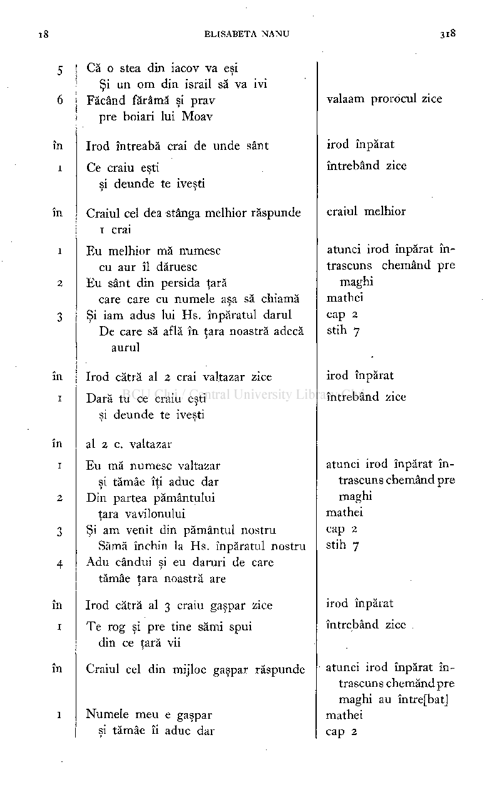

E U S ABET A NAN U SI»

Că o stea din iacov va eşi

Şi un om din israil să va ivi Făcând fărâmă şi prav

valaam prordcul zice

pre boiari Iui Moav

irod înpărat întrebând zice

Irod întreabă crai de unde sânt Ce craiu eşti

şi deunde te iveşti Craiul cel dea stânga melhior răspunde 1 crai Eu melhior mă mimesc cu aur îl dăruesc Eu sânt din persida ţară

craiul melhior

atunci irod înpărat întrascuns chemând pre

maghi mathei cap 2 stih 7

care care cu numele aşa să chiamă Şi iam adus lui Hs. înpăratul darul

De care să află în ţara noastră adecă aurul

irod înpărat întrebând zice

- Irod cătră al 2 crai valtazar zice

Dară tu ce craiu eşti şi deunde te iveşti

al 2 c. valtazar Eu mă numesc valtazar

şi tămâe îţi aduc dar Din partea pământului

ţara vavilonului Şi am venit din pământul nostru

Samă închin la Hs. înpăratul nostru Adu cândui şi eu daruri de care

tămâe ţara noastră are

- Irod cătră al 3 craiu gaşpar zice

atunci irod înpărat întrascuns chemând pre maghi

mathei cap 2 stih 7

irod înpărat întrebând zice

Te rog şi pre tine sămi spui din ce ţară vii

atunci irod înpărat întrascuns chemând pre maghi au între[bat]

Craiul cel din mijloc gaşpar răspunde

Numele meu e gaşpar şi tămâe îi aduc dar

mathei cap 2

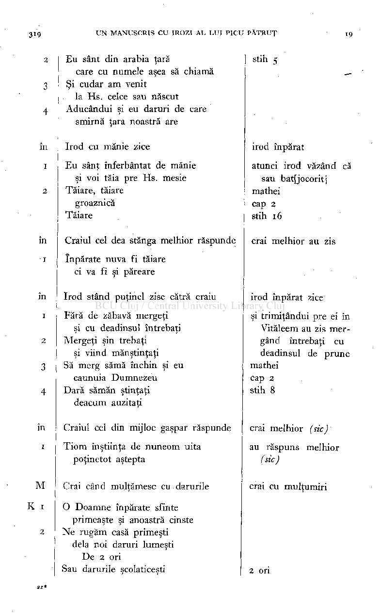

stih 5

Eu sânt din arabia ţară

care cu numele aşea să chiamă Şi cudar am venit

la Hs. celce sau născut Aducândui şi eu daruri de care smirnă ţara noastră are

Irod cu manie zice Eu sânt înferbântat de manie şi voi tăia pre Hs. mesie Tăiare, tăiare groaznică Tăiare

irod înpărat atunci irod văzând că

sau bat[jocorit] mathei cap 2 stih 16

Craiul cel dea stănga melhior răspunde înpărate nuva fi tăiare ci va fi şi păreare

crai melhior au zis

Irod stând puţinei zise cătră craiu Fără de zăbavă mergeţi

irod înpărat zice şi trimiţândui pre ei în

şi cu deadinsul întrebaţi Mergeţi şin trebaţi

Vităleem au zis mergând întrebaţi cu deadinsul de prunc

şi viind mănştinţaţi Să merg samă închin şi eu

mathei cap 2 stih 8

caunuia Dumnezeu Dară sămăn ştinţaţi deacum auzitaţi

Craiul cel din mijloc gaşpar răspunde Tiom înştiinţa de nuneom uita

crai melhior (sic)' au răspuns melhior

( sic )

poţinetot aştepta Crai când mu.lţămesc cu darurile O Doamne înpărate sfinte

crai cu mulţumiri

primeaşte şi anoastră cinste Ne rugăm casă primeşti

delà noi daruri lumeşti De 2 ori Sau darurile scolaticesti

2 on

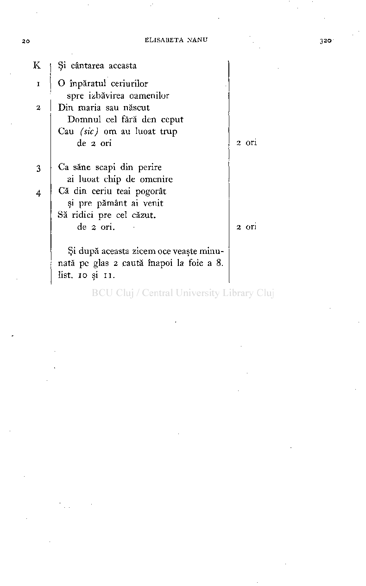

Şi cântarea aceasta O înpăratul ceriurilor

spre izbăvirea oamenilor Din maria sau născut

Domnul cel fără den ceput Cau (sic) om au luoat trup

de 2 ori

Ca săne scapi din perire

ai luoat chip de omenire Că din ceriu teai pogorât

şi pre pământ ai venit Să ridici pre cel căzut,

de 2 ori.

Şi după aceasta zicem oce veaşte minunată pe glas 2 caută înapoi la foie a 8. list. io şi II .

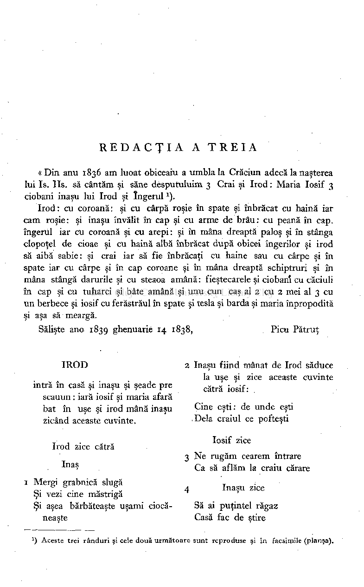

#### REDACŢI A A TREI A

« Din anu 1836 am luoat obiceaiu a umbla la Crăciun adecă la naşterea lui Is. Hs. să cântăm şi săne desputuluim 3 Crai şi Irod : Maria Iosif 3 ciobani inaşu lui Irod şi îngerul

).

1

Irod: cu coroană: şi cu cârpă roşie în spate şi înbrăcat cu haină iar cam roşie: şi inaşu învălit în cap şi cu arme de brâu: cu peana în cap. îngerul iar cu coroană şi cu arepi: şi în mâna dreaptă paloş şi în stânga clopoţel de cioae şi cu haină albă înbrăcat după obicei îngerilor şi irod să aibă sabie: şi crai iar să fie înbrăcaţi cu haine sau cu cârpe şi în spate iar cu cârpe şi în cap coroane şi în mâna dreaptă schiptruri şi în mâna stângă darurile şi cu steaoa amână: fieştecarele şi ciobani cu căciuli în cap şi cu tuharci şi bâte amână şi unu cun caş al 2 cu 2 mei al 3 cu un berbece şi iosif cu ferăstrăul în spate şi tesla şi barda şi maria înpropodită şi aşa să meargă.

Sălişte ano 1839 ghenuarie 14 1838, Picu Pătruţ

IROD

2 Inaşu fiind mânat de Irod săduce la uşe şi zice aceaste cuvinte cătră iosif :

intră în casă şi inaşu şi şeade pre scauun : iară iosif şi maria afară bat în uşe şi irod mână inaşu zicând aceaste cuvinte.

Cine eşti : de unde eşti «Delà craiul ce pofteşti

Iosif zice

Irod zice cătră Inaş

- 3 Ne rugăm cearem intrare Ca să aflăm la craiu cărare
- 4 Inaşu zice

1 Mergi grabnică slugă Şi vezi cine măstrigă Şi aşea bărbăteaşte uşami ciocă-

Să ai puţintel răgaz Casă fac de stire

neaste

###### *) Aceste trei rânduri şi cele două următoare sunt reproduse şi în facsimile (planşa).

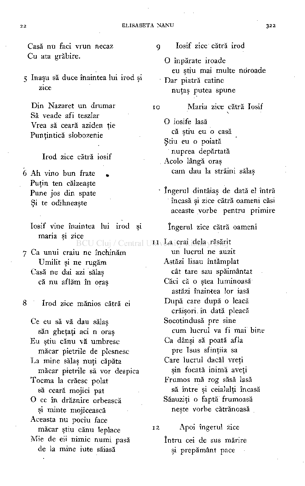

- 9 Iosif zice cătră irod

O înpărate iroade

eu ştiu mai multe nöroade Dar piatră catine

nuţaş putea spune

- 10 Maria zice cătră Iosif

O iosife lasă

că ştiu eu o casă Ştiu eu o poiată

nuprea depărtată Acolo lângă oraş

cam dau la străini sălaş

" îngerul dintâiaş de dată el întră încasă şi zice cătră oameni căsi aceaste vorbe pentru primire

îngerul zice cătră oameni

- 11 La crai delà răsărit un lucrul ne auzit

Astăzi lisau întâmplat

cât tare sau spăimântat Căci că o ştea luminoasă

astăzi înaintea lor iasă După care după o leacă

crăişori.în dată pleacă Socotindusă pre sine

cum lucrul va fi mai bine Ca dânşi să poată afla pre Isus sfinţiia sa Care lucrul dacăl vreţi

şin focată inimă aveţi Frumos mă rog săsă lasă

să între şi ceialalţi încasă Săauziţi o faptă frumoasă

neşte vorbe cătrănoasă

- 12 Apoi îngerul zice

Casă nü faci vrun necaz Cu ata grăbire.

- 5 Inaşu să duce înaintea lui irod şi zice

Din Nazaret un drumar Să veade afi teszlar Vrea să ceară aziden ţie Punţintică slobozenie

Irod zice cătră iosif

- 6 Ah vino bun frate » Puţin ten călzeaşte Pune jos din spate Şi te odihneaşte

Iosif vine înaintea lui irod şi maria şi zice

- 7 Ca unui craiu ne închinăm Umilit şi ne rugăm

Casă ne dai azi sălaş că nu aflăm în oraş

- 8 Irod zice mănios cătră ei

Ce eu să vă dau sălaş săn gheţaţi aci n oraş Eu ştiu cănu vă umbresc

măcar pietrile de plesnesc La mine sălaş nuţi căpăta

măcar pietrile să vor despica Tocma la crăesc polat

să ceară mojici pat O ce în drăznire orbească şi minte mojicească Aceasta nu pociu face

măcar ştiu cănu leplace Mie de eii nimic numi pasă

întru cei de sus mărire şi prepământ pace

de la mine iute săiasă

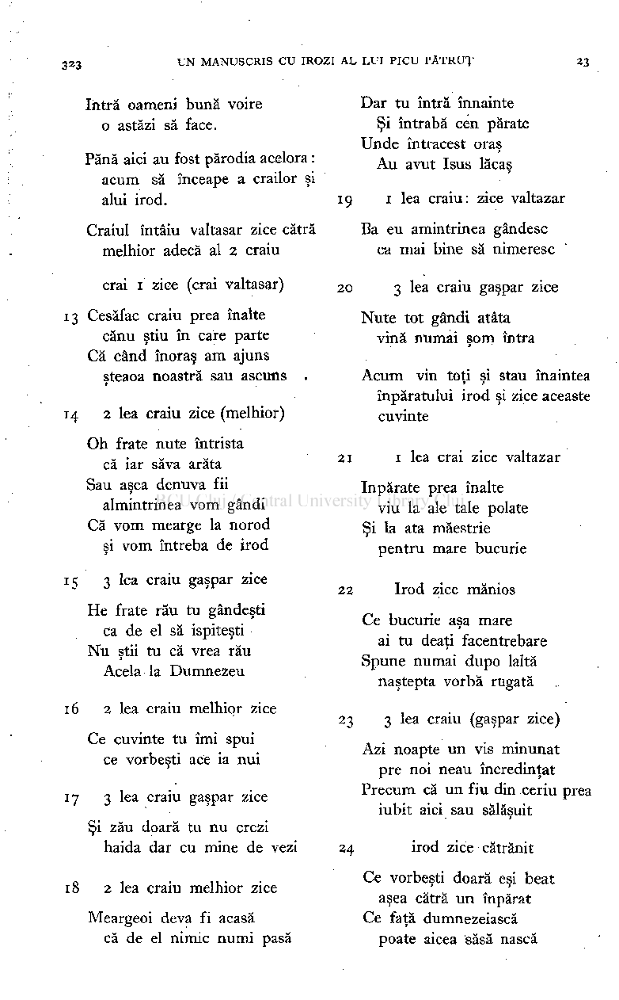

Dar tu întră înnainte

Intră oameni bună voire o astăzi să face.

Şi întrabă cen parate Unde întracest oraş

Pană aici au fost parodia acelora : acum să înceape a crailor şi alui irod.

Au avut Isus lăcaş

- 19 1 lea craiu: zice valtazar

Ba eu amintrinea gândesc ca mai bine să nimeresc

- 20 3 lea craiu gaşpar zice

Nute tot gândi atâta vină numai şom întră

Acum vin toţi şi stau înaintea înpăratului irod şi zice aceaste cuvinte

- 21 1 lea crai zice valtazar

In parate prea înalte

viu la ale tale polate Şi la ata măestrie

pentru mare bucurie

- 22 Irod zice mânios

Ce bucurie aşa mare

ai tu deaţi facentrebare Spune numai dupo laltă

naştepta vorbă rugată

- 23 3 lea craiu (gaşpar zice)

Azi noapte un vis minunat pre noi neau încredinţat Precum că un fiu din ceriu prea iubit aici sau sălăşuit

- 24 irod zice cătrănit

Craiul întâiu valtasar zice cătră melhior adecă al 2 craiu crai 1 zice (crai valtasar)

- 13 Cesăfac craiu prea înalte cănu ştiu în care parte

Că când înoraş am ajuns şteaoa noastră sau ascuns .

- 14 2 lea craiu zice (melhior)

Oh frate nute întrista că iar săva arăta

Sau aşea denuva fii almintrinea vom gândi

Că vom mearge la norod şi vom întreba de irod

- 15 3 lea craiu gaşpar zice

He frate rău tu gândeşti ca de el să ispiteşti

Nu ştii tu că vrea rău Acela la Dumnezeu

- 16 2 lea craiu melhior zice

Ce cuvinte tu îmi spui ce vorbeşti ace ia nui

- 17 3 lea craiu gaşpar zice

Şi zău doară tu nu crezi haida dar cu mine de vezi

- 18 2 lea craiu melhior zice

Ce vorbeşti doară eşi beat

aşea cătră un înpărat Ce faţă dumnezeiască

Meargeoi deva fi acasă că de el nimic numi pasă

poate aicea săsă nască

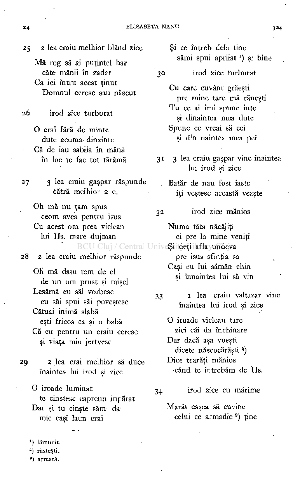

- 25 2 lea craiu melhior blând zice

Mă rog să ai puţintel har

căte mânii în zadar Ca ici întru acest ţinut

Domnul ceresc sau născut

- 26 irod zice turburat

O crai fără de minte dute acuma dinainte Că de iau sabiia în mână în loc te fac tot ţărâmă

- 27 3 lea craiu gaşpar răspunde cătră melhior 2 c.

Oh mă nu ţam spus ceom avea pentru isus

Cu acest om prea viclean lui Hs. mare dujman

- 28 2 lea craiu melhior răspunde

OH mă datu tem de el

de un om prost şi mişel Lasămă eu săi vorbesc

eu săi spui săi povestesc Cătuai inimă slabă

eşti fricos ca şi o babă Că eu pentru un craiu ceresc şi viaţa mio jertvesc

- 29 2 lea crai melhior să duce înaintea lui irod şi zice

Şi ce întreb delà tine sămi spui apriiat*) şi bine

- 30 irod zice turburat

Cu care cuvânt grăeşti

pre mine tare mă răneşti Tu ce ai îmi spune iute

şi dinaintea mea dute Spune ce vreai să cei

şi din naintea mea pei

- 31 3 lea craiu gaşpar vine înaintea lui irod şi zice

. Batăr de nau fost iaste îţi vestesc această veaşte

- 32 irod zice mânios

Numa tata năcăjiţi

ci pre la mine veniţi Şi deţi afla undeva

pre isus sfinţia sa Caşi eu lui sămăn chin şi înnaintea lui să vin

- 33 1 lea craiu valtazar vine înaintea lui irod şi zice

O iroade viclean tare

zici căi da închinare Dar dacă aşa voeşti

dicete născocărăşti

2

) Dice tearăţi mânios

când te întrebăm de Hs.

- 34 irod zice cu mărime

O iroade luminat

te cinstesc capreun înpărat Dar şi tu cinste sămi dai

Marăt caşea să cuvine celui ce armadie ) ţine

mie caşi laun crai

###### *) lămurit.

- 2

) răsteşti.

- 3

###### ) armată.

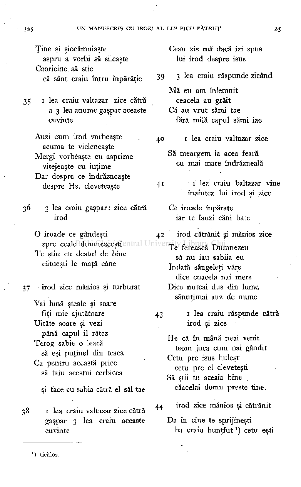

U N MANUSCRI S C U IROZI A L LU I PIC U PÄTRU T

325

25

Ţine şi şiocâmuiaşte

Ceau zis mă dacă iai spus lui irod despre isus

aspru a vorbi să sileaşte Caoricine să stie

- 39 3 lea craiu răspunde zicând

Mă eu am înlemnit ceacela au grăit Că au vrut sămi tae

fără milă capul sămi iae

- 40 1 lea craiu valtazar zice

Să meargem la acea feară cu mai mare îndrăzneală

- 41 1 lea craiu baltazar vine înaintea lui irod şi zice

Ce iroade înpărate iar te lauzi căni bate

- 42 irod cătrănit şi mănios zice

Te ferească Dumnezeu să nu iau sabiia eu îndată sângeleţi vărs

dice cuacela nai mers Dice nuteai dus din lume

sănuţimai auz de nume

- 43 1 lea craiu răspunde cătră irod şi zice

He că în mână neai venit

teom juca cum nai gândit Cetu pre isus huleşti

cetu pre el cleveteşti Să ştii tu aceaia bine

căacelai domn preste tine.

- 44 irod zice mănios şi cătrănit

că sânt craiu întru înpărăţie

- 35 i lea craiu valtazar zice cătră a 3 lea anume gaşpar aceaste cuvinte

Auzi cum irod vorbeaşte acuma te vicleneaşte

Mergi vorbeaşte cu asprime vitejeaşte cu iuţime

Dar despre ce îndrăzneaşte despre Hs. cleveteaşte

- 36 3 lea craiu gaşpar: zice cătră irod

O iroade ce gândeşti spre ceale dumnezeeşti

Te ştiu eu destul de bine cătueşti la maţă câne

- 37 irod zice mănios şi turburat

Vai lună şteale şi soare

fiţi mie ajutătoare Uitate soare şi vezi

până capul il ratez Terog sabie o leacă

să eşi puţinei din teacă

Ca pentru această price să taiu acestui cerbicea şi face cu sabia cătră el săi tae

- 38 1 lea craiu valtazar zice cătră gaşpar 3 lea craiu aceaste cuvinte

Da în cine te sprijineşti ha craiu hunţfut ) cetu eşti

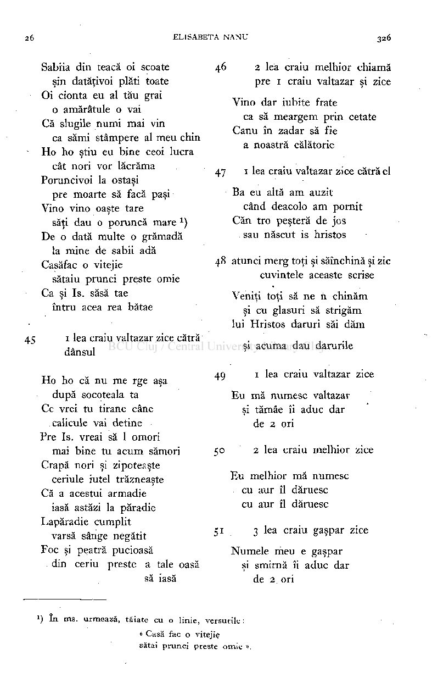

Sabiia din teacă oi scoate

- 46 2 lea craiu melhior chiamă pre 1 craiu valtazar şi zice

Vino dar iubite frate

ca să meargem prin cetate Canu în zadar să fie

a noastră călătorie

- 47 1 lea craiu valtazar zice cătră el

Ba eu altă am auzit

când deacolo am pornit Căn tro peşteră de jos

sau născut is hristos

- 48 atunci merg toţi şi săînchină şi zic cuvintele aceaste scrise

Veniţi toţi să ne n chinăm şi cu glasuri să strigăm

lui Hristos daruri săi dăm şi acuma dau darurile

- 49 1 lea craiu valtazar zice

Eu mă numesc valtazar şi tămâe îi aduc dar de 2 ori

- 50 2 lea craiu melhior zice

Eu melhior mă numesc

cu aur îl dăruesc cu aur îl dăruesc

- 51 3 lea craiu gaşpar zice

şin datăţivoi plăti toate Oi ciontă eu al tău grai

o amărâtule o vai Că slugile numi mai vin ca sămi stâmpere al meu chin

- Ho ho ştiu eu bine ceoi lucra

cât nori vor lăcrăma Poruncivoi la ostaşi

pre moarte să facă paşi Vino vino oaste tare

) De o dată multe o grămadă

săţi dau o poruncă mare

x

la mine de săbii adă Casăfac o vitejie

sătaiu prunci preste omie Ca şi Is. săsă tae

întru acea rea bătae

45 1 lea craiu valtazar zice cătră dânsul

Ho ho că nu me rge aşa

după socoteala ta Ce vrei tu tirane câne calicule vai deţine

Pre Is. vreai să 1 omori

mai bine tu acum sămori Crapă nori şi zipoteaşte

ceriule iutei trăzneaşte Că a acestui armadie

iasă astăzi la păradie Lapăradie cumplit

varsă sânge negătit Foc şi peatră pucioasă

Numele meu e gaşpar şi smirnă îi aduc dar de 2 ori

din ceriu preste a tale oasă să iasă

') în ms. urmează, tăiate cu o linie, versurile: « Casă fac o vitejie sătai prunci preste omie ».

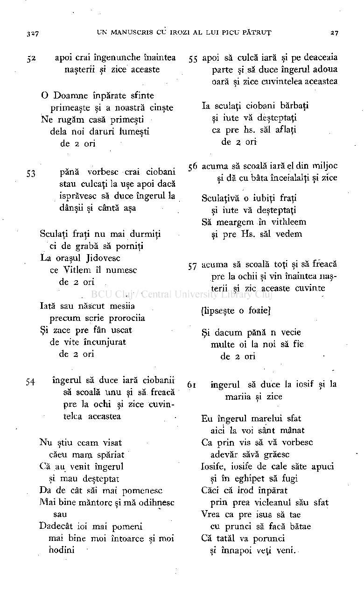

- 52 apoi crai îngenunche înaintea naşterii şi zice aceaste

O Doamne înpărate sfinte

primeaşte şi a noastră cinste Ne rugăm casă primeşti

delà noi daruri lumeşti de 2 ori

- 53 pană vorbesc crai ciobani stau culcaţi la uşe apoi dacă isprăvesc să duce îngerul la dânşii şi cântă aşa

Sculaţi fraţi nu mai durmiţi

ci de grabă să porniţi La oraşul Jidovesc

ce Vitlem îl numesc de 2 ori

Iată sau născut mesiia

precum scrie prorociia Şi zace pre fân uscat de vite încunjurat

de 2 ori

- 54 îngerul să duce iară ciobanii să scoală unu şi să freacă pre la ochi şi zice cuvintelea aceastea

- 55 apoi să culcă iară şi pe deaceaia parte şi să duce îngerul adoua oară şi zice cuvintelea aceastea

Ia sculaţi ciobani bărbaţi şi iute vă deşteptaţi ca pre hs. săi aflaţi

de 2 ori

- 56 acuma să scoală iară el din miljoc şi dă cu bâta înceialalţi şi zice

Sculaţivă o iubiţi fraţi

şi iute vă deşteptaţi Să meargem în vithleem

şi pre Hs. săi vedem

- 57 acuma să scoală toţi şi să freacă pre la ochii şi vin înaintea naşterii şi zic aceaste cuvinte

[lipseşte o foaie] Şi dacum pană n vecie

multe oi la noi să fie de 2, ori

61 îngerul să duce la iosif şi la mariia şi zice

Eu îngerul marelui sfat

aici la voi sânt mânat Ca prin vis să vă vorbesc

Nu ştiu ceam visat

adevăr săvă grăesc Iosife, iosife de cale săte apuci

căeu mam spăriat Că au venit îngerul

şi în eghipet să fugi Căci că irod înpărat

şi mau deşteptat Da de cât săi mai pomenesc Mai bine măntorc şi mă odihnesc

prin prea vicleanul său sfat Vrea ca pre isus să tae

sau

Dadecât ioi mai pomeni mai bine moi întoarce şi moi hodini

cu prunci să facă bătae Că tatăl va porunci

şi înnapoi veţi veni.

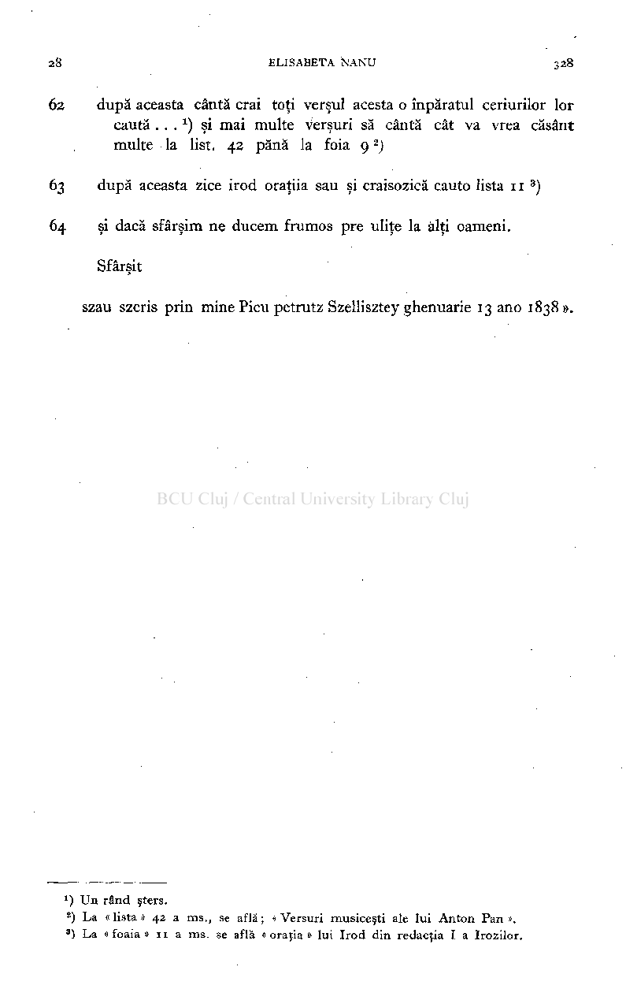

- 62 după aceasta cântă crai toţi versul acesta o înpăratul ceriurilor lor

caută . . -

1

) şi mai multe versuri să cântă cât va vrea căsânt multe la list. 42 pană la foia 9

2

j

- 63 după aceasta zice irod oraţiia sau şi craisozică cauto lista 11

3

)

- 64 şi dacă sfârşim ne ducem frumos pre uliţe la alţi oameni.

Sfârşit

szau szcris prin mine Picu petrutz Szellisztey ghenuarie 13 ano 1838 ».

) Un rând şters.

J

###### ) La «lista» 42 a ms., se află; «Versuri musiceşti ale Iui Anton Pan». ') La «foaia» 11 a ms. se află «oraţia» lui Irod din redacţia I a Irozilor.

8

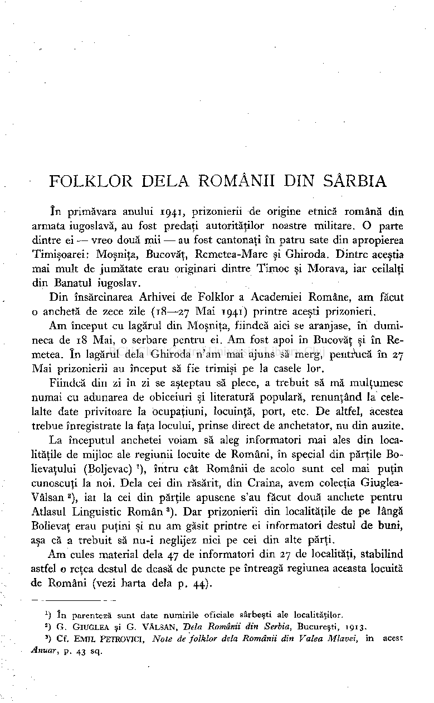

## FOLKLOR DELA ROMANII DIN SÂRBIA

în primăvara anului 1941, prizonierii de origine etnică română din armata iugoslavă, au fost predaţi autorităţilor noastre militare. O parte dintre ei — vreo două mii — au fost cantonaţi în patru sate din apropierea Timişoarei: Moşniţa, Bucovăţ, Remetea-Mare şi Ghiroda. Dintre aceştia mai mult de jumătate erau originari dintre Timoc şi Morava, iar ceilalţi din Banatul iugoslav.

Din însărcinarea Arhivei de Folklor a Academiei Române, am făcut o anchetă de zece zile (18—27 Mai 1941) printre aceşti prizonieri.

Am început cu lagărul din Moşniţa, fiindcă aici se aranjase, în dumineca de 18 Mai, o serbare pentru ei. Am fost apoi în Bucovăţ şi în Remetea. în lagărul delà Ghiroda n'am mai ajuns să merg, pentr*ucă în 27 Mai prizonierii au început să fie trimişi pe la casele lor.

Fiindcă din zi în zi se aşteptau să plece, a trebuit să mă mulţumesc numai cu adunarea de obiceiuri şi literatură populară, renunţând la celelalte date privitoare la ocupaţiuni, locuinţă, port, etc. De altfel, acestea trebue înregistrate la faţa locului, prinse direct de anchetator, nu din auzite.

La începutul anchetei voiam să aleg informatori mai ales din localităţile de mijloc ale regiunii locuite de Români, în special din părţile Bolievaţului (Boljevac) întru cât Românii de acolo sunt cel mai puţin cunoscuţi la noi. Delà cei din răsărit, din Craina, avem colecţia GiugleaVâlsan

), iai la cei din părţile apusene s'au făcut două anchete pentru Atlasul Linguistic Român

2

). Dar prizonierii din localităţile de pe lângă Bolievaţ erau puţini şi nu am găsit printre ei informatori destul de buni, aşa că a trebuit să nu-i neglijez nici pe cei din alte părţi.

3

Am cules material delà 47 de informatori din 27 de localităţi, stabilind astfel o reţea destul de deasă de puncte pe întreagă regiunea aceasta locuită de Rpmâni (vezi harta delà p. 44).

) în parenteză sunt date numirile oficiale sârbeşti ale localităţilor.

x

) G. GlUGLEA şi G. VÂLSAN, Delà Românii din Serbia, Bucureşti, 1913.

2

*) Cf. EMIL PETROVICI, Note de folklor delà Românii din Valea Mlavei, în acest Anuar, p. 43 sq.

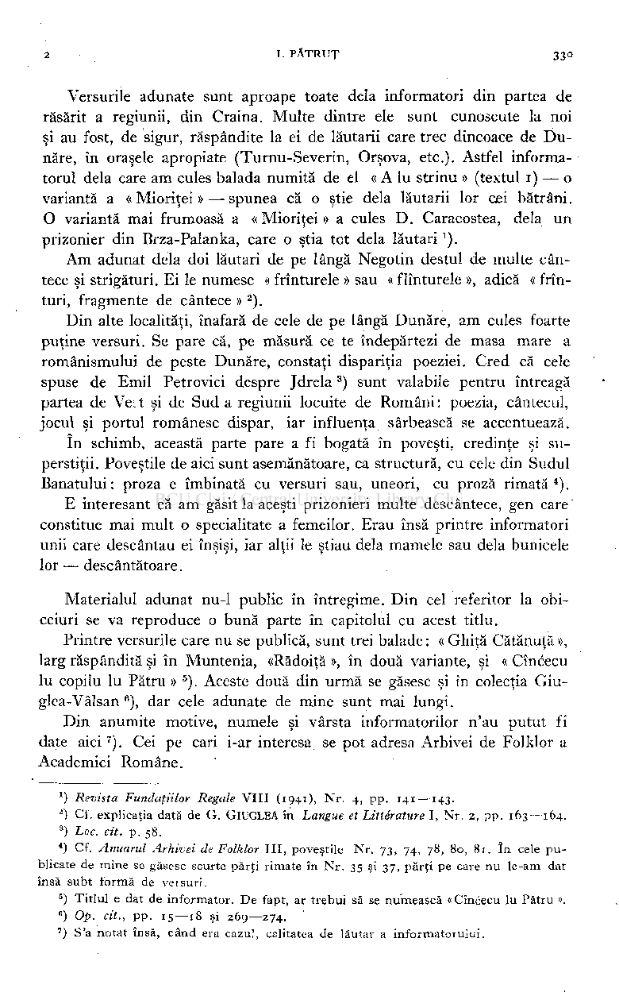

2 I. PÄTRU T 33°

Versurile adunate sunt aproape toate delà informatori din partea de răsărit a regiunii, din Craina. Multe dintre ele sunt cunoscute la noi şi au fost, de sigur, răspândite la ei de lăutarii care trec dincoace de Dunăre, în oraşele apropiate (Turnu-Severin, Orşova, etc.). Astfel informatorul delà care am cules balada numită de el « A lu strinu » (textul i) — o variantă a «Mioriţei» — spunea că o ştie delà lăutarii lor cei bătrâni. O variantă mai frumoasă a « Mioriţei » a cules D. Caracostea, delà un prizonier din Brza-Palanka, care o ştia tot delà lăutari

).

x

Am adunat delà doi lăutari de pe lângă Negotin destul de multe cântece şi strigături. Ei le numesc « frînturele » sau « flînturele », adică « frînturi, fragmente de cântece »

).

2

Din alte localităţi, înafară de cele de pe lângă Dunăre, am cules foarte puţine versuri. Se pare că, pe măsură ce te îndepărtezi de masa mare a românismului de peste Dunăre, constaţi dispariţia poeziei. Cred că cele spuse de Emil Petrovici despre Jdrela

) sunt valabile pentru întreagă partea de Vert şi de Sud a regiunii locuite de Români: poezia, cântecul, jocul şi portul românesc dispar, iar influenţa sârbească se accentuează.

3

în schimb, această parte pare a fi bogată în poveşti, credinţe şi superstiţii. Poveştile de aici sunt asemănătoare, ca structură, cu cele din Sudul Banatului : proza e îmbinată cu versuri sau, uneori, cu proză rimată ).

E interesant că am găsit la aceşti prizonieri multe descântece, gen care"

constitue mai mult o specialitate a femeilor. Erau însă printre informatori unii care descântau ei înşişi, iar alţii le ştiau delà mamele sau delà bunicele lor — descântătoare.

Materialul adunat nu-1 public în întregime. Din cel referitor la obiceiuri se va reproduce o bună parte în capitolul cu acest titlu.

Printre versurile care nu se publică, sunt trei balade : « Ghiţă Cătănuţă », larg răspândită şi în Muntenia, «Rădoiţă », în două variante, şi « Cîncecu lu copilu Iu Patru » ). Aceste două din urmă se găsesc şi în colecţia Giuglea-Vâlsan

), dar cele adunate de mine sunt mai lungi.

8

Din anumite motive, numele şi vârsta informatorilor n'au putut fi date aici

). Cei pe cari i-ar interesa se pot adresa Arhivei de Folklor a Academiei Române.

7

- 1

) Revista Fundaţiilor Regale VIII (1941), Nr 4, pp. 141—143.

- 2

) Cf. explicaţia dată de G. GlUGLEA în Langue et Littérature I, Nr. 2, pp. 163—164.

- 3

) Loc. cit. p. 58.

- 4

) Cf. Anuarul Arhivei de Folklor III, poveştile Nr. 73, 74, 78, 80, 81. în cele pu­

blicate de mine se găsesc scurte părţi rimate în Nr. 35 şi 37, părţi pe care nu le-am dat însă subt formă de vei suri.

- 5

) Titlul e dat de informator. De fapt, ar trebui să se numească «Cîncecu Iu Patru ».

- 6

) Op. cit., pp 15—18 şi 269—274.

') S'a notat însă, când era cazuî, calitatea de lăutar a informatorului.

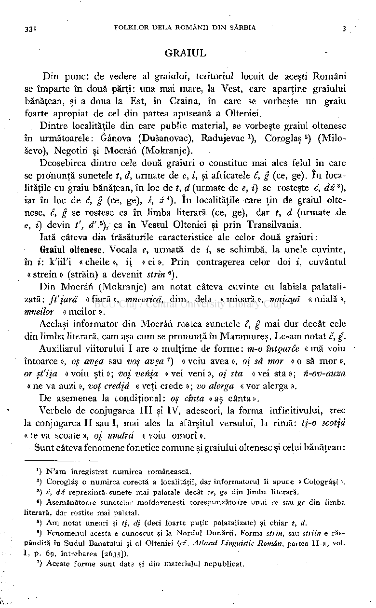

GRAIUL

Din punct de vedere al graiului, teritoriul locuit de aceşti Români se împarte în două părţi: una mai mare, la Vest, care aparţine graiului bănăţean, şi a doua la Est, în Craina, în care se vorbeşte un graiu foarte apropiat de cel din partea apuseană a Olteniei.

Dintre localităţile din care public material, se vorbeşte graiul oltenesc în următoarele : Gänova (Dusanovac), Radujevac

), Coroglaş ) (Milosevo), Negotin şi Mocrâh (Mokranje).

1

Deosebirea dintre cele două graiuri o constitue mai ales felul în care se pronunţă sunetele t, d, urmate de e, i, şi africatele c, g (ce, ge). în localităţile cu graiu bănăţean, în loc de t, d (urmate de e, i) se rosteşte c, dâ

), iar in loc de c, g (ce, ge), /, i ) . în localităţile care ţin de graiul oltenesc, c, g se rostesc ca în limba literară (ce, ge), dar t, d (urmate de e, i) devin t', d' ), ca în Vestul Olteniei şi prin Transilvania.

3

Iată câteva din trăsăturile caracteristice ale celor două graiuri: Graiul oltenesc. Vocala e, urmată de i, se schimbă, la unele cuvinte,

în i: k'iil'i « cheile », ii « ei ». Prin contragerea celor doi i, cuvântul «strein » (străin) a devenit strin

).

6

Din Mocrâh (Mokranje) am notat câteva cuvinte cu labiala palatalizată: ft'iară «fiară», mneorică, dim. delà «mioară», mniauă « mială », mneilor « meilor ».

Acelaşi informator din Mocrâh rostea sunetele c, g mai dur decât cele din limba literară, cam aşa cum se pronunţă în Maramureş. Le-am notat c, g.

Auxiliarul viitorului I are o mulţime de forme : m-o întoarce « mă voiu întoarce », oş avea sau voş avea

) « voiu avea », oi să mor « o să mor », or şt'iia «voiu şti»; voi veûia «vei veni», oi sta «vei sta»; û-ov-auza

7

« ne va auzi », vot credid « veţi crede »; vo alerga « vor alerga ». De asemenea la condiţional: oş cînta «aş cânta». Verbele de conjugarea III şi IV, adeseori, la forma infinitivului, trec

la conjugarea II sau I, mai ales la sfârşitul versului, la rimă: ti-o scoţia « (e va scoate », oi umărd « voiu omorî ».

Sunt câteva fenomene fonetice comune şi graiului oltenesc şi celui bănăţean :

- 1

) N'am înregistrat numirea românească.

- 2

###### ) Coroglaş e numirea corectă a localităţii, dar informatorul îi spune « Cologrâşî ».

###### ) c, dz reprezintă sunete mai palatale decât ce, ge din limba literară.

s

###### ) Asemănătoare sunetelor moldoveneşti corespunzătoare unui ce sau ge din limba literară, dar rostite mai palatal.

4

) A m notat uneori şi ti, di (deci foarte puţin palatalizate) şi chiar t, d.

5

') Fenomenul acesta e cunoscut şi la Nordul Dunării. Forma strin, sau striin e răspândită în Sudul Banatului şi al Olteniei (cf. Atlasul Linguistic Român, partea Il-a, voi. I, p. 69, întrebarea [2635]).

') Aceste forme sunt data şi din materialul nepublicat.

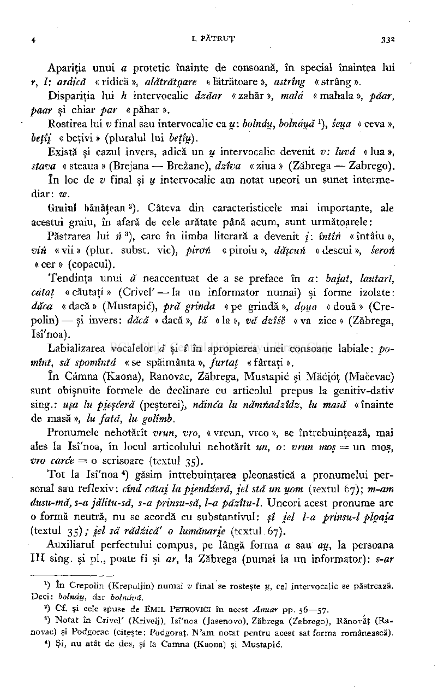

Apariţia unui a protetic înainte de consoană, în special înaintea lui r, l: ardicâ « ridică », alătrătoare « lătrătoare », astrîng « strâng ».

Dispariţia lui h intervocalic dzăar « zahăr », mală « mahala », păar, paar şi chiar par « pahar ».

Rostirea lui v final sau intervocalic ca u : bolndu, bolnduă ), seua « ceva », beţii «beţivi» (pluralul lui beţîu).

Există şi cazul invers, adică un u intervocalic devenit v : luvd « lua », stava « steaua » (Brejana — Brezane), dzîva « ziua » (Zăbrega — Zabrego).

în loc de v final şi u intervocalic am notat uneori un sunet intermediar: w.

). Câteva din caracteristicele mai importante, ale acestui graiu, în afară de cele arătate până acum, sunt următoarele:

Graiul bănăţean

2

Păstrarea lui û ), care în limba literară a devenit i: întîn «întâiu», viû «vii» (plur. subst. vie), piron «piroiu», dăşcun « descui », seron

« cer » (copacul).

Tendinţa unui ă neaccentuat de a se preface în a: băiat, lăutari, cataţ «căutaţi» (Crivel' — la un informator numai) şi forme izolate: daca « dacă » (Mustapic), pră grinda « pe grindă », doua « două » (Crepolin) — şi invers : dacă « dacă », lă « la », vă dzîsë « va zice » (Zăbrega, Isî'noa).

Labializarea vocalelor a şi £ în apropierea unei consoane labiale: pomînt, să spomîntd « se spăimânta », furtat « fârtati ».

în Câmna (Kaona), Ranovac, Zăbrega, Mustapic şi Măcioţ (Macevac) sunt obişnuite formele de declinare cu articolul prepus la genitiv-dativ sing.: uşa lu pieşderă (peşterei), năinc'a lu nămuadzîdz, lu masă «înainte de masă », lu fată, lu golîmb.

Pronumele nehotărît vrun, vro, « vreun, vreo », se întrebuinţează, mai ales la Isî'noa, în locul articolului nehotărît un, o: vrun moş = un moş, vro carc'e = o scrisoare (textul 35).

) găsim întrebuinţarea pleonastică a pronumelui personal sau reflexiv: cînd cătai la piendieră, iei stă un uom (textul 67); m-am

Tot la Isî'noa

4

dusu-mă, s-a jălitu-să, s-a prinsu-să, l-a păzîtu-l. Uneori acest pronume are o formă neutră, nu se acordă cu substantivul : şî iei l-a prinsu-l ploaia (textul 35) iei să rădzică' o lumănarie (textul 67).

Auxiliarul perfectului compus, pe lângă forma a sau au, la persoana III sing, şi pl., poate fi şi ar, la Zăbrega (numai la un informator): s-ar

*) în Crepolin (Krepoljin) numai v final se rosteşte u, cel intervocalic se păstrează.

Deci: bolndu, dar bolnavă.

- 2

) Cf. şi cele spuse de EMI L PETROVICI în acest Anuar pp. 56—57.

- 3

###### ) Notat în Crivel' (Krivelj), Isî'noa (Jasenovo), Zăbrega (Zabrego), Rănovăţ (Ranovac) şi Podgorac (citeşte: Podgoraţ. N'am notat pentru acest sat forma românească).

###### ) Şi, nu atât de des, şi la Camna (Kaona) şi Mustapic.

4

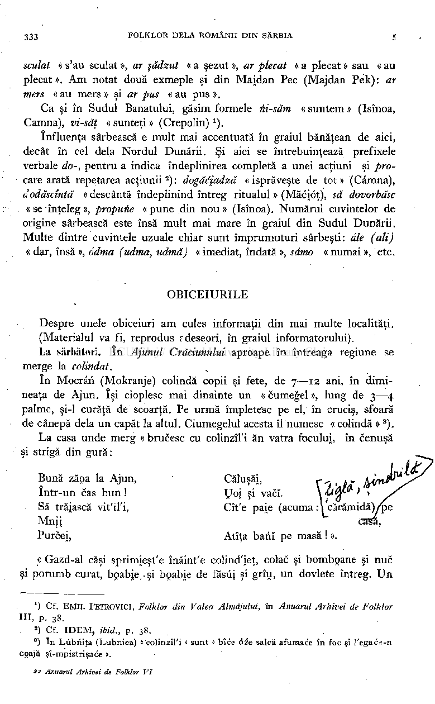

sculat « s'au sculat », ar şddzut « a şezut », ar plecat « a plecat » sau « au plecat». Am notat două exmeple şi din Maidan Pec (Majdan Pek): ar mers « au mers » şi ar pus « au pus ».

Ca şi în Sudul Banatului, găsim formele ni-săm « suntem » (Isînoa, Camna), vi-săţ « sunteţi » (Crepolin)

). Influenţa sârbească e mult mai accentuată în graiul bănăţean de aici, decât în cel delà Nordul Dunării. Şi aici se întrebuinţează prefixele verbale do-, pentru a indica îndeplinirea completă a unei acţiuni şi procare arată repetarea acţiunii

1

): dogădiadză «isprăveşte de tot» (Câmna), dodăscîntă « descântă îndeplinind întreg ritualul » (Măcioţ), să dovorbăsc

2

« se înţeleg », propune «pune din nou» (Isînoa). Numărul cuvintelor de origine sârbească este însă mult mai mare în graiul din Sudul Dunării. Multe dintre cuvintele uzuale chiar sunt împrumuturi sârbeşti: die (alt)

« dar, însă », odma (udma, udmă) « imediat, îndată », sâmo « numai », etc.

OBICEIURILE

Despre unele obiceiuri am cules informaţii din mai multe localităţi. (Materialul va fi, reprodus zdeseori, în graiul informatorului). La sărbători. în Ajunul Crăciunului aproape în întreaga regiune se

merge la colindat.

în Mocrân (Mokranje) colindă copii şi fete, de 7—12 ani, în dimineaţa de Ajun. îşi cioplesc mai dinainte un « cumegel », lung de 3—4 palme, şi—1 curăţă de scoarţă. Pe urmă împletesc pe el, în cruciş, sfoară de cânepă delà un capăt la altul. Ciumegelul acesta îl numesc « colindă » ).

La casa unde merg « brucesc cu colinzîl'i ăn vatra focului, în cenuşă şi strigă din gură:

Bună zăoa la Ajun, Căluşăi, K" > k într-un cas bun ! Uoi şi vacï. \ ItOr^" ' > Să trăiască vit'il'i, Cît'e paie (acuma :\ cărămidă) Mnii casa, Purcei, Atîţa bani pe masă ! ».

« Gazd-al căşi sprimieşt'e înăint'e colind'ieţ, colac şi bomboane şi nuc şi porumb curat, boabie,-şi boabie de făsui şi grîu, un dovlete întreg. Un

*) Cf. EMI L PETROVICI, Folklor din Valea Almăjului, în Anuarul Arhivei de Folklor HI, p. 38.

###### ) Cf. IDEM , ibid., p. 38.

2

###### ) în Lubniţa (Lubnica) « colinzîl'i » sunt « bîce die salcă afumace în foc şî l'egac?-n coajă şî-mpistrişa ce ».

s

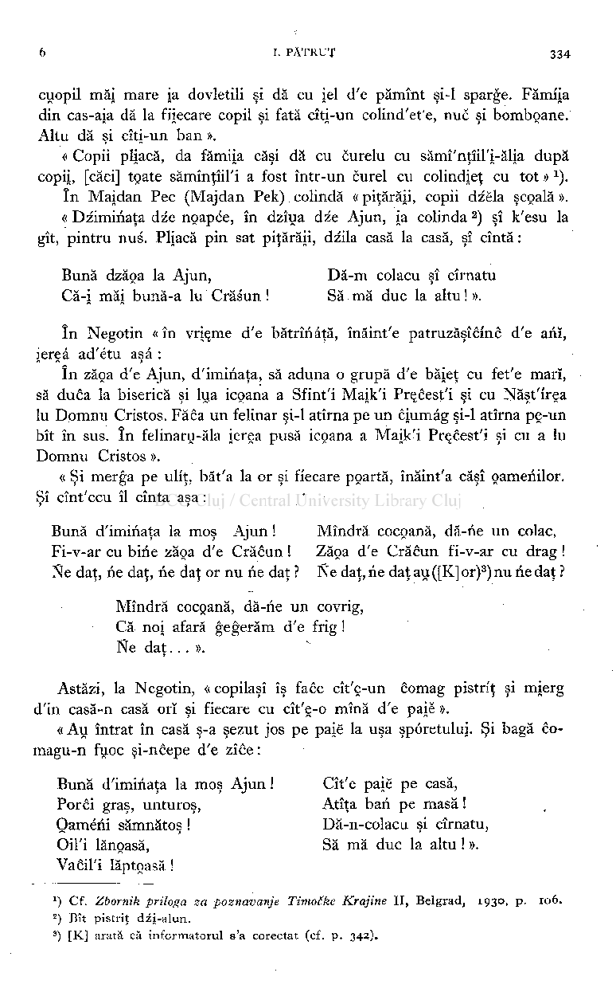

cyopil măi mare ia dovletili şi dă cu iei d'e pămînt şi—1 sparge. Fămiia din cas-aia dă la fiiecare copil şi fată cîti-un colind'et'e, nuc şi bomboane. Altu dă şi cîti-un ban ».

« Copii pliacă, da fămiia căşi dă cu curelu cu sămî'nţîirj-ălia după copii, [căci] toate sămînţîil'i a fost într-un curei cu colindieţ cu tot »

). în Maidan Pec (Majdan Pek) colindă « piţărăii, copii dzela şcoală ». « Dziminaţa dze noapce, în dzîua dze Ajun, ia colinda

x

) şî k'esu la gît, pintru nus. Pliacă pin sat piţărăii, dzila casă la casă, şî cîntă :

2

Bună dzăoa la Ajun, Dă-m colacu şî cîrnatu Că-i măi bună-a lu Crăsun ! Să mă duc la altu ! ».

în Negotin «în vrieme d'e bătrînâţă, înăint'e patruzăşîcinc d'e ariî, iereâ ad'étu aşa :

în zăoa d'e Ajun, d'iminaţa, să aduna o grupă d'e băiet cu fet'e marî, să duca la biserică şi lua icoana a Sfint'i Maik'i Prçcest'i şi cu Năşt'irea lu Dpmnu Cristos. Făca un felinar şi—1 atîrna pe un ciumâg şi-1 atîrna pe-un bît în sus. în felinaru-ăla ierea pusă icoana a Maik'i Prçcest'i şi cu a lu Domnu Cristos ».

« Şi merga pe uliţ, băt'a la or şi fiecare poartă, înăint'a căşî oamenilor. Şî cînt'ecu îl cînta aşa :

Bună d'iminaţa la moş Ajun ! Mîndră cocoană, dă-rie un colac, Fi-v-ar cu bine zăoa d'e Crăcun ! Zăoa d'e Crăcun fi-v-ar cu drag ! Ne daţ, ne daţ, ne daţ or nu ne daţ ? Ne daţ, ne daţ au ([K] or)

) nu ne daţ ?

3

Mîndră cocoană, dă-rie un covrig, Că noi afară gegerăm d'e frig ! Ne daţ... ».

Astăzi, la Negotin, « copilaşi îş face cît'e-un comag pistriţ şi mierg d'in casă-n casă ori şi fiecare cu cît'e-o mină d'e paie ».

« Au întrat în casă ş-a şezut jos pe paie la uşa şporetului. Şi bagă comagu-n fuoc şi-ncepe d'e zîce :

Bună d'iminaţa la moş Ajun ! Cît'e paie pe casă, Porci graş, unturoş, Atîţa ban pe masă ! Oameni sămnătoş ! Dă-n-colacu şi cîrnatu, Oil'i lănoasă, Să mă duc la altu ! ». Vacil'i lăptoasă !

') Cf. Zbornik priloga za poznavanje Timocke Krajine II, Belgrad, 1930, p. 106.

- 2

) Bît pistriţ dzi-alun.

- 3

###### ) [K] arată că informatorul s'a corectat (cf. p. 342).

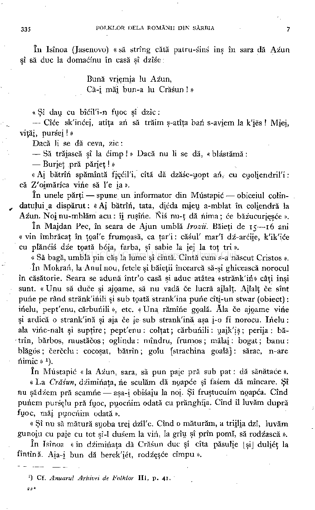

în Isînoa (Jasenovo) « să strîng cătă patru-sins inş în sara dă Azun şî să duc la domacmu în casă şî dzîse :

Bună vriemia Iu Azun, Că-i măi bun-a lu Crăsun ! »

« Şî dau cu bîcil'i-n fuoc şî dzîc :

— Cîce sk'incei, atîţa an să trăim ş-atîţa ban s-aviem la k'jës ! Miei, viţăi, pursei ! »

Dacă li se dă ceva, zic :

— Să trăiască şî la cimp ! » Dacă nu li se dă, « blâstămă :

— Burieţ pră părieţ ! » « Ai bătrîfi spămîntă fiecil'i, cîtă dă dzăse-uopt ari, cu cuoliendril'i :

că Z'oimărica vine să l'e ia ». în unele părţi — spune un informator din Müstapic — obiceiul colin-

datului a dispărut: «Ai bătrîri, tata, diéda mieu a-mblat în coliendră la Azun. Noi nu-mblăm acu : îi ruşîrie. Nis nu-ţ dă riima ; ce băzucuricşce ».

f

în Maidan Pec, în seara de Ajun umblă Irozii. Băieţi de 15—16 ani « vin îmbrăcat în ţoal'e frumoasă, ca ţar'i : căsul' mar'î dz-arciie, k'ik'ice cu plăncis dze toată boia, farba, şî sabie la iei la toţ tri ».

« Să bagă, umblă pin căş la lume şî cîntă. Cîntă cum s-a născut Cristos ». în Mokrari, la Anul nou, fetele şi băieţii încearcă să-şi ghicească norocul

în căsătorie. Seara se adună într'o casă şi aduc atâtea «strănk'iri» câţi inşi sunt. « Unu să duce şi ajoame, să nu vadă ce lucră ailalţ. Ailalţ ce sînt pune pe rând strănk'iriili şi sub toată strank'ina purie cîti-un stwar (obiect) : irielu, pept'enu, cărburiili », etc. « Una rămîrie goală. Ăla ce ajoame vine şi ardică o strank'ina şi aia ce ie sub strank'ina aşa i-o fi norocu. Irielu : ala virie-nalt şi supţire ; pept'enu : colţat ; cărburiili : uaik'iş ; perija : bătrîn, bărbos, mustăcos ; oglinda : mîndru, frumos ; mălai : bogat ; banu : blăgos ; cercelu : cocoşat, bătrîn ; golu [strachina goală] : sărac, n-are nimic »

).

1

în Müstapic « la Azun, sara, să pun paie pră sub pat : dă sănătace ». « La Crăsun, dzimiriaţa, ne sculăm dă noapce şî fasem dă mîncare. Şî

nu şădzem pră scamrie — aşa-i obisaiu la noi. Şî fruştucuim noapca. Cînd puriem purseju pră fuoc, puocriim odată cu prănghija. Cînd îl luvăm dupră fuoc, măi puocriim odată».

« Şî nu să mătură suoba trei dzîl'e. Cînd o măturăm, a triilia dzî, luvăm gunoiu cu paie cu tot şî-1 dusem la viri, la grîu şî prîn pomi, să rodzască ».

în Isînoa « în dzimiriaţa dă Crăsun duc şî cîta păsulie [şi] dulieţ la fîntînă. Aia-i bun dă berek'iét, rodze.şce cîmpu ».

*) Cf. Anuarul Arhivei de Folklor III, p. 41.

22*

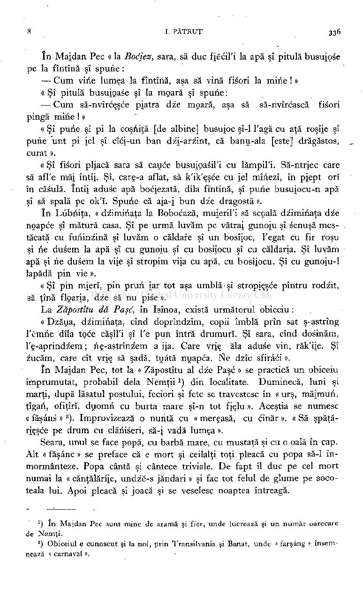

8 I. PĂTRU Ţ 33"

în Maidan Pec « la Bodiez, sara, să duc fiëcil'i la apă şî pitula busuiose pe la fîntînă şî spune :

— Cum vine lumea la fîntînă, aşa să vină fisori la mine ! » « Şî pitula busuioase şî la moară şî spune:

— Cum să-nvîrce.şce piatra dze moară, aşa să să-nvîrcască fisori pingă mine ! »

« Şî pune şî pi la coşniţă [de albine] busuioc şî-1 l'agă cu aţă roşîie şî pune unt pi iei şî cîci-un ban dzi-arzint, că bany-ala [este] drăgăstos, curat ».

« Şî fisori pliacă sara să cauce busuioasil'i cu lămpil'i. Să-ntriec care

- să afl'e măi întîi. Şî, care-a aflat, să k'ik'esce cu iei mîfiezî, în piept ori în căsulă. întîi aduse apă bociezată, dîla fîntînă, şî pune busuiocu-n apă şî să spală pe ok'î. Spune că aia-i bun dze dragostă ».

în Lubniţa, « dziminaţa la Bobocază, muieril'i să scoală dziminaţa dze noapce şî mătură casa. Şî pe urmă luvăm pe vătrai gunoiu şî senuşă mes-

- tăcată cu funinzină şî luvăm o căldare şî un bosîioc, l'egat cu fir roşu şi he dusem la apă şî cu gunoiu şî cu bosîiocu şî cu căldaria. Şî luvăm apă şi ne dusem la viie şî stropim viia cu apă, cu bosîiocu. Şî cu gunoiu-1 lapădă pin vie ».

« Şî pin mierî, pin prun iar tot aşa umblă şî stropicşce pîntru rodzit,

să ţînă floaria, dze să nu pise ». La Zăpostîtu dă Pasc, în Isînoa, există următorul obiceiu : « Dzăua, dziminaţa, cînd doprîndzîm, copii îmbla prin sat ş-astrîng l'Cmrie dîla toce căşîl'i şî l'e pun întră drumuri. Şî sara, cînd dosinăm, l'e-aprindzem ; ne-astrînzem a iia. Care vrie. ăla aduse vin, răk'iie. Şî zucăm, care cît vriç să şadă, tuâtă nuapca. l\

e dzîc sfirâci ».

T

în Maidan Pec, tot la « Zăpostîtu al dze Pasc » se practică un obiceiu împrumutat, probabil delà Nemţii

) din localitate. Duminecă, luni şi marţi, după lăsatul postului, feciori şi fete se travestesc în « urş, măimufi, ţîgan, ofiţîrî, duomfî cu burta mare şî-n tot fiçlu ». Aceştia se numesc « făşâns »

x

). Improvizează o nuntă cu « mereasă, cu cinăr ». « Să şpăţăricşce pe drum cu clăniseri, să-i vadă lumea ».

2

Seara, unul se face popă, cu barbă mare, cu mustaţă şi cu o oală în cap. Alt « făşânc » se preface că e mort şi ceilalţi toţi pleacă cu popa să-1 înmormânteze. Popa cântă şi cântece triviale. De fapt îl duc pe cel mort numai la « cănţălăriie, undzë-s jăndari » şi fac tot felul de glume pe socoteala lui. Apoi pleacă şi joacă şi se veselesc noaptea întreagă.

###### ) în Maidan Pec sunt mine de aramă şi fier, unde lucrează şi un număr oarecare de Nemţi.

x

###### ) Obiceiul e cunoscut şi la noi, prin Transilvania şi Banat, unde « farşâng » însemnează << carnaval ».

2

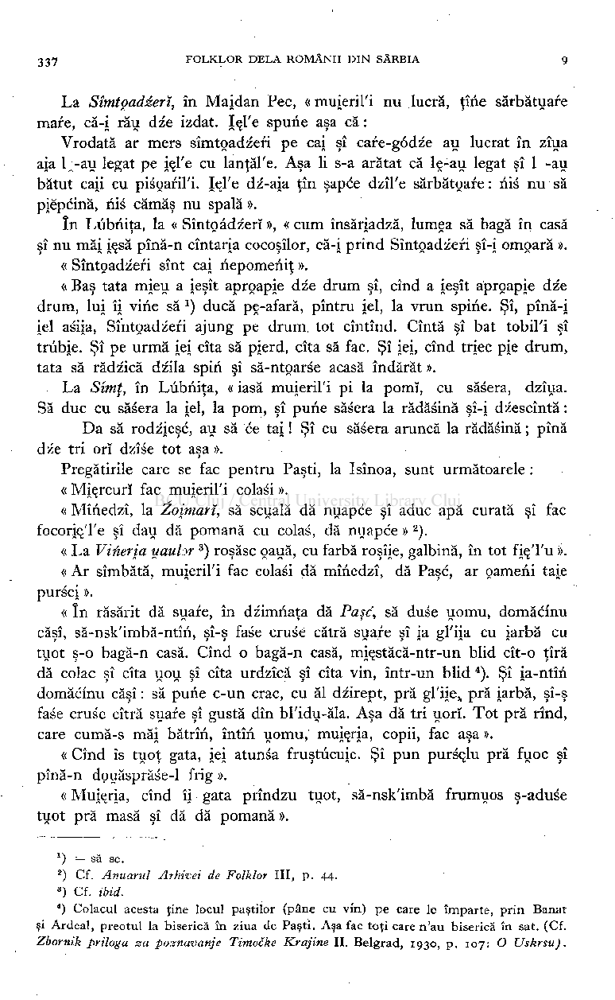

La Sîmtoadieri, în Maidan Pec, « muieril'i nu lucră, ţîfie sărbătuafe mare, că-i rău dze izdat. IeTe spune aşa că :

Vrodată ar mers sîmtoadzefi pe cai şî cafe-godze au lucrat în zîua aia l;-au legat pe ieTe cu lanţăl'e. Aşa li s-a arătat că le-au legat şî 1 -au

- bătut caii cu pisoafil'i. IeTe dz-aia ţîn şapce dzîl'e sărbătoare : nié nu să piepcină, nis cămăş nu spală ».

în Lubriiţa, la « Sîntgâdzerî », « cum însăriadză, lumea să bagă în casă

şî nu măi ie_să pînă-n cîntaria cocoşilor, că-i prind Sîntoadzefi şî-i omoară ». « Sîntoadzefi sînt cai nepomenit ». « Baş tata mieu a ieşît aproapie dze drum şî, cînd a ieşît aproapie dze drum, lui îi vifie să *) ducă pe-afară, pîntru iei, la vrun spifie. Şî, pînă-i iei asiia, Sîntoadzefi ajung pe drum tot cîntînd. Cîntă şî bat tobil'i şî trubie. Şî pe urmă iei cîta să pierd, cîta să fac. Şî iei, cînd triée pie drum, tata să rădzică dzila spin şî să-ntoarse acasă îndărăt ».

La Sîmţ, în Lubriiţa, « iasă muieril'i pi la pomî, cu săsera, dzîua. Să duc cu săsera la iei, la pom, şî pune săsera la rădăsină şî-i dzescîntă : — Da să rodzieşc, au să ce tai ! Şî cu săsera aruncă la rădăsină ; pînă

dze tri orï dzîse tot aşa ». Pregătirile care se fac pentru Paşti, la Isînoa, sunt următoarele : « Miercuri fac muieril'i colasi ». « Mîfiedzî, la Zoimarî, să scuală dă nuapce şî aduc apă curată şî fac

focorie/l'e şî dau dă pomană cu colas, dă nuapce »

2

). « La Vlûeria uauhr

3

) roşăsc oauă, cu farbă roşîie, galbină, în tot fie/l'u ». « Ar sîmbătă, muieril'i fac colasi dă mîfiedzî, dă Pasc, ar oameni taie

pursei ». « în răsărit dă syafe, în dzimnaţa dă Pasc, să duse uomu, domăcinu

- căşî, să-nsk'imbă-ntîn, şî-ş fase cruse cătră suafe şî ia gl'iia cu iarbă cu tuot ş-o bagă-n casă. Cînd o bagă-n casă, miestăcă-ntr-un blid cît-o ţîră
- dă colac şî cîta uou şî cîta urdzîcă şî cîta vin, într-un blid ). Şî ia-ntîn

domăcinu căşî : să pune c-un crac, cu ăl dzirept, pră gl'iie

pră iarbă, şî-ş fase cruse cîtră suafe şî gustă dîn bl'idu-ăla. Aşa dă tri yorï. Tot pră rînd, care cumă-s măi bătrîri, întîn uomu, muieria, copii, fac aşa ».

%

« Cînd îs tuoţ gata, iei atunsa fruştucuie. Şî pun pursçlu pră fuoc şî pînă-n douăsprăse-1 frig ».

« Muiçria, cînd îi gata prîndzu tuot, să-nsk'imbă frumuos ş-aduse tuot pră masă şî dă dă pomană ».

) = să se.

J

- 2

) Cf. Anuarul Arhivei de Folklor III, p. 44.

- 3

###### ) Cf. ibid.

*) Colacul acesta ţine locul paştilor (pâne cu vin) pe care le împarte, prin Banat şi Ardeal, preotul la biserică în ziua de Paşti. Aşa fac toţi care n'au biserică în sat. (Cf.

Zbornik priloga za poznavanje Timocke Krajine II. Belgrad, 1930, p. 107: O Uskrsu).

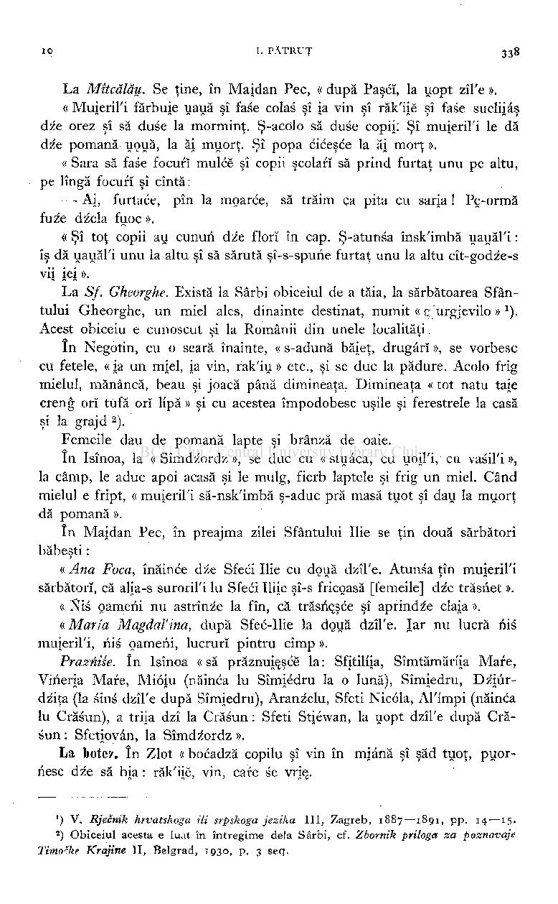

La Mîtcălău. Se ţine, în Maidan Pec, « după Paşcî, la yopt zîl'e ». « Muieril'i fărbuie yauă şî fase colas şî ia vin şî răk'iie şî fase sucliiâş

dze orez şî să duse la morminţ. Ş-acolo să duse copii. Şî muieril'i le dă dze pomană uoyă, la ăi muorţ. Şî popa ciceşce la ăi morţ ».

« Sara să fase focuri mulce şî copii şcolari să prind furtaţ unu pe altu, pe lîngă focuri şî cîntă:

-- Ai, furtace, pîn la moarce, să trăim ca pita cu saria ! Pe-ormă fuze dzela fyoc ».

« Şî toţ copii au cunun dze flori în cap. Ş-atunsa însk'imbă uauăl'i : îş dă uauăl'i unu la altu şî să sărută şî-s-spurie furtaţ unu la altu cît-godze-s vii iei ».

La Sf. Gheorghe. Există la Sârbi obiceiul de a tăia, la sărbătoarea Sfântului Gheorghe, un miel ales, dinainte destinat, numit « tfurgjevilo »

). Acest obiceiu e cunoscut şi la Românii din unele localităţi:

x

în Negotin, cu o seară înainte, « s-adună băiet, drugârî », se vorbesc cu fetele, « ia un miel, ia vin, rak'iu » etc., şi se duc la pădure. Acolo frig mielul, mănâncă, beau şi joacă până dimineaţa. Dimineaţa « tot natu taie creng ori tufă ori lipă » şi cu acestea împodobesc uşile şi ferestrele la casă şi la grajd ).

Femeile dau de pomană lapte şi brânză de oaie. în Isînoa, la « Sîmdzordz », se duc cu « styâca, cu uoil'i, cu vasil'i »,

la câmp, le aduc apoi acasă şi le mulg, fierb laptele şi frig un miel. Când mielul e fript, « muieril'i să-nsk'imbă ş-aduc pră masă tuot şî dau la muorţ dă pomană ».

în Maidan Pec, în preajma zilei Sfântului Ilie se ţin două sărbători

- băbeşti : « Ana Foca, înăince dze Sfeci Ilie cu două dzîl'e. Atunsa ţîn muieril'i

sărbători, că alia-s suroril'i Iu Sfeci Iliie şî-s fricoasă [femeile] dze trăsnet ». « Nis oameni nu astrînze la fîn, că trăsncşce şî aprindze claia ». « Maria Magdal'ina, după Sfec-Ilie la două dzîl'e. Iar nu lucră riis

muieril'i, riis oameni, lucruri pintru cîmp ».

Praznise. în Isînoa « să prăznuicşce la : Sfitiliia, Sîmtămăriia Mare, Virieria Mare, Mioiu (năinca lu Sîmiédru la o lună), Sîmiedru, Dziürdziţa (la sins dzîl'e după Sîmiedru), Aranzelu, Sfeti Nicola, Al'impi (năinca lu Crăsun), a trija dzî la Crăsun : Sfeti Stiéwan, la yopt dzîl'e după Crăsun : Sfetiovân, la Sîmdzordz ».

La botez. în Zlot « bocadză copilu şî vin în miână şî şăd tyoţ, pyorriesc dze să bia : răk'iie, vin, care se vrie..

') V Rjecnik hrvatskoga Ui srpskoga jezika III, Zagreb, 1887—1891, pp. 14—15.

) Obiceiul acesta e lu.it în întregime delà Sârbi, cf. Zbornik priloga za poznavaje

2

Timocke Krajine II, Belgrad, 1930, p. 3 seq.

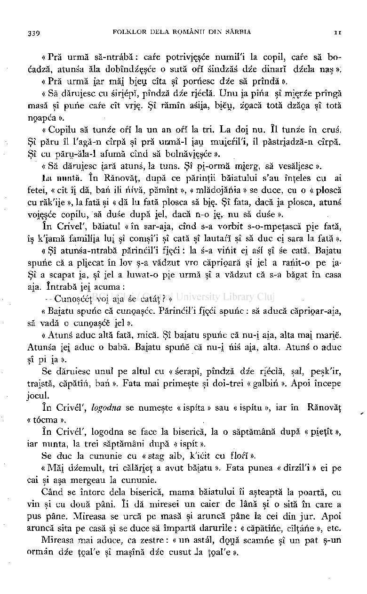

« Pră urmă să-ntrâbă : care potriviesce numil'i la copil, care să bo-

cadză, atunsa ăla dobîndzcşce o sută ofî sindzăs dze dinari dzela naş ». « Pră urmă iar măi bieu cita şî pornesc dze să prindă ». « Să dăruiesc cu siriépï, pîndză dze rieclă. Unu ia pîiîa şî mierze prîngă

masă şî pune care cît vriç. Şî rămîn asiia, biëu, zoacă totă dzăoa şî totă noapca ».

« Copilu să tunze ori la un an ori la tri. La doi nu. îl tunze în crus. Şî păru îl l'agă-n cîrpă şî pră urană-l iau muiefiTi, îl păstriadză-n cîrpă. Şî cu păru-ăla-1 afumă cînd să bolnăviesce ».

« Să dăruiesc iară atuns, la tuns. Şî pi-ormă mierg, să vesăliesc ». La nuntă. în Rănovăţ, după ce părinţii băiatului s'au înţeles cu ai fetei, « cît îi dă, ban iii hivă, pămînt », « mlădojăhia » se duce, cu o « ploscă cu răk'iie », la fată şi « dă lu fată plosca să bie_. Şî fata, dacă ia plosca, atuns voiesce copilu, să duse după iei, dacă n-o iç, nu să duse ».

în Crivel', băiatul « în sar-aia, cînd s-a vorbit s-o-mpeţască pie fată, îş k'jamă familiia lui şî comşî'i şî cată şî lăutari şî să duc ei sara la fată ».

« Şî atunsa-ntrabă părincil'i fieci : la s-a vinit ei asi şî se cată. Baiatu spune că a pliecat în Iov ş-a vădzut vro căprioară şî iei a ranit-o pe iaŞî a scăpat ia, şî iei a luwat-o pie urmă şî a vădzut că s-a băgat în casa aia. întrabă iei acuma :

— Cunoşceţ voi aia se catâţ ? » « Baiatu spune că cunoaşce. Părincil'i fieci spune : să aducă căprioar-aia,

să vadă o cunoaşce iei ».

« Atuns aduc altă fată, mică. Şî baiatu spune că nu-i aia, alta mai marje. Atunsa iei aduc o babă. Baiatu spufië că nu-i riis aia, alta. Atuns o aduc şî pi ia ».

Se dăruiesc unul pe altul cu « serapî, pîndză dze rieclă, şal, peşk'ir, traistă, căpătîn, ban ». Fata mai primeşte şi doi-trei « galbin ». Apoi începe jocul.

în Crivél', logodna se numeşte « ispita » sau « ispitu », iar în Rănovăţ « tôcma ».

în Crivél', logodna se face la biserică, la o săptămână după « pieţît »,

iar nunta, la trei săptămâni după « ispit ». Se duc la cununie cu « stag alb, k'icit cu flori ». « Măi dzemult, tri călărieţ a avut băiatu ». Fata punea « dîrzîl'i » ei pe

cai şi aşa mergeau la cununie.

Când se întorc delà biserică, mama băiatului îi aşteaptă la poartă, cu vin şi cu două pâni. îi dă miresei un caier de lână şi o sită în care a pus pâne. Mireasa se urcă pe masă şi aruncă pâne la cei din jur. Apoi aruncă sita pe casă şi se duce să împartă darurile : « căpătîne, cîlţâne », etc.

Mireasa mai aduce, ca zestre : « un astâl, două scamiie şî un pat ş-un ormân dze ţoal'e şî maşină dze cusut Ja ţoal'e ».

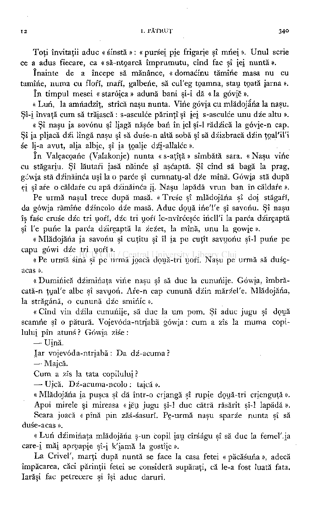

Toţi invitaţii aduc « sinstă » : « pursei pie frigarie şî mriei ». Unul scrie ce a adus fiecare, ca « să-ntoarcă împrumutu, cînd fac şî iei nuntă ».

înainte de a începe să mănânce, « domacinu tămîrie masa nu cu

tamîne, numa cu flofî, mafî, galbene, să cul'eg toamna, stau toată iarna ». în timpul mesei « staröica » adună bani şi-i dă « la gövie ». « Luri, la amnadzîţ, strică naşu nunta. Vine gövia cu mlădojăria la naşu.

Şî-i învaţă cum să trăiască : s-asculce părinţi şî iei s-asculce unu dze altu ».

« Şî naşu ia sovônu şî liagă năşce ban în iei şî-1 rădzică la gôvie-n cap. Şî ia pliacă dzi lîngă naşu şî să duse-n altă sobă şî să dzizbracă dzin ţoal'il'i se li-a avut, alia albie, şî ia ţoalie dzi-allalce ».

în Valeacoane (Valakonje) nunta « s-aţîţă » sîmbătă sara. « Naşu vine cu stăgariu. Şî lăutari iasă năince şî aşcaptă. Şî cînd să bagă la prag, göwia stă dzinăinca uşi la o parce şî cumnatu-al dze mînă. Göwia stă după ei şî are o căldare cu apă dzinăinca ii. Naşu lapădă vrun ban în căldare ».

Pe urmă naşul trece după masă. « Trese şî mlădojăria şî doi stăgafî, da göwia rămîrie dzincolo dze masă. Aduc două irieTe şî savoriu. Şî naşu îş fase cruse dze tri uofï, dze tri uofï le-nvîrceşce irieU'i la parca dzireaptă şî l'e purie la parca dzireaptă la zezet, la mînă, unu la gowie ».

« Mlădojăria ia savoriu şî cuţîtu şî îl ia pe cuţît savuoriu şî-1 purie pe capu göwi dze tri uofï ».

« Pe urma sină şî pe urmă joacă două-tri uofï. Naşu pe urmă să duseacas ».

« Duminică dzimiriaţa virie naşu şî să duc la cunuriiie. Göwia, îmbrăcată-n ţual'e albe şî savyori. Afe-n cap cunună dzin mărzel'e. Mlădojăria, la străgână, o cunună dze smiriic ».

« Cînd vin dzila cunuriiie, să duc la um pom. Şî aduc jugu şî două scamrie şî o pătură. Voievoda-ntriabă göwia : cum a zîs la muma copilului pîn atuns ? Göwia zise :

— Uină. Iar voievoda-ntriabă : Da dz-acuma ?

— Maică. Cum a zîs la tata copilului ?

— Uică. Dz-acuma-ncolo : taică ». « Mlădojăria ia puşca şî dă într-o criangă şî rupie două-tri crienguţă ». Apoi mirele şi mireasa « ieu jugu şî-1 duc cătră răsărit şî-1 lapădă ». Seara joacă « pînă pin zăs-sasurî. Pe-urmă naşu sparze nunta şî să

duse-acas ».

« Luri dzimiriaţa mlădojăria ş-un copil iau cîrsâgu şî să duc la femei',ia care-i măi aprbapie şî-i k'iamă la gostîie ».

La Crivel', marţi după nuntă se face la casa fetei « păcăsuria », adecă împăcarea, căci părinţii fetei se consideră supăraţi, că le-a fost luată fata. Iarăşi fac petrecere şi îşi aduc daruri.

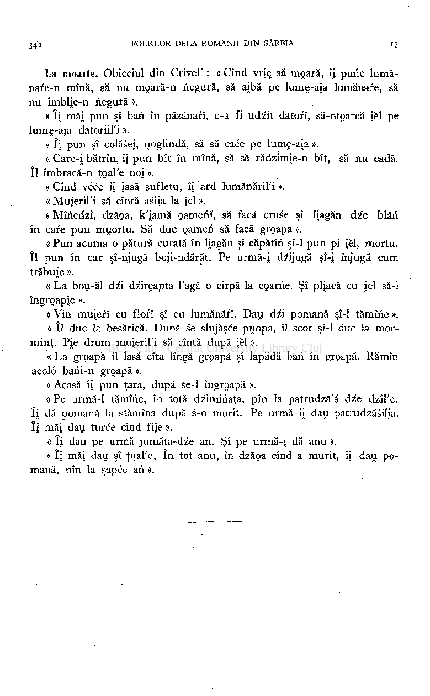

La moarte. Obiceiul din Crivel' : « Cînd vrie, să moară, îi pufie lumănafe-n mînă, să nu moară-n negură, să aibă pe lume-aia lumânare, să nu îmblie-n negură ».

« îi măi pun şî ban în păzănafî, c-a fi udzit datori, să-ntoarcă iei pe

lume-aia datorul'i ». « îi pun şî colăsei, uoglindă, să să cace pe lume-aia ». « Care-i bătrîn, îi pun bît în mînă, să să rădzîmie-n bît, să nu cadă.

îl îmbracă-n ţoal'e noi ». « Cînd vece îi iasă sufletu, îi ard lumănăril'i ». « Muieril'i să cîntă asiia la iei ». « Mînedzî, dzăoa, k'iamă oameni, să facă crase şî liagăn dze blăn

în care pun muortu. Să duc oamen să facă groapa ».

« Pun acuma o pătură curată în liagări şî căpătîn şî-1 pun pi iei, mortu. îl pun în car şî-njugă boii-ndărăt. Pe urmă-i dzijugă şî-i înjugă cum trăbuie ».

« La bou-ăl dzi dzireapta l'agă o cîrpă la coarne. Şî pliacă cu iei să-1 îngroapie ».

« Vin muieri cu flori şî cu lumânări. Dau dzi pomană şî-1 tămîne ». « îl duc la besărică. După se slujăşce puopa, îl scot şî-1 duc la mor-

minţ. Pie drum muieril'i să cîntă după iei ». « La groapă îl lasă cîta lîngă groapă şî lapădă ban în groapă. Rămîn

acolo bani-n groapă ». « Acasă îi pun ţara, după se-1 îngroapă ». « Pe urmă-1 tămîne, în totă dziminaţa, pîn la patrudză's dze dzîl'e.

îi dă pomană la stămîna după s-o murit. Pe urmă îi dau patrudzăsilia. îi măi dau turce cînd fiie ».

« îi dau pe urmă jumăta-dze an. Şî pe urmă-i dă anu ». « îi măi dau şî ţual'e. în tot anu, în dzăoa cînd a murit, îi dau po­

mană, pîn la şapce an ».

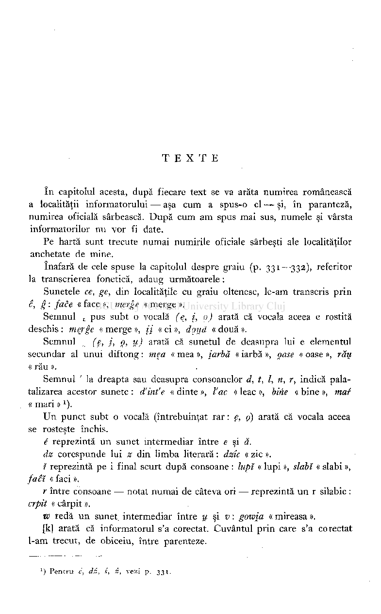

TEXT E

în capitolul acesta, după fiecare text se va arăta numirea românească a localităţii informatorului — aşa cum a spus-o el — şi, în paranteză, numirea oficială sârbească. După cum am spus mai sus, numele şi vârsta informatorilor nu vor fi date.

Pe hartă sunt trecute numai numirile oficiale sârbeşti ale localităţilor anchetate de mine.

înafară de cele spuse la capitolul despre graiu (p. 331—332), referitor la transcrierea fonetică, adaug următoarele :

Sunetele ce, ge, din localităţile cu graiu oltenesc, le-am transcris prin c, g : face « face », merge « merge ».

pus subt o vocală (e, i, o) arată că vocala aceea e rostită deschis : merge « merge », ii « ei », două « două ».

Semnul

L

Semnul (e, i, o, u) arată că sunetul de deasupra lui e elementul secundar al unui diftong : mea « mea », iarbă « iarbă », oase << oase », rău « rău ».

Semnul ' la dreapta sau deasupra consoanelor d, t, l, n, r, indică palatalizarea acestor sunete : d'int'e « dinte », l'ac « leac », birîe « bine », mar « mari »

Un punct subt o vocală (întrebuinţat rar : e, o) arată că vocala aceea

se rosteşte închis. ë reprezintă un sunet intermediar între e şi ă. dz corespunde lui z din limba literară : dzîc « zic ». i reprezintă pe i final scurt după consoane : lupi « lupi », slabi « slabi »,

faci « faci ». r între consoane — notat numai de câteva ori — reprezintă un r silabic :

crpit « cârpit ». îv redă un sunet, intermediar între u şi v : gowia « mireasa ». [k] arată că informatorul s'a corectat. Cuvântul prin care s'a corectat

l-am trecut, de obiceiu, între parenteze.

') Pentru c, di, s\ z, vezi p. 331.

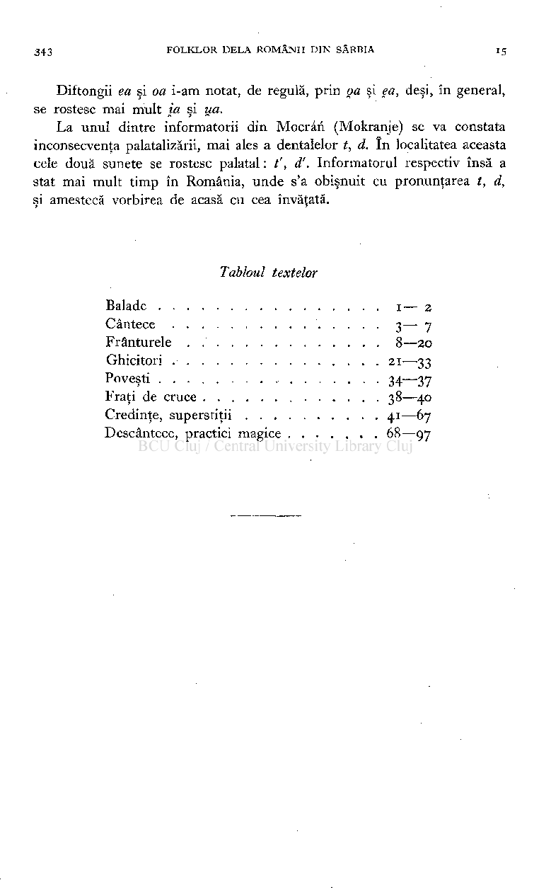

Diftongii ea şi oa i-am notat, de regulă, prin ga şi ea, deşi, în general, se rostesc mai mult ia şi ua.

La unul dintre informatorii din Mocrân (Mokranje) se va constata inconsecvenţa palatalizării, mai ales a dentalelor t, d. în localitatea aceasta cele două sunete se rostesc palatal : t', d'. Informatorul respectiv însă a stat mai mult timp în România, unde s'a obişnuit cu pronunţarea t, d, şi amestecă vorbirea de acasă cu cea învăţată.

Tabloul textelor

Balade i— 2 Cântece 3— 7 Frânturele . 8—20 Ghicitori 21—33 Poveşti 34—37 Fraţi de cruce 38—40 Credinţe, superstiţii 41—67 Descântece, practici magice 68—97

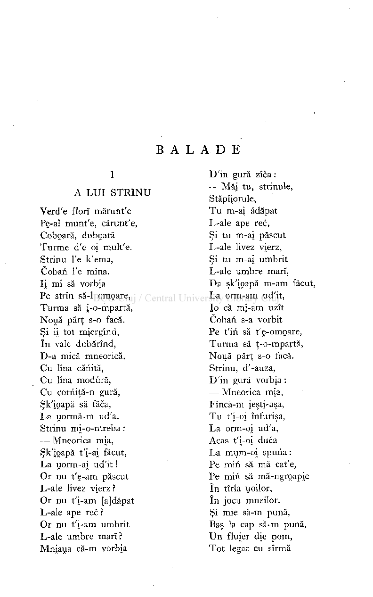

### BALAD E

D'in gură zîca :

1

— Măi tu, strinule, Stăpîiorule, Tu m-ai adăpat L-ale ape rec, Şi tu m-ai păscut L-ale livez vierz, Şi tu m-ai umbrit L-ale umbre mari, Da şk'ioapă m-am făcut, La orm-am ud'it, Io că mi-am uzît Cobaii s-a vorbit Pe t'ifi să t'e-omoare, Turma să ţ-o-mpartă, Nouă părţ s-o facă. Strinu, d'-auza, D'in gură vorbia :

A LUI STRINU

Verd'e flori mărunt'e Pe-al munt'e, cărunt'e, Coboară, duboară Turme d'e oi mult'e. Strinu l'e k'ema, Cobaii l'e mîna. Ii mi să vorbia Pe strin să-1 omoare, Turma să j-o-mpartă, Nouă părţ s-o facă. Şi ii tot miergînd, în vale dubărînd, D-a mică mneorică, Cu lina cănită, Cu lîna modură, Cu coriiiţă-n gură, Şk'ioapă să făca, La uormă-m ud'a. Strinu mi-o-ntreba :

— Mneorica mia, Fincă-m ieşti-aşa, Tu t'i-oi înfurişa, La orm-oi ud'a, Acas t'i-oi duca La mum-oi spuiia : Pe miii să mă cat'e, Pe min să mă-ngroapie în tîrla uoilor, în jocu mneilor. Şi mie să-m pună, Baş la cap să-m pună, Un fluier die pom, Tot legat cu sîrmă

— Mneorica mia, Şk'ioapă t'i-ai făcut, La uorm-ai ud'it ! Or nu t'e-am păscut L-ale livez vierz ? Or nu t'i-am [a]dăpat L-ale ape rec ? Or nu t'i-am umbrit L-ale umbre mari? Mniaua că-m vorbia

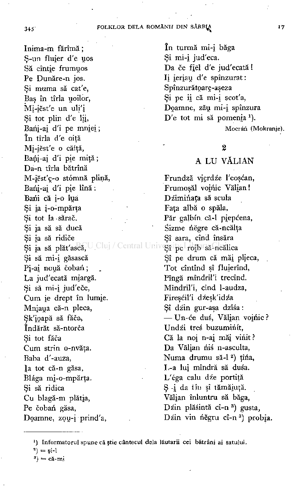

Inima-m fărîmă ; în turmă mi-i băga Ş-un fluier d'e uos Şi mi-i jud'eca. Să cîntie frumuos Da ce fiel d'e jud'ecată ! Pe Dunăre-n jos. Ii ieriau d'e spînzurat: Şi muma să cat'e, Spînzurătoare-aşeza Baş în tîrla iioilor, Şi pe ii că mi-i scot'a, Mi-iëst'e un uli'i Doamne, zău mi-i spînzura Şi tot plin d'e Iii, D'e tot mi să pomenia ). Bani-ai d'i pe mniei ; Mocrâh (Mokranji în tîrla d'e oiţă Mi-iëst'e 0 căiţă, 2 Baţii-ai d'i pie miţă ; A LU VÄLIAN Da-n tîrla bătrînă

- M-jest'e-o stomnă plină, Frundză vierdze l'eoşcan, Bani-ai d'i pie lînă : Frumoşăl voinic Vălian! Bani că i-o lua Dziminaţa să scula Şi ia i-o-mpărţa Faţa albă 0 spăla, Şi tot la sărac. Păr galbin că-1 piepcena, Şi ia să să ducă Sizme negre că-ncălţa Şi ia să ridice Şî sara, cînd însăra Şi ia să plăt'ască, Şî pe roib să-ncălica Şi să mi-i găsască Şî pe drum că măi plieca, Pi-ai nouă coban ; Tot cîntînd şî fluierînd, La jud'ecată miargă. Pîngă mîndril'i trecînd. Şi să mi-i jud'ece, Mîndril'i, cînd 1-audza, Cum ie drept în lumie. Fireşcil'i dzeşk'idza Mniaua că-n pleca, Şî dzin gur-aşa dzîsa : Şk'ioapă să făca, — Un-ce dus, Vălian voinic ? îndărăt să-ntorca Undzi très buzuminit, Şi tot făca Că la noi n-ai măi vinit ? Cum strin o-nvăţa. Da Vălian nis n-asculta,

) ţîna, Ia tot că-n găsa, L-a lui mîndră să dusa. Blâga mi-o-mpărţa. L'éga calu dze portiţă Şi să ridica Ş -i da tîn şî tămăiuţă. Cu blagă-m plătia, Vălian înluntru să băga, Pe coban găsa, Dzin plăsintă cî-n ) gusta, Doamne, zou-i prind'a, Dzin vin negru cî-n

Baba d'-auza, Numa drumu să-1

2

) probia.

3

') Informatorul spune că ştie cântecul delà lăutarii cei bătrâni ai satului.

###### ) = Şi-1

2

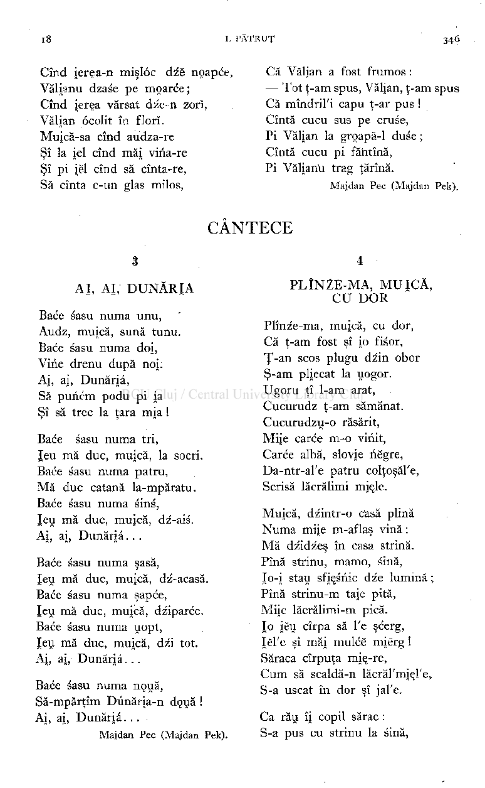

Că Vălian a fost frumos :

Cînd ierea-n mişloc die noapce, Văl ia nu dzase pe moarce; Cînd ierea vărsat dze-n zori, Vălian ocolit în flori. Muică-sa cînd audza-re Şî la iei cînd măi vina-re Şî pi iei cînd să cînta-re, Să cînta c-un glas milos,

— Tot ţ-am spus, Vălian, ţ-am spus Că mîndril'i capu ţ-ar pus ! Cîntă cucu sus pe cruse, Pi Vălian la groapă-1 duse ; Cîntă cucu pi făhtînă, Pi Vălianu trag ţarină.

Maidan Pec (Majdan Pek).

### CÂNTECE

4

3

PLÎNZE-MA, MUICĂ, CU DOR

AI, AI, DUNĂRIÂ

Bace sasu numa unu, Audz, muică, sună tunu. Bace sasu numa doi, Vine drenu după noi. Ai, ai, Dunăriâ, Să pufiém podu pi ia Şî să trec la ţara mia !

Plînze-ma, muică, cu dor, Că ţ-am fost şî io fisor, Ţ-an scos plugu dzin obor Ş-am pliecat la yogor. Ugoru ţî l-am arat, Cucurudz ţ-am sămănat. Cucurudzy-o răsărit, Miie carce m-o viriit, Carce albă, slovie riëgre, Da-ntr-al'e patru colţoşăl'e, Scrisă lăcrălimi miçle.

Bace sasu numa tri, leu mă duc, muică, la socri. Bace sasu numa patru, Mă duc catană la-mpăratu. Bace sasu numa sins, leu mă duc, muică, dz-ais. Ai, ai, Dunăriâ...

Muică, dzintr-o casă plină Numa miie m-aflaş vină : Mă dzidzeş în casa strină. Pînă strinu, mamo, sină, Io-i stau sfiçsriic dze lumină ; Pînă strinu-m taie pită, Miie lăcrălimi-m pică. Io jeu cîrpa să l'e şcerg, Ièl'e şî măi mulcë miërg ! Săraca cîrpuţa mje_-re, Cum să scaldă-n lăcrăl'miej'e, S-a uscat în dor şî jal'e.

Bace sasu numa şasă, leu mă duc, muică, dz-acasă. Bace sasu numa şapce, leu mă duc, muică, dziparce. Bace sasu numa yopt, leu mă duc, muică, dzi tot. Ai, ai, Dunăriâ...

Bace sasu numa nouă, Să-mpărţîm Dunăria-n două ! Ai, ai, Dunăriâ. ..

Ca rău îi copil sărac : S-a pus cu strinu la sină,

Maidan Pec (Majdan Pek).

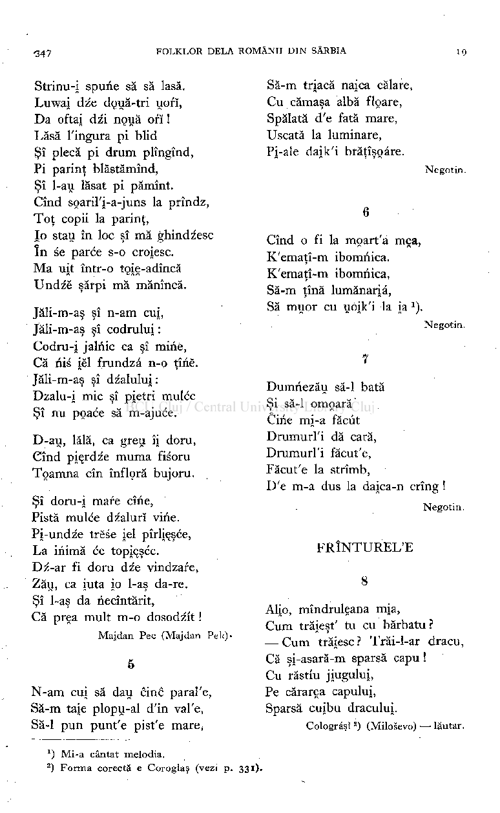

Să-m triacă naica călare, Cu cămaşa albă floare, Spălată d'e fată mare, Uscată la luminare, Pi-ale daik'i brăţîşoâre.

Strinu-i spune să să lasă. Luwaj dze două-tri yofî, Da oftai dzi nouă ofî ! Lăsă l'ingura pi blid Şî plecă pi drum plîngînd, Pi parinţ blăstămînd, Şî l-au lăsat pi pămînt. Cînd soaril'i-a-juns la prîndz, Toţ copii la parinţ, Io stau în loc şî mă ghindzesc în se parce s-o croiesc. Ma uit într-o tcie-adîncă Undzë şărpi mă mănîncă.

Negotin.

6

Cînd o fi la moart'a mea, K'emaţî-m ibomriica. K'emaţî-m ibomnica, Să-m ţînă lumănariâ, Să muor cu uoik'i la ia ).

Jăli-m-aş şî n-am cui, Jăli-m-aş şî codrului : Codru-i jalnic ca şî mine, Că riis iei frundză n-o ţîrie. Jăli-m-aş şî dzalului : Dzalu-i mic şî pietri mulce Şî nu poace să m-ajuce.

Negotin.

7

Dumnezău să-1 bată Şi să-1 omoară

Cine mi-a făcut

Drumurl'i dă cară, Drumurl'i făcut'e, Făcut'e la strîmb, D'e m-a dus la daica-n crîng !

D-au, lălă, ca greu îi doru, Cînd pierdze muma fisoru Toamna cîn înflora bujoru.

Şî doru-i mare cîrie, Pistă mulce dzalurî vine. Pi-undze trese iei pîrlicşce, La iriimă ce topicşce. Dz-ar fi doru dze vindzafe, Zău, ca iuta io l-aş da-re. Şî l-aş da necîntărit, Că prea mult m-o dosodzit !

Negotin.

FRÎNTUREL'E

8

Alio, mîndruleana mia, Cum trăieşt' tu cu bărbatu?

Maidan Pec (Majdan Pek).

— Cum trăiesc ? Trăi-l-ar dracu, Că şi-asară-m sparsă capu ! Cu răstiu jiugului, Pe cărarea capului, Sparsă cuibu dracului.

5

- N-am cui să dau cine paral'e,

- Să-m taie plopu-al d'in val'e,

- Să-1 pun punt'e pist'e mare,

Cologrâşî

###### ) (Milosevo) — lăutar.

2

- 1

) Mi-a cântat melodia.

- 2

###### ) Forma corectă e Coroglaş (vezi p. 331).

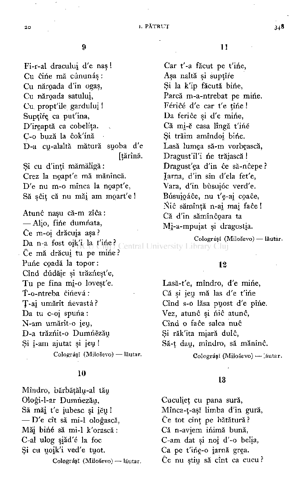

11

##### 9

Car t'-a făcut pe t'ine, Aşa naltă şi supţîfe Şi la k'ip făcută bine, Parcă m-a-ntrebat pe mine. Féricé d'e car t'e ţîne ! Da ferice şi d'e mine, Că mi-ë casa lîngă t'inë Şi trăim amîndoi bine. Lasă lumea să-m vorbească, Dragust'il'i ne trăiască ! Dragust'ea d'in ce să-ncepe ? Iarna, d'in sîn d'ela fet'e, Vara, d'in busuioc verd'e. Busuioace, nu t'e-ai coace, Nie sămînţă n-ai mai face ! Că d'in sămîncoara ta Mj-a-mpuiat şi dragostia.

Fi-r-al dracului d'e naş ! Cu cine mă cunun âş : Cu năroada d'in ogaş, Cu năroada satului, Cu propt'ile gardului ! Supţîfe. ca put'ina, D'ireaptă ca cobeliţa. C-o buză la cok'ină D-a cu-alaltă mătură suoba d'e

[ţarină.

Şi cu d'inţî mămăligă : Crez la noapt'e mă mănîncă. D'e nu m-o mînca la noapt'e, Să şciţ că nu măi am moart'e !

Atunc naşu că-m zîca :

— Alio, fine dumnata, Ce m-oi drăcuia aşa ? Da n-a fost oik'i la t'ine? Ce mă drăcui tu pe mine ? Pune coadă la topor : Cînd dudăie şi trăzneşt'e, Tu pe fina mi-o loveşt'e.

Cologrâşî (Milosevo) •— lăutar.

12

Lasă-t'e, mîndro, d'e mine, Că şi ieu mă las d'e t'ine Cînd s-o lăsa puost d'e pîiie. Vez, atunc şi nie atunc, Cînd o face sal ca nuc Şi răk'ita miară dulc, Să-ţ dau, mîndro, să mănînc.

- T-o-ntreba cineva :

- T-ai umărît nevastă? Da tu c-oi spună : N-am umărît-o ieu, D-a trăznit-o Dumnezău Şi i-am ajutat şi ieu !

Cologrâşî (Milosevo) — lăutar.

Cologrâşî (Milosevo) — lăutar.

10

13

Mîndro, bărbăţălu-al tău Ologi-l-ar Dumnezău, Să măi t'e iubesc şi ieu !

Cuculieţ cu pana sură, Mînca-ţ-aşî limba d'in gură, Ce tot cînţ pe bătătură ? Că n-aviem inimă bună, C-am dat şi noi d'-o belia, Ca pe t'ine-o iarnă grea. Ce nu ştiu să cînt ca cucu ?

— D'e cît să mi-1 ologască, Măi biné să mi-1 k'orască :

C-al ulog şiăd'e la foc

Şi cu uoik'i ved'e tuot.

Cologrâşî (Milosevo) — lăutar.

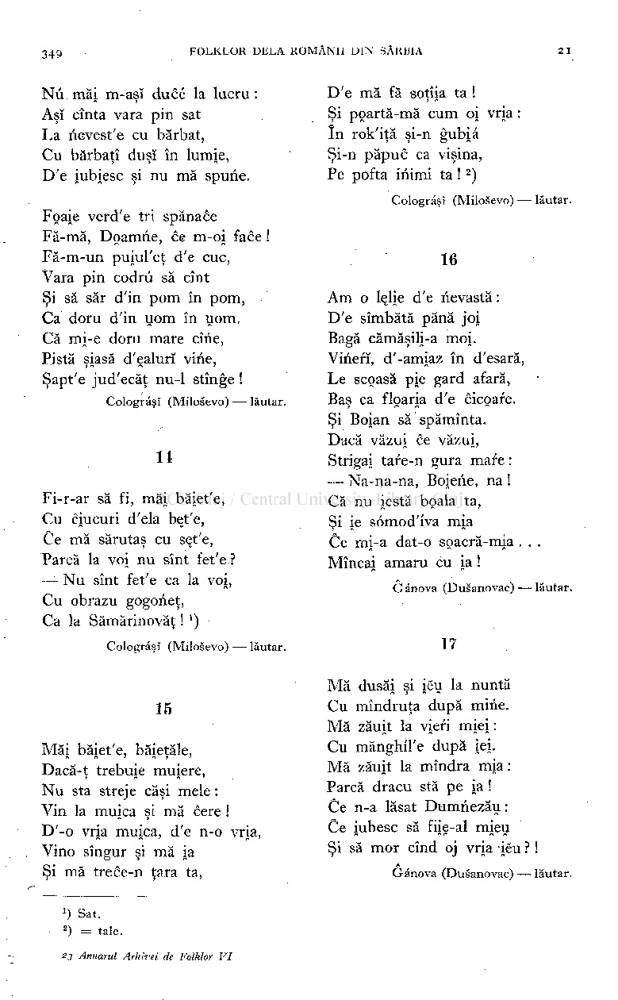

D'e mă fă soţîia ta ! Şi poartă-mă cum oi vria : în rok'iţă şi-n gubiâ Şi-n papuc ca vişina, Pe pofta inimi ta !

Nu măi m-aşî ducé la lucru : Aşi cînta vara pin sat La lîevest'e cu bărbat, Cu bărbaţi duşi în lumie, D'e iubiesc şi nu mă spune.

)

2

Cologrâşî (Milosevo) — lăutar.

Foaie verd'e tri spanace Fă-mă, Doamne, ce m-oi face ! Fă-m-un puiul'eţ d'e cuc, Vara pin codru să cînt Şi să săr d'in pom în pom, Ca doru d'in uom în uom. Că mi-e doru mare cîne, Pistă şiasă d'ealurî vine, Şapt'e jud'ecăţ nu-1 stînge !

16

Am o lçlje d'e nevastă : D'e sîmbătă pană joi Bagă cămăşili-a moi. Vineri, d'-amiaz în d'esară, Le scoasă pie gard afară, Baş ca floaria d'e cicoare. Şi Boian să spămînta. Dacă văzui ce văzui, Strigai tafe-n gura mafe : — Na-na-na, Boierie, na ! Că nu iestă boala ta, Şi ie sômod'iva mia Ce mi-a dat-o soacră-mia . . . Mîncai amaru cu ia !

Cologrâşî (Milosevo) — lăutar.

14

Fi-r-ar să fi, măi băiet'e, Cu ciucuri d'ela bçt'e, Ce mă sărutaş cu sçt'e, Parcă la voi nu sînt fet'e ? — Nu sînt fet'e ca la voi, Cu obrazu gogoneţ, Ca la Sămârinovăţ !

)

J

# 17

Cologrâşî (Milosevo) — lăutar.

Mă dusăi şi iëu la nuntă Cu mîndruţa după mine. Mă zăuit la viefi miei : Cu mănghfl'e după iei. Mă zăuit la mîndra mia : Parcă dracu stă pe ia ! Ce n-a lăsat Dumfîezău : Ce iubesc să fiie-al mieu Şi să mor cînd oj vria iëu ? !

15

Măi băiet'e, băieţăle, Dacă-ţ trebuie muiere, Nu sta streje căşi mele : Vin la muica şi mă cere ! D'-o vria muica, d'e n-o vria, Vino singur şi mă ia Şi mă trece-n ţara ta,

Gânova (Dusanovac) — lăutar.

') Sat.

) = tale.

2

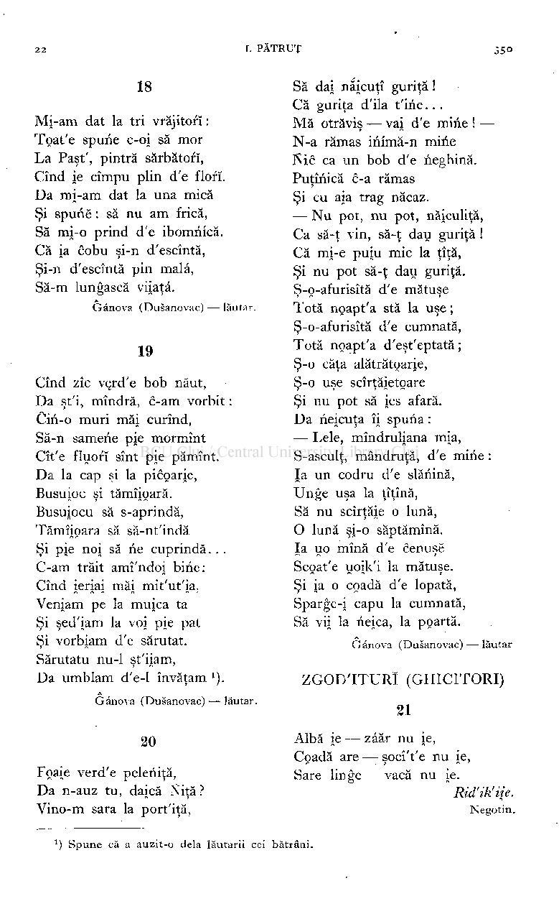

350

I. PÄTRU T

22

Să dai năicuţî guriţă ! Că guriţa d'ila t'irie... Mă otrăviş — vai d'e mine ! N-a rămas iriimă-n mine f\îc ca un bob d'e neghină. Puţîriică c-a rămas Şi cu aia trag năcaz.

18

Mi-am dat la tri vrăjitori : Toat'e spune c-oi să mor La Paşt', pintră sărbători, Cînd ie cîmpu plin d'e flori. Da mi-am dat la una mică Şi spune : să nu am frică,

— Nu pot, nu pot, năiculiţă, Ca să-ţ vin, să-ţ dau guriţă ! Că mi-e puiu mic la ţîţă, Şi nu pot să-ţ dau guriţă. Ş-o-afurisîtă d'e mătuşe Totă noapt'a stă la uşe ; Ş-o-afurisîtă d'e cumnată, Totă noapt'a d'eşt'eptată ; Ş-o căţa alătrătoarie, Ş-o uşe scîrţăietoare Şi nu pot să ies afară. Da rieicuţa îi spuria :

- Să mi-o prind d'e ibomnică. Că ia cobu şi-n d'escîntă, Şi-n d'escîntă pin mala,

- Să-m lungască viiaţâ. Genova (Dusanovac) — lăutar.

19

Cînd zîc verd'e bob năut, Da şt'i, mîndră, c-am vorbit : Cin-o muri măi curînd,

- Să-n samerie pie mormînt Cît'e fluofï sînt pie pămînt. Da la cap şi la picoarie, Busuioc şi tămîioară. Busuiocu să s-aprindă,

- Tămîioară să să-nt'indă Şi pie noi să rie cuprindă. . . C-am trăit amî'ndoi birie: Cînd ieriai măi mit'ut'ia, Veniam pe la muica ta Şi şed'iam la voi pie pat Şi vorbiam d'e sărutat. Sărutatu nu-1 şt'iiam, Da umblam d'e-1 învăţam ).

— Lele, mîndruliana mia, S-asculţ, mândruţă, d'e mine :

- Ia un codru d'e slăriină, Unge uşa la ţîţînă, Să nu scîrţăie o lună, O lună şi-o săptămînă.
- Ia uo mînă d'e cenuşe Scoat'e yojk'i la mătuşe. Şi ia o coadă d'e lopată, Sparge-i capu la cumnată, Să vii la rieica, la poartă.

Gânova (Dusanovac) — lăutar

###### ZGODTTURI (GHICITORI)

Gânova (Dusanovac) — lăutar.

21

Albă ie — zâăr nu ie, Coadă are — şocî't'e nu ie, Sare linge — vacă nu ie.

20

Foaie verd'e peleriiţă, Da n-auz tu, daică Niţă? Vino-m sara la port'iţă,

Rid'ik'iie.

Negotin.

*) Spune că a auzit-o delà lăutarii cei bătrâni.

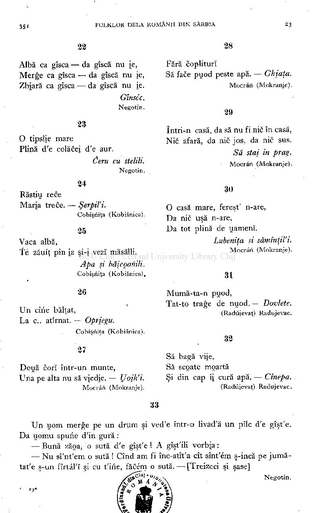

22 28

Fără copliturî Să face pyod peste apă. — Ghiaţa.

Albă ca gîsca — da gîscă nu ie, Merge ca gîsca — da gîscă nu ie, Zbiară ca gîsca — da gîscă nu ie.

Mocrân (Mokranje).

Gînsc'c.

Negotin.

29

23

întri-n casă, da să nu fi nie în casă, Nie afară, da nie jos, da nie sus.

O tipsîie mare Plină d'e colăcei d'e aur.

Să stai in prag.

Ceru cu stelili.

Mocrân (Mokranje).

Negotin.

- 24

Răstiu rece Maria trece. — Şerpil'i.

Cobişniţa (Kobisnica).

- 25

30

O casă mare, fereşt' n-are, Da nie uşă n-are, Da tot plină de uamenî.

Lubeniţa şi sămînţil'i.

Vaca albă, Té zăuiţ pin ia şi-i vezi măsălli.

Mocrân (Mokranje).

Apa şi băicoanili.

Cobişniţa (Kobisnica).

31

Mumă-ta-n pyod, Tat-to trage de nuod. — Dovlete.

26

Un cîrie bălţat, La c . atîrnat. — Opriegu.

(Raduievaţ) Radujevac.

Cobişniţa (Kobisnica).

32

27

Să bagă viie, Să scoate moartă Şi din cap îi cură apă. — Cînepa.

Două cori într-un munte, Una pe alta nu să viedie. — Uoik'i.

(Raduievaţ) Radujevac.

Mocrân (Mokranje).

33

Un yom merge pe un drum şi ved'e într-o livad'ă un pîlc d'e gîşt'e. Da uomu spune d'in gură :

— Bună zăoa, o sută d'e gîşt'e ! A gîşt'ili vorbia :

— Nu sî'nt'em o sută ! Cînd am fi înc-atît'a cît sînt'ém ş-incă pe jumătat'e ş-un fîrtâl'î şi cu t'ifîe, facem o sută. — [Treizeci şi şase]

Negotin.

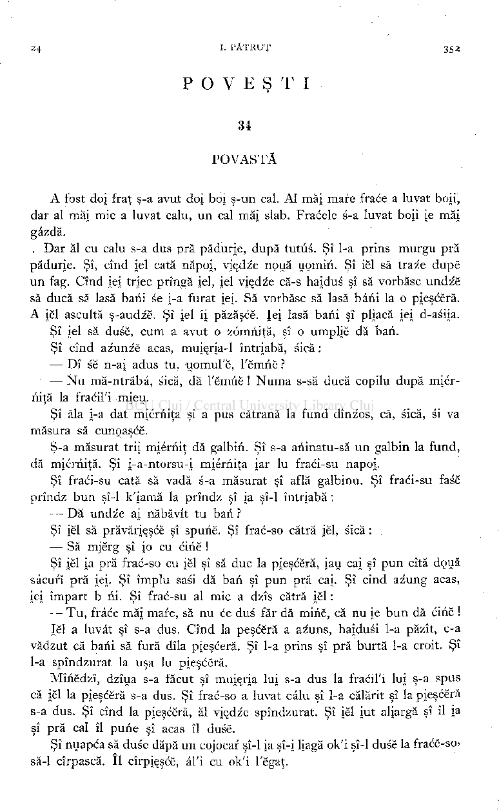

### POVEŞT

34

POVASTÄ

A fost doi fraţ ş-a avut doi boi ş-un cal. Al măi mare frace a luvat boii, dar al măi mic a luvat calu, un cal măi slab. Fracele s-a luvat boii ie măi gazdă.

. Dar ăl cu calu s-a dus pră pădurie, după tutiis. Şî 1-a prins murgu pră pădurie. Şî, cînd iei cată năpoi, viçdze nouă uomiri. Şî iei să traze dupe un fag. Cînd iei triec prîngă iei, iei vie_dze că-s haidus şî să vorbăsc undze să ducă să lasă bani se i-a furat iei. Să vorbăsc să lasă bani la o pieşceră. A iei ascultă ş-audze. Şî iei îi păzăşce. Iei lasă bani şî pliacă iei d-asiia.

Şî iei să dusë, cum a avut o zomniţă, şî o umplië dă ban. Şî cînd azunzë acas, muie.ria-1 întriabă, sică :

— Dî se n-ai adus tu, uomul'ë, l'ëmnë ?

— Nu mă-ntrăbâ, sică, dă l'ëmnë ! Numa s-să ducă copilu după miérriiţă la fracil'i mieu.

Şî ăla i-a dat mierriiţa şî a pus cătrană la fund dînzos, că, sică, si va măsura să cunoaşce.

Ş-a măsurat trii mierriiţ dă galbiri. Şî s-a aninatu-să un galbin la fund, dă mierriiţa. Şî i-a-ntorsu-i mierriiţa iar lu fraci-su napoi.

Şî fraci-su cată să vadă s-a măsurat şî află galbinu. Şî fraci-su fase prîndz bun şî-1 k'iamă la prîndz şî ia şî-1 întriabă;

— Dă undze ai năbăvit tu ban ? Şî iei să prăvăricşce şî spune. Şî frac-so cătră iei, sică :

— Să miërg şî io cu cirië ! Şî iei ia pră frac-so cu iei şî să duc la pieşceră, iau cai şî pun cîtă două

sàcufï pră iei. Şî împlu sasi dă bari şî pun pră cai. Şî cînd azung acas, iei împart b hi. Şî frac-su al mic a dzîs cătră iei :

— Tu, frâce măi mafe, să nu ce dus făr dă mine, că nu ie bun dă cine ! Iei a luvât şî s-a dus. Cînd la peşceră a azuns, haidusi 1-a păzît, c-a

vădzut că bani să fură dîla pieşceră. Şî 1-a prins şî pră burtă 1-a croit. Şî 1-a spîndzurat la uşa lu pieşceră.

Mînëdzî, dzîua s-a făcut şî muiçria lui s-a dus la fracil'i lui ş-a spus

- că iël la pieşceră s-a dus. Şî frac-so a luvat calu şî 1-a călărit şî la pieşceră s-a dus. Şî cînd la pieşceră, ăl viçdze spîndzurat. Şî iël iut aliargă şî îl ia şî pră cal îl pune şî acas îl dusë.

Şî nyapca să duse dăpă un cojocar şî-1 ia şî-i liagă ok'i şî-1 dusë la frace-so> să-1 cîrpască. îl cîrpicşce, âl'i cu ok'i l'egaţ.

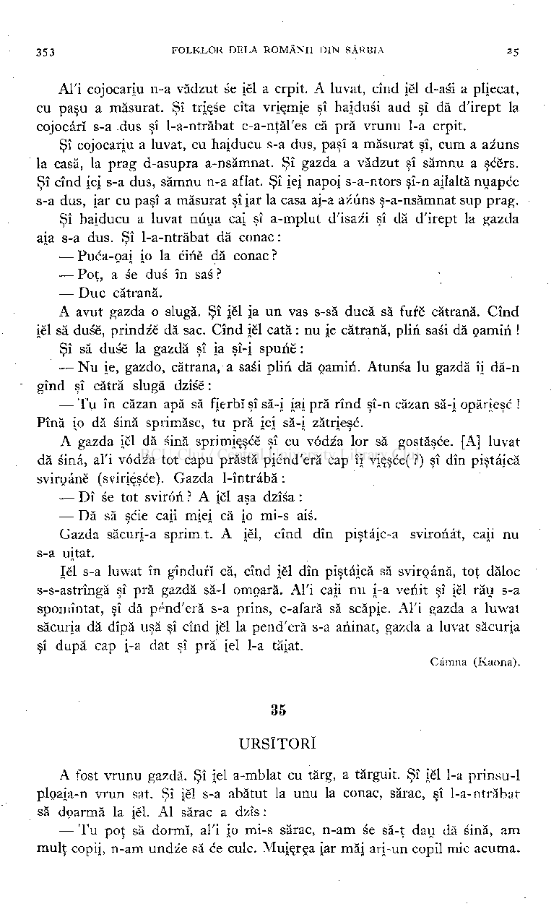

Al'i cojocariu n-a vădzut se iei a crpit. A luvat, cînd iël d-asi a pliecat, cu paşu a măsurat. Şî triese cita vriçmie şî haidusi aud şî dă d'irept la cojocari s-a dus şî 1-a-ntrăbat c-a-nţăl'es că pră vrunu 1-a crpit.

Şî cojocariu a luvat, cu haiducu s-a dus, paşi a măsurat şî, cum a azuns la casă, la prag d-asupra a-nsămnat. Şî gazda a vădzut şî sămnu a şcers. Şî cînd iei s-a dus, sămnu n-a aflat. Şî iei napoi s-a-ntors şî-n ailaltă nuapee s-a dus, iar cu paşî a măsurat şî iar la casa ai-a azuns ş-a-nsămnat sup prag.

Şî haiducu a luvat nuua cai şî a-mplut d'isazi şî dă d'irept Iar gazda aia s-a dus. Şî 1-a-ntrăbat dă conac :

— Puca-oai io la cine dă conac ?

— Poţ, a se dus în sas ?

— Duc cătrană. A avut gazda o slugă. Şî iël ia un vas s-să ducă să fufe cătrană. Cînd

iël să dusë, prindze dă sac. Cînd iël cată : nu ie cătrană, plin sasi dă oamih ! Şî să dusë la gazdă şî ia şî—i spune :

— Nu ie, gazdo, cătrană, a sasi plin dă oamih. Atunsa lu gazdă îi dă-n gînd şî cătră slugă dzîse :

— Tu în cazan apă să fierbi şî să-i iai pră rînd şî-n cazan să-i opărieşc ! Pînă io dă sină sprimăsc, tu pră iei să-i zătrieşc.

A gazda iël dă sină sprimiescë şî cu vödza lor să gostăşce. [A] luvat

- dă sind, al'i vödza tot capu prăstă piend'eră cap îi vicşce( ?) şî dîn piştâică sviroânë (sviricşee). Gazda 1-întrâbă :

— Di se tot svirôh ? A iël aşa dzîsa :

— Dă să şcie caii miei că io mi-s ais. Gazda săcuri-a sprim.t. A iël, cînd dîn piştâie-a svirohât, caii nu

s-a uitat.

Iël s-a luwat în gînduri că, cînd iël dîn piştâică să sviroână, toţ dăloc s-s-astrîngă şî pră gazdă să-1 omoară. Al'i caii nu i-a venit şî iël rău s-a spomîntat, şî dă pend'eră s-a prins, c-afară să scăpie. Al'i gazda a luwat săcuria dă dîpă uşă şî cînd iël la pend'eră s-a aninat, gazda a luvat săcuria şî după cap i-a dat şî pră iei 1-a tăiat.

Câmna (Kaona).

35

URSÎTORI

A fost vrunu gazdă. Şî iei a-mblat cu tărg, a târguit. Şî iël 1-a prinsu-1 ploaia-n vrun sat. Şî iël s-a abătut la unu la conac, sărac, şî 1-a-ntrăbat să doarmă la iël. Al sărac a dzîs :

— Tu poţ să dormî, al'i io mi-s sărac, n-am se să-ţ dau dă sină, am mulţ copii, n-am undze să ce culc. Muierea iar măi ari-un copil mic acuma.

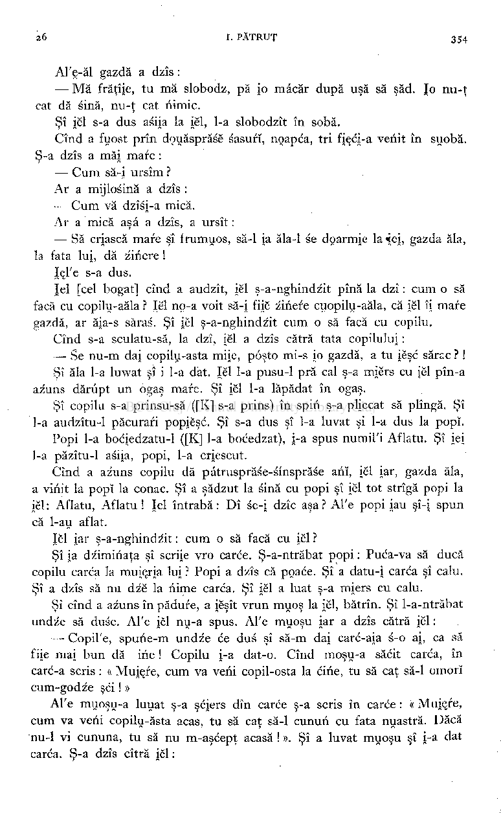

Al'e-ăl gazdă a dzîs :

— Mă frăţîie, tu mă slobodz, pă io mâcăr după uşă să şăd. Io nu-ţ

cat dă sină, nu-ţ cat nimic. Şî iël s-a dus asiia la iei, 1-a slobodzît în sobă. Cînd a fuost prîn douăsprăse sasufï, noapca, tri fiçéi-a venit în suobă.

Ş-a dzîs a măi mare :

— Cum să-i ursîm ? Ar a mijlosină a dzîs :

— Cum vă dzîsi-a mică. Ar a mică aşa a dzîs, a ursît :

— Să criască mare şî frumuos, să-1 ia ăla-1 se doarmie la «iei, gazda ăla,

la fata lui, dă ziriere ! Ie_l'e s-a dus. Iei [cel bogat] cînd a audzît, iël ş-a-nghindzit pînă la dzî : cum o să

facă cu copilu-aăla ? Iei no-a voit să-i fiië ziriefe cuopilu-aăla, că iël îi mare gazdă, ar ăia-s săras. Şî iël ş-a-nghindzit cum o să facă cu copilu.

Cînd s-a sculatu-să, la dzî, iël a dzîs cătră tata copilului :

— fie nu-m dai copilu-asta miie, poşto mi-s io gazdă, a tu ieşc sărac ? ! Şî ăla 1-a luwat şî i 1-a dat. Iël 1-a pusu-1 pră cal ş-a miërs cu iël pîn-a

azuns dărupt un ogaş mare. Şî iël 1-a lăpădat în ogaş.

Şî copilu s-a prinsu-să ([K] s-a prins) în spin ş-a pliecat să plîngă. Şî 1-a audzîtu-1 păcurari popieşc. Şî s-a dus şî 1-a luvat şi 1-a dus la popî.

Popi 1-a bociedzatu-1 ([K] 1-a bocedzat), i-a spus numil'i Aflatu. Şî iei 1-a păzîtu-1 asiia, popi, 1-a criescut.

Cînd a azuns copilu dă pdtrusprăse-sinsprăse ariï, iël iar, gazda ăla, a vinit la popî la conac. Şî a şădzut la sină cu popi şî iël tot strigă popi la iei: Aflatu, Aflatu ! Iei întrabă : Dî se-i dzîc aşa? Al'e popi iau şî-i spun că l-au aflat.

Iël iar ş-a-nghindzit : cum o să facă cu iël ? Şî ia dzimiriaţa şî scriie vro carce. Ş-a-ntrăbat popi : Puca-va să ducă

copilu cârca la muiçria lui ? Popi a dzîs că poace. Şî a datu-i cârca şî calu. Şî a dzîs să nu dze la iîime cârca. Şî iël a luat ş-a miers cu calu.

Şî cînd a azuns în pădufe, a ieşît vrun muoş la iël, bătrîn. Şî 1-a-ntrăbat undze să duse. Al'e iei nu-a spus. Al'e muoşu iar a dzîs cătră iël :

— Copil'e, spurie-m undze ce dus şî să-m dai carc-aia s-o ai, ca să fiie mai bun dă ine ! Copilu i-a dat-o. Cînd moşu-a săcit cârca, în carc-a scris : « Muiçfe, cum va veni copil-osta la cine, tu să caţ să-1 omorî cum-godze şei ! »

Al'e muoşu-a luuat ş-a şciers dîn carce ş-a scris în carce : « Muie/e,

cum va verii copilu-ăsta acas, tu să caţ să-1 cunuri cu fata nuastră. Dacă nu-1 vi cununa, tu să nu m-aşcepţ acasă ! ». Şî a luvat muoşu şî i-a dat cârca. Ş-a dzîs cîtră iël :

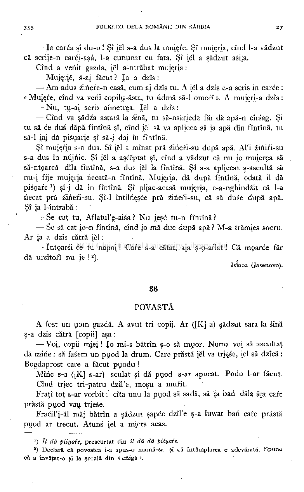

— Ia cârca şî du-o ! Şî iël s-a dus la muiere. Şî muiejia, cînd 1-a vădzut că scriie-n carci-aşâ, 1-a cununat cu fata. Şî iël a şădzut asiia.

Cînd a venit gazda, iël a-ntrăbat muieria :

— Muiçrië, s-ai făcut ? Ia a dzîs :

— Am adus zinefe-n casă, cum ai dzîs tu. A iël a dzîs c-a scris în carce : « Muie/e, cînd va verii copily-ăsta, tu ridmă să-1 omofî ». A muiçri-a dzîs :

— Nu, ty-ai scris aimetrea. Iël a dzîs :

— Cînd va şădza astară la sină, tu să-nsăriedz făr dă apă-n cîrsag. Şî tu să ce dus dăpă fîntînă şî, cînd iël să va aplieca să ia apă dîn fîntînă, tu să-1 iai dă pisyarie şî să-i dai în fîntînă.

Şî muie/ia s-a dus. Şî iël a mînat pră ziriefi-su după apă. Al'i ziriifi-su s-a dus în niijriic. Şî iël a aşceptat şî, cînd a vădzut că nu ie muierea să

- să-ntoarcă dîla fîntînă, s-a dus iei la fîntînă. Şî s-a apliecat ş-ascultă să nu-i fiie muiçria riecată-n fîntînă. Muieria, dă după fîntînă, odată îl dă pisoafe *) şî-i dă în fîntînă. Şî pliac-acasă muieria, c-a-nghindzit că 1-a riecat pră ziriefi-su. Şî-1 întîlricşce pră ziriefi-su, că să duse după apă. Şî ia 1-întrabă :

— Se caţ tu, Aflatul'e-aisa ? Nu ieşc tu-n fîntînă ?

— Se să cat io-n fîntînă, cînd io mă duc după apă ? M-a trămies socru. Ar ia a dzîs cătră iël :

— întoarsi-ce tu napoi ! Care s-a cătat, aia ş-o-aflat ! Că moarce făr dă ursîtofî nu ie ! ) .

Isînoa (Jasenovo).

36

POVASTÄ

A fost un yom gazdă. A avut tri copii. Ar ([K] a) şădzut sara la sină ş-a dzîs cătră [copii] aşa :

— Voi, copii miei ! Io mi-s bătrîn ş-o să muor. Numa voi să ascultat dă mine : să fasem un pyod la drum. Care prăstă iël va triçse, iei să dzîcă : Bogdaprost care a făcut puodu !

Mîrie s-a (

K] s-ar) sculat şî dă pyod s-ar apucat. Podu l-ar făcut. Cînd triec tri-patru dzîl'e, moşu a murit. Fraţî toţ s-ar vorbit : cîta unu la pyod să şadă, să ia bari dăla ăia care

L

prăstă pyod vay triese.

Fracil'i-ăl măi bătrîn a şădzut şapce dzîl'e ş-a luwat bari care prăstă pyod ar trecut. Atuns iei a miers acas.

) // dă pihjafe, prescurtat din îl dă dă pisuafe.

1

*) Declară că povestea i-a spus-o mamă-sa şi că întâmplarea e adevărată. Spune că a învăţat-o şi la şcoală din « cnigă ».

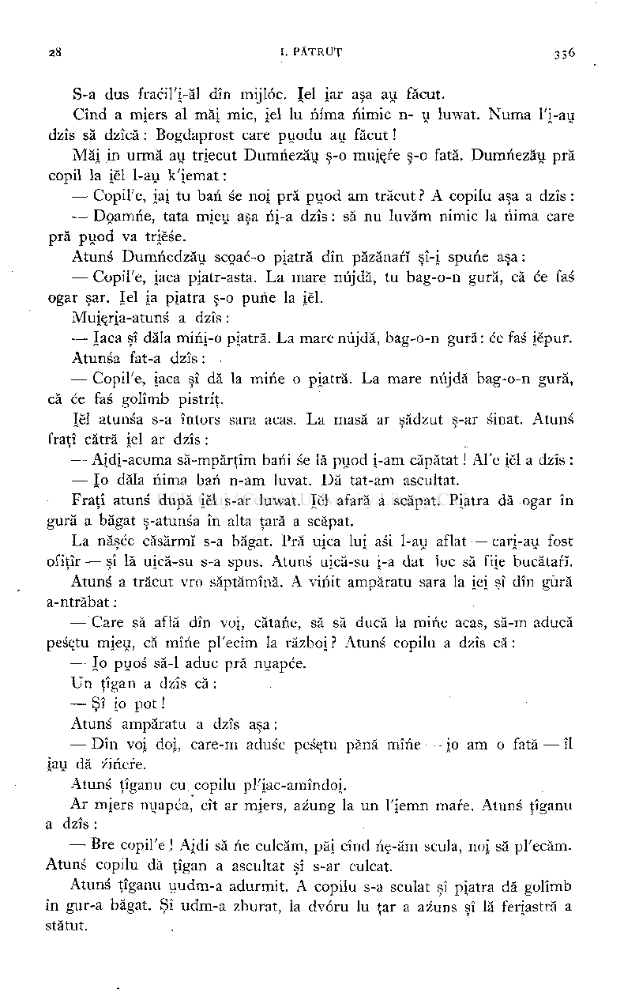

S-a dus fracil'i-ăl dîn mijloc. Iei iar aşa au făcut. Cînd a miers al măi mic, iei lu riima nimic n- u luwat. Numa l'i-au

dzîs să dzîcă : Bogdaprost care pyodu au făcut !

Măi in urmă au triecut Dumnezău ş-o muiere ş-o fată. Dumnezău pră copil la iei l-au k'iemat :

— Copil'e, iai tu băii se noi pră puod am trăcut ? A copilu aşa a dzîs : — Doamne, tata mieu aşa rii-a dzîs : să nu luvăm nimic la riima care

pră puod va triese. Atuns Dumriedzău scoac-o piatră dîn păzănafî şî-i spune aşa :

— Copil'e, iaca piatr-asta. La mare nujdă, tu bag-o-n gură, că ce fas ogar şar. Iei ia piatra ş-o pune la iei.

Muiçria-atuns a dzîs :

— Iaca şî dăla mini-o piatră. La mare nujdă, bag-o-n gură: ce fas iëpur. Atunsa fat-a dzîs :

— Copil'e, iaca şî dă la mine o piatră. La mare nujdă bag-o-n gură, că ce fas golîmb pistriţ.

Iei atunsa s-a întors sara acas. La masă ar şădzut ş-ar sinat. Atuns fraţî cătră iei ar dzîs :

— Aidi-acuma să-mpărţîm barii se lă puod i-am căpătat ! Al'e iël a dzîs :

— Io dăla riima ban n-am luvat. Dă tat-am ascultat. Fraţî atuns după iei s-ar luwat. Iël afară a scăpat. Piatra dă ogar în

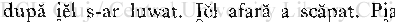

gură a băgat ş-atunsa în alta ţară a scăpat.

La năşce căsărmî s-a băgat. Pră uica lui asi l-au aflat — cari-au fost ofiţîr — şî lă uică-su s-a spus. Atuns uică-su i-a dat loc să fiie bucătari.

Atuns a trăcut vro săptămînă. A viriit ampăratu sara la iei şî dîn gură a-ntrăbat :

— Care să află dîn voi, cătarie, să să ducă la mine acas, să-m aducă pesetu mieu, că mîrie pl'ecîm la război ? Atuns copilu a dzîs că :

— Io puos să-1 aduc pră nuapce. Un ţigan a dzîs că :

— Şî io pot ! Atuns ampăratu a dzîs aşa :

— Dîn voi doi, care-m aduse pesçtu pană mîrie — io am o fată — îl

iau dă ziriefe. Atuns ţiganii cu copilu pl'iac-amîndoi. Ar miers nyapca, cît ar miers, azung la un l'iemn mafe. Atuns ţîganu

a dzîs :

— Bre copil'e ! Ajdi să fie culcăm, păi cînd rie-ăm scula, noi să pl'ecăm. Atuns copilu dă ţîgan a ascultat şî s-ar culcat.

Atuns" ţîganu uudm-a adurmit. A copilu s-a sculat şî piatra dă golîmb în gur-a băgat. Şî udm-a zburat, la dvöru lu ţar a azuns şî lă feriastră a stătut.

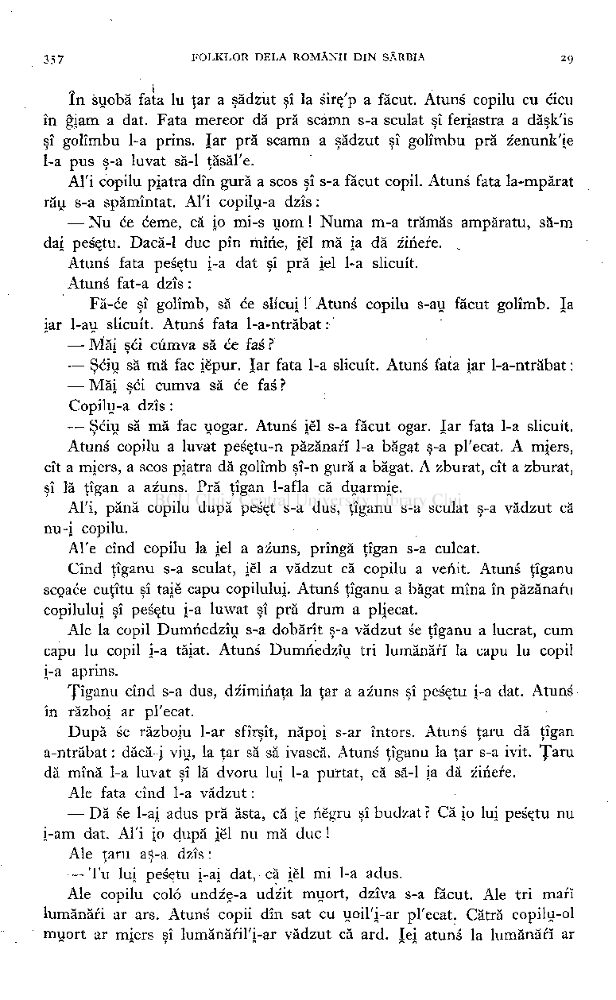

în suobă fata lu ţar a şădzut şî la sirç'p a făcut. Atuns copilu cu cicu în giam a dat. Fata mereor dă pră scamn s-a sculat şî feriastra a dăşk'is şî golîmbu l-a prins. Iar pră scamn a şădzut şî golîmbu pră zenunk'ie l-a pus ş-a luvat să-1 ţăsăl'e.

Al'i copilu piatra dîn gură a scos şî s-a făcut copil. Atuns fata la-mpărat rău s-a spămîntat. Al'i copilu-a dzîs :

— Nu ce cerne, că io mi-s uom ! Numa m-a trămăs ampăratu, să-m

dai pesetu. Dacă-1 duc pîn mîrie, iei mă ia dă z'inere. Atuns fata pesetu i-a dat şî pră iei l-a slicuit. Atuns fat-a dzîs :

— Fă-ce şî golîmb, să ce slicui ! Atuns copilu s-au făcut golîmb. Ia iar l-au slicuit. Atuns fata 1-a-ntrăbat : '

— Măi şei cumva să ce fas ?

— Şciu să mă fac jëpur. Iar fata l-a slicuit. Atuns fata iar 1-a-ntrăbat :

— Măi şei cumva să ce fas ? Copilu-a dzîs :

— Şciu să mă fac uogar. Atuns iei s-a făcut ogar. Iar fata l-a slicuit. Atuns copilu a luvat pesçtu-n păzănafî l-a băgat ş-a pl'ecat. A miers,

cît a miers, a scos piatra dă golîmb şî-n gură a băgat. A zburat, cît a zburat, şî lă ţîgan a azuns. Pră ţîgan l-afla că duarmie.

Al'i, pană copilu după peset s-a dus, ţîganu s-a sculat ş-a vădzut că

nu-i copilu. Al'e cînd copilu la iei a azuns, prîngă ţîgan s-a culcat. Cînd ţîganu s-a sculat, iei a vădzut că copilu a venit. Atuns ţîganu

scoace cuţîtu şî taie capu copilului. Atuns ţîganu a băgat mîna în păzănafu copilului şî pesçtu i-a luwat şî pră drum a pliecat.

Ale la copil Dumnedzîu s-a dobărît ş-a vădzut se ţîganu a lucrat, cum capu lu copil i-a tăiat. Atuns Dumnedzîu tri lumânări la capu lu copil i-a aprins.

Ţîganu cînd s-a dus, dziminaţa la ţar a azuns şî pesçtu i-a dat. Atuns în război ar pl'ecat.

După se războiu l-ar sfîrşît, năpoi s-ar întors. Atuns ţaru dă ţîgan a-ntrăbat : dăcă-i viu, la ţar să să ivască. Atuns ţîganu la ţar s-a ivit. Ţaru dă mînă l-a luvat şî lă dvoru lui l-a purtat, că să-1 ia dă ziriefe.

Ale fata cînd l-a vădzut :

— Dă se l-ai adus pră ăsta, că ie negru şî budzat ? Că io lui pesçtu nu i-am dat. Al'i io după iei nu mă duc !

Ale ţaru aş-a dzîs :

— Tu lui pesetu i-ai dat, că iei mi l-a adus. Ale copilu colo undze-a udzit muort, dzîva s-a făcut. Ale tri mafï lumânări ar ars. Atuns copii dîn sat cu uoil'i-ar pl'ecat. Cătră copily-ol muort ar miers şî lumănăfil'i-ar vădzut că ard. Iei atuns la lumânări ar

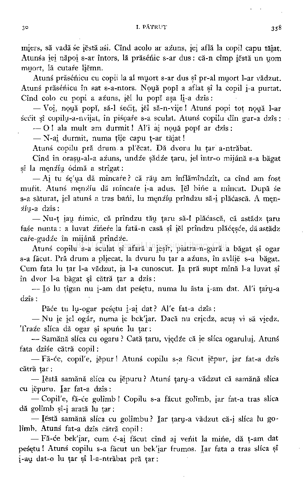

3° I. PÄTRU T 358

miers, să vadă se iestă asi. Cînd acolo ar azuns, iei află la copil capu tăiat. Atunsa iei năpoi s-ar întors, lă prăseriic s-ar dus : că-n cîmp iestă un uom muort, lă cutafe liëmn.

Atuns prăserîicu cu copii la al muort s-ar dus şî pr-al muort l-ar vădzut. Atuns prăseriicu în sat s-a-ntors. Nouă popï a aflat şî la copil i-a purtat. Cînd colo cu popi a azuns, iël lu popi aşa li-a dzîs :

— Voi, nouă popi, să-1 seciţ, iël să-n-viie ! Atuns popi toţ nouă l-ar secit şî copilu-a-nviiat, în pisoafe s-a sculat. Atuns copilu dîn gur-a dzîs :

— O ! ala mult am durmit ! Al'i ai nouă popï ar dzîs :

— N-ai durmit, numa ţîie capu ţ-ar tăiat ! Atuns copilu pră drum a pl'ëcat. Dă dvoru lu ţar a-ntrăbat. Cînd în oraşy-al-a azuns, undze şădze ţaru, iei într-o miiână s-a băgat

şî la me_nziu odmă a strigat :

— Ai tu se/ua dă mîncafe ? că rău am înflămîndzît, ca cînd am fost murit. Atuns mçnziu dă mîncafe i-a adus. Iël biiîe a mîncat. După se s-a săturat, iei atuns a tras bani, lu menziu prîndzu să-i plăcască. A menziu-a dzîs :

— Nu-ţ iau nimic, că prîndzu tău ţaru să-1 plăcască, că astădz ţaru fase nunta : a luvat ziriefe la fată-n casă şî iël prîndzu plăcesce, dă astădz cafe-gudze în miiână prîndze.

Atuns copilu s-a sculat şî afară a ieşit, piatra-n-gură a băgat şî ogar s-a făcut. Pră drum a pliecat, la dvuru lu ţar a azuns, în avliië s-a băgat. Cum fata lu ţar 1-a vădzut, ia 1-a cunoscut. Ia pră supt mînă 1-a luvat şî în dvor 1-a băgat şî cătră ţar a dzîs :

— Io lu ţîgan nu i-am dat pesçtu, numa lu ăsta i-am dat. Al'i ţaru-a dzîs :

— Pace tu lu-ogar pesetu i-ai dat ? Al'e fat-a dzîs :

— Nu ie iei ogar, numa ie bek'iar. Dacă nu criedz, acuş vi să viedz. Traze slica dă ogar şî spune lu ţar :

— Samănă slica cu ogaru ? Cată ţaru, viedze că ie slica ogarului. Atuns fata dzîse cătră copil :

— Fă-ce, copil'e, iëpur ! Atuns copilu s-a făcut iëpur, iar fat-a dzîs cătră ţar :

— Iestă samănă slica cu iëpuru ? Atuns ţaru-a vădzut că samănă slica cu iëpuru. Iar fat-a dzîs :

— Copil'e, fă-ce golîmb ! Copilu s-a făcut golîmb, iar fat-a tras slica dă golîmb şî-i arată lu ţar :

— Iestă samănă slica cu golîmbu ? Iar ţaru-a vădzut că-i slica lu golîmb. Atuns fat-a dzîs cătră copil :

— Fă-ce bek'iar, cum c-ai făcut cînd ai venit la mine, dă ţ-am dat pesçtu ! Atuns copilu s-a făcut un bek'iar frumos. Iar fata a tras slica şî i-au dat-o lu ţar şî 1-a-ntrăbat pră ţar :

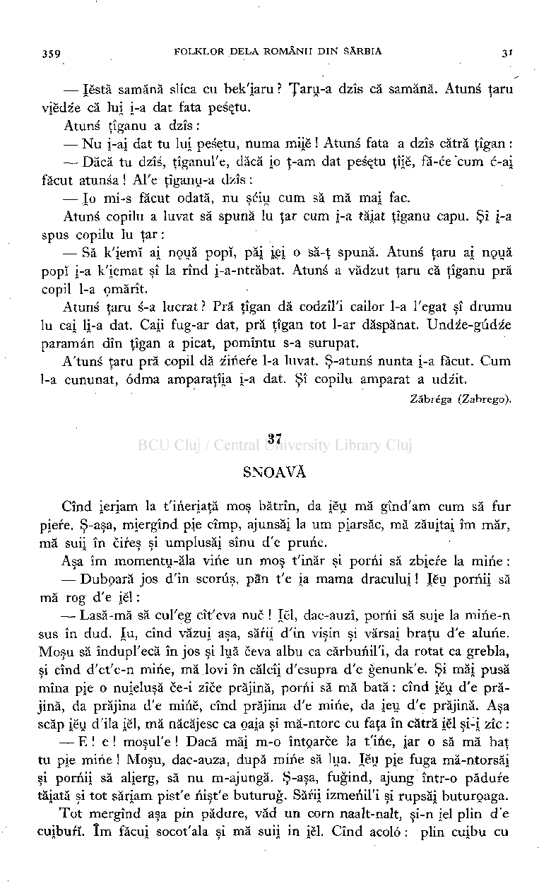

— Iestă samănă slica cu bek'iaru ? Ţaru-a dzîs că samănă. Atuns ţaru viëdze că lui i-a dat fata pesetu.

Atuns ţîganu a dzîs :

— Nu i-ai dat tu lui pesçtu, numa miië ! Atuns fata a dzîs cătră ţîgan : — Dacă tu dzîs, ţîganul'e, dacă io ţ-am dat pese_tu ţîie, fă-ce cum c-ai

făcut atunsa ! Al'e ţîgany-a dzîs :

— Io mi-s făcut odată, nu şciu cum să mă mai fac. Atuns copilu a luvat să spună lu ţar cum i-a tăiat ţîganu capu. Şî i-a

spus copilu lu ţar :

— Să k'iemî ai nouă popî, păi ici o să-ţ spună. Atuns ţaru ai nouă popi i-a k'iemat şî la rînd i-a-ntrăbat. Atuns a vădzut ţaru că ţîganu pră copil 1-a omărît.

Atuns ţaru s-a lucrat? Pră ţîgan dă codzîl'i cailor 1-a l'egat şî drumu lu cai li-a dat. Caii fug-ar dat, pră ţîgan tot l-ar dăspănat. Undze-gudze paramân dîn ţîgan a picat, pomîntu s-a surupat.

A'tuns ţaru pră copil dă zifiefe 1-a luvat. Ş-atuns nunta i-a făcut. Cum 1-a cununat, 6dma amparaţîia i-a dat. Şî copilu amparat a udzit.

Zăbrega (Zabrego).

37

SNOAVĂ

Cînd ieriam la t'ineriaţă moş bătrîn, da ieu mă gînd'am cum să fur piere. Ş-aşa, miergînd pie cîmp, ajunsăi la um piarsăc, mă zăuitai îm măr, mă suii în cireş şi umplusăi sînu d'e prune.

Aşa îm momentu-ăla vine un moş t'inăr şi porfii să zbiere la mine : — Duboară jos d'in scoruş, păn t'e ia mama dracului ! leu pornii să

mă rog d'e iei :

— Lasă-mă să cul'eg cît'eva nuc ! Iei, dac-auzî, porni să suie la mirie-n sus în dud. Iu, cînd văzui aşa, sării d'in vişin şi vărsai braţu d'e alune. Moşu să îndupl'ecă în jos şi luă ceva albu ca cărbunil'i, da rotat ca grebla, şi cînd d'et'e-n mine, mă lovi în călcîi d'esupra d'e genunk'e. Şi măi pusă mîna pie o nuieluşă ce-i zîce prăjină, porni să mă bată : cînd iëu d'e prăjină, da prăjina d'e mine, cînd prăjina d'e mine, da ieu d'e prăjină. Aşa scap iëu d'ila iei, mă năcăjesc ca oaia şi mă-ntorc cu faţa în cătră iei şi—i zîc :

— E ! e ! moşul'e ! Dacă măi m-o întoarce la t'ine, iar o să mă baţ tu pie mine ! Moşu, dac-auza, după mine să lua. Iëu pie fuga mă-ntorsăi şi pornii să alierg, să nu m-ajungă. Ş-aşa, fugind, ajung într-o pădure

- tăiată şi tot săriam pist'e nişt'e buturug. Sării izmenil'i şi rupsăi buturoaga. Tot mergînd aşa pin pădure, văd un corn naalt-nalt, şi-n iei plin d'e

cuiburi. îm făcui socot'ala şi mă suii in iei. Cînd acolo : plin cuibu cu

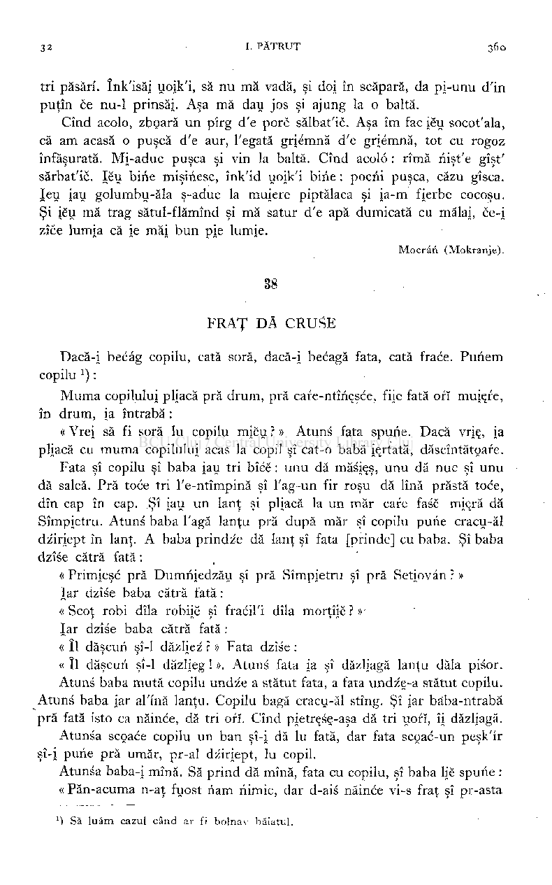

tri păsări. înk'isăi uoik'i, să nu mă vadă, şi doi în scăpară, da pi-unu d'in puţîn ce nu-1 prinsăi. Aşa mă dau jos şi ajung la o baltă.

Cînd acolo, zboară un pîrg d'e porc sălbat'ic. Aşa îm fac iëu socot'ala, că am acasă o puşcă d'e aur, l'egată griemnă d'e griemnă, tot cu rogoz înfăşurată. Mi-aduc puşca şi vin la baltă. Cînd acolo : rîmă nişt'e gîşt'

- sărbat'ic. Iëu birie mişinesc, înk'id uoik'i bine : pocni puşca, căzu gîsca. Ieu iau golumbu-ăla ş-aduc la muiere piptălaca şi ia-m fierbe cocoşu. Şi iëu mă trag sătul-flămînd şi mă satur d'e apă dumicată cu mălai, ce-i zîce lumia că ie măi bun pie lumie.

Mocrân (Mokranje).

38

FRAŢ DÄ CRUSE

Dacă-i becâg copilu, cată soră, dacă-i becagă fata, cată frace. Punem copilu :

Muma copilului pliacă pră drum, pră care-ntîrïesce, fiie fată ofî muiere, în drum, ia întrabă :

« Vrei să fi soră lu copilu mieu ? » Atuns fata spune. Dacă vriç, ia pliacă cu muma copilului acas la copil şî cat-o babă ie_rtată, dăscîntătoafe.

Fata şî copilu şî baba iau tri bîcë : unu dă măsicş, unu dă nuc şî unu dă salcă. Pră toce tri l'e-ntîmpină şî l'ag-un fir roşu dă lînă prăstă toce, dîn cap în cap. Şî iau un lanţ şi pliacă la un măr care fasë mieră dă Sîmpietru. Atuns baba l'agă lanţu pră după măr şî copilu pune cracu-ăl dziriept în lanţ. A baba prindze dă lanţ şî fata [prinde] cu baba. Şî baba dzîse cătră fată :

« Primieşc pră Dumriiedzău şî pră Sîmpietru şî pră Setiovân ? » Iar dzîse baba cătră fată : « Scoţ robi dîla robiië şî fracil'i dîla morţile ? » Iar dzîse baba cătră fată : « II dăşcuri şî-1 dăzliez ? » Fata dzîse : «.îl dăşcuiî şî-1 dăzlieg ! ». Atuns fata ia şî dăzljagă lanţu dala pisor. Atuns baba mută copilu undze a stătut fata, a fata undze-a stătut copilu. Atuns baba iar al'ină lanţu. Copilu bagă cracu-ăl sting. Şî iar bâba-ntrabă pră fată isto ca năince, dă tri ori. Cînd pietrese-aşa dă tri uorï, îi dăzljagă.

Atunsa scoace copilu un ban şî-i dă lu fată, dar fata scoac-un peşk'ir şî-i pune pră umăr, pr-al dziriept, lu copil.

Atunsa baba-i mînă. Să prind dă mînă, fata cu copilu, şî baba lie spune : « Păn-acuma n-aţ fyost nam nimic, dar d-ais năince vi-s fraţ şî pr-asta

Să luăm cazul când ar ii bolnav băiatul.

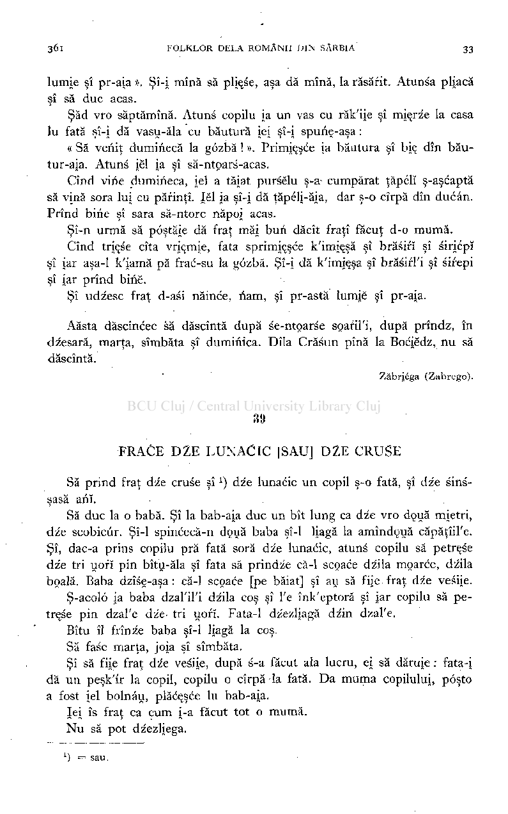

36i folklo r del a români i din sârbia 33

lumie şî pr-aia ». Şî-i mînă să plie.se, aşa dă mînă, la răsărit. Atunsa pliacă şî să duc acas.

Şăd vro săptămînă. Atuns copilu ia un vas cu răk'iie şî miçrze la casa lu fată şî-i dă vasu-ăla cu băutură iei şî-i spune-aşa :

« Să venit duminecă la gozbă ! ». Primicşce ia băutura şî biç dîn băutur-aia. Atuns iël ia şî să-ntoars-acas.

Cînd vine dumineca, iei a tăiat pursëlu ş-a- cumpărat ţăpelî ş-aşcaptă să vină sora lui cu păfinţî. Iël ia şî-i dă ţăpeli-ăia, dar ş-o cîrpă dîn ducân. Prînd bine şî sara să-ntorc năpoj acas.

Şî-n urmă să poştăje dă fraţ măi bun dăcît fraţî făcut d-o mumă. Cînd trie.se cîta vrjçmie, fata sprimicşce k'imicşă şî brăsifî şî siriépï

şî iar aşa-1 k'iamă pă frac-su la gozbă. Şî-i dă k'imicşă şî brăsifl'i şî sifepi şî iar prînd bine.

Şî udzesc fraţ d-asi năince, riam, şî pr-astă lumië şî pr-aia. Aăsta dăscîncec să dăscîntă după se-ntoarse soafil'i, după prîndz, în

dzesară, marţa, sîmbăta şî duminica. Dîla Crăsun pînă la Bociëdz, nu să dăscîntă.

Zăbriega (Zabrego).

39

FRAC E DZ E LUNACI C [SAU] DZ E CRUS E

Să prind fraţ dze cruse şî dze lunacic un copil ş-o fată, şî dze sinsşasă anî.

Să duc la o babă. Şî la bab-aia duc un bît lung ca dze vro două mietri, dze scobicur. Şî-1 spincecă-n două baba şî-1 liagă la amîndouă căpăţîil'e. Şî, dac-a prins copilu pră fată soră dze lunacic, atuns copilu să petrçse dze tri uori pin bîtu-ăla şî fata să prindze că-1 scoace dzila moarce, dzila boală. Baba dzîse-aşa : că-1 scoace [pe băiat] şî au să fiie fraţ dze vesiie.

Ş-acolo ia baba dzal'il'i dzila coş şî l'e înk'eptoră şî iar copilu să pe­

trçse pin dzal'e dze- tri uori. Fata-1 dzezliagă dzin dzal'e. Bîtu îl frînze baba şî-1 liagă la coş. Să fase marţa, joia şî sîmbăta. Şî să fiie fraţ dze vesiie, după s-a făcut ala lucru, ei să dăruie : fata-i

dă un peşk'ir la copil, copilu o cîrpă la fată. Da muma copilului, poşto a fost iei bolnâu, plăccşce lu bab-aia.

Iei îs fraţ ca cum i-a făcut tot o mumă. Nu să pot dzezliega.

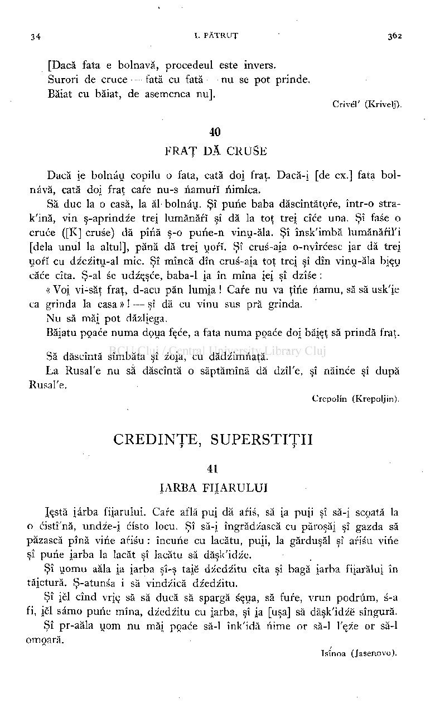

[Dacă fata e bolnavă, procedeul este invers. Surori de cruce — fată cu fată — nu se pot prinde. Băiat cu băiat, de asemenea nu].

Crivél' (Krivelj).

40

FRAŢ DĂ CRUSE

Dacă ie bolnâu copilu o fata, cată doi fraţ. Dacă-i [de ex.] fata bolnavă, cată doi fraţ care nu-s riamufî nimica.

Să duc la o casă, la ăl bolnâu. Şî pune baba dăscîntătofe, într-o strak'ină, vin ş-aprindze trei lumânări şî dă la toţ trei cîce una. Şî fase o cruce ([K] cruse) dă pînă ş-o pune-n vinu-ăla. Şî însk'imbă lumanafil'i [delà unul la altul], pană dă trei uofî. Şî crus-aia o-nvîrcesc iar dă trei uofî cu dzezitu-al mic. Şî mîncă dîn crus-aia toţ trei şî dîn vinu-ăla bieu căce cîta. Ş-al se udze_şce, baba-1 ia în mîna iei şî dzîse :

« Voi vi-săţ fraţ, d-acu păn lumia ! Care nu va ţîrie riamu, să să usk'ie

ca grinda la casa »! — şî dă cu vinu sus pră grinda. Nu să măi pot dăzliega. Băiatu poace numa doua fece, a fata numa poace doi băiet să prindă fraţ. Să dăscîntă sîmbăta şî zoia, cu dădzimnaţă. La Rusal'e nu să dăscîntă o săptămînă dă dzîl'e, şî năince şî după

Rusal'e.

Crepolin (Krepoljin).

### CREDINŢE, SUPERSTIŢII

41

IARBA FIIARULUI Icstă iarba fiiarului. Cafe află pui dă afiş, să ia puii şî să-i scoată la

- o cistî'nă, undze-i cisto locu. Şî să-i îngrădzască cu păroşăi şî gazda să păzască pînă vine afisu : încune cu lacătu, puii, la gărduşăl şî afisu vine şî puiîe iarba la lacăt şî lacătu să dăşk'idze.

Şî uomu aăla ia iarba şî-ş taie dzedzitu cîta şî bagă iarba fiiarălui în

- tăietură. Ş-atunsa i să vindzică dzedzitu. Şî iël cînd vriç să să ducă să spargă seua, să fufe, vrun podnim, s-a

fi, iël sdmo pune mîna, dzedzitu cu iarba, şî ia [uşa] să dăşk'idze sîngură.

Şî pr-aăla uom nu măi poace să-1 înk'idă nime or să-1 l'çze or să-1 omoară.

Isînoa (Jasenovo).

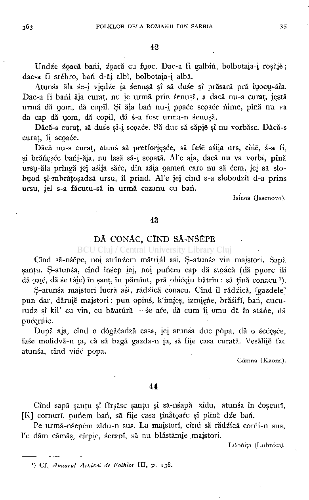

42

Undze zoacă bani, zoacă cu fuoc. Dac-a fi galbifi, bolbotaia-i roşăie ; dac-a fi srébro, ban d-ăi albi, bolbotaia-i albă.

Atunsa ăla se-i viedz'e ia senuşă şî să duse şî prăsară pră luocu-ăla. Dac-a fi bani ăia curăţ, nu ie urmă prîn senuşă, a dacă nu-s curăţ, jcstă urmă dă uom, dă copil. Şî ăia ban nu-i poace scoace nime, pînă nu va da cap dă uom, dă copil, dă s-a fost urma-n senuşă.

Dăcă-s curăţ, să duse şî-i scoace. Să duc să săpie şî nu vorbăsc. Dăcă-s curăţ, îi scoace.

Dacă nu-s curăţ, atuns să pretforicşce, să fasë asiia urs, cîfië, s-a fi, şî brăricşce barii-ăia, nu lasă să-i scoată. Al'e aia, dacă nu va vorbi, pînă ursu-ăla prîngă iei asiia safe, dîn aăia oamen care nu să cem, iei să slobyod şî-mbrăţoşadză ursu, îl prind. Al'e iei cînd s-a slobodzît d-a prins ursu, iei s-a făcutu-să în urmă cazanu cu ban.

Isînoa (Jasenovo).

43

DĂ CONAC, CÎND SA-NSËPE

Cînd să-nsepe, noi strînzem mătriâl asi. Ş-atunsa vin maistori. Sapă şanţu. Ş-atunsa, cînd însep iei, noi punem cap dă stoâcă (dă puorc iii dă oaie, dă se taie) în şanţ, în pămînt, pră obiceju bătrîn : să ţînă conacu

).

1

Ş-atunsa maistori lucră asi, rădzică conacu. Cînd îl rădzică, [gazdele] pun dar, dăruie maistori : pun opins, k'imieş, izmiçne, brăsifî, bafi, cucurudz şî kil' cu vin, cu băutură — se afe, dă cum îi omu dă în stâne, dă pucçrriic.

După aia, cînd o dogăcadză casa, iei atunsa duc popa, dă o seccşce, fase molidvă-n ia, că să bagă gazda-n ia, să fiie casa curată. Vesălije fac atunsa, cînd vinë popa.

Câmna (Kaona).

44

Cînd sapă şanţu şî fîrşăsc şanţu şî să-nsapă zîdu, atunsa în coşcurî, [K] cornurî, punem ban, să fiie casa ţînâtoafe şî plină dz'e ban.

Pe urmă-nsepem zîdu-n sus. La maistori, cînd să rădzică corrii-n sus, l'e dăm cămăş, cîrpie, serapî, să nu blâstămie maistori.

Lubriiţa (Lubnica).

) Cf. Anuarul Arhivei de Folklor III, p. 138.

J

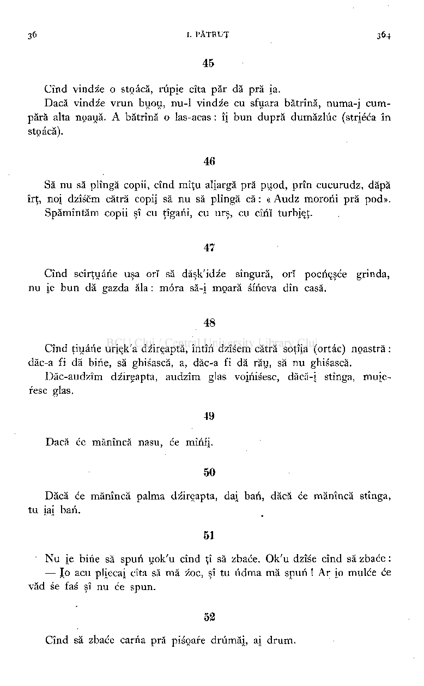

45

Cînd vindze o stodcă, rüpie cîta păr dă pră ia. Dacă vindze vrun buou, nu-1 vindze cu sfuara bătrînă, numa-i cum­

pără alta noauă. A bătrînă o las-acas : îi bun dupră dumăzhic (striéca în stodcă).

46

Să nu să plîngă copii, cînd mîţu aliargă pră pyod, prin cucurudz, dăpă îrţ, noi dzîsëm cătră copii să nu să plîngă că: « Audz moroni pră pod».

Spămîntăm copii şî cu ţîgaiîi, cu urş, cu cînî turbicţ.

47

Cînd scîrţudne uşa ori să dăşk'idze sîngură, ori pocncşce grinda, nu ie bun dă gazda ăla : môra să-i moară sfneva din casă.

48

- Cînd ţiudne uriçk'a dzireaptă, întîri dzîsem cătră soţîia (ortac) noastră : dăc-a fi dă bine, să ghisască, a, dăc-a fi dă rău, să nu ghisască.
- Dăc-audzîm dzireaptă, audzîm glas voiriisesc, dăcă-i stingă, muieresc glas.

- 49

Dacă ce mănîncă nasu, ce mînii.

- 50

Dacă ce mănîncă palma dzireaptă, dai ban, dacă ce mănîncă stînga, tu iai ban.

51

Nu ie bine să spun uok'u cînd ţî să zbace. Ok'u dzîse cînd să zbace : — Io acu pliecai cîta să mă zoc, şî tu üdma mă spun ! Ar io mulce ce

văd se fas şî nu ce spun.

- 52

Cînd să zbace carfia pră pisoafe drumăi, ai drum.

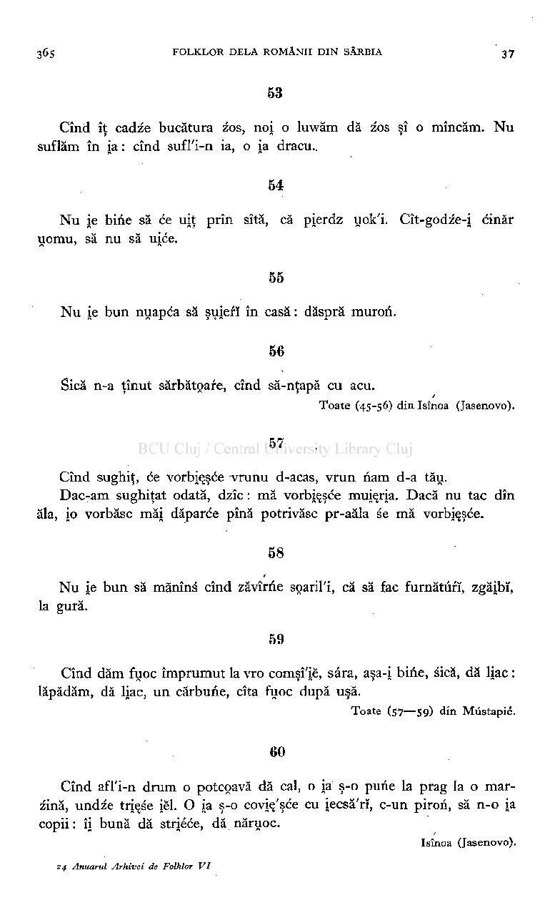

- 53

Cînd îţ cadze bucătura zos, noi o luwăm dă zos şî o mîncăm. Nu suflăm în ia : cînd sufl'i-n ia, o ia dracu..

54

Nu ie bine să ce uiţ prîn sîtă, că pierdz uok'i. Cît-godze-i cinăr uomu, să nu să uice.

- 55

Nu ie bun nuapca să şuieri în casă : dăspră muron.

- 56

Sică n-a ţînut sărbătoare, cînd să-nţapă cu acu.

Toate (45-56) din Isînoa (Jasenovo).

- 57

Cînd sughiţ, ce vorbicşce vrunu d-acas, vrun nam d-a tău. Dac-am sughiţat odată, dzîc : mă vorbicşce muie/ia. Dacă nu tac dîn

ăla, io vorbăsc măi dăparce pînă potrivăsc pr-aăla se mă vorbicşce.

58

Nu ie bun să mănîns cînd zăvîrfie soaril'i, că să fac furnăturî, zgăibî, la gură.

59

Cînd dăm fuoc împrumut la vro comşî'ie, sâra, aşa-i bine, sică, dă liac : lăpădăm, dă liac, un cărbune, cîta fuoc după uşă.

Toate (57—59) din Müstapic.

60

Cînd afl'i-n drum o potcoavă dă cal, o ia ş-o pune la prag la o marzină, undze triçse iël. O ia ş-o covie/şce cu iecsă'rî, c-un piron, să n-o ia copii : îi bună dă striéce, dă năryoc.

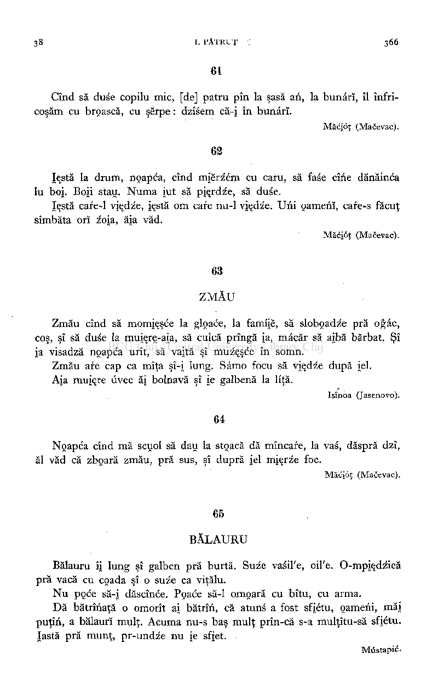

61

Cînd să duse copilu mic, [de] patru pîn la şasă an, la bunârî, îl înfricoşăm cu broască, cu şerpe : dzîsem că-i în bunârî.

Măcioţ (Macevac).

62

Icstă la drum, noapca, cînd miërzém cu caru, să fase cîfie dănăinca lu boi. Boii stau. Numa iut să piçrdze, să duse.

Icstă cafe-1 viçdze, icstă om care nu-1 viçdze. Urii oameriî, cafe-s făcut sîmbăta ori zoia, ăia văd.

Măcioţ (Macevac).

63

Z1VIÄU

Zmău cînd să momiçsce la gloace, la famiië, să sloboadze pră ogâc, coş, şî să duse la muiçre-aia, să culcă prîngă ia, mâcăr să aibă bărbat. Şî ia visadză noapca urît, să vaită şî muzcşce în somn.

Zmău are cap ca mîţa şî-i lung. Sâmo focu să viçdze după iei. Aia muiere üvec ăi bolnavă şî ie galbenă la lfţă.

Isînoa (Jasenovo).

64

Noapca cînd mă scuol să dau la stoacă dă mîncafe, la vas, dăspră dzî, ăl văd că zboară zmău, pră sus, şî dupră iei miejze foc.

Măcioţ (Macevac).

65

BĂLAURU

Bălauru îi lung şî galben pră burtă. Suze vasil'e, oil'e. O-mpicdzică

pră vacă cu coada şî o suze ca viţălu. Nu poce să-i dăscînce. Poace să-1 omoară cu bîtu, cu arma. Dă bătrîriaţă o omorît ai bătrîri, că atuns a fost sfiétu, oamerii, măi

puţîri, a balauri mulţ. Acuma nu-s bas mulţ prîn-că s-a mulţîtu-să sfiétu. Iastă pră munţ, pr-undze nu ie sfiet.

Müstapic.

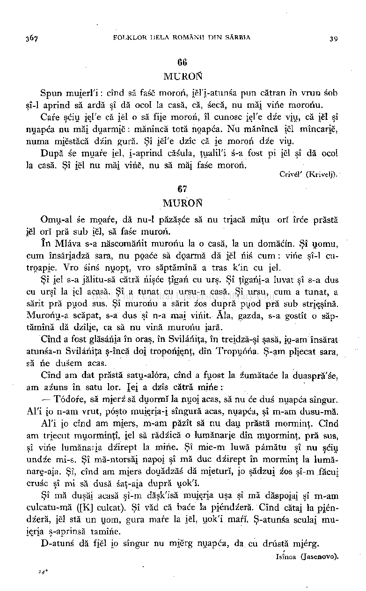

66

MURON

Spun muierl'i : cînd să fase moron, iël'i-atunsa pun catran în vrun sob şî-1 aprind să ardă şî dă ocol la casă, că, secă, nu măi vine morofiu.

Care şciu ieTe că iël o să fiie moron, îl cunosc içl'e dze viu, că iei şî nuapca nu măi duarmië : mănîncă totă ngapca. Nu mănîncă iël mîncarië, numa miestăcă dzin gură. Şî jël'e dzîc că ie moron dze viu.

După se muafe iei, i-aprind căsula, ţualil'i s-a fost pi iël şî dă ocol la casă. Şî iël nu măi vine, nu să măi fase moron.

Crivel' (Krivelj).

67

MURON

Omu-al se moare, dă nu-1 păzăşce să nu triacă mîţu orî îrce prăstă iël orî pră sub iël, să fase murori.

în Mlâva s-a născomănit murofiu la o casă, la un domăcin. Şî uomu, cum însăriadză sara, nu poace să doarmă dă iël riis cum : vine şî-1 cutroapie. Vro sins nuopţ, vro săptămînă a tras k'in cu iei.

Şî iei s-a jălitu-să cătră riişce ţîgan cu urş. Şî ţîgarii-a luvat şî s-a dus cu urşî la iei acasă. Şî a tunat cu ursu-n casă. Şî ursu, cum a tunat, a

- sărit pră puod sus. Şî muroiiu a sărit zos dupră puod pră sub striesînă. Muronu-a scăpat, s-a dus şî n-a mai viriit. Ăla, gazda, s-a gostît o săp­
- tămînă dă dzîlie, ca să nu vină muroriu iară. Cînd a fost glăsânia în oraş, în Svilâriiţa, în treidză-şî şasă, io-am însărat

atunsa-n Svilâriiţa ş-încă doi troporiie_nţ, dîn Tropuoria. Ş-am pliecat sara, să rie dusem acas.

Cînd am dat prăstă satu-alora, cînd a fuost la zumătace la duaspră'se, am azuns în satu lor. Iei a dzîs cătră mirie :

— Tödofe, să mierz să duormî la nuoi acas, să nu ce dus nuapca sîngur. Al'i io n-am vrut, poşto muiçria-i sîngură acas, nuapca, şî m-am dusu-mă.

Al'i io cînd am miers, m-am păzît să nu dau prăstă morminţ. Cînd am triecut muorminţî, iei să rădzică o lumănarie dîn muorminţ, pră sus, şî virie lumănaria dzirept la mirie. Şî mie-m luwă pâmătu şî nu şeiu undze mi-s. Şî mă-ntorsăi napoi şî mă duc dzirept în morminţ la lumănare-aia. Şî, cînd am miers douădzăs dă mieturî, io şădzui zos şî-m făcui cruse şî mi să dusă saţ-aia dupră uok'î.

Şî mă duşăi acasă şî-m dăşk'isă muieria uşa şî mă dăspoiai şî m-am culcatu-mă ([K] culcat). Şî văd că bace la piendzeră. Cînd cătai la piéndzeră, iël stă un uom, gura mafe la iël, yok'i mari. Ş-atunsa sculai muieria ş-aprinsă tamîrie.

D-atuns dă fiel io sîngur nu miërg nuapca, da cu drustă miérg.

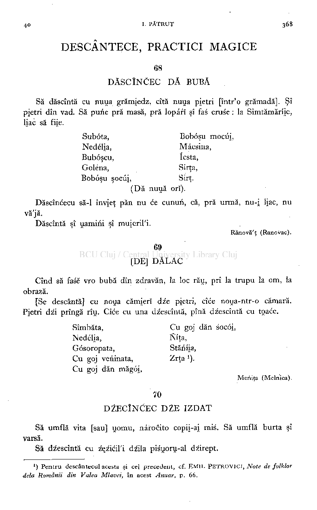

o I. PĂTRUŢ 368

4

### DESCÂNTECE, PRACTICI MAGICE

68

DĂSCÎNCEC DÄ BUBĂ

Să dăscîntă cu nuua grămiedz, cîtă nuua pietri [într'o grămadă]. Şî pietri dîn vad. Să pune pră masă, pră lopâfî şî fas cruse : la Sîmtămăriie, liac să fiie.

Suböta, Boboşu mocui, Nedélia, Mâcsina, Buboşcu, Icsta, Goléna, Sirţa, Boboşu şocui, Sirţ.

(Dă nuuă ori).

Dăscîncecu să-1 învieţ păn nu ce cunun, că, pră urmă, nu-i liac, nu vă'jă.

Dăscîntă şî uamini şî muieril'i.

Rănovă'ţ (Ranovac).

69

[DE] DÄLA C

Cînd să fasë vro bubă dîn zdravăn, la loc rău, prî la trupu la om, la obrază.

[Se descântă] cu noua cămierî dze pietri, cîce noua-ntr-o cămară. Pietri dzi prîngă rîy. Cîce cu una dzescîntă, pînă dzescîntă cu toace.

Sîmbăta, Cu goj dăn socöi, Nedélia, Niţa, Gôsoropata, Stăriiia, Cu goj veninata, Zrţa ). Cu goj dăn măgoi,

Meiiiţa (Melnica).

70

DZECÎNCE C DZ E IZDA T

Să umflă vita [sau] uomu, nârocito copii-ai mis. Să umflă burta şî varsă.

Să dzescîntă cu zezicil'i dzila pisuoru-al dzirept.

) Pentru descântecul acesta şi cel precedent, cf. EMIL PETROVICI, Note de folklor delà Românii din Valea Mlavei, în acest Anuar, p. 66.

l

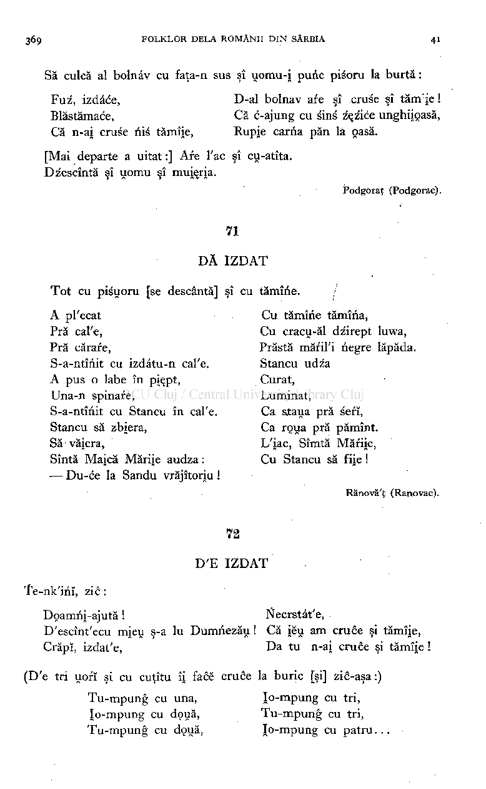

Să culcă al bolnav cu faţa-n sus şî uomu-i pune pisoru la burtă :

Fuz, izdâce, D-al bolnav are şî cruse şî tăm'ie ! Blăstămace, Că c-ajung cu sins zçzice unghijoasă, Că n-ai cruse riis tămîie, Rupie carna păn la oasă.

[Mai departe a uitat :] Are l'ac şî cu-atîta. Dzescîntă şî uomu şî muiçria.

Podgoraţ (Podgorac).

71

DĂ IZDAT

Tot cu pisuoru [se descântă] şî cu tămîhe.

Cu tămîfie tămîna, Cu cracu-ăl dzirept luwa, Prăstă măfil'i negre lăpăda. Stancu udza Curat, Luminat, Ca ataua pră seri, Ca rouă pră pămînt. L'iac, Sîmtă Măriie, Cu Stancu să f iie !

A pl'ecat Pră cal'c, Pră cărare, S-a-ntînit cu izdâtu-n cal'e. A pus o labe în piçpt, Una-n spinare, S-a-ntîhit cu Stancu în cal'e. Stancu să zbiera, Să văiera, Sîntă Maică Măriie audza :

— Du-ce la Sandu vrăjîtoriu !

Rănovă'ţ (Ranovac).

72

D'E IZDAT Te-nk'inî, zic :

Doamni-ajută ! Necrstât'e, D'escînt'ecu mieu ş-a lu Dumnezău ! Că ieu am cruce şi tămîie, Crăpî, izdat'e, Da tu n-ai cruce şi tămîie !

(D'e tri uori şi cu cuţîtu îi face cruce la buric [şi] zic-aşa:)

Tu-mpung cu una, Io-mpung cu tri, Io-mpung cu dcuă, Tu-mpung cu tri, Tu-mpung cu dcuă, Io-mpung cu patru...

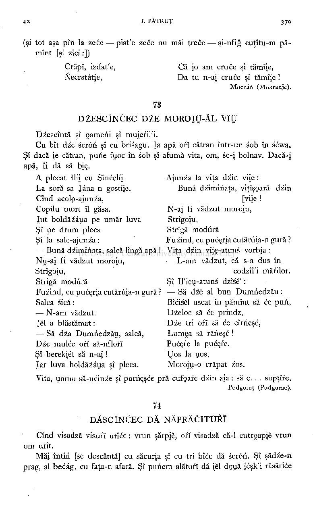

(şi tot aşa pin la zece — pist'e zece nu măi trece — şi-nfig cuţîtu-m pămînt [şi zici :])

Crăpî, izdat'e, Că io am cruce şi tămîie, Necrstâtie, Da tu n-ai cruce şi tămîie !

Mocrân (Mokranje).

D2ESCÎNCE C DZE MOROIU-ĂL VIU

Dzescîntă şî oameni şî muiefil'i. Cu bît dze serön şî cu brisagu. Ia apă ori catran într-un sob în séwa.

Şî dacă ie catran, pune fyoc în sob şî afumă vita, om, se-i bolnav. Dacă-i apă, îi dă să bie_.

Ajunza la viţa dzin viie :

A plecat Ilii cu Sîncelii La soră-sa Iâna-n gostiie. Cînd acolo-ajunza, Copilu mort îl găsa. lut boldăzâua pe umăr luva Şî pe drum pleca Şî la salc-ajunza :

— Bună dziminaţa, viţîşoară dzin

[viie ! N-ai fi vădzut moroiu, Strigoiu, Strigă modură Fuzind, cu pucçria cutăruia-n gură ?

— Bună dziminaţa, salcă lîngă apă ! Viţa dzin viie-atuns vorbia : Nu-ai fi vădzut moroiu, — L-am vădzut, că s-a dus în Strigoiu, codzîl'i mărilor. Strigă modură Şî Il'icu-atuns dzîsë' : Fuzind, cu pucçria cutăniia-n gură ? — Să dzë al bun Dumnedzău : Salca sică :

Bîcisel uscat în pămînt să ce pun, Dzeloc să ce prindz, Dze tri ori să ce cîrneşc, Lumea să rănesc ! Puce/e la puce/e, Uos la uos, Moroiu-o crăpat zos.

— N-am vădzut. Iei a blăstămat :

— Să dza Dumnedzău, salcă, Dze mulce ori să-nflofî Şî berekiét să n-ai ! Iar luva boldăzâua şî pleca.

Vita, uomu să-ncinze şî porncşce pră cufoare dzin aia : să c. . . supţîfe.

Podgoraţ (Podgorac).

74

DĂSCÎNCEC DÄ NĂPRĂCITURI

Cînd visadză visuri urîce : vrun şărpie, ori visadză că-1 cutroapië vrun om urît.

Măi întîn [se descântă] cu săcuria şî cu tri bîce dă serön. Şî şădze-n prag, al becâg, cu faţa-n afară. Şî pufiem alături dă iei două jeşk'i răsărice

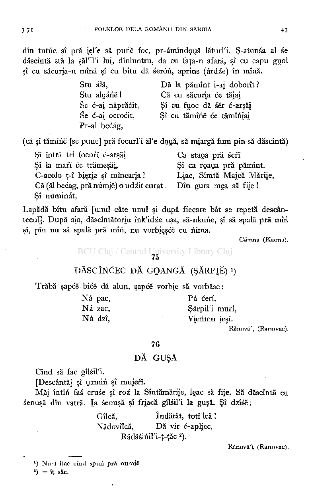

dîn tutüc şî pră iel'e să punë foc, pr-âmîndouă lăturl'i. Ş-atunsa al se dăscîntă stă la şăl'il'i lui, dînluntru, da cu faţa-n afară, şî cu capu guol şî cu săcuria-n mînă şî cu bîtu dă seröfi, aprins (ârdze) în mînă.

Stu âlă, Dă la pămînt l-ai doborît? Stu alo âne ! Că cu săcuria ce tăiai Se c-ai năprăcit, Şî cu fuoc dă sër c-arşăi Se c-ai ocrocit, Şî cu tămîne ce tămîniai Pr-al becâg,

(că şî tămîrie [se pune] pră focurl'i ăl'e dşuă, să miargă fum pîn să dăscîntă)

Şî întră tri focuri c-arşăi Ca staoa pră seri Şî la mări ce trămeşăi, Şî ca roaua pră pămînt. C-acolo ţ-î bieria şî mîncaria ! Liac, Sîmtă Maică Măriie, Că (ăl becag, pră nûmië) o udzit curat. Dîn gura mea să fiie ! Şî numinât,

Lapădă bîtu afară [unul câte unul şi după fiecare bât se repetă descântecul]. După aia, dăscîntătoriu înk'idze uşa, să-nkune, şî să spală pră mîh şî, pîn nu să spală pră mîfi, nu vorbiesce cu hima.

Cămna (Kaona).

75

DĂSCÎNCEC DĂ GOANGĂ (ŞĂRPIE)

)

x

Trăbă sapée bîéë dă alun, şapce vorbie să vorbăsc : Nâ pac, Pâ ceri, Nâ zac, Şărpil'i muri, Nâ dzî, Vieninu ieşî.

Rănovă'ţ (Ranovac).

76

DĂ GUŞĂ

Cînd să fac gîlsil'i. [Descântă] şî uamin şî muieri. Măj întîh fas cruse şî roz la Sîntămăriie, leac să fiie. Să dăscîntă cu

senuşă dîn vatră. Ia senuşă şî frjacă gîlsil'i la guşă. Şî dzîsë :

Gîlcă, îndărăt, totî'lcă ! Nădovîlcă, Dă vîr c-apliec, Rădăsinil'i-ţ-ţăc ).

Rănovă'ţ (Ranovac).

- 1

) Nu-i liac cînd spun pră numië.

- 2

) = îţ săc.

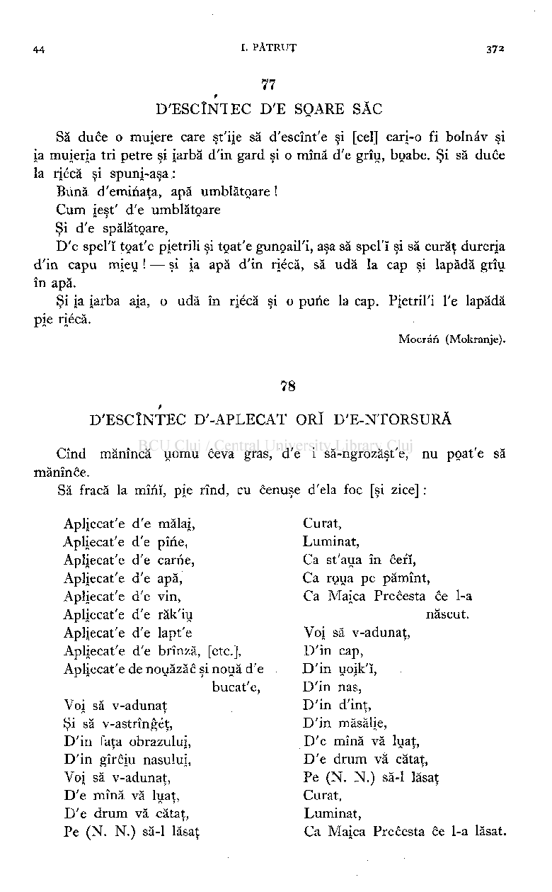

77

D'ESCÎNIEC D'E SOARE SÄC

Să duce o muiere care şt'ije să d'escînt'e şi [cel] cari-o fi bolnav şi ia muieria tri petre şi iarbă d'in gard şi o mînă d'e grîu, boabe. Şi să duce la riecă şi spuni-aşa :

Bună d'eminaţa, apă umblătoare ! Cum ieşt' d'e umblătoare Şi d'e spălătoare, D'e spel'î toat'e pietrili şi toat'e gunoail'i, aşa să spel'î şi să curăţ dureria

d'in capu mieu ! — şi ia apă d'in riecă, să udă la cap şi lapădă grîu în apă.

Şi ia iarba aia, o udă în riecă şi o pune la cap. Pietril'i l'e lapădă pie riecă.

Mocrâfî (Mokranje).

78

D'ESC ÎNTEC D'-APLECAT ORÏ D'E-NTORSURÄ

Cînd mănîncă uomu ceva gras, d'e i să-ngrozăşt'e, nu poat'e să mănînce.

Să fracă la mîriï, pie rînd, cu cenuşe d'ela foc [şi zice] :

Curat, Luminat, Ca st'aua în ceri, Ca ro.ua pe pămînt, Ca Maica Precesta ce 1-a

Apliecat'e d'e mălai, Apliecat'e d'e pîne, Apliecat'e d'e carne, Apliecat'e d'e apă, Apliecat'e d'e vin, Apliecat'e d'e răk'iu Apliecat'e d'e lapt'e Apliecat'e d'e brînză, [etc.], Apliecat'e de nouăzăc şi nouă d'e

născut.

Voi să v-adunaţ, D'in cap, D'in uoik'î, D'in nas, D'in d'inţ, D'in măsălie, D'e mînă vă luat, D'e drum vă cătat, Pe (N. N.) să-1 lăsat Curat, Luminat, Ca Maica Precesta ce 1-a lăsat.

bucat'e,

Voi să v-adunaţ Şi să v-astrîngeţ, D'in faţa obrazului, D'in gîrciu nasului, Voi să v-adunaţ, D'e mînă vă luat, D'e drum vă cătat, Pe (N. N.) să-1 lăsat

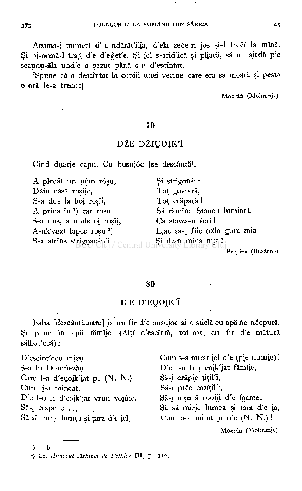

Acuma-i numeri d'-a-ndărăt'ilia, d'ela zece-n jos şi-1 frecî la mînă. Şi pi-ormă-1 trag d'e d'eget'e. Şi iei s-arid'ică şi pliacă, să nu şiadă pie scaunu-ăla und'e a şezut pană s-a d'escîntat.

[Spune că a descîntat la copiii unei vecine care era să moară şi pesta o oră le-a trecut].

Mocrân (Mokranje).

79

###### DZE DZIUOIK'I

Cînd dyarie capu. Cu busuioc [se descântă]. A plecat un uöm roşu, Dzin casă roşîie, S-a dus la boi roşîi, A prins în ) car roşu, S-a dus, a muls oi roşii, A-nk'egat lapée roşu

Şî strîgonsi : Toţ gustară, Toţ crăpară ! Să rămînă Stancu luminat, Ca stawa-n seri ! Liac să-i fiie dzin gura mia Şî dzin mîna mia !

). S-a strîns strîgoansil'i

2

Brejâna (Brezâne).

80

###### D'E D'EUOIK'I

Baba [descântătoare] ia un fir d'e busuioc şi o sticlă cu apă ne-ncepută. Şi pune în apă tămîie. (Alţi d'escîntă, tot aşa, cu fir d'e mătură sălbat'ecă) :

Cum s-a mirat iei d'e (pie numie) ! D'e l-o fi d'eoik'jat fămiie, Să-i crăpie ţîţîl'i, Să-i pice cosîţîl'i, Să-i moară copiii d'e foame, Să să mirie lumea şi ţara d'e ia, Cum s-a mirat ia d'e (N. N.) !

D'escînt'ecu mieu Ş-a lu Dumnezău. Care 1-a d'euoik'iat pe (N. N.) Curu i-a mîncat. D'e l-o fi d'eoik'jat vrun voinic, Să-i crape c. . ., Să să mirie lumea si tara d'e iei,

Mocrân (Mokranje).

###### ) = la.

x

) Cf. Anuarul Arhivei de Folklor III, p. 112.

8

