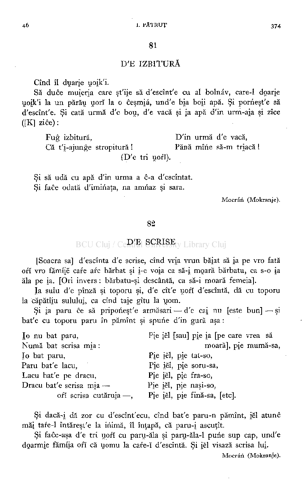

81

D'E IZBITURĂ

Cînd îl duarie uoik'i.

Să duce muieria care şt'ije să d'escînt'e cu al bolnav, care-1 doarie uoik'i la un părău uorî la o ceşmiâ, und'e bia boii apă. Şi porrieşt'e să d'escînt'e. Şi cată urmă d'e bou, d'e vacă şi ia apă d'in urm-aia şi zîce ([K] zice) :

Fug izbitură, D'in urmă d'e vacă, Că t'i-ajunge stropitură ! Pană mîhe să-m triacă !

(D'e tri uofï).

Şi să udă cu apă d'in urma a c-a d'escîntat. Şi face odată d'iminaţa, na amnaz şi sara.

Mocrân (Mokranje).

82

D'E SCRISE

[Soacra sa] d'escînta d'e scrise, cînd vria vrun băiat să ia pe vro fată ofï vro fămiie care are bărbat şi i-e voia ca să-i moară bărbatu, ca s-o ia ăla pe ia. [Ori invers : bărbatu-şi descântă, ca să-i moară femeia].

Ia sulu d'e pînză şi toporu şi, d'e cît'e uofï d'escînta, dă cu toporu la căpătîiu sulului, ca cînd taie gîtu la uom.

Şi ia paru ce să priponeşt'e armăsari — d'e cai nu [este bun] — şi bat'e cu toporu paru în pămînt şi spune d'in gură aşa : Io nu bat paru, Pie iël [sau] pie ia [pe care vrea să Numă bat scrisa mia : moară], pie mumă-sa, Io bat paru, Pie iël, pie tat-so, Paru bat'e lacu, Pie iël, pie soru-sa, Lacu bat'e pe dracu, Pie iël, pie fra-so, Dracu bat'e scrisa mia — Pie iël, pie naşi-so,

ofï scrisa cutăruia —, Pie iël, pie fină-sa, [etc].

Şi dacă-i dă zor cu d'escînt'ecu, cînd bat'e paru-n pămînt, iël atunc măi tafe-1 întăreşt'e la inimă, îl înţapă, că paru-i ascuţit.

Şi face-aşa d'e tri uofï cu paru-ăla şi paru-ăla-1 pune sup cap, und'e doarmie fămiia ofï că uomu la cafe-î d'escînta. Şi iël visază scrisa lui.

Mocrân (Mokranje).

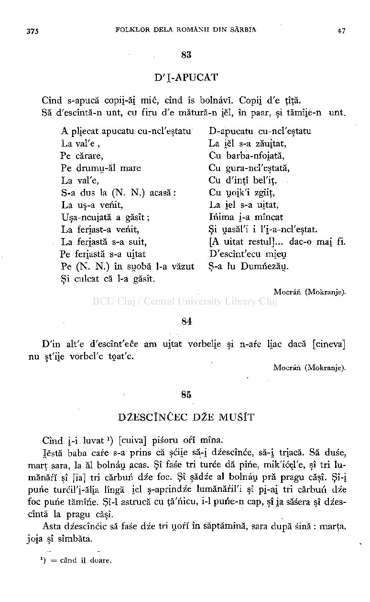

83

D'I-APUCAT

Cînd s-apucă copii-ăi mic, cînd îs bolnăvi. Copii d'e ţîţă. Să d'escîntă-n unt, cu firu d'e mătură-n iël, în paar, şi tămîie-n unt.

A pliecat apucatu cu-ncl'eştatu La val'e , Pe cărare, Pe drumu-ăl mare La val'e, S-a dus la (N. N.) acasă : La uş-a venit, Uşa-ncuiată a găsît ; La feriast-a venit, La feriastă s-a suit, Pe feriastă s-a uitat Pe (N. N.) în suobă 1-a văzut Şi culcat că 1-a găsît.

D-apucatu cu-ncl'eştatu La iei s-a zăuitat, Cu barba-nfoiată, Cu gura-ncl'eştată, Cu d'inţî bel'iţ, . Cu uoik'i zgîiţ, La iei s-a uitat, Inima i-a mîncat Şi uasăl'i i l'i-a-ncl'eştat. [A uitat restul]... dac-o mai fi. D'escînt'ecu mieu Ş-a lu Dumnezău.

Mocrân (Mokranje).

84

D'in alt'e d'escînt'ece am uitat vorbelie şi n-afe liac dacă [cineva] nu şt'iie vorbel'e toat'e.

Mocrâh (Mokranje).

85

DZESCÎNCEC D2 E MUSl T Cînd i-i luvat

) [cuiva] pisoru on mîna.

x

Iestă baba cafe s-a prins că şciie să-i dzescînce, să-i triacă. Să duse, marţ sara, la ăl boinâu acas. Şî fase tri turce dă pîne, mik'ice.l'e, şî tri lu­

- mânări şî [ia] tri cărburi dze foc. Şî şădie al boinâu pră pragu căşî. Şî-i pune turcil'i-ălia lîngă iei ş-aprindze lumănăfil'i şî pi-ai tri cărbun dze foc pune tămîne. Şî-1 astrucă cu ţă'riicu, i-1 pune-n cap, şî ia săsera şî dzescîntă la pragu căşî.

Asta dzescîncic să fase dze tri uofï în săptămînă, sara după sină : marţa, joia şî sîmbăta.

) = când îl doare.

J

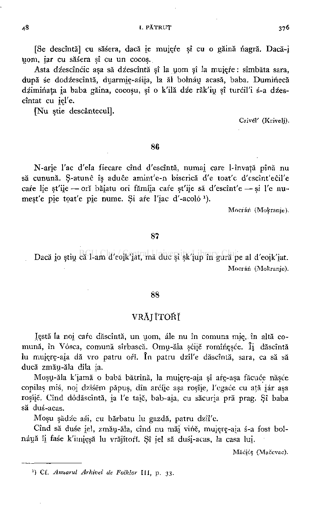

[Se descîntă] cu săsera, dacă ie muiere şî cu o găină nagră. Dacă-i uom, iar cu săsera şî cu un cocoş..

Asta dzescîncic aşa să dzescîntă şî la uom şî la muiere : sîmbăta sara, după se dodzescîntă, duarmie-asiia, la ăl bolnâu acasă, baba. Duminecă dziminaţa ia baba găina, cocoşu, şî o k'ilă dze răk'iu şî turcil'i s-a dzescîntat cu jej'e.

[Nu ştie descântecul].

Crivél' (Krivelj).

86

N-arie l'ac d'ela fiecare cînd d'escîntă, numai care l-învaţă pînă nu să cunună. Ş-atunc îş aduce amint'e-n biserică d'e toat'e d'escînt'ecil'e care lie şt'iie — ori băiatu ori fămiia cafe şt'iie să d'escînt'e — şi l'e numeşt'e pie toat'e pie nume. Şi are l'iac d'-acolo

Mocrâri (Mokranje).

- 87

Dacă io ştiu că l-am d'eoik'iat, mă duc şi şk'iup în gură pe al d'eoik'iat.

Mocrân (Mokranje).

- 88

VRĂJITORI

Iestă la noi cafe dăscîntă, un uom, ale nu în comuna miç, în altă comună, în Vôsca, comună sîrbască. Omu-ăla şcije romîncşce. îi dăscîntă lu rnuiere-aia dă vro patru ori. în patru dzîl'e dăscîntă, sara, ca să să ducă zmău-ăla dîla ia.

Moşu-ăla k'iamă o babă bătrînă, la muiçre-aia şî afe-aşa făcuce năşce copilaş mis, noi dzîsëm păpuş, dîn arciie aşa roşîie, l'egace cu aţă jar aşa roşîie. Cînd dodăscîntă, ia l'e taie, bab-aia, cu săcuria pră prag. Şî baba să dus-acas.

Moşu şădze asi, cu bărbatu lu gazdă, patru dzîl'e. Cînd să duse iei, zmău-ăla, cînd nu măi vinë, muiçre-aia s-a fost bol-

- nâuă îi fase k'imicşă lu vrăjitori. Şî iei să dusi-acas, la casa lui. Măcioţ (Macevac).

) Cf. Anuarul Arhivei de Folklor III, p. 33.

x

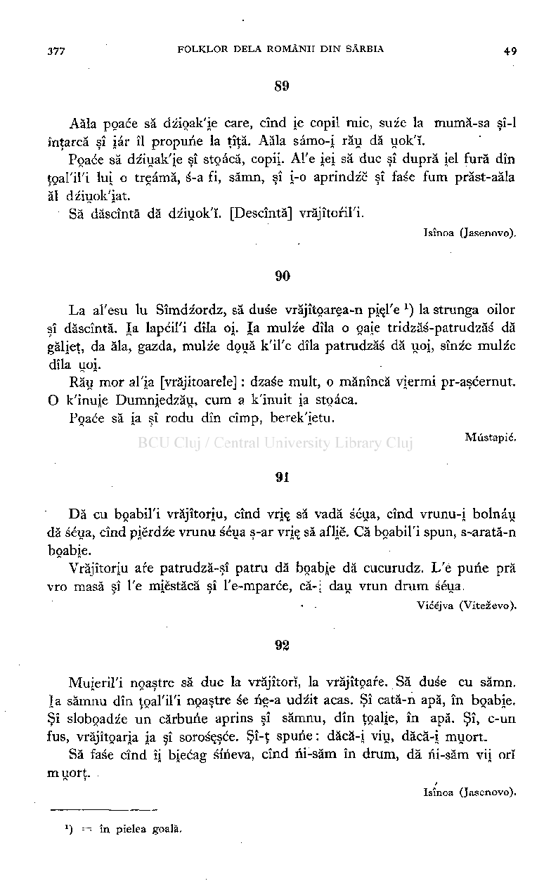

89

Aăla poace să dzioak'ie care, cînd ie copil mic, suze la mumă-sa şî-1 înţărca şî iar îl propune la ţîţa. Aăla sâmo-i rău dă yok'î.

Poace să dziuak'ie şî stgâcă, copii. Al'e iei să duc şî dupră iei fură dîn ţoal'il'i lui o treâmă, s-a fi, sămn, şî i-o aprindze şî fase fum prăst-aăla ăl dziuok'iat.

Să dăscîntă dă dziuok'î. [Descîntă] vrăjîtofil'i.

Isînoa (Jasenovo).

90

La al'esu lu Sîmdzordz, să duse vrăjîtoarea-n pieTe ) la strunga oilor şî dăscîntă. Ia lapcil'i dila oi. Ia mulze dîla o oaie tridzăs-patrudzăs dă gălieţ, da ăla, gazda, mulze două k'il'e dîla patrudzăs dă uoi, sînze mulze dîla uoi.

Rău mor al'ia [vrăjitoarele] : dzase mult, o mănîncă viermi pr-aşcernut. O k'inuie Dumniedzău, cum a k'inuit ia stoâca. Poace să ia şî rodu dîn cîmp, berek'ietu.

Mustapic.

91

Dă cu boabil'i vrăjîtoriu, cînd vrie. să vadă séua, cînd vrunu-i bolnâu dă séua, cînd piërdze vrunu séua ş-ar vriç să aflie. Că boabil'i spun, s-arată-n boabie.

Vrăjîtoriu are patrudză-şî patru dă boabie dă cucurudz. L'e pune pră vro masă şî l'e miestăcă şî l'e-mparce, că-i dau vrun drum séua.

Vicéjva (Vitezevo).

92

Muieril'i noastre să duc la vrăjitori, la vrăjitoare. Să duse cu sămn. Ia sămnu dîn ţoal'il'i noastre se ne-a udzit acas. Şî cată-n apă, în boabie. Şî sloboadze un cărbune aprins şî sămnu, dîn ţoalie, în apă. Şî, c-un fus, vrăjîtoaria ia şî soroscşce. Şî-ţ spune : dăcă-i viu, dăcă-i muort.

Să fase cînd îi biecag sineva, cînd rii-săm în drum, dă rii-săm vii ori muorţ.

Isînoa (Jasenovo).

') = în pielea goală.

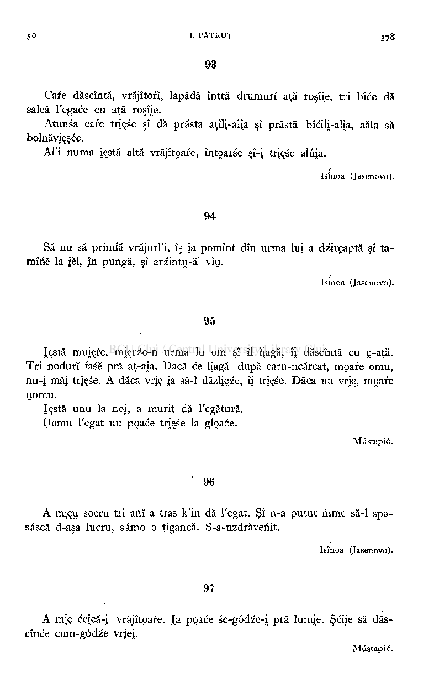

93

Cafe dascîntă, vrâjîtofï, lapădă întră drumuri aţă roşîie, tri bîce dă salcă l'egace cu aţă roşîie.

Atunsa cafe triese şî dă prăsta aţîli-alia şî prăstă bîcili-alia, aăla să bolnăviesce.

Al'i numa icstă altă vrăjîtoafe, întoarse şî-i triese ăluia.

Isînoa (Jasenovo).

94

Să nu să prindă vrăjurl'i, îş ia pomînt dîn urma lui a dzireaptă şî tamîrië la iei, în pungă, şî arzintu-ăl viu.

Isînoa (Jasenovo).

95

Işstă muiçfe, mierze-n urma lu om şî îl liagă, îi dascîntă cu o-aţă. Tri noduri fase pră aţ-aia. Dacă ce liagă după caru-ncărcat, moafe omu, nu-i măi triçse. A daca vriç ia să-1 dăzlicze, îi triçse. Daca nu vriç, moafe uomu.

Icstă unu la noi, a murit dă l'egătură. Uomu l'egat nu poace triçse la gloace.

Müstapid.

" 96

A miçy socru tri arii a tras k'in dă l'egat. Şî n-a putut nime să-1 spăsâscă d-aşa lucru, sâmo o ţigancă. S-a-nzdrăvenit.

Isînoa (Jasenovo).

97

A miç ceică-i vrăjîtoafe. cînce cum-godze vriei.

Ia poace se-gödze-i pră lumie. Şciie să dăs-

Miistapic.

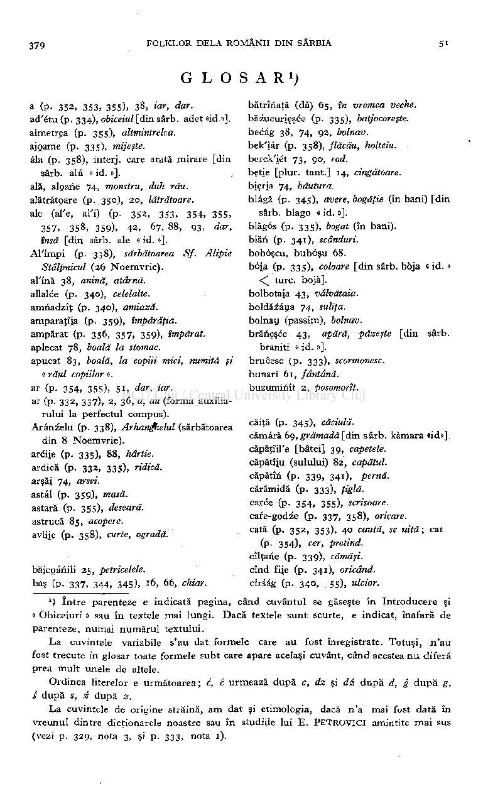

## GLOSAR

## ;

1

- bătrînaţă (dă) 65, în vremea veche,

- băzucurieşce (p. 335), batjocoreşte. becâg 38, 74, 92, bolnav. bek'iâr (p. 358), flăcău, holteiu. berek'iét 73, 90, rod. bçtie [plur. tant.] 14, cingătoare. bieria 74, băutura. blâgă (p. 345), avere, bogăţie (în bani) [din

sârb. blago « id. »]. blăgos (p. 335), bogat (în bani),

blăh (p. 341), scânduri.

boboşcu, buboşu 68. b6ja (p. 335), coloare [din sârb. bôja « id. »

<^ turc. bojà].

bolbotaia 43, vâlvătaia. boldăzâua 74, suliţa.

bolnau (passim), bolnav.

brăneşce 43, apără, păzeşte [din sârb.

braniti « id. »].

bruêesc (p. 333), scormonesc. bunarï 61, fântână.

buzuminit 2, posomorit.

- căiţă (p. 345), căciulă.

- cămară 69, grămadă [din sârb. kămara «id»]. căpăţîil'e [bâtei] 39, capetele. căpătîiu (sulului) 82, capătul. căpătîn (p. 339, 341), pernă. cărămidă (p. 333), ţiglă. carce (p. 354, 355), scrisoare. cafe-godze (p. 337, 358), oricare. cată (p. 352, 353), 40 caută, se uită; cat

a (P- 352, 353, 355), 38, iar, dar. ad'étu (p. 334), obiceiul [din sârb. adet «id.»].

aimetrga (p. 355), altmintrelea.

ajoame (p. 335), mijeşte.

ăla (p. 358), interj, care arată mirare [din sârb. ala « id. »].

ală, aloane 74, monstru, duh rău. alătrătoare (p. 350), 20, lătrătoare.

ale (al'e, al'i) (p. 352, 353, 354. 355,

93, dar,

357, 358, 359), 42, 67, :

însă [din sârb. ale « id. »].

Sf. Alipie

Al'impi (p. 338), sărbătoarea

Stâlpnicul (26 Noemvrie).

al'ină 38, anină, atârnă.

allalcé (p. 340), celelalte. amriadzîţ (p. 340), amiază. amparaţîia (p. 359), împărăţia.

ampărat (p. 356, 357, 359), împărat.

aplecat 78, boală la stomac. apucat 83, boală, la copiii mici, numită şi

« răul copiilor ».

ar (P- 354, 355), 51 dar, iar.

(p- 332, 337), 2, 36, a, au (forma auxiliarului la perfectul compus). Arânzelu (p. 338), Arhangfielul (sărbătoarea din 8 Noemvrie).

a r

arefie (p. 335), 88, hârtie. ardică (p. 332, 335), ridică. arşăi 74, arsei.

astâl (p. 359), masă. astară (p. 355), deseară. astrucă 85, acopere.

avliie (p. 358), curte, ogradă.

(P- 354). cer, pretind.

cîlţahe (p. 339), cămăşi.

băicoânili 25, petricelele.

cînd fiie (p. 341), oricând.

baş (p. 337, 344, 345), 16, 66, chiar.

cîrsâg (p. 340, .55), ulcior.

) între parenteze e indicată pagina, când cuvântul se găseşte în Introducere şi « Obiceiuri » sau în textele mai lungi. Dacă textele sunt scurte, e indicat, înafară de parenteze, numai numărul textului.

l

La cuvintele variabile s'au dat formele care au fost înregistrate. Totuşi, n'au fost trecute în glosar toate formele subt care apare acelaşi cuvânt, când acestea nu diferă prea mult unele de altele.

Ordinea literelor e următoarea; c, c urmează după c, dz şi dz după d, g după g, s după s, z după z.

La cuvintele de origine străină, am dat şi etimologia, dacă n'a mai fost dată în vreunul dintre dicţionarele noastre sau în studiile lui E. PETROVICI amintite mai sus (vezi p. 329, nota 3, şi p. 333, nota 1).

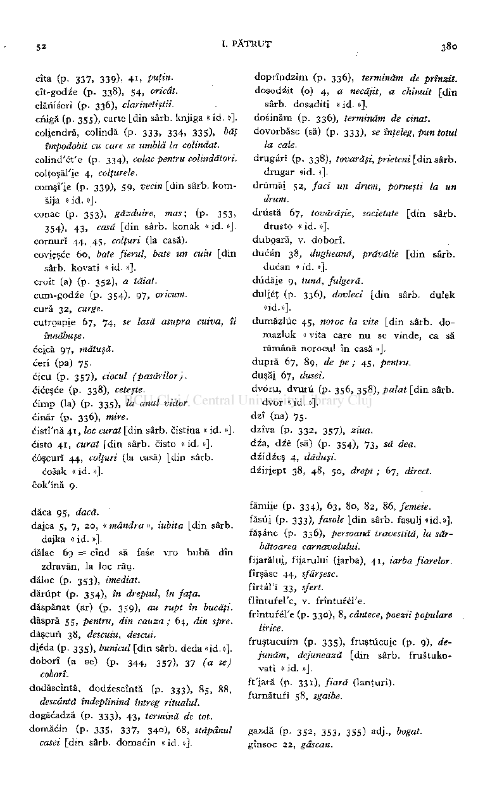

#### doprîndzîm (p. 336), terminăm de prînzit. dosodzit (o) 4, a necăjit, a chinuit [din

cîta (p. 337i 339). 41, puţin.

##### cît-godze (p. 338), 54, oricât. clăniseri (p. 336), clarinetista.

sârb. dosaditi « id. »].

dosinăm (p. 336), terminăm de cinat. dovorbăsc (să) (p. 333), se înţeleg, pun totul

cnigă (p. 355), carte [din sârb. knjiga « id. »]. coliendră, colindă (p. 333, 334, 335), băţ

la cale.

împodobit cu care se umblă la colindat.

colind'ét'e (p. 334), colac pentru colindători.

dragări (p. 338), tovarăşi, prieteni [din sârb.

- colţoşăl'ie 4, colţurele.
- comşî'ie (p. 339), 59, vecin [din sârb. komsija « id. »].

drugar «id. »].

drumăj 52, faci un drum, porneşti la un

drum.

drustă 67, tovărăşie, societate [din sârb.

conac (p. 353), găzduire, mas; (p. 353,

drusto « id. »]. duboară, v. doborî.

ă [din sârb. konak « id. »]. cornurî 44, 45, colţuri (la casă),

354). 43>

cas

covieşce 60, bate fierul, bate un cuiu [din

##### ducàn 38, dugheană, prăvălie [din sârb.

ducan « id. »].

sârb. kovati « id. »].

diidăie 9, tună, fulgeră.

croit (a) (p. 352), a tăiat. cum-godze (p. 354), 97. oricum. cură 32, curge.

dulieţ (p. 336), dovleci [din sârb. dulek «id.»].

cutroapie 67, 74, se lasă asupra cuiva, îl

##### dumăzluc 45, noroc la vite [din sârb. do-

înnăbuşe.

mazluk « vita care nu se vinde, ca să rămână norocul în casă »].

ceică 97, mătuşă.

dupră 67, 89, de pe ; 45, pentru. duşăi 67, dusei.

ceri (pa) 75.

cicu (p. 357), ciocul (pasărilor ) .

ciceşce (p. 338), ceteşte.

dvôru, dvurû (p. 356, 358), palat [din sârb.

#### cimp (la) (p. 335), la anul viitor.

dvor « id. »]. dzî (na) 75.

###### cinăr (p. 336), mire.

###### dzîva (p. 332, 357), ziua.

cistî'nă 41, loc curat [din sârb. cistina « id. »]. cisto 41, curat [din sârb. cisto « id. »]. coşcurî 44, colţuri (la casă) [din sârb.

dza, dzé (să) (p. 354), 73, să dea.

dzidzeş 4, dăduşi.

#### dziriept 38, 48, 50, drept ; 67, direct.

cosak « id. »]. cok'ină 9.

##### fămije (p. 334), 63, 80, 82, 86, femeie.

daca 95, dacă.

făsui (p. 333), fasole [din sârb. fasulj «id.»].

daica 5, 7, 20, « mândra », iubita [din sârb.

făşânc (p. 336), persoană travestită, la săr­

dajka « id. »]. dălac 69 = cînd să fase vro bubă dîn zdravăn, la loc rău.

bătoarea carnavalului.

fiiarăluj, fiiarului (iarba), 41, iarba fiarelor.

fîrşăsc 44, sfârşesc.

dăloc (p. 353), imediat.

#### fîrtâl'I 33, sfert.flîntufel'e, v. frîntufél'e.frîntufél'e (p. 330), 8, cântece, poezii populare

dărupt (p. 354), în dreptul, în faţa. dăspănat (ar) (p. 359), au rupt în bucăţi. dăspră 55, pentru, din cauza; 64, din spre. dăşcun 38, descuiu, descui.

lirice.

fruştucuim (p. 335), fruştucuie (p. 9), de­

diéda (p. 335), bunicul [din sârb. deda «id.»]. doborî (a se) (p. 344, 357), 37 (a se)

junăm, dejunează [din sârb. frustuko-

vati « id. »]. ft'iară (p. 331), fiară (lanţuri).

coborî.

dodăscîntă, dodzescîntă (p. 333), 85, 88,

furnătufî 58, sgaibe.

descântă îndeplinind întreg ritualul.

dogăcadză (p. 333), 43, termina de tot.

domăcin (p. 335, 337, 340), 68, stăpânul

gazdă (p. 352, 353, 355) adj., bogat.

casei [din sârb. domacin « id. »].

##### gînsoc 22, gâscan.

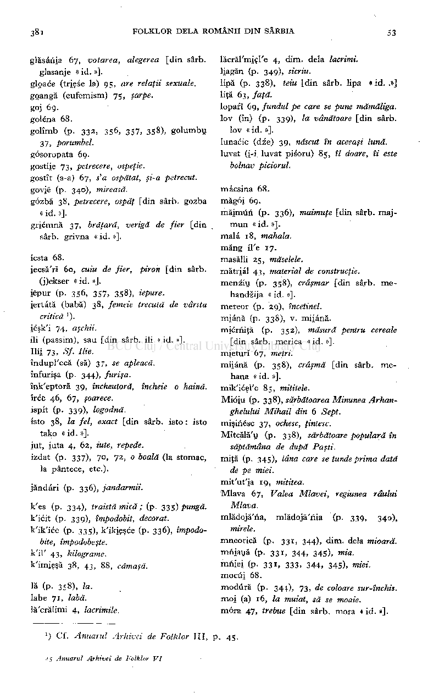

glăsânia 67, votarea, alegerea [din sârb.

lăcrărmiel'e 4, dim. delà lacrimi.

liagăn (p. 349), sicriu.

glasanje « id. »].

gloace (triese la) 95, are relaţii sexuale.

lîpă (p. 338), teiu [din sârb. lipa « id. .»]

liţă 63, faţă.

goangă (eufemism) 75, şarpe. goj 69. goléna 68. golîmb (p. 332, 356, 3S7, 358), golumbu

lopafî 69, fundul pe care se pune mămăliga.

Iov (în) (p. 339), la vânătoare [din sârb.

Iov « id. »].

lunacic (dze) 39, născut în aceeaşi lună.

37, porumbel.

luvat (i-i luvat pisoru) 85, îl doare, îi este

gösoropata 69.

bolnav piciorul.

gostiie 73, petrecere, ospeţie. gostît (s-a) 67, s'a ospătat, şi-a petrecut.

govië (p. 340), mireasă.

mâcsina 68. măgoi 69. măjmun (p. 336), maimuţe [din sârb. maj-

gozbă 38, petrecere, ospăţ [din sârb. gozba « id. »].

griemnă 37, brăţară, verigă de fier [din

mun « id. »].

mala 18, mahala.

sârb. grivna « id. »].

măng il'e 17.

icsta 68.

masălli 25, măselele.

iecsă'rî 60, cuiu de fier, piron [din sârb.

mătriâl 43, material de construcţie.

(j)ekser « id. »].

menziu (p. 358), crâşmar [din sârb. mehandzija « id. »].

iëpur (p. 356, 357, 358), iepure.

iertată (babă) 38, femeie trecută de vârsta

mereor (p. 29), încetinel.

critică

).

l

miână (p. 338), v. miiână.

ieşk'i 74, aşchii.

mierriiţă (p. 352), măsură pentru cereale

iii (passim), sau [din sârb. iii « id. »].

[din sârb. merica « id. »].

Ilii 73, Sf. Ilie.

mieturi 67, metri.

###### îndupl'ecă (să) 37, se apleacă.

miiână (p. 358), crâşmă [din sârb. mehana « id. »].

înfurişa (p. 344), furişa.

înk'eptoră 39, încheutoră, încheie o haină.

mik'icel'e 85, mititele.

îrce 46, 67, şoarece.

Miöiu (p. 338), sărbătoarea Minunea Arhan­

ispit (p. 339), logodnă.

ghelului Mihail din 6 Sept. mişinesc 37, ochesc, ţintesc. Mîtcălă'u (p. 338), sărbătoare populară în

isto 38, la fel, exact [din sârb. isto : isto tako « id. »].

iut, iuta 4, 62, iute, repede.

săptămâna de după Paşti.

izdat (p. 337), 70, 72, o boală (la stomac, la pântece, etc.).

miţă (p. 345), lâna care se tunde prima dată

de pe miei.

mit'ut'ia 19, mititea.

- jăndâri (p. 336), jandarmii.
- k'es (p. 334), traistă mică ; (p. 335) pungă. k'icit (p. 339), împodobit, decorat.

Mlava 67, Valea Mlavei, regiunea râului

M lava.

mlădojă'na, mlădojă'hia (p. 339, 340),

mirele.

k'ik'ice (p. 335), k'ikieşce (p. 336), împodo­

bite, împodobeşte. k'il' 43, kilograme.

mneorică (p. 331, 344), dim. delà mioară. mhiauă (p. 331, 344, 345), mia.

mriiei (p. 331, 333, 344, 345), miei.

- k'imieşă 38, 43, 88, cămaşă.

lă (p. 358), la.

labe 71 labă.

- lă'crălimi 4, lacrimile.

mocui 68.

modură (p. 344.), 73, de coloare sur-închis. moi (a) 16, la muiat, să se moaie.

mora 47, trebue [din sârb. mora « id. »].

) Cf. Anuarul Arhivei de Folklor III, p. 45.

l

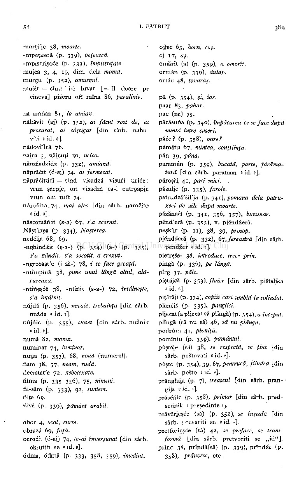

morţî'ie 38, moarte.

ogac 63, horn, coş.

oj 17, aş.

- -mpeţască (p. 339), peţeascâ.
- -mpistrişace (p. 333), împistriţate. muică 3, 4, 19, dim. delà mamă. murgu (p. 352), amurgul. musit = cînd i-i luvat [ = îl doare pe

omărît (a) (p. 359), a omorît. ormân (p. 339), dulap.

ortac 48, tovarăş.

cineva] pisoru ofî mina 86, paralizie.

Pă (p- 354), fi, iar.

paar 83, pahar.

pac (na) 75. păcăsuna (p. 340), împăcarea ce se face după

na amnaz 81 la amiaz.

năbăvit (ai) (p. 352), ai făcut rost de, ai

nuntă între cuscri.

procurat, ai câştigat [din sârb. naba-

pace? (p. 358), oare?

viti « id. »]. nădovî'lcă 76. naica 5, năicuţî 20, neică.

pâmătu 67, mintea, conştiinţa. păn 39, până. paramân (p. 359), bucată, parte, fărâmă­

##### nămnadzîdz (p. 332), amiază.

năprăcit (c-ai) 74, ai fermecat. năprăcitufî = cînd visadză visuri urîce :

tură [din sârb. paraman « id. »].

păroşăi 41, pari mici.

păsulie (p. 335), fasole.

vrun şărpie, ori visadză că-1 cutroapie vrun om urît 74.

patrudză'sil'ia (p. 341), pomana delà patru­

zeci de zile după moarte.

nârocito,74, mai ales [din sârb. narocito «id. »].

păzănafi (p. 341, 356, 357), buzunar.

###### născomăhit (s-a) 67, s'a scornit.

pend'eră (p. 355), v. piendzeră.

Năşt'irea (p. 334), Naşterea.

peşk'ir (p. 11), 38, 39, prosop.

nedélja 68, 69.

piendzeră (p. 332), 67,fereastră [din sârb. pendzer « id. »].

- -nghindzit (ş-a-) (p. 354), (a-) (p. 355), s'a gândit, s'a socotit, a crezut.
- -ngrozăşt'e (i să-) 78, i se face greaţă.
- -ntîmpină 38, pune unul lângă altul, alătur ează.
- -ntîneşce 38, -ntînit (s-a-) 72, întâlneşte, s'a întâlnit.

pietrese- 38, introduce, trece prin.

pingă (p. 336), pe lângă. pîrg 37, pâlc.

piştâjcă (p. 353), fluier [din sârb. pistaljka « id. »].

piţărăii (p. 334), copiii cari umblă în colindat.

mijdă (p. 356), nevoie, trebuinţă [din sârb.

plăncis (p. 335), panglici.

pliecat(a pliecat să plîngă) (p. 354), a început.

nuzda « id. »]. nujriic (p. 355), closet [din sârb. nuznik « id. »].

##### plîngă (să nu să) 46, să nu plângă.

podrüm 41, pivniţă. pomîntu (p. 359), pământul.

numă 82, numai.

poştăie (să) 38, se respectă, se ţine [din

numinat 74, luminat.

sârb. postovati « id. »].

nuua (p. 353), 68, nouă (numeral),

poşto (p. 354), 39, 67; pentrucă, fiindcă [din

riam 38, 57, neam, rudă.

necrstat'e 72, nebotezate.

sârb. posto « id. »]. prănghlia (p. 7), treascul [din sârb. pran- • gija « id. »]. prăseiiic (p. 358), primar [din sârb. predsednik « preşedinte »].

nima (p. 335 356), 75, nimeni. rii-săm (p. 333), 92, suntem.

niţa 69.

nivă (p. 339), pământ arabil.

##### prăvărieşce (să) (p. 352), se înşeală [din

obor 4, ocol, curte.

sârb., prevariti se « id. »].

pretforişşce (să) 42, se preface, se trans­

obrază 69, faţă.

formă [din sârb. pretvoriti se „id"]. prînd 38, prîndă(să) (p. 339), prîndze (p.

ocrocit (c-ai) 74, te-ai înverşunat [din sârb. okrutiti se « id. »]. ddma, ddmă (p. 333, 358, 359), imediat.

358), prânzesc, etc.

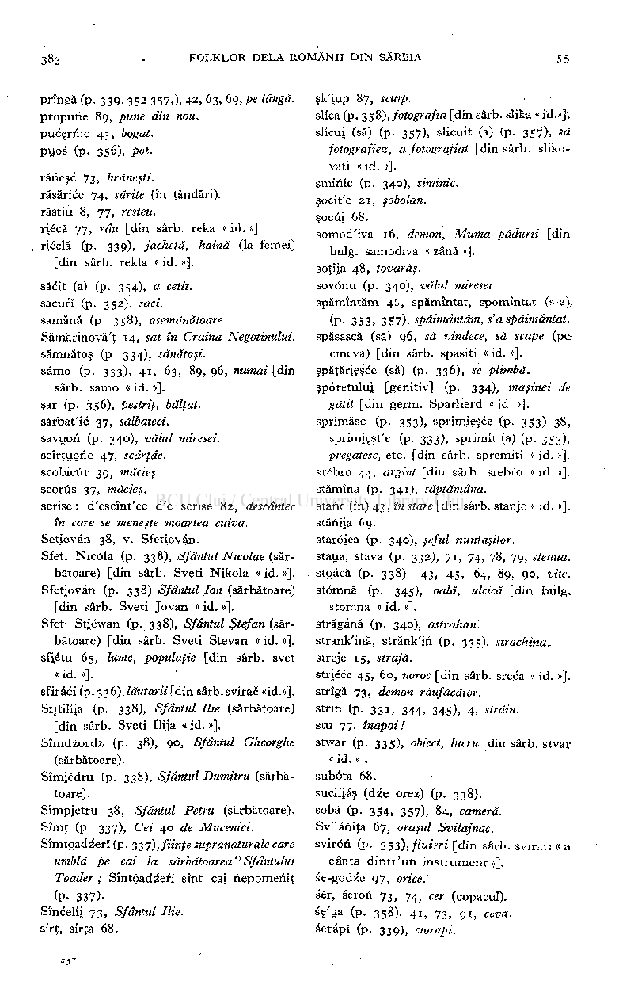

şk'iup 87, scuip.

prîngă (p. 339, 352 357,), 42, 63, 69,pe lângă.

propune 89, pune din nou. pucernic 43, bogat.

slica (p. 358), fotografia [din sârb. slika « id.»]". slicui (să) (p. 357), slicuit (a) (p. 357), să

fotografiez, a fotografiat [din sârb. sliko-

puos (p. 356), pot.

vati « id. »].

- rănesc 73, hrăneşti.

- răsărice 74, sărite (în ţăndări),

- răstiu 8, 77, resteu. riecă 77, râu [din sârb. reka « id. »]. rieclă (p. 339), jachetă, haină (la femei)

[din sârb. rekla « id. »].

- săcit (a) (p. 354), a cetit. sacufî (p. 352), saci. samănă (p. 358), asemănătoare. Sămărinovă'ţ 14, sat în Craina Negotinului.

- sămnătoş (p. 334), sănătoşi. sâmo (p. 333), 41, 63, 89, 96, numai [din

sârb. samo « id. »].

şar (p. 356), pestriţ, bălţat.

- sărbat'ic 37, sălbateci. savuori (p. 340), vălul miresei. scîrţuone 47, scârţâe. scobicür 39, măcieş. scoruş 37, măcieş. scrise : d'escînt'ec d'e scrise 82, descântec

smihic (p. 340), siminic. şocît'e 21, şobolan.

şocui 68.

somod'iva 16, demon, Muma pădurii [din

bulg. samodiva « zână »].

soţîia 48, tovarăş.

sovönu (p. 340), vălul miresei.

spămîntăm 46, spămîntat, spomîntat (s-a)

(P- 353) 357)> spăimântăm, s'a spăimântat.. spăsască (să) 96, sa vindece, să scape (pe

cineva) [din sârb. spăsiţi « id. »].

##### şpăţărieşce (să) (p. 336), se plimbă.

şporetului [genitiv] (p. 334), maşinei de

gătit [din germ. Sparherd « id. »].

sprimăsc (p. 353), sprimieşce (p. 353) 38, sprimleşt'e (p. 333), sprimit (a) (p. 353), pregătesc, etc. [din sârb. spremiti « id. »].

srébro 44, argint [din sârb. srebfo « id. »].

stămîna (p. 341), săptămâna.

stane (în) 43, în stare [din sârb. stanje « id. »]. stăniia 69.

în care se meneşte moartea cuiva.

staröica (p. 340), şeful nuntaşilor.

Setiovân 38, v. Sfetiovân. Sfeti Nicola (p. 338), Sfântul Nicolae (săr­

staua, stava (p. 332), 71, 74, 78, 79, steaua.

stoâcă (p. 338), 43, 45, 64, 89, 90, vite. stomnă (p. 345), oală, ulcică [din bulg.

bătoare) [din sârb. Sveti Nikola « id. »]. Sfetiovân (p. 338) Sfântul Ion (sărbătoare)

stomna « id. »].

[din sârb. Sveti Jovan « id. »].

străgână (p. 340), astrahan.

Sfeti Stiéwan (p. 338), Sfântul Ştefan (sărbătoare) [din sârb. Sveti Stevan « id. »]. sfiétu 65, lume, populaţie [din sârb. svet

strank'ină, strănk'ih (p. 335), strachină.

streje 15, strajă.

« id. »]. sfirâci (p. -ş^d),lăutarii [din sârb.svirac «id.»].

striéce 45, 6o, noroc [din sârb. sreca « id. »].

strîgă 73, demon răufăcător.

strin (p. 331, 344, 345), 4, străin.

##### Sfitiliia (p. 338), Sfântul Ilie (sărbătoare)

stu 77, înapoi!

[din sârb. Sveti Ilija «id. »].

Sîmdzordz (p. 38), 90, Sfântul Gheorghe

stwar (p. 335), obiect, lucru [din sârb. stvar

(sărbătoare).

« id. »]. subota 68. sucliiâş (dze orez) (p. 338).

##### Sîmiédru (p. 338), Sfântul Dumitru (sărbă­

toare).

sobă (p. 354, 357), 84, cameră.

Sîmpietru 38, Sfântul Petru (sărbătoare). Sîmţ (p. 337), Cei 40 de Mucenici.

Svilâhiţa 67, oraşul Svilajnac.

Sîmtoadzerï (p. AI), fiinţe supranaturale care

sviröii (r>. 353), FLUIERI [din sârb. s viraţi « a cânta dinti'un instrument»],

umblă pe cai la sărbătoarea

Sfântului Toader ; Sîntpadzefi sînt cai nepomenit (P- 337)-

0

se-godze 97, orice.'

sër, seron 73, 74, cer (copacul),

Sîncelii 73, Sfântul Ilie.

se'ya (p. 358), 41, 73, 91, ceva. serâpi (p. 339), ciorapi.

sirţ, sirţa 68.

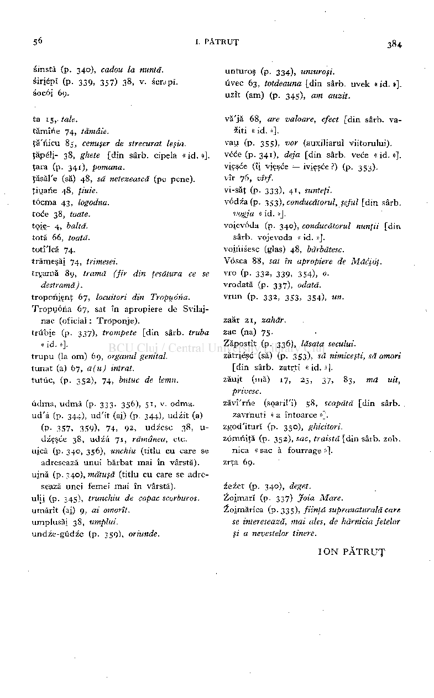

sinstă (p. 340), cadou la nuntă.

unturoş (p. 334), unsuroşi.

siriépï (p. 339, 357) 38, v. serapi. socôi 69.

üvec 63, totdeauna [din sârb. uvek « id. »].

uzît (am) (p. 345), am auzit.

ta 15,. taie.

vă'jă 68, are valoare, efect [din sârb. va-

tămîne 74, tămâie.

ziti « id. »]. vau (p. 355), vor (auxiliarul viitorului), véce (p. 341), deja [din sârb. vece « id. »]. vieşce (îi vieşce = ivieşce ?) (p. 353).

ţă'fîicu 85, cenuşer de strecurat leşia.

ţăpeli- 38, ghete [din sârb. cipela « id. »].

ţara (p. 341), pomana.

vîr 76, vîrf.

ţăsăl'e (să) 48, sa netezească (pe pene).

vi-săţ (p. 333), 41, sunteţi.

ţiuarie 48, ţiuie. tôcma 43, logodna.

vodza (p. 353), conducătorul, şeful [din sârb.

### vogja « id. »].

toce 38, toate. toie- 4, baltă. totă 66, toată.

voievôda (p. 340), conducătorul nunţii [din

sârb. vojevoda « id. »].

totî'lcă 74.

voiiiisesc (glas) 48, bărbătesc. Vösca 88, sat în apropiere de Măcioţ. vro (p. 332, 339, 354), o.

trămeşăi 74, trimesei.

treamă 89, tramă (fir din ţesătura ce se

destramă ) .

vrodată (p. 337), odată.

troponienţ 67, locuitori din Tropuona.

vrun (p. 332, 353, 354), un.

Tropuöna 67, sat în apropiere de Svilajnac (oficial : Tröponje).

zaăr 21, zahăr,

zac (na) 75. Zăpostît (p. 336), lăsata secului. zătrieşc (să) (p. 353), să nimiceşti, să omori

###### trü'bie (p. 337), trompete [din sârb. truba

« id. »].

trupu (la om) 69, organul genital.

tunat (a) 67, a(u) intrat.

[din sârb. zatrti « id. »]. zăuit (mă) 17, 25, 37, 83, mă uit,

tutuc, (p. 352), 74, butuc de lemn.

privesc.

zăvî'rne (soaril'i) 58, scăpată [din sârb. zavrnuti « a întoarce »].

üdma, udmă (p. 333. 356), 51 v. odma. ud'â (p. 344), ud'it (ai) (p. 344), udzit (a)

zgod'iturî (p. 350), ghicitori.

(P- 357, 359). 74, 92, udzesc 38, udzeşce 38, udzâ 71 rămânea, etc.

zomhiţă (p. 352), sac, traistă [din sârb. zob.

nica « sac à fourrage »]. zrţa 69.

uică (p. 340, 356), unchiu (titlu cu care se adresează unui bărbat mai în vârstă). uină (p. 340), mătuşă (titlu cu care se adre­

zezet (p. 340), deget.

sează unei femei mai în vârstă).

Zoimarî (p. 337) Joia Mare. Zoimărica (p. 335), fiinţă supranaturală care

ulii (p. 345), trunchiu de copac scorburos.

umărît (ai) 9, ai omorît. umplusăi 38, umplui.

se interesează, mai ales, de hărnicia fetelor şi a nevestelor tinere.

undze-güdze (p. 359), oriunde.

###### IO N PĂTRU Ţ

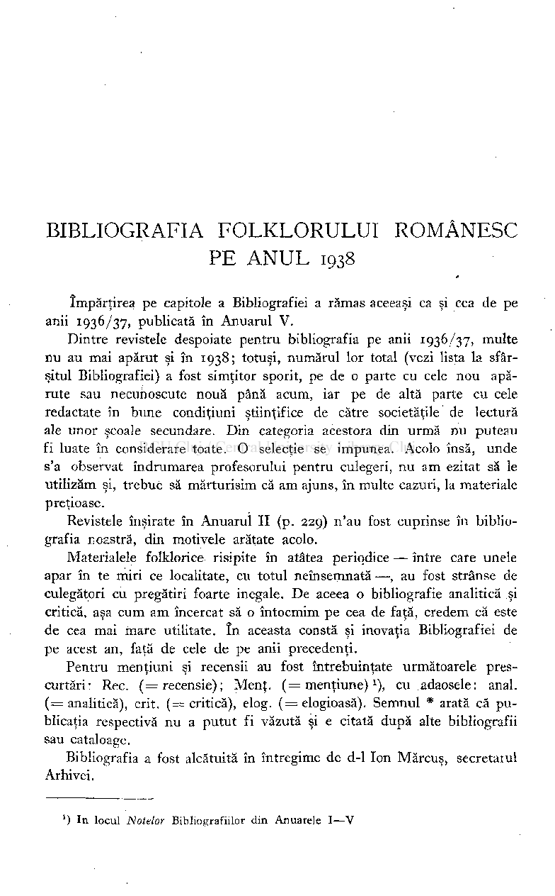

# BIBLIOGRAFIA FOLKLORULUI ROMÂNESC PE ANUL 1938

împărţirea pe capitole a Bibliografiei a rămas aceeaşi ca şi cea de pe anii 1936/37, publicată în Anuarul V.

Dintre revistele despoiate pentru bibliografia pe anii 1936/37, multe nu au mai apărut şi în 1938; totuşi, numărul lor total (vezi lista la sfârşitul Bibliografiei) a fost simţitor sporit, pe de o parte cu cele nou apărute sau necunoscute nouă până acum, iar pe de altă parte cu cele redactate în bune condiţiuni ştiinţifice de către societăţile de lectură ale unor scoale secundare. Din categoria acestora din urmă nu puteau fi luate în considerare toate. O selecţie se impunea. Acolo însă, unde s'a observat îndrumarea profesorului pentru culegeri, nu am ezitat să le utilizăm şi, trebué să mărturisim că am ajuns, în multe cazuri, la materiale preţioase.

Revistele înşirate în Anuarul II (p. 229) n'au fost cuprinse în bibliografia noastră, din motivele arătate acolo.

Materialele folklorice risipite în atâtea periodice — între care unele apar în te miri ce localitate, cu totul neînsemnată •—, au fost strânse de culegători cu pregătiri foarte inegale. De aceea o bibliografie analitică şi critică, aşa cum am încercat să o întocmim pe cea de faţă, credem că este de cea mai mare utilitate. în aceasta constă şi inovaţia Bibliografiei de pe acest an, faţă de cele de pe anii precedenţi.

Pentru menţiuni şi recensa au fost întrebuinţate următoarele prescurtări- Rec. ( = recensie) ; Menţ. ( = menţiune) ), cu adaosele: anal. ( = analitică), crit. ( = critică), elog. ( = elogioasă). Semnul * arată că publicaţia respectivă nu a putut fi văzută şi e citată după alte bibliografii sau cataloage.

Bibliografia a fost alcătuită în întregime de d-1 Ion Mărcuş, secretarul Arhivei.

') In locul Notelor Bibliografiilor din Anuarele I— V

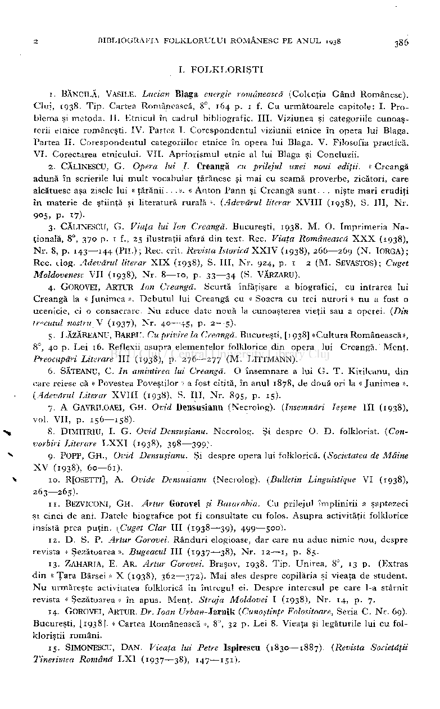

###### I. FOLKLORIŞT I

I. BĂNCILĂ, VASILE. Lucian Blaga energie românească (Colecţia Gând Românesc). Cluj, 1938. Tip . Cartea Românească, 8°, 164 p. 1 f. C u următoarele capitole: I. Problema şi metoda. II. Etnicul în cadrul bibliografic. III. Viziunea şi categoriile cunoaşterii etnice româneşti. IV . Partea I. Corespondentul viziunii etnice în opera lui Blaga. Partea II. Corespondentul categoriilor etnice în opera lui Blaga. V Filosofia practică. VI. Corectarea etnicului. VII . Apriorismul etnic al lui Blaga şi Concluzii.

3. CĂLINESCU, G. Opera lui 1 Creangă cu prilejul unei noui ediţii. « Creangă

adună în scrierile lui mult vocabular ţărănesc şi mai cu seamă proverbe, zicători, care alcătuesc aşa zisele lui « ţăranii... ». « Anton Pann şi Creangă sunt. . . nişte mari erudiţi în materie de ştiinţă şi literatură rurală •> {Adevărul literar XVII I (1938), S. III, Nr. 905, p. 17).

3. CĂLINESCU, G. Viaţa lui Ion Creangă. Bucureşti, 1938. M . O . Imprimeria Na ţională, 8°, 370 p. 1 f., 25 ilustraţii afară din text. Rec. Viaţa Românească XX X (1938), Nr. 8, p. 143—144 (PH.) ; Rec. crit. Revista Istorică XXI V (1938), 266—269 (N. IORGA) ; Rec. elog. Adevărul literar XI X (1938), S. III, Nr. 924, p. 1—2 (M SEVASTOS) ; Cuget

Moldovenesc VI I (1938), Nr. 8—10, p. 33—34 (S. VĂRZARU).

4. GOROVEI, ARTUR Ion Creangă. Scurtă înfăţişare a biografiei, cu intrarea lui Creangă la « Junimea ». Debutul lui Creangă cu « Soacra cu trei nurori » nu a fost o ucenicie, ci o consacrare. N u aduce date nouă la cunoaşterea vieţii sau a operei. (Din trecutid nostru V (1937), Nr . 40—45, p. 2—5).

- 5. LĂZĂREANU, BARBU. CU privire la Creangă. Bucureşti, [1938] «Cultura Românească»,

8°, 40 p. Lei 16. Reflexii asupra elementelor folklorice din opera lui Creangă. Menţ. Preocupări Literare III (1938), p. 276—277 (M . LlTTMANN).

- 6. SĂTEANU, C In amintirea lui Creangă. O însemnare a lui G. T . Kirileanu, din

care reiese că « Povestea Poveştilor » a fost citită, în anul 1878, de două ori la « Junimea ». (Adevărul Literar XVII I (1938), S. III, Nr. 895, p. 15).

- 7. A GAVRILOAEI, G H Ovid Densusiann (Necrolog). (însemnări Ieşene III (1938),

vol. VII , p. 156—158).

- 8. DlMITRIU, I. G. Ovid Densusianu. Necrolog. Şi despre O . D . folklorist. (Con­

vorbiri Literare LXX I (1938), 398—399,

1

.

- 9. POPP, GH. Ovid Densusianu. Şi despre opera lui folklorică. (Societatea de Mâine

X V (1938), 60—61).

- 10. R[OSETTl], A . Ovide Densusianu (Necrolog). (Bulletin Linguistique V I (1938),

263—265).

II . BEZVICONI, G H Artur Gorovei şi Basarabia. C u prilejul împlinirii a şaptezeci şi cinci de ani. Datele biografice pot fi consultate cu folos. Asupra activităţii folklorice insistă prea puţin. (Cuget Clar III (1938—39), 499—500!.

- 12. D . S. P. Artur Gorovei. Rânduri elogioase, dar care nu aduc nimic nou, despre

revista « Şezătoarea ». Bugeacul III (1937—38), Nr. 12—1, p. 85.

- 13. ZAHARIA, E. AR Artur Gorovei. Braşov, 1938. Tip . Unirea, 8°, 13 p. (Extras

din « Ţara Bârsei » X (1938), 362—372). Mai ales despre copilăria şi vieaţa de student. N u urmăreşte activitatea folklorică în întregul ei. Despre interesul pe care 1-a stârnit revista « Şezătoarea » în apus. Menţ. Straja Moldovei I (1938), Nr. 14, p. 7.

14. GOROVEI, ARTUR. Dr. Ioan Urban-iwcmk (Cunoştinţe Folositoare, Seria C . Nr. 69). Bucureşti, [1938]. « Cartea Românească », 8°, 32 p. Lei 8. Vieaţa şi legăturile lui cu folkloriştii români.

- 15. SlMONESCU, DAN. Vieaţa lui Petre lspirescu (1830—1887). (Revista Societăţii

###### Tinerimea Română LX I (1937—38), 147—151).

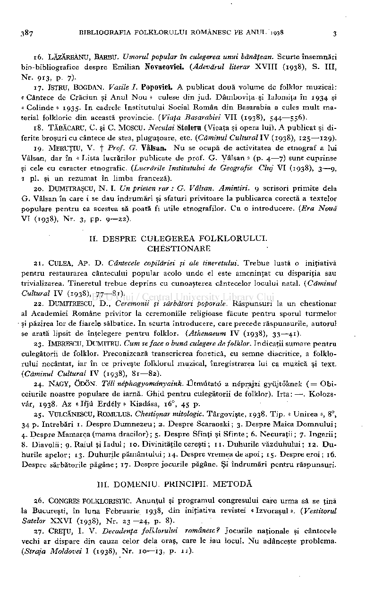

- 16. LĂZĂREANU, BARBU. Umorul popular în culegerea unui bănăţean. Scurte însemnări

bio-bibliografice despre Emilian NOVACOYICI. {Adevărul literar XVII I (1938), S. III, Nr. 913, p. 7).

- 17. ISTRU, BOGDAN. Vasile I. POPOVICI. A publicat două volume de folklor muzical:

« Cântece de Crăciun şi Anul No u » culese din jud. Dâmboviţa şi Ialomiţa în 1934 şi « Colinde » 1935. In cadrele Institutului Social Român din Basarabia a cules mult material folkloric din această provincie. (Viaţa Basarabiei VI I (1938), 544—556).

- 18. TĂBĂCARU, C. şi C. MOSCU. Neculai Stolerii (Vieaţa şi opera lui). A publicat şi di­

ferite broşuri cu cântece de stea, pluguşoare, etc. (Căminul Cultural I V (1938), 125—129).

- 19. MERUŢIU, V. f Prof. G. VÂLSAN. N u se ocupă de activitatea de etnograf a lui

Vâlsan, dar în « Lista lucrărilor publicate de prof. G . Vâlsan » (p. 4—7) sunt cuprinse

şi cele eu caracter etnografic. (Lucrările Institutului de Geografie Cluj V I (1938), 3—9,

1 pl. şi un rezumat în limba franceză).

20. DUMITRAŞCU, N . I. Un prieten rar : G. Vâlsan. Amintiri. 9 scrisori primite delà

G. Vâlsan în care i se dau îndrumări şi sfaturi privitoare la publicarea corectă a textelor populare pentru ca acestea să poată fi utile etnografilor. C u o introducere. (Era Nouă

VI (1938), Nr 3, pp. 9—22).

###### II. DESPR E CULEGERE A FOLKLORULUI . CHESTIONAR E

21. CULEA, AP D Cântecele copilăriei şi ale tineretului. Trebue luată o iniţiativă

pentru restaurarea cântecului popular acolo unde el este ameninţat cu dispariţia sau trivializarea. Tineretul trebue deprins cu cunoaşterea cântecelor locului natal. (Căminul

Cultural I V (1938), 77—81).

- 22. DUMITRESCU, D. , Ceremonii şi sărbători poporale. Răspunsuri la un chestionar

al Academiei Române privitor la ceremoniile religioase făcute pentru sporul turmelor şi păzirea lor de fiarele sălbatice. In scurta introducere, care precede răspunsurile, autorul se arată lipsit de înţelegere pentru folklor. (Athenaeum I V (1938), 33—41).

- 23. IMBRESCU, DUMITRU. Cum se face o bună culegere de folklor. Indicaţii sumare pentru

culegătorii de folklor. Preconizează transcrierea fonetică, cu semne diacritice, a folklorului necântat, iar în ce priveşte folklorul muzical, înregistrarea lui ca muzică şi text.

(Căminul Cultural I V (1938), 81—82).

- 24. NAGY, ÖDÖN. Téli néphagyomdnyaink. -Ütmutatö a néprajzi gyüjtöknek ( = Obi­

ceiurile noastre populare de iarnă. Ghid pentru culegătorii de folklor). Irta: — . Kolozsvâr, 1938. A z « Ifjii Erdély » Kiadâsa, 16

0

, 45 p.

- 25. VULCĂNESCU, ROMULUS. Chestionar mitologic. Târgovişte, 1938. Tip. « Unirea », 8°,

34 p. întrebări 1. Despre Dumnezeu; 2. Despre Scaraoski; 3. Despre Maica Domnului; 4. Despre Mamarça (mama dracilor); 5. Despre Sfinţi şi Sfinte; 6. Necuraţii; 7. îngerii; 8. Diavolii; 9. Raiul şi Iadul ; 10. Divinităţile cereşti ; 11 . Duhurile văzduhului ; 12 Du hurile apelor; 13. Duhurile pământului ; 14. Despre vremea de apoi ; 15 Despre eroi ; 16. Despre sărbătorile păgâne; 17 Despre jocurile păgâne. Şi îndrumări pentru răspunsuri.

III. DOMENIU . PRINCIPII . METOD Ă

26. CONGRES FOLKLORISTIC Anunţul şi programul congresului care urma să se ţină la Bucureşti, în luna Februarie 1938, din iniţiativa revistei « Izvoraşul ». (Vestitorul

Satelor XXV I (1938), Nr 23—24, p. 8).

- 27. CREŢU, I. V Decadenţa folklorului românesc? Jocurile naţionale şi cântecele

vechi ar dispare din cauza celor delà oraş, care le iau locul. N u adânceşte problema.

(Straja Moldovei I (1938), Nr 10—13.. p. 11)

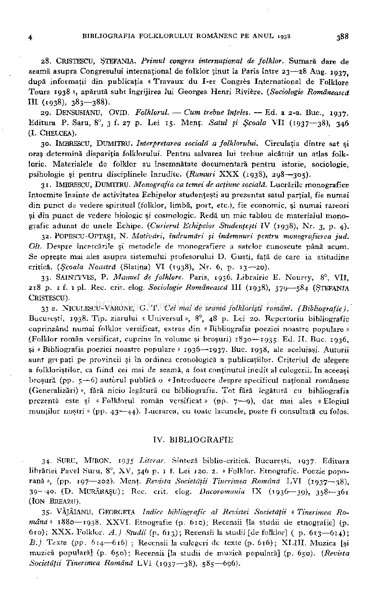

- 28. CRISTESCU, ŞTEFANIA. Primul congres internaţional de folklor. Sumară dare de

seamă asupra Congresului internaţional de folklor ţinut Ia Paris între 23—28 Aug 1937 după informaţii din publicaţia « Travaux du I-er Congrès International de Folklore Tours 1938 », apărută subt îngrijirea lui Georges Henri Rivière. (Sociologie Românească III (1938), 383-388).

- 29. DENSUSIANU, OVID. Folklorul. — Cum trebue înţeles. — Ed. a 2-a. Buc , 1937. Editura P. Saru, 8°, 3 f. 27 p. Lei 15 Menţ. Satul şi Şcoala VII (1937—38), 346 (I. CHELCEA).
- 30. IMBRESCU, DUMITRU. Interpretarea socială a folklorului. Circulaţia dintre sat şi oraş determină dispariţia folklorului. Pentru salvarea lui trebue alcătuit un atlas folkloric. Materialele de folklor au însemnătate documentară pentru istorie, sociologie, psihologie şi pentru disciplinele înrudite. (Ramuri XX X (1938), 298—305).
- 31. IMBRESCU, DUMITRU. Monografia ca temei de acţiune socială. Lucrările monografice întocmite înainte de activitatea Echipelor studenţeşti au prezentat satul parţial, fie numai din punct de vedere spiritual (folklor, limbă, port, etc.), fie economic, şi numai rareori şi din punct de vedere biologic şi cosmologic. Redă un mic tablou de materialul monografic adunat de unele Echipe. (Curierul Echipelor Studenţeşti I V (1938), Nr. 3, p. 4).
- 32. POPESCU-OPTAŞI, N . Motivări, îndrumări şi îndemnuri pentru monografierea jud. Olt. Despre încercările şi metodele de monografiere a satelor cunoscute până acum. Se opreşte mai ales asupra sistemului profesorului D . Guşti, faţă de Care ia atitudine critică. (Şcoala Noastră (Slatina) V I (1938), Nr. 6, p. 13—20).
- 33. SAINTYVES, P. Manuel de folklore. Paris, 1936. Librairie E. Nourry, 8°, VII , 218 p. 1 f. 1 pl. Rec. crit. elog. Sociologie Românească III (1938), 579—584 (ŞTEFANIA CRISTESCU).

33 a. NICULESCU-VARONE, G . T . Cei mai de seamă folklorişti români. (Bibliografie). Bucureşti, 1938. Tip . ziarului « Universul », 8°, 48 p. Lei 20. Repertoriu bibliografic cuprinzând numai folklor versificat, extras din « Bibliografia poeziei noastre populare » (Folklor român versificat, cuprins în volume şi broşuri) 1830—1935. Ed. II. Buc. 1936, şi « Bibliografia poeziei noastre populare » 1936—1937. Buc. 1938, ale aceluiaşi. Autorii sunt gripaţi pe provincii şi în ordinea cronologică a publicaţiilor. Criteriul de alegere a folkloriştilor, ca fiind cei mai de seamă, a fost conţinutul inedit al culegerii. In aceeaşi broşură (pp. 5—6) autorul publică o « Introducere despre specificul naţional românesc (Generalizări) », fără nicio legătură cu bibliografia. To t fără legătură cu bibliografia prezentă este şi « Folklorul român versificat » (pp. 7—9), dar mai ales « Elogiul munţilor noştri » (pp. 43—44). Lucrarea, cu toate lacunele, poate fi consultată cu folos.

IV. BIBLIOGRAFI E

- 34. SURU, MlRON. 1935 Literar. Sinteză biblio-critică. Bucureşti, 1937. Editura librăriei Pavel Suru, 8°, XV , 346 p. 1 f. Lei 120. 2. « Folklor. Etnografie. Poezie poporană », (pp. 197—202). Menţ. Revista Societăţii Tinerimea Română LV I (1937—38), 39—40. (D. MURĂRAŞU) ; Rec. crit. elog. Dacoromania I X (1936—39), 358—361 (ION BREAZU).
- 35. VAJÂIANU, GEORGETA Indice bibliografic al Revistei Societăţii « Tinerimea Română » 1880—1938. XXVI . Etnografie (p. 610); Recensii [la studii de etnografie] (p. 610); XXX . Folklor. A.) Studii (p. 613); Recensii la studii [de folklor] ( p. 613—614); B.) Texte (pp. 614—616) ; Recensii la culegeri de texte (p. 616); XLIII . Muzica [şi muzică populară] (p. 650); Recensii [la studii de muzică populară] (p. 650). (Revista Societăţii Tinerimea Română LV I (1937—38), 585—696).

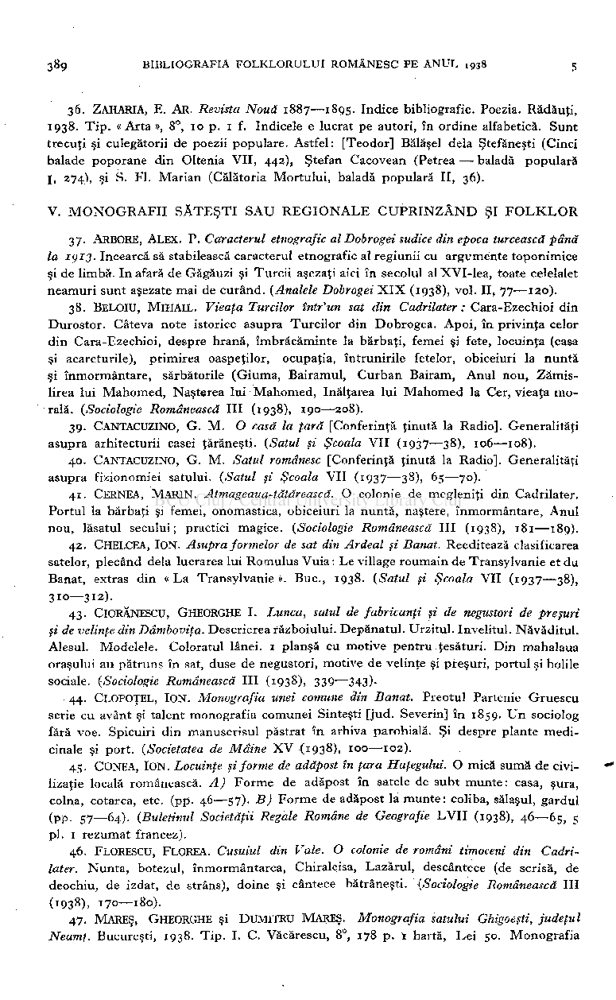

36. ZAHARIA, E. AR Revista Nouă 1887—1895. Indice bibliografic. Poezia. Rădăuţi, 1938. Tip . « Arta », 8°, 10 p. 1 f. Indicele e lucrat pe autori, în ordine alfabetică. Sunt trecuţi şi culegătorii de poezii populare. Astfel: [Teodor] Bălăşel delà Ştefăneşti (Cinci balade poporane din Oltenia VII 442), Ştefan Cacovean (Petrea —• baladă populară I, 274), şi S. FI. Marian (Călătoria Mortului, baladă populară II, 36).

V. MONOGRAFI I SĂTEŞT I SA U REGIONAL E CUPRINZÂN D ŞI FOLKLO R

- 37. ARBORE, ALEX. P. Caracterul etnografic al Dobrogei sudice din epoca turcească până la 1913. încearcă să stabilească caracterul etnografic al regiunii cu argumente toponimice şi de limbă. In afară de Găgăuzi şi Turcii aşezaţi aici în secolul al XVI-lea, toate celelalet neamuri sunt aşezate mai de curând. (Analele Dobrogei XI X (1938), vol. II, 77—120).
- 38. BELOIU, MlHAIL. Vieaţa Turcilor într'un sat din Cadrilater : Cara-Ezechioi din Durostor. Câteva note istorice asupra Turcilor din Dobrogea. Apoi, în privinţa celor din Cara-Ezechioi, despre hrană, îmbrăcăminte la bărbaţi, femei şi fete, locuinţa (casa şi acareturile), primirea oaspeţilor, ocupaţia, întrunirile fetelor, obiceiuri la nuntă şi înmormântare, sărbătorile (Giuma, Bairamul, Curban Bairam, Anul nou, Zămislirea lui Mahomed, Naşterea lui Mahomed, înălţarea lui Mahomed la Cer, vieaţa morală. (Sociologie Românească III (1938), 190—208).
- 39. CANTACUZINO, G . M . O casă la ţară [Conferinţă ţinută la Radio]. Generalităţi

asupra arhitecturii casei ţărăneşti. (Satul şi Şcoala VI I (1937—38), 106—108).

- 40. CANTACUZINO, G . M . Satul românesc [Conferinţă ţinută la Radio]. Generalităţi

asupra fizionomiei satului. (Satul şi Şcoala VI I (1937—38), 65—70).

- 41. CERNEA, MARIN. Atmageaua-tătărească. O colonie de megleniţi din Cadrilater.

Portul la bărbaţi şi femei, onomastica, obiceiuri la nuntă, naştere, înmormântare, Anul nou, lăsatul secului; practici magice. (Sociologie Românească III (1938), 181—189).

- 42. CHELCEA, ION. Asupra formelor de sat din Ardeal şi Banat. Reeditează clasificarea satelor, plecând delà lucrarea lui Romulus Vuia : Le village roumain de Transylvanie et du Banat, extras din « L a Transylvanie ». Buc , 1938. (Satul şi Şcoala VI I (1937—38), 310—312).
- 43. ClORĂNESCU, GHEORGHE I. Lunca, satul de fabricanţi şi de negustori de preşuri şi de velinţe din Dâmboviţa. Descrierea războiului. Depănatul. Urzitul. învelitul. Năvăditul. Alesul. Modelele. Coloratul lânei. 1 planşă cu motive pentru ţesături. Din mahalaua oraşului au pătruns în sat, duse de negustori, motive de velinţe şi preşuri, portul şi bolile sociale. (Sociologie Românească III (1938), 339—343).
- 44. CLOPOŢEL, ION. Monografia unei comune din Banat. Preotul Partenie Gruescu scrie cu avânt şi talent monografia comunei Sinteşti [jud. Severin] în 1859. U n sociolog fără voe. Spicuiri din manuscrisul păstrat în arhiva parohială. Şi despre plante medicinale şi port. (Societatea de Mâine X V (1938), 100—102).
- 45. CONEA, ION. Locuinţe şi forme de adăpost în ţara Haţegului. O mică sumă de civilizaţie locală românească. A ) Forme de adăpost în satele de subt munte : casa, şura, colna, cotarea, etc. (pp. 46—57). B) Forme de adăpost la munte: coliba, sălaşul, gardul (PP- 57—64). (Buletinul Societăţii Regale Române de Geografie LVI I (1938), 46—65, 5 pl. 1 rezumat francez).
- 46. FLORESCU, FLOREA. Cusuiul din Vale. O colonie de români timoceni din Cadrilater. Nunta, botezul, înmormântarea, Chiraleisa, Lazărul, descântece (de scrisă, de deochiu, de izdat, de strâns), doine şi cântece bătrâneşti. (Sociologie Românească III (1938), 170—180).
- 47. MAKES, GHEORGHE şi DUMITRU MAREŞ. Monografia satului Ghigoeşti, judeţul Neamf. Bucureşti, 1938. Tip . I. C . Văcărescu, 8°, 178 p. 1 hartă, Lei 50. Monografia

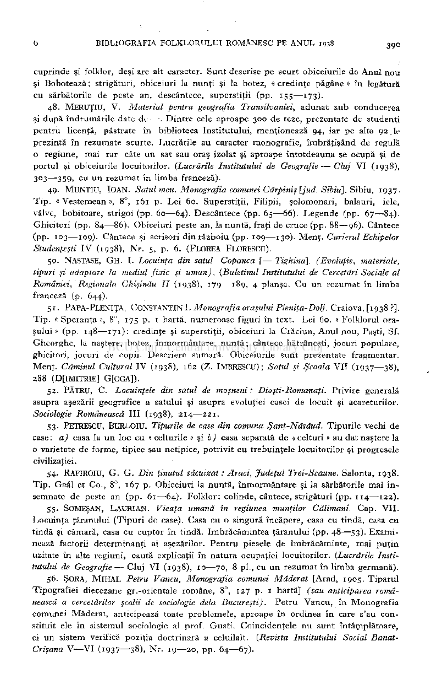

- cuprinde şi folklor, deşi are alt caracter. Sunt descrise pe scurt obiceiurile de Anul nou şi Bobotează ; strigături, obiceiuri la nunţi şi la botez, « credinţe păgâne » în legătură cu sărbătorile de peste an, descântece, superstiţii (pp. 155—173).
- 48. MERUŢIU, V. Material pentru geografia Transilvaniei, adunat sub conducerea şi după îndrumările date de — . Dintre cele aproape 300 de teze, prezentate de studenţi pentru licenţă, păstrate în biblioteca Institutului, menţionează 94, iar pe alte 92 le prezintă în rezumate scurte. Lucrările au caracter monografic, îmbrăţişând de regulă o regiune, mai rar câte un sat sau oraş izolat şi aproape întotdeauna se ocupă şi de portul şi obiceiurile locuitorilor. {Lucrările Institutului de Geografie — Cluj V I (1938), 3°3—3S9> cu un rezumat în limba franceză).
- 49. MUNTlU, IOAN. Satul meu. Monografia comunei Cărpiniş [jud. Sibiu]. Sibiu, 1937. Tip. « Vestemean », 8°, 161 p. Lei 60. Superstiţii, Filipii, solomonari, balauri, iele, vâlve, bobitoare, strigoi (pp. 60—64). Descântece (pp. 65—66). Legende (pp. 67—'84). Ghicitori (pp. 84—86). Obiceiuri peste an, la nuntă, fraţi de cruce (pp. 88—96). Cântece (pp. 103—109). Cântece şi scrisori din războiu (pp. 109—130). Menţ. Curierul Echipelor Studenţeşti I V (1938), Nr. 5, p. 6. (FLOREA FLORESCU).
- 50. NASTASE, GH. I. Locuinfa din satul Copanca [— Tighina]. (Evoluţie, materiale, tipuri şi adaptare la mediul fizic şi uman). (Buletinul Institutului de Cercetări Sociale al României, Regionala Chişinău II (1938), 179—189, 4 planşe. C u un rezumat în limba franceză (p. 644).
- 51. PAPA-PLENIŢA, CONSTANTINI. Monografia oraşului Pleniţa-Dolj. Craiova, [1938 ?]. Tip. « Speranţa », 8°, 175 p. 1 hartă, numeroase figuri în text. Lei 60. « Folklorul oraşului » (pp. 148—171): credinţe şi superstiţii, obiceiuri la Crăciun, Anul nou, Paşti, Sf. Gheorghe, la naştere, botez, înmormântare, nuntă ; cântece bătrâneşti, jocuri populare, ghicitori, jocuri de copii. Descriere sumară. Obiceiurile sunt prezentate fragmentar. Menţ. Căminul Cultural I V (1938), 162 (Z. IMBRESCU) ; Satul şi Şcoala VII (1937—38), 288 (D[IMITRIE] G[OGA]).
- 52. PATRU, C . Locuinţele din satul de moşneni : Dioşti-Romanaţi. Privire generală asupra aşezării geografice a satului şi asupra evoluţiei casei de locuit şi acareturilor. Sociologie Românească III (1938), 214—221.
- 53. PETRESCU, BURLOIU. Tipurile de case din comuna Şanţ-Năsăud. Tipurile vechi de case: a) casa la un loc cu « celturile » şi b) casa separată de « celturi » au dat naştere la o varietate de forme, tipice sau netipice, potrivit cu trebuinţele locuitorilor şi progresele civilizaţiei.
- 54. RAFIROIU, G . G . Din ţinutul săcuizat : Araci, Judeţul Trei-Scaune. Salonta, 1938. Tip. Gaâl et Co. 8°, 167 p. Obiceiuri la nuntă, înmormântare şi la sărbătorile mai însemnate de peste an (pp. 61—64). Folklor: colinde, cântece, strigături (pp. 114—122).
- 55. SOMEŞAN, LAURIAN. Vieaţa umană în regiunea munţilor Călimani. Cap. VII

Locuinţa ţăranului (Tipuri de case). Casa cu o singură încăpere, casa cu tindă, casa cu tindă şi cămară, casa cu cuptor în tindă. îmbrăcămintea ţăranului (pp. 48—53). Examinează factorii determinanţi ai aşezărilor. Pentru piesele de îmbrăcăminte, mai puţin uzitate în alte regiuni, caută explicaţii în natura ocupaţiei locuitorilor. (Lucrările Institutului de Geografie— Cluj VI (1938), 10—70, 8 pl., cu un rezumat în limba germană).

56. ŞORA, MlHAI. Petru Vancu, Monografia comunei Măderat [Arad, 1905. Tiparul Tipografiei diecezane gr.-orientale române, 8°, 127 p. 1 hartă] (sau anticiparea românească a cercetărilor şcolii de sociologie delà Bucureşti). Petru Vancu, în Monografia comunei Măderat, anticipează toate problemele, aproape în ordinea în care s'au constituit ele în sistemul sociologic al prof. Guşti. Coincidenţele nu sunt întâmplătoare, ci un sistem verifică poziţia doctrinară a celuilalt. (Revista Institutului Social BanatCrişana V—V I (1937—38), Nr. 19—20, pp. 64—67).

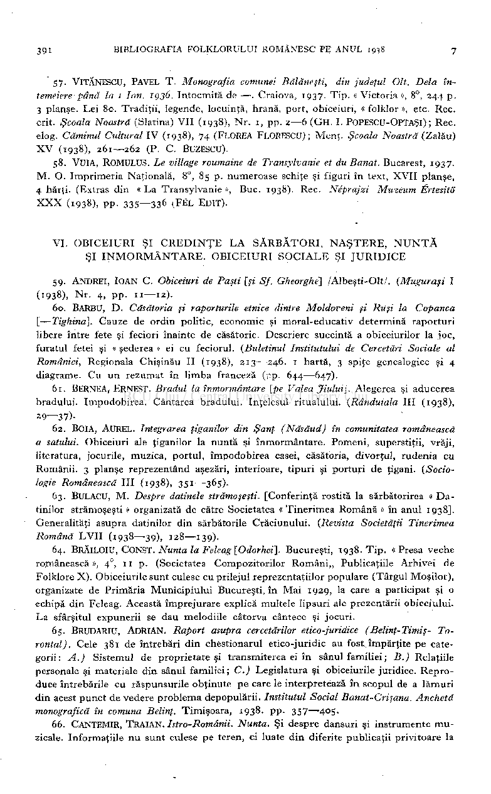

57. VlTĂNESCU, PAVEL T Monografia comunei Bălăneşti, din judeţul Olt. Delà în­

temeiere până la 1 Ian. 1936. întocmită de — . Craiova, 1937. Tip . « Victoria », 8°, 244 p.

- 3 planşe. Lei 80. Tradiţii, legende, locuinţă, hrană, port, obiceiuri, « folklor », etc. Rec. crit. Şcoala Noastră (Slatina) VII (1938), Nr. 1, pp. 2—6 (GH . I. POPESCU-OPTAŞI) ; Rec. elog. Căminul Cultural IV (1938), 74 (FLOREA FLORESCU) ; Menţ. Şcoala Noastră (Zalău) X V (1938), 261—262 (P. C BUZESCU).

58. VUIA, ROMULUS. Le village roumaine de Transylvanie et du Banat. Bucarest, 1937.

M . O. Imprimeria Naţională, 8°, 85 p. numeroase schiţe şi figuri în text, XVI I planşe,

- 4 hărţi. (Extras din « La Transylvanie », Buc. 1938). Rec. Néprajzi Muzéum Értesito XX X (1938), pp. 33S—336 (FÉL EDIT).

VI. OBICEIUR I ŞI CREDINŢ E L A SĂRBĂTORI , NAŞTERE , NUNT Ă ŞI ÎNMORMÂNTARE . OBICEIUR I SOCIAL E ŞI JURIDIC E

- 59. ANDREI, IOAN C Obiceiuri de Paşti [şi Sf. Gheorghe] /Albeşti-Olt/. (Muguraşi I

(1938), Nr. 4, pp. II— 12) .

- 60. BARBU, D Căsătoria şi raporturile etnice dintre Moldoveni şi Ruşi la Copanca

[—Tighina]. Cauze de ordin politic, economic şi moral-educativ determină raporturi libere între fete şi feciori înainte de căsătorie. Descriere succintă a obiceiurilor la joc,

furatul fetei şi « şederea » ei cu feciorul. (Buletinul Institutului de Cercetări Sociale al

României, Regionala Chişinău II (1938), 213—246. 1 hartă, 3 spiţe genealogice şi 4 diagrame. C u un rezumat în limba franceză (pp. 644—647).

61. BERNEA, ERNEST. Bradul la înmormântare [pe Valea Jiului]. Alegerea şi aducerea

bradului. împodobirea. Cântarea bradului. înţelesul ritualului. (Rânduiala III (1938),

29—37)-

62. BOIA, AUREL. Integrarea ţiganilor din Şanţ (Năsăud) în comunitatea românească

a satului. Obiceiuri ale ţiganilor la nunta şi înmormântare. Pomeni, superstiţii, vrăji, literatura, jocurile, muzica, portul, împodobirea casei, căsătoria, divorţul, rudenia cu Românii. 3 planşe reprezentând aşezări, interioare, tipuri şi porturi de ţigani. (Socio­

logie Românească III (1938), 351—365).

- 63. BULACU, M . Despre datinele strămoşeşti. [Conferinţă rostită la sărbătorirea « Da ­

tinilor strămoşeşti » organizată de către Societatea « Tinerimea Română » în anul 1938]. Generalităţi asupra datinilor din sărbătorile Crăciunului. (Revista Societăţii Tinerimea

Română LVII (1938—39), 128—139).

- 64. BRĂILOIU, CONST. Nunta la Feleag [Odorhei]. Bucureşti, 1938. Tip. «Presa veche

, 11 p. (Societatea Compozitorilor Români,, Publicaţiile Arhivei de Folklore X) . Obiceiurile sunt culese cu prilejul reprezentaţiilor populare (Târgul Moşilor), organizate de Primăria Municipiului Bucureşti, în Mai 1929, la care a participat şi o echipă din Feleag. Această împrejurare explică multele lipsuri ale prezentării obiceiului. La sfârşitul expunerii se dau melodiile câtorva cântece şi jocuri.

rornânească », 4

0

65. BRUDARIU, ADRIAN. Raport asupra cercetărilor etico-juridice (Belinţ-Timiş- To-

rontal). Cele 381 de întrebări din chestionarul etico-juridic au fost.împărţite pe categorii: A.) Sistemul de proprietate şi transmiterea ei în sânul familiei ; B.) Relaţiile personale şi materiale din sânul familiei; C.) Legislatura şi obiceiurile juridice. Reproduce întrebările cu răspunsurile obţinute pe care le interpretează în scopul de a lămuri din acest punct de vedere problema depopulării. Institutul Social Banat-Crişana. Anchetă

monografică în comuna Belinţ. Timişoara, 1938. pp 357—405.

66. CANTEMIR, TRAIAN . Istro-Românii. Nunta. Şi despre dansuri şi instrumente muzicale. Informaţiile nu sunt culese pe teren, ci luate din diferite publicaţii privitoare la

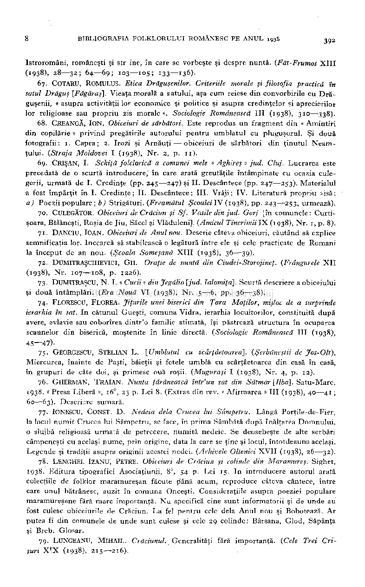

Istroromâni, româneşti şi str ine, în care se vorbeşte şi despre nuntă. (Făt-Frumos XII I

#### (1938), 28—32; 64—69; 103—105; 133—136).

67. COTARU, ROMULUS. Etica Drăguşenilor. Criteriile morale şi filosofia practică în

satul Drăguş [Făgăraş']. Vieaţa morală a satului, aşa cum reiese din convorbirile cu Drăguşenii, « asupra activităţii lor economice şi politice şi asupra credinţelor şi aprecierilor lor religioase sau propriu zis morale ». Sociologie Românească III (1938), 310—338).

68. CREANGĂ, ION Obiceiuri de sărbători. Este reprodus un fragment din « Amintiri din copilărie » privind pregătirile autorului pentru umblatul cu pluguşorul. Şi două fotografii: 1. Capra; 2. Irozi şi Arnăuţi — obiceiuri de sărbători din ţinutul Neam­

#### ţului. (Straja Moldovei I (1938), Nr. 2, p. 11).

69. CRIŞAN, I. Schiţă folclorică a comunei mele « Aghireş » jud. Cluj. Lucrarea este precedată de o scurtă introducere,' în care arată greutăţile întâmpinate cu ocazia culegerii, urmată de I. Credinţe (pp. 245—247) şi II. Descântece (pp. 247—253). Materialul a fost împărţit în I. Credinţe; II. Descântece; III. Vrăji; IV . Literatură propriu ir.isă: a) Poezii populare; b) Strigături. (Freamătul ŞcoaleiXV (1938), pp. 243—253, urmează).

- 70. CULEGĂTOR. Obiceiuri de Crăciun şi Sf. Vasile din jud. Gorj [în comunele: Curti-

şoara, Bălăneşti, Roşia de Jiu, Săcel şi Vlăduleni]. (Amicul TinerimiiIX (1938), Nr. 1, p. 8).

- 71. DANCIU, IOAN Obiceiuri de Anul nou. Descrie câteva obiceiuri, căutând să explice

semnificaţia lor. încearcă să stabilească o legătură între ele şi cele practicate de Romani

la început de an nou. (Şcoala Someşană XIII (1938), 36—39).

- 72. DUMITRAŞCHIEVICI, GH. Oraţie de nuntă din Ciudei-Storojinef. (Frângurele XI I

(1938), Nr. 107—108, p. 1226).

- 73. DUMITRAŞCU, N . I. « Cucii » din Jegălia [jud. Ialomiţa']. Scurtă descriere a obiceiului

şi două întâmplări. (Era Nouă V I (1938), Nr . 5—6, pp. 36—38).

- 74. FLORESCU, FLOREA. Jiţurile unei biserici din Ţara Moţilor, mijloc de a surprinde

ierarhia în sat. In cătunul Gueşti, comuna Vidra, ierarhia locuitorilor, constituită după avere, evlavie sau coborîrea dintr'o familie stimată, îşi păstrează structura în ocuparea scaunelor din biserică, moştenite în linie directă. (Sociologie Românească III (1938), 45—47)-

75. GEORGESCU, STELIAN L [Umblatul cu scârţâetoarea]. (Şerbăneştii de Jos-Olt).

Miercurea, înainte de Paşti, băieţii şi fetele umblă cu scârţâetoarea din casă în casă, în grupuri de câte doi, şi primesc ouă roşii. (Muguraşi I (1938), Nr. 4, p. 12).

76. GHERMAN, TRAIAN Nunta ţărănească într'un sat din Sătmar [Ilba]. Satu-Mare,

1938. « Presa Liberă », 16

, 23 p. Le 8. (Extras din rev. « Afirmarea » III (1938), 40—41 ; 60—63). Descri;re sumară.

0

- 77. IONESCU, CONST D . Nedeia delà Crucea lui Sâmpetru. Lângă Porţile-de-Fier, la locul numit Crucea lui Sâmpetru, se face, în prima Sâmbătă după înălţarea Domnului, o slujbă religioasă urma'ă de petrecere, numită nedeie. Se deosebeşte de alte serbări câmpeneşti cu acelaşi nume, prin origine, data la care se ţine şi locul, întotdeauna acelaşi. Legende şi tradiţii asupra originii acestei nedei. (Arhivele Olteniei XVI I (1938), 26—32).
- 78. LENGHF.L IZANU, PETRE. Obiceiuri de Crăciun şi colinde din Maramureş. Sighet, 1938. Editura tipografiei Asociaţiunii, 8°, 54- p. Lei 15. In introducere autorul arată colecţiile de folklor maramureşan făcute p'ână acum, reproduce câteva cântece, între care unul bătrânesc, auzit în comuna Onceşti. Consideraţiile asupra poeziei populare maramureşene fără mare importanţă. N u specifică cine sunt informatorii şi de unde au fost culese obiceiurile de Crăciun. L a fel pentru cele delà Anul nou şi Bobotează. A r putea fi din comunele de unde sunt culese şi cele 29 colinde: Bârsana, Glod, Săpânţa şi Breb. Glosar.
- 79. LUNGEANU, MlHAIL. Crăciunul. Generalităţi fără importanţă. (Cele Trei Cri-

şuri X

#### X (1938), 215—216).

T

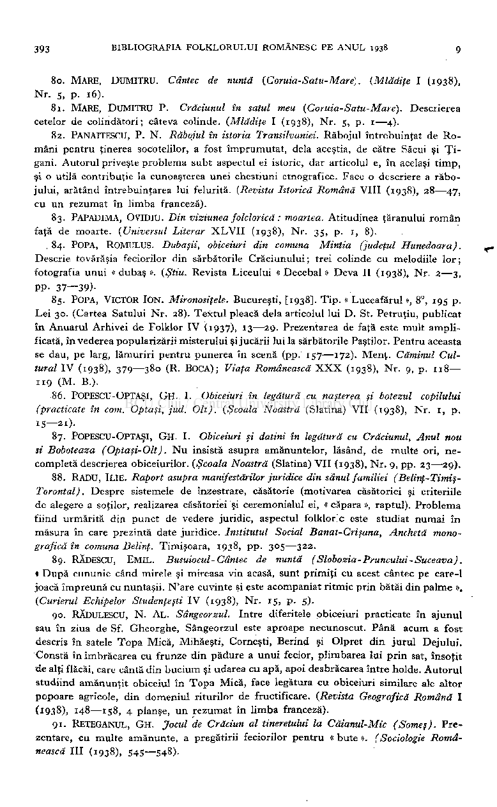

- 80. MARE, DUMITRU. Cântec de nuntă (Coruia-Satu-Mare). (Mlădiţe I (1938),

Nr. 5, P-

- 81. MARE , DUMITRU P. Crăciunul în satul meu (Coruia-Satu-Mare). Descrierea

cetelor de colindători; câteva colinde. (Mlădiţe I (1938), Nr. 5, p. 1—4).

- 82. PANAITESCU, P. N . Răbojul în istoria Transilvaniei. Răbojul întrebuinţat de Ro ­

mâni pentru ţinerea socotelilor, a fost împrumutat, delà aceştia, de către Săcui şi Ţi gani. Autorul priveşte problema subt aspectul ei istoric, dar articolul e, în acelaşi timp, şi o utilă contribuţie la cunoaşterea unei chestiuni etnografice. Face o descriere a răbojului, arătând întrebuinţarea lui felurită. (Revista Istorică Română VIII (1938), 28—47, cu un rezumat în limba franceză).

83. PAPADIMA, OVIDIU. Din viziunea folclorică : moartea. Atitudinea ţăranului român faţă de moarte. (Universul Literar XLVI I (1938), Nr. 35, p. 1, 8).

.84. POPA, ROMULUS. Dubaşii, obiceiuri din comuna Mintia (judeţul Hunedoara).

Descrie tovărăşia feciorilor din sărbătorile Crăciunului ; trei colinde cu melodiile lor ; fotografia unui « dubaş ». (Ştiu. Revista Liceului « Decebal » Deva II (1938), Nr. 2—3,

PP- 37—39)-

85. POPA, VICTO R ION . Mironosiţele. Bucureşti, [1938]. Tip . « Luceafărul », 8°, 195 p. Lei 30. (Cartea Satului Nr. 28). Textul pleacă delà articolul lui D . St. Petruţiu, publicat în Anuarul Arhivei de Folklor IV (1937), 13—29. Prezentarea de faţă este mult amplificată, în vederea popularizării misterului şi jucării lui la sărbătorile Paştilor. Pentru aceasta se dau, pe larg, lămuriri pentru punerea în scenă (pp. 157—172). Menţ. Căminul Cul­

tural I V (1938), 379—380 (R. BOCA); Viaţa Românească XX X (1938), Nr 9, p. 118 119 (M. B.)

- 86. POPESCU-OPTAŞI, GH. I. Obiceiuri în legătură cu naşterea şi botezul copilului

(practicate în corn. Optaşi, jud. Olt). (Şcoala Noastră (Slatina) VII (1938), Nr 1, p. 15—21).

- 87. POPESCU-OPTAŞI, GH. I. Obiceiuri şi datini în legătură cu Crăciunul, Anul nou

si Bobotează (Optaşi-Olt). N u insistă asupra amănuntelor, lăsând, de multe ori, necompletă descrierea obiceiurilor. (Şcoala Noastră (Slatina) VI I (1938), Nr . 9, pp. 23—29).

88. RADU, Iure. Raport asupra manifestărilor juridice din sânul familiei (Belinţ-Timiş-

Torontal). Despre sistemele de înzestrare, căsătorie (motivarea căsătoriei şi criteriile de alegere a soţilor, realizarea căsătoriei şi ceremonialul ei, « căpara », raptul). Problema fiind urmărită din punct de vedere juridic, aspectul folklore este studiat numai în

măsura în care prezintă date juridice. Institutul Social Banat-Crişana, Anchetă monografică în comuna Belinţ. Timişoara, 1938, pp 305—322.

89. RĂDESCU, EMIL. Busuiocul-Cântec de nuntă (Slobozia-Pruncului-Suceava).

« După cununie când mirele şi mireasa vin acasă, sunt primiţi cu acest cântec pe care-1 joacă împreună cu nuntaşii. N'are cuvinte şi este acompaniat ritmic prin bătăi din palme ».

(Curierul Echipelor Studenţeşti I V (1938), Nr 15 p. 5).

90. RĂDULESCU, N . AL Sângeorzul. Intre diferitele obiceiuri practicate în ajunul sau în ziua de Sf. Gheorghe, Sângeorzul este aproape necunoscut. Până acum a fost descris în satele Topa Mică, Mihăeşti, Corneşti, Berind şi Olpret din jurul Dejului. Constă în îmbrăcarea cu frunze din pădure a unui fecior, plimbarea lui prin sat, însoţit de alţi flăcăi, care cântă din bucium şi udarea cu apă, apoi desbrăcarea între holde. Autorul studiind amănunţit obiceiul în Top a Mică, face legătura cu obiceiuri similare ale altor popoare agricole, din domeniul riturilor de fructificare. (Revista Geografică Română I (1938), 148—158, 4 planşe, un rezumat în limba franceză).

- 91. RETEGANUL, GH Jocul de Crăciun al tineretului la Căianul-Mic (Someş). Pre­

zentare, cu multe amănunte, a pregătirii feciorilor pentru « bute ». (Sociologie Româ­

nească III (1938), 545—548).

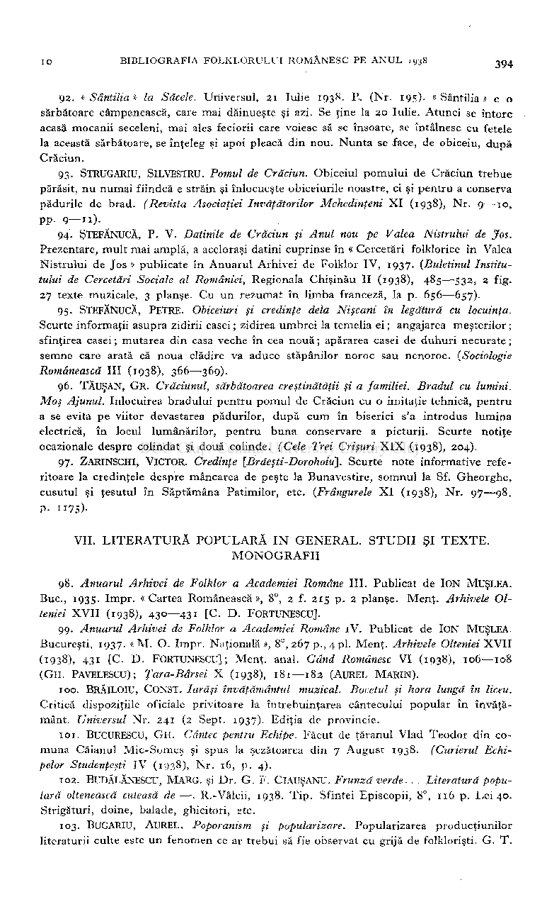

- 92. « Sântilia » la Săcele. Universul, 21 Iulie 1938. P, (Nr. 195). « Sântilia 1) e o

sărbătoare câmpenească, care mai dăinueşte şi azi. Se ţine la 20 Iulie. Atunci se întorc acasă mocanii seceleni, mai ales feciorii care voiesc să se însoare, se întâlnesc cu fetele la această sărbătoare, se înţeleg şi apoi pleacă din nou. Nunta se face, de obiceiu, după Crăciun.

93. STRUGARIU, SILVESTRU. Pomul de Crăciun. Obiceiul pomului de Crăciun trebue părăsit, nu numai fiindcă e străin şi înlocueşte obiceiurile noastre, ci şi pentru a conserva

pădurile de brad. (Revista Asociaţiei învăţătorilor Mehedinţeni X I (1938), Nr. 9—10, pp. 9—11).

94. ŞTEFĂNUCĂ, P. V Datinile de Crăciun şi Anul nou pe Valea Nistrului de Jos.

Prezentare, mult mai amplă, a aceloraşi datini cuprinse în « Cercetări folklorice în Valea Nistrului de Jos » publicate în Anuarul Arhivei de Folklor IV , 1937. (Buletinul Institu­

#### tului de Cercetări Sociale al României, Regionala Chişinău II (1938), 485—532, 2 fig.

27 texte muzicale, 3 planşe. Cu un rezumat în limba franceză, Ia p. 656—657).

95. ŞTEFĂNUCĂ, PETRE. Obiceiuri şi credinţe delà Nişcani în legătură cu locuinţa.

Scurte informaţii asupra zidirii casei ; zidirea umbrei la temelia ei ; angajarea meşterilor ; sfinţirea casei ; mutarea din casa veche în cea nouă ; apărarea casei de duhuri necurate ; semne care arată că noua clădire va aduce stăpânilor noroc sau nenoroc. (Sociologie

#### Românească III (1938), 366—369).

96. TĂUŞAN, GR Crăciunul, sărbătoarea creştinătăţii şi a familiei. Bradul cu lumini.

Moş Ajunul. înlocuirea bradului pentru pomul de Crăciun cu o imitaţie tehnică, pentru a se evita pe viitor devastarea pădurilor, după cum în biserici s'a introdus lumina electrică, în locul lumânărilor, pentru buna conservare a picturii. Scurte notiţe ocazionale despre colindat şi două colinde. (Cele Trei Crişuri XI X (1938), 204).

- 97. ZARINSCHI, VICTOR . Credinţe [Brăeşti-Dorohoiu]. Scurte note informative refe­

ritoare la credinţele despre mâncarea de peşte la Bunavestire, somnul la Sf. Gheorghe, cusutul şi ţesutul în Săptămâna Patimilor, etc. (Frângurele X I (1938), Nr . 97—98,

P- "75) -

VII. LITERATUR Ă POPULAR Ă I N GENERAL . STUDI I ŞI TEXTE . MONOGRAFI I

- 98. Anuarul Arhivei de Folklor a Academiei Române III. Publicat de ION MUŞLEA.

Buc , 1935. Impr. « Cartea Românească », 8°, 2 f. 215 p. 2 planşe. Menţ. Arhivele Ol­

#### teniei XVII (1938), 430—431 [C. D FORTUNESCU].

99. Anuarul Arhivei de Folklor a Academiei Române iV . Publicat de ION MUŞLEA.

Bucureşti, 1937. « M . O . Impr. Naţională», 8°, 267 p., 4 pl. Menţ. Arhivele Olteniei XVI I

#### (1938), 431 [C. D FORTUNESCU]; Menţ. anal. Gând Românesc V I (1938), 106—108 (GH. PAVELESCU); Ţara-Bărsei X (1938), 181—182 (AUREL MARIN).

100. BRĂILOIU, CONST. Iarăşi învăţământul muzical. Bocetul şi hora lungă în liceu.

Critică dispoziţiile oficiale privitoare la întrebuinţarea cântecului popular în învăţământ. Universul Nr. 241 (2 Sept. 1937). Ediţia de provincie.

101. BUCURESCU, GH Cântec pentru Echipe. Făcut de ţăranul Vlad Teodor din comuna Căianul Mic-Someş şi spus la şezătoarea din 7 August 1938. (Curierul Echi­

#### pelor Studenţeşti I V (1938), Nr. 16, p 4).

102. BlIDĂLĂNESCU, MARG. şi Dr. G . F. ClAUŞANU. Frunză verde. . . Literatură popu­

#### lară oltenească culeasă de—. R.-Vâlcii, 1938. Tip. Sfintei Episcopii, 8°, 116 p. Lei 40.

Strigături, doine, balade, ghicitori, etc.

103. BUGARIU, AUREL. Poporanism şi popularizare. Popularizarea producţiunilor

literaturii culte este un fenomen ce ar trebui să fie observat cu grijă de folklorişti. G . T .

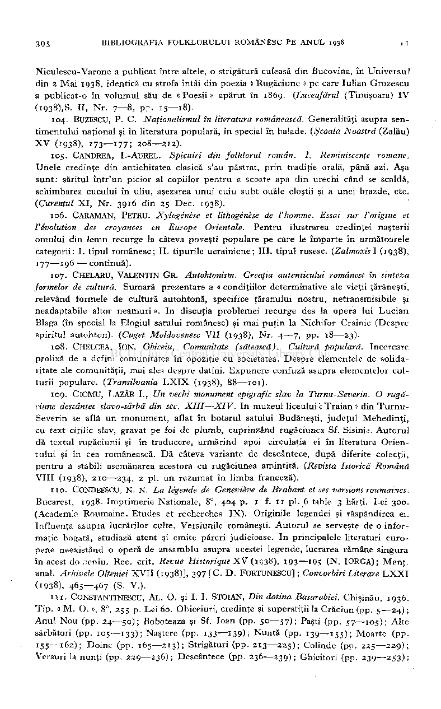

Niculescu-Varone a publicat între altele, o strigătură culeasă din Bucovina, în Universul din 2 Ma i 1938, identică cu strofa întâi din poezia « Rugăciune » pe care Iulian Grozescu a publicat-o în volumul său de « Poesii » apărut în 1869. (Luceafărul (Timişoara) I V

(I938),S. II, Nr 7—8, pr- 15—18)

- 104. BUZESCU, P. C . Naţionalismul în literatura românească. Generalităţi asupra sen­

timentului naţional şi în literatura populară, în special în balade. (Şcoala Noastră (Zalău)

XV (1938), 173—177; 208—212).

- 105. CANDREA, I.-AUREL. Spicuiri din folklorul român. I. Reminiscenţe romane.

Unele credinţe din antichitatea clasică s'au păstrat, prin tradiţie orală, până azi. Aşa sunt: săritul într'un picior al copiilor pentru a scoate apa din urechi când se scaldă, schimbarea cucului în uliu, aşezarea unui cuiu subt ouăle cloştii şi a unei brazde, etc.

(Curentul XI, Nr 3916 din 25 Dec. 1938).

106. CARAMAN, PETRU. Xylogénèse et lithogénèse de l'homme. Essai sur l'origine et l'évolution des croyances en Europe Orientale. Pentru ilustrarea credinţei naşterii

omului din lemn recurge la câteva poveşti populare pe care le împarte în următoarele categorii: I. tipul românesc; II. tipurile ucrainiene; III. tipul rusesc. (ZalmoxisI (1938), 177—196 — continuă).

107. CHELARU, VALENTIN GR Autohtonism. Creaţia autenticului românesc în sinteza

formelor de cultură. Sumară prezentare a « condiţiilor determinative ale vieţii ţărăneşti, relevând formele de cultură autohtonă, specifice ţăranului nostru, netransmisibile şi neadaptabile altor neamuri ». In discuţia problemei recurge des la opera lui Lucian Blaga (în special la Elogiul satului românesc) şi mai puţin la Nichifor Crainic (Despre

spiritul autohton). (Cuget Moldovenesc VI (1938), Nr. 4—7, pp. 18—23).

108. CHELCEA, ION. Obiceiu, Comunitate (sătească). Cultură populară. încercare

prolixă de a defini comunitatea în opoziţie cu societatea. Despre elementele de solidaritate ale comunităţii, mai ales despre datini. Expunere confuză asupra elementelor culturii populare. (Transilvania LXI X (1938), 88—101).

109. ClOMU, LAZĂR I., Un vechi monument epigrafic slav la Turnu-Severin. O rugăciune descântec slavo-sărbă din sec. XIII—XIV. In muzeul liceului « Traian » din Turnu-

Severin se află un monument, aflat în hotarul satului Budăneşti, judeţul Mehedinţi, cu text cirilic slav, gravat pe foi de plumb, cuprinzând rugăciunea Sf. Sisinie. Autorul dă textul rugăciunii şi în traducere, urmărind apoi circulaţia ei în literatura Orientului şi în cea românească. D ă câteva variante de descântece, după diferite colecţii, pentru a stabili asemănarea acestora cu rugăciunea amintită. (Revista Istorică Română VIII (1938), 210—234, 2 pl. un rezumat în limba franceză).

no . CONDEESCU, N. N. La légende de Geneviève de Brabant et ses versions roumaines.

Bucarest, 1938. Imprimerie Nationale, 8°, 404 p. 1 f. n pl. 6 table 3 hărţi. Lei 300. (Academie Roumaine. Etudes et recherches IX) . Originile legendei şi răspândirea ei. Influenţa asupra lucrărilor culte. Versiunile româneşti. Autorul se serveşte de o informaţie bogată, studiază atent şi emite păreri judicioase. In principalele literaturi europene neexistând o operă de ansamblu asupra acestei legende, lucrarea rămâne singura în acest do neniu. Rec. crit. Revue Historique X V (1938), 193—195 (N. IORGA); Menţ.

anal. Arhivele Olteniei XVII (1938)], 397 [C. D FORTUNESCU] ; Convorbiri Literare LXX

(1938), 465—467 (S. V.) iii . CONSTANTINESCU, AL. O . şi I. I. STOIAN, Din datina Basarabiei. Chişinău, 1936.

Tip. « M . O . », 8°, 255 p. Lei 60. Obiceiuri, credinţe şi superstiţii la Crăciun (pp. 5—24) ; Anul Nou (pp. 24—50); Bobotează şi Sf. Ioan (pp. 50—57) Paşti (pp. 57—105); Alte sărbători (pp. 105—133); Naştere (pp. 133—139); Nuntă (pp. 139—155); Moarte (pp. 155—162); Doine (pp. 165—213); Strigături (pp. 213—225) Colinde (pp. 225—229); Versuri la nunţi (pp. 229—236); Descântece (pp. 236—239); Ghicitori (pp. 239—253);

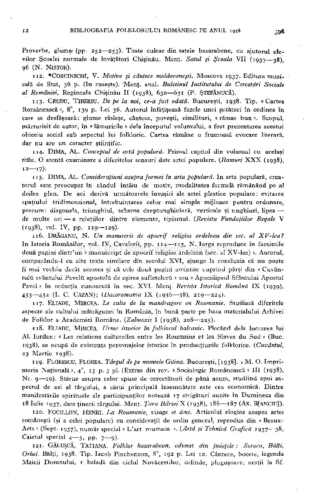

Proverbe, glume (pp. 252—253). Toate culese din satele basarabene, cu ajutorul elevilor Şcoalei normale de învăţători Chişinău. Menţ. Satul şi Şcoala VI I (1937—38), 96 (N. NlSTOR).

- 112. *CORCINSCHI, V Motive şi cântece moldoveneşti. Moscova 1937. Editura muzi­

cală de Stat, 36 p. (In ruseşte). Menţ. anal. Buletinul Institutului de Cercetări Sociale

al României, Regionala Chişinău II (1938), 630—631 (P. ŞTEFĂNUCĂ).

- 113. CRUDU, TlBERIU. De pe la noi, ce-a fost odată. Bucureşti, 1938. Tip . «Cartea

Românească », 8°, 139 p. Lei 36. Autorul înfăţişează fazele unei şezători în ordinea în care se desfăşoară: glume răsleţe, cântece, poveşti, cimilituri, « rămas bun ». Scopul, mărturisit de autor, în « lămuririle » delà începutul volumului, a fost prezentarea acestui obiceiu social sub aspectul lui folkloric. Cartea rămâne o frumoasă evocare literară, dar nu are un caracter ştiinţific.

114. DlMA, AL Conceptul de artă populară. Primul capitol din volumul cu acelaşi titlu. O atentă examinare a diferitelor sensuri date artei populare. (Ramuri XX X (1938),

12—17).

115. DlMA, AL. Consideraţiuni asupra formei în arta populară. In arta populară, crea­

torul este preocupat în rândul întâiu de motiv, modalitatea formală rămânând pe al doilea plan. D e aci derivă următoarele însuşiri ale artei plastice populare: evitarea spaţiului tridimensional, întrebuinţarea celor mai simple mijloace pentru ordonare, precum; diagonala, triunghiul, schema dreptunghiulară, verticale şi unghiuri, lipsa de multe ori — a relaţiilor dintre elemente, tipismul. (Revista Fundaţiilor Regale V

(1938), vol. IV, pp 119—129).

116. DRĂGANU, N . Un manuscris de apocrif religios ardelean din sec. al XV-lea?

In Istoria Românilor, vol. IV, Cavalerii, pp. 114—115 , N . Iorga reproduce în facsimile două pagini dintr'un « manuscript de apocrif religios ardelean (sec. al XV-lea) ». Autorul, comparându-1 cu alte texte similare din secolul XVI , ajunge la concluzia că nu poate fi mai vechiu decât acestea şi că cele două pagini amintite cuprind părţi din « Cuvântulü svântului Pavelü apostolü de eşirea sufletelorü » sau « Apocalipsul Sfântului Apostol Pavel» în redacţia cunoscută în sec. XVI . Menţ. Revista Istorică Română I X (1939),

453—454 (I- C CAZAN); (Dacoromania I X (1936—38), 219—224).

117. ELIADE, MlRCEA. Le culte de la mandragore en Roumanie. Studiază diferitele

aspecte ale cultului mătrăgunei în România, în bună parte pe baza materialului Arhivei de Folklor a Academiei Române. (Zalmoxis I (1938), 208—225).

118. ELIADE, MlRCEA. Urme istorice în folklorul balcanic. Plecând delà lucrarea lui

Al. Iordan : « Les relations culturelles entre les Roumains et les Slaves du Sud » (Bue. 1938), se ocupă de existenţa personajelor istorice în producţiunile folklorice. (Cuvântul, 23 Martie 1938).

119. FLORESCU, FLOREA. Târgul de pe muntele Găina. Bucureşti, [1938]. « M . O. Impri­

, 15 p. 3 pl. (Extras din rev. « Sociologie Românească» III (1938), Nr. 9—10). Stărue asupra celor spuse de cercetătorii de până acum, studiind apoi aspectul de azi al târgului, a cărui principală însemnătate este cea economică. Dintre manifestările spirituale ale participanţilor notează 17 strigături auzite în Dumineca din 18 Iulie 1937, data ţinerii târgului. Menţ. Ţara Bărsei X (1938), 186—187 (Ax. BfANCIU]).

meria Naţională», 4

0

- 120. FOCILLON, HENRI. La Roumanie, visage et âme. Articolul elogios asupra artei româneşti (şi a celei populare) cu consideraţii de ordin general, reprodus din « BeauxArts » (Sept. 1937), număr speciai « L'art roumain ». (Artă şi Tehnică Grafică 1937—38, Caietul special 4—5, pp. 7—9).
- 121. GĂLUŞCĂ, TATIANA. Folklor basarabean, adunat din judeţele: Soroca, Bălţi,

Orhei. Bălţi, 1938. Tip . Iacob Pinchenzon, 8°, 192 p. Lei 10. Cântece, bocete, legenda Maicii Domnului, 1 baladă din ciclul Novăceştilor, colinde, pluguşoare, oraţii la Sf.

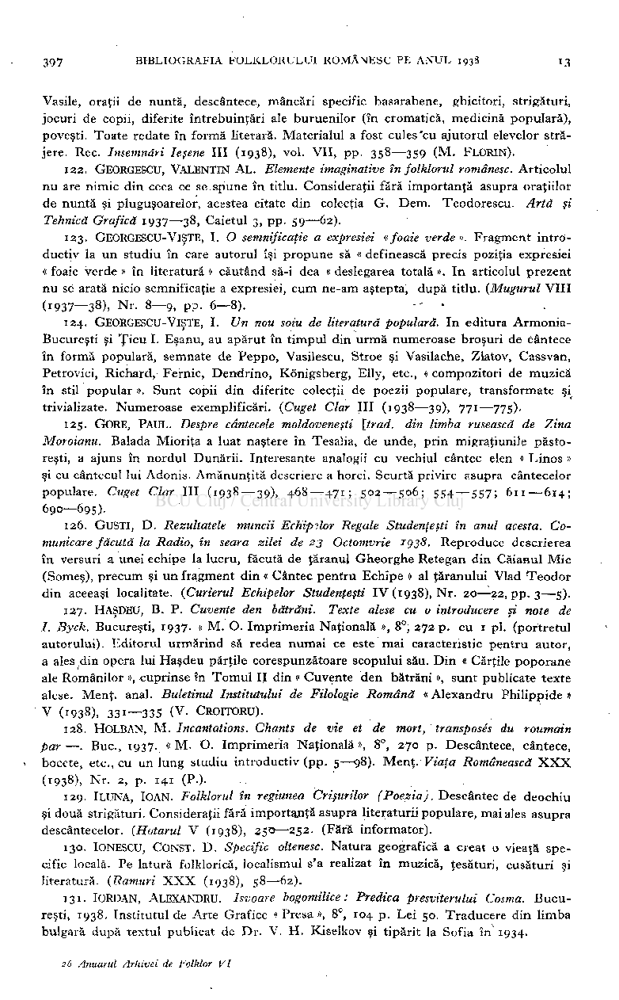

Vasile, oraţii de nuntă, descântece, mâncări specific basarabene, ghicitori, strigături, jocuri de copii, diferite întrebuinţări ale buruenilor (în cromatică, medicină populară), poveşti. Toate redate în formă literară. Materialul a fost cules'cu ajutorul elevelor stră-

jere. Rec. însemnări Ieşene III (1938), vol. VII, pp 358—359 (M FLORIN).

122. GEORGESCU, VALENTIN AL . Elemente imaginative în folklorul românesc. Articolul

nu are nimic din ceea ce se spune în titlu. Consideraţii fără importanţă asupra oraţiilor de nuntă şi pluguşoarelor, acestea citate din colecţia G. Dem. Teodorescu. Artă şi

Tehnică Grafică 1937—38, Caietul 3, pp. 59—62).

123. GEORGESCU-VlŞTE, I. O semnificaţie a expresiei «foaie verde ». Fragment intro­

ductiv la un studiu în care autorul îşi propune să « definească precis poziţia expresiei « foaie verde » în literatură » căutând să-i dea « deslegarea totală ». In articolul prezent nu se arată nicio semnificaţie a expresiei, cum ne-am aştepta, după titlu. (Mugurul VIII

(1937—38), Nr 8—9, pp. 6—8). - •

124. GEORGESCU-VlŞTE, I. Un nou soiu de literatură populară. In editura Armonia-

Bucureşti şi Ţicu I. Eşanu, au apărut în timpul din urmă numeroase broşuri de Cântece în formă populară, semnate de Peppo, Vasilescu, Stroe şi Vasilache, Zlatov, Cassvan, Petrovici, Richard, Fernic, Dendrino, Königsberg, Elly, etc., « compozitori de muzică în stil popular ». Sunt copii din diferite colecţii de poezii populare, transformate şi

#### trivializate. Numeroase exemplificări. (Cuget Clar III (1938—39), 771—775).

125. GORE, PAUL. Despre cântecele moldoveneşti [trad. din limba rusească de Zina

Moroianu. Balada Mioriţa a luat naştere în Tesalia, de unde, prin migraţiunile păstoreşti, a ajuns în nordul Dunării. Interesante analogii cu vechiul cântec elen « Linos » şi cu cântecul lui Adonis. Amănunţită descriere a horei. Scurtă privire asupra cântecelor

populare. Cuget Clar III (1938 — 39), 468—471; 502 — 506; 554—557; 611—614 ; 690—695).

126. GUŞTI, D . Rezultatele muncii Echipûor Regale Studenţeşti în anul acesta. Comunicare făcută la Radio, în seara zilei de 23 Octomvrie 1938. Reproduce descrierea

în versuri a unei echipe la lucru, făcută de ţăranul Gheorghe Retegan din Căianul Mi c (Someş), precum şi un fragment din « Cântec pentru Echipe » al ţăranului Vlad Teodor

din aceeaşi localitate. (Curierul Echipelor Studenţeşti I V (1938), Nr. 20—22, pp. 3—5). 127. HAŞDEU, B. P. Cuvente den bătrâni. Texte alese cu o introducere şi note de

I. Byck. Bucureşti, 1937. « M . O . Imprimeria Naţională », 8°, 272 p. cu 1 pl. (portretul autorului). F.ditorul urmărind să redea numai ce este mai caracteristic pentru autor, a ales din opera lui Haşdeu părţile corespunzătoare scopului său. Din « Cărţile poporane ale Românilor », cuprinse în Tomul II din « Cuvente den bătrâni », sunt publicate texte alese. Menţ. anal. Buletinul Institutului de Filologie Română « Alexandru Philîppide »

V (1938), 331—335 (V. CROITORU).

128. HOLBAN, M Incantations. Chants de vie et de mort, transposés du roumain

par—. Bue , 1937. «M . O. Imprimeria Naţională», 8°, 270 p. Descântece, cântece, 1 bocete, etc., cu un lung studiu introductiv (pp. 5—98). Menţ. Viaţa Românească XX X

- (1938), Nr 2, p. 141 (P.)-

129. ILUNA, IOAN. Folklorul în regiunea Crişurilor (Poezia). Descântec de deochiu

şi două strigături. Consideraţii fără importanţă asupra literaturii populare, mai ales asupra

descântecelor. (Hotarul V (1938), 350—252. (Fără informator).

130. IONESCU, CONST. D . Specific oltenesc. Natura geografică a creat o vieaţă specific locală. Pe latură folklorică, localismul s'a realizat în muzică, ţesături, cusături şi

literatură. (Ramuri XX X (1938), 58—62).

131. IORDAN, ALEXANDRU. Isvoare bogomilice: Predica presviterului Cosma. Bucu­

reşti, 1938. Institutul de Arte Grafice « Presa », 8°, 104 p. Lei 50. Traducere din limba bulgară după textul publicat de Dr. V. H . Kiselkov şi tipărit la Sofia în 1934.

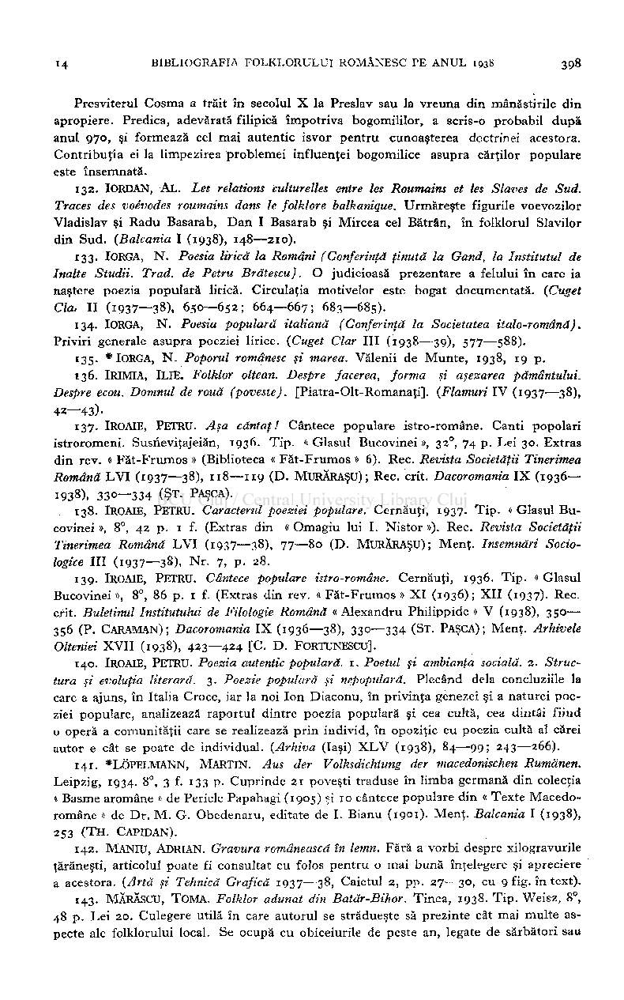

Presviterul Cosma a trăit în secolul X la Preslav sau la vreuna din mănăstirile din apropiere. Predica, adevărată filipică împotriva bogomililor, a scris-o probabil după anul 970, şi formează cel mai autentic isvor pentru cunoaşterea doctrinei acestora. Contribuţia ei la limpezirea problemei influenţei bogomilice asupra cărţilor populare este însemnată.

132. IORDAN, AL. ie s relations culturelles entre les Roumains et les Slaves de Sud. Traces des voévodes roumains dans le folklore balkanique. Urmăreşte figurile voevozilor

Vladislav şi Radu Basarab, Da n I Basarab şi Mircea cel Bătrân, în folklorul Slavilor

din Sud. (Balcania I (1938), 148—210).

133. IORGA, N . Poesia lirică la Români (Conferinţă ţinută la Gand, la Institutul de înalte Studii. Trad. de Petru Brătescu). O judicioasă prezentare a felului în care ia

naştere poezia populară lirică. Circulaţia motivelor este bogat documentată. (Cuget

Cla, II (1937—38), 650—652; 664—667; 683—685).

- 134. IORGA, N Poesia populară italiană (Conferinţă la Societatea italo-romănă).

Priviri generale asupra poeziei lirice. (Cuget Clar III (1938—39), 577—588).

- 135. * IORGA, N . Poporul românesc şi marea. Vălenii de Munte, 1938, 19 p.
- 136. IRIMIA, ILIE. Folklor oltean. Despre facerea, forma şi aşezarea pământului.

Despre ecou. Domnul de rouă (poveste). [Piatra-Olt-Romanaţi]. (Flamuri IV (1937—38), 42—43).

- 137. IROAIE, PETRU. Aşa cântat! Cântece populare istro-române. Canti popolari

istroromeni. Susneviţajeiăn, 1936. Tip . « Glasul Bucovinei », 32

, 74 p. Lei 30. Extras

0

din rev. « Făt-Frumos » (Biblioteca « Făt-Frumos » 6). Rec. Revista Societăţii Tinerimea Română LV I (1937—38), 118—119 (D . MURĂRAŞU) ; Rec. crit. Dacoromania I X (1936—

1938), 330—334 (ŞT . PASCA).

138. IROAIE, PETRU. Caracterul poeziei populare. Cernăuţi, 1937. Tip . « Glasul Bucovinei », 8°, 42 p. 1 f. (Extras din « Omagiu lui I. Nistor »). Rec. Revista Societăţii

Tinerimea Română LV I (1937—38), 77—80 (D MURĂRAŞU) ; Menţ. însemnări Sociologice III (1937—38), Nr 7, p. 28.

139. IROAIE, PETRU. Cântece populare istro-române. Cernăuţi, 1936. Tip . « Glasul Bucovinei », 8°, 86 p. 1 f. (Extras din rev. « Făt-Frumos » X I (1936); XI I (1937). Rec.

crit. Buletinul Institutului de Filologie Română «Alexandru Philippide » V (1938), 350—

356 (P. CARAMAN) ; Dacoromania I X (1936—38), 330—334 (ST. PASCA) ; Menţ. Arhivele Olteniei XVI I (1938), 423—424 [C. D . FORTUNESCU].

140. IROAIE, PETRU. Poezia autentic populară. 1. Poetul şi ambianţa socială. 2. Structura şi evoluţia literară. 3. Poezie populară şi nepopulară. Plecând delà concluziile la

care a ajuns, în Italia Croce, iar la noi Ion Diaconu, în privinţa genezei şi a naturei poeziei populare, analizează raportul dintre poezia populară şi cea cultă, cea dintâi fiind o operă a comunităţii care se realizează prin individ, în opoziţie cu poezia cultă al cărei autor e cât se poate de individual. (Arhiva (Iaşi) XL V (1938), 84—99; 243—266).

141. *LÖPELMANN, MARTIN. AUS der Volksdichtung der macedonischen Rumänen.

Leipzig, 1934. 8°, 3 f. 133 p. Cuprinde 21 poveşti traduse în limba germană din colecţia « Basme aromâne » de Pericle Papahagi (1905) şi 10 cântece populare din « Texte Macedoromâne » de Dr. M . G . Obedenaru, editate de I. Bianu (1901). Menţ. Balcania I (1938), 253 (TH CAPIDAN) .

- 142. MANIU , ADRIAN . Gravura românească în lemn. Fără a vorbi despre xilogravurile

ţărăneşti, articolul poate fi consultat cu folos pentru o mai bună înţelegere şi apreciere

a acestora. (Artă şi Tehnică Grafică 1937—38, Caietul 2, pp 27—30, cu 9 fig. în text).

- 143. MĂRĂSCU, TOMA . Folklor adunat din Batăr-Bihor. Tinea, 1938. Tip . Weisz, 8°,

###### 8 p. Lei 20. Culegere utilă în care autorul se strădueşte să prezinte cât mai multe aspecte ale folklorului local. Se ocupă cu obiceiurile de peste an, legate de sărbători sau

4

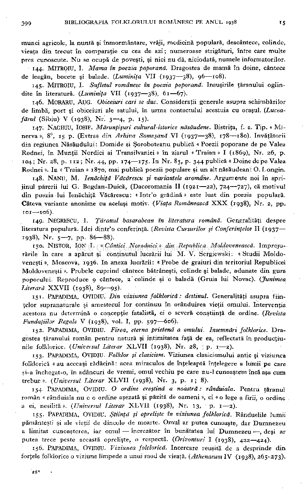

munci agricole, la nuntă şi înmormântare, vrăji, medicină populară, descântece, colinde, vieaţa din trecut în comparaţie cu cea de azi ; numeroase strigături, între care multe prea cunoscute. N u se ocupă de poveşti, şi nici nu dă, niciodată, numele informatorilor.

- 144. MlTROIU, I. Mama în poezia poporană. Dragostea de mamă în doine, cântece

de leagăn, bocete şi balade. (Luminiţa VI I (1937—38), 96—108).

- 145. MlTROIU, I. Sufletul românesc în poezia poporană. însuşirile ţăranului oglin­

dite în literatură. (Luminiţa VI I (1937—38), 61—67).

- 146. MORARU, AUG. Obiceiuri cari se duc. Consideraţii generale asupra schimbărilor

de limbă, port şi obiceiuri ale satului, în urma contactului acestuia cu oraşul. (Luceafărul (Sibiu) V (1938), Nr: 3—4, p. 15).

- 147: NAGHIU, IOSIF. Mărunţişuri cultural-istorice năsăudene. Bistriţa, f. a. Tip . « Mi nerva », 8°, 15 p. (Extras din Arhiva Someşană V I (1937—38), 178—180). învăţătorii din regiunea Năsăudului : Domide şi Şoroboteanu publică « Poezii poporane de pe Valea Rodnei, în Munţii Nordici ai Transilvaniei » în ziarul « Traian » I (1869), Nr. 26, p. 104 ; Nr. 28, p. 112 ; Nr. 44, pp. 174—175. In Nr. 85, p. 344 publică « Doine de pe Valea Rodnei ». In « Traian » 1870, mai publică poezii populare şi un alt năsăudean: O. I.ongin.
- 148. NANU, M . lenăchiţă Văcărescu şi variantele aromâne. Argumente noi în sprijinul părerii lui G . Bogdan-Duică, (Dacoromania II (1921—22), 724—727), că motivul din poezia lui lenăchiţă Văcărescu : « într'o grădină » este luat din poezia populară. Câteva variante anonime cu acelaşi motiv. (Viaţa Românească XX X (1938), Nr. 2, pp. 101—-106).
- 149. NEGRESCU, I. Ţăranul basarabean în literatura română. Generalităţi despre literatura populară. Idei dintr'o conferinţă. (Revista Cursurilor şi Conferinţelor II (19371938), Nr. s—7, pp. 86—88).
- 150. NlSTOR, ION I. « C'antici Narodnici» din Republica Moldovenească. împreju­

- rările în care a apărut şi conţinutul lucrării lui M . V . Sergiewski: « Studii Moldoveneşti », Moscova, 1936. In anexa lucrării: « Probe de graiuri din teritoriul Republicei Moldoveneşti ». Probele cuprind cântece bătrâneşti, colinde şi balade, adunate din gura poporului. Reproduce 9 cântece, 2 colinde şi o baladă (Gruia lui Novac). (Junimea Literară XXVI I (1938), 89—95).

- 151. PAPADIMA, OVIDIU. Din viziunea folklorică : destinul. Generalităţi asupra fiinţelor supranaturale şi amestecul lor continuu în orânduirea vieţii omului. Intervenţia acestora nu determină o concepţie fatalistă, ci o severă conştiinţă de ordine. (Revista Fundaţiilor Regale V (1938), vol. I, pp. 597—606).
- 152. PAPADIMA, OVIDIU. Firea, eterna prietenă a omului. însemnări folklorice. Dragostea ţăranului român pentru natură şi intimitatea faţă de ea, reflectată în producţiunile folklorice. (Universul Literar XLVI I (1938), Nr. z8, p. 1—2).
- 153. PAPADIMA, OVIDIU. Folklor şi clasicism. Viziunea clasicismului antic şi viziunea folklorică «au aceeaşi rădăcină: acea miraculos de înţeleaptă înţelegere a lumii pe care şi-a închegat-o, în adâncuri de vremi, omul vechiu pe care nu-1 cunoaştem încă aşa cum trebue». (Universul Literar XLVI I (1938), Nr. 3, p. 1; 8).
- 154. PAPADIMA, OVIDIU. O ordine creştină a noastră: rânduiala. Pentru ţăranul

român « rânduiala nu e o ordine aşezată şi păzită de oameni », ci « o lege a firii, o ordine a ei, nesilită». (Universul Literar XLVI I (1938), Nr. 13, p. 1—2).

- 155. PAPADIMA, OVIDIU. Ştiinţă şi oprelişte în viziunea folklorică. Rânduelile lumii

pământeşti şi ale vieţii de dincolo de moarte. Omul ar putea cunoaşte, dar Dumnezeu a limitat cunoaşterea, iar omul — încrezător în bunătatea lui Dumnezeu — , deşi ar putea trece peste această oprelişte, o respectă. (Orizonturi I (1938), 422—424).

156. PAPADIMA, OVIDIU. Viziunea folclorică. încercare reuşită de a desprinde din forţele folklorice o viziune limpede a unui mod de vieaţă. (Athenaeum I V (1938), 265-273).

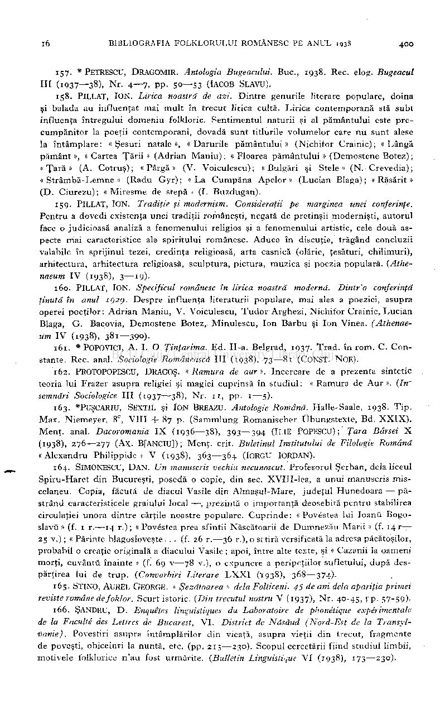

- 157. * PETRESCU, DRAGOMIR. Antologia Bugeacului. Buc , 1938. Rec. elog. Bugeacul

III (1937—38), Nr. 4—7, pp. SO—53 (IACOB SLAVU).

- 158. PILLAT, ION. Lirica noastră de azi. Dintre genurile literare populare, doina şi balada au influenţat mai mult în trecut lirica cultă. Lirica contemporană stă subt influenţa întregului domeniu folkloric. Sentimentul naturii şi al pământului este precumpănitor la poeţii contemporani, dovadă sunt titlurile volumelor care nu sunt alese la întâmplare: « Şesuri natale», «Darurile pământului» (Nichifor Crainic); «Lângă pământ », « Cartea Ţării » (Adrian Maniu) ; « Floarea pământului » (Demostene Botez) ; «Ţară » (A. Cotruş); « Pârgă » (V. Voiculescu); «Bulgări şi Stele» (N. Crevedia); « Strâmbă-Lemne » (Radu Gyr) ; «L a Cumpăna Apelor» (Lucian Blaga); «Răsărit» (D. Ciurezu); « Miresme de stepă •> (I. Buzdugan).
- 159. PILLAT, ION. Tradiţie şi modernism. Consideraţii pe marginea unei conferinţe. Pentru a dovedi existenţa unei tradiţii româneşti, negată de pretinşii modernişti, autorul face o judicioasă analiză a fenomenului religios şi a fenomenului artistic, cele două aspecte mai caracteristice ale spiritului românesc. Aduce în discuţie, trăgând concluzii valabile în sprijinul tezei, credinţa religioasă, arta casnică (olărie, ţesături, chilimuri), arhitectura, arhitectura religioasă, sculptura, pictura, muzica şi poezia populară. (Athenaeum I V (1938), 3—19).
- 160. PILLAT, ION. Specificul românesc în lirica noastră modernă. Dintr'o conferinţă

ţinută în anul 192c. Despre influenţa literaturii populare, mai ales a poeziei, asupra operei poeţilor: Adrian Maniu, V. Voiculescu, Tudor Arghezi, Nichifor Crainic, Lucian Blaga, G . Bacovia, Demostene Botez, Minulescu, Ion Barbu şi Ion Vinea. (Athenae-

um I V (1938), 381—390).

- 161. * POPOVICI, A . I. O Ţinţarima. Ed . II-a. Belgrad, 1937. Trad. în rom. C . Con­

stante. Rec. anal. Sociologie Românească III (1938), 73—81 (CONST. NOE).

- 162. PROTOPOPESCU, DRAGOŞ. « Ramura de aur ». încercare de a prezenta sintetic

teoria Iui Frazer asupra religiei şi magiei cuprinsă în studiul: « Ramura de Aur ». (In~

semnări Sociologice III (1937—38), Nr. n , pp. 1—5).

163. *PUŞCARIU, SEXTIL şi ION BREAZU. Antologie Română. Halle-Saale, 1938. Tip

Max. Niemeyer, 8°, VIII + 87 p. (Sammlung Romanischer Übungstexte, Bd. XXIX) .

Menţ. anal. Dacoromania I X (1936—38), 393—394 (Il.IE POPESCU) ; Ţara Bărsei X (1938), 276—277 (Ax. BfANCIU]); Menţ. crit. Buletinul Institutului de Filologie Română

«Alexandru Philippide » V (1938), 363—364 (IORGU IORDAN).

164. SlMONESCU, DAN. Un manuscris vechia necunoscut. Profesorul Şerban, delà liceul Spiru-Haret din Bucureşti, posedă o copie, din sec. XVIII-lea, a unui manuscris miscelaneu. Copia, făcută de diacul Vasile din Almaşul-Mare, judeţul Hunedoara — păstrând caracteristicele graiului local — , prezintă o importanţă deosebită pentru stabilirea circulaţiei unora dintre cărţile noastre populare. Cuprinde: «Povestea lui Ioanü Bogoslavü » (f. i r.—-14 r.) ; « Povestea prea sfinţii Născătoarii de Dumnezău Marii » (f. 14 r25 v.) ; « Părinte blagosloveşte... (f. 26 r.—36 r.), o sttiră versificată la adresa păcătoşilor, probabil o creaţie originală a diacului Vasile ; apoi, între alte texte, şi « Cazanii la oameni morţi, cuvântu înainte » (f. 69 v—78 v.), o expunere a peripeţiilor sufletului, după des­

părţirea lui de trup. (Convorbiri Literare LXX I (1938), 368—374).

- 165. STINO, AUREL GEORGE. « Şezătoarea » delà Fălticeni. 45 de ani delà apariţia primei

reviste române defoklor. Scurt istoric. (Din trecutul nostru V (1937), Nr. 40-45, vp. 57-59)-

- 166. ŞANDRU, D Enquêtes linguistiques du Laboratoire de phonétique expérimentale

de la Faculté des Lettres de Bucarest, VI District de Năsăud (Nord-Est de la Transyl­

vanie). Povestiri asupra întâmplărilor din vieaţă, asupra vieţii din trecut, fragmente de poveşti, obiceiuri la nuntă, etc. (pp. 215—230). Scopul cercetării fiind studiul limbii, motivele folklorice n'au fost urmărite. (Bulletin Linguistique V I (1938), 173—230).

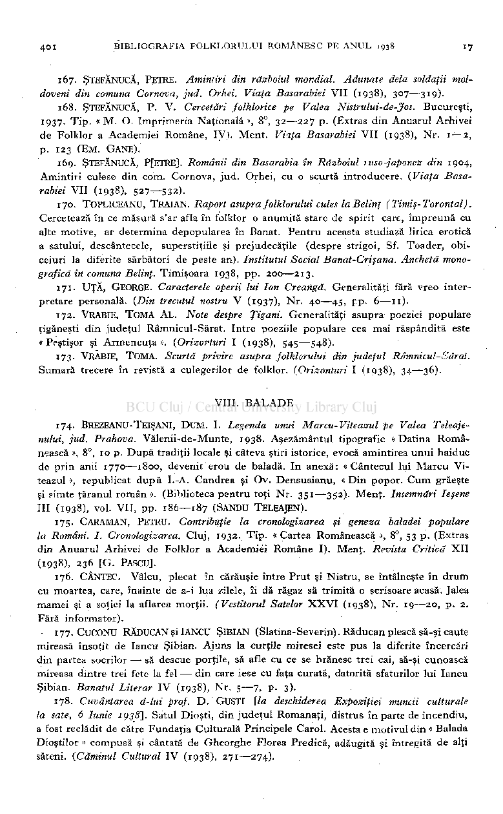

- 167. ŞTEFĂNUCĂ, PETRE. Amintiri din războiul mondial. Adunate delà soldaţii moldoveni din comuna Cornova, jud. Orhei. Viaţa Basarabiei VII (1938), 307—319).
- 168. ŞTEFĂNUCĂ, P V Cercetări folklorice pe Valea Nistrului-de-Jos. Bucureşti,

1937. Tip . « M . O . Imprimeria Naţională », 8°, 32—227 p. (Extras din Anuarul Arhivei de Folklor a Academiei Române, IV.). Menţ. Viaţa Basarabiei VI I (1938), Nr. 1—2, p. 123 (EM . GANE) .

169. ŞTEFĂNUCĂ, P[ETRE]. Românii din Basarabia în Războiul >uso-japonez din 1904,

Amintiri culese din com. Cornova, jud. Orhei, cu o scurtă introducere. (Viaţa Basa­

rabiei VII (1938), 527—532).

170. TOPLICEANU, TRAIAN. Raport asupra folklorului cules laBelinţ (Timiş-Torontal).

Cercetează în ce măsură s'ar afla în folklor o anumită stare de spirit care, împreună cu alte motive, ar determina depopularea în Banat. Pentru aceasta studiază lirica erotică a satului, descântecele, superstiţiile şi prejudecăţile (despre strigoi, Sf. Toader, obi­

ceiuri la diferite sărbători de peste an). Institutul Social Banat-Crişana. Anchetă monografică în comuna Belinţ. Timişoara 1938, pp 200—213.

- 171. UŢĂ, GEORGE. Caracterele operii lui Ion Creangă. Generalităţi fără vreo inter­

pretare personală. (Din trecutul nostru V (1937), Nr 40—45, pp 6—11).

- 172. VRABIE, TOM A AL. Note despre Ţigani. Generalităţi asupra poeziei populare

ţigăneşti din judeţul Râmnicul-Sărat. Intre poeziile populare cea mai răspândită este « Peştişor şi Armencuţa ». (Orizovturi I (1938), 545—548).

- 173. VRABIE, TOMA. Scurtă privire asupra folklorului din judeţul Râmnicul-Sărat.

Sumară trecere în revistă a culegerilor de folklor. (Orizonturi I (1938), 34—36).

VIII. BALAD E

- 174. BREZEANU-TEIŞANI, DUM. I. Legenda unui Marcu-Viteazul pe Valea Teleaje-

nului, jud. Prahova. Vălenii-de-Munte, 1938. Aşezământul tipografic « Datina Românească », 8°, 10 p. După tradiţii locale şi câteva ştiri istorice, evocă amintirea unui haiduc de prin anii 1770—1800, devenit erou de baladă. In anexă: «Cântecul lui Marcu Vi teazul», republicat după I .-A Candrea şi Ov . Densusianu, «Din popor. Cu m grăeşte şi simte ţăranul român». (Biblioteca pentru toţi Nr. 351—352). Menţ. însemnări Ieşene III (1938), vol. VII , pp. 186—187 (SAND U TELEAJEN).

175. CARAMAN, PETRU. Contribuţie la cronologizarea şi geneza baladei populare

la Români. I. Cronologizarea. Cluj, 1932. Tip . « Cartea Românească », 8°, 53 p. (Extras din Anuarul Arhivei de Folklor a Academiei Române I). Menţ. Revista Critică XI I

(1938), 236 [G . PASCU].

- 176. CÂNTEC. Vâlcu, plecat în cărăuşie între Prut şi Nistru, se întâlneşte în drum cu moartea, care, înainte de a-i lua zilele, îi dă răgaz să trimită o scrisoare acasă. Jalea mamei şi a soţiei la aflarea morţii. (Vestitorul Satelor XXV I (1938), Nr. 19—20, p. 2. Fără informator).
- 177. CUCONU RĂDUCAN şi IANCU ŞlBIAN (Slatina-Severin). Răducan pleacă să-şi caute mireasă însoţit de Iancu Şibian. Ajuns la curţile miresei este pus la diferite încercări din partea socrilor — să descue porţile, să afle cu ce se hrănesc trei cai, să-şi cunoască mireasa dintre trei fete la fel — din care iese cu faţa curată, datorită sfaturilor lui Iancu

Şibian. Banatul Literar IV (1938), Nr 5—7, p. 3).

178. Cuvântarea d-lui prof. D GUŞTI \la deschiderea Expoziţiei muncii culturale

la sate, 6 Iunie 1938]. Satul Dioşti, din judeţul Romanaţi, distrus în parte de incendiu, a fost reclădit de către Fundaţia Culturală Principele Carol. Acesta e motivul din « Balada Dioştilor » compusă şi cântată de Gheorghe Florea Predică, adăugită şi întregită de alţi

- săteni. (Căminul Cultural I V (1938), 271—274).

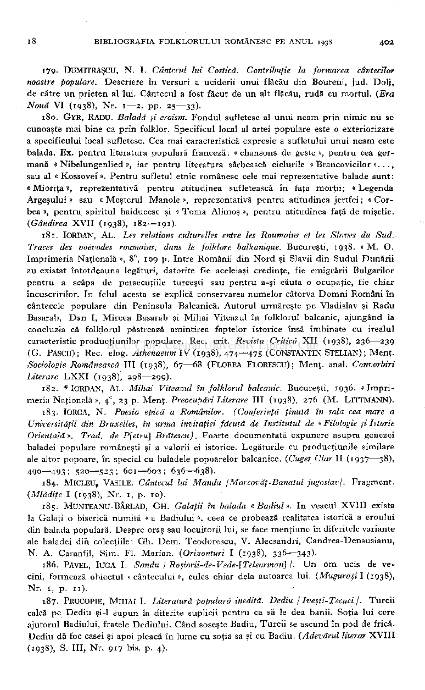

- 179. DUMITRAŞCU, N . I. Cântecul lui Costică. Contribuţie la formarea căntecilor

noastre populare. Descriere în versuri a uciderii unui flăcău din Boureni, jud. Dolj, de către un prieten al lui. Cântecul a fost făcut de un alt flăcău, rudă cu mortul. (Era

Nouă V I (1938), Nr. i-—2. pp 25—33).

- 180. GYR, RADU. Baladă şi eroism. Fondul sufletesc al unui neam prin nimic nù se

cunoaşte mai bine ca prin folklor. Specificul local al artei populare este o exteriorizare a specificului local sufletesc. Cea mai caracteristică expresie a sufletului unui neam este balada. Ex . pentru literatura populară franceză: «chansons de geste », pentru cea germană « Nibelungenlied », iar pentru literatura sârbească ciclurile « Brancovicilor ». . . , sau al « Kossoveî ». Pentru sufletul etnic românesc cele mai reprezentative balade sunt : «Mioriţa», reprezentativă pentru atitudinea sufletească în faţa morţii; «Legenda Argeşului » sau « Meşterul Manole », reprezentativă pentru atitudinea jertfei ; « Cor bea », pentru spiritul haiducesc şi « Torna Alimoş », pentru atitudinea faţă de mişelie.

(Gândirea XVII (1938), 182—191).

181. IORDAN, AL Les relations culturelles entre les Roumains et les Slaves du Sud. Traces des voévodes roumains, dans le folklore balkanique. Bucureşti, 1938. « M . O

Imprimeria Naţională », 8°, 109 p. Intre Românii din Nord şi Slavii din Sudul Dunării au existat întotdeauna legături, datorite fie aceleiaşi credinţe, fie emigrării Bulgarilor pentru a scăpa de persecuţiile turceşti sau pentru a-şi căuta o ocupaţie, fie chiar încuscririlor. In felul acesta se explică conservarea numelor câtorva Domni Români în cântecele populare din Peninsula Balcanică. Autorul urmăreşte pe Vladislav şi Radu Basarab, Dan I, Mircea Basarab şi Mihai Viteazul în folklorul balcanic, ajungând la concluzia că folklorul păstrează amintirea faptelor istorice însă îmbinate cu irealul caracteristic producţiunilor populare. Rec. crit. Revista Critică XI I (1938), 236—239 (G PASCU) ; Rec. elog. Athenaeum I V (1938), 474'—475 (CONSTANTI N STELIAN); Menţ. Sociologie Românească III (1938), 67—68 (FLOREA FLORESCU) ; Menţ. anal. Convorbiri

Literare LXX I (1938), 298—299).

- 182. * IORDAN, AL Mihai Viteazul în folklorul balcanic. Bucureşti, J936. « Impri­

meria Naţională », 4°, 23 p. Menţ. Preocupări Literare III (1938), 276 (M . LlTTMANN).

- 183. IORGA, N Poesia epică a Românilor. (Conferinţă ţinută în sala cea mare a

Universităţii din Bruxelles, în urma invitaţiei făcută de Institutul de « Filologie şi Istorie

Orientală ». Trad. de Pţetru] Brătescu). Foarte documentată expunere asupra genezei baladei populare româneşti şi a valorii ei istorice. Legăturile cu producţiunile similare ale altor popoare, în special cu baladele popoarelor balcanice. (Cuget Clar II (1937—38),

490—493; 520—523; 601—602; 636—638).

- 184. MlCLEU, VACILE. Cântecul lui Mandu jMarcovăţ-Banatul jugoslavj. Fragment.

(Mlădiţe I (1938), Nr 1, p. 10).

- 185. MUNTEANU-BÂRLAD , GH Galaţii în balada « Badiul ». In veacul XVII I exista

la Galaţi o biserică numită « a Badiului », ceea ce probează realitatea istorică a eroului din balada populară. Despre oraş sau locuitorii lui, se face menţiune în diferitele variante ale baladei din colecţiile: Gh . Dem . Teodorescu, V . Alecsandri, Candrea-Densusianu, N. A . Caranfil, Sim. FI Marian. (Orizonturi I (1938), 336—343)-

- 186. PAVEL, IUGA I. Sandu j Roşiorii-de-Vede-\Teleorman\ /. U n om ucis de vecini, formează obiectul «cântecului», cules chiar delà autoarea lui. (Muguraşi I (1938), Nr. 1, p. 11).
- 187. PROCOPIE, MIHAI I. Literatură populară inedită. Dediu j Iveşti-Tecuci j . Turcii

calcă pe Dediu şi-1 supun la diferite suplicii pentru ca să le dea banii. Soţia lui cere ajutorul Badiului, fratele Dediului. Când soseşte Badiu, Turcii se ascund în pod de frică. Dediu dă foc casei şi apoi pleacă în lume cu soţia sa şi cu Badiu. (Adevărul literar XVII I

#### (1938), S. III, Nr 917 bis, p. 4).

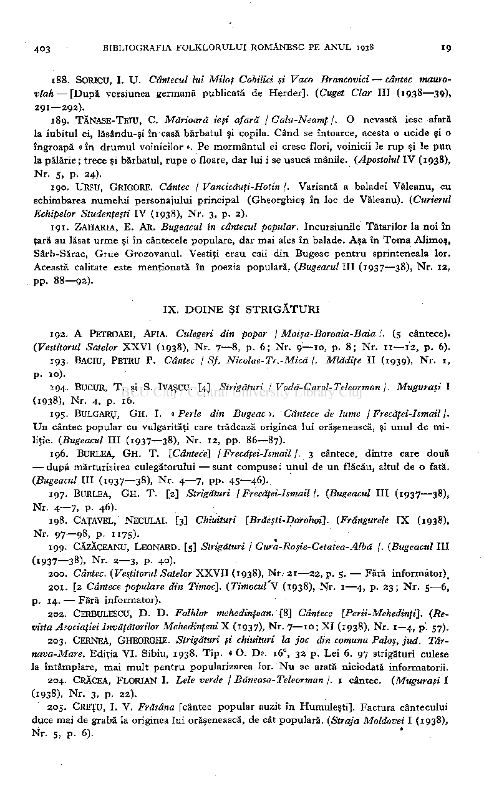

188. SORICU, I. U . Cântecul lui Milos Cobilici şi Vaco Brancovici — cântec maurovlah — [După versiunea germană publicată de Herder]. (Cuget Clar III (1938—39),

zgi—292).

189. TĂNASE-TEIU, C Mărioară ieşi afară / Galu-Neamp j . O nevastă iese afară

la iubitul ei, lăsându-şi în casă bărbatul şi copila. Când se întoarce, acesta o ucide şi o îngroapă « în drumul voinicilor ». Pe mormântul ei cresc flori, voinicii le rup şi le pun la pălărie ; trece şi bărbatul, rupe o floare, dar lui i se usucă manile. (Apostolul I V (1938), Nr. 5, p. 24).

- 190. URSU, GRIGORE. Cântec / Vancicăuţi-Hotin /. Variantă a baladei Văleanu, cu

schimbarea numelui personajului principal (Gheorghieş în loc de Văleanu). (Curierul

Echipelor Studenţeşti I V (1938), Nr 3, p. 2).

- 191. ZAHARIA, E AR Bugeacul în cântecul popular. Incursiunile Tătarilor la noi în

ţară au lăsat urme şi în cântecele populare, dar mai ales în balade. Aşa în Torna Alimoş, Sârb-Sărac, Grue Grozovanul. Vestiţi erau caii din Bugeac pentru sprinteneala lor. Această calitate este menţionată în poezia populară. (Bugeacul III (1937—38), Nr . 12,

pp. 88—92).

###### IX. DOIN E ŞI STRIGĂTUR I

- 192. A PETROAEI, AFIA. Culegeri din popor j Moişa-Boroaia-Baia !. (5 cântece).

(Vestitorul Satelor XXV I (1938), Nr 7—8, p. 6; Nr 9—10, p. 8; Nr 11— iz , p. 6).

- 193. BACIU, PETRU P. Cântec I Sf. Nicolae-Tr.-Mică /. Mlădiţe II (1939), Nr 1,

p. io).

- 194. BUCUR, T . şi S . IVAŞCU. [4] Strigături / Vodă-Carol-Teleorman /. Muguraşi I

(1938), Nr 4, p. 16.

- 195. BULGARU, GH I. «Perle din Bugeac ». Cântece de lume \ Frecăţei-Ismail /.

U n cântec popular cu vulgarităţi care trădează originea lui orăşenească, şi unul de mi­

liţie. (Bugeacul III (1937—38), Nr 12, pp 86—-87).

- 196. BURLEA, GH . T . [Cântece'] / Frecăţei-Ismail \. 3 cântece, dintre care două

— după mărturisirea culegătorului — sunt compuse : unul de un flăcău, altul de o fată.

(Bugeacul III (1937—38), Nr 4—7, pp 45—46).

- 197. BURLEA, GH. T [2] Strigături / Frecăţei-Ismail /. (Bugeacul III (1937—38),

Nr. 4—7, p. 46)-

- 198. CAŢAVEL, NECULAI. [3] Chiuituri [Bră'eşti-Dorohoî]. (Frăngurele I X (1938),

Nr. 97—98, P- II75)- ,

- 199. CĂZĂCEANU, LEONARD. [5] Strigături j Gura-Roşie-Cetatea-Albă /. (Bugeacul III

(1937—38), Nr 2—3, p. 40).

- 200. Cântec. (Vestitorul Satelor XXVI I (1938), Nr. 21—22, p. 5. — Fără informator)^
- 201. [2 Cântece populare din Timoc]. (Timocul V (1938), Nr 1—4, p. 23; Nr . 5—6,

p. 14. — Fără informator).

- 202. CERBULESCU, D . D Folklor mehedinţean. [8] Cântece [Perii-Mehedinţi]. (Re­

vista Asociaţiei Învăţătorilor Mehedinţeni X (1937), Nr. 7—10; X I (1938), Nr. 1—4, p'. 57).

- 203. CERNEA, GHEORGHE. Strigături şi chiuituri la joc din comuna Paloş, jud. Târ-

, 32 p. Lei 6. 97 strigături culese la întâmplare, mai mult pentru popularizarea lor. N u se arată niciodată informatorii.

###### nava-Mare. Ediţia VI . Sibiu, 1938. Tip . « O . D». 16

0

- 204. CRĂCEA, FLORIAN I. Lele verde j Bäneasa-Teleorman j. 1 cântec. (Muguraşii

(1938), Nr 3, p. 22).

- 205. CREŢU, I. V . Frăsăna [cântec popular auzit în Humuleşti]. Factura cântecului

duce mai de grabă la originea lui orăşenească, de cât populară. (Straja Moldovei I (1938), Nr. s, P- 6). *

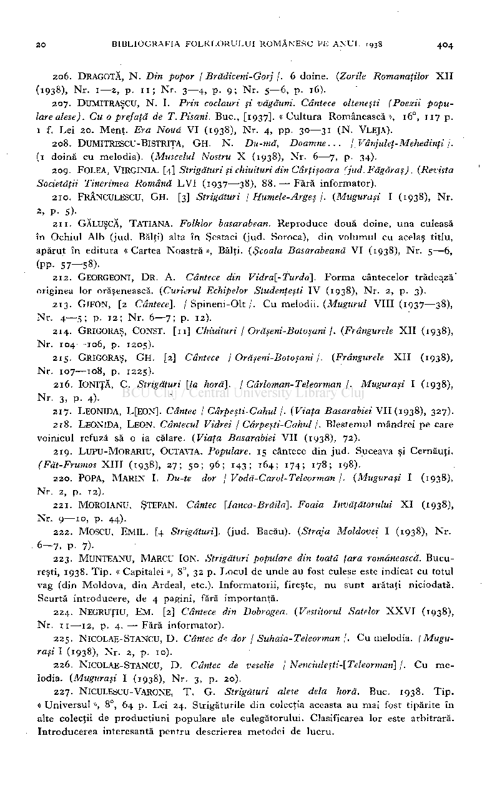

206. DRAGOTĂ, N Din popor / Brădiceni-Gorj /. 6 doine. (Zorile Romanaţilor XI I

(1938), Nr 1—2, p. 11 Nr 3—4, p. 9; Nr 5—6, p. 16).

207. DUMITRAŞCU, N . I. Prin coclauri si văgăuni. Cântece olteneşti (Poezii populare alese). Cu o prefaţă de T.Pisani. Buc , [1937]. « Cultura Românească», 16°, 117 p.

- 1 f. Le 20. Menţ. Era Nouă V I (1938), Nr 4, pp. 30—31 (N VLEJA).

- 208. DUMITRESCU-BlSTRIŢA, GH N Du-mă, Doamne... / Vânjuleţ-Mehedinţi j .

(1 doină cu melodia). (Muscelul Nostru X (1938), Nr 6—7, p. 34).

- 209. FOLEA, VIRGINIA. [4] Strigături şi chiuituri din Cârţişoara (jud. Făgăraş). (Revista

Societăţii Tinerimea Română LV I (1937—38), 88. — Fără informator).

- 210. FRÂNCULESCU, GH. [3] Strigături / Humele-Argeş j . (Muguraşi I (1938), Nr.

2, P- 5)-

- 211. GĂLUŞCĂ, TATIANA. Folklor basarabean. Reproduce două doine, una culeasă

în Ochiul Alb (jud. Bălţi) alta în Şestaci (jud. Soroca), din volumul cu acelaş titlu, apărut în editura « Cartea Noastră », Bălţi. (Şcoala Basarabeană V I (1938), Nr. 5—6,

(PP- 57—58).

- 212. GEORGEONI, DR. A. Cântece din Vidra[-Turda]. Forma cântecelor trădea.ză'

originea lor orăşenească. (Curierul Echipelor Studenţeşti I V (1938), Nr 2, p. 3).

- 213. GlFON, [2 Cântece]. / Spineni-Olt /. C u melodii. (Mugurul VIII (1937—38),

Nr. 4—5 p. 12 Nr 6—7; p. 12).

- 214. GRIGORAŞ, CONST. [II] Chiuituri I Orăşeni-Botoşani j . (Frângurele XI I (1938),

Nr. 104—106, p. 1205).

- 215. GRIGORAŞ, GH. [2] Cântece j Orăşeni-Botoşani j . (Frângurele XI (1938),

Nr. 107—108, p. 1225).

- 216. IONIŢĂ, C . Strigături [la horă]. / Cârloman-Teleorman /. Muguraşi I (1938),

Nr. 3, p. 4).

- 217. LEONIDA, L[EON] Cântec j Cârpeşti-Cahul /. (Viaţa Basarabiei VII (1938), 327).
- 218. LEONIDA, LEON . Cântecul Vidrei j Cârpeşti-Cahul j Blestemul mândrei pe care

voinicul refuză să o ia călare. (Viaţa Basarabiei VI (1938), 72).

- 219. LUPU-MORARIU, OCTAVIA. Populare. 15 cântece din jud. Suceava şi Cernăuţi.

(Făt-Frumos XIII (1938), 27; 50; 96; 143; 164; 174; 178; 198).

- 220. POPA, MARI N I. Du-te dor / Vodă-Carol-Teleorman /. (Muguraşi I (1938),

- Nr. 2, p. 12).

- 221. MOROIANU, ŞTEFAN. Cântec [Ianca-Brăila]. Foaia învăţătorului X I (1938),

Nr. 9—10, p. 44).

- 222. MOSCU. EMIL. [4 Strigături], (jud. Bacău). (Straja Moldovei I (1938), Nr.

6—7, P- 7)-

- 223. MUNTEANU, MARCU ION. Strigături populare din toată ţara românească. Bucu­

reşti, 1938. Tip . « Capitalei », 8°, 32 p. Locul de unde au fost culese este indicat cu totul vag (din Moldova, din Ardeal, etc.). Informatorii, fireşte, nu sunt arătaţi niciodată. Scurtă introducere, de 4 pagini, fără importanţă.

- 224. NEGRUŢIU, EM. [2] Cântece din Dobrogea. (Vestitorul Satelor XXV I (1938),

Nr. 11—12 , p. 4. — Fără informator).

- 225. NlCOLAE-STANCU, D. Cântec de dor / Suhaia-Teleorman /. C u melodia. (Mugu­

raşi I (1938), Nr 2, p. 10).

- 226. NlCOLAE-STANCU, D Cântec de veselie / Nenciuleşti-[Teleorman] j C u me

lodia. (Muguraşi I (1938), Nr 3, p. 20).

- 227. NICULESCU-VARONE, T G Strigături alese delà horă. Buc. 1938. Tip

« Universul », 8°, 64 p. Lei 24. Strigăturile din colecţia aceasta au mai fost tipărite în alte colecţii de producţiuni populare ale culegătorului. Clasificarea lor este arbitrară. Introducerea interesantă pentru descrierea metodei de lucru.

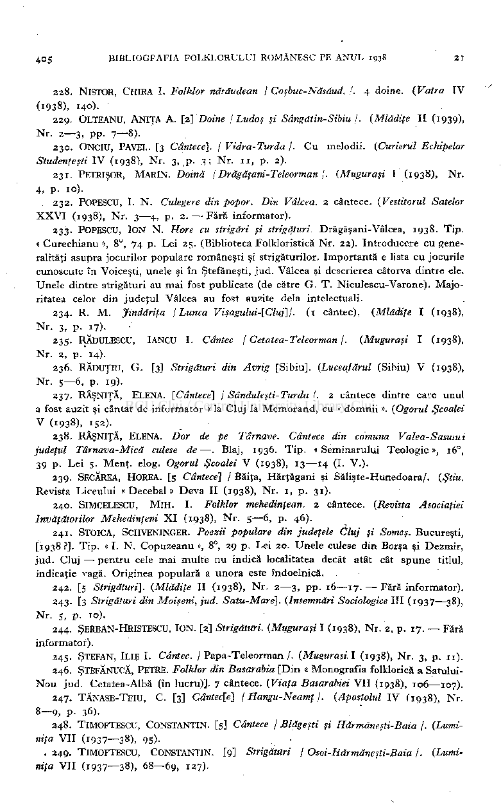

- 228. NlSTOR, CHIRA I. Folklor năsăudean j Coşbuc-Năsăud. '. 4 doine. (Vatra I V

(1938), 140).

- 229. OLTEANU, ANIŢA A [2] Doine / Ludoş şi Sângătin-Sibiu ./. (Mlădiţe II (1939),

Nr. 2—3, pp. 7—8).

- 230. ONCIU, PAVEL. [3 Cântece]. / Vidra-Turda j C u melodii. (Curierul Echipelor

Studenţeşti I V (1938), Nr 3, p. 3; Nr. 11 , p. 2).

- 231. PETRISOR, MARIN. Doină / Drăgăşani-Teleorman j . (Muguraşi I (1938), Nr.

4. P- io)-

- 232. POPESCU, I. N Culegere din popor. Din Vâlcea. 2 cântece. (Vestitorul Satelor

XXV I (1938), Nr. 3—4, p. 2. — Fără informator).

- 233. POPESCU, ION N . Hore cu strigări şi strigături. Drăgăşani-Vâlcea, 1938. Tip.

« Curechianu », 8°, 74 p. Lei 25. (Biblioteca Folkloristică Nr. 22). Introducere cu generalităţi asupra jocurilor populare româneşti şi strigăturilor. Importantă e lista cu jocurile cunoscute în Voiceşti, unele şi în Ştefăneşti, jud. Vâlcea şi descrierea câtorva dintre ele. Unele dintre strigături au mai fost publicate (de către G . T . Niculescu-Varone). Majoritatea celor din judeţul Vâlcea au fost auzite delà intelectuali.

- 234. R. M Jindăriţa I Lunca Vişagului-[Cluj]l. (1 cântec). (Mlădiţe I (1938),

Nr. 3, p. 17).

- 235. RĂDULESCU, IANCU I. Cântec / Cetatea-Teleorman /. (Muguraşi I (1938),

Nr. 2, p. 14).

- 236. RĂDUŢIU, G . [3] Strigături din Avrig [Sibiu]. (Luceafărul (Sibiu) V (1938),

Nr. s—6, p. 19).

- 237. RÂŞNIŢĂ, ELENA. [Cântece] / Sanduleşti-Turda l. 2 cântece dintre care unul

a fost auzit şi cântat de informator « Ia Cluj la Memorand, cu « domnii ». (Ogorul Şcoalei

V (1938), 152).

238. RÂŞNIŢĂ, ELENA. Dor de pe Târnave. Cântece din comuna Valea-Sasuiui judeţul Târnava-Mică culese de—. Blaj, 1936. Tip . «Seminarului Teologic», 16°,

39 p. Le 5. Menţ. elog. Ogorul Şcoalei V (1938), 13—14 (I. V.)

- 239. SECAREA, HOREA. [5 Cântece] / Băiţa, Hărţăgani şi Sălişte-Hunedoara/. (Ştiu.

Revista Liceului « Decebal » Deva II (1938), Nr. 1, p. 31).

- 240. SlMCELESCU, MlPI. I. Folklor mehedinţean. 2 cântece. (Revista Asociaţiei

Învăţătorilor Mehedinţeni X I (1938), Nr 5—6, p. 46).

- 241. STOICA, SCHVENINGER. Poezii populare din judeţele Cluj şi Someş. Bucureşti,

[1938 ?]. Tip . « I. N . Copuzeanu », 8°, 29 p. Lei 20. Unele culese din Borşa şi Dezmir, jud. Cluj — pentru cele mai multe nu indică localitatea decât atât cât spune titlul, indicaţie vagă. Originea populară a unora este îndoelnică.

- 242. [5 Strigături]. (Mlădiţe II (1938), Nr 2—3, pp 16—17. — Fără informator).
- 243. [3 Strigături din Moişeni, jud. Satu-Mare]. (însemnări Sociologice III (1937—38),

Nr. 5, p. 10).

- 244. ŞERBAN-HRISTESCU, ION. [2] Strigături. (Muguraşi I (1938), Nr. 2, p. 17. — Fără

informator).

- 245. ŞTEFAN, ILIE I. Cântec. / Papa-Teleorman /. (Muguraşii (1938), Nr 3, p. 11).
- 246. ŞTEFĂNUCĂ, PETRE. Folklor din Basarabia [Din « Monografia folklorică a Satului-

Nou jud. Cetatea-Albă (în lucru)]. 7 cântece. (Viaţa Basarabiei VII (1938), 106—107).

- 247. TĂNASE-TEIU, C [3] Cântec[e] j Hangu-Neamţ j . (Apostolul I V (1938), Nr.

8—9, p. 36).

- 248. TlMOFTESCU, CONSTANTIN. [5] Cântece / Bldgeşti şi Hărmăneşti-Baia [. (Lumi­

niţa VI (1937—38), 95)-

, 249. TlMOFTESCU, CONSTANTIN. [9] Strigături / Osoi-Hărmăneşti-Baia j'.. (Luminiţa VI (1937—38), 68—69, 127).

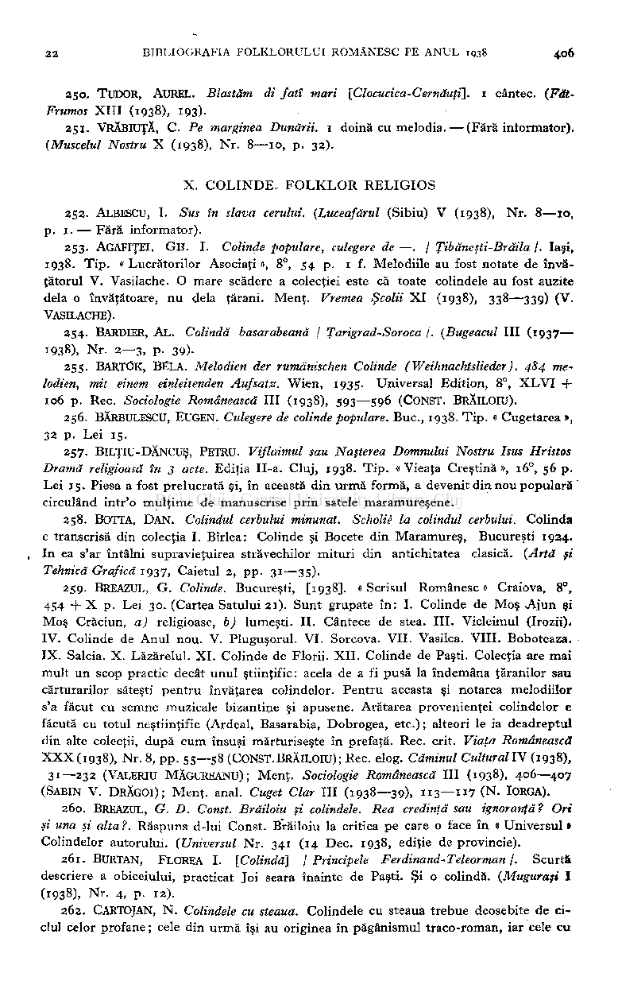

- 250. TUDOR, AUREL. Blastăm di fatî mari [Clocucica-Cernăuţî]. 1 cântec. (Făt-

Frumos XIII (1938), 193).

- 251. VRĂBIUŢĂ, C . Pe marginea Dunării. 1 doină cu melodia. — (Fără informator).

(Muscelul Nostru X (1938), Nr 8—10, p. 32).

X. COLINDE . FOLKLO R RELIGIO S

- 252. ALBESCU, I. Sus în slava cerului. (Luceafărul (Sibiu) V (1938), Nr 8—io,

p. 1. — Fără informator).

- 253. AGAFIŢEI, GH. I. Colinde populare, culegere de —. / Ţibăneşti-Brăila /. Iaşi, 1938. Tip . « Lucrătorilor Asociaţi », 8°, 54 p. 1 f. Melodiile au fost notate de învăţătorul V . Vasilache. O mare scădere a colecţiei este că toate colindele au fost auzite delà o învăţătoare, nu delà ţărani. Menţ. Vremea Şcolii X I (1938), 338—339) (V. VASILACHE).
- 254. BARDIER, AL Colindă basarabeană / Ţarigrad-Soroca /. (Bugeacul III (19371938), Nr 2—3, p. 39).
- 255. BARTOK, BÊLA. Melodien der rumänischen Colinde (Weihnachtslieder). 484 melodien, mit einem einleitenden Aufsatz. Wien, 1935. Universal Edition, 8°, XLV I 4106 p. Rec. Sociologie Românească III (1938), 593—596 (CONST. BRĂILOIU).
- 256. BĂRBULESCU, EUGEN. Culegere de colinde populare. Buc , 1938. Tip . « Cugetarea »,

32 p. Lei 15.

- 257. BlLŢIU-DĂNCUŞ, PETRU. Viflaimul sau Naşterea Domnului Nostru Isus Hristos

, 56 p. Lei 15 Piesa a fost prelucrată şi, în această din urmă formă, a devenit din nou populară circulând într'o mulţime de manuscrise prin satele maramureşene.

###### Dramă religioasă în 3 acte. Ediţia Il-a. Cluj, 1938. Tip . « Vieaţa Creştină », 16

0

258. BOTTA, DAN Colindul cerbului minunat. Scholiè la colindul cerbului. Colinda

e transcrisă din colecţia I. Bîrlea: Colinde şi Bocete din Maramureş, Bucureşti 1924. , In ea s'ar întâlni supravieţuirea străvechilor mituri din antichitatea clasică. (Artă şi

Tehnică Grafică 1937, Caietul 2, pp 31—35).

259. BREAZUL, G . Colinde. Bucureşti, [1938]. « Scrisul Românesc » Craiova, 8°, 454 -f X p. Lei 30. (Cartea Satului 21) Sunt grupate în: I. Colinde de Mo ş Aju n şi Moş Crăciun, a) religioase, b) lumeşti. II. Cântece de stea. III. Vicleimul (Irozii). IV. Colinde de Anul nou. V Pluguşorul. VI . Sorcova. VII . Vasilca. VIII. Bobotează. IX. Salcia. X . Lăzărelul. XI . Colinde de Florii. XII . Colinde de Paşti. Colecţia are mai mult un scop practic decât unul ştiinţific: acela de a fi pusă la îndemâna ţăranilor sau cărturarilor săteşti pentru învăţarea colindelor. Pentru aceasta şi notarea melodiilor s'a făcut cu semne muzicale bizantine şi apusene. Arătarea provenienţei colindelor e făcută cu totul neştiinţific (Ardeal, Basarabia, Dobrogea, etc.); alteori le ia deadreptul din alte colecţii, după cum însuşi mărturiseşte în prefaţă. Rec. crit. Viaţa Românească

XX X (1938), Nr. 8, pp. 55—58 (CONST.BRĂILOIU) Rec. elog. Căminul CulturallV (1938),

31—232 (VALERIU MĂGUREANU) Menţ. Sociologie Românească III (i93

)» 4°°—407 (SABIN V . DRAGO!); Menţ. anal. Cuget Clar III (1938—39), 113—117 (N. IORGA).

8

- 260. BREAZUL, G. D. Const. Brăiloiu şi colindele. Rea credinţă sau ignoranţă? Ori

şi una şi alta ?. Răspuns d-Iui Const. Brăiloiu la critica pe care o face în « Universul » Colindelor autorului. (Universul Nr . 341 (14 Dec. 1938, ediţie de provincie).

- 261. BURTAN, FLOREA I. [Colindă] /Principele Ferdinand-Teleorman j. Scurtă

descriere a obiceiului, practicat Joi seara înainte de Paşti. Şi o colindă. (Muguraşi I

(1938), Nr 4, p. 12).

- 262. CARTOJAN, N . Colindele cu steaua. Colindele cu steaua trebue deosebite de ci­

clul celor profane ; cele din urmă îşi au originea în păgânismul traco-roman, iar cele cu

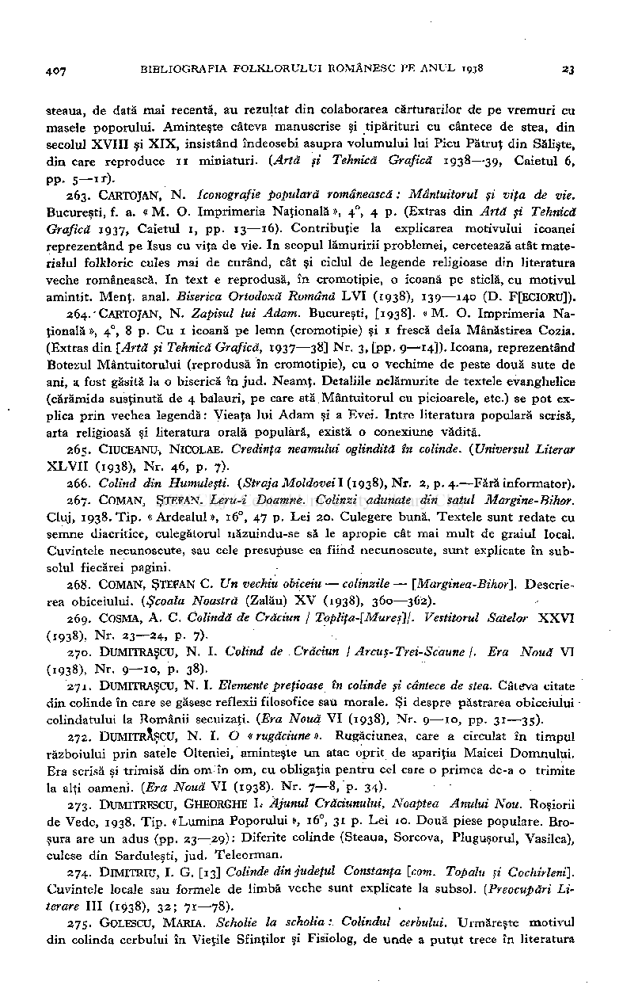

steaua, de dată mai recentă, au rezultat din colaborarea cărturarilor de pe vremuri cu masele poporului. Aminteşte câteva manuscrise şi tipărituri cu cântece de stea, din secolul XVII I şi XIX , insistând îndeosebi asupra volumului lui Picu Pătruţ din Sălişte, din care reproduce 11 miniaturi. (Artă şi Tehnică Grafică 1938—39, Caietul 6, pp. S—i r).

263. CARTOJAN, N Iconografie populară românească : Mântuitorul şi viţa de vie.

, 4 p. (Extras din Artă şi Tehnică Grafică 1937, Caietul 1, pp. 13—16). Contribuţie la explicarea motivului icoanei reprezentând pe Isus cu viţa de vie. In scopul lămuririi problemei, cercetează atât materialul folkloric cules mai de curând, cât şi ciclul de legende religioase din literatura veche românească. In text e reprodusă, în cromotipie, o icoană pe sticlă, cu motivul

Bucureşti, f. a. « M . O . Imprimeria Naţională », 4

0

amintit. Menţ. anal. Biserica Ortodoxă Română LV I (1938), 139—140 (D FfECIORU]). 264. ' CARTOJAN, N Zapisul lui Adam. Bucureşti, [1938]. « M . O . Imprimeria Na­

ţională », 4°, 8 p. C u 1 icoană pe lemn (cromotipie) şi 1 frescă delà Mănăstirea Cozia.

(Extras din [Artă şi Tehnică Grafică, 1937—38] Nr. 3, [pp. 9—14]). Icoana, reprezentând

Botezul Mântuitorului (reprodusă în cromotipie), cu o vechime de peste două sute de ani, a fost găsită la o biserică în jud. Neamţ. Detaliile nelămurite de textele evanghelice (cărămida susţinută de 4 balauri, pe care stă Mântuitorul cu picioarele, etc.) se pot explica prin vechea legendă: Vieaţa lui Ada m şi a Evei. Intre literatura populară scrisă, arta religioasă şi literatura orală populară, există o conexiune vădită.

- 265. ClUCEANU, NICOLAE. Credinţa neamului oglindită în colinde. (Universul Literar

XLVI I (1938), Nr . 46, p. 7)-

- 266. Colind din Humuleşti. (Straja Moldovei I (1938), Nr. 2, p. 4.—Fără informator).
- 267. COMAN, ŞTEFAN. Leru-i Doamne. Colinzi adunate din satul Margine-Bihor.

Cluj, 1938. Tip . « Ardealul », 16

, 47 p. Lei 20. Culegere bună. Textele sunt redate cu semne diacritice, culegătorul năzuindu-se să le apropie cât mai mult de graiul local. Cuvintele necunoscute, sau cele presupuse ca fiind necunoscute, sunt explicate în subsolul fiecărei pagini.

0

- 268. COMAN, ŞTEFAN C Un vechiu obiceiu — colinzile — [Marginea-Bihor]. Descrie­

rea obiceiului. (Şcoala Noastră (Zalău) X V (1938), 360—362).

- 269. COSMA, A . C Colindă de Crăciun / Topliţa-[Mureş]j. Vestitorul Satelor XXV I

(1938), Nr 23—24, p. 7).

- 270. DUMITRAŞCU, N . I. Colind de Crăciun / Arcuş-Trei-Scaune j . Era Nouă VI

(1938), Nr 9—10, p. 38).

- 271. DUMITRAŞCU, N . I. Elemente preţioase în colinde şi cântece de stea. Câteva citate

din colinde în care se găsesc reflexii filosofice sau morale. Şi despre păstrarea obiceiului colindatului la Românii secuizaţi. (Era Nouă V I (1938), Nr. 9—10, pp. 31—35).

- 272. DUMITRAŞCU, N . I. O « rugăciune ». Rugăciunea, care a circulat în timpul

războiului prin satele Olteniei, aminteşte un atac oprit de apariţia Maicei Domnului. Era scrisă şi trimisă din om în om, cu obligaţia pentru cel care o primea de-a o trimite la alţi oameni. (Era Nouă V I (1938). Nr . 7—8, p. 34).

273. DUMITRESCU, GHEORGHE I. Ajunul Crăciunului, Noaptea Anului Nou. Roşiorii

de Vede, 1938. Tip . «Lumina Poporului », 16°, 31 p. Lei 10. Două piese populare. Broşura are un adus (pp. 23—29): Diferite colinde (Steaua, Sorcova, Pluguşorul, Vasilca), culese din Sarduleşti, jud. Teleorman.

274. DlMITRIU, I. G. [13] Colinde din judeţul Constanţa [com. Topalu şi Cochirleni].

Cuvintele locale sau formele de limbă veche sunt explicate la subsol. (Preocupări Li­

terare III (1938), 32; 71—78).

275. GOLESCU, MARIA. Scholie la scholia: Colindul cerbului. Urmăreşte motivul

din colinda cerbului în Vieţile Sfinţilor şi Fisiolog, de unde a putut trece în literatura

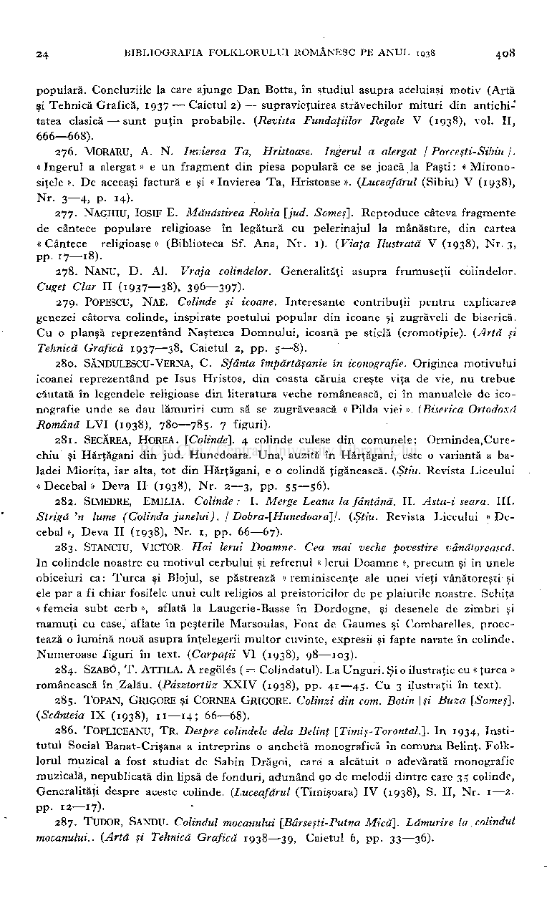

populară. Concluziile la care ajunge Dan Botta, în studiul asupra aceluiaşi motiv (Artă şi Tehnică Grafică, 1937 — Caietul 2) — supravieţuirea străvechilor mituri din antichitatea clasică — sunt puţin probabile. (Revista Fundaţiilor Regale V (1938), vol. II,

666—668).

276. MORARU, A . N învierea Ta, Hristoase. îngerul a alergat \ Porceşti-Sibiu /.

«îngerul a alergat» e un fragment din piesa populară ce se joacă la Paşti: «Mironosiţele ». D e aceeaşi factură e şi « învierea Ta , Hristoase ». (Luceafărul (Sibiu) V (1938), Nr. 3—4, p. 14).

277. NAGHIU, IOSIF E . Mănăstirea Rohia [jud. Someş]. Reproduce câteva fragmente de cântece populare religioase în legătură cu pelerinajul la mănăstire, din cartea « Cântece religioase » (Biblioteca Sf. Ana, Nr . 1). (Viaţa Ilustrată V (1938), Nr. 3,

pp. 17—18).

278. NANU , D . Al . Vraja colindelor. Generalităţi asupra frumuseţii colindelor.

Cuget Clar II (1937—38), 396—397).

279. POPESCU, NAE. Colinde şi icoane. Interesante contribuţii pentru explicarea genezei câtorva colinde, inspirate poetului popular din icoane şi zugrăveli de biserică. Cu o planşă reprezentând Naşterea Domnului, icoană pe sticlă (cromotipie). (Artă şi

Tehnică Grafică 1937—38, Caietul 2, pp 5—8).

280. SĂNDULESCU-VERNA C . Sfânta împărtăşanie în iconografie. Originea motivului icoanei reprezentând pe Isus Hristos, din coasta căruia creşte viţa de vie, nu trebue căutată în legendele religioase din literatura veche românească, ci în manualele de iconografie unde se dau lămuriri cum să se zugrăvească « Pilda viei ». (Biserica Ortodoxă

Română LV I (1938), 780—785. 7 figuri).

281. SECAREA, HOREA. [Colinde]. 4 colinde culese din comunele: Ormindea.Curechiu şi Hărţăgani din jud. Hunedoara. Una, auzită în Hărţăgani, este o variantă a baladei Mioriţa, iar alta, tot din Hărţăgani, e o colindă ţigănească. (Ştiu. Revista Liceului « Decebal » Deva II (1938), Nr. 2—3, pp. 55—56).

- 282. SlMEDRE, EMILIA. Colinde: I. Merge Leana la fântână. II. Asta-i seara. III.

Strigă 'n lume (Colinda junelui). j Dobra-[Hunedoara]l. (Ştiu. Revista Liceului «De­

cebal », Deva II (1938), Nr. i, pp. 66—67).

- 283. STANCIU, VICTOR. Hai lerui Doamne. Cea mai veche povestire vânătoreascd.

In colindele noastre cu motivul cerbului şi refrenul « lerui Doamne », precum şi în unele obiceiuri ca : Turca şi Blojul, se păstrează « reminiscenţe ale unei vieţi vânătoreşti şi ele par a fi chiar fosilele unui cult religios al preistoricilor de pe plaiurile noastre. Schiţa « femeia subt cerb », aflată la Laugerie-Basse în Dordogne, şi desenele de zimbri şi mamuţi cu case, aflate în peşterile Marsoulas, Font de Gaumes şi Combarelles, proectează o lumină nouă asupra înţelegerii multor cuvinte, expresii şi fapte narate în colinde. Numeroase figuri în text. (Carpaţii V I (1938), 98—103).

- 284. SZABÖ, T . ATTILA. A regöles ( = Colindatul). La Unguri. Şi o ilustraţie cu « turca »

românească în Zalău. (Pdsztortiiz XXI V (1938), pp. 41—45. C u 3 ilustraţii în text).

- 285. TOPAN, GRIGORE şi CORNEA GRIGORE. Colinzi din com. Botin [şi Buza [Someş].

(Scânteia I X (1938), 11—14; 66—68).

- 286. TOPLICEANU, TR Despre colindele delà Belinţ [Timiş-Torontal.]. In 1934, Insti­

tutul Social Banat-Crişana a intreprins o anchetă monografică în comuna Belinţ. Folklorul muzical a fost studiat de Sabin Drăgoi, care a alcătuit o adevărată monografie muzicală, nepublicată din lipsă de fonduri, adunând 90 de melodii dintre care 35 colinde, Generalităţi despre aceste colinde. (Luceafărul (Timişoara) I V (1938), S. II, Nr. 1—2.

pp. 12—17)-

- 287. TUDOR, SANDU. Colindul mocanului [Bârseşti-Putna Mică]. Lămurire la colindul

mocanului.. (Artă şi Tehnică Grafică 1938—39, Caietul 6, pp. 33—36).

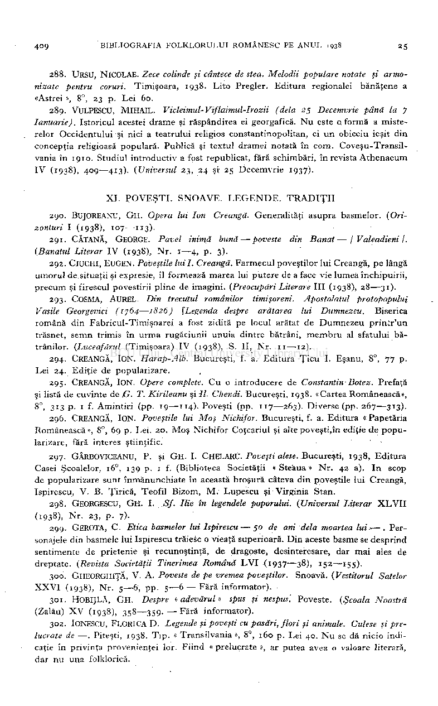

- 288. URSU, NICOLAE. Zece colinde şi cântece de stea. Melodii populare notate şi armo­

nizate pentru coruri. Timişoara, 1938. Lito Pregler. Editura regionalei bănăţene a «Astrei », 8°, 23 p. Lei 60.

289. VULPESCU, MlHAIL. Vicleimul-Viflaimul-Irozii (delà 2 5 Decemvrie până la 7 Ianuarie). Istoricul acestei drame şi răspândirea ei georgafică. N u este o formă a misterelor Occidentului şi nici a teatrului religios constantinopolitan, ci un obiceiu ieşit din concepţia religioasă populară. Publică şi textul dramei notată în com. Coveşu-Transilvania în 1910. Studiul introductiv a fost republicat, fără schimbări, în revista Athenaeum IV (1938), 409—413). (Universul 23, 24 şi 25 Decemvrie 1937).

XI . POVEŞTI . SNOAVE . LEGENDE . TRADIŢI I

- 290. BUJOREANU, GH. Opera lui Ion Creangă. Generalităţi asupra basmelor. (Ori­

zonturi I (1938), 107—113).

- 291. CĂTANĂ, GEORGE. Pavel inimă bună — poveste din Banat—\ Valeadieni \.

(Banatul Literar I V (1938), Nr. 1—4, p. 3).

- 292. ClUCHI, EUGEN. Poveştile luil. Creangă. Farmecul poveştilor lui Creangă, pe lângă

###### umorul de situaţii şi expresie, îl formează marea lui putere de a face vie lumea închipuirii, precum şi firescul povestirii pline de imagini. (Preocupări Literare III (1938), 28—31).

293. COSMA, AUREL. Din trecutul românilor timişoreni. Apostolatul protopopului Vasile Georgevici (1764—1826) [Legenda despre arătarea lui Dumnezeu. Biserica română din Fabricul-Timişoarei a fost zidită pe locul arătat de Dumnezeu prinlr'un trăsnet, semn trimis în urma rugăciunii unuia dintre bătrâni, membru al sfatului bătrânilor. (Luceafărul (Timişoara) IV (1938), S. II, Nr. 11—12).

- 294. CREANGĂ, ION. Harap-Alb. Bucureşti, f. a. Editura Ţic u I. Eşanu, 8°, 77 p.

Lei 24. Ediţie de popularizare.

- 295. CREANGĂ, ION. Opere complete. C u o introducere de Constantin-Botez. Prefaţă

şi listă de cuvinte de G. T. Kirileanu şi II. Chendi. Bucureşti, 1938. «Cartea Românească», 8°, 313 P- 1 f- Amintiri (pp. 19—114). Poveşti (pp. 117—263). Diverse (pp. 267—313).

- 296. CREANGĂ, ION. Poveştile, lui Moş Nichifor. Bucureşti, f. a. Editura « Papetăria

Românească», 8°, 6g p. Lei. 20. Mo ş Nichifor Coţcariul şi alte poveşti.în ediţie de popularizare, fără interes ştiinţific. ' •

297. GÂRBOVICEANU, P. şi GH. I. CHELARU. Poveşti alese. Bucureşti, 1938, Editura Casei Şcoalelor, 16 , 139 p. 1 f. (Biblioteca Societăţii «Steaua» Nr . 42 a). In scop de popularizare sunt înmănunchiate în această broşură câteva din poveştile lui Creangă, Ispirescu, V . B . Ţirică, Teofil Bizom, M . Lupescu şi Virginia Stan.

- 298. GEORGESCU, GH. I. Sf. Ilie în legendele poporului. (Universul Literar XLVI I

(1938), Nr. 23, p. 7)-

- 299. GEROTA, C . Etica basmelor lui Ispirescu — 50 de ani delà moartea lui'—. Per­

sonajele din basmele lui Ispirescu trăiesc o vieaţă superioară. Din aceste basme se desprind sentimente de prietenie şi recunoştinţă, de dragoste, desinteresare, dar mai ales de dreptate. (Revista Societăţii Tinerimea Română LV I (1937—38), 152—155).

- 300. GHEORGHIŢĂ, V. A . Poveste de pe vremea poveştilor. Snoavă. (Vestitorul Satelor

XXV I (1938), Nr. 5—6, pp. 5—6 — Fără informator).

- 301. HOBIJLĂ, GH Despre {'adevărul» spus şi nespus'. Poveste. (Şcoala Noastră

(Zalău) X V (1938), 358—359. — Fără informator).

- 302. IONESCU, FLORICA D . Legende şi poveşti cu pasări, flori şi animale. Culese şi pre­

###### lucrate de — . Piteşti, 1938. Tip . « Transilvania », 8°, 160 p. Lei 40. N u se dă nicio indicaţie în privinţa provenienţei lor. Fiind « prelucrate », ar putea avea o valoare literară, dar nu una folklorică.

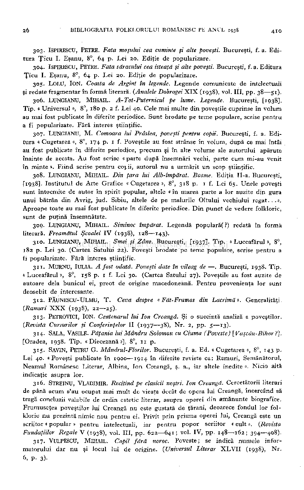

- 303. ISPIRESCU, PETRE. Fata moşului cea cuminte şi alte poveşti. Bucureşti, f. a. Edi­

tura Tic u I. Eşanu, 8°, 64 p. Lei 20. Ediţie de popularizare.

- 304. ISPIRESCU, PETRE. Fata săracului cea isteaţă şi alte poveşti. Bucureşti, f. a. Editura

Ţicu I. Eşanu, 8°, 64. p. Lei 20. Ediţie de popularizare.

- 305. LOLU, ION. Coasta de Argint în legende. Legende comunicate de intelectuali

şi redate fragmentar în formă literară. (Analele Dobrogei XI X (1938), vol. III, pp. 38—51).

- 306. LUNGIANU, MlHAIL. A-Tot-Puternicul pe lume. Legende. Bucureşti, [1938].

Tip. « Universul », 8°, 180 p. 2 f. Lei 40. Cele mai multe din poveştile cuprinse în volum au mai fost publicate în diferite periodice. Sunt brodate pe teme populare, scrise pentru a fi popularizate. Fără interes ştiinţific.

307. LUNGIANU, M Comoara lui Prăslea, poveşti pentru copii. Bucureşti, f. a. Edi­

tura « Cugetarea », 8°, 174 p. 1 f. Poveştile au fost strânse în volum, după ce mai întâi au fost publicate în diferite periodice, precum şi în alte volume ale autorului apărute înainte de acesta. A u fost scrise « parte după însemnări vechi, parte cum mi-au venit în minte ». Fiind scrise pentru copi, autorul nu a urmărit un scop ştiinţific.

308. LUNGIANU, MlHAIL. Din ţara lui Alb-împărat. Basme. Ediţia Il-a. Bucureşti,

[1938]. Institutul de Arte Grafice « Cugetarea », 8°, 318 p. 1 f. Lei 65. Unele poveşti sunt întocmite de autor în spirit popular, altele « în marea parte a lor auzite din gura unui bătrân din Avrig, jud. Sibiu, altele de pe malurile Oltului vechiului regat. . .». Aproape toate au mai fost publicate în diferite periodice. Di n punct de vedere folkloric, sunt de puţină însemnătate.

- 309. LUNGIANU, MlHAIL. Siminoc împărat. Legendă populară( ?) redată în formă

literară. Freamătul Şcoalei I V (1938), 128—143).

- 310. LUNGIANU, MlHAIL. Smei si Zâne. Bucureşti, [1937]. Tip. «Luceafărul», 8°,

182 p. Lei 30. (Cartea Satului 22). Poveşti brodate pe teme populare, scrise pentru a fi popularizate. Fără interes ştiinţific.

311. MURNU, IULIA. A fost odată. Poveşti date în vileag de —. Bucureşti, 1938. Tip

« Luceafărul », 8°, 158 p. 1 f. Lei 30. (Cartea Satului 27). Poveştile au fost auzite de autoare delà bunicul ei, preot de origine macedoneană. Pentru provenienţa lor sunt deosebit de interesante.

- 312. PĂUNESCU-ULMU, T . Ceva despre « Făt-Frumos din Lacrimă ». Generalităţi.

(Ramuri XX X (1938), 22—25).

- 313. PETROVICI, ION Centenarul lui Ion Creangă. Şi o succintă analiză a poveştilor.

(Revista Cursurilor şi Conferinţelor II (1937—38), Nr 2, pp 5—13).

- 314. SALA, VASILE. Păţania lui Mândru Solomon cu Ciuma (Poveste) [Vaşcău-Bihor ?].

[Oradea, 1938. Tip . «Diecezană»], 8°, 11 p.

- 315. SAVIN, PETRU G . Mândrul-Florilor. Bucureşti, f. a. Ed. « Cugetarea », 8°, 143 p.

Lei 40. «Poveşti publicate în 1900—1914 în diferite reviste ca: Ramuri, Semănătorul, Neamul Românesc Literar, Albina, Ion Creangă, ş. a., iar altele inedite ». Nicio altă indicaţie asupra lor.

316. STREINU, VLADIMIR. Recitind pe clasicii noştri. Ion Creangă. Cercetătorii literari

de până acum s'au ocupat mai mult de vieaţa decât de opera lui Creangă, încercând să tragă concluzii valabile de ordin estetic literar, asupra operei din amănunte biografice. Frumuseţea poveştilor lui Creangă nu este gustată de ţărani, deoarece fondul lor folkloric nu prezintă nimic nou pentru ei. Privit prin prisma operei lui, Creangă este un scriitor « popular » pentru intelectuali, iar pentru popor scriitor «cult». (Revista

Fundaţiilor Regale V (1938), vol. III, pp 622—641; vol. IV, pp 148—162; 394—408).

#### 317. VULPESCU, MlHAIL. Copil fără noroc. Poveste; se indică numele informatorului dar nu şi locul lui de origine. (Universul Literar XLVI I (1938), Nr . 6, P- 3)-

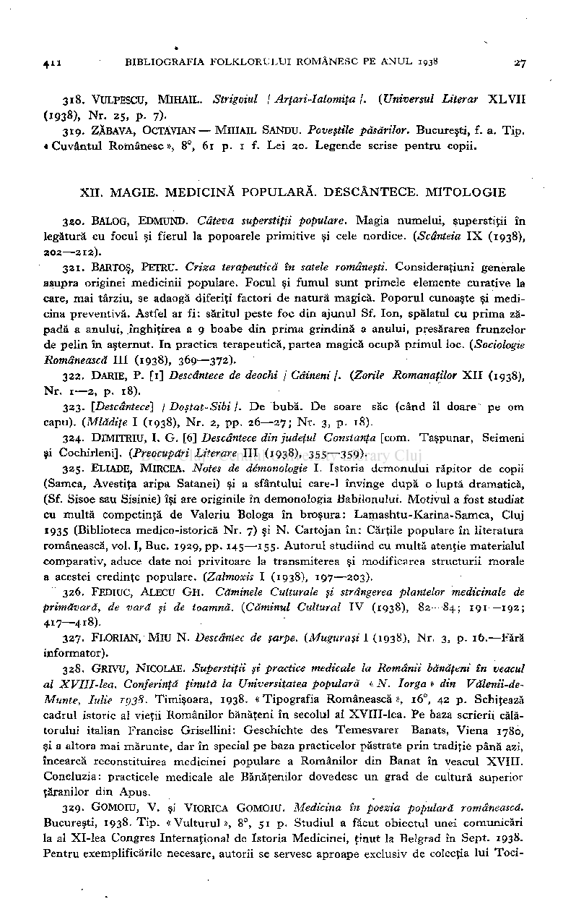

318. VULPESCU, MlHAIL. Strigoiul / Arţari-Ialomiţa /. (Universul Literar XLVI I

(1938), Nr 25, p. 7)-

319. ZĂBAVA, OCTÄVIAN—MlHAIL SANDU. Poveştile păsărilor. Bucureşti, f. a. Tip

«Cuvântul Românesc», 8°, 61 p. 1 f. Lei 20. Legende scrise pentru copii.

XII. MAGIE . MEDICIN Ă POPULARĂ . DESCÂNTECE . MITOLOGI E

3«o. BALOG, EDMUND . Câteva superstiţii populare. Magia numelui, superstiţii în legătură cu focul şi fierul la popoarele primitive şi cele nordice. (Scânteia I X (1938), 202—212).

321. BARTOŞ, PETRU. Criza terapeutică în satele româneşti. Consideraţiuni generale

asupra originei medicinii populare. Focul şi fumul sunt primele elemente curative la care, mai târziu, se adaogă diferiţi factori de natură magică. Poporul cunoaşte şi medicina preventivă. Astfel ar fi: săritul peste foc din ajunul Sf. Ion, spălatul cu prima zăpadă a anului, înghiţirea a 9 boabe din prima grindină a anului, presărarea frunzelor de pelin în aşternut. In practica terapeutică, partea magică ocupă primul loc. (Sociologie

Românească III (1938), 369—372).

- 322. DARIE, P. [I] Descântece de deochi j Câineni /. (Zorile Romanaţilor XI I (1938),

Nr. 1—2, p. 18).

- 323. [Descântece] j Doştat-Sibi /. D e bubă. D e soare săc (când îl doare pe om

capu). (Mlădiţe I (1938), Nr 2, pp. 26—27; Nr 3, p. 18).

- 324. DlMITRIU, I. G [6] Descântece din judeţul Constanţa [corn. Taşpunar, Seimeni

şi Cochirleni]. (Preocupări Literare III (1938), 355—-359).

- 325. ELIADE, MIRCEA. Notes de demonologie I. Istoria demonului răpitor de copii

(Samca, Avestiţa aripa Satanei) şi a sfântului care-1 învinge după o luptă dramatică, (Sf. Sisoe sau Sisinie) îşi are originile în demonologia Babilonului. Motivul a fost studiat cu multă competinţă de Valeriu Bologa în broşura: Lamashtu-Karina-Samca, Cluj 1935 (Biblioteca medico-istorică Nr. 7) şi N . Cartôjan în: Cărţile populare în literatura românească, vol. I, Buc. 1929, pp. 145—155. Autorul studiind cu multă atenţie materialul comparativ, aduce date noi privitoare la transmiterea şi modificarea structurii morale a acestei credinţe populare. (Zalmoxis I (1938), 197—203).

326. FEDIUC, ALECU GH Căminele Culturale şi strângerea plantelor medicinale de primăvară, de vară şi de toamnă. (Căminul Cultural I V (1938), 82—84; 191—192; 417—418).

- 327. FLORIAN, MlU N Descântec de şarpe. (Muguraşii (1938), Nr 3, p. 16.—Fără

informator).

- 328. GRIVU, NlCOLAE. Superstiţii şi practice medicale la Românii bănăţeni în veacul

al XVIII-lea. Conferinţă ţinută la Universitatea populară « N. Iorga » din Vălenii-de-

Munte, Iulie 1938. Timişoara, 1938. « Tipografia Românească », 16°, 42 p. Schiţează cadrul istoric al vieţii Românilor bănăţeni în secolul al XVIII-lea. Pe baza scrierii călătorului italian Francise Grisellini: Geschichte des Temesvarer Banats, Viena 1780, şi a altora mai mărunte, dar în special pe baza practicelor păstrate prin tradiţie până azi, încearcă reconstituirea medicinei populare a Românilor din Banat în veacul XVIII. Concluzia: practicele medicale ale Bănăţenilor dovedesc un grad de cultură superior ţăranilor din Apus.

329. GOMOIU, V . şi VIORICA GOMOIU. Medicina în poezia populară românească.

Bucureşti, 1938. Tip . «Vulturul», 8°, 51 p. Studiul a făcut obiectul unei comunicări la al XI-lea Congres Internaţional de Istoria Medicinei, ţinut la Belgrad în Sept. 1938. Pentru exemplificările necesare, autorii se servesc aproape exclusiv de colecţia lui Toci-

