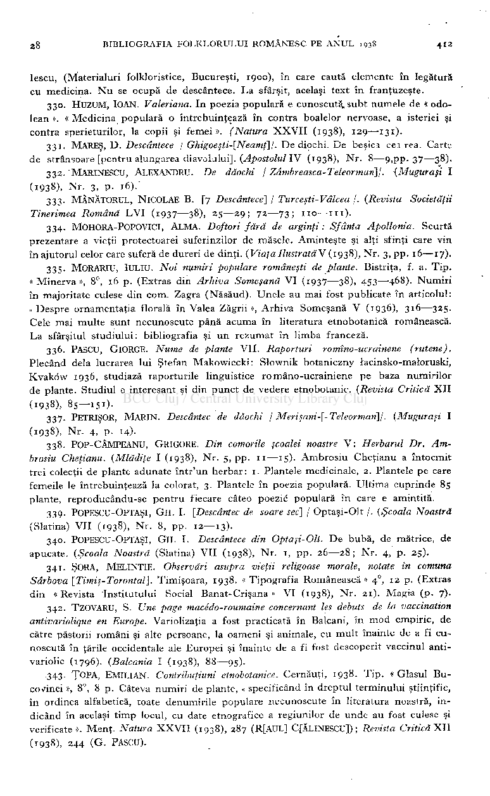

lescu, (Materialuri folkloristice, Bucureşti, 1900), în care caută elemente în legătură cu medicina. N u se ocupă de descântece. La sfârşit, acelaşi text în franţuzeşte.

- 330. HUZUM, IOAN. Valeriana. In poezia populară e cunoscută, subt numele de « odo-

lean ». « Medicina populară o întrebuinţează în contra boalelor nervoase, a isteriei şi contra sperieturilor, la copii şi femei». (Natura XXVI I (1938), 129—131).

- 331. MARES, D . Descântece I Ghigoeşti-[Neamţ]\. De diochi. De beşici cei rea. Carte

de strânsoare [pentru alungarea diavolului]. (Apostolul I V (1938), Nr. 8—9,pp. 37—38).

- 332. MARINESCU, ALEXANDRU. De dăochi / Zămbreasca-Teleorman]/. (Muguraşi I

- (1938), Nr. 3, p. 16).'

- 333. MĂNĂTORUL , NlCOLAE B. [7 Descântece] / Turceşti-Vâlcea /. (Revista Societăţii Tinerimea Română LV I (1937—38), 25—29; 72—73; 110—iii) .
- 334. MOHORA-POPOVICI, ALMA . Doftori fără de arginţi: Sfânta Apollonia. Scurtă prezentare a vieţii protectoarei suferinzilor de măsele. Aminteşte şi alţi sfinţi care vin în ajutorul celor care suferă de dureri de dinţi. (Viaţa Ilustrată V (1938), Nr. 3, pp. 16—17).
- 335. MORARIU, IULIU. Noi numiri populare româneşti de plante. Bistriţa, f. a. Tip . «Minerva», 8°, 16 p. (Extras din Arhiva Someşană V I (1937—38), 453—468). Numiri în majoritate culese din com. Zagra (Năsăud). Unele au mai fost publicate în articolul: <• Despre ornamentaţia florală în Valea Zăgrii », Arhiva Someşană V (1936), 316—325. Cele mai multe sunt necunoscute până acuma în literatura etnobotanică românească. La sfârşitul studiului: bibliografia şi un rezumat în limba franceză.
- 336. PASCU, GlORGE. Nume de plante VII Raporturi romîno-ucrainene (rutene). Plecând delà lucrarea lui Ştefan Makowiecki: Slownik botaniczny lacinsko-maloruski, Kvaköw 1936, studiază raporturile linguistice româno-ucrainiene pe baza numirilor de plante. Studiul e interesant şi din punct de vedere etnobotanic. (Revista Critică XI I (1938), 85—151)-
- 337. PETRISOR, MARIN . Descântec de dăochi j Merişani-[-Teleorman]j. (Muguraşi I

(1938), Nr. 4, p. 14).

- 338. POP-CÂMPEANU, GRIGORE. Din comorile şcoalei noastre V : Herbarul Dr. Am-

brosiu Cheţianu. (Mlădiţe I (1938), Nr. 5, pp. 11—15) . Ambrosiu Cheţianu a întocmit trei colecţii de plante adunate într'un herbar: 1. Plantele medicinale, 2. Plantele pe care femeile le întrebuinţează la colorat, 3. Plantele în poezia populară. Ultima cuprinde 85 plante, reproducându-se pentru fiecare câteo poezie populară în care e amintită.

- 339. POPESCU-OPTAŞI, GH. I. [Descântec de soare sec] / Optaşi-Olt /. (Şcoala Noastră

(Slatina) VI I (1938)- Nr. 8, pp. 12—13).

- 340. POPESCU-OPTAŞI, GH I. Descântece din Optaşi-Olt. D e bubă, de matrice, de

apucate. (Şcoala Noastră (Slatina) VI I (1938), Nr. 1, pp. 26—28; Nr. 4, p. 25).

- 341. SORA, MELINTIE. Observări asupra vieţii religoase morale, notate în comuna

Sârbova [Timiş-Torontal]. Timişoara, 1938. « Tipografia Românească » 4 , 12 p. (Extras din «Revista Institutului Social Banat-Crişana » V I (1938), Nr. 21). Magia (p. 7).

342. TZOVARU, S. Une page macédo-roumaine concernant les débuts de la vaccination antivariolique en Europe. Variolizaţia a fost practicată în Balcani, în mod empiric, de către păstorii români şi alte persoane, la oameni şi animale, cu mult înainte de a fi cunoscută în ţările occidentale ale Europei şi înainte de a fi fost descoperit vaccinul antivariolic (1796). (Balcania I (1938), 88—95).

.343. ŢOPA, EMIUAN . Contribuţiuni etnobotanice. Cernăuţi, 1938. Tip . « Glasul Bucovinei », 8°, 8 p. Câteva numiri de plante, « specificând în dreptul terminului ştiinţific, în ordinea alfabetică, toate denumirile populare necunoscute în literatura noastră, indicând în acelaşi timp locul, cu date etnografice a regiunilor de unde au fost culese şi verificate ». Menţ. Natura XXVI I (1938), 287 (R[AUL] C[ĂLINESCU]) ; Revista Critică XI I (1938), 244 (G . PASCU).

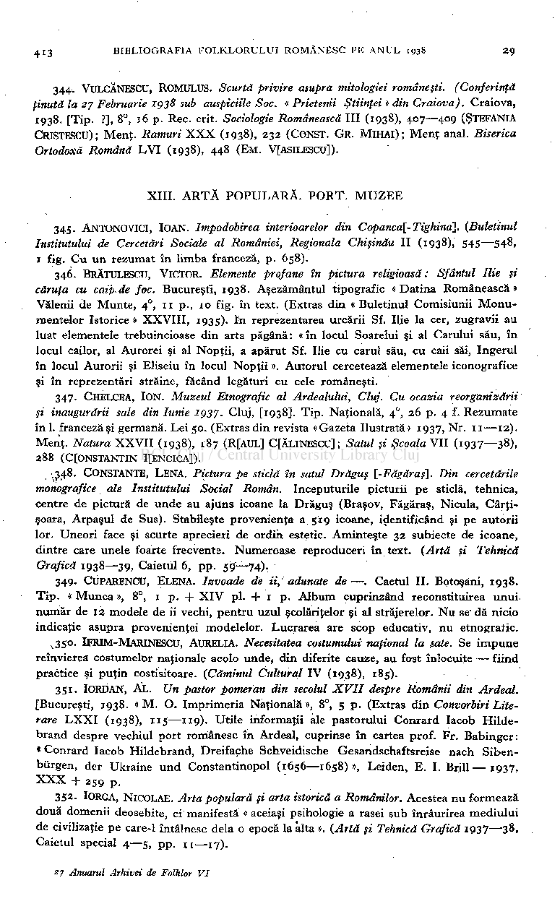

344. VULCĂNESCU, ROMULUS. Scurtă privire asupra mitologiei româneşti. (Conferinţă

ţinută la 27 Februarie 1938 sub auspiciile Soc. «Prietenii Ştiinţei » din Craiova). Craiova, 1938. [Tip. ?], 8°, 16 p. Rec. crit. Sociologie Românească III (1938), 407—409 (ŞTEFANIA CRISTESCU); Menţ. Ramuri XX X (1938), 232 (CONST. GR. MlHAl); Menţ anal. Biserica Ortodoxă Română LV I (1938), 448 (EM. VfASILESCU]).

#### XIII. ART Ă POPULARĂ . PORT . MUZE E

- 345. ANTONOVICI, IOAN. împodobirea interioarelor din Copanca[-Tighina]. (Buletinul Institutului de Cercetări Sociale al României, Regionala Chişinău I I (1938), 545—548, 1 fig. C u un rezumat în limba franceză, p. 658).
- 346. BRĂTULESCU, VICTOR. Elemente profane în pictura religioasă : Sfântul Ilie şi căruţa cu caipde foc. Bucureşti, 1938. Aşezământul tipografic « Datina Românească » Vălenii de Munte, 4

, n p., 10 fig. în text. (Extras din «Buletinul Comisiunii Monu mentelor Istorice » XXVIII , 1935). în reprezentarea urcării Sf. Ilie la cer, zugravii au luat elementele trebuincioase din arta păgână : « în locul Soarelui şi al Carului său, în locul cailor, al Aurorei şi al Nopţii, a apărut Sf. Ilie cu carul său, cu caii săi, îngerul în locul Auroră şi Eliseiu în locul Nopţii ». Autorul cercetează elementele iconografice şi în reprezentări străine, făcând legături cu cele româneşti.

0

347. CHELCEA, ION. Muzeul Etnografic al Ardealului, Cluj. Cu ocazia reorganizării şi inaugurării sale din Iunie 1937. Cluj, [1938]. Tip . Naţională, 4

, 26 p. 4 f. Rezumate în 1. franceză şi germană. Lei 50. (Extras din revista «Gazeta Ilustrată» 1937, Nr. 11—12) . Menţ. Natura XXVI I (1938), 187 (R[AUL] C[ĂLINESCU] ; Satul şi ŞcoalaVll (1937—38), 288 (C[ONSTANTIN I[ENCICA]).

0

•.348. CONSTANTE, LENA. Pictura pe sticlă în satul Drăguţ l-Făgăraş]. Din cercetările monografice ale Institutului Social Român. începuturile picturii pe sticlă, tehnica, centre de pictură de unde au ajuns icoane la Drăguş (Braşov, Făgăraş, Nicula, Cârţişoara, Arpaşul de Sus). Stabileşte provenienţa a 519 icoane, identificând şi pe autorii lor. Uneori face şi scurte aprecieri de ordin estetic. Aminteşte 32 subiecte de icoane, dintre care unele foarte frecvente. Numeroase reproduceri în text. (Artă şi Tehnică Grafică 1938—39, Caietul 6, pp. 59—74).

349. CUPARENCU, ELENA. Izvoade de ii, adunate de—. Caetul II . Botoşani, 1938. Tip. « Munca », 8°, 1 p. + XI V pl. + 1 p. Album cuprinzând reconstituirea unui. număr de 12 modele de ii vechi, pentru uzul şcolăriţelor şi al străjerelor. N u se' dă nicio indicaţie asupra provenienţei modelelor. Lucrarea are scop educativ, nu etnogratic.

^350. IFRIM-MARINESCU, AURELIA. Necesitatea costumului naţional la ßate. Se impune reînvierea costumelor naţionale acolo unde, din diferite cauze, au fost înlocuite — fiind practice şi puţin costisitoare. (Căminul Cultural I V (1938), 185).

351. IORDAN, AL Un pastor pomeran din secolul XVII despre Românii din Ardeal. [Bucureşti, 1938. « M . O . Imprimeria Naţională », 8°, 5 p. (Extras din Convorbiri Literare LXX I (1938), 115—119). Utile informaţii ale pastorului Conrard Iacob Hildebrand despre vechiul port românesc în Ardeal, cuprinse în cartea prof. Fr. Babinger: « Conrard Iacob Hildebrand, Dreifache Schveidische Gesandschaftsreise nach Sibenbürgen, der Ukraine und Constantinopol (1656—1658)», Leiden, E . I. Brill— 1937, XX X + 259 p.

- 352. lORGA, NlCOLAE. Arta populară şi arta istorică a Românilor. Acestea nu formează

două domenii deosebite, ci manifestă «aceiaşi psihologie a rasei sub înrâurirea mediului de civilizaţie pe care-1 întâlnesc delà o epocă la alta ». (Artă şi Tehnică Grafică 1937—38, Caietul special 4—5, pp. n— 17) .

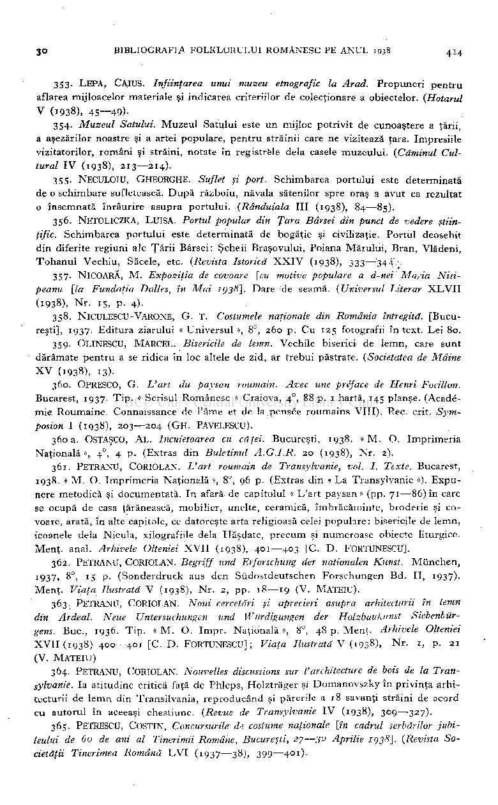

- 353. LEPA, CAIUS. înfiinţarea unui muzeu etnografic la Arad. Propuneri pentru

aflarea mijloacelor materiale şi indicarea criteriilor de colecţionare a obiectelor. (Hotarul

V (1938), 45—49)-

- 354. Muzeul Satului. Muzeul Satului este un mijloc potrivit de cunoaştere a ţării,

a aşezărilor noastre şi a artei populare, pentru străinii care ne vizitează ţara. Impresiile vizitatorilor, români şi străini, notate în registrele delà casele muzeului. (Căminul Cul­

tural I V (1938), 213—214).

- 355. NECULOIU, GHEORGHE. Suflet şi port. Schimbarea portului este determinată

de o schimbare sufletească. După războiu, năvala sătenilor spre oraş a avut ca rezultat

- o însemnată înrâurire asupra portului. (Rânduiala III (1938), 84—85).

- 356. NETOLICZKA, LUISA. Portul popular din Ţara Bârsei din punct de vedere ştiin­

ţific. Schimbarea portului este determinată de bogăţie şi civilizaţie. Portul deosebit din diferite regiuni ale Ţării Bârsei: Şcheii Braşovului, Poiana Mărului, Bran, Vlădeni, Tohanul Vechiu, Săcele, etc. (Revista Istorică XXI V (1938), 333—'34 .\ •

357. NlCOARĂ, M Expoziţia de covoare [cu motive populare a d-nei Maria Nisipeanu [la Fundaţia Dalles, în Mai 1938]. Dare de seamă. (Universul Literar XLVI I

(1938), Nr 15, p. 4).

- 358. NlCULESCU-VARONE, G . T Costumele naţionale din România întregită. [Bucu­

reşti], 1937. Editura ziarului « Universul », 8°, 260 p. C u 125 fotografii în text. Lei 80.

- 359. OLINESCU, MARCEL . Bisericile de lemn. Vechile biserici de lemn, care sunt

dărâmate pentru a se ridica în loc altele de zid, ar trebui păstrate. (Societatea de Mâine

X V (1938), 13).

- 360. OPRESCO, G . L'art du paysan roumain. Avec une préface de Henri Focillon.

, 88 p. 1 hartă, 145 planşe. (Académie Roumaine. Connaissance de l'âme et de la pensée roumains VIII). P.ec. crit. Sym­

Bucarest, 1937. Tip . « Scrisul Românesc » Craiova, 4

0

posion I (1938), 203—204 (GH . PAVELESCU).

- 360a. OSTAŞCO, AL lncuietoarea cu căţei. Bucureşti, 1938. «M . O Imprimeria

Naţională », 4

0

, 4 p. (Extras din Buletinul A.G.I.R. 20 (1938), Nr 2).

- 361. PETRANU, CORIOLAN. L'art roumain de Transylvanie, vol. I. Texte. Bucarest,

1938. « M . O . Imprimeria Naţională », 8°, 96 p. (Extras din « La Transylvanie »). Expunere metodică şi documentată. In afară de capitolul « L'art paysan » (pp. 71—86) în care se ocupă de casa ţărănească, mobilier, unelte, ceramică, îmbrăcăminte, broderie şi covoare, arată, în alte capitole, ce datoreşte arta religioasă celei populare: bisericile de lemn, icoanele delà Nicula, xilografiile delà Hăşdate, precum şi numeroase obiecte liturgice., Menţ. anal. Arhivele Olteniei XVI I (1938), 401—403 [C. D . FORTUNESCU].

362. PETRANU, CORIOLAN. Begriff und Erforschung der nationalen Kunst. München,

!937> &°> 15 p. (Sonderdruck aus den Südostdeutschen Forschungen Bd. II, 1937).

Menţ. Viaţa Ilustrată V (1938), Nr 2, pp. 18—19 (V. MATEIU).

363. PETRANU, CORIOLAN. Noui cercetări şi aprecieri asupra arhitecturii în lemn din Ardeal. Neue Untersuchungen und Würdigungen der Holzbaukunst Siebenbürgens. Buc 1936. Tip. « M . O . Impr. Naţională », 8°, 48 p. Menţ. Arhivele Olteniei XVII (1938) 400—401 [C. D . FORTUNESCU] ; Viaţa Ilustrată V (1938), Nr 1, p. 21

(V. MATEIU )

364. PETRANU, CORIOLAN. Nouvelles discussions sur l'architecture de bois de la Transylvanie. Ia atitudine critică faţă de Phleps, Holzträger şi Domanovszky în privinţa arhitecturii de lemn din Transilvania, reproducând şi părerile a 18 savanţi străini de acord cu autorul în aceeaşi chestiune. (Revue de Transylvanie I V (1938), 309—327).

- 365. PETRESCU, COSTIN, Concursurile d? costume naţionale [în cadrul serbărilor jubi­

leului de 60 de ani al Tinerimii Române, Bucureşti, 27—3° Aprilie 1938]. (Revista Societăţii Tinerimea Română LV I (1937—38), 399—401).

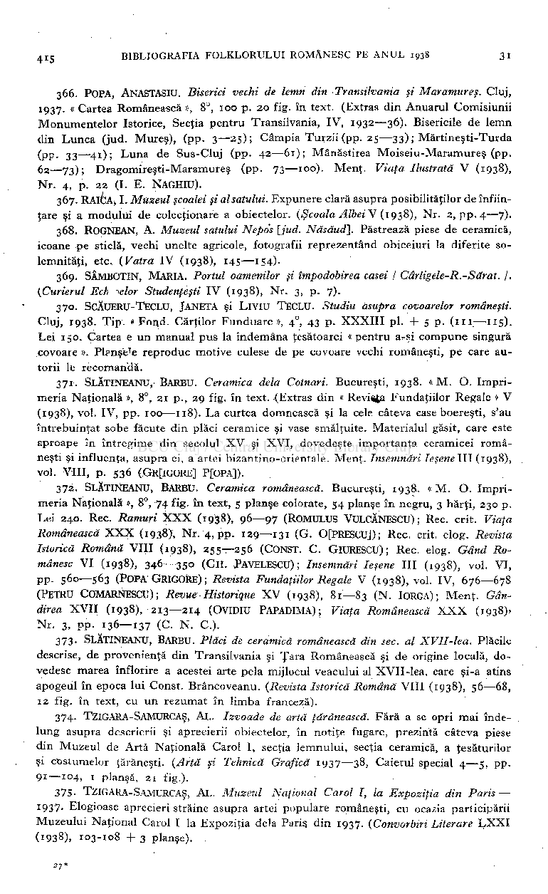

- 366. POPA, ANASTASIU. Biserici vechi de lemn din Transilvania şi Maramureş. Cluj,

1937. « Cartea Românească », 8°, 100 p. 20 fig. în text. (Extras din Anuarul Comisiunii Monumentelor Istorice, Secţia pentru Transilvania, IV , 1932—36). Bisericile de lemn din Lunca (jud. Mureş), (pp. 3—25); Câmpia Turzii (pp. 25—33) ; Mărtineşti-Turda (PP- 33—4

); Luna de Sus-Cluj (pp. 42—61); Mănăstirea Moiseiu-Maramureş (pp. 62—73); Dragomireşti-Maramureş (pp. 73—100). Menţ. Viaţa Ilustrată V (1938), Nr. 4, p. 22 (I. E. NAGHIU).

1

- 367. RAICA, I. Muzeul şcoalei şi al satului. Expunere clară asupra posibilităţilor de înfiin­

ţare şi a modului de colecţionare a obiectelor. (Şcoala Albei V (1938), Nr. 2, pp. 4—7).

- 368. ROGNEAN, A Muzeul satului Nepo's [jud. Năsăud]. Păstrează piese de ceramică,

icoane pe sticlă, vechi unelte agricole, fotografii reprezentând obiceiuri la diferite solemnităţi, etc. (Vatra I V (1938), 145—154).

- 369. SÂMBOTIN, MARIA . Portul oamenilor şi împodobirea casei / Cărligele-R.-Sărat. j.

(Curierul Ech ^elor Studenţeşti I V (1938), Nr. 3, p. 7).

- 370. SCĂUERU-TECLU, JANETA şi LlVIU TECLU. Studiu asupra covoarelor româneşti.

#### Cluj, 1938. Tip . « Fond. Cărţilor Funduare », 4

, 43 p. XXXII I pl. + 5 p. (111—115) . Lei 150. Cartea e un manual pus la îndemâna ţesătoarei «pentru a-şi compune singură covoare ». Planşe'e reproduc motive culese de pe covoare vechi româneşti, pe care autorii le recomandă.

0

- 371. SLĂTINEANU, BARBU. Ceramica delà Cotnari. Bucureşti, 1938. « M . O . Imprimeria Naţională », 8°, 21 p., 29 fig. în text. {Extras din « RevUja Fundaţiilor Regale » V (1938), vol. IV, pp. 100—118). La curtea domnească şi la cele câteva case boereşti, s'au întrebuinţat sobe făcute din plăci ceramice şi vase smălţuite. Materialul găsit, care este aproape în întregime din secolul X V şi XVI , dovedeşte importanţa ceramicei româneşti şi influenţa, asupra ei, a artei bizantino-orientale. Menţ. însemnărileşenelll (1938), voi. VIII, p. 536 (GR[lGORE] PfOPA]).
- 372. SLĂTINEANU, BARBU. Ceramica românească. Bucureşti, 1938. « M . O . Imprimeria Naţională », 8°, 74 fig. în text, 5 planşe colorate, 54 planşe în negru, 3 hărţi, 230 p. Lei 240. Rec. Ramuri XX X (1938), 9°—97 (ROMULUS VULCĂNESCU) ; Rec. crit. Viaţa Românească XXX (1938), Nr. 4, pp. 129—131 (G . 0[PRESCU]); Rec. crit. elog. Revista Istorică Română VIII (1938), 255—256 (CONST. C . GlURESCU) ; Rec. elog. Gând Românesc V I (1938), 346—350 (GH . PAVELESCU); însemnări Ieşene III (1938), vol. VI , pp. 560—563 (POPA GRIGORE) ; Revista Fundaţiilor Regale V (1938), vol. IV, 676—678 (PETRU COMARNESCU) Revue Historique X V (1938), 81—83 (N. IORGA) ; Menţ. Gândirea XVI I (1938), 213—214 (OVIDIU PAPADIMA); Viaţa Românească XX X (1938)» Nr. 3, PP- 136—137 (C. N . C) .
- 373. SLĂTINEANU, BARBU. Plăci de ceramică românească din sec. al XVII-lea. Plăcile descrise, de provenienţă din Transilvania şi Ţara Românească şi de origine locală, dovedesc marea înflorire a acestei arte pela mijlocul veacului al XVII-lea, care şi-a atins apogeul în epoca lui Const. Brâncoveanu. (Revista Istorică Română VIII (1938), 56—68, 12 fig. în text, cu un rezumat în limba franceză).
- 374. TZIGARA-SAMURCAŞ, AL Izvoade de artă ţărănească. Fără a se opri mai îndelung asupra descrierii şi aprecierii obiectelor, în notiţe fugare, prezintă câteva piese din Muzeul de Artă Naţională Carol I, secţia lemnului, secţia ceramică, a ţesăturilor şi costumelor ţărăneşti. (Artă şi Tehnică Grafică 1937—38, Caietul special 4—5, pp9

—104. 1 planşă, 21 fig.).

- 1

375- TZIGARA-SAMURCAŞ, Al. Muzeul Naţional Carol I, la Expoziţia din Paris 1937- Elogioase aprecieri străine asupra artei populare româneşti, cu ocazia participării Muzeului Naţional Carol I la Expoziţia delà Paris din 1937. (Convorbiri Literare LXX I (1938), 103-108 + 3 planşe).

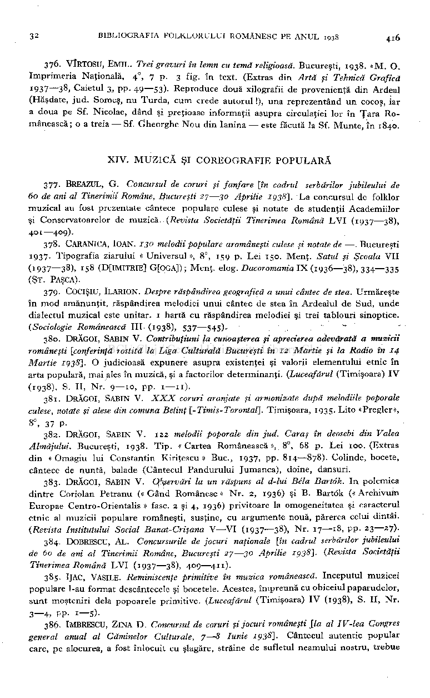

376. VÎRTOSU, EMIL. Trei gravuri în lemn cu temă religioasă. Bucureşti, 1938. «M. O Imprimeria Naţională, 4

, 7 p. 3 fig. în text. (Extras din Artă şi Tehnică Grafică

0

» Caietul 3, pp. 49—53). Reproduce două xilografii de provenienţă din Ardeal (Hăşdate, jud. Someş, nu Turda, cum crede autorul !), una reprezentând un cocoş, iar a doua pe Sf. Nicolae, dând şi preţioase informaţii asupra circulaţiei lor în Ţara Românească ; o a treia — Sf. Öheorghe Nou din Ianina — este făcută la Sf. Munte, în 1840.

1937—3

8

XIV . MUZIC Ă ŞI COREOGRAFI E POPULAR Ă

377. BREAZUL, G Concursul de coruri şi fanfare [în cadrul serbărilor jubileului de 60 de ani al Tinerimii Române, Bucureşti 27—30 Aprilie 1938]. La concursul de folklor

muzical au fost prezentate cântece populare culese şi notate de studenţii Academiilor

şi Conservatoarelor de muzică. (Revista Societăţii Tinerimea Română LV I (1937—38), 401—409).

378. CARANICA, IOAN. 130 melodii populare aromâneşti culese şi notate de —. Bucureşti

1937. Tipografia ziarului «Universul», 8°, 159 p. Lei 150. Menţ. Satul şi Şcoala VI I

(1937—38), 158 (D[IMITRIE] GfOGA]); Menţ. elog. Dacoromania IX (1936—38), 334—335

(ŞT. PASCA).

379. COCIŞIU, ILARION. Despre răspândirea geografică a unui cântec de stea. Urmăreşte

în mod amănunţit, răspândirea melodiei unui cântec de stea în Ardealul de Sud, unde dialectul muzical este unitar. 1 hartă cu răspândirea melodiei şi trei tablouri sinoptice.

(Sociologie Românească III (1938), 537—.545). ~

380. DRĂGOI, SABIN V. Contribuţiuni la cunoaşterea şi aprecierea adevărată a muzicii româneşti [conferinţă rostită la Liga Culturală Bucureşti în 12 Martie şi la Radio în 14

Martie 1938}. O judicioasă expunere asupra existenţei şi valorii elementului etnic în arta populară, mai ales în muzică, şi a factorilor determinanţi. (Luceafărul (Timişoara) I V

(1938), S. II, Nr. 9—10, pp 1—11).

381. DRĂGOI, SABIN V XXX coruri aranjate şi armonizate după melodiile poporale culese, notate şi alese din comuna Belinţ [-Timiş-Torontal]. Timişoara, 1935. Lito «Pregler», 8°, 37 P-

- 382. DRĂGOI, SABIN V . 122 melodii poporale din jud. Caras în deosebi din Valea

Almăjului. Bucureşti, 1938. Tip . «Cartea Românească », 8°, 68 p. Lei 100. (Extras din « Omagiu lui Constantin Kiriţescu » Buc , 1937, pp. 814—878). Colinde, bocete, cântece de nuntă, balade (Cântecul Pandurului Jumanca), doine, dansuri.

- 383. DRĂGOI, SABIN V Observări la un răspuns al d-lui Bêla Bartok. In polemica

dintre Coriolan Petranu (« Gând Românesc » Nr. 2, 1936) şi B . Bartök (« Archivum Europae Centro-Orientalis » fase. 2 şi 4, 1936) privitoare la omogeneitatea şi caracterul etnic al muzicii populare româneşti, susţine, cu argumente nouă, părerea celui dintâi.

(Revista Institutului Social Banat-Crişana V —V I (1937—38), Nr 17—18, pp. 23—27).

- 384. DOBRESCU, AL Concursurile de jocuri naţionale [în cadrul serbărilor jubileului de 60 de ani al Tinerimii Române, Bucureşti 27—30 Aprilie 1938}- (Revista Societăţii Tinerimea Română LV I (1937—38), 409—411).
- 385. IJAC, VASILE. Reminiscenţe primitive în muzica românească. începutul muzicei

populare l-au format descântecele şi bocetele. Acestea, împreună cu obiceiul paparudelor, sunt moşteniri delà popoarele primitive. (Luceafărul (Timişoara) I V (1938), S. II, Nr. 3—4, PP- 1—5)-

386. IMBRESCU, ZlNA D . Concursul de coruri şi jocuri româneşti lia al IV-lea Congres general anual al Căminelor Culturale, 7—8 Iunie 1938]. Cântecul autentic popular

care, pe alocurea, a fost înlocuit cu şlagăre, străine de sufletul neamului nostru, trebue

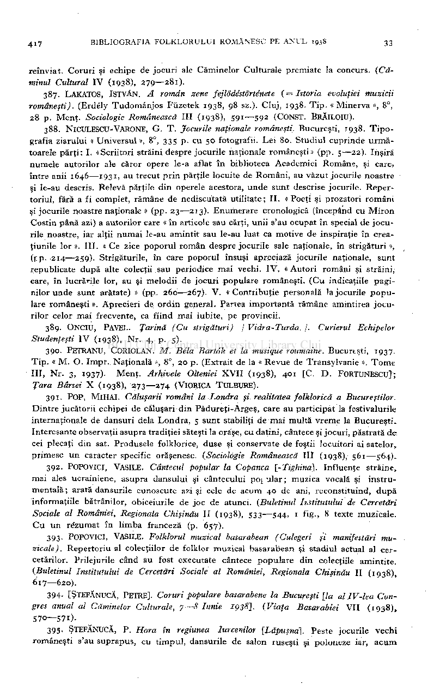

reînviat. Coruri şi echipe de jocuri ale Căminelor Culturale premiate la concurs. (Că­

minul Cultural I V (1938), 279—281).

387. LAKATOS, ISTVAN. A român zene fejlodéstorténete ( = Istoria evoluţiei muzicii

româneşti). (Erdély Tudomânjos Füzetek 1938, 98 sz.). Cluj, 1938. Tip . « Minerva », 8°,

28 p. Menţ. Sociologie Românească III (1938), 591—592 (CONST. BRĂILOIU).

388. NlCULESCU-VARONE, G. T . Jocurile naţionale româneşti. Bucureşti, 1938. Tipo­

grafia ziarului « Universul », 8°, 335 p. cu 50 fotografii. Lei 80. Studiul cuprinde următoarele părţi: I. «Scriitori străini despre jocurile naţionale româneşti» (pp. 5—22). înşiră numele autorilor ale căror opere le-a aflat în biblioteca Academiei Române, şi care, între anii 1646—1931, au trecut prin părţile locuite de Români, au văzut jocurile noastre şi le-au descris. Relevă părţile din operele acestora, unde sunt descrise jocurile. Repertoriul, fără a fi complet, rămâne de nediscutată utilitate ; II. « Poeţi şi prozatori români şi jocurile noastre naţionale » (pp. 23—213). Enumerare cronologică (începând cu Miron Costin până azi) a autorilor care « în articole sau cărţi, unii s'au ocupat în special de jocurile noastre, iar alţii numai le-au amintit sau le-au luat ca motive de inspiraţie în creaţiunile lor». III. « C e zice poporul român despre jocurile sale naţionale, în strigături», (pp. 214—259). Strigăturile, în care poporul însuşi apreciază jocurile naţionale, sunt republicate după alte colecţii,sau periodice mai vechi. IV . «Autori români şi străini, care, în lucrările lor, au şi melodii de jocuri populare româneşti. (Cu indicaţiile paginilor unde sunt arătate) » (pp. 260—267). V . « Contribuţie personală la jocurile populare româneşti ». Aprecieri de ordin general. Partea importantă rămâne amintirea jocurilor celor mai frecvente, ca fiind mai iubite, pe provincii.

- 389. ONCIU, PAVEL. Ţarină (Cu strigături) j Vidra-Turda. j . Curierul Echipelor

Studenţeşti I V (1938), Nr. 4, p. 5).

- 390. PETRANU, CORIOLAN. M. Béla Bartok et la musique roumaine. Bucurtşti, 1937.

Tip. « M . O . Impr. Naţională », 8°, 20 p. (Extrait de la « Revue de Transylvanie ». Tom e

III, Nr 3, 1937). Menţ. Arhivele Olteniei XVII (1938), 401 [C. D . FORTUNESCU] ; Ţara Bârsei X (1938), 273—274 (VIORICA TULBURE).

391. POP, MlHAI. Căluşarii români la Londra şi realitatea folklorică a Bucureştilor.

Dintre jucătorii echipei de căluşari din Pădureţi-Argeş, care au participat la festivalurile internaţionale de dansuri delà Londra, 5 sunt stabiliţi de mai multă vreme la Bucureşti. Interesante observaţii asupra tradiţiei săteşti la oraşe, cu datini, cântece şi jocuri, păstrată de cei plecaţi din sat. Produsele folklorice, duse şi conservate de foştii locuitori ai satelor, primesc un caracter specific orăşenesc. (Sociologie Românească III (1938), 561—5*4).

392. POPOVICI, VASILE. Cântecul popular la Copanca [-Tighină]. Influenţe străine,

mai ales ucrainiene, asupra dansului şi cântecului poi ular ; muzica vocală şi instrumentală ; arată dansurile cunoscute azi şi cele de acum 40 de ani, reconstituind, după informaţiile bătrânilor, obiceiurile de joc de atunci. (Buletinul Institutului de Cercetări

Sociale al României, Regionala Chişinău II (1938), 533—544, 1 fig., 8 texte muzicale.

C u un rezumat în limba franceză (p. 657).

393. POPOVICI, VASILE. Folklorul muzical basarabean (Culegeri şi manifestări mu­

zicale ). Repertoriu al colecţiilor de folklor muzical basarabean şi stadiul actual al cercetărilor. Prilejurile când au fost executate cântece populare din colecţiile amintite.

(Buletinul Institutului de Cercetări Sociale al României, Regionala Chişinău II (1938), 617—620).

- 394- [ŞTEFĂNUCĂ, PETRE]. Coruri populare basarabene la Bucureşti [la al IV-lea Congres anual al Căminelor Culturale, 7 —8 Iunie 1938]. (Viaţa Basarabiei VI (1938), 570—571).
- 395. ŞTEFĂNUCĂ, P. Hora în regiunea Iurcenilor [Lăpuşna]. Peste jocurile vechi

româneşti s'au suprapus, cu timpul, dansurile de salon ruseşti şi poloneze iar, acum

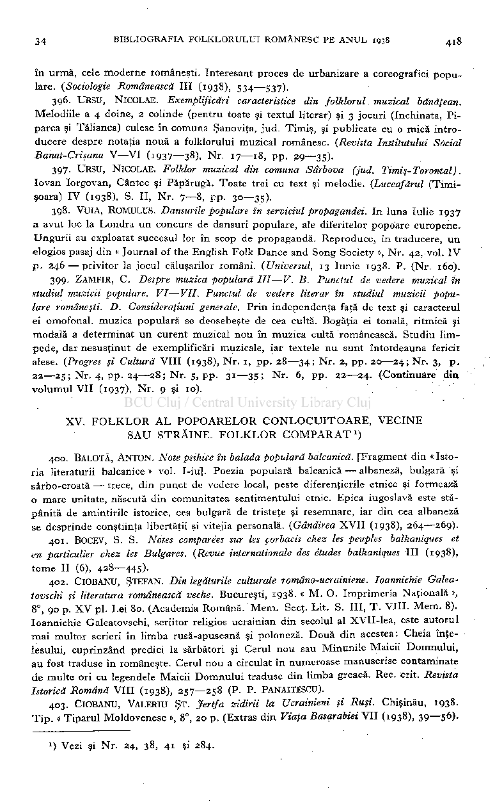

### în urmă, cele moderne româneşti. Interesant proces de urbanizare a coreografiei populare. (Sociologie Românească III (1938), 534—537).

- 396. URSU, NlCOLAE. Exemplificări caracteristice din folklorul. muzical bănăţean. Melodiile a 4 doine, 2 colinde (pentru toate şi textul literar) şi 3 jocuri (închinata, Piparca şi Tălianca) culese în comuna Şanoviţa, jud. Timiş, şi publicate cu o mică introducere despre notaţia nouă a folklorului muzical românesc. (Revista Institutului Social Banat-Crişana V—V I (1937—38), Nr. 17—18, pp. 29—35).
- 397. URSU, NlCOLAE. Folklor muzical din comuna Sârbova (jud. Timiş-Torontal). Iovan Iorgovan, Cântec şi Păpârugă. Toate trei cu text şi melodie. (Luceafărul (Timişoara) I V (1938), S. II, Nr. 7—8, pp. 30—35).
- 398. VUIA, ROMÜLUS. Dansurile populare în serviciul propagandei. In luna Iulie 1937 a avut loc la Londra un concurs de dansuri populare, ale diferitelor popoare europene. Ungurii au exploatat succesul lor în scop de propagandă. Reproduce, în traducere, un elogios pasaj din « Journal of the English Folk Dance and Song Society », Nr. 42, vol. I V

- p 246 — privitor la jocul căluşarilor români. (Universul, 13 Iunie 1938. P. (Nr. 160).

- 399. ZAMFIR, C . Despre muzica populară III—V. B. Punctul de vedere muzical în studiul muzicii populare. VI—VII. Punctul de vedere literar în studiul muzicii populare româneşti. D. Consideraţiuni generale. Prin independenţa faţă de text şi caracterul ei omofonal, muzica populară se deosebeşte de cea cultă. Bogăţia ei tonală, ritmică şi modală a determinat un curent muzical nou în muzica cultă românească. Studiu limpede, dar nesusţinut de exemplificări muzicale, iar textele nu sunt întotdeauna fericit alese. (Progres şi Cultură VIII (1938), Nr. 1, pp. 28—34; Nr. 2, pp. 20—24; Nr. 3, p . 22—25; Nr. 4, pp. 24—28; Nr. 5, pp. 31—35 ; Nr. 6, pp. 22—24. (Continuare d m volumul VI I (1937), Nr. 9 şi 10).

### XV . FOLKLO R A L POPOARELO R CONLOCUITOARE , VECIN E SA U STRĂINE . FOLKLO R COMPARAT

)

1

400. BALOTĂ, ANTON. Note psihice în balada populară balcanică. [Fragment din « Istoria literaturii balcanice» voi. I-iu]. Poezia populară balcanică — albaneză, bulgară şi sârbo-croată — trece, din punct de vedere local, peste diferenţierile etnice şi formează o mare unitate, născută din comunitatea sentimentului etnic. Epica iugoslavă este stăpânită de amintirile istorice, cea bulgară de tristeţe şi resemnare, iar din cea albaneză se desprinde conştiinţa libertăţii şi vitejia personală. (Gândirea XVI I (1938), 264—269).

- 401. BOCEV, S. S. Notes comparées sur les çorbacis chez les peuples balkaniques et

en particulier chez les Bulgares. (Revue internationale des études balkaniques III (1938), tome II (6), 428—445).

- 402. ClOBANU, ŞTEFAN. Din legăturile culturale româno-ucrainiene. Ioannichie Galea-

tovschi şi literatura românească veche. Bucureşti, 1938. « M . O. Imprimeria Naţională », 8°, 90 p. X V pl. Lei 80. (Academia Română. Mem . Secţ. Lit. S. III, T . VIII. Mem 8). Ioannichie Galeatovschi, scriitor religios ucrainian din secolul al XVII-lea, este autorul mai multor scrieri în limba rusă-apuseană şi poloneză. Două din acestea: Cheia înţelesului, cuprinzând predici la sărbători şi Cerul nou sau Minunile Maicii Domnului, au fost traduse în româneşte. Cerul nou a circulat în numeroase manuscrise contaminate de multe ori cu legendele Maicii Domnului traduse din limba greacă. Rec. crit. Revista Istorică Română VIII (1938), 257—258 (P. P. PANAITESCU).

403. ClOBANU, VALERIU ŞT. Jertfa zidirii la Ucrainieni şi Ruşi. Chişinău, 1938. Tip . « Tiparul Moldovenesc », 8°, 20 p. (Extras din Viaţa Basarabiei VI I (1938), 39—56).

) Vezi şi Nr. 24, 38, 41 şi 284.

J

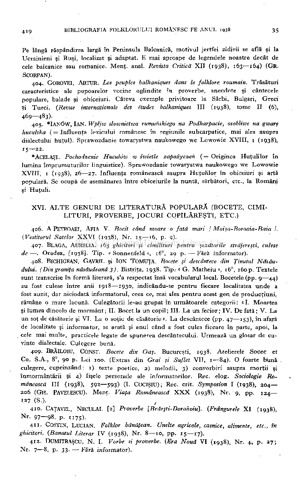

Pe lângă răspândirea largă în Peninsula Balcanică, motivul jertfei zidirii se află şi la Ucrainieni şi Ruşi, localizat şi adaptat. E mai aproape de legendele noastre decât de cele balcanice sau romanice. Menţ. anal. Revista Critică XI I (1938), 163—164) (GR.

SCORPAN).

404. GOROVEI, ARTUR. Les peuples balkaniques dans le folklore roumain. Trăsături

caracteristice ale popoarelor vecine oglindite în proverbe, anecdote şi cântecele populare, balade şi obiceiuri. Câteva exemple privitoare la Sârbi, Bulgari, Greci

Şi Turci. (Revue internationale des études balkaniques III (1938), tome II (6), 469—483).

405. *lANÖW, IAN. Wpljw slownictwa rumunskiego na Podkarpacie, osobliwe na gware

huculska ( = Influenţa lexicului românesc în regiunile subcarpatice, mai ales asupra dialectului huţul). Sprawozdanie towarystwa naukowego we Lowowie XVIII, 1 (1938),

15—22.

* ACELAŞI. Pochodzenie HucuUw w swietle zapozyczen ( = Originea Huţulilor în

lumina împrumuturilor linguistice). Sprawozdanie towarystwa naukowego we Lowowie XVIII, i (r938), 26—27. Influenţa românească asupra Huţulilor în obiceiuri şi artă populară. Se ocupă de asemănarea între obiceiurile la nuntă, sărbători, etc., la Români şi Huţuli.

XVI . ALT E GENUR I D E LITERATUR Ă POPULAR Ă (BOCETE , CIMI LITURI , PROVERBE , JOCUR I COPILĂREŞTI , ETC. )

- 406. A PETROAEI, AFIA V. Bocit când moare o fată mari \ Moişa-Boroaia-Baia /.

(Vestitorul Satelor XXV I (1938), Nr 15—16, p. 9).

- 407. BLAGA, AURELIA. 165 ghicitori şi cimilituri pentru şezătorile străjereşti, culese

de — . Oradea, [1938]. Tip . « Sonnenfeld », 16°, 29 p. — Fără informator).

- 408. BlCHIGEAN, GAVRIL şi ION TOMUŢA. Bocete şi descântece din Ţinutul Ndsău-

dului. (Din graniţa nâsăudeană 3). Bistriţa, 1938. Tip.-« G . Matheiu », 16°, 160 p. Textele sunt transcrise în formă literară, s'a respectat însă vocabularul local. Bocetele (pp. 9—44) au fost culese între anii 1918—1930, indicându-se pentru fiecare localitatea unde a fost auzit, dar niciodată informatorul, ceea ce, mai ales pentru acest gen de producţiuni, rămâne o mare lacună. Culegătorii le-au grupat în următoarele categorii: «I. Moartea şi lumea dincolo de mormânt; II. Bocet la un copil; III. L a un fecior; IV . De fată; V . L a un soţ de căsătorie şi VI . La o soţie de căsătorie ». La descântece (pp. 47—153), în afară de localitate şi informator, se arată şi anul când a fost cules fiecare în parte, apoi, la cele mai multe, practicele legate de spunerea descântecului. Urmează un glosar de cuvinte dialectale. Culegere bună.

409. BRĂILOIU, CONST. Bocete din Oaş. Bucureşti, 1938. Atelierele Socec et Co. S.A., 8°, 90 p. Lei 100. (Extras din Grai şi Suflet VII, 1—84). O foarte bună culegere, cuprinzând: 1) texte poetice, 2) melodii, 3) convorbiri asupra morţii şi înmormântării şi 4) fişele personale ale informatorilor. Rec. elog. Sociologie Ro­

mânească III (1938), 592—593) (I. COCIŞIU); Rec. crit. Symposion I (1938), 204206 (GH. PAVELESCU). Menţ. Viaţa Românească XX X (1938), Nr 9, pp 124127 (S.). ,

- 410. CAŢAVEL, NECULAI. [2] Proverbe [Brăeşti-Dorohoiu]. (Frângurele X I (1938),

Nr. 97—98, p. 1175).

- 411. COSTIN, LUCIAN. Folklor bănăţean. Unelte agricole, casnice, alimente, etc., în

ghicitori. (Banatul Literar I V (1938), Nr 8—10, pp 15—17).

- 412. DUMITRAŞCU, N . I. Vorbe si proverbe. {Era Nouă VI (1938), Nr. 4, p. 27;

Nr. 7—8, p. 33. — Fără informator).

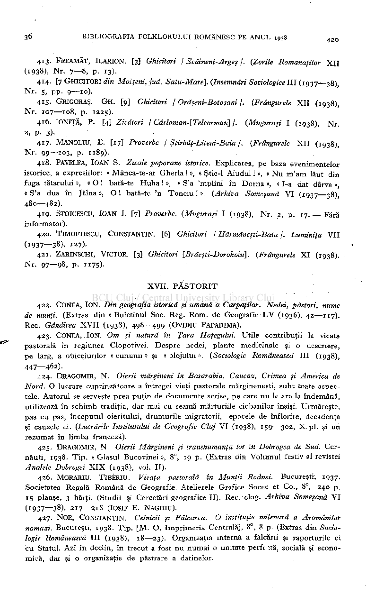

- 413. FREAMĂT, ILARION. [3] Ghicitori / Scăineni-Argeş /. (Zorile Romanaţilor XI I

(1938), Nr 7—8, p. 13).

- 414. [7 GHICITORI din Moişeni,jud. Satu-Mare], (însemnări Sociologice111(1937—38)

Nr. s, pp. 9—10).

- 415. GRIGORAŞ, GH . [9] Ghicitori / Orăşeni-Botoşani j . (Frângurele XI (1938),

Nr. 107—108, p. 1225).

- 416. IONIŢĂ, P. [4] Zicători / Cârloman-[Teleorman] /. (Muguraşi I (1938), Nr.

2, P- 3)-

- 417. MANOLIU, E [17] Proverbe j Ştirbăţ-Liteni-Baia j . (Frângurele XI (1938),

Nr. 99—103, p. 1189).

- 418. PAVELEA, IOAN S. Zicale poporane istorice. Explicarea, pe baza evenimentelor

istorice, a expresiilor: « Mânca-te-ar Gherla ! », « Ştie-1 Aiudul ! », « N u m'am lăut din fuga tătarului », « O ! bată-te Huha ! », « S'a 'mplini în Dorna », « I-a dat dârva »,

« S'a dus în Jălna », O ! bată-te 'n Tonciu ! ». (Arhiva Someşană V I (1937—38), 480—482).

- 419. STOICESCU, IOAN I. [7] Proverbe. (Muguraşi I (1938), Nr 2, p. 17. — Fără

informator).

- 420. TlMOFTESCU, CONSTANTIN. [6] Ghicitori / Hărmăneşti-Baia /. Luminiţa VI I

(1937—38), 127).

- 421. ZARINSCHI, VICTOR. [3] Ghicitori [Brăeşti-Dorohoiu]. (Frângurele X I (1938).

Nr. 97—98, p 1175).

XVII . PĂSTORI T

- 422. CONEA, ION. Din geografia istorică şi umană a Carpaţilor. Nedei, păstori, nume

## de munţi. (Extras din «Buletinul Soc. Reg. Rom. de Geografie L V (1936), 42—117).

Rec. Gândirea XVI I (1938), 498—499 (OVIDIU PAPADIMA).

423. CONEA, ION. Om şi natură în Ţara Haţegului. Utile contribuţii la vieaţa

pastorală în regiunea Clopotivei. Despre nedei, plante medicinale şi o descriere,

pe larg, a obiceiurilor « cununii » şi « blojului ». (Sociologie Românească III (1938), 447—462).

424. DRAGOMIR, N Oierii mărgineni în Basarabia, Caucaz, Crimea şi America de

Nord. O lucrare cuprinzătoare a întregei vieţi pastorale mărgineneşti, subt toate aspectele. Autorul se serveşte prea puţin de documente scrise, pe care nu le are la îndemână, utilizează în schimb tradiţia, dar mai cu seamă mărturiile ciobanilor înşişi. Urmăreşte, pas cu pas, începutul oieritului, drumurile migratorii, epocele de înflorire, decadenţa

şi cauzele ei. (Lucrările Institutului de Geografie Cluj V I (1938), 159—302, X pl. şi un

rezumat în limba franceză).

425. DRAGOMIR, N Oierii Mărgineni şi transhumanta lor în Dobrogea de Sud. Cer­

năuţi, 1938. Tip . « Glasul Bucovinei », 8°, 19 p. (Extras din Volumul festiv al revistei

Analele Dobrogei XI X (1938), vol. II).

426. MORARIU, TIBÈRIU. Vieaţa pastorală în Munţii Rodnei. Bucureşti, 1937.

Societatea Regală Română de Geografie. Atelierele Grafice Socec et Co. 8°, 240 p. 15 planşe, 3 hărţi. (Studii şi Cercetări geografice II). Rec. elog. Arhiva Someşană V I

(1937—38), 217—218 (IOSIF E NAGHIU).

427. NOE, CONSTANTIN. Celnicii şi Fâlcarea. O instituţie milenară a Aromânilor

nomazi. Bucureşti, 1938. Tip . [M . O . Imprimeria Centrală], 8°, 8 p. (Extras din Socio­

## logie Românească III (1938), 18—23). Organizaţia internă a fălcării şi raporturile ei

cu Statul. Az i în declin, în trecut a fost nu numai o unitate perft :tă, socială şi economică, dar şi o organizaţie de păstrare a datinelor.

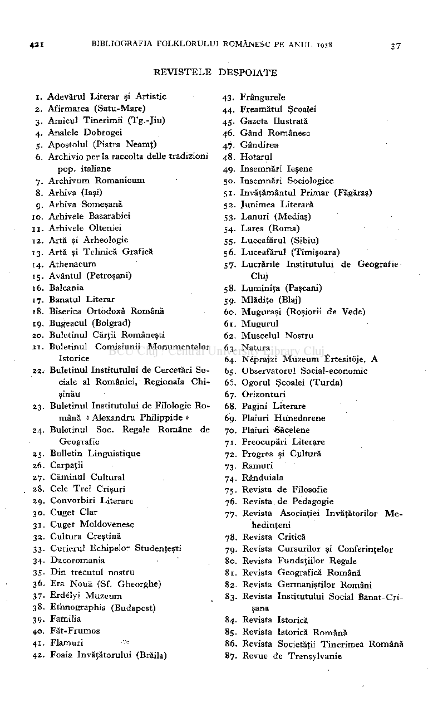

REVISTEL E DESPOIAT E

- 1. Adevărul Literar şi Artistic
- 2. Afirmarea (Satu-Mare)
- 3. Amicul Tinerimii (Tg.-Jiu)
- 4. Analele Dobrogei
- 5. Apostolul (Piatra Neamţ)
- 6. Archivio per la raccolta delle tradizioni pop. italiane
- 7. Archivum Romanicum
- 8. Arhiva (Iaşi)
- 9. Arhiva Someşană

- 43. Frângurele
- 44. Freamătul Şcoalei
- 45. Gazeta Ilustrată
- 46. Gând Românesc
- 47. Gândirea
- 48. Hotarul
- 49. însemnări Ieşene
- 50. însemnări Sociologice
- 51. învăţământul Primar (Făgăraş)
- 52. Junimea Literară
- 53. Lanuri (Mediaş)
- 54. Lares (Roma)
- 55. Luceafărul (Sibiu)
- 56. Luceafărul (Timişoara)
- 57. Lucrările Institutului de Geografie Cluj
- 58. Luminiţa (Paşcani)
- 59. Mlădiţe (Blaj)
- 60. Muguraşi (Roşiorii de Vede)
- 61. Mugurul
- 62. Muscelul Nostru
- 63. Natura
- 64. Néprajzi Muzeum Ertesitöje, A
- 65. Observatorul Social-economic

to. Arhivele Basarabiei

- 11. Arhivele Olteniei
- 12. Artă şi Arheologie
- 13. Artă şi Tehnică Grafică
- 14. Athenaeum
- 15. Avântul (Petroşani)
- 16. Balcania
- 17. Banatul Literar
- 18. Biserica Ortodoxă Română
- 19. Bugeacul (Bolgrad)
- 20. Buletinul Cărţii Româneşti
- 21. Buletinul Comisiunii Monumentelor Istorice
- 22. Buletinul Institutului de Cercetări Sociale al României, Regionala Chişinău
- 23. Buletinul Institutului de Filologie Română « Alexandru Philippide »
- 24. Buletinul Soc. Regale Române de Geografie
- 25. Bulletin Linguistique
- 26. Carpaţii
- 27. Căminul Cultural
- 28. Cele Trei Crişuri
- 29. Convorbiri Literare
- 30. Cuget Clar
- 31. Cuget Moldovenesc
- 32. Cultura Creştină
- 33. Curierul Echipelo- Studenţeşti
- 34. Dacoromania
- 35. Din trecutul nostru
- 36. Era Nouă (Sf. Gheorghe)
- 37. Erdélyi Muzeum
- 38. Ethnographia (Budapest)
- 39. Familia
- 40. Făt-Frumos
- 41. Flamuri >-
- 42. Foaia învăţătorului (Brăila)

65. Ogorul Şcoalei (Turda)

- 67. Orizonturi
- 68. Pagini Literare
- 69. Plaiuri Hunedorene
- 70. Plaiuri Săcelene
- 71. Preocupări Literare
- 72. Progres şi Cultură
- 73. Ramuri
- 74. Rânduiala
- 75. Revista de Filosofie
- 76. Revista. de Pedagogie
- 77. Revista Asociaţiei învăţătorilor Me hedinţeni
- 78. Revista Critică
- 79. Revista Cursurilor şi Conferinţelor
- 80. Revista Fundaţiilor Regale
- 81. Revista Geografică Română
- 82. Revista Germaniştilor Români
- 83. Revista Institutului Social Banat-Crişana
- 84. Revista Istorică
- 85. Revista Istorică Română
- 86. Revista Societăţii Tinerimea Română
- 87. Revue de Transylvanie

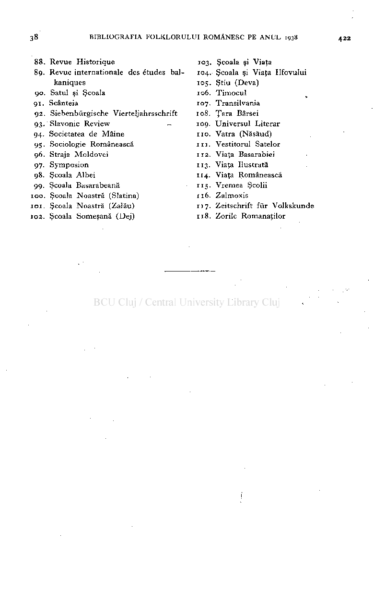

- 88. Revue Historique 103. Şcoala şi Viaţa
- 89. Revue internationale des études bal­ 104. Şcoala şi Viaţa Ilfovului kaniques i°5- Ştiu (Deva)
- 90. Satul şi Şcoala 106. Timocul
- 91. Scânteia 107. Transilvania
- 92. Siebenbürgische Vierteljahrsschrift 108. Ţara Bârsei
- 93- Slavonie Review _ 109. Universul Literar
- 94- Societatea de Mâine 110. Vatra (Năsăud)
- 95- Sociologie Românească 111. Vestitorul Satelor

96. Straja Moldovei 112. Viaţa Basarabiei 97- Symposion "3 - Viaţa Ilustrată

98. Şcoala Albei 114. Viaţa Românească 99- Şcoala Basarabeană "5 - Vremea Şcolii

100. Şcoala Noastră (Slatina) 116. Zalmoxis IOI. Şcoala Noastră (Zalău) 117. Zeitschrift für Volkskunde

102. Şcoala Someşană (Dej) 118. Zorile Romanaţilor

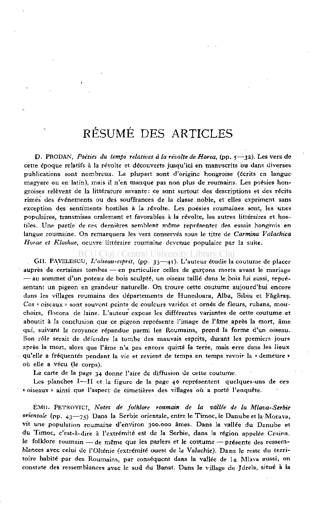

# RÉSUMÉ DES ARTICLES

D. PRODAN , Poésies du temps relatives à la révolte de Horea, (pp. 5—32). Les vers de

cette époque relatifs à la révolte et découverts jusqu'ici en manuscrits bu dans diverses publications sont nombreux. La plupart sont d'origine hongroise (écrits en langue magyare ou en latin), mais il n'en manque pas non plus de roumains. Les poésies hongroises relèvent de la littérature savante : ce sont surtout des descriptions et des récits rimes des événements ou des souffrances de la classe noble, et elles expriment sans exception des sentiments hostiles à la révolte. Les poésies roumaines sont, les unes populaires, transmises oralement et favorables à la révolte, les autres littéraires et hostiles. Une partie de ces dernières semblent même représenter des essais hongrois en langue roumaine. O n remarquera les vers conservés sous le titre de Carmina Valachica Horae et Kloskae, oeuvre littéraire roumaine devenue populaire par la suite.

GH. PAVELESCU L'oiseau-esprit, (pp. 33—41). L'auteur étudie la coutume de placer auprès de certaines tombes — en particulier celles de garçons morts avant le mariage — au sommet d'un poteau de bois sculpté, un oiseau taillé dans le. bois lui aussi, représentant un pigeon en grandeur naturelle. O n trouve cette coutume aujourd'hui encore dans les villages roumains des départements de Hunedoara, Alba, Sibiu et Făgăraş. Ces « oiseaux » sont souvent peints de couleurs variées et ornés de fleurs, rubans, mouchoirs, flocons de laine. L'auteur expose les différentes variantes de cette coutume et aboutit à la conclusion que ce pigeon représente l'image de l'âme après la mort, âme qui, suivant la croyance répandue parmi les Roumains, prend la forme d'un oiseau. Son rôle serait de défendre la tombe des mauvais esprits, durant les premiers jours après la mort, alors que l'âme n'a pas encore quitté la terre, mais erre dans les lieux qu'elle a fréquentés pendant la vie et revient de temps en temps revoir la « demeure » où elle a vécu (le corps).

La carte de la page 34 donne l'aire de diffusion de cette coutume. Les planches I—I I et la figure de la page 40 représentent quelques-uns de ces

« oiseaux » ainsi que l'aspect de cimetières des villages où a porté l'enquête.

EMI L PETROVICI, Notes de folklore roumain de la vallée de la Mlava-Serbie

orientale (pp. 43—75) Dans la Serbie orientale, entre le Timoc, le Danube et la Morava, vit une population roumaine d'environ 300.000 âmes. Dans la vallée du Danube et du Timoc, c'est-à-dire à l'extrémité est de la Serbie, dans la région appelée Craina, le folklore roumain — de même que les parlers et le costume — présente des ressemblances avec celui de l'Olténie (extrémité ouest de la Valachie). Dans le reste du territoire habité par des Roumains, par conséquent dans la vallée de l a Mlava aussi, on constate des ressemblances avec le sud du Banat. Dans le village de Jdrela, situé à la

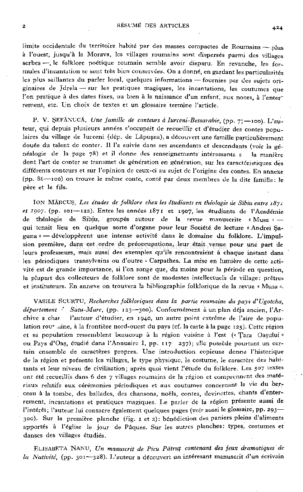

2 RÉSUMÉ DES ARTICLES 424

limite occidentale du territoire habité par des masses compactes de Roumains — plus à l'ouest, jusqu'à la Morava, les villages roumains sont dispersés parmi des villages serbes — , le folklore poétique roumain semble avoir disparu. En revanche, les formules d'incantation se sont très bien conservées. O n a donné, en gardant les particularités les plus saillantes du parler local, quelques informations •— fournies par des sujets originaires de Jdrela — sur les pratiques magiques, les incantations, les coutumes que l'on pratique à des dates fixes, ou bien à la naissance d'un enfant, aux noces, à l'enter" rement, etc. U n choix de textes et un glossaire termine l'article.

P. V. ŞEFĂNUCĂ, Une famille de conteurs à Iurceni-Bessarabie, (pp. y-,—100). L'au­

teur, qui depuis plusieurs années s'occupait de recueillir et d'étudier des contes populaires du village de Iurceni (dép. de Lăpuşna), a découvert une famille particulièrement douée du talent de conter. Il l'a suivie dans ses ascendants et descendants (voir la généalogie de la page 78) et il donne des renseignements intéressants s la manière dont l'art de conter se transmet de génération en génération, sur les caractéristiques dés différents conteurs et sur l'opinion de ceux-ci au sujet de l'origine des contes. En annexe (pp. 86-—100) on trouve le même conte, conté par deux membres de la dite famille: le père et le fils.

ION MARCUS, Les études de folklore chez les étudiants en théologie de Sibiu entre i8yi

et 190J. (pp. 101—122) . Entre les années 1871 et 1907, les étudiants de l'Académie de théologie de Sibiu, groupés autour de la revue manuscrite « Musa » •qui tenait lieu en quelque sorte d'organe pour leur Société de lecture «Andrei Şaguna » — développèrent une intense activité dans le domaine du folklore. L'impulsion première, dans cet ordre de préoccupations, leur était venue pour une part de leurs professeurs, mais aussi des exemples qu'ils rencontraient à chaque instant dans les périodiques transylvains ou d'outre - Carpathes. La mise en lumière de cette activité est de grande importance, si l'on songe que, du moins pour la période en question, la plupart des collecteurs de folklore sont de modestes intellectuels de village: prêtres et instituteurs. En annexe on trouvera la bibliographie folklorique de la revue « Musa ».

VASILE SCURTU, Recherches folkloriques dans la partie roumaine du pays d'Ugotcha,

département 0 Satu-Mare, (pp. T23—300). Conformément à un plan déjà ancien, l'Archive a char l'auteur d'étudier, en 1940, un autre point extrême de l'aire de population rou* -aine, à la frontière nord-ouest du pays (cf. la carte à la page 125). Cette région et sa population ressemblent beaucoup à la région voisine à l'est (« Ţara Oaşului » ou Pays d'Oaş, étudié dans l'Annuaire I, pp. 117—237) elle possède pourtant un certain ensemble de caractères propres. Une introduction copieuse donne l'historique de la région et présente les villages, le type physique, le costume, le caractère des habitants et leur niveau de civilisation; après quoi vient l'étude du folklore. Les 507 textes ont été recueillis dans 6 des 7 villages roumains de la région et comprennent des matériaux relatifs aux cérémonies périodiques et aux coutumes concernant la vie du ber.ceau à la tombe, des ballades, des chansons, noëls, contes, devinettes, chants d enterrement, incantations et pratiques magiques. L e parler de la région présente aussi de l'intérêt; l'auteur lui consacre également quelques pages (voir aussi le glossaire, pp. 293300). Sur la première planche (fig. 1 et 2) : bénédiction des paniers pleins d'aliments apportés à l'église le jour de Pâques. Sur les autres planches: types, costumes et danses des villages étudiés.

ELISABETA NANU, Un manuscrit de Pieu Pătruţ contenant des jeux dramatiques de

la Nativité, (pp. 301—328). L'auteur a découvert un interesant manuscrit d'un écrivain

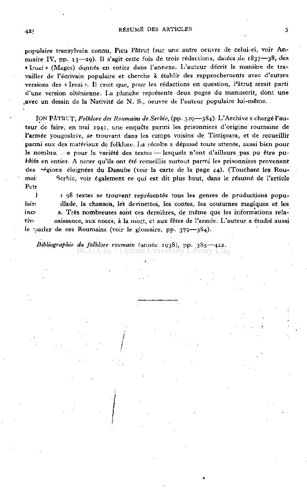

42; RÉSUMÉ DES ARTICLES 3

populaire transylvain connu, Pieu Pătruţ (sur une autre oeuvre de celui-ci, voir An nuaire IV, pp. 13—29). Il s'agit cette fois de trois rédactions, datées de 1837—38, des « Irozi » (Mages) dqnnés en entier dans l'annexe. L'auteur décrit la manière de travailler de l'écrivain populaire et cherche à établir des rapprochements avec d'autres versions des « Irozi ». Il croit que, pour les rédactions en question, Pătruţ serait parti d'une version olténienne. La planche représente deux pages du manuscrit, dont une

;avec un dessin de la Nativité de N . S., oeuvre de l'auteur populaire lui-même.

ION PĂTRUŢ, Folklore des Roumains de Serbie, (pp. 329—384). L'Archive a chargé l'auteur de faire, en mai 1941, une enquête parmi les prisonniers d'origine roumaine de l'armée yougoslave, se trouvant dans les camps voisins de Timişoara, et de recueillir parmi eux des matériaux de folklore. La récolte a dépassé toute attente, aussi bien pour le nombre , e pour la variété des textes—lesquels n'ont d'ailleurs pas pu être publiés en entier. A noter qu'ils ont été recueillis surtout parmi les prisonniers provenant des '^gions éloignées du Danube (voir la carte de la page 44). (Touchant les Roumai Serbie, voir également ce qui est dit plus haut, dans le résumé de l'article Petr

] 5 98 textes se trouvent représentés tous les genres de productions populaire dlade, la chanson, les devinettes, les contes, les coutumes magiques et les inc? s. Très nombreuses sont ces dernières, de même que les informations relativi naissance, aux noces, à la mort, et aux fêtes de l'année. L'auteur a étudié aussi le yparler de ces Roumains (voir le glossaire, pp. 379—384).

Bibliographie du folklore roumain (année 1938), pp. 385—422.

/

