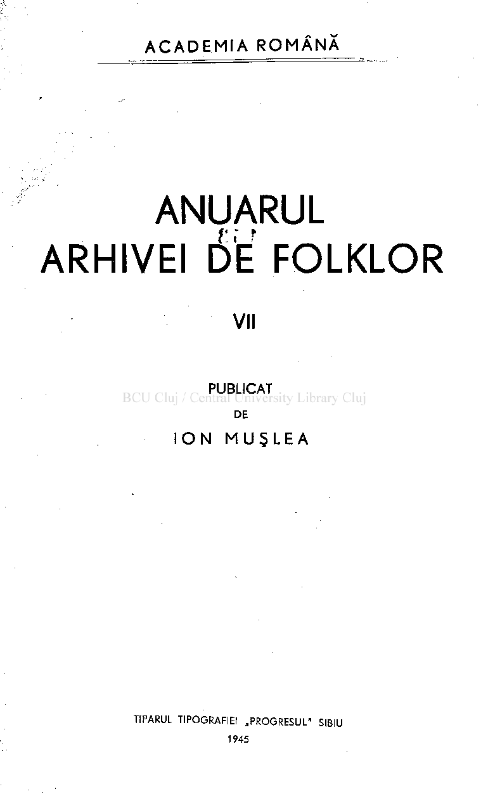
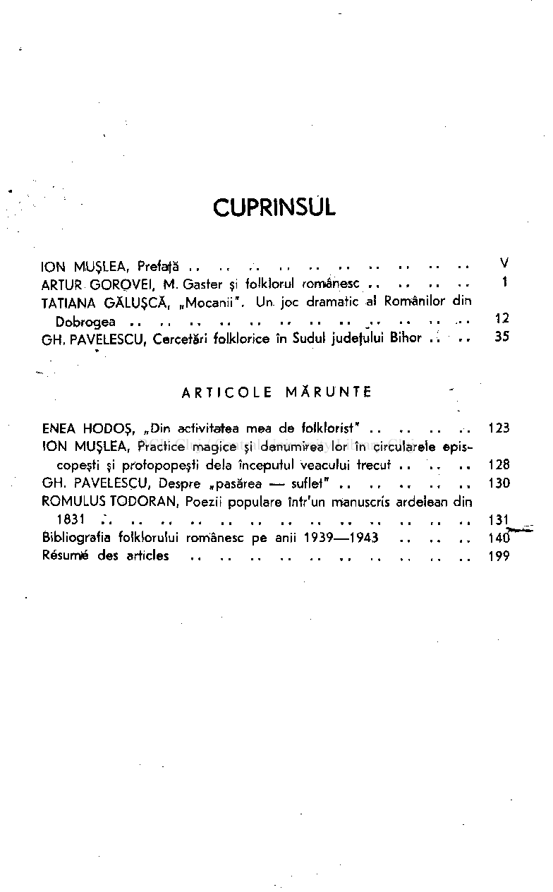
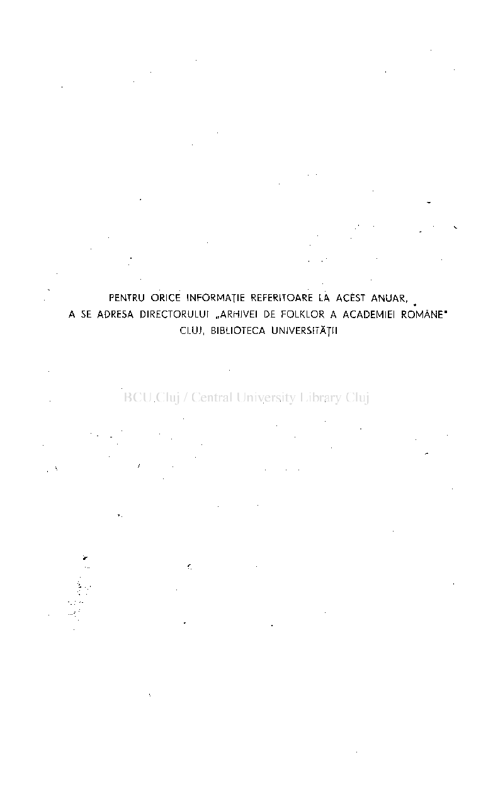
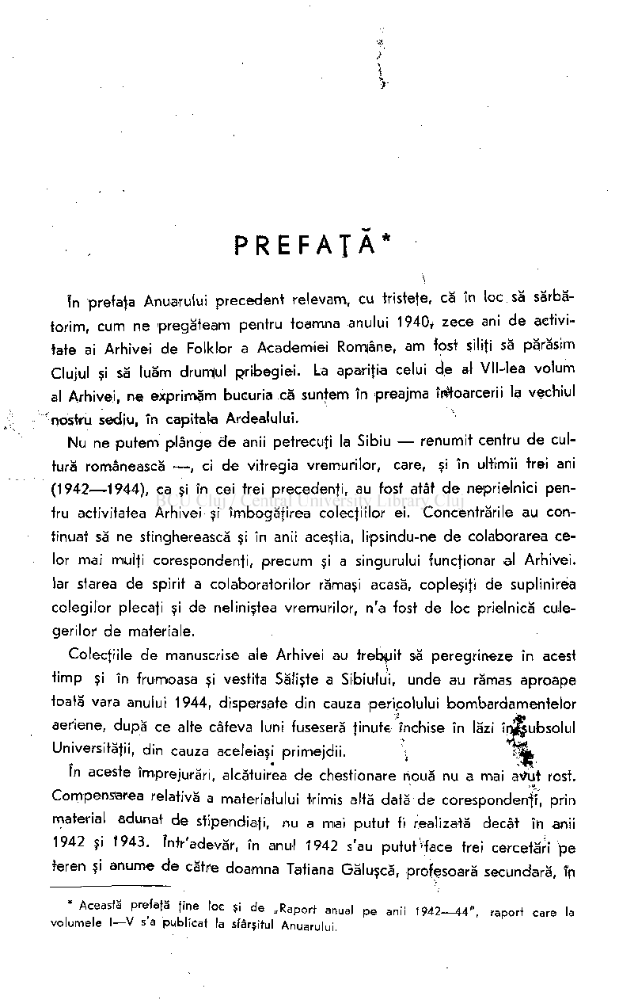

ACADEMI A ROMÂN Ă

# ANUARUL ARHIVEI 6'E FOLKLOR

PUBLICA T DE

### IO N MUŞLE A

## CUPRINSUL

ION MJUŞLEA, Prefafă V ARTUR GOROVEI, M. Gaster şi folkiorul românesc 1 TATIANA GĂLUŞCĂ, „Mocanii". Un. joc dramatic al Românilor din

Dobrogea 12 GH. PAVELESCU, Cercetări folklorice în Sudul judefului Bihor .'. .. 35

ARTICOL E MĂRUNT E

ENEA HODOŞ, „Din activitatea mea de folklorist" 123 ION MUŞLEA, Practice magice şi denumirea lor în circularele epis-

copeşti şi protopopeşti delà începutul veacului trecut . . . . . . 128 GH. PAVELESCU, Despre „pasărea — suflet" . . 130 ROMULUS TODORAN, Poezii populare într'un manuscris ardelean din

1831 ; 131 Bibliografia folklorului românesc pe anii 1939—1943 140 Résumé des articles 199

#### PENTRU ORICE INFORMAŢIE REFERITOARE LA ACEST ANUAR, A SE ADRESA DIRECTORULUI „ARHIVEI DE FOLKLOR A ACADEMIEI ROMÂNE " CLUJ, BIBLIOTECA UNIVERSITĂŢII

## PREFAŢA *

în prefaţa Anuarului precedent relevam, cu fristete, că în loc să sărbătorim, cum ne pregăteam pentru toamna anului 1940

zece ani de activitate ai Arhivei de Folklor a Academiei Române, am fost siliţi să părăsim Clujul şi să luăm drumul pribegiei. La apariţia celui de al Vll-lea volum al Arhivei, ne exprimăm bucuria că suntem în preajma W&oarcerii la vechiul nostru sediu, în capitata Ardealului.

t

Nu ne putem plânge de anii petrecuţi la Sibiu — renumit centru de cultură românească — , ci de vitregia vremurilor, care, şi în ultimii trei ani (1942—1944), ca şi în cei trei precedenţi, au fost atât de neprielnici pentru activitatea Arhivei şi îmbogăţirea colecţiilor ei. Concentrările au continuat să ne stingherească şi în anii aceştia, lipsindu-ne de colaborarea celor mai mulţi corespondenţi, precum şi a singurului funcţionar al Arhivei. Iar starea de spirit a colaboratorilor rămaşi acasă, copleşiţi de suplinirea colegilor plecaţi şi de neliniştea vremurilor, n'a fost de loc prielnică culegerilor de materiale.

Colecţiile de manuscrise ale Arhivei au trebuit să peregrineze în acest timp şi în frumoasa şi vestita Sălişte a Sibiului, unde au rămas aproape toată vara anului 1944, dispersate din cauza pericolului bombardamentelor aeriene, după ce alte câteva luni fuseseră ţinute închise în lăzi înfeubsolul Universităţii, din cauza aceleiaşi primejdii. î-m

In aceste împrejurări, alcătuirea de chestionare nouă nu a mai av\it rost. Compensarea relativă a materialului trimis altă dată de corespondenţi, prin material adunat de stipendiaţi, nu a mai putut fi realizată decât în anii 1942 şi 1943. într'adevăr, în anul 1942 s'au putut "face trei cercetări pe teren şi anume de către doamna Tatiana Găluşcă, profesoară secundară, în

• Această prefafă fine loc şi de „Raport anual pe anii 1942-44" , raport care la volumele I—V s'a publicat la sfârşitul Anuarului.

