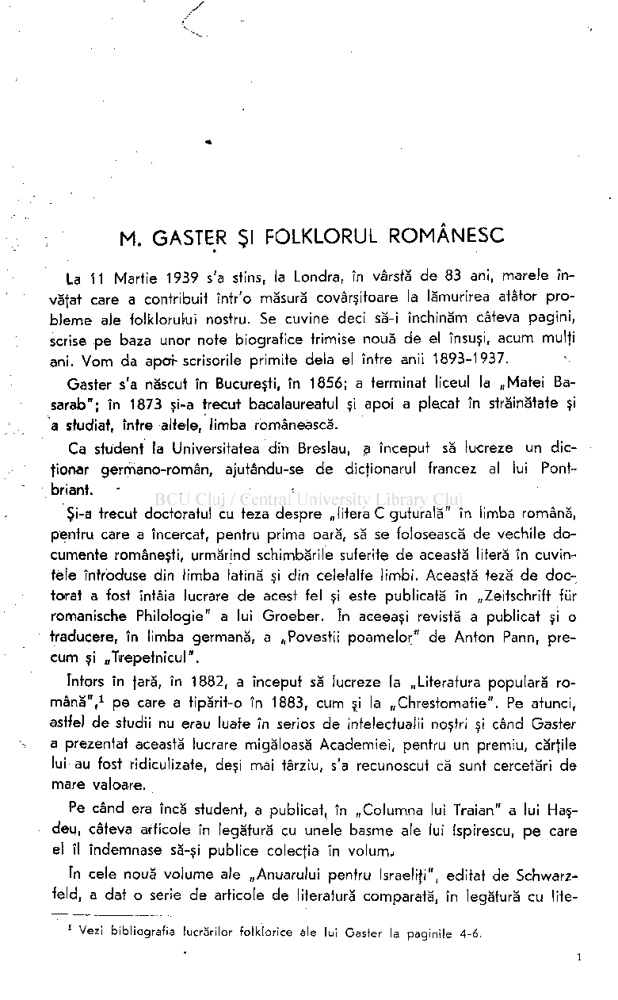
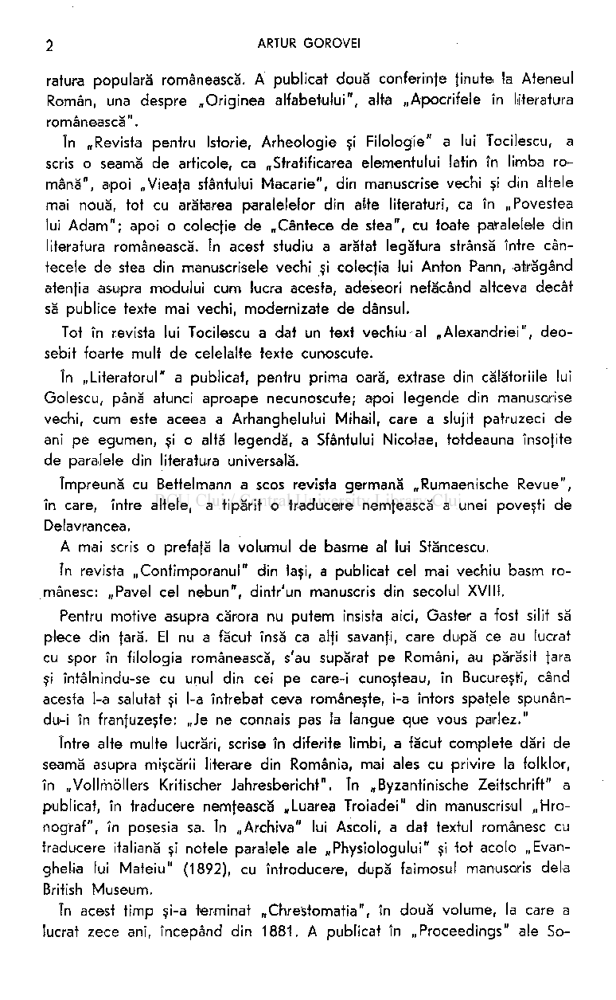
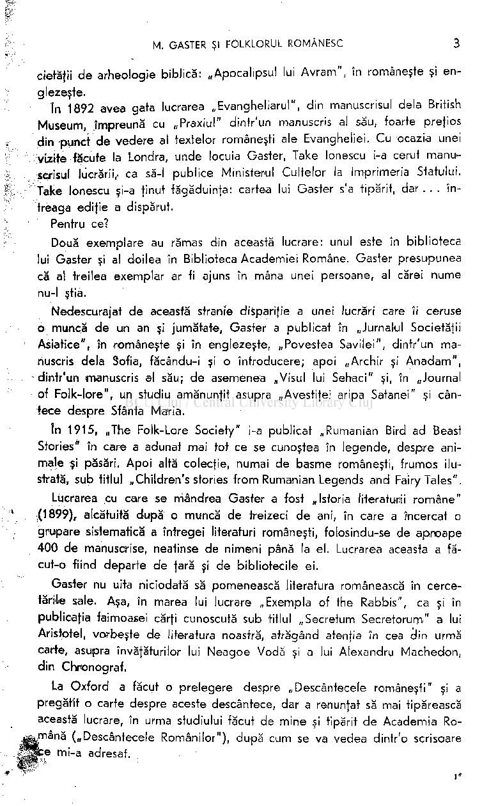
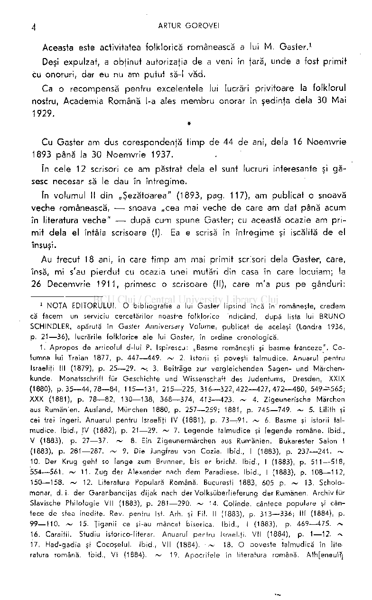
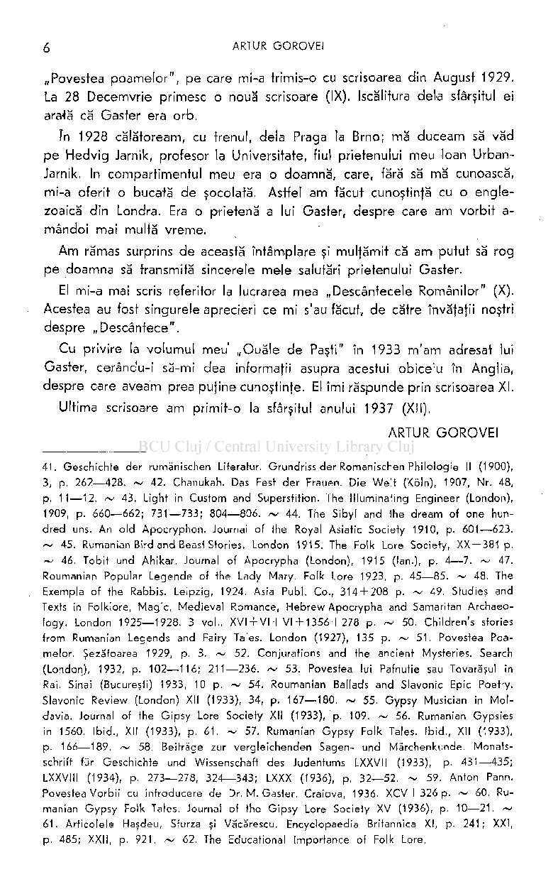
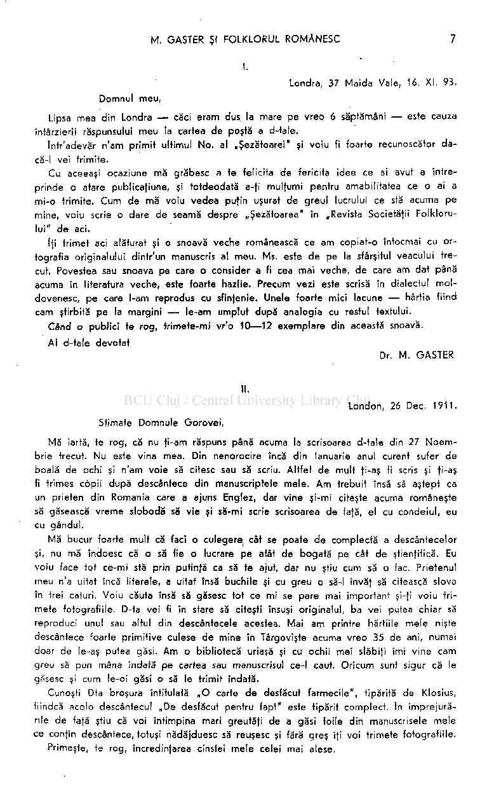
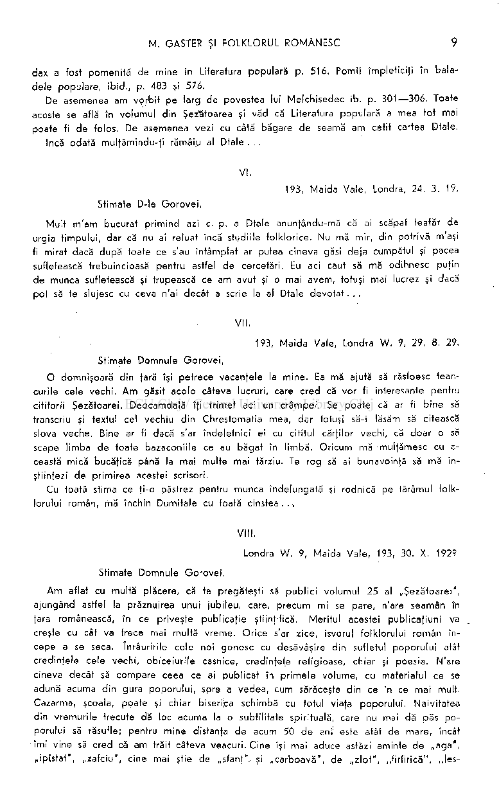

# M. GASTER Şl FOLKLORUL ROMÂNESC

La 11 Martie 1939 s'a stins, la Londra, în vârstă de 83 ani, marele învăţat care a contribuit într'o măsură covârşitoare la lămurirea atâtor probleme ale folklorului nostru. Se cuvine deci să-i închinăm câteva pagini, scrise pe baza unor note biografice trimise nouă de el însuşi, acum mulţi ani. Vom da apot-scrisorile primite delà el între anii 1893-1937.

Gaster s'a născut în Bucureşti, în 1856; a terminat liceul la „Matei Basarab"; în 1873 şi-a trecut bacalaureatul şi apoi a plecat în străinătate şi a studiat, între altele, limba românească.

Ca student la Universitatea din Breslau, a început să lucreze un dicţionar germano-român, ajutându-se de dicţionarul francez al lui Pontbriant. - -

Şi-a trecut doctoratul cu teza despre „litera C guturală" în limba română, pentru care a încercat, pentru prima oară, să se folosească de vechile documente româneşti, urmărind schimbările suferite de această literă în cuvintele întroduse din limba latină şi din celelalte limbi. Această teză de doctorat a fost întâia lucrare de acest fel şi este publicată în „Zeitschrift für romanische Philologie" a lui Groeber. în aceeaşi revistă a publicat şi o traducere, în limba germană, a „Povestii poamelor" de Anton Pann, precum şi „TVepetnicul".

întors în ţară, în 1882, a început să lucreze la „Literatura populară română",

pe care a tipărit-o în 1883, cum şi la „Chrestomatie". Pe atunci, astfel de studii nu erau luate în serios de intelectualii noştri şi când Gaster a prezentat această lucrare migăloasă Academiei, pentru un premiu, cărţile lui au fost ridiculizate, deşi mai târziu, s'a recunoscut că sunt cercetări de mare valoare.

1

Pe când era încă student, a publicat, în „Columna lui Traian" a lui Haşdeu, câteva articole în legătură cu unele basme ale lui Ispirescu, pe care el îl îndemnase să-şi publice colecţia în volum.i

în cele nouă volume ale „Anuarului pentru Israelit", editat de Schwarzfeld, a dat o serie de articole de literatură comparată, în legătură cu lite-

Vezi bibliografia lucrărilor folklorice ale lui Gaster la paginile 4-6.

1

rafura populară românească. A publicat două conferinfe ţinute la Ateneul Român, una despre „Originea alfabetului", alta „Apocrifele în literatura românească".

în „Revista pentru Istorie, Arheologie şi Filologie" a lui Tocilescu, a scris o seamă de articole, ca „Stratificarea elementului latin în limba română", apoi „Vieafa sfântului Macarie", din manuscrise vechi şi din altele mai nouă, tot cu arătarea paralelelor din alte literaturi, ca în „Povestea lui Adam"; apoi o colecte de „Cântece de stea", cu toate paralelele din literatura românească. în acest studiu a arătat legătura strânsă între cântecele de stea din manuscrisele vechi şi colecfia lui Anton Pann, atrăgând atenfia asupra modului cum lucra acesta, adeseori nefăcând altceva decât să publice texte mai vechi, modernizate de dânsul.

Tot în revista lui Tocilescu a dat un text vechiu al „Alexandriei", deosebit foarte mult de celelalte texte cunoscute.

în „Literatorul" a publicat, pentru prima oară, extrase din călătoriile lui Golescu, până atunci aproape necunoscute; apoi legende din manuscrise vechi, cum este aceea a Arhanghelului Mihail, care a slujit patruzeci de ani pe egumen, şi o altă legendă, a Sfântului Nicolae, totdeauna însofite de paralele din literatura universală.

împreună cu Bettelmann a scos revista germană „Rumaenische Revue", în care, între altele, a tipărit o traducere nemţească a unei poveşti de Delavrancea,

A mai scris o prefafă la volumul de basme al lui Stăncescu. în revista „Contimporanul" din laşi, a publicat cel mai vechiu basm ro­

mânesc: „Pavel cel nebun", dintr'un manuscris din secolul XVIII.

Pentru motive asupra cărora nu putem insista aici, Gaster a fost silit să plece din ţară. El nu a făcut însă ca alţi savanţi, care după ce au lucrat cu spor în filologia românească, s'au supărat pe Români, au părăsit ţara şi întâlnindu-se cu unul din cei pe care-i cunoşteau, în Bucureşti, când acesta 1-a salutat şi l-a întrebat ceva româneşte, i-a întors spatele spunându-i în franfuzeşte: „Je ne connais pas la langue que vous parlez."

între alte multe lucrări, scrise în diferite limbi, a făcut complete dări de seamă asupra mişcării literare din România, mai ales cu privire la folklor, în „Vollrhöllers Kritischer Jahresbericht". în „Byzantinische Zeitschrift" a publicat, în traducere nemţească „Luarea Troiadei" din manuscrisul „Hronograf", în posesia sa. în „Archiva" lui Ascoli, a dat textul românesc cu traducere italiană şi notele paralele ale „Physiologului" şi tot acolo „Evanghelia lui Mateiu" (1892), cu întroducere, după faimosul manuscris delà British Museum.

în acest timp şi-a terminat „Chrestomatia", în două volume, la care a lucrat zece ani, începând din 1881. A publicat în „Proceedings" ale So-

cietăţii de arheologie biblică: „Apocalipsul lui Avram", în româneşte şi englezeşte.

în 1892 avea gata lucrarea „Evangheliarul", din manuscrisul delà British Museum, împreună cu „Praxiul" dintr'un manuscris al său, foarte preţios din punct de vedere al textelor româneşti ale Evangheliei. Cu ocazia unei vizite făcute la Londra, unde locuia Gaster, Take lonescu i-a cerut manu>scrisul lucrării,- ca să-l publice Ministerul Cultelor la Imprimeria Statului. Take lonescu şi-a ţinut făgăduinţa: cartea lui Gaster s'a tipărit, dar. . . întreaga ediţie a dispărut.

Pentru ce? Două exemplare au rămas din această lucrare: unul este în biblioteca lui Gaster şi al doilea în Biblioteca Academiei Române. Gaster presupunea că al treilea exemplar ar fi ajuns în mâna unei persoane, al cărei nume nu-l ştia.

Nedescurajat de această stranie dispariţie a unei lucrări care îi ceruse

- o muncă de un an şi jumătate, Gaster a publicat în „Jurnalul Societăţii Asiatice", în româneşte şi în englezeşte, „Povestea Savilei", dintr'un manuscris delà Sofia, făcându-i şi o introducere; apoi „Archir şi Anadam", dintr'un manuscris al său; de asemenea „Visul lui Sehaci" şi, în „Journal
- of Folk-lore", un studiu amănunţit asupra „Avestiţei aripa Satanei" şi cântece despre Sfânta Maria.

în 1915, „The Folk-Lore Society" i-a publicat „Rumanian Bird ad Beast Stories" în care a adunat mai tot ce se cunoştea în legende, despre animale şi păsări. Apoi altă colecţie, numai de basme româneşti, frumos ilustrată, sub titlul „Children's stories from Rumanian Legends and Fairy Tales".

Lucrarea cu care se mândrea Gaster a fost „Istoria literaturii române" ,(1899), alcătuită după o muncă de treizeci de ani, în care a încercat o grupare sistematică a întregei literaturi româneşti, folosindu-se de aproape 400 de manuscrise, neatinse de nimeni până la el. Lucrarea aceasta a făcut-o fiind departe de ţară şi de bibliotecile ei,

Gaster nu uita niciodată să pomenească literatura românească în cercetările sale. Aşa, în marea lui lucrare „Exempla of the Rabbis", ca şi în publicaţia faimoasei cărţi cunoscută sub titlul „Secretum Secretorum" a lui Aristotel, vorbeşte de literatura noastră, atrăgând atenţia în cea din urmă carte, asupra învăţăturilor lui Neagoe Vodă şi a lui Alexandru Machedon, din Chronograf.

La Oxford a făcut o prelegere despre „Descântecele româneşti" şi a pregătit o carte despre aceste descântece, dar a renunţat să mai tipărească această lucrare, în urma studiului făcut de mine şi tipărit de Academia Ro-

^rnână („Descântecele Românilor"), după cum se va vedea dintr'o scrisoare :e mi-a adresat.

Aceasta este activitatea folklorică românească a lui M. Gaster. Deşi expulzat, a obţinut autorizaţia de a veni în ţară, unde a fost primit

cu onoruri, dar eu nu am putut să-l văd.

Ca o recompensă pentru excelentele lui lucrări privitoare la folklorul nostru, Academia Română l-a ales membru onorar în şedinţa delà 30 Mai 1929.

## *

Cu Gaster am dus corespondenţă timp de 44 de ani, delà 16 Noemvrie 1893 până la 30 Noemvrie 1937.

în cele 12 scrisori ce am păstrat delà el sunt lucruri interesante şi găsesc necesar să le dau în întregime.

în volumul II din „Şezătoarea" (1893, pag. 117), am publicat o snoavă veche românească, — snoava „cea mai veche de care am dat până acum în literatura veche" — după cum spune Gaster; cu această ocazie am primit delà el întâia scrisoare (I). Ea e scrisă în întregime şi iscălită de el însuşi.

Au trecut 18 ani, în care timp am mai primit scrisori delà Gaster, care, însă, mi s'au pierdut cu ocazia unei mutări din casa în care locuiam; la 26 Decemvrie 1911, primesc o scrisoare (II), care m'a pus pe gânduri:

NOTA EDITORULUI. O bibliografie a lui Gaster lipsind încă in româneşte, credem că facem un serviciu cercetărilor noastre folklorice indicând, după lista lui BRUNO SCHINDLER, apărută în Gaster Anniversars Volume, publicat de acelaşi (Londra 1936, p. 21—36) , lucrările folklorice ale lui Gaster, în ordine cronologică.

1

1. Apropos de articolul d-lui P. Ispirescu: „Basme româneşti şi basme franceze". Co lumna lui Traian 1877, p. 447—449 . ~ 2. Istorii şi poveşti talmudice. Anuarul pentru Israelit III (1879), p. 25—29 . ~ , 3. Beiträge zur vergleichenden Sagen- und Märchenkunde. Monatsschrift für Geschichte und Wissenschaft des Judentums, Dresden, XXIX (1880), p. 35—44 , 78—84 , 115—131 , 215—225 , 316—322,422—427,472—480 , 549^-565 ; XXX (1881), p. 78—82 , 130—138, 368—374 , 413—423 . ~ 4. Zigeunerische Märchen aus Rumänien. Ausland, München 1880, p. 257—259 ; 1881, p. 745—749. ~ 5. Lilith şi cei trei îngeri. Anuarul pentru Israeliţi IV (1881), p. 73—

91. ~ 6. Basme şi istorii talmudice. Ibid., IV (1882), p. 21—29 . ~ 7. Legende talmudice şi legende române. Ibid., V (1883), p. 27—37 . ~ 8. Ein Zigeunermärchen aus Rumänien. Bukarester Salon I (1883), p. 281—287 . ~ 9. Die Jungfrau von Cozia. Ibid., I (1883), p. 237—241 . ~ 10. Der Krug geht so lange zum Brunnen, bis er bricht. Ibid., I (1883), p. 511—518 , 554—561 . ~ 11 . Zug der Alexander nach de m Paradiese. Ibid., I (1883), p. 108—112, 150—158. ~ 12. Literatura Populară Română. Bucureşti 1883, 605 p. ~ 13. Scholomonar, d.i . der Garanbancijas dijak nach der Volksüberlieferung der Rumänen. Archiv für Slavische Philologie VII (1883), p. 281—290 . ~ 14. Colinde, cântece populare şi cântece de stea inedite. Rev. pentru Ist. Arh. şi Fil. II (1883), p. 313—336 ; III (1884), p. 99—110 . ~ 15. Ţiganii ce şi-au mâncat biserica. Ibid., I (1883), p. 469—475 . ~

r

- 16. Cârâiţii. Studiu istorico-literar. Anuarul pentru Israeliţi. VII (1884), p. 1—12. ~
- 17. Had-gadia şi Cocoşelul. Ibid., VII (1884). ~ 18. O poveste talmudică în Iiteratura română. Ibid., VI (1884). ~ 19, Apocrifele în literatura română, AthţeneulTj

Gaster, grav bolnav de ochi, nu mai scrie singur, deşi iscăleşte bine, ca şi în prima lui scrisoare.

Pe atunci lucram la studiul meu despre descântece. Ştiam că Gaster are nişte manuscrise în care sunt o seamă de descântece, din care publicase fragmente în „Literatura populară românească" şi în „Chrestomatie roumaine", l-am scris, rugându-l să-mi comunice côpii de pe acele descântece şi să-mi permită să le utilizez în lucrarea mea.

Abia la 17 Aprilie 1912 primesc 21 de fotografii ale tuturor descântecelor din manuscrisele sale, împreună cu scrisoarea III.

La 13 Iunie 1912 primesc altă scrisoare (IV). La 19 Februarie 1914 îmi răspunde de primirea „Şezătorii" (V). A urmat războiul, în care timp orice corespondenţă era cu neputinţă. La 1919 îi scriu ca să aflu despre el şi-mi

- răspunde cu o cartă poştală (VI). Abia după zece ani primesc din nou delà Gaster o scrisoare frumoasă

(VII), dar cu o iscălitură care nu mai seamănă cu cele de până atunci: boala de ochi făcea progrese.

în acelaşi an, la 30 Octomvrie 1929, altă scrisoare (VIII), în care se plânge de secătuirea folklorului românesc şi de schimbarea vieţii poporului.

în volumul XXIII (1927) al „Şezătorii", am publicat „Descântece" trimise de Gaster, cu o scrisoare care s'a rătăcit, iar în volumul XXV am publicat

[Român?], 1884. ~ 20. Das Gol d im Morser. Bukarester Salon II (1884), p. 341—344 .

- ~ 21 . Die Lüge zerstört auch das von Steinen erbaute Haus. Ibid., II (1884), p. 389—394 .
- ~ 22. Rumänische Wappensagen . Ibid., II (1884), p. 288—292 . ~ 23. Die Prinzessin mit der Zauberfeder. Ibid., II (1884), p. 488—492 . ~ 23. Wi e der hl. Erzengel Gabrie l dreissig Jahre lang einem Einsiedler diente. Ibid., II (1884), p. 421—424 . ~ 24. Legend e inedite: a) Viaţa sfântului Ion Decapolifa; b) Sf. Alexie, omu l lui Dumnezeu ; c) Eusfachie Plachida; d) Macarie. Rev. pentru Ist., Arh. şi Fii. III (1884), p. 335—352 ; IV (1884), p. 629—645 ; V (1885), p. 88—112 . ~ 25. Despre superstiţiuni la Români şi la alte popoare. Revista literară 1885. ~ 26. Die rumänische „Miracles de Notre-Dame" . Miscellania din Filologia, Florence 1886, p. 333—334 . ~ 27. îngerul şi Săhasfrul. Anua rul pentru Israeliţi XI (1888), p. 133—152. ~ 28. Refeta sufletească. Ibid., XII (1889), p. 12—30 . ~ 29. II Phisiologus rutneno. Archivio Glottologic o Italiano X (1889), p. 273—304 . ~ 30. Chrestomatie Română. Bucureşti 1891. 2 vol. ~ 31 . La versione.ru mena dei Vangelo di Matteo. Archivio Glottologic o Italiano XII (1891), p. 197—254 . ~

32. Judecata lui Dumnezeu. Anuarul pentru Israelifi XIV (1891), p. 51—60 . ~ 33. Ale xandria Bucovineană publicată pentru istoria . . . Rev. pentru Ist., Arh. şi Fil. VII (1893)

- P- 334—366 . ~ 34. The Apocalypse of Abraham. From the Routmanian Text. Transactions of the Society of Biblical Archaeology XI, Part. I (1893), p. 195—226. ~ 35. Istorie nebunului Pavăl. Şezătoarea II (1893), p. 117—121 . ~ 36. Nigrodha-mig a Jataka and the life of St. Eustachius Placidus. Journal of the Royal Asiatic Society, 1894,
- P- 335—340 . ~ 37. Die rumänische Version der trojanischen Sage. Byzantinische Zeitschrift 1895, p. 528—552 . ~ 38. Basme ovreeşti de o mi e de ani. Anuarul pentru Israelifi XVIII (1896), p. 161—177. ~ 39. Rumänische Literatur, 1891—1898. Krit. Jahresbericht der Romanischen Philologie IV, 1 (1899), p. 115—145. ~ 40. Contribution to

the History of Ahikar and Nadan. Journal of the Royal Asiatic Society 1900, p? 301—319 . ~

„Povestea poamelor", pe care mi-a trimis-o cu scrisoarea din August 1929. La 28 Decemvrie primesc o nouă scrisoare (IX). Iscălitura delà sfârşitul ei arată că Gaster era orb.

în 1928 călătoream, cu trenul, delà Praga la Brno; mă duceam să văd pe Hedvig Jarnik, profesor la Universitate, fiul prietenului meu loan UrbanJarnik. In compartimentul meu era o doamnă, care, fără să mă cunoască, mi-a oferit o bucată de şocolată. Astfel am făcut cunoştinţă cu o englezoaică din Londra. Era o prietenă a lui Gaster, despre care am vorbit amândoi mai multă vreme.

Am rămas surprins de această întâmplare şi mulţămit că am putut să rog pe doamna să transmită sincerele mele salutări prietenului Gaster.

El mi-a mai scris referitor la lucrarea mea „Descântecele Românilor" (X). Acestea au fost singurele aprecieri ce mi s'au făcut, de către învăţaţii noştri despre „Descântece".

Cu privire la volumul meu' „Ouăle de Paşti" în 1933 m'am adresat lui Gaster, cerându-i să-mi dea informaţii asupra acestui obiceiu în Anglia, despre care aveam prea puţine cunoştinţe. El îmi răspunde prin scrisoarea XI.

Ultima scrisoare am primit-o la sfârşitul anului 1937 (XII). ARTUR GOROVEI

41 . Geschichte der rumänischen Literatur. Grundriss der Romanischen Philologie II (1900), 3, p. 262—428 . ~ 42. Chanukah. Das Fest der Frauen. Die Wel t (Köln), 1907, Nr. 48, p. 11—12. ~ 43. Light in Custom and Superstition. The llluminating Engineer (London), 1909, p. 660—662 ; 731—733 ; 804—806 . ~ 44. The Sibyl and the dream of one hundred uns. An ol d Apocryphon . Journal of the Royal Asiatic Society 1910, p. 601—623 .

- ~ 45. Rumanian Bird and Beast Stories. London 1915. The Folk Lore Society, XX + 381 p.
- ~ 46. Tobit und Ahikar. Journal of Apocrypha (London), 1915 (lan.), p. 4—7 . ~ 47. Roumanian Popular Legende of the Lady Mary. Folk Lore 1923, p. 45—85 . ~ 48. The Exempla of the Rabbis. Leipzig, 1924. Asia Publ. Co., 314 + 208 p. ~ 49. Studies and Texts in Folklore, Magic, Medieval Romance, Hebre w Apocrypha and Samaritan Archaeology. London 1925—1928. 3 vol., XVI + VI + VI +135 6 + 278 p. ~ 50. Children's stories from Rumanian Legends and Fairy Tales. London (1927), 135 p. ~ 51 . Povestea Poamelor. Şezătoarea 1929, p. 3. ~ 52. Conjurations and the ancient Mysteries. Search (London), 1932, p. 102—116 ; 211—236 . ~ 53. Povestea lui Pafnutie sau Tovarăşul in Rai. Sinai (Bucureşti) 1933, 10 p. ~ 54. Roumanian Ballads and Slavonie Epic Poetry. Slavonie Review (London) XII (1933), 34, p. 167—180. ~ 55. Gypsy Musician in Mol davia. Journal of the Gipsy Lore Society XII (1933), p. 109. ~ 56. Rumanian Gypsies in 1560, Ibid., XII (1933), p. 61 . ~ 57. Rumanian Gypsy Folk Tales. Ibid., XII (1933), p. 166—189. ~ 58. Beiträge zur vergleichenden Sagen- und Märchenkunde. Monatsschrift für Geschichte und Wissenschaft des Judentums LXXVII (1933), p. 431—435 ; LXXVIII (1934), p. 273—278 , 324—343 ; LXXX (1936), p. 32—52 . ~ 59. Anton Pann. Povestea Vorbi i cu introducere de Dr. M. Gaster. Craiova, 1936. XCV + 326 p. ~ 60. Rumanian Gyps y Folk Tales, Journal of the Gipsy Lore Society XV (1936), p. 10—21 . ~ 61 . Articolele Haşdeu, Stürza şi Văcărescu, Encyclopaedia Britannica XI, p. 241 ; XXI, p. 485; XXII, p. 921 . ~ 62. The Educaţional importance of Folk Lore.

I.

Londra, 37 Maida Vale, 16. XI, 93. Domnul meu ,

Lipsa mea din Londra — căci eram dus la mare p e vre o 6 săptămâni — este cauza întârzierii răspunsului me u la cartea de poştă a d-tale.

Tntr'adevăr n'am primit ultimul No . al „Şezătoarei" şi voi u fi foarte recunoscător da că-l vei trimite.

Cu aceeaşi ocaziune mă grăbesc a te felicita d e fericita idee ce ai avut a întreprinde o atare publicafiune, şi totdeodată a-fi mulfumi pentru amabilitatea ce o ai a mi- o trimite. Cum d e mă voiu vede a pufin uşurat d e greul lucrului ce stă acuma pe mine, voiu scrie o dare de seamă despre „Şezătoarea" în „Revista Societăţii Folklorului " d e aci.

Ifi trimet aci alăturat şi o snoavă veche românească ce am copiat-o întocmai cu ortografia originalului dintr'un manuscris al meu . Ms. este d e pe la sfârşitul veacului trecut. Povestea sau snoava pe care o consider a fi cea mai veche, d e care am dat până acuma în literatura veche, este foarte hazlie. Precum vezi este scrisă în dialectul mol dovenesc, pe care l-am reprodus cu sfinfenie. Unele foarte mici lacune — hârtia fiind cam ştirbită p e la margini — le-am umplu t după analogia cu restul textului.

Când o publici te rog , trimefe-mi vr'o 10—1 2 exemplare din această snoavă. Al d-tale devotat

Dr. M. GASTER

### II.

London, 26 Dec. 1911. Stimate Domnule Gorovei ,

Mă iartă, te rog, că nu fi-am răspuns până acuma la scrisoarea d-tale din 27 Noem brie trecut. Nu este vina mea. Din nenorocire încă din Ianuarie anul curent sufer d e boală de ochi şi n'am voie să citesc sau să scriu. Altfel d e mult fi-aş fi scris şi ji-aş fi trimes copii după descântece din manuscriptele mele . A m trebuit însă să aştept ca un prieten din România care a ajuns Englez, dar vine şi-mi citeşte acuma româneşte

- să găsească vrem e slobodă să vie şi să-mi scrie scrisoarea de fafă, el cu condeiul , eu cu gândul.

Mă bucur foarfe mult că faci o culegerej cât se poate d e complectă a descântecelor şi, nu mă îndoesc că o să fie o lucrare pe atât de bogată pe cât d e ştienfifică. Eu voiu face tot ce-mi stă prin putinfă ca să te ajut, dar nu ştiu cum să o fac. Prietenul meu n'a uitat încă literele, a uitat însă buchile şi cu gre u o să-l învăf să citească slova în trei caturi. Voiu căuta însă să găsesc tot ce mi se pare mai important şi-}i voi u fri mete fotografiile. D-ta vei fi în stare să citeşti însuşi originalul, ba vei putea chiar să reproduci unul sau altul din descântecele acestea. Mai a m printre hărtiile mel e nişte descântece foarte primitive culese d e mine în Târgovişte acuma vre o 35 de ani, numai doar de le-aş putea găsi. A m o bibliotecă uriaşă şi cu ochii mei slăbifi îmi vine cam greu să pun mâna îndată pe cariea sau manuscrisul ce-l caut. Oricu m sunt sigur că le găsesc şi cum le-oi găsi o să Ie trimit îndată.

Cunoşti Dta broşura întitulată „ O carte d e desfăcut farmecile", tipărită de Klosius, fiindcă acolo descântecul „De desfăcut pentru fapt" este tipărit complect, tn împrejură rile de fafă ştiu că voi întimpina mari greutăfi de a găsi foile din manuscrisele mel e ce confin descântece, totuşi nădăjduesc să reuşesc şi fără greş îfi voi trimete fotografiile.

Primeşte, te rog, încredinţarea cinstei mel e celei mai alese.

III.

Londra, 17 April 1912. Stimate Domnule Gorovei ,

Mă bucur că în fine am reuşit a aduna toate descântecele din manuscrisele mele şi ţi le trimit aci alăturat în 21 de fotografii. In acest fel Dta ai o copie aidoma a originalelor şi vei putea face o transcriere corectă din toate punctele de vedere. Vei ve dea că ele sunt scoase din trei manuscripte ale mele, anume din :

- 1. Cod . 57 din anul 1780—1800, paginile 47—51 ;
- 2. Cod . 66 din anul 1820—1850, paginile 352—359 ;
- 3. Cod . 94 din anul 1784, paginile 109a—112b .
- 4. Câteva descântece, din care a m publicat parte în „Literatura populară" , pagina 419. Nu ştiu dacă mai am ceva, dar aceasta este tot ce am putut găsi. Sper că aceste

fotografii îfi vor fi de folos pentru complectarea cărţii Dfale, şi Dta te vei putea folosi

- d e ele şi poţi să reproduci una sau alta sau toate în facsimile. Se înţelege că aceste fotografii sunt un dar din partea mea şi un mic prinos adus

muncei Dtale stăruitoare d e atâţia ani pe câmpul folkloric.

Ps. Iţi mai alăturez copia a trei descântece culese de mine în Braşov delà femeia Paraschiva a lui loan Popa.

IV.

Londra, 13 Iunie 1912. Stimate D-le Gorovei ,

tmi pare bine că renumărând filele aţi găsit că într'adevăr erau 21 , precum îmi spusese fotograful. A m primit acuma vol . XI din Şezătoarea şi m'am bucurat văzând bo găţia materialului ce confine şi mai ales bibliografia la sfârşiful volumului. Eu tot mai fac note la exemplarul me u de Literatură populară, şi adaug notele bibliografice nu numai din literatura română, dar şi din cea universală.

Căutând prin biblioteca mea vă d că nu posed decât cele dintăi patru volum e din Şezătoarea. Aşi dori acuma să-mi complectez colecţia. Dacă mai posedaţi celelalte vo lume, adecă delà vol . 5—11 inclusive, v'aşi ruga să mi le trimetefi, şi eu imediat după primirea lor mă voi grăbi a vă trimete costul lor. Eu caut să-mi complectez nu numai notele, dar şi biblioteca şi nu mă îndoesc că veţi face tot posibilul a mă ajuta. In aşteptarea răspunsului rămâiu devotat . . .

V.

Londra, 19. 2. 14. Stimate d-le Gorovei ,

Mă grăbesc a-ţi mulţămi pentru Şezătoarea şi cele două articole separate cu care m'ai hărăzit. M'am şi pus pe cetit şi ca întotdeauna când mă îndeletnicesc cu literatura populară, simt mirosul florilor şi aud cântecul paserilor şi sânt reîntinerit — chiar dacă

- e numai pentru o clipă. Numai o dragoste adâncă pentru tot ce este natural şi nemeşteşugit, ne face şi mai ales te face pe Dta a duce munca asta folklorică înainte cu atâtea jertfe d e tot soiul.

Nădăjduesc că la urma urmelor te vei alege cu recunoaşterea din partea acelora ce vor învăţa să prefuisscă cum trebue această muncă neobositoare şi această adunare a comorilor populare ce stau în primejdi e de a fi risipite.

Dacă îmi dai voe îţi atrag atenţiunea că Filosofia babelor a lui A. Geanogl u Lesvio-

dax a fost pomenită de mine în Literatura populară p. 516. Pomii împleticiţi în baladele populare, ibid., p. 483 şi 576.

De asemenea am vorbit pe larg de povestea lui Melchisedec ib. p. 301—306. Toate aceste se află în volumul din Şezătoarea şi văd că Literatura populară a mea tot mai poate fi de folos. De asemenea vezi cu cată băgare de seamă am cetit cartea Dtale.

Incă odată mulţămindu-ţi rămâiu al Dtale . . .

VI.

193, Maida Vale, Londra, 24. 3. 19. Stimate D-le Gorovei ,

Mult m'am bucurat primind azi c. p. a Dtale anunţându-mă că ai scăpat teafăr de urgia timpului, dar că nu ai reluat încă studiile folklorice. Nu mă mir, din potrivă m'aşi fi mirat dacă după toate ce s'au întâmplat ar putea cineva găsi deja cumpătul şi pacea sufletească trebuincioasă pentru astfel de cercetări. Eu aci caut să mă odihnesc puţin de munca sufletească şi trupească ce am avut şi o mai avem, totuşi mai lucrez şi dacă pot să te slujesc cu ceva n'ai decât a scrie la al Dtale devotat . . .

VII

193, Maida Vale, Londra W. 9, 29. 8. 29. Stimate Domnule Gorovei ,

O domnişoară din ţară îşi petrece vacanţele la mine. Ea mă ajută să răsfoesc teancurile cele vechi. A m găsit acolo câteva lucruri, care cred că vor fi interesante pentru cititorii Şezătoarei. Deocamda'ă îfi trimet aci un crâmpei. Se poate că ar fi bine să transcriu şi textul cel vechiu din Chrestomatia mea, dar totuşi să-i lăsăm să citească slova veche. Bine ar fi dacă s'ar îndeletnici ei cu cititul cărţilor vechi, că doar o să scape limba de toate bazaconiile ce au băgat în limbă. Oricum mă mulţămesc cu această mică bucăfică până la mai multe mai tărziu. Te rog să ai bunăvoinţă să mă înştiinţezi de primirea acestei scrisori.

Cu toată stima ce ţi-o păstrez pentru munca îndelungată şi rodnică pe tărâmul folklorului român, mă închin Dumitale cu toată cinstea.. .

VIII.

Londra W. 9, Maida Vale, 193, 30. X. 1929

Stimate Domnule Gorovei ,

A m aflat cu multă plăcere, că te pregăteşti să publici volumul 25 al „Şezătoarei", ajungând astfel la prăznuirea unui jubileu, care, precum mi se pare, n'are seamăn în ţara românească, în ce priveşte publicaţie ştiinţifică. Meritul acestei publicaţiuni va creşte cu cât va trece mai multă vreme. Orice s'ar zice, isvorul folklorului român începe a se seca. înrâuririle cele noi gonesc cu desăvâşire din sufletul poporului atât credinţele cele vechi, obiceiurile casnice, credinţele religioase, chiar şi poesia. N'are cineva decât să compare ceea ce ai publicat în primel e volume, cu materialul ce se adună acuma din gura poporului , spre a vedea, cum sărăceşte din ce în ce mai mult. Cazarma, şcoala, poate şi chiar biseriica schimbă cu totul viaţa poporului. Naivitatea din vremurile trecute dă loc acuma la o subtilitate spirituală, care nu mai dă păs po porului să răsufle; pentru mine distanţa de acum 50 d e anî este atât de mare, încât îmi vine să cred că am trăit câteva veacuri. Cine îşi mai aduce astăzi aminte de „aga" , „ipistat", „zafciu" , cine mai ştie de „sfanţ", şi „carboavă" , de „zlot" , „firfirică", „Ies-

cae " şi multe altele în felul ăstora, cum trăia lumea de pe atunci. In ce priveşte hainele cele vechi, pantalonii cu creji ai mitocanilor, d e „pod " şi „uliţă" , de lăutarii cari cântau cu of! of!. Barbu Lăutarul a ajuns o legendă. încă va mai trece pufină vrem e şi toate astea vor fi legende.

Atunci lumea va începe să înjeleagă, va preţui munca desăvârşită, ce al depus-o Dta, în culegerea acestui material. Ai venit tocmai la vreme, de a aduna tot ce se mai poate aduna, ca să nu se piardă pentru totdeauna. Toate cercetările ştiinţifice, toată clădirea cea nouă, se va ridica pe temeliile puse d e Dta. Eu te felicit din toată inima, că fi-a dat Domnul răbdarea şi puterea d e a duce munca aceasta frumoasă până la sfârşit. Adică n'aşi dori să spun „până la sfârşit", căci nădăjduesc, răsfoind cele 25 de volume, că vei reîntineri din nou, şi vei începe iar lucrul cu experienfa câştigată şi cu dorul nestins pentru literatura populară. Eu am învăfat mult delà Dta, şi mai sper de a învăţa.

De aceea îfi doresc la mult înainte!

IX.

193, Maida Vale, Londra W. 9, 23. 12. 1929.

Stimate Domnule Gorovei ,

A m primit Şezătoarea No. XXV, şi văd cu plăcere că ai publicat acolo articolul meu despre „Povestea poamelor" . Dacă se poate te aşi ruga să mai îmi frimeţi 2 exem plare din acest număr, căci numărul primit eu îl leg la olaltă cu celelalte numere, aşa că am un volu m întreg, iar celelalte 2 numere le voi pune în colecţia mea personală, la articolele scrise de mine.

Totodată te aşi ruga să binevoeşti a-mî scrie dacă ai, primit bibliografia mea şi aprecierea muncei Dtale rodnice, ce ai desfăşurat tim p de 38 d e ani, aşa ca să-ţi fie hărăzit să isprăveşti anul al 25 lea al „Şezătoarei".

Aşi mai dori să-fi atrag atenţia asupra următorului lucru. Cănd se tipăreşte o biblio grafie, să se tipărească mai întăi locul, pe urmă editorul, care a tipărit cartea, şi apoi preţul ei. Câte odată aşi dori să am una din cărţile menţionate şi nu ştiu cui să mă adresez. Aşa de pildă cu revista „Făt-Frumos". Unde aşi putea să mi- o procur?

Cu o strângere de mână prietenească rămân al Dtale . . .

X.

193, Maida Vale, London, 13. 11 . 31 . Stimate Domnule Gorovei ,

A m primit frumoasa Dtale carte „Descântecele Românilor" şi cu multă bucurie mă grăbesc nu numai a-ţi mulţămi pentru darul cărţii, dar mai ales a te felicita că ţi-a fost dat să duci o lucrare ca atare până la sfârşit.

Îmi pot uşor închipui câtă muncă şi strădanie te a_ costat până ai ajuns să aduni o comoară atât de bogată, dar să adaugi şi notele în care nî dai şi variantele. Te înspăimânţi când vezi o sumedenie de 2500 descântece la un loc.

Eu începusem să adun pe fişe o listă de descântece din diferite publicaţiuni, şi am ajuns la vreo 1000 şi m'am speriat şi am stat locului. Văz că bine am făcut, de oarece Dta cu o măestrie neasămuită ai început şi isprăvit lucrul. Cartea Dtale va rămâne un monument nepreţuit şi baza nestrămutată pentru cercetările ştiinţifice asupra originel acestor descântece şi paralelele lor în literatura universală.

Cu mulţămirile mel e cele mai călduroase, urându-fi la mai mult înainte cu spor şi sănătate. . . .

XI.

193, Maida Vale, London, W. 9, 19 feb . 933.

Sfimate Domnule Gorovei ,

Nu fe mira te rog că nu fi-am răspuns până azi la scrisoarea Dfale privitoare la ouăle încresfate. Nu-m i e obiceiul de a nu răspunde îndată, dar deoarece am vrut să te satisfac pe deplin , am discutat chestia mai întăi pe larg cu membri i asociaţiei noastre de folklor. Din partea lor au făcut cercetări în diferite părţi ale ţării, dar rezultatul pretutindeni a fost negativ. Niciunul până acum n'a văzut ouă de Paşti cu desenuri, nici măcar ca amintire nu se cunosc astfel de ouă pe aci. Numai alocurea au auzit d e ouă roşii, dar şi asta ca un obiceiu care s'a perdut pretutindenea. Studiile Dtale asupra astfel de ouă din ţară cu trăsături şi colori, care se aseamănă dacă-mi aduc aminte bine cu ţesăturile pe broboad e şi cămăşi şi alte haine ţărăneşti, va fi deci o contribuţie foarte preţioasă pentru istoria arfei populare româneşti, mai ales în legătură cu arta populară delà popoarel e învecinate. Se aseamănă cu dânsa şi se deosebeşte d e dânsa şi astfel reiese din studiul comparativ caracterul individual al spiritului poporului român, urându-ţi cel mai depli n succes. Se ved e că noi bătrânii tot mai stăm la muncă. Ce fac cei tineri?

Rămân cu toată cinstea . . .

XII.

Maida Vale, London, 22. 9. 9 Noembri e 1937.

Stimate Domnule Gorovei ,

Sper că nu m'ai uitat. Aşa fiind, te rog trimete-mi biografia lui N. Gane care, după cum am aflat, ai publicat-o acu de curând. Voi căuta să acopăr cheltuelile printr'un prieten din ţară.

Cu nădejdea că această carte poştală te găseşte în deplină sănătate şi vigoare sufletească şi trupească, rămân, cu toată prietenia

M. GASTER

