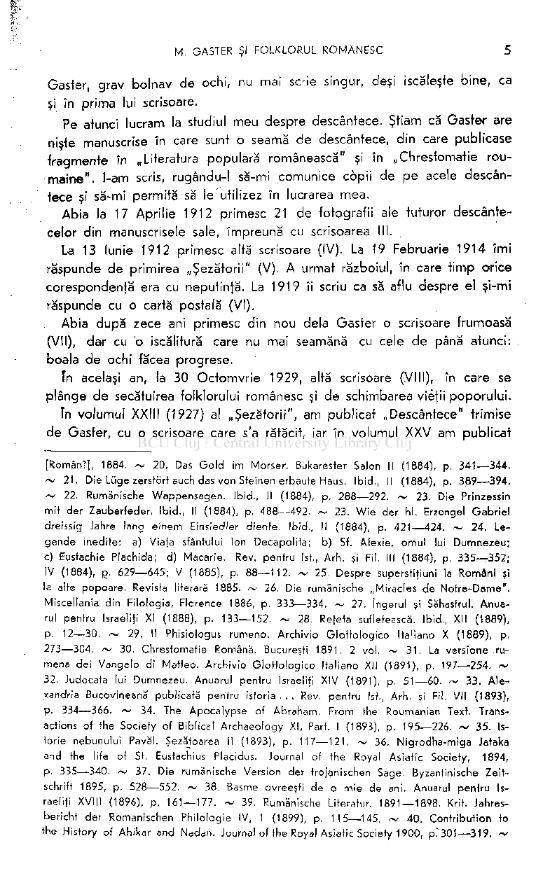

Gaster, grav bolnav de ochi, nu mai scrie singur, deşi iscăleşte bine, ca şi în prima lui scrisoare.

Pe atunci lucram la studiul meu despre descântece. Ştiam că Gaster are nişte manuscrise în care sunt o seamă de descântece, din care publicase fragmente în „Literatura populară românească" şi în „Chrestomatie roumaine", l-am scris, rugându-l să-mi comunice côpii de pe acele descântece şi să-mi permită să le utilizez în lucrarea mea.

Abia la 17 Aprilie 1912 primesc 21 de fotografii ale tuturor descântecelor din manuscrisele sale, împreună cu scrisoarea III.

La 13 Iunie 1912 primesc altă scrisoare (IV). La 19 Februarie 1914 îmi răspunde de primirea „Şezătorii" (V). A urmat războiul, în care timp orice corespondenţă era cu neputinţă. La 1919 îi scriu ca să aflu despre el şi-mi

- răspunde cu o cartă poştală (VI). Abia după zece ani primesc din nou delà Gaster o scrisoare frumoasă

(VII), dar cu o iscălitură care nu mai seamănă cu cele de până atunci: boala de ochi făcea progrese.

în acelaşi an, la 30 Octomvrie 1929, altă scrisoare (VIII), în care se plânge de secătuirea folklorului românesc şi de schimbarea vieţii poporului.

în volumul XXIII (1927) al „Şezătorii", am publicat „Descântece" trimise de Gaster, cu o scrisoare care s'a rătăcit, iar în volumul XXV am publicat

[Român?], 1884. ~ 20. Das Gol d im Morser. Bukarester Salon II (1884), p. 341—344 .

- ~ 21 . Die Lüge zerstört auch das von Steinen erbaute Haus. Ibid., II (1884), p. 389—394 .
- ~ 22. Rumänische Wappensagen . Ibid., II (1884), p. 288—292 . ~ 23. Die Prinzessin mit der Zauberfeder. Ibid., II (1884), p. 488—492 . ~ 23. Wi e der hl. Erzengel Gabrie l dreissig Jahre lang einem Einsiedler diente. Ibid., II (1884), p. 421—424 . ~ 24. Legend e inedite: a) Viaţa sfântului Ion Decapolifa; b) Sf. Alexie, omu l lui Dumnezeu ; c) Eusfachie Plachida; d) Macarie. Rev. pentru Ist., Arh. şi Fii. III (1884), p. 335—352 ; IV (1884), p. 629—645 ; V (1885), p. 88—112 . ~ 25. Despre superstiţiuni la Români şi la alte popoare. Revista literară 1885. ~ 26. Die rumänische „Miracles de Notre-Dame" . Miscellania din Filologia, Florence 1886, p. 333—334 . ~ 27. îngerul şi Săhasfrul. Anua rul pentru Israeliţi XI (1888), p. 133—152. ~ 28. Refeta sufletească. Ibid., XII (1889), p. 12—30 . ~ 29. II Phisiologus rutneno. Archivio Glottologic o Italiano X (1889), p. 273—304 . ~ 30. Chrestomatie Română. Bucureşti 1891. 2 vol. ~ 31 . La versione.ru mena dei Vangelo di Matteo. Archivio Glottologic o Italiano XII (1891), p. 197—254 . ~

32. Judecata lui Dumnezeu. Anuarul pentru Israelifi XIV (1891), p. 51—60 . ~ 33. Ale xandria Bucovineană publicată pentru istoria . . . Rev. pentru Ist., Arh. şi Fil. VII (1893)

- P- 334—366 . ~ 34. The Apocalypse of Abraham. From the Routmanian Text. Transactions of the Society of Biblical Archaeology XI, Part. I (1893), p. 195—226. ~ 35. Istorie nebunului Pavăl. Şezătoarea II (1893), p. 117—121 . ~ 36. Nigrodha-mig a Jataka and the life of St. Eustachius Placidus. Journal of the Royal Asiatic Society, 1894,
- P- 335—340 . ~ 37. Die rumänische Version der trojanischen Sage. Byzantinische Zeitschrift 1895, p. 528—552 . ~ 38. Basme ovreeşti de o mi e de ani. Anuarul pentru Israelifi XVIII (1896), p. 161—177. ~ 39. Rumänische Literatur, 1891—1898. Krit. Jahresbericht der Romanischen Philologie IV, 1 (1899), p. 115—145. ~ 40. Contribution to

the History of Ahikar and Nadan. Journal of the Royal Asiatic Society 1900, p? 301—319 . ~

„Povestea poamelor", pe care mi-a trimis-o cu scrisoarea din August 1929. La 28 Decemvrie primesc o nouă scrisoare (IX). Iscălitura delà sfârşitul ei arată că Gaster era orb.

în 1928 călătoream, cu trenul, delà Praga la Brno; mă duceam să văd pe Hedvig Jarnik, profesor la Universitate, fiul prietenului meu loan UrbanJarnik. In compartimentul meu era o doamnă, care, fără să mă cunoască, mi-a oferit o bucată de şocolată. Astfel am făcut cunoştinţă cu o englezoaică din Londra. Era o prietenă a lui Gaster, despre care am vorbit amândoi mai multă vreme.

Am rămas surprins de această întâmplare şi mulţămit că am putut să rog pe doamna să transmită sincerele mele salutări prietenului Gaster.

El mi-a mai scris referitor la lucrarea mea „Descântecele Românilor" (X). Acestea au fost singurele aprecieri ce mi s'au făcut, de către învăţaţii noştri despre „Descântece".

Cu privire la volumul meu' „Ouăle de Paşti" în 1933 m'am adresat lui Gaster, cerându-i să-mi dea informaţii asupra acestui obiceiu în Anglia, despre care aveam prea puţine cunoştinţe. El îmi răspunde prin scrisoarea XI.

Ultima scrisoare am primit-o la sfârşitul anului 1937 (XII). ARTUR GOROVEI

41 . Geschichte der rumänischen Literatur. Grundriss der Romanischen Philologie II (1900), 3, p. 262—428 . ~ 42. Chanukah. Das Fest der Frauen. Die Wel t (Köln), 1907, Nr. 48, p. 11—12. ~ 43. Light in Custom and Superstition. The llluminating Engineer (London), 1909, p. 660—662 ; 731—733 ; 804—806 . ~ 44. The Sibyl and the dream of one hundred uns. An ol d Apocryphon . Journal of the Royal Asiatic Society 1910, p. 601—623 .

- ~ 45. Rumanian Bird and Beast Stories. London 1915. The Folk Lore Society, XX + 381 p.
- ~ 46. Tobit und Ahikar. Journal of Apocrypha (London), 1915 (lan.), p. 4—7 . ~ 47. Roumanian Popular Legende of the Lady Mary. Folk Lore 1923, p. 45—85 . ~ 48. The Exempla of the Rabbis. Leipzig, 1924. Asia Publ. Co., 314 + 208 p. ~ 49. Studies and Texts in Folklore, Magic, Medieval Romance, Hebre w Apocrypha and Samaritan Archaeology. London 1925—1928. 3 vol., XVI + VI + VI +135 6 + 278 p. ~ 50. Children's stories from Rumanian Legends and Fairy Tales. London (1927), 135 p. ~ 51 . Povestea Poamelor. Şezătoarea 1929, p. 3. ~ 52. Conjurations and the ancient Mysteries. Search (London), 1932, p. 102—116 ; 211—236 . ~ 53. Povestea lui Pafnutie sau Tovarăşul in Rai. Sinai (Bucureşti) 1933, 10 p. ~ 54. Roumanian Ballads and Slavonie Epic Poetry. Slavonie Review (London) XII (1933), 34, p. 167—180. ~ 55. Gypsy Musician in Mol davia. Journal of the Gipsy Lore Society XII (1933), p. 109. ~ 56. Rumanian Gypsies in 1560, Ibid., XII (1933), p. 61 . ~ 57. Rumanian Gypsy Folk Tales. Ibid., XII (1933), p. 166—189. ~ 58. Beiträge zur vergleichenden Sagen- und Märchenkunde. Monatsschrift für Geschichte und Wissenschaft des Judentums LXXVII (1933), p. 431—435 ; LXXVIII (1934), p. 273—278 , 324—343 ; LXXX (1936), p. 32—52 . ~ 59. Anton Pann. Povestea Vorbi i cu introducere de Dr. M. Gaster. Craiova, 1936. XCV + 326 p. ~ 60. Rumanian Gyps y Folk Tales, Journal of the Gipsy Lore Society XV (1936), p. 10—21 . ~ 61 . Articolele Haşdeu, Stürza şi Văcărescu, Encyclopaedia Britannica XI, p. 241 ; XXI, p. 485; XXII, p. 921 . ~ 62. The Educaţional importance of Folk Lore.

I.

Londra, 37 Maida Vale, 16. XI, 93. Domnul meu ,

Lipsa mea din Londra — căci eram dus la mare p e vre o 6 săptămâni — este cauza întârzierii răspunsului me u la cartea de poştă a d-tale.

Tntr'adevăr n'am primit ultimul No . al „Şezătoarei" şi voi u fi foarte recunoscător da că-l vei trimite.

Cu aceeaşi ocaziune mă grăbesc a te felicita d e fericita idee ce ai avut a întreprinde o atare publicafiune, şi totdeodată a-fi mulfumi pentru amabilitatea ce o ai a mi- o trimite. Cum d e mă voiu vede a pufin uşurat d e greul lucrului ce stă acuma pe mine, voiu scrie o dare de seamă despre „Şezătoarea" în „Revista Societăţii Folklorului " d e aci.

Ifi trimet aci alăturat şi o snoavă veche românească ce am copiat-o întocmai cu ortografia originalului dintr'un manuscris al meu . Ms. este d e pe la sfârşitul veacului trecut. Povestea sau snoava pe care o consider a fi cea mai veche, d e care am dat până acuma în literatura veche, este foarte hazlie. Precum vezi este scrisă în dialectul mol dovenesc, pe care l-am reprodus cu sfinfenie. Unele foarte mici lacune — hârtia fiind cam ştirbită p e la margini — le-am umplu t după analogia cu restul textului.

Când o publici te rog , trimefe-mi vr'o 10—1 2 exemplare din această snoavă. Al d-tale devotat

Dr. M. GASTER

#### II.

London, 26 Dec. 1911. Stimate Domnule Gorovei ,

Mă iartă, te rog, că nu fi-am răspuns până acuma la scrisoarea d-tale din 27 Noem brie trecut. Nu este vina mea. Din nenorocire încă din Ianuarie anul curent sufer d e boală de ochi şi n'am voie să citesc sau să scriu. Altfel d e mult fi-aş fi scris şi ji-aş fi trimes copii după descântece din manuscriptele mele . A m trebuit însă să aştept ca un prieten din România care a ajuns Englez, dar vine şi-mi citeşte acuma româneşte

- să găsească vrem e slobodă să vie şi să-mi scrie scrisoarea de fafă, el cu condeiul , eu cu gândul.

Mă bucur foarfe mult că faci o culegerej cât se poate d e complectă a descântecelor şi, nu mă îndoesc că o să fie o lucrare pe atât de bogată pe cât d e ştienfifică. Eu voiu face tot ce-mi stă prin putinfă ca să te ajut, dar nu ştiu cum să o fac. Prietenul meu n'a uitat încă literele, a uitat însă buchile şi cu gre u o să-l învăf să citească slova în trei caturi. Voiu căuta însă să găsesc tot ce mi se pare mai important şi-}i voi u fri mete fotografiile. D-ta vei fi în stare să citeşti însuşi originalul, ba vei putea chiar să reproduci unul sau altul din descântecele acestea. Mai a m printre hărtiile mel e nişte descântece foarte primitive culese d e mine în Târgovişte acuma vre o 35 de ani, numai doar de le-aş putea găsi. A m o bibliotecă uriaşă şi cu ochii mei slăbifi îmi vine cam greu să pun mâna îndată pe cariea sau manuscrisul ce-l caut. Oricu m sunt sigur că le găsesc şi cum le-oi găsi o să Ie trimit îndată.

Cunoşti Dta broşura întitulată „ O carte d e desfăcut farmecile", tipărită de Klosius, fiindcă acolo descântecul „De desfăcut pentru fapt" este tipărit complect, tn împrejură rile de fafă ştiu că voi întimpina mari greutăfi de a găsi foile din manuscrisele mel e ce confin descântece, totuşi nădăjduesc să reuşesc şi fără greş îfi voi trimete fotografiile.

Primeşte, te rog, încredinţarea cinstei mel e celei mai alese.

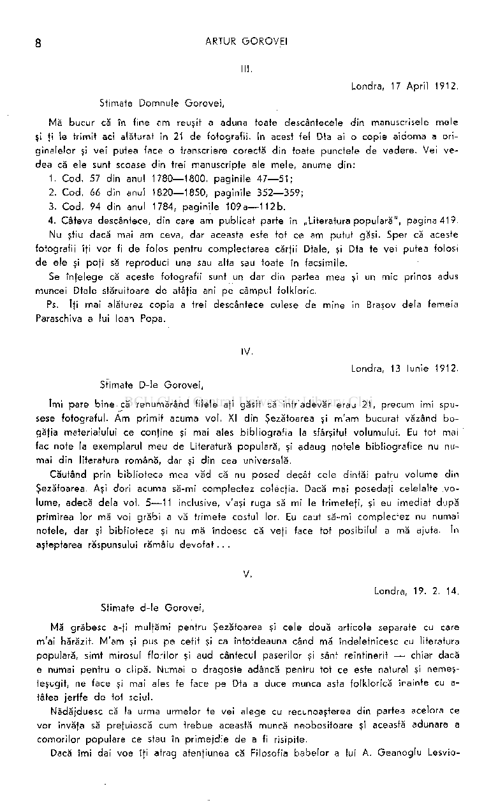

III.

Londra, 17 April 1912. Stimate Domnule Gorovei ,

Mă bucur că în fine am reuşit a aduna toate descântecele din manuscrisele mele şi ţi le trimit aci alăturat în 21 de fotografii. In acest fel Dta ai o copie aidoma a originalelor şi vei putea face o transcriere corectă din toate punctele de vedere. Vei ve dea că ele sunt scoase din trei manuscripte ale mele, anume din :

- 1. Cod . 57 din anul 1780—1800, paginile 47—51 ;
- 2. Cod . 66 din anul 1820—1850, paginile 352—359 ;
- 3. Cod . 94 din anul 1784, paginile 109a—112b .
- 4. Câteva descântece, din care a m publicat parte în „Literatura populară" , pagina 419. Nu ştiu dacă mai am ceva, dar aceasta este tot ce am putut găsi. Sper că aceste

fotografii îfi vor fi de folos pentru complectarea cărţii Dfale, şi Dta te vei putea folosi

- d e ele şi poţi să reproduci una sau alta sau toate în facsimile. Se înţelege că aceste fotografii sunt un dar din partea mea şi un mic prinos adus

muncei Dtale stăruitoare d e atâţia ani pe câmpul folkloric.

Ps. Iţi mai alăturez copia a trei descântece culese de mine în Braşov delà femeia Paraschiva a lui loan Popa.

IV.

Londra, 13 Iunie 1912. Stimate D-le Gorovei ,

tmi pare bine că renumărând filele aţi găsit că într'adevăr erau 21 , precum îmi spusese fotograful. A m primit acuma vol . XI din Şezătoarea şi m'am bucurat văzând bo găţia materialului ce confine şi mai ales bibliografia la sfârşiful volumului. Eu tot mai fac note la exemplarul me u de Literatură populară, şi adaug notele bibliografice nu numai din literatura română, dar şi din cea universală.

Căutând prin biblioteca mea vă d că nu posed decât cele dintăi patru volum e din Şezătoarea. Aşi dori acuma să-mi complectez colecţia. Dacă mai posedaţi celelalte vo lume, adecă delà vol . 5—11 inclusive, v'aşi ruga să mi le trimetefi, şi eu imediat după primirea lor mă voi grăbi a vă trimete costul lor. Eu caut să-mi complectez nu numai notele, dar şi biblioteca şi nu mă îndoesc că veţi face tot posibilul a mă ajuta. In aşteptarea răspunsului rămâiu devotat . . .

V.

Londra, 19. 2. 14. Stimate d-le Gorovei ,

Mă grăbesc a-ţi mulţămi pentru Şezătoarea şi cele două articole separate cu care m'ai hărăzit. M'am şi pus pe cetit şi ca întotdeauna când mă îndeletnicesc cu literatura populară, simt mirosul florilor şi aud cântecul paserilor şi sânt reîntinerit — chiar dacă

- e numai pentru o clipă. Numai o dragoste adâncă pentru tot ce este natural şi nemeşteşugit, ne face şi mai ales te face pe Dta a duce munca asta folklorică înainte cu atâtea jertfe d e tot soiul.

Nădăjduesc că la urma urmelor te vei alege cu recunoaşterea din partea acelora ce vor învăţa să prefuisscă cum trebue această muncă neobositoare şi această adunare a comorilor populare ce stau în primejdi e de a fi risipite.

Dacă îmi dai voe îţi atrag atenţiunea că Filosofia babelor a lui A. Geanogl u Lesvio-

dax a fost pomenită de mine în Literatura populară p. 516. Pomii împleticiţi în baladele populare, ibid., p. 483 şi 576.

De asemenea am vorbit pe larg de povestea lui Melchisedec ib. p. 301—306. Toate aceste se află în volumul din Şezătoarea şi văd că Literatura populară a mea tot mai poate fi de folos. De asemenea vezi cu cată băgare de seamă am cetit cartea Dtale.

Incă odată mulţămindu-ţi rămâiu al Dtale . . .

VI.

193, Maida Vale, Londra, 24. 3. 19. Stimate D-le Gorovei ,

Mult m'am bucurat primind azi c. p. a Dtale anunţându-mă că ai scăpat teafăr de urgia timpului, dar că nu ai reluat încă studiile folklorice. Nu mă mir, din potrivă m'aşi fi mirat dacă după toate ce s'au întâmplat ar putea cineva găsi deja cumpătul şi pacea sufletească trebuincioasă pentru astfel de cercetări. Eu aci caut să mă odihnesc puţin de munca sufletească şi trupească ce am avut şi o mai avem, totuşi mai lucrez şi dacă pot să te slujesc cu ceva n'ai decât a scrie la al Dtale devotat . . .

VII

193, Maida Vale, Londra W. 9, 29. 8. 29. Stimate Domnule Gorovei ,

O domnişoară din ţară îşi petrece vacanţele la mine. Ea mă ajută să răsfoesc teancurile cele vechi. A m găsit acolo câteva lucruri, care cred că vor fi interesante pentru cititorii Şezătoarei. Deocamda'ă îfi trimet aci un crâmpei. Se poate că ar fi bine să transcriu şi textul cel vechiu din Chrestomatia mea, dar totuşi să-i lăsăm să citească slova veche. Bine ar fi dacă s'ar îndeletnici ei cu cititul cărţilor vechi, că doar o să scape limba de toate bazaconiile ce au băgat în limbă. Oricum mă mulţămesc cu această mică bucăfică până la mai multe mai tărziu. Te rog să ai bunăvoinţă să mă înştiinţezi de primirea acestei scrisori.

Cu toată stima ce ţi-o păstrez pentru munca îndelungată şi rodnică pe tărâmul folklorului român, mă închin Dumitale cu toată cinstea.. .

VIII.

Londra W. 9, Maida Vale, 193, 30. X. 1929

Stimate Domnule Gorovei ,

A m aflat cu multă plăcere, că te pregăteşti să publici volumul 25 al „Şezătoarei", ajungând astfel la prăznuirea unui jubileu, care, precum mi se pare, n'are seamăn în ţara românească, în ce priveşte publicaţie ştiinţifică. Meritul acestei publicaţiuni va creşte cu cât va trece mai multă vreme. Orice s'ar zice, isvorul folklorului român începe a se seca. înrâuririle cele noi gonesc cu desăvâşire din sufletul poporului atât credinţele cele vechi, obiceiurile casnice, credinţele religioase, chiar şi poesia. N'are cineva decât să compare ceea ce ai publicat în primel e volume, cu materialul ce se adună acuma din gura poporului , spre a vedea, cum sărăceşte din ce în ce mai mult. Cazarma, şcoala, poate şi chiar biseriica schimbă cu totul viaţa poporului. Naivitatea din vremurile trecute dă loc acuma la o subtilitate spirituală, care nu mai dă păs po porului să răsufle; pentru mine distanţa de acum 50 d e anî este atât de mare, încât îmi vine să cred că am trăit câteva veacuri. Cine îşi mai aduce astăzi aminte de „aga" , „ipistat", „zafciu" , cine mai ştie de „sfanţ", şi „carboavă" , de „zlot" , „firfirică", „Ies-

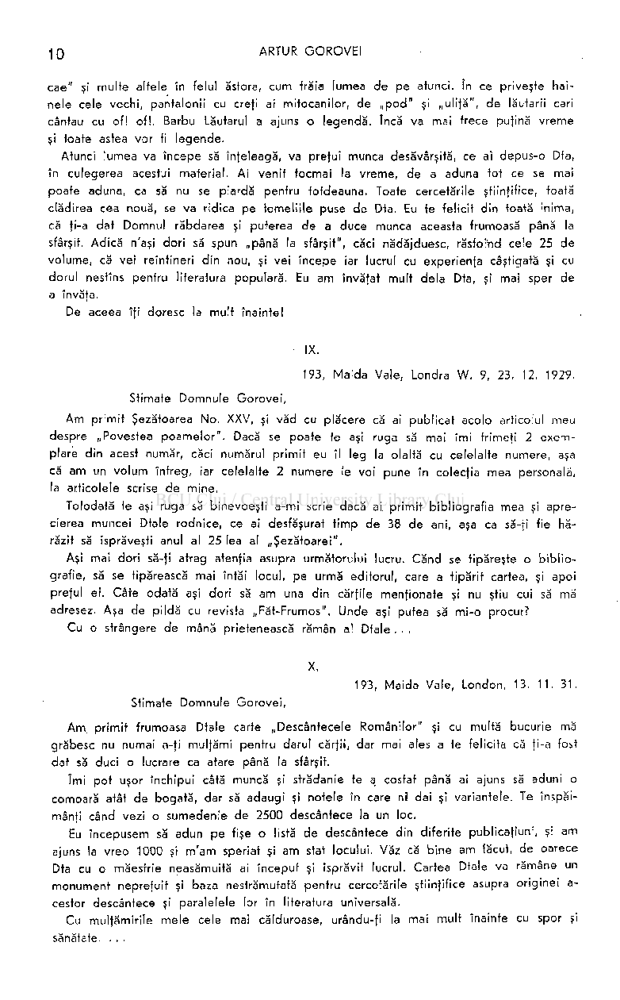

cae " şi multe altele în felul ăstora, cum trăia lumea de pe atunci. In ce priveşte hainele cele vechi, pantalonii cu creji ai mitocanilor, d e „pod " şi „uliţă" , de lăutarii cari cântau cu of! of!. Barbu Lăutarul a ajuns o legendă. încă va mai trece pufină vrem e şi toate astea vor fi legende.

Atunci lumea va începe să înjeleagă, va preţui munca desăvârşită, ce al depus-o Dta, în culegerea acestui material. Ai venit tocmai la vreme, de a aduna tot ce se mai poate aduna, ca să nu se piardă pentru totdeauna. Toate cercetările ştiinţifice, toată clădirea cea nouă, se va ridica pe temeliile puse d e Dta. Eu te felicit din toată inima, că fi-a dat Domnul răbdarea şi puterea d e a duce munca aceasta frumoasă până la sfârşit. Adică n'aşi dori să spun „până la sfârşit", căci nădăjduesc, răsfoind cele 25 de volume, că vei reîntineri din nou, şi vei începe iar lucrul cu experienfa câştigată şi cu dorul nestins pentru literatura populară. Eu am învăfat mult delà Dta, şi mai sper de a învăţa.

De aceea îfi doresc la mult înainte!

IX.

193, Maida Vale, Londra W. 9, 23. 12. 1929.

Stimate Domnule Gorovei ,

A m primit Şezătoarea No. XXV, şi văd cu plăcere că ai publicat acolo articolul meu despre „Povestea poamelor" . Dacă se poate te aşi ruga să mai îmi frimeţi 2 exem plare din acest număr, căci numărul primit eu îl leg la olaltă cu celelalte numere, aşa că am un volu m întreg, iar celelalte 2 numere le voi pune în colecţia mea personală, la articolele scrise de mine.

Totodată te aşi ruga să binevoeşti a-mî scrie dacă ai, primit bibliografia mea şi aprecierea muncei Dtale rodnice, ce ai desfăşurat tim p de 38 d e ani, aşa ca să-ţi fie hărăzit să isprăveşti anul al 25 lea al „Şezătoarei".

Aşi mai dori să-fi atrag atenţia asupra următorului lucru. Cănd se tipăreşte o biblio grafie, să se tipărească mai întăi locul, pe urmă editorul, care a tipărit cartea, şi apoi preţul ei. Câte odată aşi dori să am una din cărţile menţionate şi nu ştiu cui să mă adresez. Aşa de pildă cu revista „Făt-Frumos". Unde aşi putea să mi- o procur?

Cu o strângere de mână prietenească rămân al Dtale . . .

X.

193, Maida Vale, London, 13. 11 . 31 . Stimate Domnule Gorovei ,

A m primit frumoasa Dtale carte „Descântecele Românilor" şi cu multă bucurie mă grăbesc nu numai a-ţi mulţămi pentru darul cărţii, dar mai ales a te felicita că ţi-a fost dat să duci o lucrare ca atare până la sfârşit.

Îmi pot uşor închipui câtă muncă şi strădanie te a_ costat până ai ajuns să aduni o comoară atât de bogată, dar să adaugi şi notele în care nî dai şi variantele. Te înspăimânţi când vezi o sumedenie de 2500 descântece la un loc.

Eu începusem să adun pe fişe o listă de descântece din diferite publicaţiuni, şi am ajuns la vreo 1000 şi m'am speriat şi am stat locului. Văz că bine am făcut, de oarece Dta cu o măestrie neasămuită ai început şi isprăvit lucrul. Cartea Dtale va rămâne un monument nepreţuit şi baza nestrămutată pentru cercetările ştiinţifice asupra originel acestor descântece şi paralelele lor în literatura universală.

Cu mulţămirile mel e cele mai călduroase, urându-fi la mai mult înainte cu spor şi sănătate. . . .

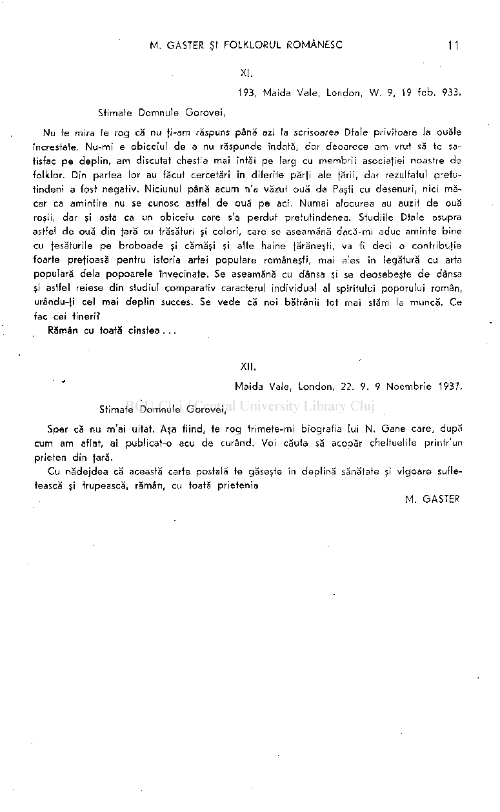

XI.

193, Maida Vale, London, W. 9, 19 feb . 933.

Sfimate Domnule Gorovei ,

Nu fe mira te rog că nu fi-am răspuns până azi la scrisoarea Dfale privitoare la ouăle încresfate. Nu-m i e obiceiul de a nu răspunde îndată, dar deoarece am vrut să te satisfac pe deplin , am discutat chestia mai întăi pe larg cu membri i asociaţiei noastre de folklor. Din partea lor au făcut cercetări în diferite părţi ale ţării, dar rezultatul pretutindeni a fost negativ. Niciunul până acum n'a văzut ouă de Paşti cu desenuri, nici măcar ca amintire nu se cunosc astfel de ouă pe aci. Numai alocurea au auzit d e ouă roşii, dar şi asta ca un obiceiu care s'a perdut pretutindenea. Studiile Dtale asupra astfel de ouă din ţară cu trăsături şi colori, care se aseamănă dacă-mi aduc aminte bine cu ţesăturile pe broboad e şi cămăşi şi alte haine ţărăneşti, va fi deci o contribuţie foarte preţioasă pentru istoria arfei populare româneşti, mai ales în legătură cu arta populară delà popoarel e învecinate. Se aseamănă cu dânsa şi se deosebeşte d e dânsa şi astfel reiese din studiul comparativ caracterul individual al spiritului poporului român, urându-ţi cel mai depli n succes. Se ved e că noi bătrânii tot mai stăm la muncă. Ce fac cei tineri?

Rămân cu toată cinstea . . .

XII.

Maida Vale, London, 22. 9. 9 Noembri e 1937.

Stimate Domnule Gorovei ,

Sper că nu m'ai uitat. Aşa fiind, te rog trimete-mi biografia lui N. Gane care, după cum am aflat, ai publicat-o acu de curând. Voi căuta să acopăr cheltuelile printr'un prieten din ţară.

Cu nădejdea că această carte poştală te găseşte în deplină sănătate şi vigoare sufletească şi trupească, rămân, cu toată prietenia

M. GASTER

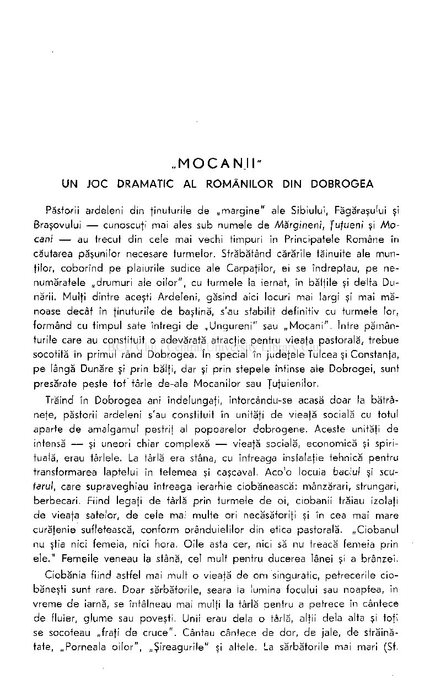

## „MOCANII "

UN JOC DRAMATIC AL ROMÂNILOR DIN DOBROGEA

Păstorii ardeleni din ţinuturile de „margine" ale Sibiului, Făgăraşului şi Braşovului — cunoscuţi mai ales sub numele de Mărgineni, Juţueni şi Mocani — au trecut din cele mai vechi timpuri în Principatele Române în căutarea păşunilor necesare turmelor. Străbătând cărările tăinuite ale munţilor, coborînd pe plaiurile sudice ale Carpaţilor, ei se îndreptau, pe nenumăratele „drumuri ale oilor", cu turmele la iernat, în bălţile şi delta Dunării, Mulţi dintre aceşti Ardeleni, găsind aici locuri mai largi şi mai mănoase decât în ţinuturile de baştină, s'au stabilit definitiv cu turmele lor, formând cu timpul sate întregi de „Ungureni" sau „Mocani", intre pământurile care au constituit o adevărată atracţie pentru vieaţa pastorală, trebue socotită în primul rând Dobrogea. în special în judeţele Tulcea şi Constanţa, pe lângă Dunăre şi prin bălţi, dar şi prin stepele întinse ale Dobrogei, sunt presărate peste tot târle de-ale Mocanilor sau Ţuţuienilor.

Trăind în Dobrogea ani îndelungaţi, întorcându-se acasă doar la bătrâneţe, păstorii ardeleni s'au constituit în unităţi de vieaţă socială cu totul aparte de amalgamul pestriţ al popoarelor dobrogene. Aceste unităţi de intensă — şi uneori chiar complexă — vieaţă socială, economică şi spirituală, erau târlele. La târlă era stâna, cu întreaga instalaţie tehnică pentru transformarea laptelui în telemea şi caşcaval. Acolo locuia baciul şi scutarul, care supraveghiau întreaga ierarhie ciobănească: mânzărari, strungari, berbecari. Fiind legaţi de târlă prin turmele de oi, ciobanii trăiau izolaţi de vieaţa satelor, de cele mai multe ori necăsătoriţi şi în cea mai mare curăţenie sufletească, conform orânduielilor din etica pastorală. „Ciobanul nu ştia nici femeia, nici hora. Oile asta cer, nici să nu treacă femeia prin ele." Femeile veneau la stână, cel mult pentru ducerea lânei şi a brânzei.

Ciobănia fiind astfel mai mult o vieaţă de om singuratic, petrecerile cio­

- băneşti sunt rare. Doar sărbătorile, seara ia lumina focului sau noaptea, în vreme de iarnă, se întâlneau mai mulţi la târlă pentru a petrece în cântece de fluier, glume sau poveşti. Unii erau delà o târlă, alţii delà alta şi toţi se socoteau „fraţi de cruce". Cântau cântece de dor, de jale, de străinătate, „Porneala oilor", „Şireagurile" şi altele. La sărbătorile mai mari (Sf.

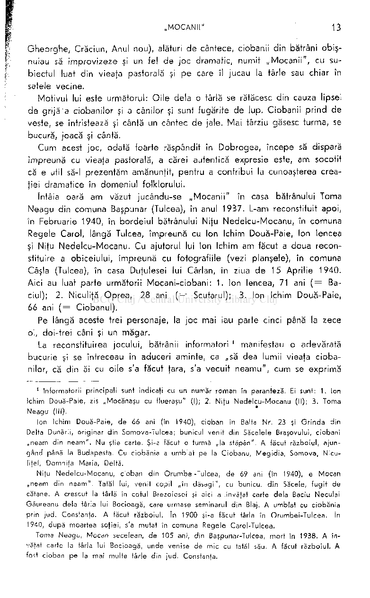

Gheorghe, Crăciun, Anul nou), alături de cântece, ciobanii din bătrâni obişnuiau să improvizeze şi un fel de joc dramatic, numit „Mocanii", cu subiectul luat din vieaţa pastorală şi pe care îi jucau la târle sau chiar în satele vecine.

Motivul lui este următorul: Oile delà o târlă se rătăcesc din cauza lipsei de grijă'a ciobanilor şi a cânilor şi sunt fugărite de lup. Ciobanii prind de veste, se întristează şi cântă un cântec de jale. Mai târziu găsesc turma, se bucură, joacă şi cântă.

Cum acest joc, odată foarte răspândit în Dobrogea, începe să dispară împreună cu vieaţa pastorală, a cărei autentică expresie este, am socotit

- că e util să-l prezentăm amănunţit, pentru a contribui la cunoaşterea creaţiei dramatice în domeniul folklorului.

întâia oară am văzut jucându-se „Mocanii" în casa bătrânului Torna Neagu din comuna Başpunar (Tulcea), în anul 1937. L-am reconstituit apoi, în Februarie 1940, în bordeiul bătrânului Niţu Nedelcu-Mocanu, în comuna Regele Carol, lângă Tulcea, împreună cu Ion Ichim Două-Paie, Ion lencea şi Niţu Nedelcu-Mocanu. Cu ajutorul lui Ion Ichim am făcut a doua reconstituire a obiceiului, împreună cu fotografiile (vezi planşele), în comuna Câşla (Tulcea), în casa Duţulesei lui Cârlan, în ziua de 15 Aprilie 1940. Aici au luat parte următorii Mocani-ciobani: 1. Ion lencea, 71 ani ( = Baciul); 2. Niculiţă Oprea, 28 ani ( = Scutarul); 3. Ion Ichim Două-Paie, 66 ani ( = Ciobanul).

Pe lângă aceste trei personaje, la joc mai iau parte cinci până la zece oi, doi-trei câni şi un măgar.

La reconstituirea jocului, bătrânii informatori manifestau o adevărată bucurie şi se întreceau în aduceri aminte, ca „să dea lumii vieaţa ciobanilor, că din ăi cu oile s'a făcut ţara, s'a vecuit neamu", cum se exprimă

Informatorii principali sunt indicaţi cu un număr roman în paranteză. Ei sunt: 1. Ion Ichim Două-Paie, zis „Mocănaşu cu flueraşu" (I); 2. Niţu Nedelcu-Mocanu (II); 3. Torna Neagu (III).

1

Ion Ichim Două-Paie, de 66 ani (în 1940), cioban in Balta Nr. 23 şi Grind a din Delta Dunării, originar din Somova-Tulcea; bunicul venit din Săcelele Braşovului, ciobani „nea m din neam" . Nu ştie carte. Şi-a făcut o turmă „la stăpân". A făcut războiul, ajungând până la Budapesta. Cu ciobănia a umblat pe la Ciobanu, Megidia , Somova, Niculifel, Domniţa Maria, Deltă.

Niţu Nedelcu-Mocanu , cioban din Orumbei-Tulcea, d e 69 ani (în 1940), e Mocan „nea m din neam" . Tatăl lui, venit copil „în dăsagi", cu bunicul din Săcele, fugit de cătane. A crescut la târlă în cotul Brezoiesei şi aici a învăţat carte delà Baciu Neculai Găureanu delà târla lui Bocioagă, care urmase seminarul din Blaj. A umblat cu ciobănia prin jud . Constanţa. A făcut războiul. în 1900 şi-a făcut târla în Orumbei-Tulcea. în 1940, după moartea soţiei, s'a mutat în comuna Regele Carol-Tulcea.

Torna Neagu, Mocan secelean, de 105 ani, din Başpunar-Tulcea, mort în 1938. A învăţat carte la târla lui Bocioagă, unde venise de mic cu tatăl său. A făcut războiul. A fost cioban pe la mai multe târle din jud . Constanţa.

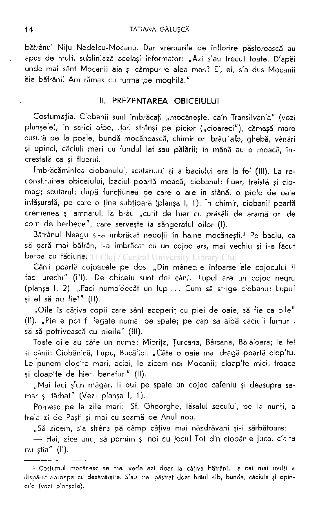

bătrânul Niţu Nedelcu-Mocanu. Dar vremurile de înflorire păstorească au apus de mult, subliniază acelaşi informator: „Azi s'au trecut toate. D'apăi unde mai sânt Mocanii ăia şi câmpurile alea mari? Ei, ei, s'a dus Mocanii ăia bătrâni! Am rămas cu turma pe moghilă."

II. PREZENTAREA OBICEIULUI

Costumafia. Ciobanii sunt îmbrăcaţi „mocăneşte, ca'n Transilvania" (vezi planşele), în sarici albe, iţari strânşi pe picior („cioareci"), cămaşă mare cusută pe la poale, bundă mocănească, chimir ori brâu alb, ghebă, vânări şi opinci, căciuli mari cu fundul lat sau pălării; în mână au o moacă, încrestată ca şi fluerul.

îmbrăcămintea ciobanului, scutarului şi a baciului era la fel (III). La reconstituirea obiceiului, baciul poartă moacă; ciobanul: fluer, traistă şi ciomag; scutarul: după funcţiunea pe care o are în stână, o piele de oaie înfăşurată, pe care o tine subţioară (planşa I, 1). în chimir, ciobanii poartă cremenea şi amnarul, la brâu „cuţit de hier cu prăsăli de aramă ori de corn de berbece", care serveşte la sângeratul oilor (I).

Pe baciu, ca să pară mai bătrân, l-a îmbrăcat cu un cojoc ars, mai vechiu şi i-a făcut barba cu tăciune.

Bătrânul Neagu şi-a îmbrăcat nepoţii în haine mocăneşti.

1

Cânii poartă cojoacele pe dos. „Din mânecile întoarse ale cojocului îi faci urechi" (III). De obiceiu sunt doi câni. Lupul are un cojoc negru (planşa I, 2). „Faci numaidecât un lup . . . Cum să strige ciobanu: Lupul şi el să nu fie?" (II).

„Oile îs câţiva copii care sânt acoperit cu piei de oaie, să fie ca oile" (II). „Pieile pot fi legate numai pe spate; pe cap să aibă căciuli fumurii, să să potrivească cu pieile" (III).

Toate oile au câte un nume: Mioriţa, Ţurcana, Bârsana, Bălăioara; la fel şi cânii: Ciobănică, Lupu, Bucălici. „Câte o oaie mai dragă poartă clop'tu. Le punem clop'te mari, acioi, le zicem noi Mocanii; cloap'te mici, troace şi cloap'te de hier, banaturi" (II).

„Mai faci ş'un măgar. îi pui pe spate un cojoc cafeniu şi deasupra samar şi tărhat" (Vezi planşa I, 1).

Pornesc pe la zile mari: Sf. Gheorghe, lăsatul secului, pe la nunţi, a treia zi de Paşti şi mai cu seamă de Anul nou.

„Să zicem, s'a strâns pă câmp câţiva mai năzdrăvani şi-i sărbătoare:

— Hai, zice unu, să pornim şi noi cu jocul Tot din ciobănie juca, c'alta nu ştia" (II).

Costumul mocănesc se mai ved e azi doar la câţiva bătrâni. La cei mai mulţi a dispărut aproape cu desăvârşire. S'au mai păstrat doar brâul alb, bunda, căciula şi opin cile (vezi planşele).

1

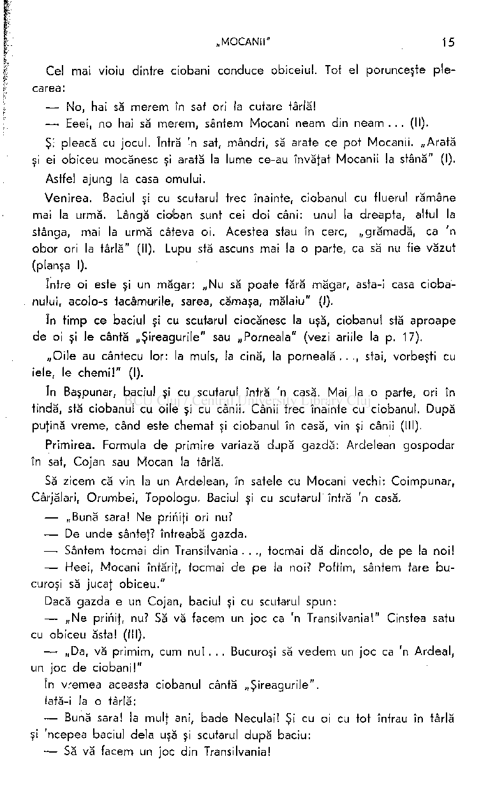

Cel mai vioiu dintre ciobani conduce obiceiul. Tot el porunceşte plecarea:

— No, hai să merem în sat ori la cutare târlă!

— Eeei, no hai să merem, sântem Mocani neam din neam . . . (II). Şi pleacă cu jocul. întră 'n sat, mândri, să arate ce pot Mocanii. „Arată

şi ei obiceu mocănesc şi arată la lume ce-au învăţat Mocanii la stână" (I). Astfel ajung la casa omului.

Venirea. Baciul şi cu scutarul trec înainte, ciobanul cu fluerul rămâne mai la urmă. Lângă cioban sunt cei doi câni: unul la dreapta, altul la stânga, mai la urmă câteva oi. Acestea stau în cerc, „grămadă, ca 'n obor ori la târlă" (II). Lupu stă ascuns mai la o parte, ca să nu fie văzut (planşa I).

între oi este şi un măgar: „Nu să poate fără măgar, asta-i casa ciobanului, acolo-s tacâmurile, sarea, cămaşa, mălaiu" (I).

în timp ce baciul şi cu scutarul ciocănesc la uşă, ciobanul stă aproape de oi şi le cântă „Şireagurile" sau „Porneala" (vezi ariile la p. 17).

„Oile au cântecu lor: la muls, la cină, la porneală . . ., stai, vorbeşti cu iele, le chemi!" (I).

în Başpunar, baciul şi cu scutarul întră 'n casă. Mai la o parte, ori în tindă, stă ciobanul cu oile şi cu cânii. Cânii trec înainte cu ciobanul. După puţină vreme, când este chemat şi ciobanul în casă, vin şi cânii (III).

Primirea. Formula de primire variază după gazdă: Ardelean gospodar în sat, Cojan sau Mocan la târlă.

Să zicem că vin la un Ardelean, în satele cu Mocani vechi: Coimpunar, Cârjălari, Orumbei, Topologu. Baciul şi cu scutarul întră 'n casă.

— „Bună sara! Ne priiiiţi ori nu?

— De unde sânteţ? întreabă gazda.

— Sântem tocmai din Transilvania . . ., tocmai dă dincolo, de pe la noi! — Heei, Mocani întări}, tocmai de pe la noi? Poftim, sântem tare bu­

curoşi să jucat obiceu." Dacă gazda e un Cojan, baciul şi cu scutarul spun:

— „Ne priniţ, nu? Să vă facem un joc ca 'n Transilvania!" Cinstea satu cu obiceu ăsta! (III).

—• „Da, vă primim, cum nu! . .. Bucuroşi să vedem un joc ca 'n Ardeal,

un joc de ciobani!" în vremea aceasta ciobanul cântă „Şireagurile". lată-i la o târlă:

— Bună sara! la mulţ ani, bade Neculai! Şi cu oi cu tot întrau în târlă şi 'ncepea baciul delà uşă şi scutarul după baciu:

— Să vă facem un joc din Transilvania!

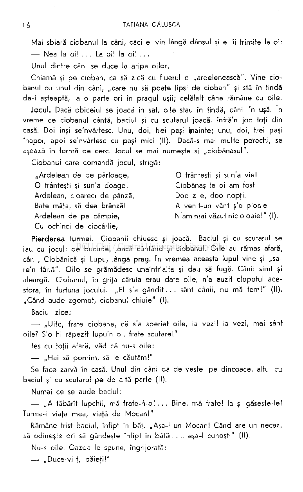

Mai sbiară ciobanul la câni, căci ei vin lângă dânsul şi el îi trimite la oi:

— Nea la oi! .. . La oi! la oi! .. . Unul dintre câni se duce la aripa oilor.

Chiamă şi pe cioban, ca să zică cu fluerul o „ardelenească". Vine ciobanul cu unul din câni, „care nu să poate lipsi de cioban" şi stă în tindă de-l aşteaptă, la o parte ori în pragul uşii; celălalt câne rămâne cu oile.

Jocul. Dacă obiceiul se joacă în sat, oile stau în tindă, cânii 'n uşă. In vreme ce ciobanul cântă, baciul şi cu scutarul joacă. Intră'n joc toţi din casă. Doi inşi se'nvârtesc. Unu, doi, trei paşi îinainte; unu, doi, trei paşi înapoi, apoi se'nvârtesc cu paşi mici (II). Dacă-s mai multe perechi, se aşează în formă de cerc. Jocul se mai numeşte şi „ciobănaşul".

Ciobanul care comandă jocul, strigă: „Ardelean de pe pârloage, O trânteşti şi sun'a vie! O trânteşti şi sun'a doage! Ciobănaş la oi am fost Ardelean, cioareci de pânză, Doo zile, doo nopţi. Bate mâţa, să dea brânză! A venit-un vânt ş'o ploaie Ardelean de pe câmpie, N'am mai văzut nicio oaie!" (I). Cu ochinci de ciocârlie,

Pierderea turmei. Ciobanii chiuesc şi joacă. Baciul şi cu scutarul se iau cu jocul; de bucurie, joacă cântând şi ciobanul. Oile au rămas afară, cânii, Ciobănică şi Lupu, lângă prag. în vremea aceasta lupul vine şi „sare'n târlă". Oile se grămădesc una'ntr'alta şi dau să fugă. Cânii simt şi aleargă. Ciobanul, în grija căruia erau date oile, n'a auzit clopotul acestora, în furtuna jocului. „El s'a gândit.. . sânt cânii, nu mă tem!" (II). „Când aude zgomot, ciobanul chiuie" (I).

Baciul zice:

— „Uite, frate ciobane, că s'a speriat oile, ia vezi! ia vezi, mai sânt oile? S'o hi răpezit lupu'n oi, frate scutare!"

Ies cu toţii afară, văd că nu-s oile: — „Hai să pornim, să le căutăm!" Se face zarvă în casă. Unul din câni dă de veste pe dincoace, altul cu

baciul şi cu scutarul pe de altă parte (II). Numai ce se aude baciul:

— „A tăbărît lupchii, mă frate-n-o! . . . Bine, mă frate! la şi găseşte-le! Turma-i viaţa mea, viaţă de Mocan!"

Rămâne trist baciul, înfipt în băţ. „Aşa-i un Mocan! Când are un necaz, să odineşte ori să gândeşte înfipt în bâtă . . ., aşa-l cunoşti" (II).

Nu-s oile. Gazda le spune, îngrijorată:

— „Duce-vi-ţ, băieţi!"

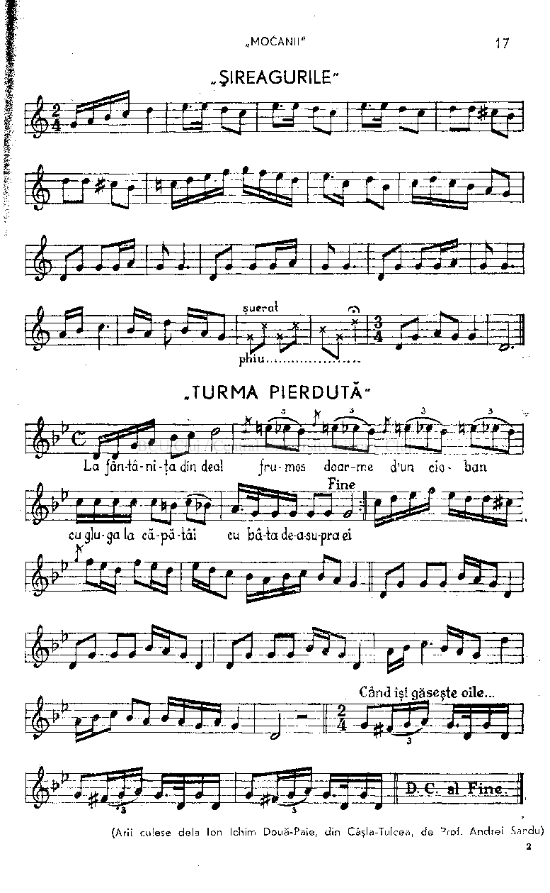

„ŞIREAGURILE"

i #^=T ^Ë^f l LS [f l UC f I LT«Ş

TT ... —> 5 -

è

# ^

# i^^rTji7,ii

# îi-i;j: ^

r

u

phiu... 7N.

## „TURMA PIERDUTĂ"

### La jân-tâ-ni-ţa din deal Jru-mos doar-me d'un cio- ban

cuglu-gala că-pă-tâi cu bâ-lade-asu-praei

Când îsi găseşte oile...

.

- r

### D. C. al Firrer

(Arii culese delà Ion lehim Două-Paie, din Câşla-Tulcea, de Prof. Andre i Sandu)

2

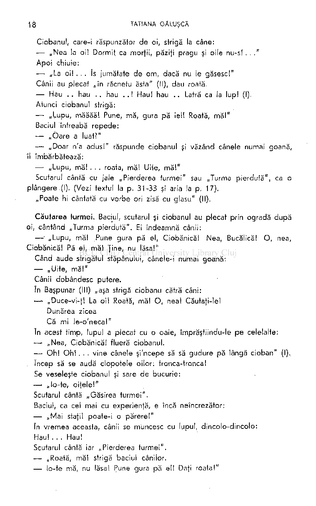

Ciobanul, care-i răspunzător de oi, strigă la câne:

— „Nea la oi! Dormit ca morţii, păziţi pragu şi oile nu-s! . . ." Apoi chiuie:

— „La oi! . . . îs jumătate de om, dacă nu le găsesc!" Cânii au plecat „în răcnetu ăsta" (II), dau roată.

— Hau . . hau . . hau .. ! Hau! hau . . Latră ca la lup! (I). Atunci ciobanul strigă:

— „Lupu, măăăă! Pune, mă, gura pă iei! Roată, mă!" Baciul întreabă repede:

— „Oare a luat?"

— „Doar n'a adus!" răspunde ciobanul şi văzând cânele numai goană, îl îmbărbătează:

— „Lupu, mă! . . . roata, mă! Uite, mă!" Scutarul cântă cu jale „Pierderea turmei" sau „Turma pierdută", ca o

plângere (I). (Vezi textul la p. 31-33 şi aria la p. 17). „Poate hi cântată cu vorbe ori zisă cu glasu" (II).

Căutarea turmei. Baciul, scutarul şi ciobanul au plecat prin ogradă după oi, cântând „Turma pierdută". Ei îndeamnă cânii:

—• „Lupu, mă! Pune gura pă el, Ciobănică! Nea, Bucălică! O, nea, Ciobănică! Pă el, măi Ţine, nu lăsa!"

Când aude strigătul stăpânului, cânele-i numai goană:

— „Uite, mă!" Cânii dobândesc putere. în Başpunar (III) „aşa strigă ciobanu cătră câni:

— „Duce-vi-ţ! La oi! Roată, mă! O, nea! Căutaţi-le! Dunărea zicea Că mi le-o'neca!"

în acest timp, lupul a plecat cu o oaie, împrăştiindu-le pe celelalte:

— „Nea, Ciobănică! flueră ciobanul.

— Oh! Oh! . . . vine cânele şi'ncepe să să gudure pă lângă cioban" (I),

. încep să se audă clopotele oilor: tronca-tronca! Se veseleşte ciobanul şi sare de bucurie:

— „lo-te, oiţele!" Scutarul cântă „Găsirea turmei". Baciul, ca cel mai cu experienţă, e încă neîncrezător:

— „Mai staţi! poate-i o părere!" în vremea aceasta, cânii se muncesc cu lupul, dincolo-dincolo: Hau!.. . Hau! Scutarul cântă iar „Pierderea turmei". — „Roată, mă! strigă baciul cânilor. — lo-te mă, nu lăsa! Pune gura pă el! Daţi roata!"

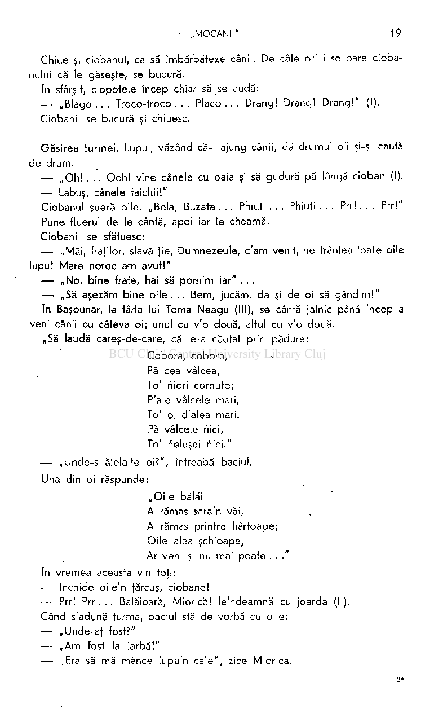

Chiue şi ciobanul, ca să îmbărbăteze cânii. De câte ori i se pare ciobanului că le găseşte, se bucură.

în sfârşit, clopotele încep chiar să se audă:

— „Blago . . . Troco-troco . . . Placo . . . Drang! Drang! Drang!" (I). Ciobanii se bucură şi chiuesc.

Găsirea turmei. Lupul, văzând că-l ajung cânii, dă drumul oii şi-şi caută de drum.

— „Oh ! . . . Ooh! vine cânele cu oaia şi să gudură pă lângă cioban (I).

— Lăbuş, cânele taichii!" Ciobanul şueră oile. „Bela, Buzata . . . Phiuti . . . Phiuti . . . Prr! . . . Prr!" Pune fluerul de le cântă, apoi iar le cheamă. Ciobanii se sfătuesc:

— „Măi, fraţilor, slavă ţie, Dumnezeule, c'am venit, ne trântea toate oile lupu! Mare noroc am avut!"

— „No, bine frate, hai să pornim iar" . . .

— „Să aşezăm bine oile. . . Bem, jucăm, da şi de oi să gândim!" în Başpunar, la târla lui Torna Neagu (III), se cântă jalnic până 'ncep a

veni cânii cu câteva oi; unul cu v'o două, altul cu v'o două.

„Să laudă careş-de-care, că le-a căutat prin pădure: Cobora, cobora, Pă cea vâlcea, To' niori cornute; P'ale vâlcele mari, To' oi d'alea mari. Pă vâlcele nici, To' neluşei nici."

— „Unde-s ălelalte oi?", întreabă baciul. Una din oi răspunde:

„Oile bălai A rămas sara'n văi, A rămas printre hârtoape; Oile alea şchioape, Ar veni şi nu mai poate . . ."

în vremea aceasta vin toţi:

— închide oile'n ţărcuş, ciobane!

— Prr! Prr . . . Bălăioară, Miorică! le'ndeamnă cu joarda (II). Când s'adună turma, baciul stă de vorbă cu oile:

— „Unde-aţ fost?"

— „Am fost la iarbă!"

— „Era să mă mance lupu'n cale", zice Miorica.

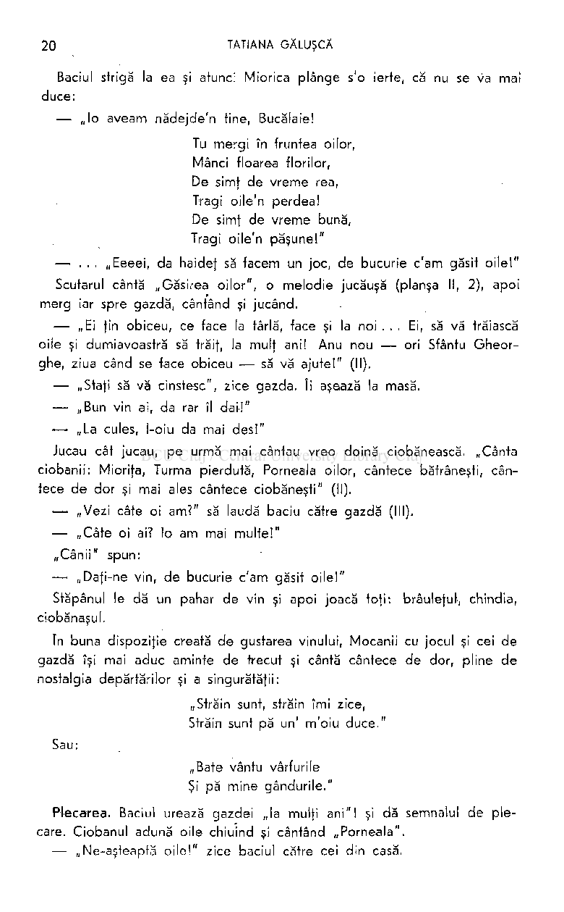

Baciul strigă la ea şi atunci Miorica plânge s'o ierte, că nu se va mai duce:

— „Io aveam nădejde'n tine, Bucălaie!

Tu mergi în fruntea oilor, Mânci floarea florilor, De simţ de vreme rea, Tragi oile'n perdea! De simţ de vreme bună, Tragi oile'n păşune!"

— .. . „Eeeei, da haideţ să facem un joc, de bucurie c'am găsit oile!" Scutarul cântă „Găsirea oilor", o melodie jucăuşă (planşa II, 2), apoi

merg iar spre gazdă, cântând şi jucând.

— „Ei ţin obiceu, ce face la târlă, face şi la noi .. . Ei, să vă trăiască oile şi dumiavoastră să trăit, la mulţ ani! Anu nou — ori Sfântu Gheorghe, ziua când se face obiceu — să vă ajute!" (II).

— „Staţi să vă cinstesc", zice gazda. Ii aşează la masă.

— „Bun vin ai, da rar îl dai!"

— „La cules, l-oiu da mai des!" Jucau cât jucau, pe urmă mai cântau vreo doină ciobănească. „Cânta

ciobanii: Mioriţa, Turma pierdută, Porneala oilor, cântece bătrâneşti, cântece de dor şi mai ales cântece ciobăneşti" (II).

— „Vezi câte oi am?" să laudă baciu către gazdă (III).

— „Câte oi ai? Io am mai multe!" „Cânii" spun:

— „Daţi-ne vin, de bucurie c'am găsit oile!" Stăpânul le dă un pahar de vin şi apoi joacă toţi: brâuleţul, chindia,

ciobănaşul.

în buna dispoziţie creată de gustarea vinului, Mocanii cu jocul şi cei de gazdă îşi mai aduc aminte de trecut şi cântă cântece de dor, pline de nostalgia depărtărilor şi a singurătăţii:

„Străin sunt, străin îmi zice, Străin sunt pă un' m'oiu duce."

Sau:

„Bate vântu vârfurile Şi pă mine gândurile."

Plecarea. Baciul urează gazdei „la mulţi ani"! şi dă semnalul de plecare. Ciobanul adună oile chiuind şi cântând „Porneala".

— „Ne-aşteaptă oile!" zice baciul către cei din casă.

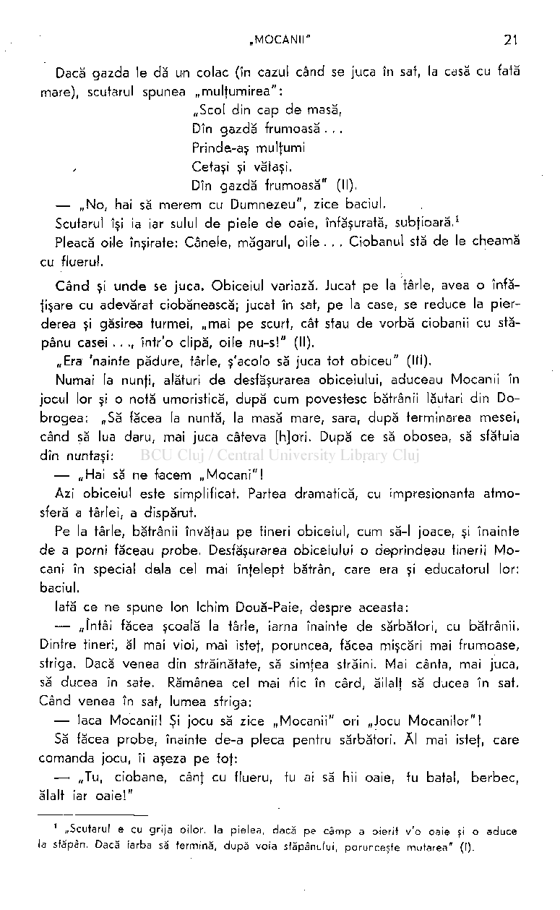

Dacă gazda le dă un colac (în cazul când se juca în sat, la casă cu fată

mare), scutarul spunea „mulţumirea": „Scol din cap de masă, Dîn gazdă frumoasă . . . Prinde-aş mulţumi Cetaşi şi văfaşi. Dîn gazdă frumoasă" (II).

— „No, hai să merem cu Dumnezeu", zice baciul. Scutarul îşi ia iar sulul de piele de oaie, înfăşurată, subţioară.

1

Pleacă oile înşirate: Cânele, măgarul, oile . . . Ciobanul stă de le cheamă cu fluerul.

Când şi unde se juca. Obiceiul variază. Jucat pe la târle, avea o înfăţişare cu adevărat ciobănească; jucat în sat, pe la case, se reduce la pierderea şi găsirea turmei, „mai pe scurt, cât stau de vorbă ciobanii cu stăpânu casei . . ., într'o clipă, oile nu-s!" (II).

„Era 'nainte pădure, târle, ş'acolo să juca tot obiceu" (III). Numai la nunţi, alături de desfăşurarea obiceiului, aduceau Mocanii în jocul lor şi o notă umoristică, după cum povestesc bătrânii lăutari din Dobrogea: „Să făcea la nuntă, la masă mare, sara, după terminarea mesei, când să lua daru, mai juca câteva [h]ori. După ce să obosea, să sfătuia dîn nuntaşi:

— „Hai să ne facem „Mocani"! Azi obiceiul este simplificat. Partea dramatică, cu impresionanta atmo­

sferă a târlei, a dispărut.

Pe la târle, bătrânii învăţau pe tineri obiceiul, cum să-l joace, şi înainte de a porni făceau probe, Desfăşurarea obiceiului o deprindeau tinerii Mocani în special delà cel mai înţelept bătrân, care era şi educatorul lor: baciul.

lată ce ne spune Ion Ichim Două-Paie, despre aceasta: <— „întâi făcea şcoală la târle, iarna înainte de sărbători, cu bătrânii. Dintre tineri, ăl mai vioi, mai isteţ, poruncea, făcea mişcări mai frumoase, striga. Dacă venea din străinătate, să simţea străini. Mai cânta, mai juca,

- să ducea în sate. Rămânea cel mai nie în cârd, ăilalţ să ducea în sat. Când venea în sat, lumea striga:

— Iaca Mocanii! Şi jocu să zice „Mocanii" ori „Jocu Mocanilor"! Să făcea probe, înainte de-a pleca pentru sărbători. Ăl mai isteţ, care

comanda jocu, îi aşeza pe toţ:

— „Tu, ciobane, cânt cu flueru, tu ai să hii oaie, fu batal, berbec, ălaIt iar oaie!"

„Scutarul e cu grija oilor, la pielea, dacă pe câm p a pierit v'o oaie şi o aduce la stăpân. Dacă iarba să termină, după voia stăpânului, porunceşte mutarea" (I).

1

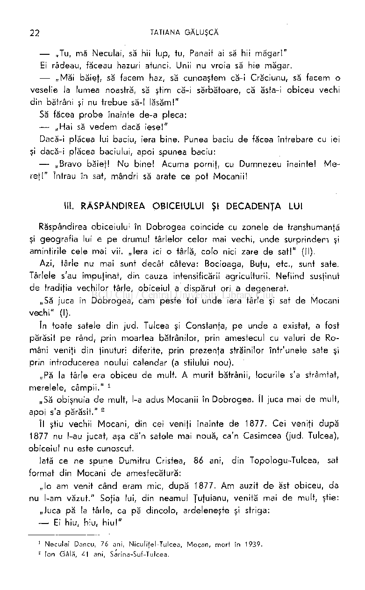

— „Tu, mă Neculai, să hii lup, tu, Panait ai să hii măgar!" Ei râdeau, făceau hazuri atunci. Unii nu vroia să hie măgar.

— „Măi băief, să facem haz, să cunoaştem că-i Crăciunu, să facem o veselie la lumea noastră, să ştim că-i sărbătoare, că ăsta-i obiceu vechi din bătrâni şi nu trebue să-l lăsăm!"

Să făcea probe înainte de-a pleca:

— „Hai să vedem dacă iesel" Dacă-i plăcea lui baciu, iera bine. Punea baciu de făcea întrebare cu iei

şi dacă-i plăcea baciului, apoi spunea baciu:

— „Bravo băief! No bine! Acuma pornit, cu Dumnezeu înainte! Mereţ!" Intrau în sat, mândri să arate ce pot Mocanii!

III. RĂSPÂNDIREA OBICEIULUI Şl DECADENŢA LUI

Răspândirea obiceiului în Dobrogea coincide cu zonele de transhumantă şi geografia lui e pe drumul târlelor celor mai vechi, unde surprindem şi amintirile cele mai vii. „Iera ici o târlă, colo nici zare de sat!" (II).

Azi, târle nu mai sunt decât câteva: Bocioaga, Bufu, etc., sunt sate. Târlele s'au împufinat, din cauza intensificării agriculturii. Nefiind susfinut de tradifia vechilor târle, obiceiul a dispărut ori a degenerat.

„Să juca în Dobrogea, cam peste tot unde iera târle şi sat de Mocani vechi" (I).

In toate satele din jud. Tulcea şi Constanfa, pe unde a existat, a fost părăsit pe rând, prin moartea bătrânilor, prin amestecul cu valuri de Români venifi din finuturi diferite, prin prezenfa străinilor într'unele sate şi prin introducerea noului calendar (a stilului nou).

„Pă la târle era obiceu de mult. A murit bătrânii, locurile s'a strâmtat, merelele, câmpii."

1

„Să obişnuia de mult, l-a adus Mocanii în Dobrogea. îl juca mai de mult, apoi s'a părăsit."

2

îl ştiu vechii Mocani, din cei veniji înainte de 1877. Cei venifi după 1877 nu l-au jucat, aşa că'n satele mai nouă, ca'n Casimcea (jud. Tulcea), obiceiul nu este cunoscut.

lată ce ne spune Dumitru Cristea, 86 ani, din Topologu-Tulcea, sat format din Mocani de amestecătură:

„Io am venit când eram mic, după 1877. Am auzit de ăst obiceu, da nu l-am văzut." Sofia lui, din neamul Ţufuianu, venită mai de mult, ştie:

„Juca pă la târle, ca pă dincolo, ardeleneşte şi striga:

— Ei hiu, hiu, hiu!"

Neculai Dancu, 76 ani, Niculiţel-Tulcea, Mocan, mort în 1939.

1

— Ion Gală, 41 ani, Sarina-Suf-Tulcea.

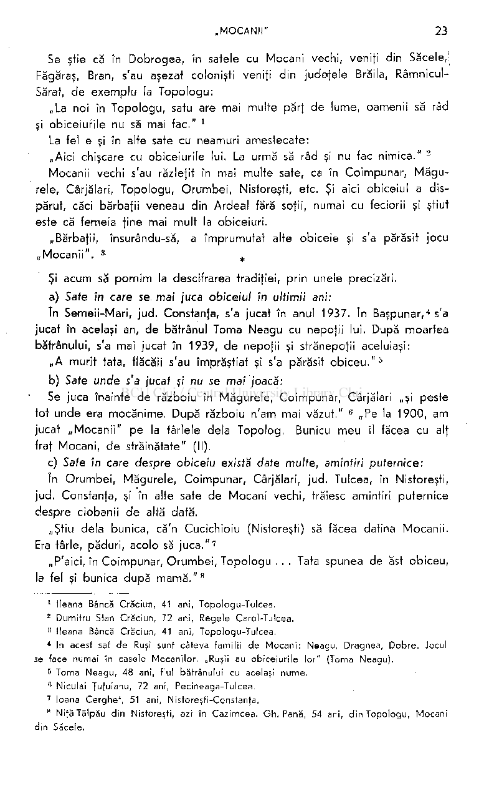

Se ştie că în Dobrogea, în satele cu Mocani vechi, veniţi din Săcele,' Făgăraş, Bran, s'au aşezat colonişti veniţi din judeţele Brăila, RâmniculSărat, de exemplu la Topologu:

„La noi în Topologu, satu are mai multe părţ de lume, oamenii să râd şi obiceiurile nu să mai fac."

1

La fel e şi în alte sate cu neamuri amestecate: „Aici chişcare cu obiceiurile lui. La urmă să râd şi nu fac nimica."

2

Mocanii vechi s'au răzleţit în mai multe sate, ca în Coimpunar, Măgurele, Cârjălari, Topologu, Orumbei, Nistoreşti, etc. Şi aici obiceiul a dispărut, căci bărbaţii veneau din Ardeal fără soţii, numai cu feciorii şi ştiut este că femeia ţine mai mult la obiceiuri.

„Bărbaţii, însurându-să, a împrumutat alte obiceie şi s'a părăsit jocu

„Mocanii". „, Şi acum să pornim la descifrarea tradiţiei, prin unele precizări. a) Safe în care se. mai juca obiceiul in ultimii ani: In Semeii-Mari, jud. Constanţa, s'a jucat în anul 1937. In Başpunar,

s'a jucat în acelaşi an, de bătrânul Torna Neagu cu nepoţii lui. După moartea bătrânului, s'a mai jucat în 1939, de nepoţii şi strănepoţii aceluiaşi:

4

„A murit tata, flăcăii s'au împrăştiat şi s'a părăsit obiceu."

5

- b) Safe unde s'a jucat şi nu se mai joacă: Se juca înainte de războiu în Măgurele, Coimpunar, Cârjălari „şi peste tot unde era mocănime. După războiu n'am mai văzut." „Pe la 1900, am jucat „Mocanii" pe la târlele delà Topolog. Bunicu meu îl făcea cu alţ fraf Mocani, de străinătate" (II).
- c) Sate in care despre obiceiu există date multe, amintiri puternice: în Orumbei, Măgurele, Coimpunar, Cârjălari, jud. Tulcea, în Nistoreşti,

jud. Constanţa, şi în alte sate de Mocani vechi, trăiesc amintiri puternice despre ciobanii de altă dată.

„Ştiu delà bunica, că'n Cucichioiu (Nistoreşti) să făcea datina Mocanii. Era târle, păduri, acolo să juca."

7

„P'aici, în Coimpunar, Orumbei, Topologu .. . Tata spunea de ăst obiceu, la fel şi bunica după mamă."

8

- 1 Ileana Bancă Crăciun, 41 ani, Topologu-Tulcea.
- 2 Dumitru Stan Crăciun, 72 ani, Regele Carol-Tulcea.
- 3 Ileana Bancă Crăciun, 41 ani, Topologu-Tulcea,

* In acest sat de Ruşi sunt câteva familii de Mocani : Naagu, Dragnea, Dobre. Jocul se face numai în casele Mocanilor. „Ruşii au obiceiurile lor" (Torna Neagu).

- 5 Torna Neagu, 48 ani, fiul bătrânului cu acelaşi nume .
- 6 Niculai Ţuţuianu, 72 ani, Pecineaga-Tulcea.

Ioana Cerghet, 51 ani, Nistoreşfi-Constanţa.

Niţă Tălpău din Nistoreşti, azi în Cazimcea. Gh. Pană, 54 ani, di n Topologu, Mocani din Săcele.

8

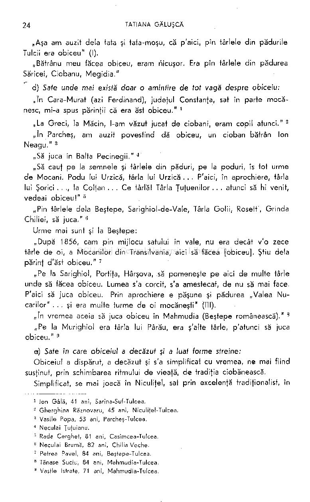

- „Aşa am auzit delà tata şi tata-moşu, că p'aici, pîn târlele din pădurile Ţuicii era obiceu" (I).
- „Bătrânu meu făcea obiceu, eram nicuşor. Era pîn târlele din pădurea

Săricei, Ciobanu, Megidia." d) Safe unde mai există doar o amintire de tot vagă despre obiceiu: „în Cara-Murat (azi Ferdinand), judeţul Constanţa, sat în parte mocă­

nesc, mi-a spus părinţii că era ăst obiceu."

1

„La Greci, la Macin, l-am văzut jucat de ciobani, eram copil atunci."

2

„în Parcheş, am auzit povestind dă obiceu, un cioban bătrân Ion Neagu."

3

„Să juca în Balta Pecinegii."

4

„Să caut pe la semnele şi târlele din păduri, pe la poduri, îs tot urme de Mocani. Podu lui Urzică, târla lui Urzică . . . P'aici, în aprochiere, târla lui Şorici . . ., la Colfan .. . Ce târlă! Târla Ţuţuenilor . . . atunci să hi venit, vedeai obiceu!"

5

„Pin târlele delà Beştepe, Sarighiol-de-Vale, Târla Golii, Rosetti, Grinda Chiliei, să juca."

fi

Urme mai sunt şi la Beştepe: „După 1856, cam pin mijlocu satului în vale, nu era decât v'o zece

târle de oi, a Mocanilor din Transilvania, aici să făcea [obiceu]. Ştiu delà părinţ d'ăst obiceu."

7

„Pe la Sarighiol, Portiţa, Hârşova, să pomeneşte pe aici de multe târle unde să făcea obiceu. Lumea s'a corcit, s'a amestecat, de nu să mai face. P'aici să juca obiceu. Prin aprochiere e păşune şi pădurea „Valea Nucarilor" .. . şi era multe turme de oi mocăneşti" (III).

în vremea aceia să juca obiceu în Mahmudia (Beştepe românească)."

8

„Pe la Murighiol era târla lui Pârău, era ş'alte târle, p'atunci să juca obiceu."

9

a) Sate în care obiceiul a decăzut şi a luat forme streine: Obiceiul a dispărut, a decăzut şi s'a simplificat cu vremea, ne mai fiind

susţinut, prin schimbarea ritmului de vieaţă, de tradiţia ciobănească. Simplificat, se mai joacă în Niculiţel, sat prin excelenţă tradiţionalist, în

- 1 Ion Gală, 41 ani, Sarina-Suf-Tulcea.
- 2 Gherghina Răznovaru, 45 ani, Niculifel-Tulcea.
- 3 Vasile Popa, 53 ani, Parcheş-Tulcea.
- 4 Neculai Ţujuianu.

•' Rada Cerghef, 81 ani, Casimcea-Tulcea.

Neculai Brumă, 82 ani, Chilia Veche.

8

- 7 Petrea Pavel, 84 ani, Beşfepe-Tulcea.
- 8 Tănase Suciu, 84 ani, Mahmudia-Tulcea.
- 9 Vasile Istrate, 71 ani, Mahmudia-Tulcea.

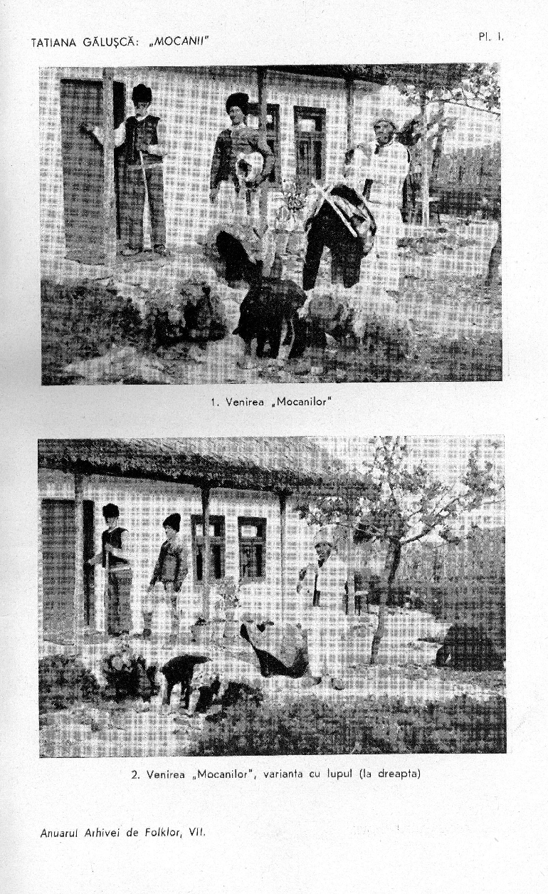

Pl. I.

TATIANA GĂLUŞCĂ „MOCANII"

1. Venirea „Mocanilor "

2. Venirea „Mocanilor" , varianta cu lupul (la dreapta)

Anuarul Arhivei de Fo/k/or, VII.

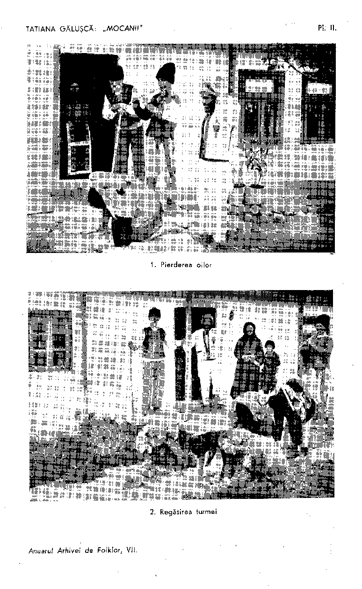

TATIANA GĂLUŞCĂ „MOCANII" Pl. il.

2. Regăsirea turmei

Anuarul Arhivei de Fo/klor, Vl'l.

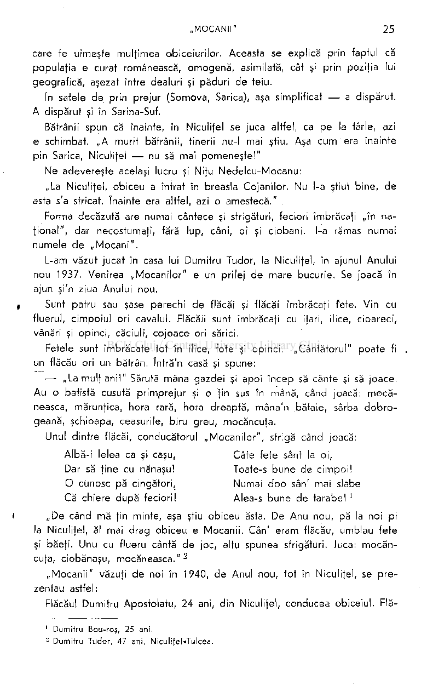

care te uimeşte mulfimea obiceiurilor. Aceasta se explică prin faptul că populafia e curat românească, omogenă, asimilată, cât şi prin pozi|ia lui geografică, aşezat între dealuri şi păduri de teiu.

în satele de prin prejur (Somova, Sarica), aşa simplificat — a dispărut. A dispărut şi în Sarina-Suf.

Bătrânii spun că înainte, în Niculiţel se juca altfel, ca pe la târle, azi e schimbat. „A murit bătrânii, tinerii nu-l mai ştiu. Aşa cum era înainte pin Sarica, Niculiţel — nu să mai pomeneşte!"

Ne adevereşte acelaşi lucru şi Niţu Nedelcu-Mocanu: „La Niculiţel, obiceu a Intrat în breasla Cojanilor. Nu l-a ştiut bine, de

asta s'a stricat. înainte era altfel, azi o amestecă."

Forma decăzută are numai cântece şi strigături, feciori îmbrăcaţi „în naţional", dar necostumaţi, fără lup, câni, oi şi ciobani, l-a rămas numai numele de „Mocani".

L-am văzut jucat în casa lui Dumitru Tudor, la Niculiţel, în ajunul Anului nou 1937. Venirea „Mocanilor" e un prilej de mare bucurie. Se joacă în ajun şi'n ziua Anului nou.

Sunt patru sau şase perechi de flăcăi şi flăcăi îmbrăcaţi fete. Vin cu fluerul, cimpoiul ori cavalul. Flăcăii sunt îmbrăcaţi cu iţari, ilice, cioareci, vânări şi opinci, căciuli, cojoace ori sarici.

Fetele sunt îmbrăcate tot m ilice, fote şi opinci. „Cântătorul" poate fi un flăcău ori un bătrân. întră'n casă şi spune:

— „Lamulţanii" Sărută mâna gazdei şi apoi încep să cânte şi să joace. Au o batistă cusută primprejur şi o ţin sus în mână, când joacă: mocăneasca, mărunţica, hora rară, hora dreaptă, mâna'n bătaie, sârba dobrogeană, şchioapa, ceasurile, biru greu, mocăncuţa.

Unul dintre flăcăi, conducătorul „Mocanilor", strigă când joacă: Albă-i lelea ca şi caşu, Câte fete sânt la oi, Dar să ţine cu nănaşu! Toate-s bune de cimpoi! O cunosc pă cingători, Numai doo sân' mai slabe Că chiere după feciori! Alea-s bune de tarabe!

1

„De când mă ţin minte, aşa ştiu obiceu ăsta. De Anu nou, pă la noi pi la Niculiţel, ăl mai drag obiceu e Mocanii. Cân' eram flăcău, umblau fete şi băeţi. Unu cu flueru cântă de joc, altu spunea strigături. Juca: mocăncuţa, ciobănaşu, mocăneasca."

2

„Mocanii" văzuţi de noi în 1940, de Anul nou, tot în Niculiţel, se prezentau astfel:

Flăcăul Dumitru Apostolatu, 24 ani, din Niculiţel, conducea obiceiul. Flă-

- 1 Dumitru Bou-roş, 25 ani.
- 2 Dumitru Tudor, 47 ani, Niculifel-iTulcea.

