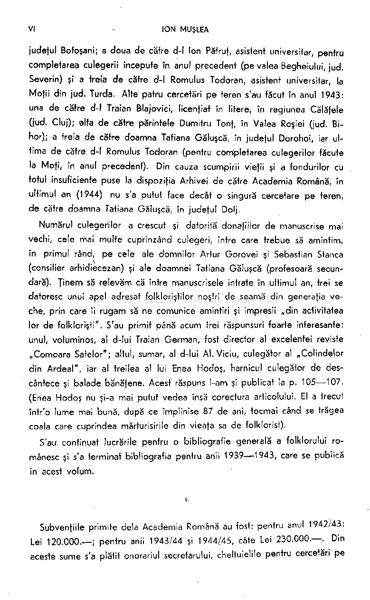
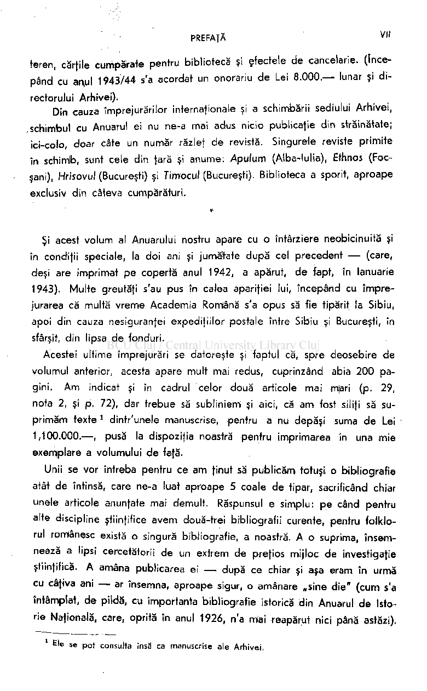
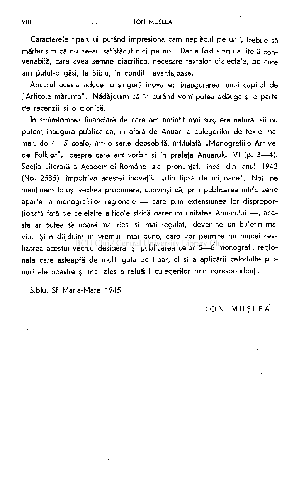

judeful Botoşani; a doua de către d-l Ion Pătruf, asistent universitar, pentru completarea culegerii începute în anul precedent (pe valea Begheiului, jud. Severin) şi a treia de către d-l Romulus Todoran, asistent universitar, la Mojii din jud. Turda. Alte patru cercetări pe teren s'au făcut în anul 1943: una de către d-l Traian Blajovici, licenfiat în litere, în regiunea Caiafele (jud. Cluj); alfa de către părintele Dumitru Tonf, în Valea Roşiei (jud. Bihor); a treia de către doamna Tatiana Găluşcă, în judeful Dorohoi, iar ultima de către d-l Romulus Todoran (pentru completarea culegerilor făcute la Mofi, în anul precedent). Din cauza scumpirii viefii şi a fondurilor cu totul insuficiente puse la dispoziţia Arhivei de către Academia Română, în ultimul an (1944) nu s'a putut face decât o singură cercetare pe teren, de către doamna Tatiana Găluşcă, în judeful Dolj.

Numărul culegerilor a crescut şi datorită donaţiilor de manuscrise mai vechi, cele mai multe cuprinzând culegeri, între care trebue să amintim,, în primul rând, pe cele ale domnilor Artur Gorovei şi Sebastian Stanca (consilier arhidiecezan) şi ale doamnei Tatiana Găluşcă (profesoară secundară). Ţinem să relevăm că între manuscrisele intrate în ultimul an, trei se datoresc unui apel adresat folkloriştilor noştri de seamă din generaţia veche, prin care îi rugam să ne comunice amintiri şi impresii „din activitatea lor de folklorişti". S'au primit până acum trei răspunsuri foarte interesante: unul, voluminos, al d-lui Traian German, fost director al excelentei reviste „Comoara Satelor"; altul, sumar, al d-lui Al. Viciu, culegător al „Colindelor din Ardeal", iar al treilea al lui Enea Hodoş, harnicul culegător de descântece şi balade bănăfene. Acesf răspuns l-am şi publicat la p. 105—107. (Enea Hodoş nu şi-a mai putut vedea însă corectura articolului. El a trecut într'o lume mai bună, după ce împlinise 87 de ani, tocmai când se trăgea coala care cuprindea mărturisirile din vieafa sa de folklorist).

S'au continuat lucrările pentru o bibliografie generală a folklorului românesc şi s'a terminat bibliografia pentru anii 1939—1943, care se publică în acest volum.

# *

Subvenfiile primite delà Academia Română au fost: pentru anul 1942/43: Lei 120.000.—; pentru anii 1943/44 şi 1944/45, câte Lei 230.000.—. Din aceste sume s'a plătit onorariul secretarului, cheltuielile pentru cercetări pe

teren, cărţile cumpărate pentru bibliotecă şi efectele de cancelarie. (începând cu ar\ul 1943/44 s'a acordat un onorariu de Lei 8.000.— lunar şi directorului Arhivei).

Din cauza împrejurărilor internaţionale şi a schimbării sediului Arhivei, schimbul cu Anuarul ei nu ne-a mai adus nicio publicaţie din străinătate; ici-colo, doar câte un număr răzleţ de revistă. Singurele reviste primite în schimb, sunt cele din ţară şi anume: Apulum (Alba-lulia), Ethnos (Focşani), Hrisovul (Bucureşti) şi Timocul (Bucureşti). Biblioteca a sporit, aproape exclusiv din câteva cumpărături.

Şi acest volum al Anuarului nostru apare cu o întârziere neobicinuită şi în condiţii speciale, la doi ani şi jumătate după cel precedent — (care, deşi are imprimat pe copertă anul 1942, a apărut, de fapt, în Ianuarie 1943). Multe greutăţi s'au pus în calea apariţiei lui, începând cu împrejurarea că multă vreme Academia Română s'a opus să fie tipărit la Sibiu, apoi din cauza nesiguranţei expediţiilor postale între Sibiu şi Bucureşti, în sfârşit, din lipsa de fonduri.

Acestei ultime împrejurări se datoreşte şi faptul că, spre deosebire de volumul anterior, acesta apare mult mai redus, cuprinzând abia 200 pagini. Am indicat şi în cadrul celor două articole mai m)ari (p. 29, nota 2, şi p. 72), dar trebue să subliniem şi aici, că am fost siliţi să suprimăm texte

dintr'unele manuscrise, pentru a nu depăşi suma de Lei 1,100.000.—, pusă la dispoziţia noastră pentru imprimarea în una mie exemplare a volumului de faţă.

1

Unii se vor întreba pentru ce am ţinut să publicăm totuşi o bibliografie atât de întinsă, care ne-a luat aproape 5 coaie de tipar, sacrificând chiar unele articole anunţate mai demult. Răspunsul e simplu: pe când pentru alte discipline ştiinţifice avem două-trei bibliografii curente, pentru folklorul românesc există o singură bibliografie, a noastră. A o suprima, însemnează a lipsi cercetătorii de un extrem de preţios mijloc de investigaţie ştiinţifică. A amâna publicarea ei — după ce chiar şi aşa eram în urmă cu câţiva ani — ar însemna, aproape sigur, o amânare „sine die" (cum s'a întâmplat, de pildă, cu importanta bibliografie istorică din Anuarul de Istorie Naţională, care, oprită în anul 1926, n'a mai reapărut nici până astăzi).

Ele se pot consulta însă ca manuscrise ale Arhivei.

VIII . . IO N MUŞLEA

Caracterele tiparului putând impresiona cam neplăcut pe unii, trebue să mărturisim că nu ne-au satisfăcut nici pe noi. Dar a fost singura literă convenabilă, care avea semne diacritice, necesare textelor dialectale, pe care am putut-o găsi, la Sibiu, în condiţii avantajoase.

Anuarul acesta aduce o singură inovafie: inaugurarea unui capitol de „Articole mărunte". Mădăjduim că în curând vorrt putea adăuga şi o parte de recenzii şi o cronică.

în strâmtorarea financiară de care am amintit mai sus, era natural să nu putem inaugura publicarea, în afară de Anuar, a culegerilor de texte mai mari de 4—5 coaie, într'o serie deosebită, întitulată „Monografiile Arhivei de Folklor",' despre care ami vorbit şi în prefafa Anuarului VI (p. 3—4). Secfia Literară a Academiei Române s'a pronunfat, încă din anul 1942 (No. 2535) împotriva acestei inovafii, „din lipsă de mijloace". Noi ne menţinem totuşi vechea propunere, convinşi că, prin publicarea într'o serie aparte a monografiilor regionale — care prin extensiunea lor disproporţionată fată de celelalte articole strică oarecum unitatea Anuarului — , acesta ar putea să apară mai des şi miai regulat, devenind un buletin mai viu. Şi nădăjduim în vremuri mai bune, care vor permite nu numai realizarea acestui vechiu desiderat şi publicarea celor 5—6 monografii regionale care aşteaptă de mult, gata de tipar, ci şi a aplicării celorlalte planuri ale noastre şi mai ales a reluării culegerilor prin corespondenţi.

Sibiu, Sf. Maria-Mare 1945.

IO N MUŞLE A

## M. GASTER Şl FOLKLORUL ROMÂNESC

La 11 Martie 1939 s'a stins, la Londra, în vârstă de 83 ani, marele învăţat care a contribuit într'o măsură covârşitoare la lămurirea atâtor probleme ale folklorului nostru. Se cuvine deci să-i închinăm câteva pagini, scrise pe baza unor note biografice trimise nouă de el însuşi, acum mulţi ani. Vom da apot-scrisorile primite delà el între anii 1893-1937.

Gaster s'a născut în Bucureşti, în 1856; a terminat liceul la „Matei Basarab"; în 1873 şi-a trecut bacalaureatul şi apoi a plecat în străinătate şi a studiat, între altele, limba românească.

Ca student la Universitatea din Breslau, a început să lucreze un dicţionar germano-român, ajutându-se de dicţionarul francez al lui Pontbriant. - -

Şi-a trecut doctoratul cu teza despre „litera C guturală" în limba română, pentru care a încercat, pentru prima oară, să se folosească de vechile documente româneşti, urmărind schimbările suferite de această literă în cuvintele întroduse din limba latină şi din celelalte limbi. Această teză de doctorat a fost întâia lucrare de acest fel şi este publicată în „Zeitschrift für romanische Philologie" a lui Groeber. în aceeaşi revistă a publicat şi o traducere, în limba germană, a „Povestii poamelor" de Anton Pann, precum şi „TVepetnicul".

întors în ţară, în 1882, a început să lucreze la „Literatura populară română",

pe care a tipărit-o în 1883, cum şi la „Chrestomatie". Pe atunci, astfel de studii nu erau luate în serios de intelectualii noştri şi când Gaster a prezentat această lucrare migăloasă Academiei, pentru un premiu, cărţile lui au fost ridiculizate, deşi mai târziu, s'a recunoscut că sunt cercetări de mare valoare.

1

Pe când era încă student, a publicat, în „Columna lui Traian" a lui Haşdeu, câteva articole în legătură cu unele basme ale lui Ispirescu, pe care el îl îndemnase să-şi publice colecţia în volum.i

în cele nouă volume ale „Anuarului pentru Israelit", editat de Schwarzfeld, a dat o serie de articole de literatură comparată, în legătură cu lite-

Vezi bibliografia lucrărilor folklorice ale lui Gaster la paginile 4-6.

1

rafura populară românească. A publicat două conferinfe ţinute la Ateneul Român, una despre „Originea alfabetului", alta „Apocrifele în literatura românească".

în „Revista pentru Istorie, Arheologie şi Filologie" a lui Tocilescu, a scris o seamă de articole, ca „Stratificarea elementului latin în limba română", apoi „Vieafa sfântului Macarie", din manuscrise vechi şi din altele mai nouă, tot cu arătarea paralelelor din alte literaturi, ca în „Povestea lui Adam"; apoi o colecte de „Cântece de stea", cu toate paralelele din literatura românească. în acest studiu a arătat legătura strânsă între cântecele de stea din manuscrisele vechi şi colecfia lui Anton Pann, atrăgând atenfia asupra modului cum lucra acesta, adeseori nefăcând altceva decât să publice texte mai vechi, modernizate de dânsul.

Tot în revista lui Tocilescu a dat un text vechiu al „Alexandriei", deosebit foarte mult de celelalte texte cunoscute.

în „Literatorul" a publicat, pentru prima oară, extrase din călătoriile lui Golescu, până atunci aproape necunoscute; apoi legende din manuscrise vechi, cum este aceea a Arhanghelului Mihail, care a slujit patruzeci de ani pe egumen, şi o altă legendă, a Sfântului Nicolae, totdeauna însofite de paralele din literatura universală.

împreună cu Bettelmann a scos revista germană „Rumaenische Revue", în care, între altele, a tipărit o traducere nemţească a unei poveşti de Delavrancea,

A mai scris o prefafă la volumul de basme al lui Stăncescu. în revista „Contimporanul" din laşi, a publicat cel mai vechiu basm ro­

mânesc: „Pavel cel nebun", dintr'un manuscris din secolul XVIII.

Pentru motive asupra cărora nu putem insista aici, Gaster a fost silit să plece din ţară. El nu a făcut însă ca alţi savanţi, care după ce au lucrat cu spor în filologia românească, s'au supărat pe Români, au părăsit ţara şi întâlnindu-se cu unul din cei pe care-i cunoşteau, în Bucureşti, când acesta 1-a salutat şi l-a întrebat ceva româneşte, i-a întors spatele spunându-i în franfuzeşte: „Je ne connais pas la langue que vous parlez."

între alte multe lucrări, scrise în diferite limbi, a făcut complete dări de seamă asupra mişcării literare din România, mai ales cu privire la folklor, în „Vollrhöllers Kritischer Jahresbericht". în „Byzantinische Zeitschrift" a publicat, în traducere nemţească „Luarea Troiadei" din manuscrisul „Hronograf", în posesia sa. în „Archiva" lui Ascoli, a dat textul românesc cu traducere italiană şi notele paralele ale „Physiologului" şi tot acolo „Evanghelia lui Mateiu" (1892), cu întroducere, după faimosul manuscris delà British Museum.

în acest timp şi-a terminat „Chrestomatia", în două volume, la care a lucrat zece ani, începând din 1881. A publicat în „Proceedings" ale So-

cietăţii de arheologie biblică: „Apocalipsul lui Avram", în româneşte şi englezeşte.

în 1892 avea gata lucrarea „Evangheliarul", din manuscrisul delà British Museum, împreună cu „Praxiul" dintr'un manuscris al său, foarte preţios din punct de vedere al textelor româneşti ale Evangheliei. Cu ocazia unei vizite făcute la Londra, unde locuia Gaster, Take lonescu i-a cerut manu>scrisul lucrării,- ca să-l publice Ministerul Cultelor la Imprimeria Statului. Take lonescu şi-a ţinut făgăduinţa: cartea lui Gaster s'a tipărit, dar. . . întreaga ediţie a dispărut.

Pentru ce? Două exemplare au rămas din această lucrare: unul este în biblioteca lui Gaster şi al doilea în Biblioteca Academiei Române. Gaster presupunea că al treilea exemplar ar fi ajuns în mâna unei persoane, al cărei nume nu-l ştia.

Nedescurajat de această stranie dispariţie a unei lucrări care îi ceruse

- o muncă de un an şi jumătate, Gaster a publicat în „Jurnalul Societăţii Asiatice", în româneşte şi în englezeşte, „Povestea Savilei", dintr'un manuscris delà Sofia, făcându-i şi o introducere; apoi „Archir şi Anadam", dintr'un manuscris al său; de asemenea „Visul lui Sehaci" şi, în „Journal
- of Folk-lore", un studiu amănunţit asupra „Avestiţei aripa Satanei" şi cântece despre Sfânta Maria.

în 1915, „The Folk-Lore Society" i-a publicat „Rumanian Bird ad Beast Stories" în care a adunat mai tot ce se cunoştea în legende, despre animale şi păsări. Apoi altă colecţie, numai de basme româneşti, frumos ilustrată, sub titlul „Children's stories from Rumanian Legends and Fairy Tales".

Lucrarea cu care se mândrea Gaster a fost „Istoria literaturii române" ,(1899), alcătuită după o muncă de treizeci de ani, în care a încercat o grupare sistematică a întregei literaturi româneşti, folosindu-se de aproape 400 de manuscrise, neatinse de nimeni până la el. Lucrarea aceasta a făcut-o fiind departe de ţară şi de bibliotecile ei,

Gaster nu uita niciodată să pomenească literatura românească în cercetările sale. Aşa, în marea lui lucrare „Exempla of the Rabbis", ca şi în publicaţia faimoasei cărţi cunoscută sub titlul „Secretum Secretorum" a lui Aristotel, vorbeşte de literatura noastră, atrăgând atenţia în cea din urmă carte, asupra învăţăturilor lui Neagoe Vodă şi a lui Alexandru Machedon, din Chronograf.

La Oxford a făcut o prelegere despre „Descântecele româneşti" şi a pregătit o carte despre aceste descântece, dar a renunţat să mai tipărească această lucrare, în urma studiului făcut de mine şi tipărit de Academia Ro-

^rnână („Descântecele Românilor"), după cum se va vedea dintr'o scrisoare :e mi-a adresat.

Aceasta este activitatea folklorică românească a lui M. Gaster. Deşi expulzat, a obţinut autorizaţia de a veni în ţară, unde a fost primit

cu onoruri, dar eu nu am putut să-l văd.

Ca o recompensă pentru excelentele lui lucrări privitoare la folklorul nostru, Academia Română l-a ales membru onorar în şedinţa delà 30 Mai 1929.

### *

Cu Gaster am dus corespondenţă timp de 44 de ani, delà 16 Noemvrie 1893 până la 30 Noemvrie 1937.

în cele 12 scrisori ce am păstrat delà el sunt lucruri interesante şi găsesc necesar să le dau în întregime.

în volumul II din „Şezătoarea" (1893, pag. 117), am publicat o snoavă veche românească, — snoava „cea mai veche de care am dat până acum în literatura veche" — după cum spune Gaster; cu această ocazie am primit delà el întâia scrisoare (I). Ea e scrisă în întregime şi iscălită de el însuşi.

Au trecut 18 ani, în care timp am mai primit scrisori delà Gaster, care, însă, mi s'au pierdut cu ocazia unei mutări din casa în care locuiam; la 26 Decemvrie 1911, primesc o scrisoare (II), care m'a pus pe gânduri:

NOTA EDITORULUI. O bibliografie a lui Gaster lipsind încă in româneşte, credem că facem un serviciu cercetărilor noastre folklorice indicând, după lista lui BRUNO SCHINDLER, apărută în Gaster Anniversars Volume, publicat de acelaşi (Londra 1936, p. 21—36) , lucrările folklorice ale lui Gaster, în ordine cronologică.

1

1. Apropos de articolul d-lui P. Ispirescu: „Basme româneşti şi basme franceze". Co lumna lui Traian 1877, p. 447—449 . ~ 2. Istorii şi poveşti talmudice. Anuarul pentru Israelit III (1879), p. 25—29 . ~ , 3. Beiträge zur vergleichenden Sagen- und Märchenkunde. Monatsschrift für Geschichte und Wissenschaft des Judentums, Dresden, XXIX (1880), p. 35—44 , 78—84 , 115—131 , 215—225 , 316—322,422—427,472—480 , 549^-565 ; XXX (1881), p. 78—82 , 130—138, 368—374 , 413—423 . ~ 4. Zigeunerische Märchen aus Rumänien. Ausland, München 1880, p. 257—259 ; 1881, p. 745—749. ~ 5. Lilith şi cei trei îngeri. Anuarul pentru Israeliţi IV (1881), p. 73—

91. ~ 6. Basme şi istorii talmudice. Ibid., IV (1882), p. 21—29 . ~ 7. Legende talmudice şi legende române. Ibid., V (1883), p. 27—37 . ~ 8. Ein Zigeunermärchen aus Rumänien. Bukarester Salon I (1883), p. 281—287 . ~ 9. Die Jungfrau von Cozia. Ibid., I (1883), p. 237—241 . ~ 10. Der Krug geht so lange zum Brunnen, bis er bricht. Ibid., I (1883), p. 511—518 , 554—561 . ~ 11 . Zug der Alexander nach de m Paradiese. Ibid., I (1883), p. 108—112, 150—158. ~ 12. Literatura Populară Română. Bucureşti 1883, 605 p. ~ 13. Scholomonar, d.i . der Garanbancijas dijak nach der Volksüberlieferung der Rumänen. Archiv für Slavische Philologie VII (1883), p. 281—290 . ~ 14. Colinde, cântece populare şi cântece de stea inedite. Rev. pentru Ist. Arh. şi Fil. II (1883), p. 313—336 ; III (1884), p. 99—110 . ~ 15. Ţiganii ce şi-au mâncat biserica. Ibid., I (1883), p. 469—475 . ~

r

- 16. Cârâiţii. Studiu istorico-literar. Anuarul pentru Israeliţi. VII (1884), p. 1—12. ~
- 17. Had-gadia şi Cocoşelul. Ibid., VII (1884). ~ 18. O poveste talmudică în Iiteratura română. Ibid., VI (1884). ~ 19, Apocrifele în literatura română, AthţeneulTj

