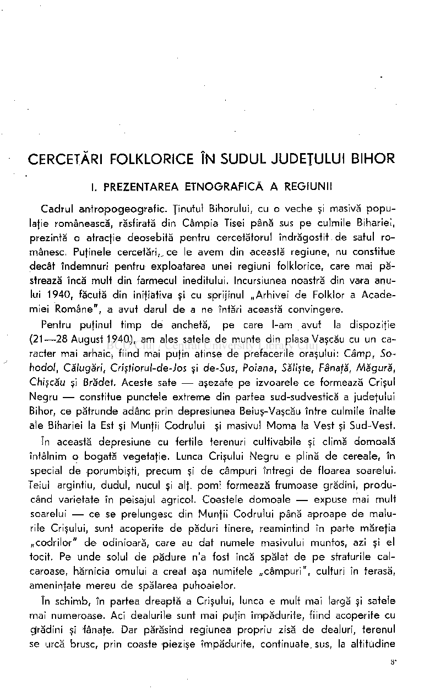

# CERCETĂRI FOLKLORICE ÎN SUDUL JUDEŢULUI BIHOR

I. PREZENTAREA ETNOGRAFICĂ A REGIUNII

Cadrul antropogeografic. Ţinutul Bihorului, cu o veche şi masivă populaţie românească, răsfirată din Câmpia Tisei până sus pe culmile Bihariei, prezintă o atracţie deosebită pentru cercetătorul îndrăgostit. de satul românesc. Puţinele cercetări,, ce le avem din această regiune, nu constitue decât îndemnuri pentru exploatarea unei regiuni folklorice, care mai păstrează încă mult din farmecul ineditului. Incursiunea noastră din vara anului 1940, făcută din iniţiativa şi cu sprijinul „Arhivei de Folklor a Academiei Române", a avut darul de a ne întări această convingere.

Pentru puţinul timp de anchetă, pe care l-am avut la dispoziţie (21—28 August 1940), am ales satele de munte din plasa Vaşcău cu un caracter mai arhaic, fiind mai puţin atinse de prefacerile oraşului: Câmp, Sohodo/, Călugări, Cr/şr/orui-de-Jos şi de-Sus, Poiana, Sălişie, Fanată, Măgură, Ch/şcău şi Brădet. Aceste sate — aşezate pe izvoarele ce formează Crişul Negru — constitue punctele extreme din partea sud-sudvestică a judeţului Bihor, ce pătrunde adânc prin depresiunea Beiuş-Vaşcău între culmile înalte ale Bihariei la Est şi Munţii Codrului şi masivul Moma la Vest şi Sud-Vest.

în această depresiune cu fertile terenuri cultivabile şi climă domoală întâlnim o bogată vegetaţie. Lunca Crişului Negru e plină de cereale, în special de porumbişti, precum şi de câmpuri întregi de floarea soarelui.

Teiul argintiu, dudul, nucul şi a\\. pomi formează frumoase grădini, producând varietate în peisajul agricol. Coastele domoale — expuse mai mult soarelui — ce se prelungesc din Munţii Codrului până aproape de malurile Crişului, sunt acoperite de păduri tinere, reamintind în parte măreţia „codrilor" de odinioară, care au dat numele masivului muntos, azi şi el tocit. Pe unde solul de pădure n'a fost încă spălat de pe straturile calcaroase, hărnicia omului a creat aşa numitele „câmpuri", culturi în terasă, ameninţate mereu de spălarea puhoaielor.

în schimb, în partea dreaptă a Crişului, lunca e mult mai largă şi satele mai numeroase. Aci dealurile sunt mai puţin împădurite, fiind acoperite cu girădini şi fânaţe. Dar părăsind regiunea propriu zisă de dealuri, terenul se urcă brusc, prin coaste piezişe împădurite, continuate, sus, la altitudine

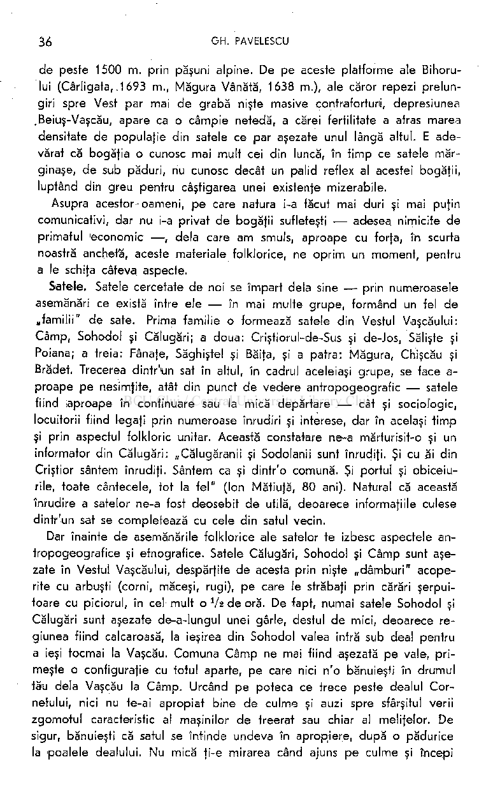

de peste 1500 m. prin păşuni alpine. De pe aceste platforme ale Bihorului (Cârligata, .1693 m., Măgura Vânătă, 1638 m.), ale căror repezi prelungiri spre Vest par mai de grabă nişte masive contraforturi, depresiunea

.Beiuş-Vaşcău, apare ca o câmpie netedă, a cărei fertilitate a atras marea densitate de populaţie din satele ce par aşezate unul lângă altul. E adevărat că bogăţia o cunosc mai mult cei din luncă, în timp ce satele mărginaşe, de sub păduri, nu cunosc decât un palid reflex al acestei bogăţii, luptând din greu pentru câştigarea unei existenţe mizerabile.

Asupra acestor-oameni, pe care natura i-a făcut mai duri şi mai puţin comunicativi, dar nu i-a privat de bogăţii sufleteşti — adesea nimicite de primatul teconomic — , delà care am smuls, aproape cu forţa, în scurta noastră anchetă, aceste materiale folklorice, ne oprim un moment, pentru a le schiţa câteva aspecte.

Satele. Satele cercetate de noi se împart delà sine — prin numeroasele asemănări ce există între ele — în mai multe grupe, formând un fel de „familii" de sate. Prima familie o formează satele din Vestul Vaşcăului: Câmp, Sohodol şi Călugări; a doua: Criştiorul-de-Sus şi de-Jos, Sălişte şi Poiana; a treia: Fânaţe, Săghiştel şi Băiţa, şi a patra: Măgura, Chişcău şi Brădet. Trecerea dinfr'un sat în altul, în cadrul aceleiaşi grupe, se face aproape pe nesimţite, atât din punct de vedere antropogeografic — satele fiind aproape în continuare sau la mică depărtare — cât şi sociologic, locuitorii fiind legaţi prin numeroase înrudiri şi interese, dar în acelaşi timp şi prin aspectul folkloric unitar. Această constatare ne-a mărturisit-o şi un informator din Călugări: „Călugăranii şi Sodolanii sunt înrudiţi. Şi cu ăi din Criştior sântem înrudiţi. Sântem ca şi dintr'o comună. Şi portul şi obiceiurile, toate cântecele, tot la fel" (Ion Mătiuţă, 80 ani). Natural că această înrudire a satelor ne-a fost deosebit de utilă, deoarece informaţiile culese dinfr'un sat se completează cu cele din satul vecin.

Dar înainte de asemănările folklorice ale satelor te izbesc aspectele antropogeografice şi etnografice. Satele Călugări, Sohodol şi Câmp sunt aşezate în Vestul Vaşcăului, despărţite de acesta prin nişte „dâmburi" acoperite cu arbuşti (corni, măceşi, rugi), pe care le străbaţi prin cărări şerpuitoare cu piciorul, în cel mult o V2 de oră. De fapt, numai satele Sohodol şi Călugări sunt aşezate de-a-lungul unei gârle, destul de mici, deoarece regiunea fiind calcaroasă, la ieşirea din Sohodol valea intră sub deal pentru a ieşi tocmai la Vaşcău. Comuna Câmp ne mai fiind aşezată pe vale, primeşte o configuraţie cu totul aparte, pe care nici n'o bănuieşfi în drumul tău delà Vaşcău la Câmp. Urcând pe poteca ce trece peste dealul Cornetului, nici nu te-ai apropiat bine de culme şi auzi spre sfârşitul verii zgomotul caracteristic al maşinilor de treerat sau chiar al meliţelor. De sigur, bănuieşti că satul se întinde undeva în apropiere, după o pădurice la poalele dealului. Nu mică ţi-e mirarea când ajuns pe culme şi începi

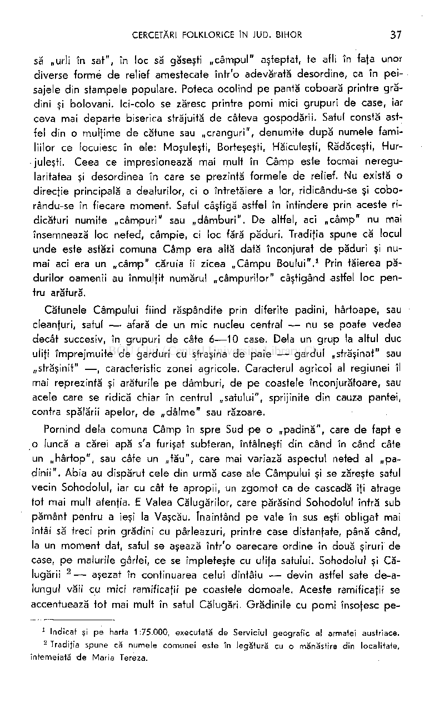

să „urli în sat", în loc să găseşti „câmpul" aşteptat, te afli în faţa unor diverse formé de relief amestecate într'o adevărată desordine, ca în peisajele din stampele populare. Poteca ocolind pe pantă coboară printre grădini şi bolovani. Ici-colo se zăresc printre pomi mici grupuri de case, iar ceva mai departe biserica străjuită de câteva gospodării. Satul constă astfel din o mulţime de cătune sau „crânguri", denumite după numele familiilor ce locuiesc în ele: Moşuleşti, Borteşeşti, Hăiculeşti, Rădăceşti, Hurjuleşti. Ceea ce impresionează mai mult în Câmp este tocmai neregularitatea şi desordinea în care se prezintă formele de relief. Nu există o direcţie principală a dealurilor, ci o întretăiere a lor, ridicându-se şi coborându-se în fiecare moment. Satul câştigă asffel în întindere prin aceste ridicaturi numite „câmpuri" sau „dâmburi". De altfel, aci „câmp" nu mai însemnează loc neted, câmpie, ci loc fără păduri. Tradiţia spune că locul unde este astăzi comuna Câmp era altă dată înconjurat de păduri şi numai aci era un „câmp" căruia îi zicea „Câmpu Boului".

Prin tăierea pădurilor oamenii au înmulţit numărul „câmpurilor" câştigând astfel loc penfru arătură.

1

Cătunele Câmpului fiind răspândite prin diferite padini, hârtoape, sau cleanţuri, satul — afară de un mic nucleu central — nu se poate vedea decât succesiv, în grupuri de câte 6—10 case. Delà un grup la alful duc uliţi împrejmuite de garduri cu straşina de paie — gardul „străşinat" sau „străşinit" — , caracteristic zonei agricole. Caracterul agricol al regiunei îl mai reprezintă şi arăturile pe dâmburi, de pe coastele înconjurătoare, sau acele care se ridică chiar în centrul „satului", sprijinite din cauza pantei, contra spălării apelor, de „dâlme" sau răzoare.

Pornind delà comuna Câmp în spre Sud pe o „padină", care de fapt e

- o luncă a cărei apă s'a furişat subteran, întâlneşti din când în când câte un „hârtop", sau câte un „tău", care mai variază aspectul neted al „padinii". Abia au dispărut cele din urmă case ale Câmpului şi se zăreşte satul vecin Sohodolul, iar cu cât te apropii, un zgomot ca de cascadă îţi atrage tot mai mult atenţia. E Valea Călugărilor, care părăsind Sohodolul întră sub pământ pentru a ieşi la Vaşcău. înaintând pe vale în sus eşti obligat mai întâi să freci prin grădini cu pârleazuri, printre case distanţate, până când, la un moment dat, satul se aşează într'o oarecare ordine în două şiruri de case, pe malurile gârlei, ce se împleteşte cu uliţa satului. Sohodolul şi Că­

— aşezat în continuarea celui dintâiu — devin astfel sate de-alungul văii cu mici ramificaţii pe coastele domoale, Aceste ramificaţii se accentuează tot mai mult în satul Călugări. Grădinile cu pomi însoţesc pe-

lugării

2

Indicat şi pe harta 1:75.000, executată de Serviciul geografic al armatei austriace.

1

Tradiţia spune că numele comunei este în legătură cu o mănăstire din localitate, întemeiată de Maria Tereza.

a

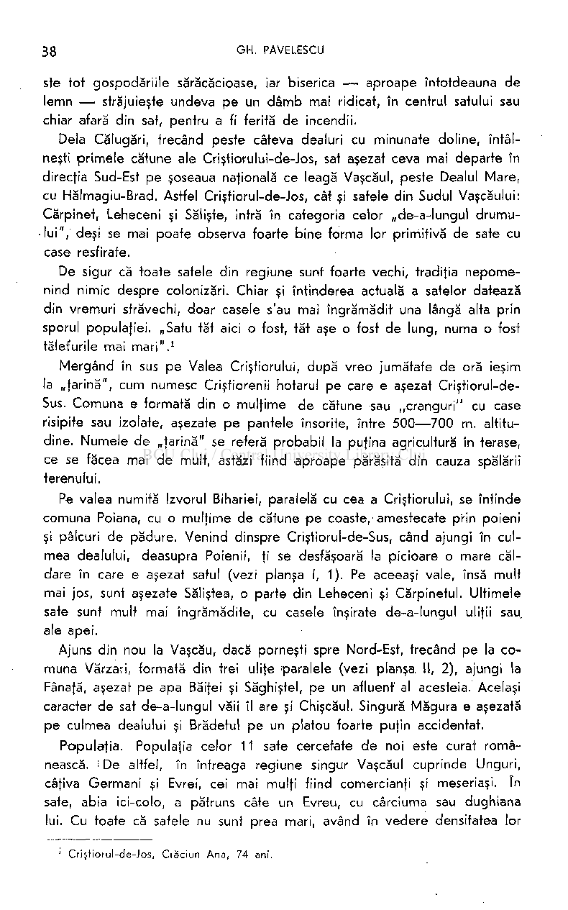

ste tot gospodăriile sărăcăcioase, iar biserica — aproape întotdeauna de lemn — străjuieşte undeva pe un dâmb mai ridicat, în centrul satului sau chiar afară din sat, pentru a fi ferită de incendii.

Delà Călugări, trecând peste câteva dealuri cu minunate doline, întâlneşti primele cătune ale Criştiorului-de-Jos, sat aşezat ceva mai departe în direcţia Sud-Est pe şoseaua nafională ce leagă Vaşcăul, peste Dealul Mare, cu Hălmagiu-Brad. Astfel Criştiorul-de-Jos, cât şi satele din Sudul Vaşcăului: Cărpinet, Leheceni şi Sălişte, intră în categoria celor „de-a-lungul drumului", deşi se mai poate observa foarte bine forma lor primitivă de sate cu case resfirate.

De sigur că toate satele din regiune sunt foarte vechi, tradiţia nepomenind nimic despre colonizări. Chiar şi întinderea actuală a satelor datează din vremuri străvechi, doar casele s'au mai îngrămădit una lângă alta prin sporul populaţiei. „Satu tăt aici o fost, făt aşe o fost de lung, numa o fost tăieturile mai mari".

1

Mergând în sus pe Valea Criştiorului, după vreo jumătate de oră ieşim la „farină", cum numesc Criştiorenii hotarul pe care e aşezat Criştiorul-deSus. Comuna e formată din o mulţime de cătune sau „crânguri" cu case risipite sau izolate, aşezate pe pantele însorite, între 500—700 m. altitudine. Numele de „ţarină" se referă probabil la puţina agricultură în terase, ce se făcea mai de mult, astăzi fiind aproape părăsită din cauza spălării terenului.

Pe valea numită Izvorul Bihariei, paralelă cu cea a Criştiorului, se întinde comuna Poiana, cu o mulţime de cătune pe coaste,'amestecate prin poieni şi pâlcuri de pădure. Venind dinspre Criştiorul-de-Sus, când ajungi în culmea dealului, deasupra Poienii, ţi se desfăşoară la picioare o mare căldare în care e aşezat satul (vezi planşa I, 1). Pe aceeaşi vale, însă mult mai jos, sunt aşezate Săliştea, o parte din Leheceni şi Cărpinetul. Ultimele sate sunt mult mai îngrămădite, cu casele înşirate de-a-lungul uliţii sau. ale apei.

Ajuns din nou la Vaşcău, dacă porneşti spre Nord-Est, trecând pe la comuna Vărzari, formată din trei uliţe paralele (vezi planşa II, 2), ajungi la Fânaţă, aşezat pe apa Băiţei şi Săghiştel, pe un afluenf al acesteia. Acelaşi caracter de sat de-a-lungul văii îl are şi Chişcăul. Singură Măgura e aşezată pe culmea dealului şi Brădetul pe un platou foarte puţin accidentat.

Populaţia. Populaţia celor 11 sate cercetate de noi este curat românească. De altfel, în întreaga regiune singur Vaşcăul cuprinde Unguri, câţiva Germani şi Evrei, cei mai mulţi fiind comercianţi şi meseriaşi. în sate, abia ici-colo, a pătruns câte un Evreu, cu cârciuma sau dughiana lui. Cu toate că satele nu sunt prea mari, având în vedere densitatea lor

' Criştiorul-de-Jos, Crăciun Ana, 74 ani.

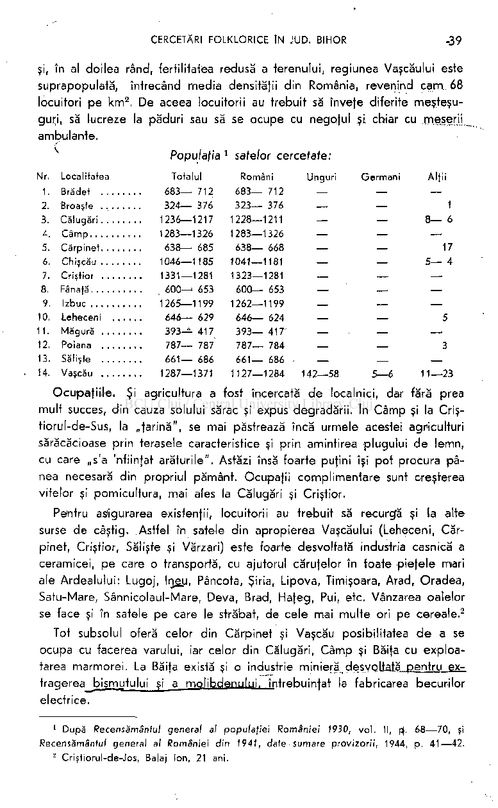

şi, în al doilea rând, fertilitatea redusă a terenului, regiunea Vaşcăului este suprapopulată, întrecând media densităţii din România, revenind cam. 68 locuitori pe km

. De aceea locuitorii au trebuit să învefe diferite meşteşuguri, să lucreze la păduri sau să se ocupe cu negoţul şi chiar cu .meserii ambulante.

2

Populaţia

safelor cercetaie:

1

Nr. Localitatea Totalul Români Unguri Germani Alţii

- 1. Brădet 683— 712 683— 712 — — —
- 2. 324— 376 323— 376 — — 1
- 3. 1236—1217 1228—1211 — — 8— 6
- 4. 1283—1326 1283—1326 — — —
- 5. 638— 685 638— 668 — — 17
- 6. 1046—1185 1041—1181 — — 5— 4
- 7. 1331—1281 1323—1281 — — —
- 8. 600— 653 600— 653 — — —
- 9. 1265—1199 1262—1199 — — —
- 10. 646— 629 646— 624 — — 5
- 11. 393— 417 393— 417 — — —
- 12. 787— 787 787— 784 — — 3
- 13. 661— 686 661— 686 — — —
- 14. 1287 1371 1127—1284 142—58 5— 6 11—2 3 Ocupaţi iile. Şi agricultura a fost încercată de localnici, dar fără prea

mult succes, din cauza solului sărac şi expus degradării. în Câmp şi la Criştiorul-de-Sus, la „farină", se mai păstrează încă urmele acestei agriculturi sărăcăcioase prin terasele caracteristice şi prin amintirea plugului de lemn, cu care „s'a 'nfiinţat arăturile". Astăzi însă foarte puţini îşi pot procura pânea necesară din propriul pământ. Ocupaţii complimentare sunt creşterea vitelor şi pomicultura, mai ales la Călugări şi Criştior.

Pentru asigurarea existenţii, locuitorii au trebuit să recurgă" şi la alte surse de câştig. Astfel în satele din apropierea Vaşcăului (Leheceni, Cărpinet, Criştior, Sălişte şi Vărzari) este foarte desvoltată industria casnică a ceramicei, pe care o transportă, cu ajutorul căruţelor în toate pieţele mari ale Ardealului: Lugoj, Inejj, Pâncota, Siria, Lipova, Timişoara, Arad, Oradea, Satu-Mare, Sânnicolaul-Mare, Deva, Brad, Haţeg, Pui, etc. Vânzarea oalelor se face şi în satele pe care le străbat, de cele mai multe ori pe cereale.

2

Tot subsolul oferă celor din Cărpinet şi Vaşcău posibilitatea de a se ocupa cu facerea varului, iar celor din Călugări, Câmp şi Băiţa cu exploatarea marmorei. La Băiţa există şi o industrie minieră desvoltată pentru extragerea bismutului şi a molibdenului. întrebuinţat la fabricarea becurilor electrice.

După Recensământul genera/ al populaţiei României 1930, vol . II, p(. 68—70 , şi Recensământul general al României din 1941, dale sumare provizorii, 1944, p. 41—42 .

1

Criştiorul-de-Jos, Balaj Ion, 21 ani.

2

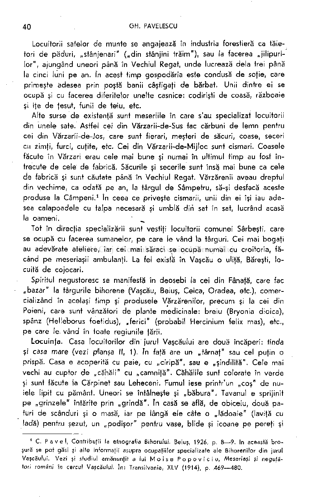

Locuitorii satelor de munte se angajează în industria forestieră ca tăietori de păduri, „stânjenari" („din stânjini trăim"), sau la facerea „jilipurilor", ajungând uneori până în Vechiul Regat, unde lucrează delà trei până la cinci luni pe an. în acest timp gospodăria este condusă de soţie, care primeşte adesea prin poştă banii câştigaţi de bărbat. Unii dintre ei se ocupă şi cu facerea diferitelor unelte casnice: codirişti de coasă, războaie şi iţe de ţesut, funii de teiu, etc.

Alte surse de existenţă sunt meseriile în care s'au specializat locuitorii din unele sate. Astfel cei din Vărzarii-de-Sus fac cărbuni de lemn pentru cei din Vărzarii-de-Jos, care sunt fierari, meşteri de săcuri, coase, seceri cu zimţi, furci, cuţite, etc. Cei din Vărzarii-de-Mijloc sunt cismari. Coasele făcute în Vărzari erau cele mai bune şi numai în ultimul timp au fost întrecute de cele de fabrică. Săcurile şi secerile sunt însă mai bune ca cele de fabrică şi sunt căutate până în Vechiul Regat. Vărzărenii aveau dreptul din vechime, ca odată pe an, la târgul de Sâmpetru, să-şi desface aceste produse la Câmpeni.

în ceea ce priveşte cismarii, unii din ei îşi iau adesea calapoadele cu talpa necesară şi umblă din sat în sat, lucrând acasă la oameni. ' ^

1

Tot în direcţia specializării sunt vestiţi locuitorii comunei Sârbeşti, care se ocupă cu facerea sumanelor, pe care le vând la târguri. Cei mai bogaţi au adevărate ateliere, iar cei mai săraci se ocupă numai cu croitoria, făcând pe meseriaşii ambulanţi. La fel exista în Vaşcău o uliţă, Băreşti, locuită de cojocari.

Spiritul negustoresc se manifestă în deosebi la cei din Fânaţă, care fac „bazar" la târgurile bihorene (Vaşcău, Beiuş, Ceica, Oradea, etc.), comercializând în acelaşi timp şi produsele Vărzărenilor, precum şi la cei din Poieni, care sunt vânzători de plante medicinale: breiu (Bryonia dioica), spânz (Helleborus foetidus), „ferici" (probabil Hercinium felix mas), etc., pe care le. vând în toate regiunile ţării.

Locuinţa. Casa locuitorilor din jurul Vaşcăului are două încăperi: Unda şi casa mare (vezi planşa II, 1). în faţă are un „târnaţ" sau cel puţin o prispă. Casa e acoperită cu paie, cu „ciripă", sau e „şindilită". Cele mai vechi au cuptor de „căhăli" cu „camniţă". Căhălile sunt colorate în verde şi sunt făcute la Cărpinet sau Leheceni. Fumul iese printr'un „coş" de nuiele lipit cu pământ. Uneori se întâlneşte şi „băbura", Tavanul e sprijinit pe „grinzele" întărite prin „grindă". în casă se află, de obiceiu, două paturi de scânduri şi o masă, iar pe lângă ele câte o „lădoaie" (laviţă cu ladă) pentru şezut, un „podişor" pentru vase, blide şi icoane pe pereţi şi

C, Pavel , Contribuţii la etnografia Bihorului, Beiuş, 1926, p. 8—9 . In această bro şură se po t găsi şi alte informaţii asupra ocupaţiilor specializate ale Bihorenilor din jurul Vaşcăului. Vezi şi studiul amănunţit a lui Mois e Popoviciu , Meseriaşi şi neguţători români m cercul Vaşcăului. în : Transilvania, XLV (1914), p. 469—480 .

1

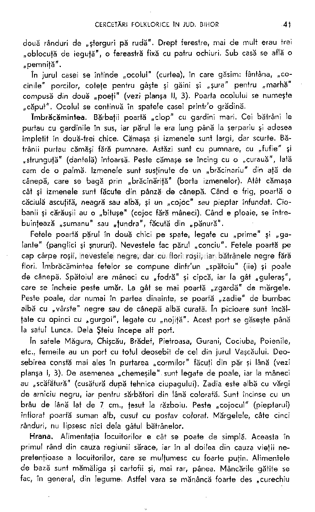

două rânduri de „şterguri pă rudă". Drept ferestre, mai de mult erau trei „oblocuţă de ieguţă", o fereastră fixă cu patru ochiuri. Sub casă se află o „pemnifă".

în jurul casei se întinde „ocolul" (curtea), în care găsim: fântâna, „cocinile" porcilor, coteţe pentru gâşte şi găini şi „şura" pentru „marhă" compusă din două „poeţi" (vezi planşa II, 3). Poarta ocolului se numeşte „căput". Ocolul se continuă în spatele casei printr'o grădină.

îmbrăcămintea. Bărbaţii poartă „clop" cu gardini mari. Cei bătrâni le purtau cu gardinile în sus, iar părul le era lung până la şerpariu şi adesea împletit în două-trei chice. Cămaşa şi izmenele sunt largi, dar scurte. Bătrânii purtau cămăşi fără pumnare. Astăzi sunt cu pumnare, cu „fufie" şi „strunguţă" (dantelă) întoarsă. Peste cămaşe se încing cu o „curauă", lată cam de o palmă. Izmenele sunt susţinute de un „brăcinariu" din aţă de cânepă, care se bagă prin „brăcinăriţă" (borta izmenelor). Atât cămaşa cât şi izmenele sunt făcute din pânză de cânepă. Când e frig, poartă o căciulă ascuţită, neagră sau albă, şi un „cojoc" sau pieptar înfundat. Ciobanii şi cărăuşii au o „bituşe" (cojoc fără mâneci). Când e ploaie, se întrebuinţează „sumanu" sau „tundra", făcută din „pănură".

Fetele poartă părul în două chici pe spate, legate cu „prime" şi „galante" (panglici şi şnururi). Nevestele fac părul „conciu". Fetele poartă pe cap cârpe roşii, nevestele negre, dar cu flori roşii, iar bătrânele negre fără flori. îmbrăcămintea fetelor se compune dinfr'un „spătoiu" (iie) şi poale de cânepă. Spătoiul are mâneci cu „fodră" şi cipcă, iar la gât „guleraş", care se încheie peste umăr. La gât se mai poartă „zgardă" de mărgele. Peste poale, dar numai în partea dinainte, se poartă „zadie" de bumbac albă cu „vârste" negre sau de cânepă albă curată. în picioare sunt încălţate cu opinci cu „gurgoi", legate cu „nojiţă". Acest port se găseşte până la satul Lunca. Delà Şteiu începe alt port.

în satele Măgura, Chişcău, Brădet, Pietroasa, Gurani, Cociuba, Poienile, etc., femeile au un port cu totul deosebit de cel din jurul Vaşcăului. Deosebirea constă mai ales în purtarea „cormilor" făcuţi din păr şi lână (vezi planşa I, 3). De asemenea „chemeşile" sunt legate de poale, iar la mâneci au „scăfătură" (cusătură după tehnica ciupagului). Zadia este albă cu vărgi de arniciu negru, iar pentru sărbători din lână colorată. Sunt încinse cu un brâu de lână lat de 7 cm., ţesut la războiu. Peste „cojocul" (pieptarul) înflorat poartă suman alb, cusut cu postav colorat. Mărgelele, câte cinci rânduri, nu lipsesc nici delà gâtul bătrânelor.

Hrana, Alimentaţia locuitorilor e cât se poate de simplă. Aceasta în primul rând din cauza regiunii sărace, iar în al doilea din cauza vieţii nepretenţioase a locuitorilor, care se mulţumesc cu foarte puţin. Alimentele de bază sunt mămăliga şi cartofii şi, mai rar, pânea. Mâncările gătite se fac, în general, din legume'. Astfel vara se mănâncă foarte des „curechiu

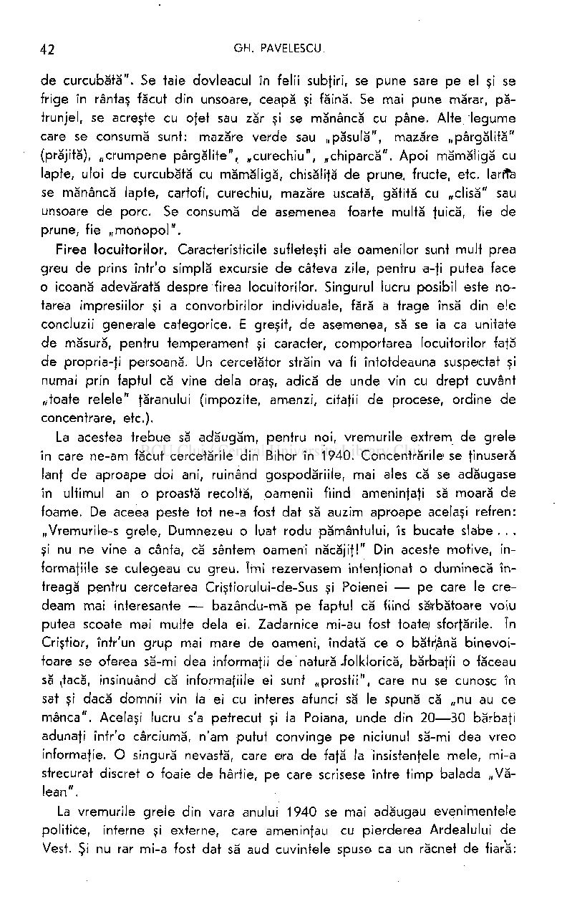

de curcubătă". Se taie dovleacul în felii subţiri, se pune sare pe el şi se frige în rântaş făcut din unsoare, ceapă şi făină. Se mai pune mărar, pătrunjel, se acreşte cu ofet sau zăr şi se mănâncă cu pâne. Alte legume care se consumă sunt: mazăre verde sau „păsulă", mazăre „pârgălită" (prăjită), „crumpene pârgălite", „curechiu", „chiparcă". Apoi mămăligă cu lapte, uloi de curcubătă cu mămăligă, chisălită de prune, fructe, etc. lartta se mănâncă lapte, cartofi, curechiu, mazăre uscată, gătită cu „clisă" sau unsoare de porc. Se consumă de asemenea foarte multă ţuică, fie de prune, fie „monopol".

Firea locuitorilor. Caracteristicile sufleteşti ale oamenilor sunt mult prea greu de prins într'o simplă excursie de câteva zile, pentru a-ţi putea face 0 icoană adevărată despre firea locuitorilor. Singurul lucru posibil este notarea impresiilor şi a convorbirilor individuale, fără ä trage însă din e!e concluzii generale categorice. E greşit, de asemenea, să se ia ca unitate de măsură, pentru temperament şi caracter, comportarea locuitorilor faţă de propria-ţi persoană. Un cercetător străin va fi întotdeauna suspectat şi numai prin faptul că vine delà oraş, adică de unde vin cu drept cuvânt „toate relele" ţăranului (impozite, amenzi, citaţii de procese, ordine de concentrare, etc.).

La acestea trebue să adăugăm, pentru noi, vremurile extrem de grele în care ne-am făcut cercetările din Bihor în 1940. Concentrările se ţinuseră lant de aproape doi ani, ruinând gospodăriile, mai ales că se adăugase în ultimul an o proastă recoltă, oamenii fiind ameninţat să moară de foame. De aceea peste tot ne-a fost dat să auzim aproape acelaşi refren: „Vremurile-s grele, Dumnezeu o luat rodu pământului, îs bucate slabe . . . şi nu ne vine a cânta, că sântem oameni năcăjit!" Din aceste motive, informaţiile se culegeau cu greu. îmi rezervasem intenţionat o duminecă întreagă pentru cercetarea Criştiorului-de-Sus şi Poienei — pe care le credeam mai interesante — bazându-mă pe faptul că fiind sărbătoare voiu putea scoate mai multe delà ei. Zadarnice mi-au fost toate/ sforţările, în Criştior, într'un grup mai mare de oameni, îndată ce o bătriână binevoitoare se oferea să-mi dea informaţii de natură-folklorică, bărbaţii o făceau să ,tacă, insinuând că informaţiile ei sunt „prostii", care nu se cunosc în

- sat şi dacă domnii vin la ei cu interes atunci să le spună că „nu au ce mânca". Acelaşi lucru s'a petrecut şi la Poiana, unde din 20—30 bărbaţi adunaţi într'o cârciumă, n'am putut convinge pe niciunul să-mi dea vreo informaţie. O singură nevastă, care era de faţă la insistenţele mele, mi-a strecurat discret o foaie de hârtie, pe care scrisese între timp balada „Vă1H lean .

La vremurile grele din vara anului 1940 se mai adăugau evenimentele politice, interne şi externe, care ameninţau cu pierderea Ardealului de Vest. Şi nu rar mi-a fost dat să aud cuvintele spuse ca un răcnet de fiară:

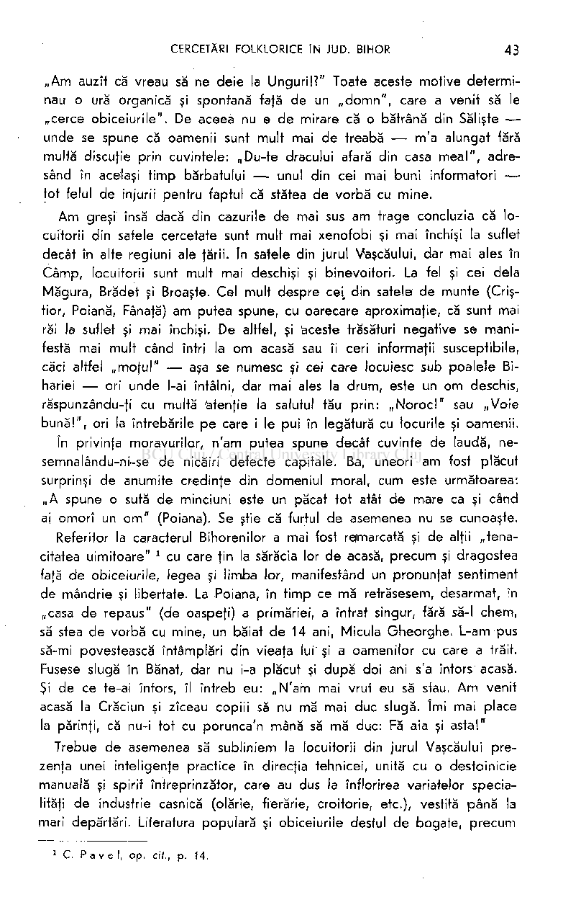

„Am auzît că vreau să ne deie la Unguri!?" Toate aceste motive determinau o ură organică şi spontană faţă de un „domn" , care a venit să le „cerce obiceiurile". De aceea nu e de mirare că o bătrână din Sălişte unde se spune că oamenii sunt mult mai de treabă — m'a alungat fără multă discuţie prin cuvintele: „Du-te dracului afară din casa mea!", adre­

- sând în aceîaşi timp bărbatului — unul din cei mai buni informatori tot felul de injurii pentru faptul că stătea de vorbă cu mine.

Am greşi însă dacă din cazurile de mai sus am trage concluzia că locuitorii din satele cercetate sunt mult mai xenofobi şi mai închişi la suflet decât în alte regiuni ale ţării. In satele din jurul Vaşcăului, dar mai ales în Câmp, locuitorii sunt mult mai deschişi şi binevoitori. La fel şi cei delà Măgura, Brădet şi Broaşte. Cel mult despre cei, din satele de munte (Criştior, Poiană, Fânaţă) am putea spune, cu oarecare aproximaţie, că sunt mai

- răi la suflet şi mai închişi. De altfel, şi 'aceste trăsături negative se manifestă mai mult când întri la om acasă sau îi ceri informaţii susceptibile, căci altfel „moţul" — aşa se numesc şi cei care locuiesc sub poalele Bihariei — ori unde l-ai întâlni, dar mai ales la drum, este un om deschis,

- răspunzându-ţi cu multă atenţie la salutul tău prin: „Noroc!" sau „Voie bună!", ori la întrebările pe care i le pui în legătură cu locurile şi oamenii.

în privinţa moravurilor, n'am putea spune decât cuvinte de laudă, nesemnalându-ni-se de nicăiri defecte capitale. Ba, uneori am fost plăcut surprinşi de anumite credinţe din domeniul moral, cum este următoarea: „A spune o sută de minciuni este un păcat tot atât de mare ca şi când ai omorî un om " (Poiana). Se ştie că furtul de asemenea nu se cunoaşte.

Referitor la caracterul Bihorenilor a mai fost reimarcată şi de alţii „tenacitatea uimitoare" cu care ţin la sărăcia lor de acasă, precum şi dragostea faţă de obiceiurile, legea şi limba lor, manifestând un pronunţat sentiment de mândrie şi libertate. La Poiana, în timp ce mă retrăsesem, désarmât, în „casa de repaus" (de oaspeţi) a primăriei, a întrat singur, fără să-l chem,

- să stea de vorbă cu mine, un băiat de 14 ani, Micula Gheorghe. L-am pus

- să-mi povestească întâmplări din vieaţa lui şi a oamenilor cu care a trăit. Fusese slugă în Bănat, dar nu i-a plăcut şi după doi ani s'a întors acasă. Şi de ce te-ai întors, îl întreb eu: „N'am mai vrut eu să stau. Am venit acasă la Crăciun şi zîceau copiii să nu mă mai duc slugă. îmi mai place la părinţi, că nu-i tot cu porunca'n mână să mă duc: Fă aia şi asta!"

Trebue de asemenea să subliniem la locuitorii din jurul Vaşcăului prezenţa unei inteligenţe practice în direcţia tehnicei, unită cu o destoinicie manuală şi spirit întreprinzător, care au dus la înflorirea variatelor specialităţi de industrie casnică (olărie, fierărie, croitorie, etc.), vestită până la mari depărtări. Literatura populară şi obiceiurile destul de bogate, precum

C. Pavel , op. cit., p. f4 .

1

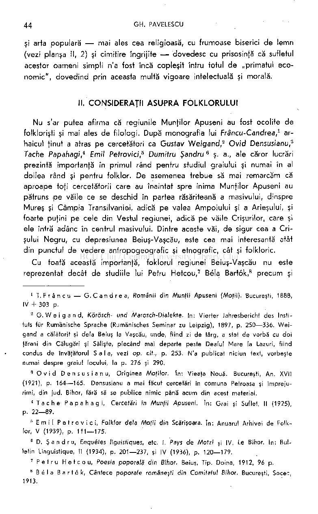

şi arta populară — mai ales cea religioasă, cu frumoase biserici de lemn (vezi planşa II, 2) şi cimitire îngrijite — dovedesc cu prisosinfă că sufletul acestor oameni simpli n'a fost încă copleşit întru totul de „primatul economic", dovedind prin aceasta multă vigoare intelectuală şi morală.

## II. CONSIDERAŢII ASUPRA FOLKLORULUI

Nu s'ar putea afirma că regiunile Munfilor Apuseni au fost ocolite de folklorişti şi mai ales de filologi. După monografia lui Frâncu-Candrea,

arhaicul finut a atras pe cercetători ca Gustav Weigand,

1

Ovid Densusianu^ Tache Papahagi* Em/7 Petrovici,

2

ş. a., ale căror lucrări prezintă importantă în primul rând pentru studiul graiului şi numai în al doilea rând şi pentru folklor. De asemenea trebue să mai remarcăm că aproape tofi cercetătorii care au înaintat spre inima Munfilor Apuseni au pătruns pe văile ce se deschid în partea răsăriteană a masivului, dinspre Mureş şi Câmpia Transilvaniei, adică pe valea Ampoiului şi a Arieşului, şi foarte pufini pe cele din Vestul regiunei, adică pe văile Crişurilor, care şi ele întră adânc în centrul masivului. Dintre aceste văi, de sigur cea a Crişului Negru, cu depresiunea Beiuş-Vaşcău, este cea mai interesantă atât din punctul de vedere antropogeografic şi etnografic, cât şi folkloric.

Dumitru Şandru

6

5

Cu toată această importantă, foklorul regiunei Beiuş-Vaşcău nu este reprezentat decât de studiile lui Petru Hetcou,

Béla Bartok,

precum şi

7

8

T. Frânc u — G . Candrea , Românii din Munţii Apuseni (AAoJii). Bucureşti, 1888, IV + 303 p.

1

G. W e i g a n d, Körösch- und Marosch-Dialekte. In: Vierter Jahresbericht des Instituts für Rumänische Sprache (Rumänisches Seminar zu Leipzig), 1897, p. 250—336 . Wei gan d a călătorit şi delà Beiuş la Vaşcău, unde, fiind zi de târg, a stat d e vorbă cu do i fărani din Călugări şi Sălişfe, plecând mai departe peste Dealul Mare la Lazuri, fiind condus de învăţătorul Sala , vezi op . c/f., p. 253, N'a publicat niciun text, vorbeşte numai despre graiul locului, la p. 276 şi 290.

2

Ovi d Densusianu , Originea Moţilor. In : Vieata Nouă. Bucureşti, An . XVII

3

(1921), p. 164—165. Densusianu a mai făcut cercetări în comuna Pefroasa şi împreju rimi, din jud . Bihor, fără să se publice nimic până acum din acest material.

Tach e Papaha g i, Cercetări in Munjii Apuseni. In: Grai şi Suflet, II (1925), p. 22—89 .

4

Emi l Petrovici , Fo/k(or de/a Mof/i din Scărişoara. In: Anuarul Arhivei de Folklor, V (1939), p. 111—175.

5

D. Şandru , Enquêtes liguistiques, etc. I. Pays de Motzi şi IV. Le Bihor. In : Bulletin Linguistique, II (1934), p. 201—237 , şi IV (1936), p. 120—179.

6

- 7 Petr u Hetcou , Poesia poporală din Bihor. Beiuş, Tip. Doina, 1912, 96 p.
- 8 Bél a Bartok , Cântece poporafe româneşti din Comitatul Bihor. Bucureşti, Socec,

1913.

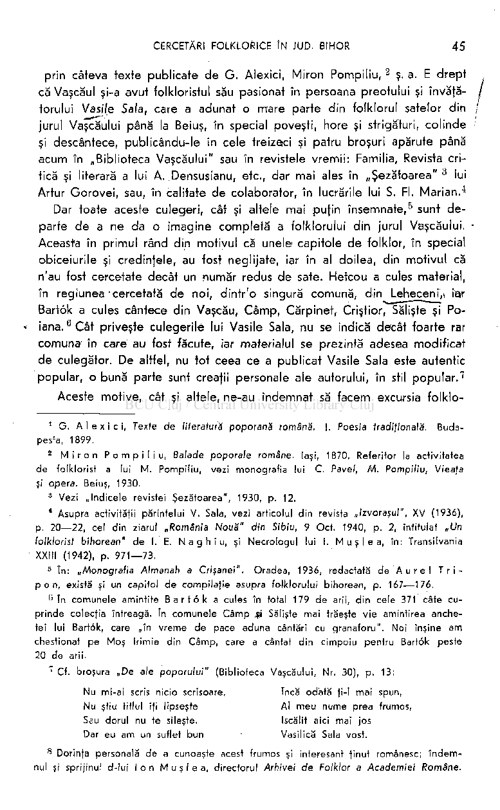

prin câteva texte publicate de G. Alexici, Miron Pompiliu, ş. a. E drept că Vaşcăul şi-a avut folkloristul său pasionat în persoana preotului şi învăţătorului Vasi/e Sala, care a adunat o mare parte din folklorul satelor din jurul Vaşcăului până la Beiuş, în special poveşti, hore şi strigături, colinde şi descântece, publicându-le în cele treizeci şi patru broşuri apărute până acum în „Biblioteca Vaşcăului" sau în revistele vremii: Familia, Revista critică şi literară a lui A. Densusianu, etc., dar mai ales în „Şezătoarea"

lui Artur Gorovei, sau, în calitate de colaborator, în lucrările lui S. FI. Marian.

3

4

sunt departe de a ne da o imagine completă a folklorului din jurul Vaşcăului. Aceasta în primul rând din motivul că unele capitole de folklor, în special obiceiurile şi credinţele, au fost neglijate, iar în al doilea, din motivul că n'au fost cercetate decât un număr redus de sate. Hetcou a cules material, în regiunea 'cercetată de noi, dintr'o singură comună, din Leheceni,> iar Bartok a cules cântece din Vaşcău, Câmp, Cărpinet, Criştior, Sălişte şi Poiana. Cât priveşte culegerile lui Vasile Sala, nu se indică decât foarte rar comuna în care au fost făcute, iar materialul se prezintă adesea modificat de culegător. De altfel, nu tot ceea ce a publicat Vasile Sala este autentic popular, o bună parte sunt creaţii personale ale autorului, în stil popular.

Dar toate aceste culegeri, cât şi altele mai puţin însemnate,

5

7

#### Aceste motive, cât şi altele, ne-au îndemnat să facem excursia folklo-

G. Alexici , Texte de literatură poporan ă română, I. Poesia tradiţională. Budapesta, 1899.

1

Miro n Pompiliu , Balade poporale române, laşi, 1870. Referitor la activitatea d e folklorist a lui M. Pompiliu, vezi monografia lui C. Pavel, M. Pompiliu, Vieaţa şi opera. Beiuş, 1930.

2

- 3 Vezi „Indicele revistei Şezătoarea", 1930, p. 12.
- 4 Asupra activităţii părintelui V. Sala, vezi articolul din revista „Izvoraşul", XV (1936),

p. 20—22 , cel din ziarul „Român/a Nouă " din Sibiu, 9 Oct. 1940, p. 2, întitulat „U n hlklorist bihorean" d e I. E. N a g h i u, şi Necrologul lui I. M u ş I e a, în: Transilvania XXIII (1942), p. 971—73 .

în : „Monografi a Almanah a Crişanei". Oradea, 1936, redactată d e Aure l Tri p o n, există şi un capitol d e compilaţie asupra folklorului bihorean, p. 167—176.

5

In comunele amintite Barto k a cules în total 179 d e arii, di n cele 371 câte cuprinde colecţia întreagă. în comunel e Câm p .si Sălişte mai frăeşte vie amintirea anchetei lui Bartok, care „în vrem e d e pace aduna cântări cu granaforu". Noi înşine am chestionat p e Moş Irimie din Câmp , care a cântat din cimpoiu pentru Bartok peste 20 de arii.

ü

Cf. broşura „D e ale poporului " (Biblioteca Vaşcăului, Nr. 30), p. 13:

Nu mi-ai scris nicio scrisoare, încă odată ţi-l mai spun, Al me u nume prea frumos, Iscălit aici mai jos Vasilică Sala vost.

Nu ştiu titlul îţi lipseşte Sau dorul nu te sileşte. Dar eu am un suflet bun

Dorinţa personală de a cunoaşte acest frumos şi interesant ţinut românesc; îndem nul şi sprijinul d-lui Io n M u ş I e a, directorul Arhivei de Folklor a Academiei Române.

8

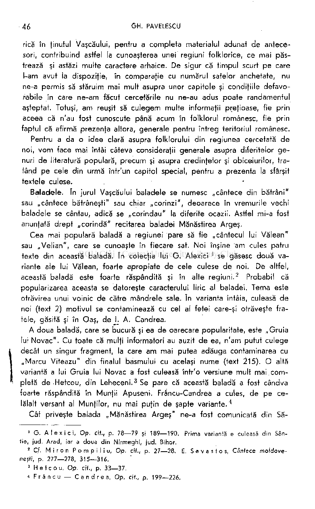

rică în ţinutul Vaşcăului, pentru a completa materialul adunat de antecesori, contribuind astfel la cunoaşterea unei regiuni folklorice, ce mai păstrează şi astăzi multe caractere arhaice. De sigur că timpul scurt pe care l-am avut la dispoziţie, în comparaţie cu numărul satelor anchetate, nu ne-a permis să stăruim mai mult asupra unor capitole şi condiţiile defavorabile în care ne-am făcut cercetările nu ne-au adus poate randamentul aşteptat. Totuşi, am reuşit să culegem multe informaţii preţioase, fie prin aceea că n'au fost cunoscute până acum în folklorul românesc, fie prin faptul că afirmă prezenţa altora, generale pentru întreg teritoriul românesc.

Pentru a da o idee clară asupra folklorului din regiunea cercetată de noi, vom face mai întâi câteva consideraţii generale asupra diferitelor genuri de literatură populară, precum şi asupra credinţelor şi obiceiurilor, tra­

- tând pe cele din urmă într'un capitol special, pentru a prezenta la sfârşit textele culese.

Baladele. în jurul Vaşcăului baladele se numesc „cântece din bătrâni"

- sau „cântece bătrâneşti" sau chiar „corinzi", deoarece în vremurile vechi baladele se cântau, adică se „corindau" la diferite ocazii. Astfel mi-a fost anunţată drept „corindă" recitarea baladei Mănăstirea Argeş.

Cea mai populară baladă a regiunei pare să fie „cântecul lui Vălean" sau „Velian", care se cunoaşte în fiecare sat. Noi înşine am cules patru texte din această baladă. în colecţia lui G. Alexici

se găsesc două variante ale lui Vălean, foarte apropiate de cele culese de noi. De altfel, această baladă este foarte răspândită şi în alte regiuni.

1

Probabil că popularizarea aceasta se datoreşte caracterului liric al baladei. Tema este otrăvirea unui voinic de către mândrele sale. în varianta întâia, culeasă de noi (text 2) motivul se contaminează cu cel al fetei care-şi otrăveşte fratele, găsită şi în Oaş, de I. A. Candrea.

2

A doua baladă, care se bucură şi ea de oarecare popularitate, este „Gruia lui Novac". Cu toate că mulţi informatori au auzit de ea, n'am putut culege decât un singur fragment, la care am mai putea adăuga contaminarea cu „Marcu Viteazu" din finalul basmului cu acelaşi nume (text 215). O altă variantă a lui Gruia lui Novac a fost culeasă într'o versiune mult mai completă de-Hetcou, din Leheceni.

Se pare că această baladă a fost cândva foarte răspândită în Munţii Apuseni. Frâncu-Candrea a cules, de pe celălalt versant al Munţilor, nu mai puţin de şapte variante.

3

4

#### Cât priveşte balada „Mănăstirea Argeş" ne-a fost comunicată din Să-

G. Alexici , Op . cit., p. 78—7 9 şi 189—190. Prima variantă e culeasă din Sentie, jud. Arad , iar a doua din Nirmeghi , jud . Bihor.

1

Cf. M i r o n P o m p i I i u, Op . cit., p. 27—28 . E. S e v a s t o s, Cântece moldove neşti, p. 277—278 , 315—316 .

2

Hetcou , Op . cit., p. 33—37 . < Frânc u — Candrea , Op . cit., p. 199—226.

3

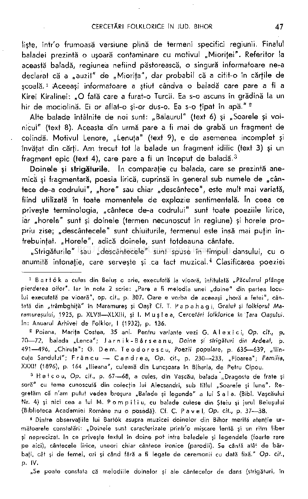

liste, într'o frumoasă versiune plină de termeni specifici regiunii. Finalul baladei prezintă o uşoară contaminare cu motivul „Mioriţei". Referitor la această baladă, regiunea nefiind păstorească, o singură informatoare ne-a declarat că a „auzit" de „Mioriţa", dar probabil că a citit-o în cărţile de şcoală.

Aceeaşi informatoare a ştiut cândva o baladă care pare a fi a Kirei Kiralinei: „ O fată care a furat-o Turcii. Ea s-o ascuns în grădină la un hir de mociolină. Ei or aflat-o şi-or dus-o. Ea s-o ţîpat în apă."

1

2

Alte balade întâlnite de noi sunt: „Balaurul" (text 6) şi „Soarele şi voinicul" (text 8). Aceasta din urmă pare a fi mai de grabă un fragment de colindă. Motivul Lenore, „Lenuţa" (text 9), e de asemenea incomplet şi învăţat din cărţi. Am trecut tot la balade un fragment idilic (text 3) şi un fragment epic (text 4), care pare a fi un început de baladă.

3

Doinele şi strigăturile. în comparaţie cu balada, care se prezintă anemică şi fragmentară, poesia lirică, cuprinsă în general sub numele de „cântece de-a codrului", „hore" sau chiar „descântece", este mult mai variată, fiind utilizată în toate momentele de explozie sentimentală. în ceea ce priveşte terminologia, „cântece de-a codrului" sunt toate poeziile lirice, iar „horele" sunt şi doinele (termen necunoscut în regiune) şi horele propriu zise; „descântecele" sunt chiuiturile, termenul este însă mai puţin întrebuinţat. „Horele", adică doinele, sunt totdeauna cântate.

„Strigăturile" sau „descântecele" sunt spuse în timpul dansului, cu o anumită intonaţie, care serveşte şi ca tact muzical.

Clasificarea poeziei

4

Bartö k a cules din Beiuş o arie, executată la vioară, întitulată „Păcularul plânge pierderea oilor". Iar în nota 2 scrie: „Pare a fi melodi a unei „doine " din partea locului executată pe vioară" , op. cit., p. 307. Oar e e vorba de aceeaşi „horă a fetei" , cântată din „trâmbghifă " în Maramureş şi Oaş? Cf. T. P a p a h a g i, Graiul

1

şi folklorul Ma ramureşului, 1925, p. XLVII—X LX III, şi I. M u ş I e a, Cercetări fof'kforice în Ţara Oaşului. în : Anuarul Arhivei de Folklor, l (1932), p. 136.

1

Poiana, Marifa Costea, 35 ani. Pentru variante vezi G. A I e x i c i, Op . cif., p. 70—72 , balada „Lenea" ; Jarnik-Bârseanu , Doin e şi strigături din Ardeal, p. 491—496 , „Chiruţa" ; G . Dem . Teodorescu , Poezii populare, p, 635—639, „llin cuţa Sandului"; Frânc u — Candrea , Op . cif., p. 230—233 , „Floarea"; Familia, XXXI! (1896), p. 164 „llieana" , culeasă din Luncşoara în Biharia, d e Petru Cipou.

2

Hetcou , Op . cit., p. 67—68 , a cules, din Vaşcău, balada „Dragoste d e frafe şi soră" cu tema cunoscută din coleefia lui Alecsandri, sub titlul „Soarele şi luna" . Regretăm că n'am putut vedea broşura „Balade şi legende " a lui Sala . (Bibi. Vaşcăului Nr. 4) şi nici cea a lui M. P o m p i I i u, cu balade culese din Şteiu şi jurul Beiuşului (Biblioteca Academie i Române nu o posedă). Cf. C. Pav e I, Op . cif., p. 37—38 .

3

Dintre observaţiile lui Bartok asupra muzicei doinelo r din Bihor merită atenţie următoarele constatări: „Doinele sunt caracterizate printr'o mişcare lentă şi un ritm liber şi neprecizat. In ce priveşte textul în doin e pot intra baladele şi legendel e (foarfe rare pe aici), cântecele lirice, uneori chiar cântece ironice (parodii). Se cântă atât d e bărbaţi, cât şi de femei, ori şi când fără a fi legate de ceremonii cu dată fixă." Op . cif., p. IV.

4

„Se poate constata că melodiil e doinelor şi ale cântecelor de dans (strigături, în

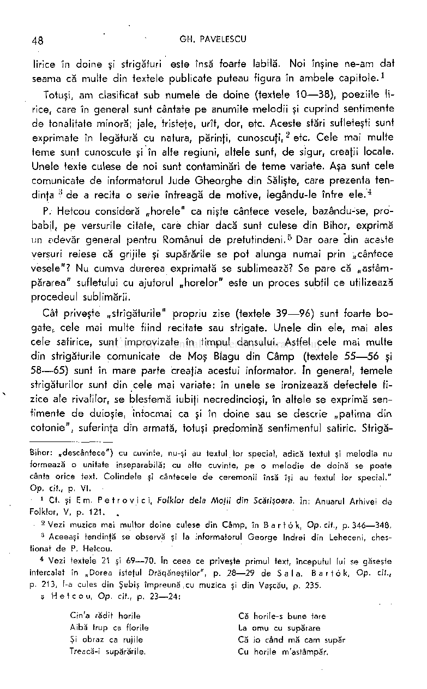

lirice în doine şi strigături este însă foarte labilă. Noi înşine ne-am dat seama că multe din textele publicate puteau figura în ambele capitole.

1

Totuşi, am clasificat sub numele de doine (textele 10—38), poeziile lirice, care în general sunt cântate pe anumite melodii şi cuprind sentimenfe de tonalitate minoră; jale, tristeţe, urît, dor, etc. Aceste stări sufleteşti sunt exprimate în legătură cu natura, părinţi, cunoscuţi,

etc. Cele mai multe teme sunt cunoscute şi în alte regiuni, altele sunt, de sigur, creaţii locale. Unele texte culese de noi sunt contaminări de teme variate. Aşa sunt cele comunicate de informatorul Jude Gheorghe din Sălişte, care prezenta tendinţa de a recita o serie întreagă de motive, legându-le între ele.

2

4

P. Hetcou consideră „horele" ca nişte cântece vesele, bazându-se, probabil, pe versurile citate, care chiar dacă sunt culese din Bihor, exprimă un adevăr general pentru Românul de pretutindeni.

Dar oare din aceste versuri reiese că grijile şi supărările se pot alunga numai prin „cântece vesele"? Nu cumva durerea exprimată se sublimează? Se pare că „astâmpărarea" sufletului cu ajutorul „horelor" este un proces subtil ce utilizează procedeul sublimării.

5

Cât priveşte „strigăturile" propriu zise (textele 39—96) sunt foarte bogate,, cele mai multe fiind recitate sau strigate. Unele din ele, mai ales cele satirice, sunt improvizate în timpul dansului. Astfel cele mai multe din strigăturile comunicate de Moş Blagu din Câmp (textele 55—56 şi 58—65) sunt în mare parte creaţia acestui informator. în general, temele strigăturilor sunt din cele mai variate: în unele se ironizează defectele fizice ale rivalilor, se blestemă iubiţi necredincioşi, în altele se exprimă sentimente de duioşie, întocmai ca şi în doine sau se descrie „patima din cotonie", suferinţa din armată, totuşi predomină sentimentul satiric. Strigă-

Bihor: „descântece") cu cuvinte, nu-şi au textul lor special, adică textul şi melodia nu formează o unitate inseparabilă; cu alte cuvinte, pe o melodi e d e doină se poate cânta orice text. Colindel e şi cântecele d e ceremonii însă îşi au textul lor special." Op . cit., p. VI .

Cf. şi E m. P e t r o v i c i, Fo/k/or delà Moţi i din Scărişoara. In : Anuarul Arhivei d e Folklor, V, p. 121 . .

1

- 2 Vezi muzica mai multor doine culese din Câmp, în Bartok , Op . cit., p. 346—348 ,
- 3 Aceeaşi tendinţă se observă şi la informatorul Georg e Indrei din Leheceni, ches­

tionat de P. Hetcou.

Vezi textele 21 şi 69—70 . In ceea ce priveşte primul text, începutul lui se găseşte intercalat în „Dorea isteţul Drăgăneştilor", p. 28—2 9 de Sala . Bartok , Op . cit., p. 213, I-a cules din Şebiş împreună.c u muzica şi din Vaşcău, p. 235.

4

5 Hetcou , Op . cit., p. 23—24 :

Cin'a rădit horile Că horile-s bune tare Aibă trup ca florile La om u cu supărare Şi obraz ca rujile Că io când mă cam supăr Treacă-i supărările. Cu horile m'astâmpăr.

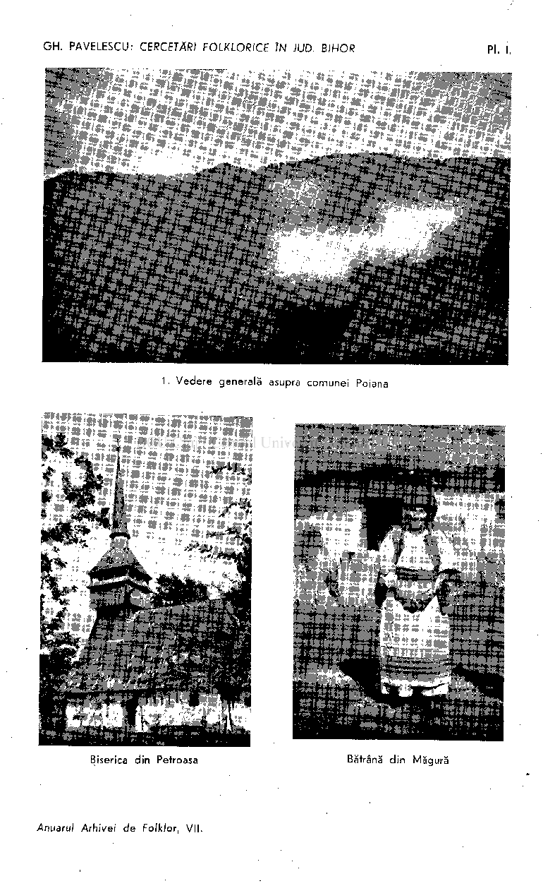

1. Vedere generală asupra comune i Poiana

Biserica din Petroasa Bătrână din Măgură

Anuarul Arhivei de Folk/or, VII.

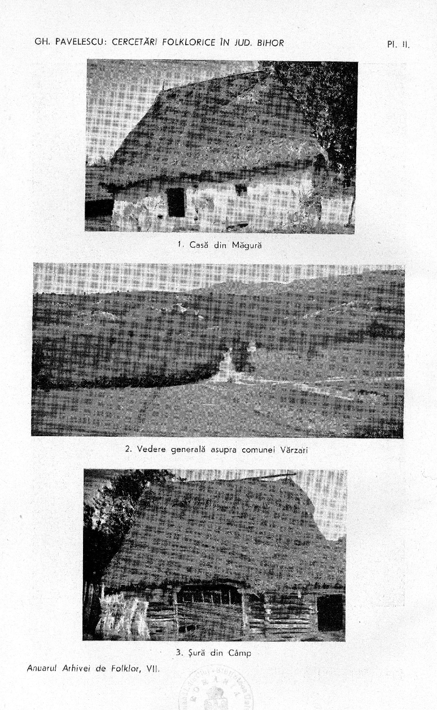

f. Casă din Măgură

2. Vedere generală asupra comunei Vărzari

3. Şură din Câmp Anuarul Arhivei de Folklor, VII.

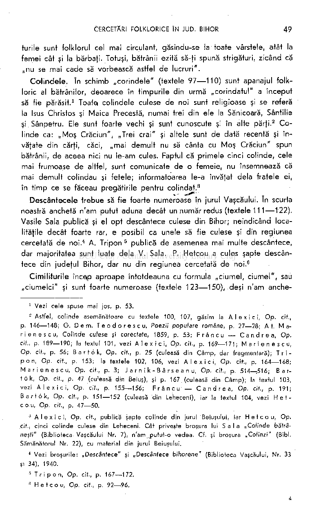

turile sunt folklorul cel mai circulant, găsindu-se la toate vârstele, atât la femei cât şi la bărbaţi. Totuşi, bătrânii ezită să-fi spună strigături, zicând că „nu se mai cade să vorbească astfel de lucruri".

Colindele. în schimb „corindele" (textele 97—110) sunt apanajul folkloric al bătrânilor, deoarece în timpurile din urmă „corindatul" a început să fie părăsit.

Toate colindele culese de noi sunt religioase şi se referă la Isus Christos şi Maica Precestă, numai trei din ele la Sănicoară, Sântilie şi Sânpetru. Ele sunt foarte vechi şi sunt cunoscute şi în alte părţi.

1

Colinde ca: „Moş Crăciun", „Trei crai" şi altele sunt de dată recentă şi învăţate din cărţi, căci, „mai demult nu să cânta cu Moş Crăciun" spun

2

- bătrânii, de aceea nici nu le-am cules. Faptul că primele cinci colinde, cele mai frumoase de altfel, sunt comunicate de o femeie, nu însemnează că mai demult colindau şi fetele; informatoarea le-a învăţat delà fratele ei,

în timp ce se făceau pregătirile pentru colindat.

3

Descântecele trebue să fie foarte numeroase în jurul Vaşcăului. Tn scurta noastră anchetă n'am putut aduna decât un număr redus (textele 111—122). Vasile Sala publică şi el opt descântece culese din Bihor; neindicând localităţile decât foarte rar, e posibil ca unele să fie culese şi din regiunea cercetată de noi.

A. Tripon publică de asemenea mai multe descântece, dar majoritatea sunt luate delà V. Sala. P. Hetcou a cules şapte descântece din judeţul Bihor, dar nu din regiunea cercetată de noi.

4

6

Cimiliturile încep aproape întotdeauna cu formula „ciumei, ciumei", sau „ciumelci" şi sunt foarte numeroase (texfele 123—150), deşi n'am anche-

- 1 Vezi cele spuse mai jos, p. 53.
- 2 Astfel, colinde asemănătoare cu textele 100, 107, găsim la A I e x i c i, Op . cit.,

- p. 146—148 ; G . Dem . Teodorescu , Poezii populare române, p. 27—28 ; A t. Ma -

- r i e n e s c u, Colinde culese şi corectate, 1859, p. 53; Frânc u — Candrea , Op . cit., p. 189—190 ; la textul 101, vezi A I e x i c i, Op . cit., p. 169—171 ; M a r i e n e s c u, Op . cit., p. 56; Bartok , Op . cit., p. 25 (culeasă din Câmp , dar fragmentară); Tri pon , Op . cit., p. 153; la textele 102, 106, vezi A I e x i c i, Op . cir., p. 164—168 ; Marienescu , Op . cit., p. 3; Jarnik-Bârseanu , Op . cit., p. 514—516 ; Bar tok , Op . cit., p. 47 (culeasă din Beiuş), şi p. 167 (culeasă din Câmp) ; la textul 103, vezi A le x ici , Op . ci/., p. 155—156 ; Frânc u — Candrea , Op . cit., p. 191 ; Bartok , Op . cit., p. 151—152 (culeasă din Leheceni), iar la textul 104, vezi Het cou , Op . cit., p. 47—50 .

A I e x i c i, Op , cit., publică şapte colinde din jurul Beiuşului, iar Hetcou , Op . cit., cinci colinde culese din Leheceni. Cât priveşte broşura lui Sal a „Colinde bătrâneşti" (Biblioteca Vaşcăului Nr. 7), n'am j?utut-o vedea. Cf. şi broşura „Colinzi " (Bibi. Sămănătorul Nr. 22), cu material din jurul Beiuşului.

3

Vezi broşurile: „Descântece" şi „Descântece bihorene " (Biblioteca Vaşcăului, Nr. 33 şi 34), 1940.

4

Tripon , Op . cit., p. 167—172.

ä

Hetcou , Op . cit., p. 92—96 .

6

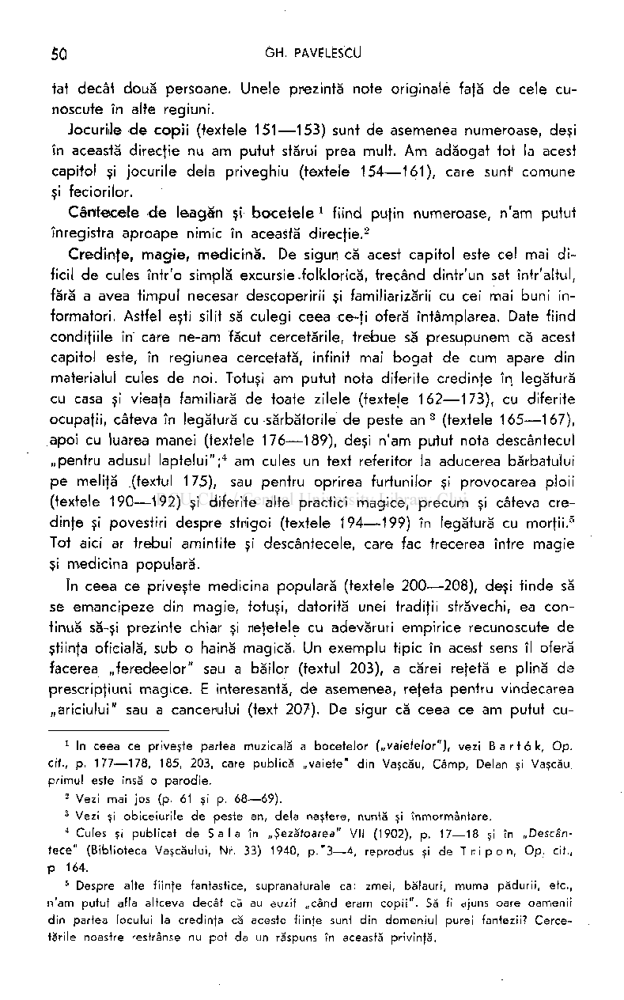

tat decât două persoane. Unele prezintă note originale fafă de cele cunoscute în alte regiuni.

Jocurile de copii (textele 151—153) sunt de asemenea numeroase, deşi în această direcţie nu am putut stărui prea mult. Am adăogat tot la acest capitol şi jocurile delà priveghiu (textele 154—161), care sunt comune şi feciorilor.

fiind puţin numeroase, n'am putut înregistra aproape nimic în această direcţie.

Cânlteioele de leagăn şi bocetele

1

2

Credinţe, magie, medicină. De sigur că acest capitol este cel mai dificil de cules într'o simplă excursie folklorică, trecând dintr'un sat într'altul, fără a avea timpul necesar descoperirii şi familiarizării cu cei mai buni informatori. Astfel eşti silit să culegi ceea ce-ţi oferă întâmplarea. Date fiind condiţiile în care ne-am făcut cercetările, trebue să presupunem că acest capitol este, în regiunea cercetată, infinit mai bogat de cum apare din materialul cules de noi. Totuşi am putut nota diferite credinţe în legătură cu casa şi vieaţa familiară de toate zilele (textele 162—173), cu diferite ocupaţii, câteva în legătură cu sărbătorile de peste an (textele 165—167), apoi cu luarea manei (textele 176—189), deşi n'am putut nota descântecul „pentru adusul laptelui";

am cules un text referitor la aducerea bărbatului pe meliţă (textul 175), sau pentru oprirea furtunilor şi provocarea ploii (textele 190—192) şi diferite alte practici magice, precum şi câteva credinţe şi povestiri despre strigoi (textele 194—199) în legătură cu morţii.

4

5

Tot aici ar trebui amintite şi descântecele, care fac trecerea între magie şi medicina populară.

în ceea ce priveşte medicina populară (textele 200—208), deşi tinde să se emancipeze din magie, totuşi, datorită unei tradiţii străvechi, ea continuă să-şi prezinte chiar şi reţetele cu adevăruri empirice recunoscute de ştiinţa oficială, sub o haină magică. Un exemplu tipic în acest sens îl oferă facerea „feredeelor" sau a băilor (textul 203), a cărei reţetă e plină de prescripţiuni magice. E interesantă, de asemenea, reţeta pentru vindecarea „ariciului" sau a cancerului (text 207). De sigur că ceea ce am putut cu-

In ceea ce priveşte partea muzicală a bocetelor („vaietelor"), vezi Bartok , Op . cit., p. 177—178, 185, 203, care publică „vaiete " din Vaşcău, Câmp , Delan şi Vaşcău. primul este însă o parodie.

1

- 2 Vezi mai jos (p. 61 şi p. 68—69).
- 3 Vezi şi obiceiurile de peste an, delà naştere, nuntă şi înmormântare.
- 4 Cules şi publicat de Sal a în „Şezătoarea" VII (1902), p. 17—18 şi în „Descân­

tece " (Biblioteca Vaşcăului, Nr. 33) 1940, p.*3—4 , reprodus şi de Trü p on , Op . cit., p. 164.

Despre alte fiinţe fantastice, supranaturale ca: zmei, balauri, muma pădurii, etc., n'am putut afla altceva decât că au auzit „când eram copii" . Să fi ajuns oare oamenii din partea locului la credinţa că aceste fiinţe sunt din domeniul purei fantezii? Cercetările noastre restrânse nu pot da un răspuns în această privinţă.

5

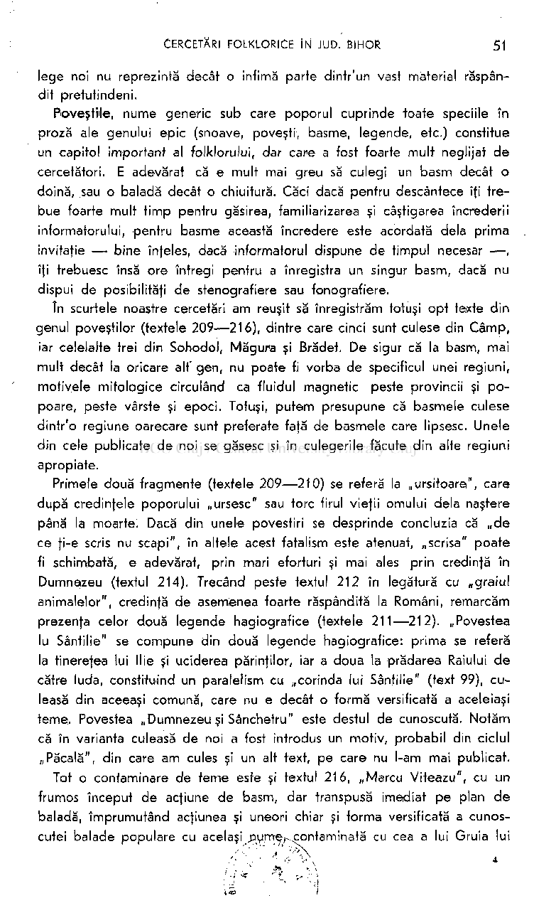

lege noi nu reprezintă decât o infimă parte dintr'un vast material răspândit pretutindeni.

Poveştile, nume generic sub care poporul cuprinde toate speciile în proză ale genului epic (snoave, poveşti, basme, legende, etc.) constitue un capitol important al folklorului, dar care a fost foarte mult neglijat de cercetători. E adevărat că e mult mai greu să culegi un basm decât o doină, sau o baladă decât o chiuitură. Căci dacă pentru descântece îfi trebue foarte mult timp pentru găsirea, familiarizarea şi câştigarea încrederii informatorului, pentru basme această încredere este acordată delà prima invitaţie — bine înţeles, dacă informatorul dispune de timpul necesar — , îţi trebuesc însă ore întregi pentru a înregistra un singur basm, dacă nu dispui de posibilităţi de stenografiere sau fonografiere.

în scurtele noastre cercetări am reuşit să înregistrăm totuşi opt texte din

genul poveştilor (textele 209—216), dintre care cinci sunt culese din Câmp, iar celelalte trei din Sohodol, Măgura şi Brădet. De sigur că la basm, mai mult decât la oricare alt" gen, nu poate fi vorba de specificul unei regiuni, motivele mitologice circulând ca fluidul magnetic peste provincii şi popoare, peste vârste şi epoci. Totuşi, putem presupune că basmele culese dintr'o regiune oarecare sunt preferate faţă de basmele care lipsesc. Unele din cele publicate de noi se găsesc şi în culegerile făcute din alte regiuni apropiate.

Primele două fragmente (textele 209—210) se referă la „ursitoare", care după credinţele poporului „ursesc" sau torc firul vieţii omului delà naştere până la moarte. Dacă din unele povestiri se desprinde concluzia că „d e ce ţi-e scris nu scapi", în altele acest fatalism este atenuat, „scrisa" poate fi schimbată, e adevărat, prin mari eforturi şi mai ales prin credinţă în Dumnezeu (textul 214). Trecând peste textul 212 în legătură cu „graiul animalelor", credinţă de asemenea foarte răspândită la Români, remarcăm prezenţa celor două legende hagiografice (textele 211—212). „Povestea Iu Sântilie" se compune din două legende hagiografice: prima se referă la tinereţea lui Nie şi uciderea părinţilor, iar a doua la prădarea Raiului de

- către luda, constituind un paralelism cu „corinda lui Sântilie" (text 99), culeasă din aceeaşi comună, care nu e decât o formă versificată a aceleiaşi teme. Povestea „Dumnezeu şi Sânchetru" este destul de cunoscută. Notăm că în varianta culeasă de noi a fost introdus un motiv, probabil din ciclul „Păcală", din care am cules şi un alt text, pe care nu l-am mai publicat.

Tot o contaminare de teme este şi textul 216, „Marcu Viteazu", cu un frumos început de acţiune de basm, dar transpusă imediat pe plan de baladă, împrumutând acţiunea şi uneori chiar şi forma versificată a cunoscutei balade populare cu acelaşi jjumç ^ contaminată cu cea a lui Gruia lui

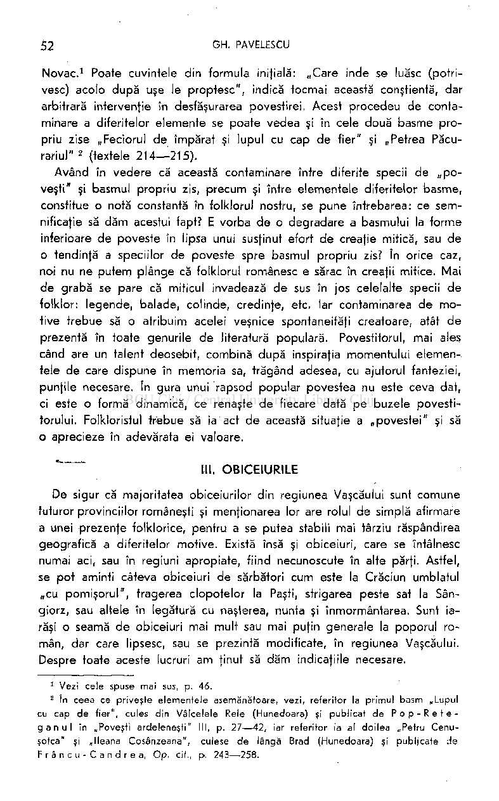

Poate cuvintele din formula iniţială: „Care inde se luăsc (potrivesc) acolo după uşe le proptesc", indică tocmai această conştientă, dar arbitrară intervenţie în desfăşurarea povestirei. Acest procedeu de contaminare a diferitelor elemente se poate vedea şi în cele două basme propriu zise „Feciorul de împărat şi lupul cu cap de fier" şi „Petrea Păcurariul" (textele 214—215).

Novac.

1

Având în vedere că această contaminare între diferite specii de „poveşti" şi basmul propriu zis, precum şi între elementele diferitelor basme, constitue o notă constantă în folklorul nostru, se pune întrebarea: ce semnificaţie să dăm acestui fapt? E vorba de o degradare a basmului la forme inferioare de poveste în lipsa unui susţinut efort de creaţie mitică, sau de

- o tendinţă a speciilor de poveste spre basmul propriu zis? în orice caz, noi nu ne putem plânge că folklorul românesc e sărac în creaţii mitice. Mai de grabă se pare că miticul invadează de sus în jos celelalte specii de folklor: legende, balade, colinde, credinţe, etc. Iar contaminarea de motive trebue să o atribuim acelei veşnice spontaneităţi creatoare, atât de prezentă în toate genurile de literatură populară. Povestitorul, mai ales când are un talent deosebit, combină după inspiraţia momentului elementele de care dispune în memoria sa, trăgând adesea, cu ajutorul fanteziei, punţile necesare. în gura unui rapsod popular povestea nu este ceva dat, ci este o formă dinamică, ce renaşte de fiecare dată pe buzele povestitorului. Folkloristul trebue să ia act de această situaţie a „povestei" şi să
- o aprecieze în adevărata ei valoare.

## * III. OBICEIURILE

De sigur că majoritatea obiceiurilor din regiunea Vaşcăului sunt comune tuturor provinciilor româneşti şi menţionarea lor are rolul de simplă afirmare a unei prezenţe folklorice, pentru a se putea stabili mai târziu răspândirea geografică a diferitelor motive. Există însă şi obiceiuri, care se întâlnesc numai aci, sau în regiuni apropiate, fiind necunoscute în alte părţi. Astfel, se pot aminti câteva obiceiuri de sărbători cum este la Crăciun umblatul „cu pomişorul", tragerea clopotelor la Paşti, strigarea peste sat la Sângiorz, sau altele în legătură cu naşterea, nunta şi înmormântarea. Sunt iarăşi o seamă de obiceiuri mai mult sau mai puţin generale la poporul român, dar care lipsesc, sau se prezintă modificate, în regiunea Vaşcăului. Despre toate aceste lucruri am ţinut să dăm indicaţiile necesare.

- 1 Vezi cele spuse mai sus, p. 46.
- 2 în ceea ce priveşte elementele asemănătoare, vezi, referitor la primul basm „Lupul

cu cap d e fier", cules din Vâlcelele Rele (Hunedoara) şi publicat d e Pop-Rete ganu l în „Poveşti ardeleneşti" III, p. 27—42 , iar referitor la al doilea „Petru Cenu şotca" şi „Ileana Cosânzeana", culese d e lângă Brad (Hunedoara) şi publicate de Frăncu-Candrea , Op . ci/., p. 243—258 .

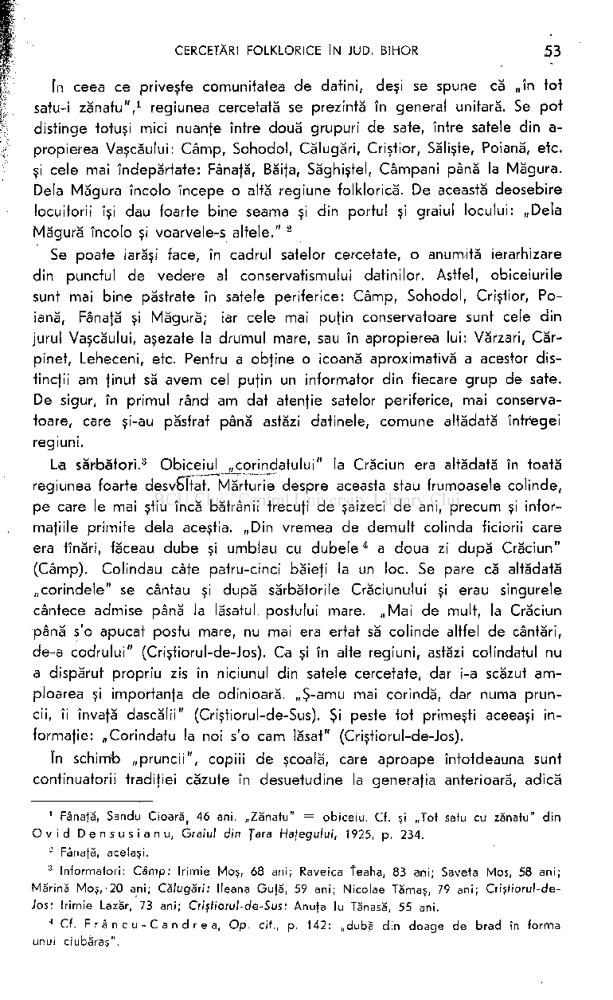

în ceea ce priveşte comunitatea de datini, deşi se spune că „în tot satu-i zănatu",

regiunea cercetată se prezintă în general unitară. Se pot distinge totuşi mici nuanţe între două grupuri de sate, între satele din apropierea Vaşcăului: Câmp, Sohodol, Călugări, Criştior, Sălişte, Poiană, etc. şi cele mai îndepărtate: Fanată, Băifa, Săghiştel, Câmpani până la Măgura. Delà Măgura încolo începe o altă regiune folklorică. De această deosebire locuitorii îşi dau foarte bine seama şi din portul şi graiul locului: „Dela Măgură încolo şi voarvele-s altele."

1

2

Se poate iarăşi face, în cadrul satelor cercetate, o anumită ierarhizare din punctul de vedere al conservatismului datinilor. Astfel, obiceiurile sunt mai bine păstrate în satele periferice: Câmp, Sohodol, Criştior, Poiană, Fânaţă şi Măgură; iar cele mai puţin conservatoare sunt cele din jurul Vaşcăului, aşezate la drumul mare, sau în apropierea lui: Vărzari, Cărpinet, Leheceni, etc. Pentru a obţine o icoană aproximativă a acestor distincţii am ţinut să avem cel puţin un informator din fiecare grup de sate. De sigur, în primul rând am dat atenţie satelor periferice, mai conservatoare, care şi-au păstrat până astăzi datinele, comune altădată întregei regiuni.

Obiceiul__„corjndatului" la Crăciun era altădată în toată regiunea foarte desvSîtat. Mărturie despre aceasta stau frumoasele colinde, pe care le mai ştiu încă bătrânii trecuţi de şaizeci de ani, precum şi informaţiile primite dela aceştia. „Din vremea de demult colinda ficiorii care era tînări, făceau dube şi umblau cu dubele

La sărbători.

3

a doua zi după Crăciun" (Câmp). Colindau câte patru-cinci băieţi la un loc. Se pare că altădată „corindele" se cântau şi după sărbătorile Crăciunului şi erau singurele cântece admise până la lăsatul postului mare. „Mai de mult, la Crăciun până s'o apucat postu mare, nu mai era ertat să colinde altfel de cântări, de-a codrului" (Criştiorul-de-Jos). Ca şi în alte regiuni, astăzi colindatul nu a dispărut propriu zis în niciunul din satele cercetate, dar i-a scăzut amploarea şi importanţa de odinioară. „Ş-amu mai corindă, dar numa pruncii, îi învaţă dascălii" (Criştiorul-de-Sus). Şi peste tot primeşti aceeaşi informaţie: „Corindatu la noi s'o cam lăsat" (Criştiorul-de-Jos).

4

în schimb „pruncii", copiii de şcoală, care aproape întotdeauna sunt continuatorii tradiţiei căzute în desuetudine la generaţia anterioară, adică

Fânafă, Sandu Cioară, 46 ani. „Zănafu " = obiceiu. Cf. şi „Tot safu cu zănafu" di n Ovi d Densusianu , Graiul din Ţara Haţegului, 1925, p. 234.

1

- 2 Fânafă, acelaşi.
- 3 Informatori: Câmp : Irimie Moş, 68 ani; Raveica Teaha, 83 ani; Savefa Moş, 58 ani ;

Marină Moş, 20 ani; Călugări; Ileana Gufă, 59 ani; Nicolae Tămaş, 79 ani; Criştiorul-deJos: Irimie Lazăr, 73 ani; Crişf/orul-de-Sus: Anufa Iu Tănasă, 55 ani.

Cf. Frâncu-Candrea , Op . cif., p. 142: „dubă din doag e de brad în forma unui ciubăraş".

4

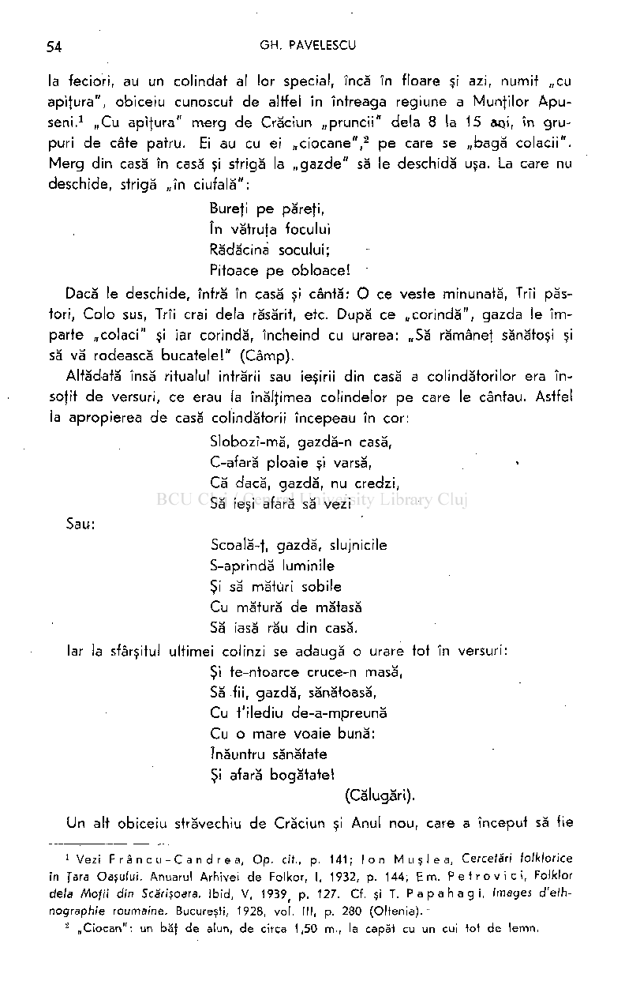

la feciori, au un colindat al lor special, încă în floare şi azi, numit „cu apijura", obiceiu cunoscut de altfel în întreaga regiune a Munfilor Apuseni.

„Cu apifura" merg de Crăciun „pruncii" delà 8 la 15 aci, în grupuri de câte patru. Ei au cu ei „ciocane",

1

pe care se „bagă colacii". Merg din casă în casă şi strigă la „gazde" să le deschidă uşa. La care nu deschide, strigă „în ciufală":

2

Burefi pe părefi, în vătrufa focului Rădăcina socului; Pitoace pe obloace!

Dacă le deschide, întră în casă şi cântă: O ce veste minunată, Trîi păstori, Colo sus, Trîi crai delà răsărit, etc. După ce „corindă", gazda le împarte „colaci" şi iar corindă, încheind cu urarea: „Să rămâneţ sănătoşi şi să vă rodească bucatele!" (Câmp).

Altădată însă ritualul intrării sau ieşirii din casă a colindătorilor era însoţit de versuri, ce erau la înălţimea colindelor pe care le cântau. Astfel la apropierea de casă colindătorii începeau în cor:

Slobozî-mă, gazdă-n casă, C-afară ploaie şi varsă, Că dacă, gazdă, nu credzi, Să ieşi afară să vezi

Sau:

Scoală-ţ, gazdă, slujnicile S-aprindă luminile Şi să mături sobile Cu mătură de mătasă Să iasă rău din casă.

Iar la sfârşitul ultimei colinzi se adaugă o urare tot în versuri: Şi te-ntoarce cruce-n masă, Să fii, gazdă, sănătoasă, Cu t'ilediu de-a-mpreună Cu o mare voaie bună: înăuntru sănătate Şi afară bogătate!

(Călugări). Un alt obiceiu străvechiu de Crăciun şi Anul nou, care a început să fie

Vezi Frâncu-Candrea , Op . cit., p. 141 ; Io n M u ş I e a, Cercetări toMorice în Ţara Oaşului. Anuarul Arhivei de Folkor, I, 1932, p. 144; Em . Petrovici , Folklor de/a Moţii din Scărişoara. Ibid, V, 1939

1

p. 127. Cf. şi T. P a p a h a g i, /mages d'efhnographie roumaine. Bucureşti, 1928, vol . III, p. 280 (Oltenia).-

(

„Ciocan" : un băf d e alun, de circa 1,50 m., la capăt cu un cui tot de lemn.

2

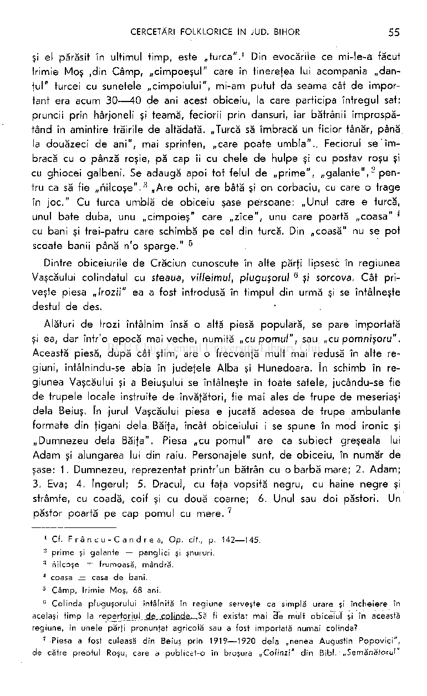

Din evocările ce mi-le-a făcut Irimie Moş ,din Câmp, „cimpoeşul" care în tinerefea lui acompania „danţul" turcei cu sunetele „cimpoiului", mi-am putut da seama cât de important era acum 30—40 de ani acest obiceiu, la care participa întregul sat: pruncii prin hârjoneli şi teamă, feciorii prin dansuri, iar bătrânii împrospătând în amintire trăirile de altădată. „Turcă să îmbracă un ficior tânăr, până la douăzeci de ani", mai sprinten, „care poate umbla".. Feciorul se îmbracă cu o pânză roşie, pă cap îi cu chele de huipe şi cu postav roşu şi cu ghiocei galbeni. Se adaugă apoi tot felul de „prime", „galante",

şi el părăsit în ultimul timp, este „turca".

1

pentru ca să fie „hilcoşe".

2

„Are ochi, are bâtă şi on corbaciu, cu care o trage în joc." Cu turca umblă de obiceiu şase persoane: „Unul ca"re e turcă, unul bate duba, unu „cimpoieş" care „zîce", unu care poartă „coasa"

3

4

cu bani şi trei-patru care schimbă pe cel din turcă. Din „coasă" nu se pot scoate banii până n'o sparge."

5

Dintre obiceiurile de Crăciun cunoscute în alte părţi lipsesc în regiunea Vaşcăului colindatul cu steaua, vifleimul, pluguşorul

şi sorcova. Cât priveşte piesa „Irozii" ea a fost introdusă în timpul din urmă şi se întâlneşte destul de des.

6

Alături de Irozi întâlnim însă o altă piesă populară, se pare importată şi ea, dar într'o epocă mai veche, numită „cu pomul", sau „cu pomnişoru". Această piesă, după cât ştim, are o frecvenţă mult mai redusă în alte regiuni, întâlnindu-se abia în judeţele Alba şi Hunedoara. în schimb în regiunea Vaşcăului şi a Beiuşului se întâlneşte în toate satele, jucându-se fie de trupele locale instruite de învăţători, fie mai ales de trupe de meseriaşi delà Beiuş. în jurul Vaşcăului piesa e jucată adesea de trupe ambulante formate din ţigani delà Băifa, încât obiceiului i se spune în mod ironic şi „Dumnezeu delà Băiţa". Piesa „cu pomul" are ca subiect greşeala lui Adam şi alungarea lui din raiu. Personajele sunt, de obiceiu, în număr de şase: 1. Dumnezeu, reprezentat printr'un bătrân cu o barbă mare; 2. Adam; 3. Eva; 4. îngerul; 5. Dracul, cu faţa vopsită negru, cu haine negre şi strâmte, cu coadă, coif şi cu două coarne; 6. Unul sau doi păstori. Un păstor poartă pe cap pomul cu mere.

7

- 1 Cf. Frâneu-Candrea , Op . cit., p. 142—145.
- 2 prim e şi galanfe = panglici şi şnururi.
- 3 nilcoşe = frumoasă, mândră.
- 4 coasa = casa de bani.
- 5 Câmp, Irimie Moş, 68 ani.
- 6 Colinda pluguşorului înfâlnită în regiune serveşte ca simplă urare şi încheiere în

acelaşi timp la repertorjul d e colinde_S ă fi existat mai de mult obiceiul şi în această regiune, în unele părji pronunţat agricolă sau a fost importată numai colinda?

Piesa a fost culeasă din Beiuş prin 1919—1920 delà „nenea Augustin Popovici" , de către preotul Roşu, care a publicat-o în broşura „Colinzi " din Bibi. „Semănătorul"

7

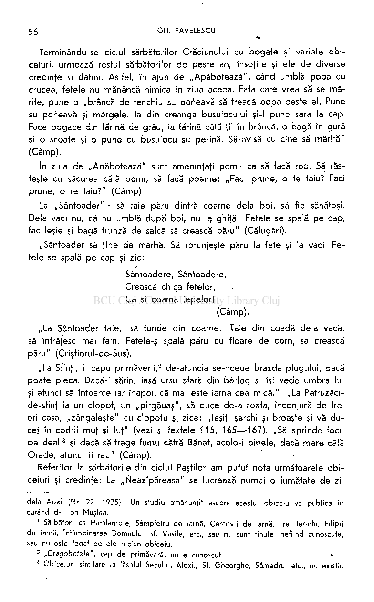

Terminându-se ciclul sărbătorilor Crăciunului cu bogate şi variate obiceiuri, urmează restul sărbătorilor de peste an, însoţite şi ele de diverse credinfe şi datini. Astfel, în ajun de „Apăbotează", când umblă popa cu crucea, fetele nu mănâncă nimica în ziua aceea. Fata care vrea să se mărite, pune o „brâncă de tenchiu su poneavă să treacă popa peste el. Pune su poneavă şi mărgele, la din creanga busuiocului şi-l pune sara la cap. Face pogace din fărină de grâu, ia fărină câtă fîi în brâncă, o bagă în gură şi o scoate şi o pune cu busuiocu su perină. Să-nvisă cu cine să mărită" (Câmp).

în ziua de „Apăbotează" sunt ameninfafi pomii ca să facă rod. Să răsteşte cu săcurea cătă pomi, să facă poame: „Faci prune, o te taiu? Faci prune, o te taiu?" (Câmp).

La „Sântoader" să taie păru dintră coarne dela boi, să fie sănătoşi. Dela vaci nu, că nu umblă după boi, nu iş ghifăi. Fetele se spală pe cap, fac leşie şi bagă frunză de salcă să crească păru" (Călugări).

„Sântoader să |îne de marhă. Să rotunjeşte păru la fete şi la vaci. Fetele se spală pe cap şi zic:

Sântoadere, Sântoadere, Crească chica fetelor, Ca şi coama iepelor!

(Câmp).

„La Sântoader taie, să tunde din coarne. Taie din coadă dela vacă, să înfrafesc mai fain. Fetele-ş spală păru cu floare de corn, să crească păru" (Criştiorul-de-Sus).

de-atuncia se-ncepe brazda plugului, dacă poate pleca. Dacă-i sărin, iasă ursu afară din bârlog şi îşi vede umbra lui şi atunci să întoarce iar înapoi, că mai este iarna cea mică." „La Patruzăcide-sfinf ia un clopot, un „pirgăuaş", să duce de-a roata, înconjură de trei ori casa, „zângăleşte" cu clopotu şi zîce: „Ieşit, şerchi şi broaşte şi vă ducej în codrii muf şi tut" (vezi şi textele 115, 165—167). „Să aprinde focu pe deal

„La Sfinţi, îi capu primăverii,

3

şi dacă să trage fumu cătră Bănat, âcolo-i binele, dacă mere cătă Orade, atunci îi rău" (Câmp).

3

Referitor la sărbătorile din ciclul Paştilor am putut nota următoarele obiceiuri şi credinfe: La „Neazîpăreasa" se lucrează numai o jumătate de zi,

dela Arad (Nr. 22—1925) . Un studiu amănunfit asupra acestui obiceiu va publica in curând d-l Ion Muşlea.

Sărbători ca Haralampie, Sâmpiefru de iarnă, Cercovii de iarnă, Trei Ierarhi, Filipii d e iarnă, întâmpinarea Domnului, st. Vasile, etc., sau nu sunt finute, nefiind cunoscute, sau nu este legat de ele niciun obiceiu .

1

„Dragobefele" , cap de primăvară, nu e cunoscut. •

2

Obiceiuri similare la lăsatul Secului, Alexii, Sf. Gheorghe, Sâmedru, etc., nu există.

3

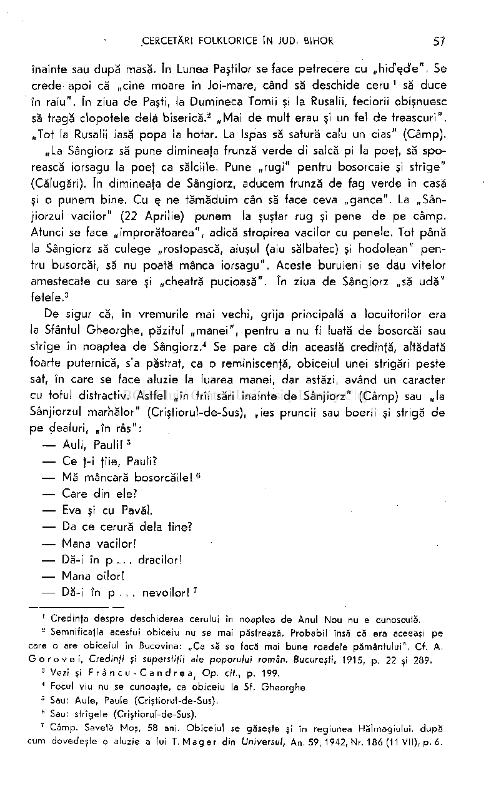

înainte sau după masă. în Lunea Paştilor se face petrecere cu „hicîşd'e". Se crede apoi că „cine moare în Joi-mare, când să deschide ceru

să duce în raiu". în ziua de Paşti, la Dumineca Tomii şi la Rusalii, feciorii obişnuesc să tragă clopotele delà biserică.

1

„Mai de mult erau şi un fel de treascuri". „Tot la Rusalii iasă popa la hotar. La Ispas să satură calu un cias" (Câmp).

2

„La Sângiorz să pune dimineafa frunză verde di salcă pi la poef, să sporească iorsagu la poef ca sălciile. Pune „rugi" pentru bosorcaie şi strîge" (Călugări). în dimineafa de Sângiorz, aducem frunză de fag verde în casă şi o punem bine. Cu q ne tămăduim cân să face ceva „gance". La „Sânjiorzul vacilor" (22 Aprilie) punem la şuştar rug şi pene de pe câmp. Atunci se face „improrătoarea", adică stropirea vacilor cu penele. Tot până la Sângiorz să culege „rostopască, aiuşul (aiu sălbatec) şi hodolean" pentru busorcăi, să nu poată mânca iorsagu". Aceste buruieni se dau vitelor amestecate cu sare şi „cheatră pucioasă". în ziua de Sângiorz „să udă'' fetele.

3

De sigur că, în vremurile mai vechi, grija principală a locuitorilor era la Sfântul Gheorghe, păzitul „manei", pentru a nu fi luată de bosorcăi sau strîge în noaptea de Sângiorz.

Se pare că din această credinfă, altădată foarte puternică, s'a păstrat, ca o reminiscenfă, obiceiul unei strigări peste sat, în care se face aluzie la luarea manei, dar astăzi, având un caracter cu totul distractiv. Astfel „în trîi sări înainte de Sânjiorz" (Câmp) sau „la Sânjiorzul marhălor" (Criştiorul-de-Sus), „ies pruncii sau boerii şi strigă de pe dealuri, „în râs": — Auli, Pauli!

4

5

— Ce }-î fîie, Pauli?

— Mă mâncară bosorcăile!

6

— Care din ele?

— Eva şi cu Pavăl.

— Da ce cerură delà tine?

— Mana vacilor!

— Dă-i în p ... . dracilor!

— Mana oilor!

— Dă-i în p . . . nevoilor!

7

- 1 Credinfă despre deschiderea cerului în noaptea de Anul Nou nu e cunoscută.
- 2 Seimnificafia acestui obiceiu nu se mai păstrează. Probabil însă că era aceeaşi p e

care o are obiceiul în Bucovina: „Ca să se facă mai bune roadele pământului". Cf. A. Gorovei , Credinţi şi superstiţii ale poporulu i român. Bucureşti, 1915, p. 22 şi 289.

- 3

Vezi şi Frâncu-Candrea

(

Op . cif., p. 199,

- 4 Focul viu nu se cunoaşte, ca obicei u la Sf. Gheorghe .
- 5 Sau: Aule, Paule (Criştiorul-de-Sus).
- 6 Sau: strîgele (Criştiorul-de-Sus).
- 7 Câmp. Savetă Moş, 58 ani. Obiceiu l se găseşte şi în regiunea Hălmagiului, dup ă

###### cum dovedeşte o aluzie a lui T. Mage r din Universul, An. 59, 1942, Nr. 186 (11 VII), p. 6.

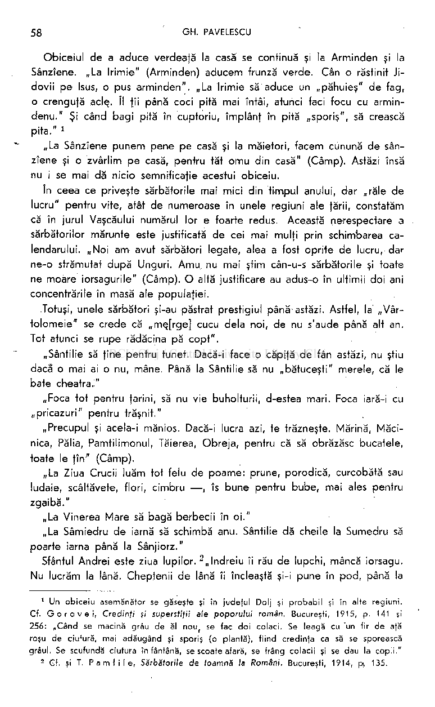

Obiceiul de a aduce verdeafă la casă se continuă şi la Arminden şi la Sânziene. „La Irimie" (Arminden) aducem frunză verde. Cân o răstinit Jidovii pe Isus, o pus arminden". „La Irimie să aduce un „păhuieş" de fag,

- o crenguţă aclş. îl ţîi până coci pită mai întâi, atunci faci focu cu armindenu." Şi când bagi pită în cuptoriu, împlânf în pită „sporiş", să crească

pita."

1

„La Sânzîene punem pene pe casă şi la măietori, facem cunună de sânziene şi o zvârlim pe casă, pentru făt omu din casă" (Câmp). Astăzi însă nu i se mai dă nicio semnificare acestui obiceiu.

în ceea ce priveşte sărbătorile mai mici din timpul anului, dar „răle de lucru" pentru vite, atât de numeroase în unele regiuni ale fării, constatăm că în jurul Vaşcăului numărul lor e foarte redus. Această nerespectare a sărbătorilor mărunte este justificată de cei mai mulţi prin schimbarea calendarului. „Noi am avut sărbători legate, alea a fost oprite de lucru, dar ne-o strămutat după Unguri. Amu, nu mai ştim cân-u-s sărbătorile şi toate ne moare iorsagurile" (Câmp). O altă justificare au adus-o în ultimii doi ani concentrările în masă ale populaţiei.

Totuşi, unele sărbători şi-au păstrat prestigiul până astăzi. Astfel, la „Vârtolomeie" se crede că ,,mş[rge] cucu delà noi, de nu s'aude până alt an. Tot atunci se rupe rădăcina pă copt".

„Sântilie să fîne pentru tunet. Dacă-i face o căpiţă de fân astăzi, nu ştiu daca o mai ai o nu, mâne. Până la Sântilie să nu „bătuceşti" merele, că le bate cheatra,"

„Foca tot pentru ţarini, să nu vie buholturii, d-estea mari. Foca iară-i cu „pricazuri" pentru trăsnit."

„Precupul şi acela-i mănios. Dacă-i lucra azi, te trăzneşte. Marină, Măcinica, Palia, Pamtilimonul, Tăierea, Obreja, pentru că să obrăzăsc bucatele, toate le ţîn" (Câmp).

„La Ziua Crucii luăm tot felu de poame: prune, porodică, curcobătă sau ludaie, scâltăvete, flori, cimbru — , îs bune pentru bube, mai ales pentru zgaibă."

„La Vinerea Mare să bagă berbecii în oi." „La Sâmiedru de iarnă să schimbă anu. Sântilie dă cheile la Sumedru să

poarte iarna până la Sânjiorz." Sfântul Andrei este ziua lupilor.

„lndreiu îi rău de lupchi, mancă iorsagu. Nu lucrăm la lână. Cheptenii de lână îi încleaştă şi-i pune în pod, până la

2

Un obiceiu asemănător se găseşte şi în judeţul Dolj şi probabil şi în alte regiuni. Cf. Gorovei , Credinţi şi superstiţii ale poporului român. Bucureşti, 1915, p. 141 şi 256: „Cân d se macină grâu de ăl nou

1

se fac do i colaci. Se leagă cu un fir de aţă roşu de ciutură, mai adăugând şi sporiş (o plantă), fiind credinţa ca să se sporească grâul. Se scufundă ciutura în fântână, se scoate afară, se frâng colacii şi se dau la copii. "

(

Gf. şi T. P a m f i I e, Sărbătorile d e toamnă la Români. Bucureşti, 1914, p, 135.

2

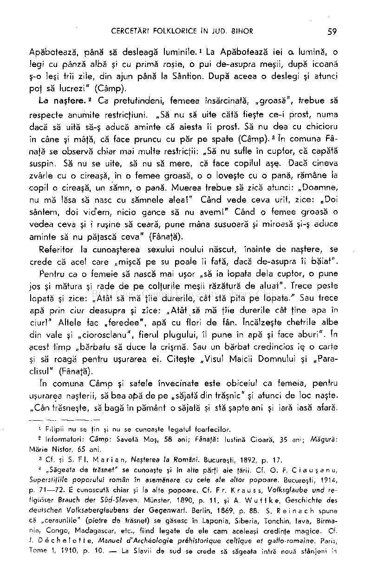

Apăbotează, până să desleagă luminile.

La Apăbofează iei o. lumină, o legi cu pânză albă şi cu primă roşie, o pui de-asupra meşii, după icoană ş-o Ieşi trîi zile, din ajun până la Sântion. După aceea o deslegi şi atunci po| să lucrezi" (Câmp).

1

Ca pretutindeni, femeea însărcinată, „groasă", trebue să respecte anumite restricfiuni. „Să nu să uite cătă fieşte ce-i prost, numa dacă să uită să-ş aducă aminte că aiesta îi prost. Să nu dea cu chicioru în câne şi mâţă, că face pruncu cu păr pe spate (Câmp).

La naştere.

2

în comuna Fanată se observă chiar mai multe restricţii: „Să nu sufle în cuptor, că capătă suspin. Să nu se uite, să nu să mere, că face copilul aşş. Dacă cineva zvârle cu o cireaşă, în o femee groasă, o o loveşte cu o pană, rămâne la copil o cireaşă, un sămn, o pană. Muerea trebue să zică atunci: „Doamne, nu mă lăsa să nasc cu sămnele alea!" Când vede ceva urît, zice: „Doi

3

- sântem, doi vicTem, nicio gance să nu avem!" Când o femee groasă o vedea ceva şi i ruşine să ceară, pune mâna susuoară şi miroasă şi-ş aduce aminte să nu păţască ceva" (Fanată).

Referitor la cunoaşterea sexului noului născut, înainte de naştere, se crede că acel care „mişcă pe su poale îi fată, dacă de-asupra îi băiat".

Pentru ca o femeie să nască mai uşor „să ia lopata delà cuptor, o pune jos şi mătura şi rade de pe colturile meşii răzătură de aluat". Trece peste lopată şi zice: „Atât să mă \'\\e durerile, cât stă pita pe lopata.

' Sau trece apă prin ciur deasupra şi zîce: „Atât să mă fîie durerile cât ţîne apa în ciur!" Altele fac „feredee", apă cu flori de fân. încălzeşte chetrile albe din vale şi „ciorosclanu", fierul plugului, îl pune în apă şi face aburi". în acest timp „bărbatu să duce la crişmă. Sau un bărbat credincios iş o carte şi să roagă pentru uşurarea ei. Citeşte „Visul Maicii Domnului şi „Paraclisul" (Fanată).

7

în comuna Câmp şi satele învecinate este obiceiul ca femeia, pentru uşurarea naşterii, să bea apă de pe „săjată din trăşnic" şi atunci de loc naşte. „Cân trăsneşte, să bagă în pământ o săjată şi stă şapte ani şi iară iasă afară.

- 1 Filipii nu se \'m şi nu se cunoaşte legatul foarfecilor.
- 2 Informatori: Câmp : Savetâ Moş, 58 ani; Fâna/ă: Iustină Cioară, 35 ani; Măgură :

Mărie Nistor, 65 ani.

Cf. şi S. F I. M a r i a n, Naşterea la Români. Bucureşti, 1892, p. 17.

3

„Săgeata de trăsnet" se cunoaşte şi in alte părţi ale (arii. Cf. G. F. C i a u ş a n u, Superstiţiile poporulu i român în asemănare cu cele ale altor popoare. Bucureşti, 1914, p. 71—72 . E cunoscută chiar şi la alte popoare . Cf. Fr . K r a u s s, Volksglaube un d religiöser Brauch der Süd-Slaven. Münster, 1890, p. 11 , şi A. W u 11 k e, Geschichte des deutschen Volksaberglaubens der Gegenwarf. Berlin, 1869, p. 88. S. R e i n a c h spune că „cerauniile " (pietre de trăsnet) se găsesc în Laponia, Siberia, Tonchin, lava, Birmania, Congo , Madagascar, etc., fiind legate de ele ca m aceleaşi credinfe magice . Cf. J. D é c h e I e t f e, Manuel d'Archéologie préhistorique celtique et gallo-romaine. Paris, Tome I, 1910, p. 10. — La Slavii de sud se crede să săgeata intră nouă stânjeni în

4

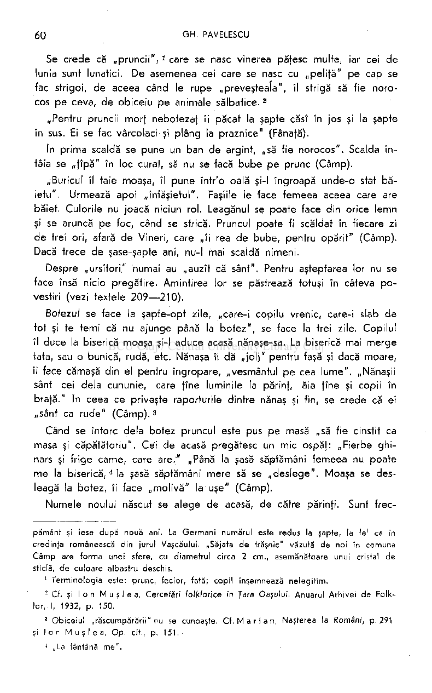

care se nasc vinerea păfesc multe, iar cei de lunia sunt lunatici. De asemenea cei care se nasc cu „peliţă" pe cap se fac strigoi, de aceea când le rupe „preveşteala", îl strigă să fie norocos pe ceva, de obiceiu pe animale sălbatice.

Se crede că „pruncii",

1

8

„Pentru pruncii mort, nebotezaf îi păcat la şapte căsî în jos şi la şapte în sus. Ei se fac vârcolaci şi plâng la praznice" (Fânajă).

în prima scaldă se pune un ban de argint, „să fie norocos". Scalda în­

- tâia se „fîpă" în loc curat, să nu se facă bube pe prunc (Câmp). „Buricul îl taie moaşa, îl pune într'o oală şi-l îngroapă unde-o stat bă-

ietu". Urmează apoi „înfăşietul". Fâşiile le face femeea aceea care are băiet. Culorile nu joacă niciun rol. Leagănul se poate face din orice lemn şi se aruncă pe foc, când se strică. Pruncul poate fi scăldat în fiecare zi de trei ori, afară de Vineri, care „îi rea de bube, pentru opărit" (Câmp). Dacă trece de şase-şapte ani, nu-l mai scaldă nimeni.

Despre „ursîtori," numai au „auzît că sânt". Pentru aşteptarea lor nu se face însă nicio pregătire. Amintirea lor se păstrează totuşi în câteva povestiri (vezi textele 209—210).

ßofezu/ se face la şapfe-opt zile, „care-i copilu vrenic, care-i slab de tot şi te temi că nu ajunge până la botez", se face la trei zile. Copilul îl duce la biserică moaşa şi-l aduce acasă nănaşe-sa. La biserică mai merge tata, sau o bunică, rudă, etc. Nănaşa îi dă „jolj" pentru faşă şi dacă moare, îi face cămaşă din el pentru îngropare, „veşmântul pe cea lume". „Nănaşii

- sânt cei dela cununie, care ţîne luminile la părinf, ăia ţîne şi copii în brajă." în ceea ce priveşte raporturile dintre nănaş şi fin, se crede că ei

„sânt ca rude" (Câmp).

3

Când se întorc dela botez pruncul este pus pe masă „să fie cinstit ca masa şi căpătătoriu". Cei de acasă pregătesc un mic ospăf: „Fierbe ghinars şi frige carne, care are/' „Până la şasă săptămâni femeea nu poate me la biserică, la şasă săptămâni mere să se „deslege". Moaşa se desleagă la botez, îi face „molivă" la uşe" (Câmp).

Numele noului născut se alege de acasă, de către părinţi. Sunt frec-

pământ şi iese după nouă ani. La German i numărul este redus la şapte, la fel ca în credinfa românească din jurul Vaşcăului. „Săjata de frăşnic" văzută de noi în comuna Câm p are forma unei sfere, cu diametrul circa 2 cm., asemănătoare unui cristal de sticlă, de culoare albastru deschis.

Terminologia este: prunc, fecior, fată; copil însemnează nelegitim .

1

Cf. şi Io n M u ş I e a, Cercetări folklorice în Jara Oaşului. Anuarul Arhivei de Folklor, I, 1932, p. 150.

2

Obiceiul „răscumpărării" nu se cunoaşte. Cf. M a r i a n, Naşterea la Romani, p. 291 şi Io n M u ş I e a, Op cit., p. 151.

3

„La fântână me" .

4

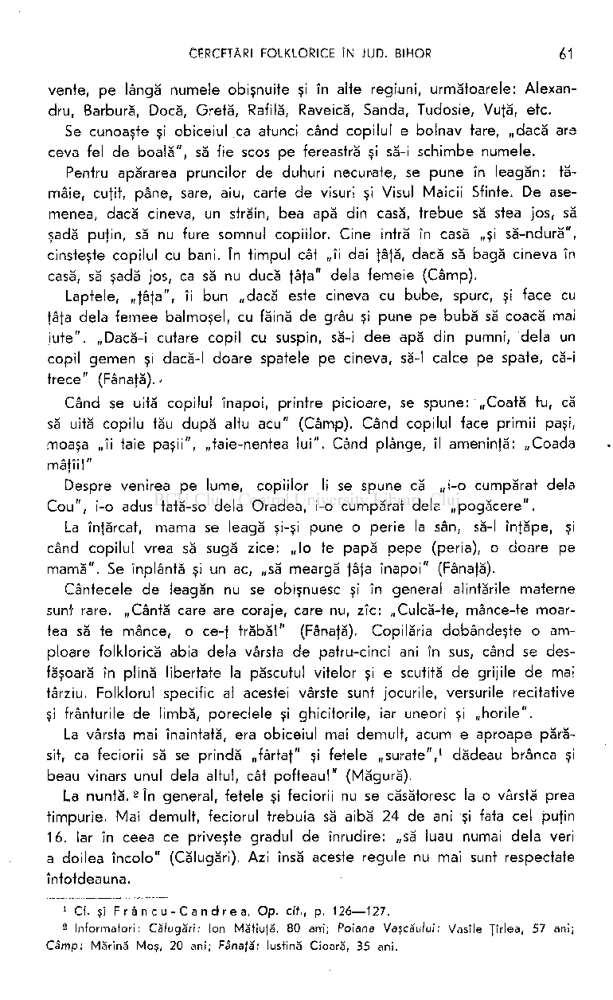

vente, pe lângă numele obişnuite şi în alte regiuni, următoarele: Alexandru, Barbură, Docă, Gretă, Rafilă, Raveică, Sanda, Tudosie, Vuţă, etc.

Se cunoaşte şi obiceiul ca atunci când copilul e bolnav tare, „dacă are ceva fel de boală", să fie scos pe fereastră şi să-i schimbe numele.

Pentru apărarea pruncilor de duhuri necurate, se pune în leagăn: tămâie, cuţit, pâne, sare, aiu, carte de visuri şi Visul Maicii Sfinte. De asemenea, dacă cineva, un străin, bea apă din casă, trebue să stea jos, să şadă puţin, să nu fure somnul copiilor. Cine intră în casă „şi să-ndură", cinsteşte copilul cu bani. în timpul cât „îi dai ţâţă, dacă să bagă cineva în casă, să şadă jos, ca să nu ducă ţâţa" delà femeie (Câmp).

Laptele, „ţâţa", îi bun „dacă este cineva cu bube, spurc, şi face cu ţâţa delà femee balmoşel, cu făină de grâu şi pune pe bubă să coacă mai iute". „Dacă-i cutare copil cu suspin, să-i dee apă din pumni, delà un copil gemen şi dacă-l doare spatele pe cineva, să-l calce pe spate, că-i trece" (Fânaţă).'

Când se uită copilul înapoi, printre picioare, se spune: „Coată tu, că să uită copilu tău după altu acu" (Câmp). Când copilul face primii paşi, moaşa „îi taie paşii", „taie-nentea lui". Când plânge, îl ameninţă: „Coada mâţîi!"

Despre venirea pe lume, copiilor li se spune că „i-o cumpărat delà Cou", i-o adus tată-so delà Oradea, i-o cumpărat delà „pogăcere".

La înţărcat, mama se leagă şi-şi pune o perie la sân, să-l înţăpe, şi când copilul vrea să sugă zice: „Io te papă pepe (peria), o doare pe mamă". Se înplântă şi un ac, „să meargă ţâţa înapoi" (Fânaţă).

Cântecele de leagăn nu se obişnuesc şi în general alintările materne sunt rare. „Cântă care are coraje, care nu, zîc: „Culcă-te, mânce-te moartea să te mance, o ce-ţ trăbă!" (Fânaţă). Copilăria dobândeşte o amploare folklorică abia delà vârsta de patru-cinci ani în sus, când se desfăşoară în plină libertate la păscutul vitelor şi e scutită de grijile de mai

- târziu. Folklorul specific al acestei vârste sunt jocurile, versurile recitative şi frânturile de limbă, poreclele şi ghicitorile, iar uneori şi „horile".

La vârsta mai înaintată, era obiceiul mai demult, acum e aproape părăsit, ca feciorii să se prindă „fârtaţ" şi fetele „surate",

dădeau brânca şi beau vinars unul delà altul, cât pofteau!" (Măgură).

1

în general, fetele şi feciorii nu se căsătoresc la o vârstă prea timpurie. Mai demult, feciorul trebuia să aibă 24 de ani şi fata cel puţin 16. Iar în ceea ce priveşte gradul de înrudire: „să luau numai delà veri a doilea încolo" (Călugări). Azi însă aceste régule nu mai sunt respectate întotdeauna.

La nuntă.

2

Cf. şi Frâncu-Candrea , Op. cif., p. 126—127.

1

Informatori: Călugări: Ion Mătiuţă, 80 ani; Poiana Vaşcăului: Vasîle Ţîrlea, 57 ani; Câmp : Marină Moş, 20 ani; Fânafă; Iustină Cioară, 35 ani.

2

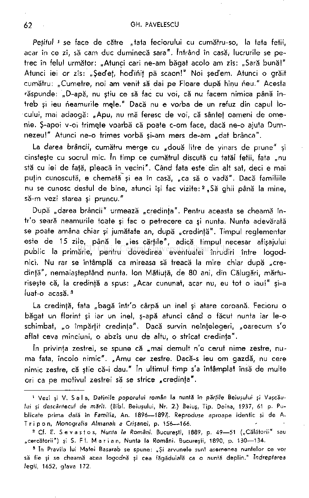

se face de către „tata feciorului cu cumătru-so, la tata fetii, acar în ce zî, să cam duc duminecă sara". Intrând în casă, lucrurile se petrec în felul următor: „Atunci cari ne-am băgat acolo am zîs: „Sară bună!" Atunci iei or zîs: „Şecfef, hocTinit pă scaon!" Noi şed'em. Atunci o grăit cumătru: „Cumetre, noi am venit să dai pe Floare după hinu neu." Acesta

Pefttul

1

- răspunde: „D-apă, nu ştiu ce să fac cu voi, că nu facem nimica până întreb şi ieu neamurile meje." Dacă nu e vorba de un refuz din capul locului, mai adaogă: „Apu, nu mă feresc de voi, că sânteţ oameni de omenie. Ş-apoi v-oi trimete voarbă că poate c-om face, dacă ne-o ajuta Dumnezeu!" Atunci ne-o trimes vorbă şi-am mers de-am „dat brânca".

La darea brâncii, cumătru merge cu „două litre de yinars de prune" şi cinsteşte cu socrul mic. în timp ce cumătrul discută cu tatăl fetii, fata „nu stă cu iei de faţă, pleacă în vecini". Când fata este din alt sat, deci e mai puţin cunoscută, e chemată şi ea în casă, „ca să o vadă". Dacă familiile nu se cunosc destul de bine, atunci îşi fac vizite:

2

„Să ghii până la mine,

- să-m vezi starea şi pruncu."

După „darea brâncii" urmează „credinţa". Pentru aceasta se cheamă într'o seară neamurile toate şi fac o petrecere ca şi nunta. Nunta adevărată se poate amâna chiar şi jumătate an, după „credinţă". Timpul reglementar este de 15 zile, până le „ies cărţile", adică timpul necesar afişajului public la primărie, pentru dovedirea eventualei înrudiri între logodnici. Nu rar se întâmplă ca mireasa să treacă la mire chiar după „credinţă", nemaiaşteptând nunta. Ion Mătiuţă, de 80 ani, din Călugări, mărturiseşte că, la credinţă a spus: „Acar cununat, acar nu, eu tot o iau!" şi-a luat-o acasă.

3

La credinţă, fata „bagă într'o cârpă un inel şi atare coroană. Fecioru o

- băgat un florint şi iar un inel, ş-apă atunci când o făcut nunta iar le-o schimbat, „o împărţit credinţa". Dacă survin neînţelegeri, „oarecum s'o aflat ceva minciuni, o abzîs unu de altu, o strîcat credinţa".

în privinţa zestrei, se spune că „mai demult n'o cerut nime zestre, numa fata, încolo nimic". „Amu cer zestre. Dacă-s ieu om gazdă, nu cere nimic zestre, că ştie că-i dau." în ultimul timp s'a întâmplat însă de multe ori ca pe motivul zestrei să se strice „credinţa".

Vezi şi V. Sala , Datinile poporului român la nuntă în părţile Beiuşului şi Vaşcăului şi descântecul de mărit. (Bibi. Beiuşului, Nr. 2.) Beiuş, Tip. Doina, 1937, 61 p. Publicate prima dată în Familia, An. 1896—1897J. Reproduse aproape identic şi d e A. T r i p o n, Monografia Almanah a Crişanei, p. 156—166.

1

Cf. E. Sevastos , Nunta la Români. Bucureşti, 1889, p. 49—5 1 („Călătorii " sau „cercătorii") şi S. FI . Marian , Nunta la Români. Bucureşti, 1890, p. 130—134.

2

Tn Pravila lui Matei Basarab se spune: „Şi arvunele sunt asemenea nuntelor ce vor să fie şi se cheamă acea logodnă şi cea făgăduială ca o nuntă deplin. " Îndreptarea legii, 1652, glava 172.

3

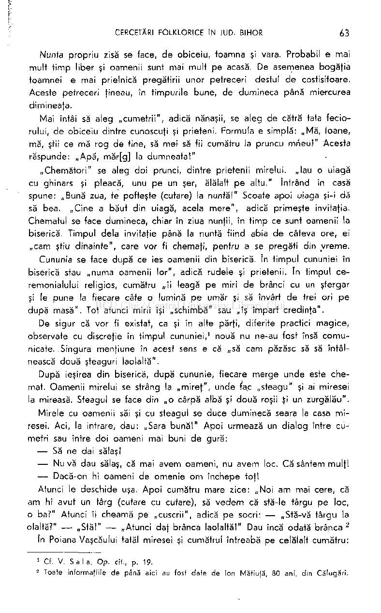

Nunta propriu zisă se face, de obiceiu, toamna şi vara. Probabil e mai mult timp liber şi oamenii sunt mai mult pe acasă. De asemenea bogăţia toamnei e mai prielnică pregătirii unor petreceri destul de costisitoare. Aceste petreceri fineau, în timpurile bune, de dumineca până miercurea dimineafa.

Mai întâi să aleg „cumetrii", adică nănaşii, se aleg de cătră tata feciorului, de obiceiu dintre cunoscuţi şi prieteni. Formula e simplă: „Mă, Ioane, mă, ştii ce mă rog de tine, să mei să fii cumătru la pruncu mneu!" Acesta

- răspunde: „Apă, măr[g] la dumneata!" „Chemători" se aleg doi prunci, dintre prietenii mirelui. „Iau o uiagă

cu ghinars şi pleacă, unu pe un şer, ălălalt pe altu," Intrând în casă spune: „Bună zua, te pofteşte (cutare) la nuntă!" Scoate apoi uiaga şi-i dă

- să bea. „Cine a băut din uiagă, acela mere", adică primeşte invitaţia. Chematul se face dumineca, chiar în ziua nunţii, în timp ce sunt oamenii la biserică. Timpul dela invitaţie până la nuntă fiind abia de câteva ore, ei „cam ştiu dinainte", care vor fi chemaţi, pentru a se pregăti din vreme.

Cununia se face după ce ies oamenii din biserică. în timpul cununiei în biserică stau „numa oamenii lor", adică rudele şi prietenii. în timpul ceremonialului religios, cumătru „îi leagă pe miri de brânci cu un ştergar şi fe pune la fiecare câte o lumină pe umăr şi să învârt de trei ori pe după masă". Tot atunci mirii îşi „schimbă" sau „îş împart credinţa".

De sigur că vor fi existat, ca şi în alte părţi, diferite practici magice, observate cu discreţie în timpul cununiei,

nouă nu ne-au fost însă comunicate. Singura menţiune în acest sens e că „să cam păzăsc să să întâlnească două steaguri laolaltă".

1

După ieşirea din biserică, după cununie, fiecare merge unde este chemat. Oamenii mirelui se strâng la „mireţ", unde fac „steagu" şi ai miresei la mireasă. Steagul se face din „o cârpă albă şi două roşii şi un zurgălău".

Mirele cu oamenii săi şi cu steagul se duce duminecă seara la casa miresei. Aci, la intrare, dau: „Sara bună!" Apoi urmează un dialog între cumetri sau între doi oameni mai buni de gură:

— Să ne dai sălaş!

— Nu vă dau sălaş, că mai avem oameni, nu avem loc. Că sântem mulţ!

— Dacă-on hi oameni de omenie om închepe toţ! Atunci le deschide uşa. Apoi cumătru mare zice: „Noi am mai cere, că

am hi avut un târg (cutare cu cutare), să vedem că stă-le târgu pe loc,

- o ba?" Atunci îi cheamă pe „cuscrii", adică pe socri: — „Stă-vă târgu la
- olaltă?" — „Stă!" — „Atunci daţ brânca laolaltă!" Dau încă odată brânca

2

în Poiana Vaşcăului tatăl miresei şi cumătrul întreabă pe celălalt cumătru:

- 1 Cf. V. S a I a, Op . cif., p. 19.
- 2 Toafe informaţiile de până aici au fosf dafe de Ion Măfiufă, 80 ani, din Călugări.

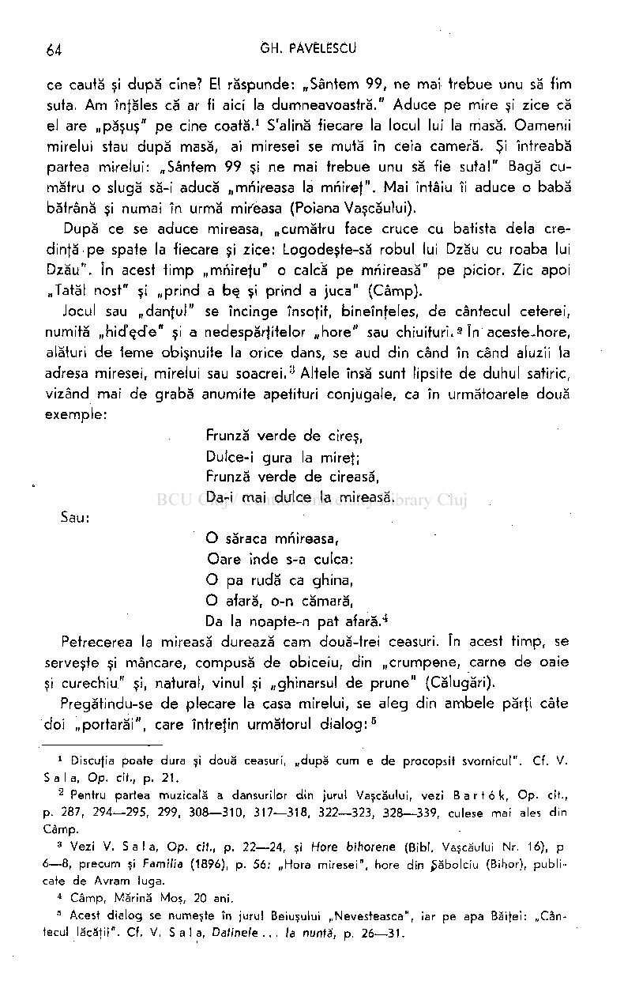

ce caută şi după cine? El răspunde: „Sântem 99, ne mai trebue unu să fim suta. Am înfăles că ar fi aici la dumneavoastră." Aduce pe mire şi zice că el are „păşuş" pe cine coată.

S'alină fiecare la locul lui la masă. Oamenii mirelui stau după masă, ai miresei se mută în ceia cameră. Şi întreabă partea mirelui: „Sântem 99 şi ne mai trebue unu să fie suta!" Bagă cumătru o slugă să-i aducă „mnireasa la mriireţ". Mai întâiu îi aduce o babă

1

- bătrână şi numai în urmă mireasa (Poiana Vaşcăului). După ce se aduce mireasa, „cumătru face cruce cu batista delà cre-

dinţă pe spate la fiecare şi zice: Logodeşte-să robul lui Dzău cu roaba lui Dzău". în acest timp „mnireţu" o calcă pe mnireasa" pe picior. Zic apoi „Tatăl nost" şi „prind a be. şi prind a juca" (Câmp).

Jocul sau „danful" se încinge însoţit, bineînfeles, de cântecul ceterei, numită „hid'şde" şi a nedespărţitelor „hore" sau chiuituri.

în aceste.hore, alături de teme obişnuite la orice dans, se aud din când în când aluzii la adresa miresei, mirelui sau soacrei.

a

Altele însă sunt lipsite de duhul satiric, vizând mai de grabă anumite apetituri conjugale, ca în următoarele două exemple:

3

Frunză verde de cireş, Dulce-i gura la miret; Frunză verde de cireaşă, Da-i mai dulce la mireasă.

Sau:

O săraca mnireasa, Oare inde s-a culca: O pa rudă ca ghina, O afară, o-n cămară, Da la noapte-n pat afară.

4

Petrecerea la mireasă durează cam două-trei ceasuri. în acest timp, se serveşte şi mâncare, compusă de obiceiu, din „crumpene, carne de oaie şi curechiu" şi, natural, vinul şi „ghinarsul de prune" (Călugări).

Pregătindu-se de plecare la casa mirelui, se aleg din ambele părţi câte doi „portarăi", care întreţin următorul dialog:

5

Discuţia poate dura şi două ceasuri, „dup ă cum e de procopsit svornicul". Cf. V. Sala , Op . cit., p. 21 .

1

Pentru partea muzicală a dansurilor din jurul Vaşcăului, vezi Bartok , Op . cit.,

2

- p. 287, 294—295 , 299, 308—310 , 317—318 , 322—323 , 328—339 , culese mai ales din

Câmp .

Vezi V. Sala , Op . c/f., p. 22—24 , şi Hore b/fiorene (Bibi. Vaşcăului Nr. 16), p 6—8 , precum şi Familia (1896), p. 56 : „Hor a miresei", hore din £ăbolciu (Bihor), publi cate de Avram luga.

3

- 4 Câmp , Marină Moş, 20 ani.
- 5 Acest dialo g se numeşte în jurul Beiuşului „Nevesteasca", iar pe apa Băiţei: „Cân ­

tecul lăcăţii". Cf. V. Sala , Da/ine/e . , . fa nuntă, p. 26—31 .

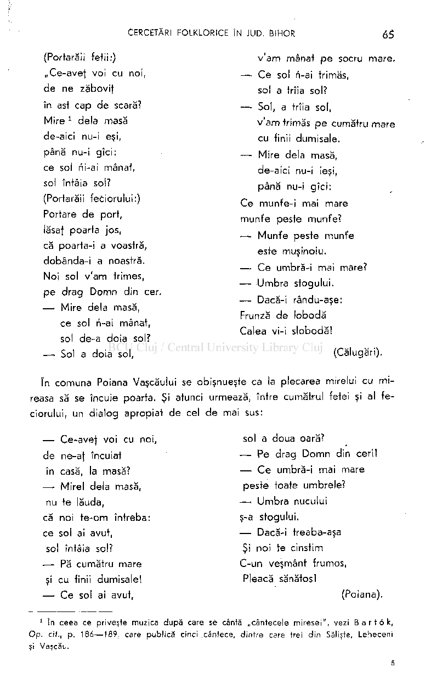

(Portarăii fetii:) „Ce-aveţ voi cu noi, de ne zăbovit în ast cap de scară? Mire delà masă de-aici nu-i eşi, până nu-i gîci: ce sol ni-ai mânat, sol întâia sol? (Portarăii feciorului:) Portare de port, lăsat poarta jos, că poarta-i a voastră, dobânda-i a noastră. Noi sol v'am trimes, pe drag Domn din cer.

v'am mânat pe socru mare.

— Ce sol n-ai trimăs, sol a trîia sol?

— Sol, a trîia sol, v'am trimăs pe cumătru mare cu finii dumisale.

— Mire delà masă, de-aici nu-i ieşi, până nu-i gîci:

Ce munfe-i mai mare munt'e peste munfe?

— Munt'e peste munt'e este muşinoiu.

— Ce umbră-i mai mare?

— Umbra stogului.

— Dacă-i rându-aşe: Frunză de lobodă Calea vi-i slobodă!

— Mire delà masă,

ce sol n-ai mânat, sol de-a doia sol?

(Călugări).

— Sol a doia sol,

în comuna Poiana Vaşcăului se obişnueşte ca la plecarea mirelui cu mireasa să se încuie poarta. Şi atunci urmează, între cumătrul fetei şi al feciorului, un dialog apropiat de cel de mai sus:

sol a doua oară?

— Ce-avef voi cu noi, de ne-af încuiat

— Pe drag Domn din ceri!

— Ce umbră-i mai mare peste toate umbrele?

în casă, la masă?

— Mirel delà masă,

— Umbra nucului ş-a stogului.

nu te lăuda, că noi te-om întreba: ce sol ai avut,

— Dacă-i treaba-aşa Şi noi te cinstim C-un veşmânt frumos, Pleacă sănătos!

sol întâia sol?

— Pă cumătru mare şi cu finii dumisale!

(Poiana).

— Ce sol ai avut,

în ceea ce priveşte muzica după care se cântă „cântecele miresei" , vezi Bartok , Op . cit., p. 186—189, care publică cinci cântece, dintre care trei din Sălişte, Leheceni şi Vaşcău.

1

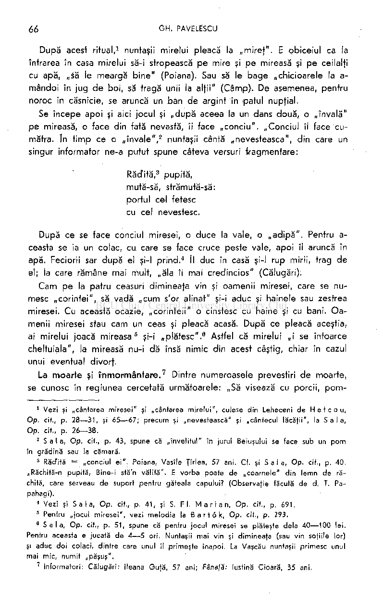

nuntaşii mirelui pleacă la „mireţ". E obiceiul ca la intrarea în casa mirelui să-i stropească pe mire şi pe mireasă şi pe ceilalţi cu apă, „Să le meargă bine" (Poiana). Sau să le bage „chicioarele la amândoi în jug de boi, să tragă unii la alţii" (Câmp). De asemenea, pentru noroc în căsnicie, se aruncă un ban de argint în patul nupţial.

După acest ritual,

1

Se începe apoi şi aici jocul şi „după aceea la un dans două, o „învală" pe mireasă, o face din fată nevastă, îi face „conciu". „Conciul îl face cumătră. In timp ce o „învale",

nuntaşii cântă „nevesteasca", din care un singur informator ne-a putut spune câteva versuri fragmentare:

2

pupită, mută-să, strămută-să: portul cel fetesc cu cel nevestesc.

RăcTită,

3

După ce se face conciul miresei, o duce la vale, o „adipă". Pentru aceasta se ia un colac, cu care se face cruce peste vale, apoi îl aruncă în apă. Feciorii sar după el şi-l prind.

II duc în casă şi-l rup mirii, trag de el; la care rămâne mai mult, „ăla îi mai credincios" (Călugări).

4

Cam pe la patru ceasuri dimineaţa vin şi oamenii miresei, care se numesc „corintei", să vadă „cum s'or alinat" şi-i aduc şi hainele sau zestrea miresei. Cu această ocazie, „corinteii" o cinstesc cu haine şi cu bani. Oamenii miresei stau cam un ceas şi pleacă acasă. După ce pleacă aceştia, ai mirelui joacă mireasa şin „plătesc".

Astfel că mirelui „i se întoarce cheltuiala", la mireasă nu-i dă însă nimic din acest câştig, chiar în cazul unui eventual divorţ.

9

Dintre numeroasele prevestiri de moarte, se cunosc în regiunea cercetată următoarele: „Să visează cu porcii, pom-

La moarte şi înmormântare.

7

Vezi şi „cântarea miresei" şi „cântarea mirelui" , culese din Leheceni de H e t c o u, Op , cit., p. 28—31 , şi 65—67 ; precu m şi „nevesteasca" şi „cântecul lăcăţii", la Sala , Op . cit., p. 26—38 .

1

Sala , Op . cit., p. 43, spune că „învelitul " în jurul Beiuşului se face sub un po m în grădină sau la cămară.

2

Răcfită = „conciul ei" . Poiana, Vasîle Tîrlea, 57 ani. Cf. şi Sala , Op . cit., p. 40. „Răchită-n pupită, Bine-i stă'n vălită". E vorba poate d e „coarnele " din lemn de răchită, care serveau d e suport pentru găteala capului? (Observaţie făcută de d. T. Papahagi).

3

Vezi şi Sala , Op . cit., p. 41 , şi S. FI . Marian , Op , cit., p. 691 .

1

- 5 Pentru „jocul miresei" , vezi melodi a la Bartok , Op . cit., p. 293.
- 6 Sala , Op . cit., p. 51 , spune că pentru jocul miresei se plăteşte delà 40—10 0 lei.

Pentru aceasta e jucată de 4— 5 ori. Nuntaşii mai vin şi dimineaţa (sau vin soţiile lor) şi aduc doi colaci, dintre care unul îl primeşte înapoi. La Vaşcău nuntaşii primesc unul mai mic, numit „păşuş".

Informatori: Călugări : Ileana Gută, 57 ani; Fânafă: Iustină Cioară, 35 ani.

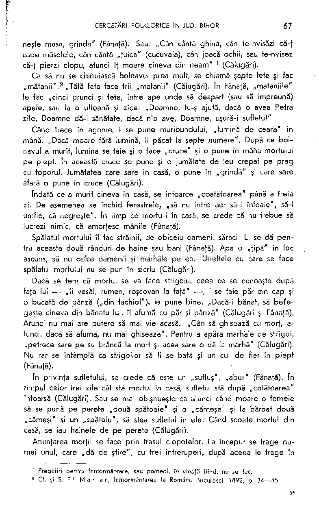

CERCETĂRI FOLKLORICE ÎN JUD. BIHOR

neşfe masa, grinda" (Fânajă). Sau: „Cân cântă ghina, cân te-nvisăzi că-f cade măselele, cân cântă „ţuica" (cucuvaia), cân joacă ochii, sau te-nvisez

- că-J pierzi clopu, atunci îf moare cineva din neam" (Călugări). Ca să nu se chinuiască bolnavul prea mult, se chiamă şapte fete şi fac

„Tătă fata face trîi „mătănii" (Călugări). în Fanată, „mataniile" le fac „cinci prunci şi fete, între ape unde să despart (sau să împreună) apele, sau la o ultoană şi zîce: „Doamne, tu-ş ajută, dacă o avea Petra zîle, Doamne dă-i sănătate, dacă n'o avş, Doamne, uşură-i sufletul"

„mătănii".

2

Când trece în agonie, i se pune muribundului, „lumină de ceară" în mână. „Dacă moare fără lumină, îi păcat la şepte numere". După ce bolnavul a murit, lumina se taie şi o face „cruce" şi o pune în mâna mortului pe piept. în această cruce se pune şi o jumătate de leu crepat pe prag cu toporul. Jumătatea care sare în casă, o pune în „grindă" şi care sare. afară o pune în cruce (Călugări).

îndată ce-a murit cineva în casă, se întoarce „coatăfoarea" până a treia zi. De asemenea se închid ferestrele, „să nu între aer să-l înfoaie", să-l umfle, că negreşte". In timp ce mortu-i în casă, se crede că nu trebue să lucrezi nimic, că amorfesc manile (Fânaţă).

Spălatul mortului îl fac străinii, de obiceiu oamenii săraci. Li se dă pentru aceasta două rânduri de haine sau bani (Fânajă). Apa o ,,ţîpă

' în loc ascuns, să nu calce oamenii şi marhăle pe ea. Uneltele cu care se face spălatul mortului nu se pun în sicriu (Călugări).

J

Dacă se tem că mortul se va face strigoiu, ceea ce se cunoaşte după fafa lui — „îi vesăl, rumen, roşcovan la fată" — , i se taie păr din cap şi

- o bucată de pânză („din fachiol"), le pune bine. „Dacă-i bănat, să befegeşte cineva din bănatu lui, îl afumă cu păr şi pânză" (Călugări şi Fanată). Atunci nu mai are putere să mai vie acasă. „Cân să ghisează cu morj, atunci, dacă să afumă, nu mai ghisează". Pentru a apăra marhăle de strîgoi, „petrece sare pe su brâncă la mort şi acea sare o dă la marhă" (Călugări). Nu rar se întâmplă ca strigoilor să li se bată şi un cui de fier în piept (Fanată).

în privinţa sufletului, se crede că este un „sufluş", „abur" (Fanată). în timpul celor trei zile cât stă mortul în casă, sufletul stă după „cotătoarea" întoarsă (Călugări). Sau se mai obişnueşte ca atunci când moare o femeie să se pună pe perete „două spătoaie" şi o „cămeşe" şi la bărbat două „cămeşi" şi un „spătoiu", să stea sufletul în ele. Când scoate mortul din casă, se iau hainele de pe perete (Călugări).

Anunţarea morţii se face prin trasul clopotelor. La început se trage numai unul, care „dă de ştire", cu trei întreruperi, după aceea le trage în

Pregătiri pentru înmormântare, sau pomeni , în vieafă fiind, nu se fac.

1

Cf. şi S. FI . Marian , înmormântarea la Români. Bucuresci, 1892, p. 34—35 .

2

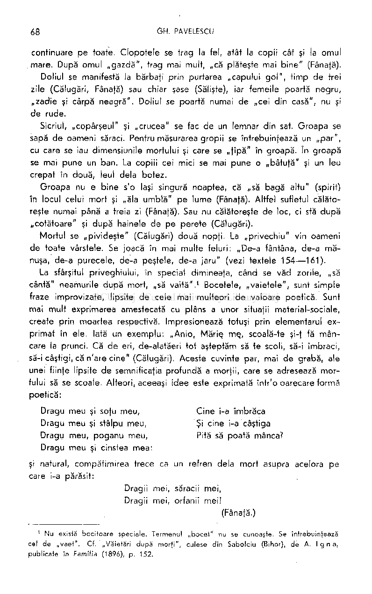

continuare pe toate. Clopotele se trag la fel, atât la copii cât şi la omul mare. După omul „gazdă", trag mai mult, „că plăteşte mai bine" (Fânafă).

Doliul se manifestă la bărbaţi prin purtarea „capului gol", timp de trei zile (Călugări, Fânaţă) sau chiar şase (Sălişte), iar femeile poartă negru, „zadie şi cârpă neagră". Doliul se poartă numai de „cei din casă", nu şi de rude.

Sicriul, „copârşeul" şi „crucea" se fac de un lemnar din sat. Groapa se sapă de oameni săraci. Pentru măsurarea gropii se întrebuinţează un „par", cu care se iau dimensiunile mortului şi care se „ţîpă" în groapă. în groapă se mai pune un ban. La copiii cei mici se mai pune o „bâtuţă" şi un leu crepat în două, leul delà botez.

Groapa nu e bine s'o laşi singură noaptea, că „să bagă altu" (spirit) în locul celui mort şi „ăla umblă" pe lume (Fânaţă). Altfel sufletul călătoreşte numai până a treia zi (Fânafă). Sau nu călătoreşte de loc, ci stă după „cotătoare" şi după hainele de pe perete (Călugări).

Mortul se „pivideşte" (Călugări) două nopţi. La „privechiu" vin oameni de toate vârstele. Se joacă în mai multe feluri: „De-a fântâna, de-a mănuşa, de-a purecele, de-a peştele, de-a jaru" (vezi textele 154—161).

La sfârşitul priveghiului, în special dimineaţa, când se văd zorile, „să cântă" neamurile după mort, „să vaită".

Bocetele, „vaietele", sunt simple fraze improvizate, lipsite de cele mai multeori de valoare poetică. Sunt mai mult exprimarea amestecată cu plâns a unor situaţii material-sociale, create prin moartea respectivă. Impresionează totuşi prin elementarul exprimat în ele. lată un exemplu: „Anio, Măriş mş, scoală-te şi-ţ fă mâncare la prunci. Că de eri, de-alatăeri tot aşteptăm să te scoli, să-i îmbraci, să-i câştigi, că n'are cine" (Călugări). Aceste cuvinte par, mai de grabă, ale unei fiinţe lipsite de semnificaţia profundă a morţii, care se adresează mortului să se scoale. Alteori, aceeaşi idee este exprimată într'o oarecare formă

1

poetică:

Dragu meu şi soţu meu, Dragu meu şi stâlpu meu, Dragu meu, poganu meu,

Cine i-a îmbrăca Şi cine i-a câştiga Pită să poată mânca?

Dragu meu şi cinstea mea:

şi natural, compătimirea frece ca un refren delà mort asupra acelora pe care i-a părăsit:

Dragii mei, săracii mei, Dragii mei, orfanii mei!

(Fânaţă.)

Nu există bocitoare speciale. Termenul „bocet " nu se cunoaşte. Se întrebuinţează cel de „vaet" . Cf. „Văietări după morţi" , culese din Sabolciu (Bihor), de A. I g n a, publicate în Familia (1896), p. 152.

1

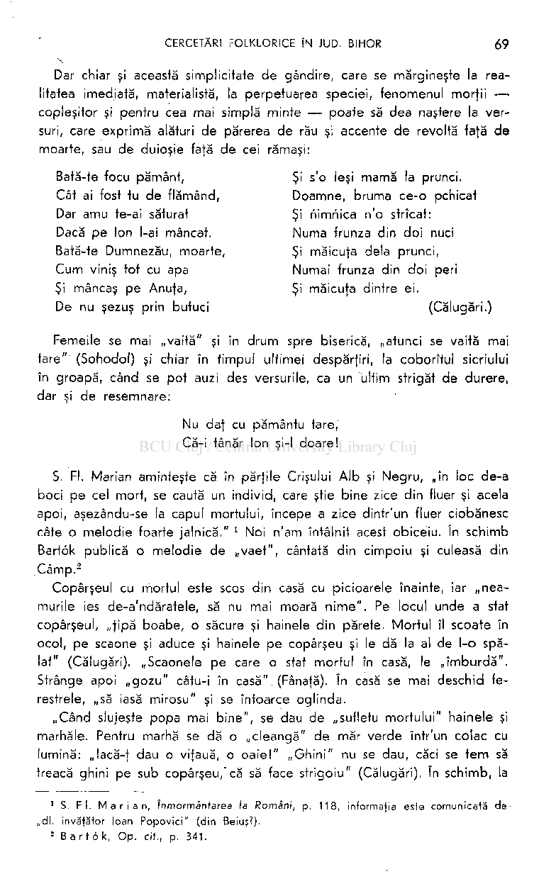

Dar chiar şi această simplicitate de gândire, care se mărgineşte la realitatea imediată, materialistă, la perpetuarea speciei, fenomenul morţii copleşitor şi pentru cea mai simplă minte — poate să dea naştere la versuri, care exprimă alături de părerea de rău şi accente de revoltă faţă de moarte, sau de duioşie faţă de cei rămaşi:

Bată-fe focu pământ, Cât ai fost tu de flămând, Dar amu te-ai săturat Dacă pe Ion l-ai mâncat. Bată-te Dumnezău, moarte, Cum viniş tot cu apa Şi mâncaş pe Anuţa, De nu şezuş prin butuci

Şi s'o Ieşi mamă la prunci. Doamne, bruma ce-o pchicat Şi nimnica n'o stricat: Numa frunza din doi nuci Şi măicuţa dela prunci, Numai frunza din doi peri Şi măicuţa dintre ei.

(Călugări.)

Femeile se mai „vaită" şi în drum spre biserică, „atunci se vaită mai tare" (Sohodol) şi chiar în timpul ultimei despărţiri, la coborîtul sicriului în groapă, când se pot auzi des versurile, ca un ultim strigăt de durere, dar şi de resemnare:

Nu daţ cu pământu tare, Că-i tânăr Ion şi-l doare!

S. FI. Marian aminteşte că în părţile Crişului Alb şi Negru, „în loc de-a boci pe cel mort, se caută un individ, care ştie bine zice din fluer şi acela apoi, aşezându-se la capul mortului, începe a zice dintr'un fluer ciobănesc câte o melodie foarte jalnică." Noi n'am întâlnit acest obiceiu. în schimb Bartok publică o melodie de „vaet", cântată din cimpoiu şi culeasă din Câmp.

2

Copârşeul cu mortul este scos din casă cu picioarele înainte, iar „neamurile ies de-a'ndăratele, să nu mai moară nime". Pe locul unde a sfat copârşeul, „ţîpă boabe, o săcure şi hainele din părete. Mortul îl scoate în ocol, pe scaone şi aduce şi hainele pe copârşeu şi le dă la al de l-o spălat" (Călugări). „Scaonele pe care o stat mortul în casă, le „îmburdă". Strânge apoi „gozu" câtu-i în casă" (Fânaţă). în casă se mai deschid ferestrele, „să iasă mirosu" şi se întoarce oglinda.

„Când slujeşte popa mai bine", se dau de „sufletu mortului" hainele şi marhăle. Pentru marhă se dă o „cleangă" de măr verde într'un colac cu lumină: „lacă-ţ dau o viţauă, o oaie!" „Ghini" nu se dau, căci se tem să treacă ghini pe sub copârşeu, că să face strigoiu" (Călugări). în schimb, la

S. FI . Marian , înmormântarea la Români, p. 118, informaţia este comunicată da „dl . invăţător loan Popovici" (din Beiuş?).

1

= Bartok , Op . cit., p. 341 .

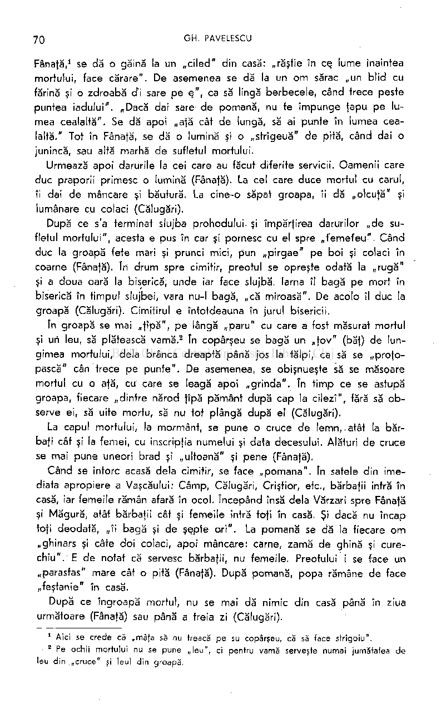

### Fanată,

se dă o găină la un „ciled" din casă: „răştie în cş lume înaintea mortului, face cărare". De asemenea se dă la un om sărac „un blid cu fărină şi o zdroabă cTi sare pe q", ca să lingă berbecele, când frece peste puntea iadului". „Dacă dai sare de pomană, nu te împunge fapu pe lumea cealaltă". Se dă apoi „afă cât de lungă, să ai punte în lumea cealaltă." Tot în Fânafă, se dă o lumină şi o „strîgeuă" de pită, când dai o junincă, sau altă marhă de sufletul mortului.

1

Urmează apoi darurile la cei care au făcut diferite servicii. Oamenii care duc praporii primesc o lumină (Fânafă). La cel care duce mortul cu carul, îi dai de mâncare şi băutură. La cine-o săpat groapa, îi dă „olcufă" şi lumânare cu colaci (Călugări).

După ce s'a terminat slujba prohodului, şi împărfirea darurilor „de sufletul mortului", acesta e pus în car şi pornesc cu el spre „femefeu". Când duc la groapă fete mari şi prunci mici, pun „pirgae" pe boi şi colaci în coarne (Fânafă). în drum spre cimitir, preotul se opreşte odată la „rugă" şi a doua oară la biserică, unde iar face slujbă. Iarna îl bagă pe mort în biserică în timpul slujbei, vara nu-l bagă, „că miroasă". De acolo îl duc la groapă (Călugări). Cimitirul e întotdeauna în jurul bisericii.

în groapă se mai „fîpă", pe lângă „păru" cu care a fost măsurat mortul şi uii leu, să plătească vamă.

în copârşeu se bagă un „fov" (băf) de lungimea mortului, delà brânca dreaptă până jos la tălpi, ca să se „profopască" cân trece pe punte". De asemenea, se obişnueşte să se măsoare mortul cu o afă, cu care se leagă apoi „grinda". în timp ce se astupă groapa, fiecare „dintre nărod fîpă pământ după cap la cilezî", fără să observe ei, să uite mortu, să nu tot plângă după el (Călugări).

2

La capul mortului, la mormânt, se pune o cruce de lemn,.atât la bărbafi cât şi la femei, cu inscripfia numelui şi data decesului. Alături de cruce se mai pune uneori brad şi „ultoană" şi pene (Fânafă).

Când se întorc acasă delà cimitir, se face „pomana". în satele din imediata apropiere a Vaşcăului: Câmp, Călugări, Criştior, etc., bărbafii intră în casă, iar femeile rămân afară în ocol. începând însă delà Vărzari spre Fânafă şi Măgură, atât bărbafii cât şi femeile intră tofi în casă. Şi dacă nu încap tofi deodată, „îi bagă şi de şepte ori". La pomană se dă la fiecare om „ghinars şi câte doi colaci, apoi mâncare: carne, zamă de ghină şi curechiu". E de notat că servesc bărbafii, nu femeile. Preotului i se face un „parastas" mare cât o pită (Fânafă). După pomană, popa rămâne de face „feşfanie" în casă.

După ce îngroapă mortul, nu se mai dă nimic din casă până în ziua următoare (Fânafă) sau până a treia zi (Călugări).

Aici se crede că „mâţa să nu freacă pe su copârşeu, că să face strîgoiu".

1

Pe ochii mortului nu se pune „leu" , ci pentru vamă serveşte numai jumătatea de leu din „cruce " şi leul din groapă.

2

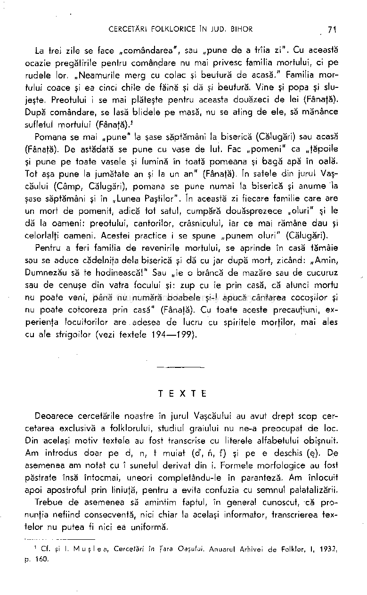

La trei zile se face „comandarea", sau „pune de a trîia zi". Cu această ocazie pregătirile pentru comandare nu mai privesc familia mortului, ci pe rudele lor. „Neamurile merg cu colac şi beutură de acasă." Familia mortului coace şi ea cinci chile de făină şi dă şi beutură. Vine şi popa şi slujeşte. Preotului i se mai plăteşte pentru aceasta douăzeci de lei (Fânafă). După comandare, se lasă blidele pe masă, nu se ating de ele, să mănânce sufletul mortului (Fânafă).

1

Pomana se mai „pune" la şase săptămâni la biserică (Călugări) sau acasă (Fânaţă). De astădată se pune cu vase de lut. Fac „pomeni" ca „ţăpoile şi pune pe toate vasele şi lumină în toată pomeana şi bagă apă în oală. Tot aşa pune la jumătate an şi la un an" (Fânaţă). în satele din jurul Vaş­

- căului (Câmp, Călugări), pomana se pune numai la biserică şi anume la şase săptămâni şi în „Lunea Paştilor". în această zi fiecare familie care are un mort de pomenit, adică tot satul, cumpără douăsprezece „oluri" şi le
- dă la oameni: preotului, cantorilor, crâsnicului, iar ce mai rămâne dau şi celorlalţi oameni. Acestei practice i se spune „punem oluri" (Călugări).

Pentru a feri familia de revenirile mortului, se aprinde în casă tămâie sau se aduce cădelniţa delà biserică şi dă cu jar după mort, zicând: „Amin, Dumnezău să te hodinească!" Sau „ie o brâncă de mazăre sau de cucuruz sau de cenuşe din vatra focului şi: zup cu ie prin casă, că atunci mortu nu poate veni, până nu numără boabele şi-l apucă cântarea cocoşilor şi nu poate cotcoreza prin casă" (Fânaţă). Cu toate aceste precauţiuni, experienţa locuitorilor are adesea de lucru cu spiritele morţilor, mai ales cu ale strigoilor (vezi textele 194—199).

TEXT

Deoarece cercetările noastre în jurul Vaşcăului au avut drept scop cercetarea exclusivă a folklorului, studiul graiului nu ne-a preocupat de loc. Din acelaşi motiv textele au fost transcrise cu literele alfabetului obişnuit. Am introdus doar pe d, n, t muiat (d', n, f) şi pe e deschis (ej. De asemenea am notat cu î sunetul derivat din i. Formele morfologice au fost păstrate însă întocmai, uneori completându-le în paranteză. Am înlocuit apoi apostroful prin liniuţă, pentru a evita confuzia cu semnul palatalizării.

Trebue de asemenea să amintim faptul, în general cunoscut, că pronunţia nefiind consecventă, nici chiar la acelaşi informator, transcrierea textelor nu putea fi nici ea uniformă.

C(. şi I. M u ş I e a, Cercetări in Ţara Oaşului. Anuarul Arhivei d e Folklor, I, 1932,

- p. 160.

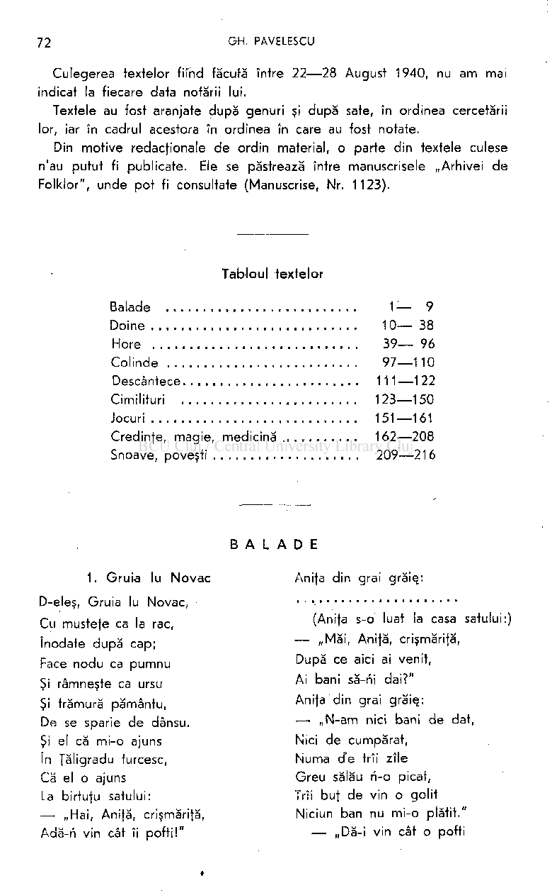

Culegerea textelor fifnd făcută între 22—28 August 1940, nu am mai indicat la tiecare data notării lui.

Textele au fost aranjate după genuri şi după safe, în ordinea cercetării lor, iar în cadrul acestora în ordinea în care au fost notate.

Din motive redacfionale de ordin material, o parte din textele culese n'au putut fi publicate. Ele se păstrează între manuscrisele „Arhivei de Folklor", unde pot fi consultate (Manuscrise, Nr. 1123).

Tabloul textelor

Balade 1 — 9 Doine 10—3 8 Hore 39 — 96 Colinde 97—110 Descântece 111—122 Cimilituri 123—150 Jocuri 151—161 Credinfe, magie, medicină 162—208 Snoave, poveşti 209—216

A D E

BA

Anifa din grai grăiş:

1. Gruia Iu Novac D-eleş, Gruia Iu Novac, Cu mustefe ca la rac, Inodate după cap; Face nodu ca pumnu Şi râmneşte ca ursu Şi trămură pământu, De se sparie de dânsu. Şi el că mi-o ajuns in Ţăligradu furcesc, Că el o ajuns La birtufu satului:

(Ani|a s-o luat la casa satului:)

- — „Măi, Anifă, crişmăriţă, După ce aici ai venit, Ai bani să-hi dai?" Anifa din grai grăiş:
- — „N-am nici bani de dat, Nici de cumpărat, huma d'e trîi zîle Greu sălău n-o picat, Trîi but de vin o golit Niciun ban nu mi-o plătit."

— „Hai, Aniţă, crişmăriţă, Adă-n vin cât îi pofti!"

— „Dă-i vin cât o pofti

•

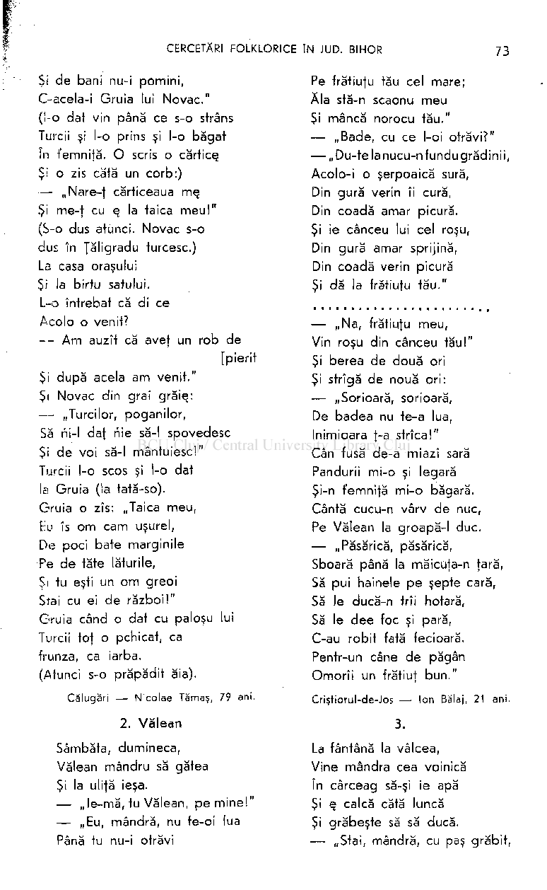

Şi de bani nu-i pomini, C-acela-i Gruia lui Novac." (l-o dat vin până ce s-o strâns Turcii şi l-o prins şi l-o băgat în temniţă. O scris o cărtice. Şi o zis cătă un corb:)

Pe frătiuţu tău cel mare; Ăla stă-n scaonu meu Şi mancă norocu tău."

— „Bade, cu ce l-oi otrăvi?"

— „Du-te la nucu-nfundu grădinii, Acolo-i o şerpoaică sură, Din gură verin îi cură, Din coadă amar picură. Şi ie cânceu lui cel roşu, Din gură amar sprijină, Din coadă verin picură Şi dă la frătiuţu tău."

— „Nare-ţ cărticeaua mş Şi me-ţ cu ş la taica meu!" (S-o dus atunci. Novac s-o dus în Ţăligradu turcesc.) La casa oraşului Şi la birtu satului. L-o întrebat că di ce Acolo o venit?

— „Na, frătiuţu meu, Vin roşu din cânceu tău!" Şi berea de două ori Şi strîgă de nouă ori:

- - Am auzît că aveţ un rob de [pierit

Şi după acela am venit." Şi Novac din grai grăiş:

— „Sorioară, sorioară, De badea nu te-a lua, Inimioara ţ-a strica!" Cân fusă de-a miazî sară Pandurii mi-o şi legară Şi-n femniţă mi-o băgară. Cântă cucu-n vârv de nuc, Pe Vălean la groapă-l duc. — „Păsărică, păsărică, Sboară până la măicuţa-n ţară, Să pui hainele pe şepte cară, Să le ducă-n trîi hotară, Să le dee foc şi pară, C-au robit fată fecioară. Pentr-un câne de păgân Omorîi un frătiuţ bun."

— „Turcilor, poganilor, Să rïi-l daţ nie să-l spovedesc Şi de voi să-l mântuiesc!" Turcii l-o scos şi l-o dat la Gruia (la tată-so). Gruia o zîs: „Taica meu, Lu îs om cam uşurel, De poci bate marginile Pe de täte lăturile, Şi tu eşti un om greoi Stai cu ei de război!" Gruia când o dat cu paloşu lui Turcii toţ o pchicat, ca frunza, ca iarba. (Atunci s-o prăpădit ăia).

Criştiorul-de-Jos — Ion Bălaj, 21 ani.

Călugări — Nicolae Tămaş, 79 ani.

3.

2. Vălean Sâmbăta, dumineca, Vălean mândru să gătea Şi la uliţă ieşa.

La fântână la vâlcea, Vine mândra cea voinică în cârceag să-şi ie apă Şi ş calcă cătă luncă Şi grăbeşte să să ducă.

— „le-mă, tu Vălean, pe mine!"

— „Eu, mândră, nu te-oi lua Până tu nu-i otrăvi

— „Stai, mândră, cu paş grăbit,

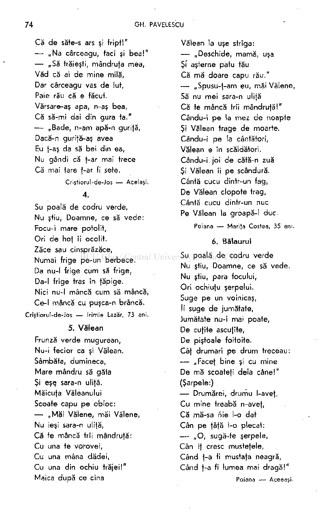

Că de săte-s ars şi fripţi"

Vălean la uşe strîga:

— „Na cârceagu, taci şi bea!"

— „Deschide, mamă, uşa Şi aşterne patu tău Că mă doare capu rău."

— „Să trăieşti, mândruţa mea, Văd că ai de mine milă, Dar cârceagu vas de lut, Paie rău că e făcut. Vărsare-aş apa, n-aş bea, Că să-mi dai din gura ta."

— „Spusu-ţ-am eu, măi Vălene, Să nu mei sara-n uliţă Că te mânca trîi mândruţă!" Cându-i pe la mez de noapte Şi Vălean trage de moarte. Cându-i pe la cântători, Vălean e în scăldători. Cându-i joi de cătă-n zuă Şi Vălean îi pe scândură. Cântă cucu dintr-un fag, De Vălean clopote trag, Cântă cucu dintr-un nuc Pe Vălean la groapă-l duc.

— „Bade, n-am apă-n guriţă, Dacă-n gurită-aş avea Eu ţ-aş da să bei din ea, Nu gândi că \-ar mai trece Că mai tare f-ar fi sete.

Criştiorul-de-Jos — Acelaşi.

4. Su poală de codru verde, Nu ştiu, Doamne, ce să vede: Focu-i mare potolit, Ori de hot îi ocolit. Zace sau cinsprăzăce, Numai frige pe-un berbece. Da nu-l frige cum să frige, Da-I frige tras în tăpige. Nici nu-l mancă cum să mancă, Ce-I mancă cu puşca-n brâncă.

Poiana — Mari)a Costea, 35 ani.

6. Balaurul

Su poală de codru verde Nu ştiu, Doamne, ce să vede. Nu ştiu, para focului, Ori ochiutu şerpelui. Suge pe un voinicaş, îl suge de jumătate, Jumătate nu-l mai poate, De cutîte ascufîte, De pistoale foitoite. Cât drumari pe drum treceau:

Criştiorul-de-Jos — Irimie Lazăr, 73 ani.

5. Väle an Frunză verde mugurean, Nu-i fecior ca şi Vălean. Sâmbăta, dumineca, Mare mândru să găta Şi eşe. sara-n uliţă. Măicuţa Văleanului Scoate capu pe obloc:

— „Facet bine şi cu mine De mă scoateţi delà câne!" (Şarpele:)

— Drumărei, drumu l-avet, Cu mine treabă n-avet, Că mă-sa nie l-o dat Cân pe tată l-o plecat:

— „Măi Vălene, măi Vălene, Nu ieşi sara-n uliţă, Că te mancă trîi mândruţă: Cu una te vorovei, Cu una mâna dadei, Cu una din ochiu trăjei!" Maica după ce cina

— „O , sugă-te şerpele, Cân îj cresc mustefele, Când t-a fi mustaţa neagră, Când t-a fi lumea mai dragă!"

Poiana — Aceeaşi.

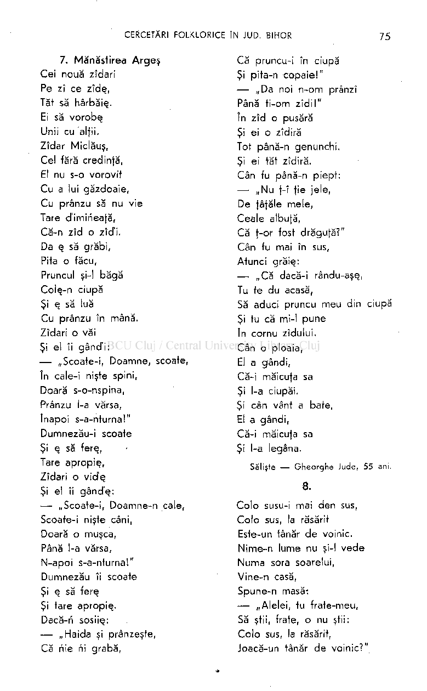

7. Mănăstirea Argeş Cei nouă zîdari Pe zî ce zîdş, Tăt să hârbăie. Ei să vorobe Unii cu alfii. Zîdar Miclăuş, Cel fără credinfă, El nu s-o vorovit Cu a lui găzdoaie, Cu prânzu să nu vie Tare dimineaţă, Că-n zîd o zîcfi. Da ş să grăbi, Pita o făcu, Pruncul şi-l băgă Cole-n ciupă Şi e să luă Cu prânzu în mână. Zîdari o văi Şi el îi gândi:

Că pruncu-i în ciupă Şi pita-n copaie!"

— „Da noi n-om prânzî Până ti-om zîd ii " în zîd o pusără Şi ei o zidiră Tot până-n genunchi. Şi ei tăt zidiră. Cân fu până-n piept:

— „Nu ţ-î fie jele, De ţâţăle mele, Ceale albufă, Că ţ-or fost drăguţă?" Cân fu mai în sus, Atunci grăie:

— „Că dacă-i rându-aşe, Tu te du acasă, Să aduci pruncu meu din ciupă Şi tu că mi-l pune în cornu zîdului. Cân o ploaia, El a gândi, Că-i măicuţa sa Şi l-a ciupăi. Şi cân vânt a bate, El a gândi, Că-i măicufa sa Şi l-a legâna.

— „Scoate-i, Doamne, scoate, în cale-i nişte spini, Doară s-o-nspina, Prânzu l-a vărsa, înapoi s-a-nturna!" Dumnezău-i scoate Şi e să fere, Tare apropie, Zîdari o vicfş Şi el îi gând'e:

Sălişte — Gheorgh e Jude, 55 ani.

8.

Colo susu-i mai den sus, Colo sus, la răsărit Este-un tânăr de voinic. Nime-n lume nu şi-l vede Numa sora soarelui, Vine-n casă, Spune-n masă-

— „Scoate-i, Doamne-n cale, Scoate-i nişte câni, Doară o muşca, Până l-a vărsa, N-apoi s-a-nturna!" Dumnezău îi scoate Şi e să ferş Şi tare apropiş. Dacă-n sosiie:

— „Alelei, tu frate-meu, Să ştii, frate, o nu ştii: Colo sus, la răsărit, Joacă-un tânăr de voinic?"

— „Haida şi prânzeşte, Că nie ni grabă,

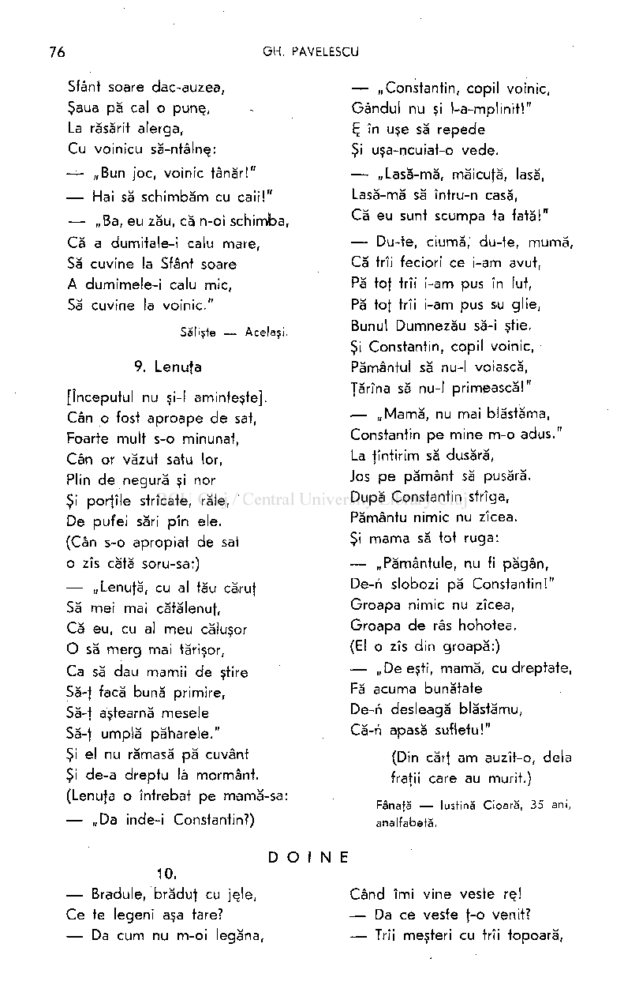

Sfânt soare dac-auzea, Şaua pă cal o pune., La răsărit alerga, Cu voinicu să-ntâlnş:

— „Constantin, copil voinic, Gândul nu şi l-a-mplinit!" E_ în uşe să repede Şi uşa-ncuiat-o vede.

— „Bun joc, voinic tânăr!"

— „Lasă-mă, măicuţă, lasă, Lasă-mă să întru-n casă, Că eu sunt scumpa ta fată!"

— Hai să schimbăm cu caii!"

— „Ba, eu zău, că n-oi schimba, Că a dumitale-i calu mare, Să cuvine la Sfânt soare A dumimele-i calu mic, Să cuvine la voinic."

— Du-te, ciumă,' du-te, mumă, Că trîi feciori ce i-am avut, Pă toţ trîi i-am pus în lut, Pă toţ trîi i-am pus su glie, Bunul Dumnezău să-i ştie. Şi Constantin, copil voinic, Pământul să nu-l voiască, Ţărîna să nu-l primească!"

Sălişte — Acelaşi.

9. Lenuţa

[începutul nu şi-l aminteşte]. Cân o fost aproape de sat, Foarte mult s-o minunat, Cân or văzut satu lor, Plin de negură şi nor Şi porţile strîcate, răle, De put'ei sări pîn ele. (Cân s-o apropiat de sat o zîs cătă soru-sa:)

— „Mamă, nu mai blăstăma, Constantin pe mine m-o adus." La ţîntirim să dusără, Jos pe pământ să pusără. După Constantin strîgâ, Pământu nimic nu zîcea. Şi mama să tot ruga:

— „Pământule, nu fi păgân, De-h slobozi pă Constantin!" Groapa nimic nu zîcea, Groapa de râs hohotea. (El o zîs din groapă:)

— „Lenuţă, cu al tău căruţ Să mei mai căfălenuţ, Că eu, cu al meu căluşor O să merg mai tărişor, Ca să dau mamii de ştire Să-ţ facă bună primire, Să-ţ aştearnă mesele Să-ţ umplă păhărele." Şi el nu rămasă pă cuvânt Şi de-a dreptu là mormânt. (Lenuţa o întrebat pe mamă-sa:

— „De eşti, mamă, cu dreptate, Fă acuma bunătate De-n desleagă blăstămu, Că-n apasă sufletul"

(Din cărţ am auzit-o, delà fraţii care au murit.)

Fânafă — Iustină Cioară, 35 ani, analfabetă

— „Da inde-i Constantin?)

D O I 10.

Când îmi vine veste rş!

— Bradule, brăduţ cu jeje, Ce te legeni aşa tare?

— Da ce veste ţ-o venit?

— Trîi meşteri cu trîi topoară,

— Da cum nu m-oi legăna,

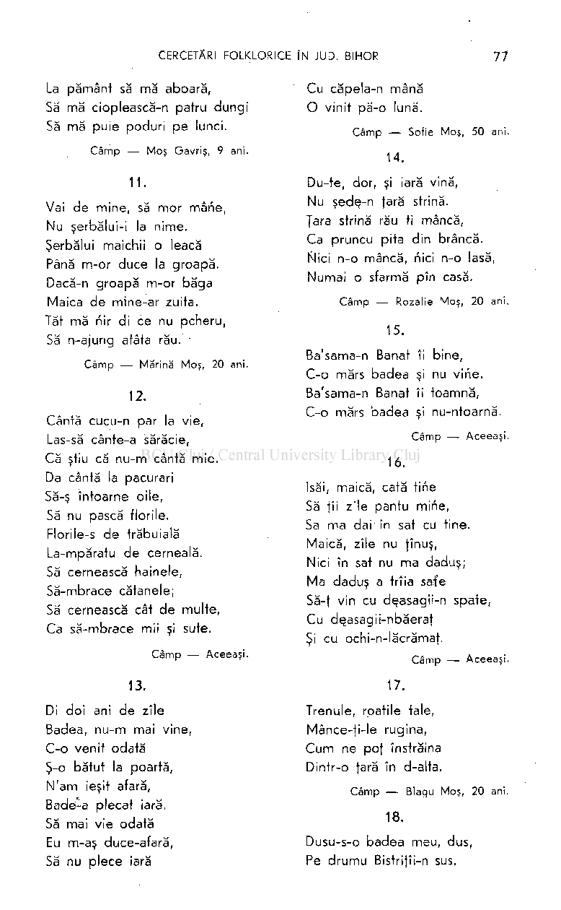

Cu căpela-n mână O vinit pă-o lună.

La pământ să mă aboară, Să mă cioplească-n patru dungi

- Să mă puie poduri pe lunci.

Câm p — Moş Gavriş, 9 ani.

11. Vai de mine, să mor mâne, Nu şerbălui-i la nime. Şerbălui maichii o leacă Până m-or duce la groapă. Dacă-n groapă m-or băga Maica de mine-ar zuita.

- Tăt mă nir di ce nu pcheru, Să n-ajung atâta rău. •

Câm p — Sofie Moş, 50 ani.

14. Du-te, dor, şi iară vină, Nu şedş-n ţară strină. Ţara strină rău ti mancă, Ca pruncu pita din brâncă. Nici n-o mancă, nici n-o lasă, Numai o sfarmă pîn casă.

Câm p — Rozalie Moş, 20 ani.,

15. Ba'sama-n Banat îi bine, C-o mărs badea şi nu vine. Ba'sama-n Banat îi toamnă, C-o mărs badea şi nu-ntoarnă.

Câm p — Marină Moş, 20 ani.

12. Cântă cucu-n par la vie, Las-să cânte-a sărăcie, Că ştiu că nu-m cântă mie. Da cântă la păcurari Să-ş întoarne oile, Să nu pască florile. Florile-s de trăbuială La-mpăratu de cerneală. Să cernească hainele, Să-mbrace cătanele; Să cernească cât de multe, Ca să-mbrace mii şi sute.

Câmp — Aceeaşi.

16.

Isăi, maică, cată tine Să ţîi zîle pantu mine, Sa ma dai în sat cu tine. Maică, zîle nu jînuş, Nici în sat nu ma daduş; Ma daduş a trîia sate Să-ţ vin cu dşasagii-n spate, Cu dşasagii-nbăeraţ Şi cu ochi-n-lăcrămaţ.

Câm p — Aceeaşi.

Câmp — Aceeaşi.

17.

13.

Trenule, roatile tale, Mânce-ţi-le rugina, Cum ne poţ înstrăina Dintr-o ţară în d-alta.

Di doi ani de zîle Badea, nu-m mai vine, C-o venit odată Ş-o bătut la poartă, N'am ieşit afară, Bade-a plecat iară. Să mai vie odată Eu m-aş duce-afară, Să nu plece iară

Câm p — Blagu Moş, 20 ani.

18. Dusu-s-o badea meu, dus, Pe drumu Bistriţîi-n sus.

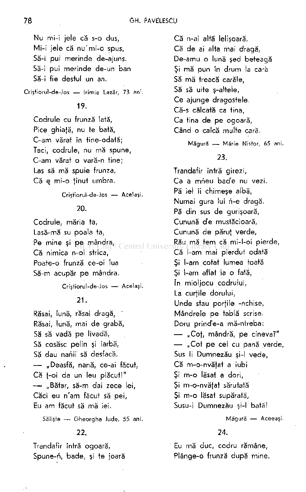

GH. PAVËLËSCU

Nu mi-i jele că s-o dus, Mi-i jele că nu mi-o spus, Să-i pui merinde de-ajuns. Să-i pui merinde de-un ban Să-i fie destul un an.

Că n-ai altă lelişoară. Că de ai alta mai dragă, De-amu o lună şed beteagă Şi mă pun în drum la cară Să mă treacă carăle, Să să uite ş-altele, Ce ajunge dragostele. Că-s călcată ca tina, Ca tina de pe ogoară, Când o calcă multe cară.

Criştiorul-de-Jos — Irimie Lazăr, 73 ani.

19.

Codrule cu frunză lată, Pice ghiafă, nu te bată, C-am vărat în tine-odată; Taci, codrule, nu mă spune, C-am vărat o vară-n tine; Las să mă spuie frunza, Că ş mi-o fînut umbra.

Măgură — Mărie Nistor, 65 ani.

23. Trandafir întră girezi, Ca a mrieu bacTe nu vezi. Pă iei îi chimeşe albă, Numai gura lui n-e dragă. Pă din sus de gurişoară, Cunună d"e mustăcioară, Cunună de părut verde, Rău mă tem că mi-l-oi pierde, Că l-am mai pierdut odată Şi l-am cotat lumea toată Şi l-am aflat la o fată, în mioljocu codrului, La curţile dorului, Unde stau porfile -nchise, Mândrele pe tablă scrise. Doru prinde-a mă-ntreba: — „Cof, mândră, pe cineva?"

Criştiorul-de-Jos — Acelaşi.

20.

Codrule, măria ta, Lasă-mă su poala ta, Pe mine şi pe mândra, Că nimica n-oi strîca, Poate-o frunză ce-oi lua Să-m acupăr pe mândra.

Criştiorul-de-Jos — Acelaşi.

21.

- Răsai, lună, răsai dragă,

- Răsai, lună, mai de grabă,
- Să să vadă pe livadă,

- Să cosăsc pelin şi iarbă, Să dau nanii să desfacă.

— „Cot pe cel cu pană verde, Sus îi Dumnezău şi-l vede, Că m-o-nvăţat a iubi Şi m-o lăsat a dori, Şi m-o-nvăfat sărutată Şi m-o lăsat supărată, Susu-i Dumnezău şi-l bată!

— „Deasfă, nană, ce-ai făcut, Că j-oi da un leu plăcut!"

— „Bătar, să-m dai zece lei, Căci eu n'am făcut să pei, Eu am făcut să mă iei.

Măgură — Aceeaşi.

Sălişte — Gheorgh e Jude, 55 ani.

24.

22.

Eu mă duc, codru rămâne, Plânge-o frunză după mine.

Trandafir întră ogoară, Spune-n, bade, şi te joară

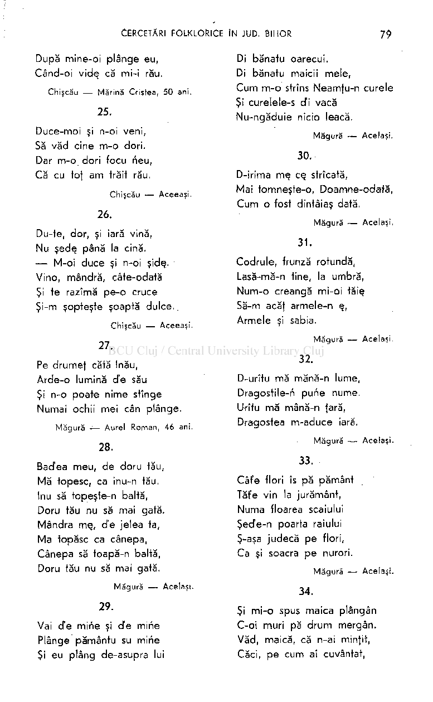

CERCETĂRI FOLKLORICE IN JUD. BIHOR 79

Di bănatu oarecui. Di bănatu maicii mele, Cum m-o strîns Neamţu-n curele Şi curelele-s d'i vacă Nu-ngăduie nicio leacă.

După mine-oi plânge eu, Când-oi vidş că mi-i rău.

Chişcău — Marină Cristea, 50 ani.

25.

Duce-moi şi n-oi veni, Să văd cine m-o dori. Dar m-o dori focu neu, Că cu toţ am trăit rău.

Măgură — Acelaşi.

30. D-irima me ce stricată, Mai tomneşte-o, Doamne-odată, Cum o fost dintâiaş dată,

Chişcău — Aceeaşi.

26. Du-te, dor, şi iară vină, Nu şede până la cină.

Măgură — Acelaşi.

31.

Codrule, frunză rotundă, Lasă-mă-n tine, la umbră, Num-o creangă mi-oi tăie

— M-oi duce şi n-oi şide. Vino, mândră, câte-odată Şi te razîmă pe-o cruce Şi-m şopteşte şoaptă dulce..

- Să-m acăţ armele-n e, Armele şi sabia.

Măgură — Acelaşi.

32. D-urîtu mă mănă-n lume, Dragostile-n pune nume. Urîfu mă mână-n ţară, Dragostea m-aduce iară.

Măgură — Acelaşi.

33. Câfe flori îs pă pământ

- Tăfe vin la jurământ, Numa floarea scaiului ŞecTe-n poarta raiului Ş-aşa judecă pe flori, Ca şi soacra pe nurori.

Chişcău — Aceeaşi,

27.

Pe drumef cătă Inău, Arde-o lumină cfe său Şi n-o poate nime stînge Numai ochii mei cân plânge.

Măgură — Aurel Roman, 46 ani.

28.

Badea meu, de doru tău, Mă topesc, ca inu-n tău. Inu să topeşte-n baltă, Doru tău nu să mai gată. Mândra me, d'e jelea ta, Ma topăsc ca cânepa, Cânepa să toapă-n baltă, Doru tău nu să mai gată.

Măgură — Acelaji .

Măgură — Acelaşi.

34.

29.

Şi mi-o spus maica plângân C-oi muri pă drum mergân. Văd, maică, că n-ai minţit, Căci, pe cum ai cuvântat,

Vai cfe mine şi cTe mine Plânge pământu su mine Şi eu plâng de-asupra lui

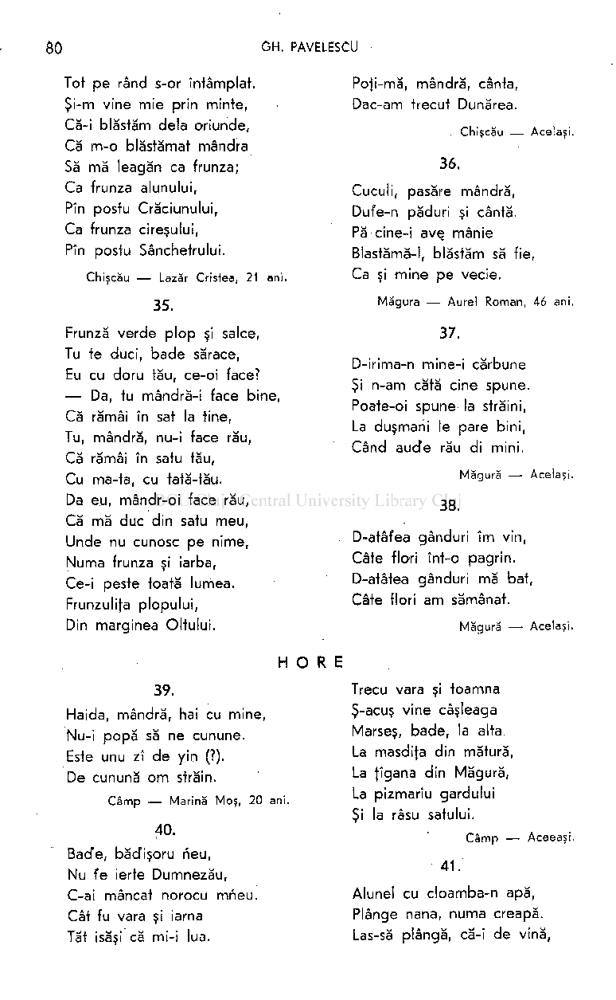

Tot pe rând s-or întâmplat. Şi-m vine mie prin minte, Că-i blăstăm delà oriunde, Că m-o blăstămat mândra

Pofi-mă, mândră, cânta, Dac-am trecut Dunărea.

. Chişcău — Acelaşi.

- Să mă leagăn ca frunza; Ca frunza alunului, Pîn postu Crăciunului, Ca frunza cireşului, Pîn postu Sânchetrului.

Chişcău — Lazăr Crisfea, 21 ani.

35.

Frunză verde plop şi salce, Tu te duci, bade sărace, Eu cu doru tău, ce-oi face?

— Da, tu mândră-i face bine, Că rămâi în sat la tine, Tu, mândră, nu-i face rău, Că rămâi în satu tău, Cu ma-ta, cu tată-tău. Da eu, mândr-oi face rău, Că mă duc din satu meu, Unde nu cunosc pe nime, Numa frunza şi iarba, Ce-i peste toată lumea. Frunzulifa plopului, Din marginea Oltului.

H O

39. Haida, mândră, hai cu mine, Nu-i popă să ne cunune. Este unu zî de yin (?). De cunună om străin.

Câm p — Marină Moş, 20 ani.

40. BacTe, băcfişoru neu, Nu fe ierte Dumnezău, C-ai mâncat norocu mneu. Cât fu vara şi iarna

- Tăt isăşi că mi-i lua.

36. Cuculi, pasăre mândră, Dut'e-n păduri şi cântă. Pă cine-i ave. mânie Blastămă-I, blăstăm să fie, Ca şi mine pe vecie.

Măgura — Aurel Roman, 46 ani.

37.

D-irima-n mine-i cărbune Şi n-am cătă cine spune. Poate-oi spune la străini, La duşmani le pare bini, Când aucTe rău di mini,

Măgură — Acelaşi.

38.

D-atât'ea gânduri îm vin, Câte flori înt-o pagrin. D-atâtea gânduri mă bat, Câte flori am sămânat.

Măgură — Acelaşi.

R E

Trecu vara şi toamna Ş-acuş vine câşleaga Marseş, bade, la alta. La masdifa din mătură, La fîgana din Măgură, La pizmariu gardului Şi la râsu satului.

Câm p — Aceeaşi.

41. Alunei cu cloamba-n apă, Plânge nana, numa creapă. Las-să plângă, că-i de vină,

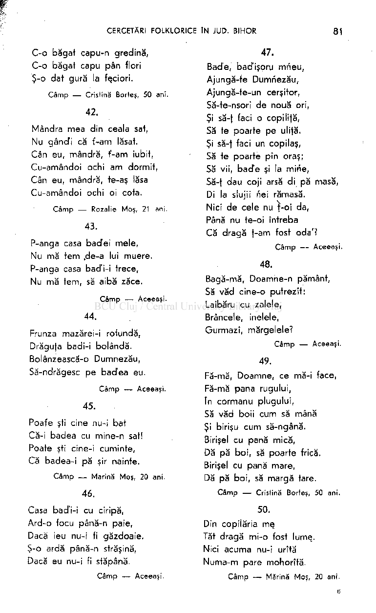

47. Bade, bacTişoru mneu, Ajungă-te Dumnezău, Ajungă-te-un cerşitor, Să-te-nsori de nouă ori, Şi să-t faci o copilită, Să te poarte pe ulifă. Şi să-t faci un copilaş, Să te poarte pîn oraş; Să vii, bade şi la mine, Să-t dau coji arsă di pă masă, Di la slujii hei rămasă. Nici de cele nu )-oi da, Până nu te-oi întreba Că dragă \-avn fost oda'?

C-o băgat capu-n gredină, C-o băgat capu pân flori Ş-o dat gură la feciori.

Câm p — Cristină Borteş, 50 ani.

42.

Mândra mea din ceala sat, Nu gâncfi că t'-am lăsat. Cân eu, mândră, f-am iubit, Cu-amândoi ochi am dormit, Cân eu, mândră, te-aş lăsa Cu-amândoi ochi oi cota.

Câm p — Rozalie Moş, 21 ani.

43. P-anga casa badei mele, Nu mă tem ,de-a lui muere. P-anga casa bacfi-i trece, Nu mă tem, să aibă zăce.

Câm p — Aceeaşi.

48. Bagă-mă, Doamne-n pământ, Să văd cine-o putrezît: Laibăru cu zalele, Brâncele, inelele, Gurmazî, mărgelele?

Câm p — Aceeaşi.

44.

Frunza mazărei-i rotundă, Drăguţa badi-i bolândă. Bolânzească-o Dumnezău, Să-ndrăgesc pe bacfea eu.

Câm p — Aceeaşi.

49. Fă-mă, Doamne, ce mă-i face, Fă-mă pana rugului, în cormanu plugului,

Câm p —- Aceeaşi.

45.

- Să văd boii cum să mână Şi birişu cum să-ngână. Birişel cu pană mică, Dă pă boi, să poarte frică. Birişel cu pană mare, Dă pă boi, să margă tare.

Câm p — Cristină Borteş, 50 ani.

50. Din copilăria mş

- Tăt dragă mi-o fost lume.. Nici acuma nu-i urîtă Numa-m pare mohorîtă.

Poafe şti cine nu-i bat Că-i badea cu mine-n sat! Poate şti cine-i cuminte, Că badea-i pă şir nainte.

Câm p — Marină Moş, 20 ani.

46. Casa bad'i-i cu ciripă, Ard-o focu până-n paie, Dacă ieu nu-i fi găzdoaie. Ş-o ardă până-n străşină, Dacă eu nu-i fi stăpână.

Câm p — Aceeaşi.

Câm p — Marină Moş, 20 ani.

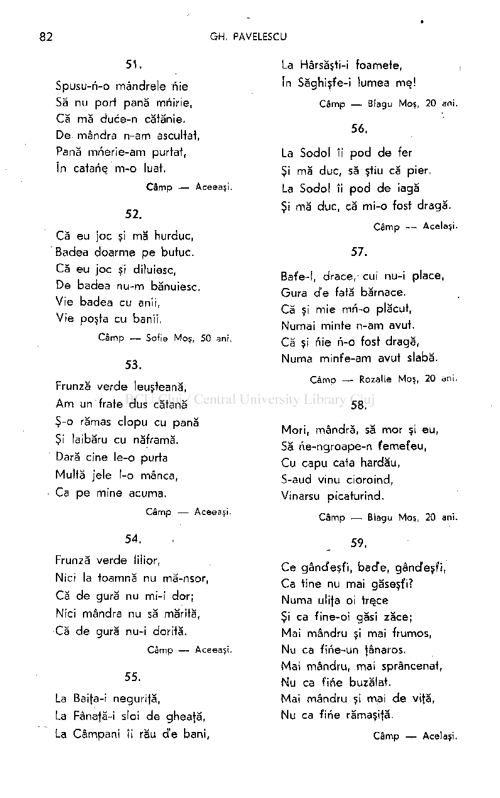

La Hârsăşti-i foamete, în Săghişfe-i lumea me.!

Spusu-ri-o mândrele nie Să nu port pană mrïirie, Că mă duce-n cătănie. De mândra n-am ascultat, Pană mnerie-am purtat, în catanş m-o luat.

Câm p — Blagu Moş, 20 ani.

56.

La Sodol îi pod de fer Şi mă duc, să ştiu că pier. La Sodol îi pod de iagă Şi mă duc, că mi-o fost dragă.

Câm p — Aceeaşi.

52. Că eu joc şi mă hurduc, Badea doarme pe butuc. Că eu joc şi diluiesc, De badea nu-m bănuiesc. Vie badea cu anii, Vie poşta cu banii.

Câm p — Acelaşi.

57.

Bafe-I, drace, cui nu-i place, Gura d'e fată bărnace. Că şi mie miî-o plăcut, Numai minte n-am avut. Că şi rîie rï-o fost dragă, Numa minfe-am avut slabă.

Câm p — Sofie Moş, 50 ani.

53. Frunză verde leuşteană, Am un frate dus cătană Ş-o rămas clopu cu pană Şi laibăru cu năframă. Dară cine le-o purta Multă jele l-o mânca, Ca pe mine acuma.

Câm p — Rozalie Moş, 20 ani.

58.

Mori, mândră, să mor şi eu, Să ne-ngroape-n femefeu, Cu capu cata hardău, S-aud vinu cioroind, Vinarsu picaturind.

Câm p — Aceeaşi.

Câm p — Blagu Moş, 20 ani.

54. Frunză verde lilior, Nici la toamnă nu mă-nsor, Că de gură nu mi-i dor; Nici mândra nu să mărită, Că de gură nu-i dorită.

59. Ce gâncfeşfi, bade, gândeşfi, Ca tine nu mai găseşti? Numa uliţa oi trşce Şi ca fine-oi găsî zace; Mai mândru şi mai frumos, Nu ca fine-un ţânaros. Mai mândru, mai sprâncenat, Nu ca fine buzălat. Mai mândru şi mai de viţă, Nu ca fine rămăşiţă.

Câm p — Aceeaşi.

55. La Baifa-i neguriţă, La Fânaţă-i sloi de gheaţă, La Câmpani îi rău d'e bani,

Câm p — Acelaşi.

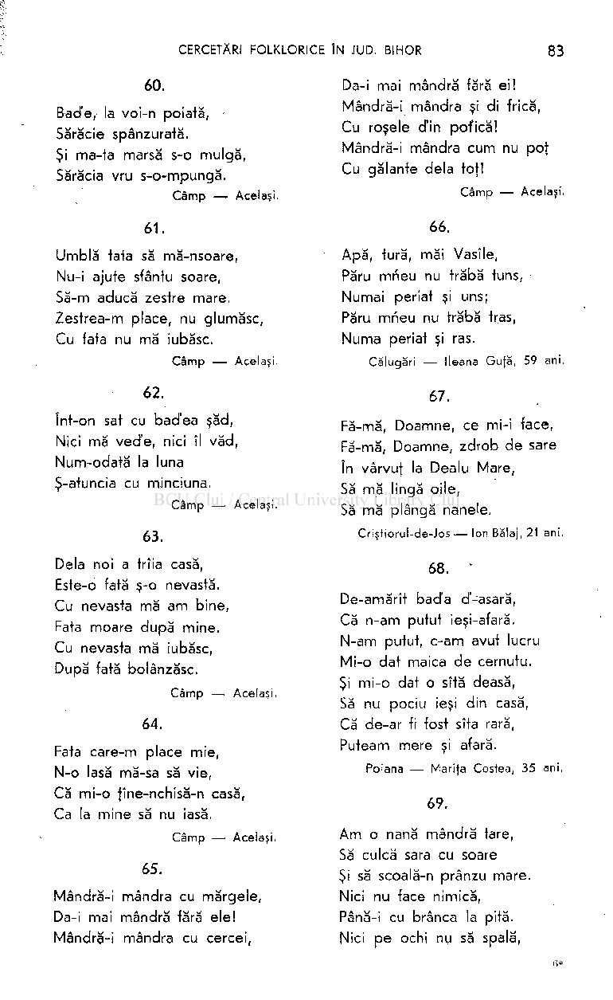

Da-i mai mândră fără ei! Mândră-i mândra şi di frică, Cu roşele cfin pofică! Mândră-i mândra cum nu poj Cu galante delà toţ!

Bacfe, la voi-n poiată, Sărăcie spânzurată. Şi ma-ta marsă s-o mulgă, Sărăcia vru s-o-mpungă.

Câm p — Acelaşi.

Câm p — Acelaşi.

66.

61.

Apă, tură, măi Vasîle, Păru mrïeu nu trăbă tuns, Numai periat şi uns; Păru mneu nu trăbă tras, Numa periat şi ras.

Umblă tata să mă-nsoare, Nu-i ajute sfântu soare, Să-m aducă zestre mare. Zestrea-m place, nu glumăsc, Cu fata nu mă iubăsc.

Călugări — Ileana Gufă, 59 ani.

Câm p — Acelaşi.

62.

67.

înt-on sat cu badea şăd, Nici mă vecfe, nici îl văd, Num-odată la luna Ş-atuncia cu minciuna.

Fă-mă, Doamne, ce mi-i face, Fă-mă, Doamne, zdrob de sare fn vârvuf la Dealu Mare, Să mă lingă oile, Să mă plângă nanele.

Câm p — Acelaşi.

Criştiorul-de-Jos — Ion Bălaj, 21 ani.

63.

Delà noi a trîia casă, Este-o fată ş-o nevastă. Cu nevasta mă am bine, Fata moare după mine. Cu nevasta mă iubăsc, După fată bolânzăsc.

68. •

De-amărît bad'a d'-asară, Că n-am putut ieşi-afară. N-am putut, c-am avut lucru Mi-o dat maica de cernutu. Şi mi-o dat o sîtă deasă, Să nu pociu ieşi din casă, Că de-ar fi fost sîta rară, Puteam mere şi afară.

Câm p — Acelaşi.

64. Fata care-m place mie,

Poiana — Marifa Costea, 35 ani.

- N-o lasă mă-sa să vie, Că mi-o fîne-nchisă-n casă, Ca la mine să nu iasă.

69.

Am o nană mândră tare, Să culcă sara cu soare Şi să scoală-n prânzu mare. Nici nu face nimica, Până-i cu brânca la pită. Nici pe ochi nu să spală,

Câm p — Acelaşi.

65.

Mândră-i mândra cu mărgele, Da-i mai mândră fără ele! Mândră-i mândra cu cercei,

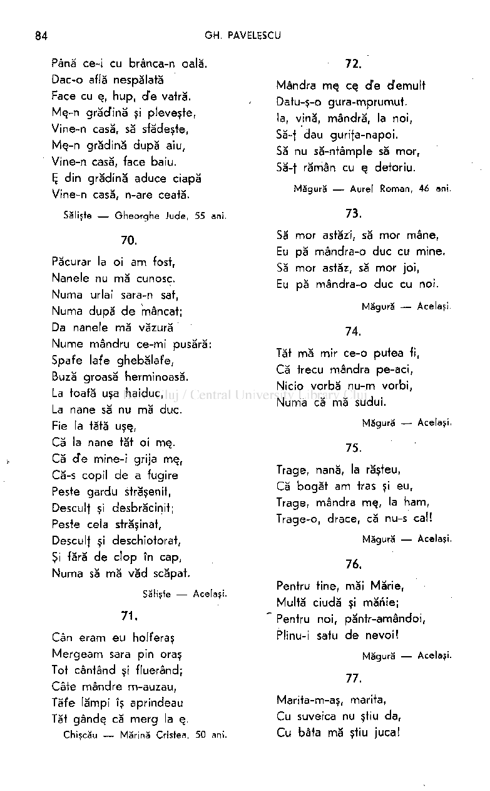

Până ce-i cu brânca-n oală. Dac-o află nespălată Face cu e, hup, d e vatră. Mş-n grădină şi pleveşte, Vine-n casă, să sfădeşte, Mş-n grădină după aiu, Vine-n casă, face baiu. F, din grădină aduce ciapă Vine-n casă, n-are ceată.

Mândra mş cq d e demult Datu-ş-o gura-mprumut. la, vină, mândră, la noi, Să-t dau gurifa-napoi. Să nu să-ntâmple să mor, Să-t rămân cu q detoriu.

Măgură — Aurel Roman, 46 ani.

- 73.

Să mor astăzi, să mor mâne, Eu pă mândra-o duc cu mine.

- Să mor astăz, să mor joi, Eu pă mândra-o duc cu noi.

Măgură — Acelaşi,

74.

- Tăt mă mir ce-o putea fi, Că trecu mândra pe-aci, Nicio vorbă nu-m vorbi, Numa că mă sudui.

- Sălişte — Gheorgh e Jude, 55 ani.

70. Păcurar la oi am fost, Nanele nu mă cunosc. Numa urlai sara-n sat, Numa după de mâncat; Da nanele mă văzură Nume mândru ce-mi pusără: Spafe lafe ghebălafe, Buză groasă herminoasă, La toată uşa haiduc, La nane să nu mă duc. Fie la tătă uşş, Că la nane tăt oi mc. Că d e mine-i grija mç, Că-s copil de a fugire Peste gardu străşenit, Desculf şi desbrăcinit; Peste cela străşinat, Desculf şi deschiotorat, Şi fără de clop în cap, Numa să mă văd scăpat.

Sălişte — Acelaşi.

71.

Cân eram eu holt'eraş Mergeam sara pin oraş Tot cântând şi fluerând; Câte mândre m-auzau,

- Tăfe lămpi îş aprindeau Tăt gândş că merg la q.

Măgură — Acelaşi.

75.

Trage, nană, la răşteu, Că bogat am tras şi eu, Trage, mândra mq, la ham, Trage-o, drace, că nu-s cal!

Măgură — Acelaşi.

76.

Pentru tine, măi Mărie, Multă ciudă şi manie; Pentru noi, păntr-amândoi, Plinu-i satu de nevoi!

Măgură — Acelaşi.

77.

Marita-m-aş, mărita, Cu suveica nu ştiu da, Cu bâta mă ştiu juca!

Chişcău — Marină Cristea, 50 ani.

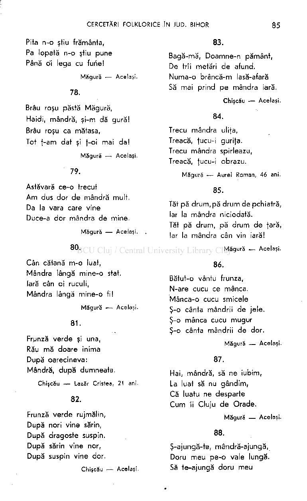

Pita n-o ştiu frământa, Pa lopată n-o ştiu pune Până o'i lega cu furie!

Bagă-mă, Doamne-n pământ, De trîi metări de afund. Numa-o brâncă-m lasă-afară

Măgură — Acelaşi.

- Să mai prind pe mândra iară.

Chişcău — Acelaşi.

84.

Trecu mândra uliţa, Treacă, ţucu-i guriţa. Trecu mândra spirleazu, Treacă, ţucu-i obrazu.

Măgură — Aurel Roman, 46 ani.

85.

- Tăt pă drum, pă drum de pchiatră, Iar la mândra niciodată. Tăt pă drum, pă drum de ţară, Iar la mândra cân vin iară!

78.

Brâu roşu pastă Măgură, Haidi, mândră, şi-m dă gură! Brâu roşu ca mătasa, Tot ţ-am dat şi f-oi mai da!

Măgură — Acelaşi.

79.

Astăvară ce-o trecut Am dus dor de mândră mult. Da la vara care vine Duce-a dor mândra de mine.

Măgură — Acelaşi.

80.

Măgură — Acelaşi.

Cân cătană m-o luat, Mândra lângă mine-o stat. Iară cân oi ruculi, Mândra lângă mine-o fi!

86.

- Bătut-o vântu frunza, N-are cucu ce mânca. Mânca-o cucu smicele Ş-o cânta mândrii de jele. Ş-o mânca cucu mugur Ş-o cânta mândrii de dor.

Măgură — Acelaşi.

87.

Hai, mândră, să ne iubim, La luat să nu gândim,

- Că luatu ne desparte Cum îi Cluju de Orade.

Măgură — Acelaşi.

81.

Frunză verde şi una, Rău mă doare inima După oarecineva: Mândră, după dumneata.

Chişcău — Lazăr Cristea, 21 ani.

82.

Frunză verde rujmălin, După nori vine sărin, După dragoste suspin. După sărin vine nor, După suspin vine dor.

Măgură — Acelaşi.

88. Ş-ajungă-te, mândră-ajungă, Doru meu pe-o vale lungă. Să te-ajungă doru meu

Chişcău — Acelaşi.

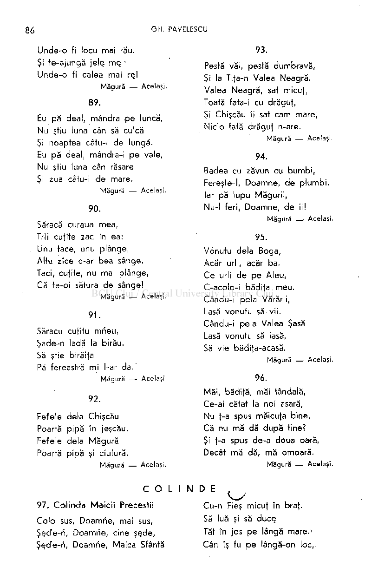

Unde-o fi locu mai rău. Şi te-ajungă jelş me_ • Unde-o fi calea mai rej

Pestă văi, pestă dumbravă, Şi la Tiţa-n Valea Neagră. Valea Neagră, sat micuţ, Toată fata-i cu drăguţ, Şi Chişcău îi sat cam mare, Nicio fată drăguţ n-are.

Măgură — Acelaşi.

89.

Eu pă deal, mândra pe luncă, Nu ştiu luna cân să culcă Şi noaptea câtu-i de lungă. Eu pă deal, mândra-i pe vale, Nu ştiu luna cân răsare Şi zua câtu-i de mare.

Măgură — Acelaşi.

94. Badea cu zăvun cu bumbi, Fereşte-I, Doamne, de plumbi. Iar pă lupu Măgurii, Nu-l feri, Doamne, de ii!

Măgură — Acelaşi.

90.

Măgură — Acelaşi.

Săracă curaua mea, Trîi cutîte zac în ea: Unu tace, unu plânge, AHu zîce c-ar bea sânge. Taci, cuţite, nu mai plânge, Că te-oi sătura de sânge!

95. Vônutu delà Boga, Acăr urli, acăr ba. Ce urli de pe Aleu, C-acolo-i bădiţa meu. Cându-i pela Vărării, Lasă vonutu să vii. Cându-i pela Valea Şasă Lasă vonutu să iasă, Să vie bădiţa-acasă.

Măgură — Acelaşi.

91.

Săracu cufîtu mneu, Şade-n ladă la birău.

- Să ştie birăiţa Pă fereastră mi l-ar da.

Măgură — Acelaşi.

96. Măi, bădiţă, măi tândală, Ce-ai cătat la noi asară, Nu ţ-a spus măicuţa bine, Că nu mă dă după tine? Şi ţ-a spus de-a doua oară, Decât mă dă, mă omoară.

Măgură — Acelaşi.

92.

Feţele delà Chişcău Poartă pipă în jeşcău. Fetele delà Măgură Poartă pipă şi ciutură.

Măgură — Acelaşi.

Măgură — Acelaşi.

COLIND E .

97. Colinda Maicii Precestii Cu-n Fieş micuţ în braţ. Colo sus, Doamne, mai sus, Să luă şi să duce. Şşd'e-ri, Doamne, cine şşde, Tăt în jos pe lângă mare.' Şşd'e-n, Doamne, Maica Sfântă Cân îş fu pe lângă-on loc,

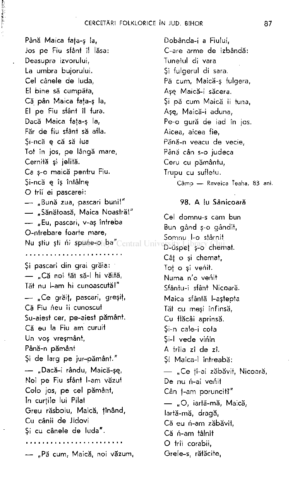

Până Maica fafa-ş la, Jos pe Fiu sfânt îl lăsa: Deasupra izvorului, La umbra bujorului. Cel cânele de luda, El bine să cumpăta, Că pân Maica fafa-ş la, El pe Fiu sfânt îl fura. Dacă Maica fafa-ş la, Făr de fiu sfânt să afla. Şi-ncă q că să lua Tot în jos, pe lângă mare, Cernită şi jelită. Ca ş-o maică pentru Fiu. Şi-ncă q îş întâlnş O trîi ei pascarei:

Dobânda-i a Fiului, C-are arme de izbândă: Tunetul di vara Şi fulgerul di sara. Pă cum, Maică-ş fulgera, Aşe. Maică-i săcera. Şi pă cum Maică îi tuna, Aşş, Maică-i aduna, Pe-o gură de iad în jos. Aicea, aicea fie, Pănă-n veacu de vecie, Până cân s-o judeca Ceru cu pământu, Trupu cu sufletu.

Câm p — Raveica Teaha, 83 ani.

98. A Iu Sâ nicoară

— „Bună zua, pascari buni!"

— „Sănătoasă, Maica Noastră!"

Cel domnu-s cam bun Bun gând ş-o gândit, Somnu l-o stârnit D-uspeţ ş-o chemat. Câf o şi chemat, Toţ o şi venit. Numa n'o venit Sfântu-i sfânt Nicoară. Maica sfântă l-aştepta Tăt cu meşi înfinsă, Cu flăcâi aprinsă. Şi-n cale-i cota Şi-l vede vinin A trîia zî de zî. Şi Maica-I întreabă:

— „Eu, pascari, v-aş întreba

- O-ntrebare foarte mare, Nu ştiu şti iii spune-o ba"

Şi pascari din grai grăia:

— „Că noi tăt să-l hi vaită,

- Tăt nu l-am hi cunoascută!"

— „Ce grăif, pascari, greşif, Că Fiu rieu îi cunoscut Su-aiest cer, pe-aiest pământ. Că eu la Fiu am curuit Un voş vreşmânt, Până-n pământ Şi de larg pe jur-pământ."

— „Dacă-i rându, Maică-şş, Noi pe Fiu sfânt l-am văzut Colo jos, pe cel pământ, In curţile lui Pilat Greu răsboiu, Maică, fînând, Cu cânii de Jidovi Şi cu cânele de luda".

— „Ce ţî-ai zăbăvit, Nicoară, De nu n-ai verîit Cân ţ-am poruncit?"

— „O , iartă-mă, Maică, lartă-mă, dragă, Că eu n-am zăbăvit, Că n-am tâlnit O trîi corăbii, Grele-s, rătăcite,

— „Pă cum, Maică, noi văzum,

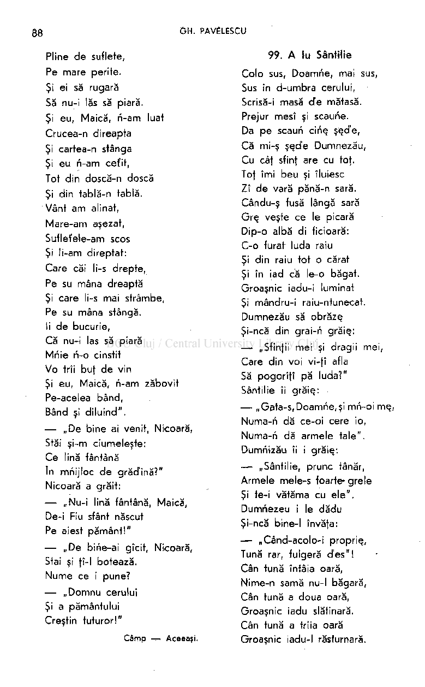

99. A Iu Sântilie Colo sus, Doamne, mai sus, Sus în d-umbra cerului, Scrisă-i masă d'e mătasă. Prejur mesî şi scaune. Da pe scaun cine şed'e, Că mi-ş şed'e Dumnezău, Cu cât, sfinf are cu tof. Tof îmi beu şi îluiesc Zî de vară pănă-n sară. Cându-ş fusă lângă sară Gre veste ce le picară Dip-o albă di ficioară: C-o furat luda raiu Şi din raiu tot o cărat Şi în iad ca le-o băgat. Groaşnic iadu-i luminat Şi mândru-i raiu-ntunecat. Dumnezău să obrăze Şi-ncă din grai-n grăie:

Pline de suflete, Pe mare perite. Şi ei să rugară Să nu-i lăs să piară. Şi eu, Maică, h-am luat Crucea-n direapta Şi cartea-n stânga Şi eu n-am cefit, Tot din doscă-n doscă Şi din tablă-n tablă. Vânt am alinat, Mare-am aşezat, Suflefele-am scos Şi li-am direptat: Care căi li-s drepte, Pe su mâna dreaptă Şi care li-s mai strâmbe, Pe su mâna stângă. li de bucurie, Că nu-i las să piară Mrîie h-o cinstit Vo trîi buf de vin Şi eu, Maică, n-am zăbovit Pe-acelea bând, Bând şi diluind".

— „Sfinfii mei şi dragii mei, Care din voi vi-fî afla Să pogorîţî pă luda?" Sântilie îi grăie:

— „Gata-s, Doamne, şi mn-oi me, Numa-n dă ce-oi cere io, Numa-iî dă armele tale". Dumrîizău îi i grăie:

— „De bine ai venit, Nicoară, Stăi şi-m ciumeleşte: Ce lină fântână în mnijloc de grădină?" Nicoară a grăit:

— „Sântilie, prunc tânăr, Armele mele-s foarte- grele Şi te-i vătăma cu ele". Dumnezeu i le dădu Şi-ncă bine-l învăfa:

— „Nu-i lină fântână, Maică, De-i Fiu sfânt născut Pe aiest pământ!"

— „Când-acolo-i proprie, Tună rar, fulgeră d'es"! Cân tună întâia oară, Nime-n samă nu-l băgară, Cân tună a doua oară, Groaşnic iadu slătinară. Cân tună a trîia oară Groaşnic iadu-l răsturnară.

— „De bine-ai gîcit, Nicoară, Stai şi fî-l botează. Nume ce i pune?

— „Domnu cerului Şi a pământului Creştin tuturor!"

Câm p — Aceeaşi.

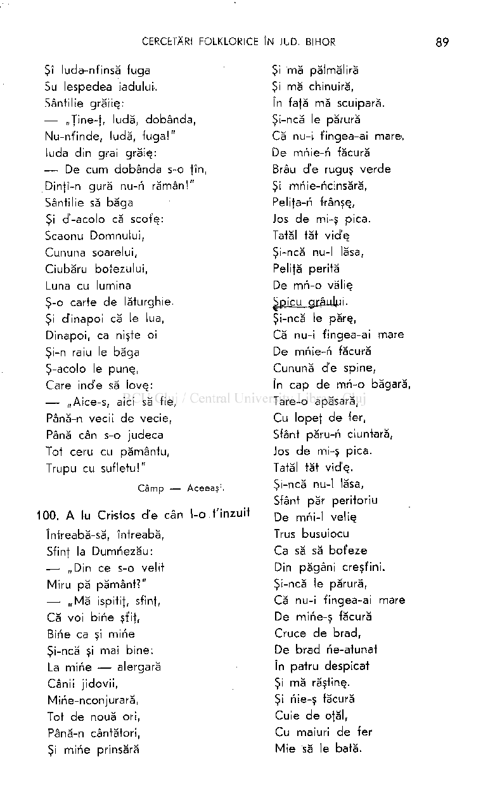

Şî luda-nfinsă fuga Şi mă pălmăliră Su lespedea iadului. Şi mă chinuiră, Sânii 1 ie grăiiş: In faţă mă scuipară.

— „Ţine-j, ludă, dobânda, Şi-ncă le părură Nu-nfinde, ludă, fuga!" Că nu-i fingea-ai mare'. luda din grai grăiş: De mriie-n făcură

— De cum dobânda s-o fîn, Brâu d'e ruguş verde Dinfî-n gură nu-n rămân!" Şi mnie-ncinsără, Sântilie să băga Peliţa-n frânşş, Şi d'-acolo că scofş: Jos de mi-ş pica. Scaonu Domnului, Tatăl făt vid'e. Cununa soarelui, Şi-ncă nu-l lăsa, Ciubăru botezului, Pelifă perită Luna cu lumina De mn-o vălie. Ş-o carie de lăturghie. S

pjçu_gjâuljji. Şi dinapoi că le lua, Şi-ncă le parc, Dinapoi, ca nişte oi Că nu-i t'ingea-ai mare Şi-n raiu le băga De mnie-n făcură Ş-acolo le punç, Cunună d'e spine, Care ind'e să lovş: în cap de miî-o băgară,

f

— „Aice-s, aici să fie, Tare-o apăsară, Până-n vecii de vecie, Cu lopeţ de fer, Până cân s-o judeca Sfânt păru-n ciuntară, Tot ceru cu pământu, Jos de mi-ş pica. Trupu cu sufletul" Tatăl tăt vid'e..

Câmp — Aceeaşi. Şi-ncă nu-l lăsa, Sfânt păr peritoriu

100. A Iu Cristos d'e cân l-o t'inzuit De mrîi-l veliş întreabă-să, întreabă, Trus busuiocu Sfinţ la Dumriezău: Ca să să bofeze

— „Din ce s-o velit Din păgâni creştini. Miru pă pământ?" Şi-ncă le părură,

— „Mă ispitit, sfinţ, Că nu-i t'ingea-ai mare Că voi bine şt'iţ, De mihe-ş făcură Bine ca şi mine Cruce de brad, Şi-ncă şi mai bine: De brad rie-atunat La mine — alergară în patru despicat Cânii jidovii, Şi mă răştinş. Mine-nconjurară, Şi nie-ş făcură Tot de nouă ori, Cuie de ofăl, Până-n cântători, Cu maiuri de fer Şi mine prinsără Mie să le bată.

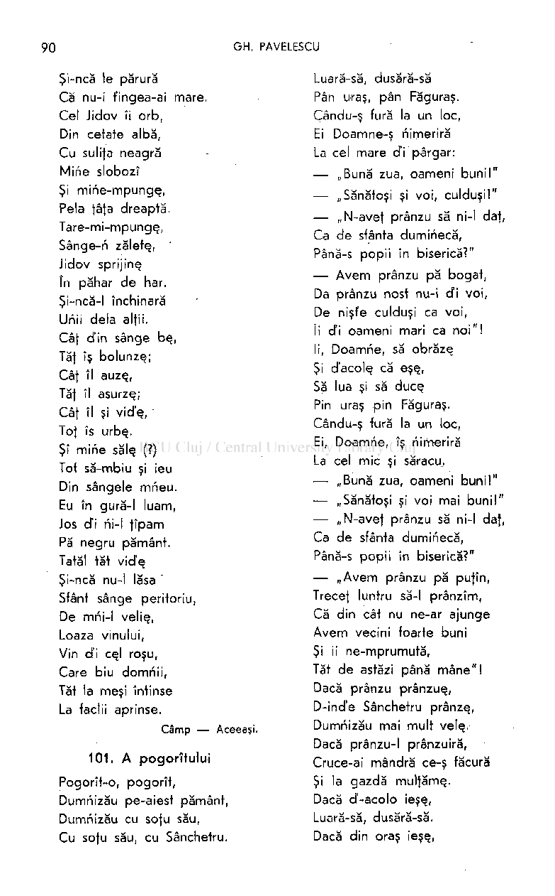

Luară-să, dusără-să Pân uraş, pân Făguraş. Cându-ş fură la un loc, Ei Doamne-ş nimeriră La cel mare cTi pârgar:

Şi-ncă le părură Că nu-i fingea-ai mare. Cel Jidov îi orb. Din cetate albă, Cu sulifa neagră Mine slobozî Şi mirie-mpungş, Pela jâfa dreaptă. Tare-mi-mpungş, Sânge-ri zăletş, Jidov sprijin^ în pahar de har. Şi-ncă-l închinară Unii delà alfii. Câf d\n sânge bq, Tăf îş bolunzej Câf îl auzç, Tăf 'I asurzş; Cât îl Şi vicTş, ^ Tot 'S urbş. Şî mine sălş (?) Tot să-mbiu şi ieu Din sângele mneu. Eu în gură-l luam, Jos cTi ni-l tîpam Pă negru pământ. Tatăl tăt vid'ş Şi-ncă nu-l lăsa ' Sfânt sânge peritoriu, De mni-l veliş, Loaza vinului, Vin d'i cej roşu, Care biu domnii, Tăt la meşi întinse La făclii aprinse.

— „Bună zua, oameni buni!" — „Sănătoşi şi voi, culduşi!" — „N-avet prânzu să ni-l dat, Ca de sfânta duminecă, Până-s popii în biserică?"

— Avem prânzu pă bogat, Da prânzu nost nu-i cfi voi, De nişfe culduşi ca voi, îi d'i oameni mari ca noi"! li, Doamne, să obrăzş Şi d'acolş că eşş,

- Să lua şi să ducş Pin uraş pin Făguraş. Cându-ş fură la un loc, Ei, Doamne, îş nimeriră La cel mic şi săracu,

— „Bună zua, oameni buni!"

— „Sănătoşi şi voi mai buni!" — „N-avet prânzu să ni-l dat, Ca de sfânta duminecă, Până-s popii în biserică?"

— „Avem prânzu pă pufîn, Trecet luntru să-l prânzîm, Că din cât nu ne-ar ajunge Avem vecini foarte buni Şi ii ne-mprumută,

- Tăt de astăzi până mâne"! Dacă prânzu prânzuş, D-ind'e Sânchetru prânzş, Dumnizău mai mult velş. Dacă prânzu-l prânzuiră, Cruce-ai mândră ce-ş făcură Şi la gazdă muitămş. Dacă d'-acolo ieşş, Luară-să, dusără-să. Dacă din oraş ieşş,

Câm p — Aceeaşi.

101. A pogorîtului Pogorît-o, pogorît, Dumnizău pe-aiest pământ, Dumnizău cu sotu său, Cu sotu său, cu Sânchetru.

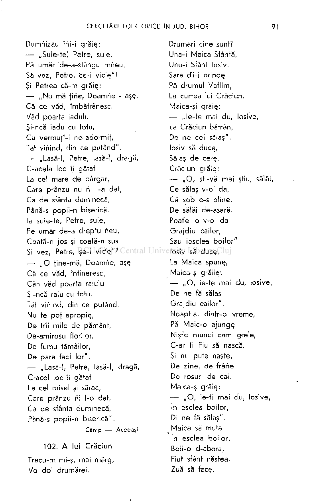

Drumari cine sunt? Una-i Maica Sfântă, Unu-i Sfânt losiv. Sara d'i-i prinde. Pă drumul Vaflim, La curtea lui Crăciun. Maica-şi grăiş:

Dumnizău îni-i grăiş:

— „Suie-teJ Petre, suie, Pă umăr de-a-stângu mneu,

- Să vez, Petre, ce-i vid'ş"! Şi Petrea că-m grăiş:

— „Nu mă fîne, Doamne - aşş, Că ce văd, îmbătrânesc. Văd poarta iadului Şi-ncă iadu cu totu, Cu vermujî-i ne-adormiţ,

- Tăt vinind, din ce putând".

— „le-te mai du, losive, La Crăciun bătrân, De ne cei sălaş", losiv să ducş, Sălaş de cere, Crăciun grăiş: — „O , şti-vă mai ştiu, sălăi, Ce sălaş v-oi da, Că sobile-s pline, De sălăi de-asară. Poafe io v-oi da Grajdiu cailor, Sau iesclea boilor", losiv să ducş, La Maica spunş, Maica-ş grăiiş:

— „Lasă-I, Petre, lasă-l, dragă, C-acela loc îi gătat La cel mare de pârgar, Care prânzu nu ni l-a dat, Ca de sfânta duminecă, Până-s popii-n biserică, la suie-te, Petre, suie, Pe umăr de-a dreptu tîeu, Coată-n jos şi coată-n sus Şi vez, Petre, şe-i vide."? — „ O fîne-mă, Doamne, aşe. Că ce văd, întineresc, Cân văd poarta raiului Şi-ncă raiu cu totu, Tăt vinind, din ce putând. Nu te pof apropiş, De trîi mile de pământ, De-amirosu florilor, De fumu tămâilor, De para făcliilor". — „Lasă-l, Petre, lasă-l, dragă, C-acel loc îi gătat La cel mişel şi sărac, Care prânzu ni l-o dat, Ca de sfânta duminecă, Până-s popii-n biserică".

— „O , ie-te mai du, losive, De ne fă sălaş Grajdiu cailor". Noaptia, dintr-o vreme, Pă Maic-o ajungş Nişte munci cam grele, C-ar fi Fiu să nască. Şi nu putş naşte, De zîne, de frâne De rosuri de cai. Maica-ş grăiş:

— „O , ie-fi mai du, losive, în esclea boilor, Di ne fă sălaş". Maica să muta în esclea boilor. Boii-o d-abora, Fiuţ sfânt năştea. Zuă să facş,

Câm p — Aceeaşi.

102. A lui Crăciun

Trecu-m mi-ş, mai mărg, Vo doi drumărei.

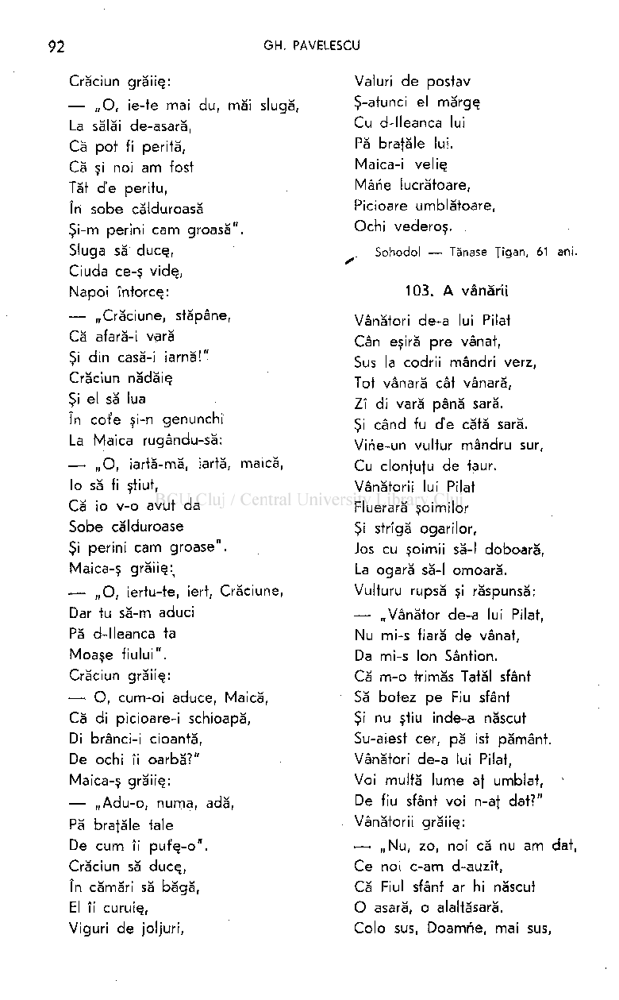

Valuri de postav Ş-atunci el mărgş Cu d-lleanca lui Pă brafăle lui. Maica-i velie. Mâne lucrătoare, Picioare umblătoare, Ochi vederoş.

Crăciun grăiiş:

— „O , ie-te mai du, măi slugă, La sălăi de-asară, Că pot fi perită, Că şi noi am fost Tăt d'e perifu, In sobe călduroasă

- Şi-m perini cam groasă". Sluga să duce., Ciuda ce-ş vidş, Napoi întorce.:

Sohodol — Tănase Tîgan, 61 ani.

103. A vânării

— „Crăciune, stăpâne, Că afară-i vară Şi din casă-i iarnă!" Crăciun nădăie. Şi el să lua în cofe şi-n genunchi La Maica rugându-să: — „O , iartă-mă, iartă, maică, Io să fi ştiut, Că io v-o avut da Sobe călduroase Şi perini cam groase". Maica-ş grăiie^

Vânători de-a lui Pilat Cân eşiră pre vânat, Sus la codrii mândri verz, Tot vânară cât vânară, Zî di vară până sară. Şi când fu d'e cătă sară. Vihe-un vultur mândru sur, Cu clonfufu de taur. Vânătorii lui Pilat Fluerară şoimilor Şi strîgă ogarilor, Jos cu şoimii să-l doboară, La ogară să-l omoară. Vulturu rupsă şi răspunsă:

— „O , iertu-te, iert, Crăciune, Dar tu să-m aduci Pă d-lleanca ta Moaşe fiului". Crăciun grăiiş:

— „Vânător de-a lui Pilat, Nu mi-s fiară de vânat, Da mi-s Ion Sântion. Că m-o trimăs Tatăl sfânt Să botez pe Fiu sfânt Şi nu ştiu inde-a născut Su-aiest cer, pă ist pământ. Vânători de-a lui Pilat, Voi multă lume a\ umblat,

— O, cum-oi aduce, Maică, Că di picioare-i şchioapă, Di brânci-i cioantă, De ochi îi oarbă?" Maica-ş grăiie.:

N

De fiu sfânt voi n-aţ dat?" Vânătorii grăiiş:

— „Adu-o, numa, adă, Pă brafăle tale De cum îi pufş-o". Crăciun să ducş, în cămări să băgă, El îi curuiş, Viguri de joljuri,

— „Nu, zo, noi că nu am dat, Ce noi c-am d-auzît, Că Fiul sfânt ar hi născut O asară, o alaltăsară. Colo sus, Doamne, mai sus,

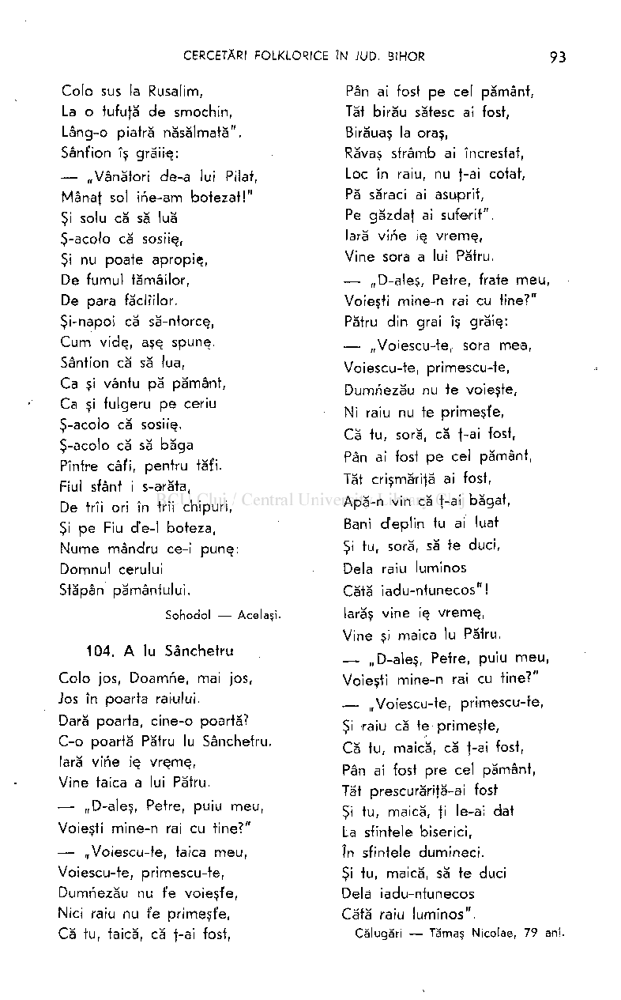

Pân ai fost pe cel pământ, Tăt birău sătesc ai fost, Birăuaş la oraş, Răvaş strâmb ai încresfat, Loc în raiu, nu J-ai cotat, Pă săraci ai asuprit, Pe găzdaţ ai suferit". Iară vine iş vremş, Vine sora a lui Patru.

Colo sus la Rusalim, La o tufuţă de smochin, Lâng-o piatră năsălmată". Sânfion îş grăiie.:

— „Vânători de-a lui Pilat, Mânaf

' ine-am botezat!" Şi solu că să luă Ş-acolo că sosiiş, Şi nu poate apropie., De fumul tămâilor, De para făcliilor. Şi-napoi că să-ntorcş, Cum vide., aşe. spune.. Sântion că să lua, Ca şi vântu pă pământ, Ca şi fulgeru pe ceriu Ş-acolo că sosiiş. Ş-acolo că să băga Pîntre câfi, pentru tăt'i. Fiul sfânt i s-arăta, De trîi ori în trîi chipuri, Şi pe Fiu de-l boteza, Nume mândru ce-i punq: Domnul cerului Stăpân pământului.

so

— „D-aleş, Petre, frate meu, Voieşti mine-n rai cu tine?" Patru din grai îş grăie.:

— „Voiescu-te, sora mea, Voiescu-te, primescu-te, Dumnezău nu te voieşte, Ni raiu nu te primeşte, Că tu, soră, că j-ai fost, Pân ai fost pe cel pământ, Tăt crişmăriţă ai fost, Apă-n vin că ţ-ai băgat, Bani d'eplin tu ai luat Şi tu, soră, să te duci, Delà raiu luminos Cătă iadu-ntunecos" ! larăş vine ie. vreme., Vine şi maica Iu Patru.

Sohodol — Acelaşi.

104. A Iu Sânchetru Colo jos, Doamne, mai jos, Jos în poarta raiului. Dară poarta, cine-o poartă? C-o poartă Patru Iu Sânchetru. Iară vine ie. vre.mş, Vine taica a lui Patru.

— „D-aleş, Petre, puiu meu, Voieşti mine-n rai cu tine?"

— „Voiescu-te, primescu-te, Şi raiu că te primeşte, Că tu, maică, că ţ-ai fost, Pân ai fost pre cel pământ, Tăt prescurăriţă-ai fost Şi tu, maică, ţi le-ai dat La sfintele biserici, In sfintele dumineci. Şi tu, maică, să te duci Delà iadu-ntunecos Cătă raiu luminos".

— „D-aleş, Petre, puiu meu, Voieşti mine-n rai cu tine?"

— „Voiescu-te, taica meu, Voiescu-te, primescu-te, Dumnezău nu t'e voieşte, Nici raiu nu t'e primeşte, Că tu, taică, că ţ-ai fost,

Călugări — Tămaş Nicolae, 79 ani.

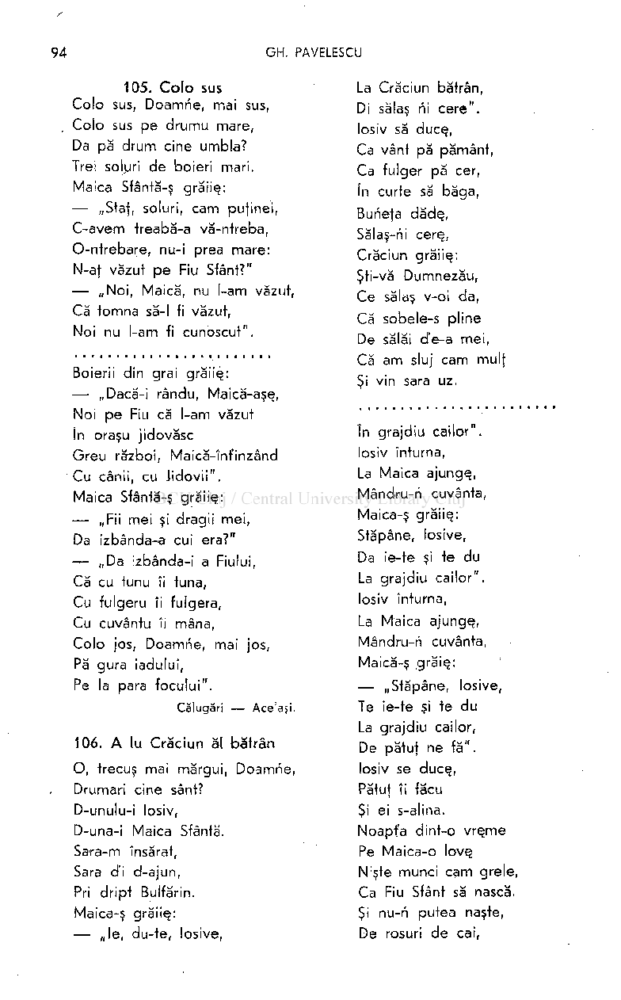

La Crăciun bătrân, Di sălaş ni cere", losiv să ducş, Ca vânt pă pământ, Ca fulger pă cer, în curte să băga, Burieja dădş, Sălaş-ni cerş, Crăciun grăiiş: Şti-vă Dumnezău, Ce sălaş v-oi da, Că sobele-s pline De sălăi cTe-a mei, Că am sluj cam mulf Şi vin sara uz.

105. Colo sus Colo sus, Doamne, mai sus, Colo sus pe drumu mare, Da pă drum cine umbla? Trei soluri de boieri mari. Maica Sfântă-ş grăiiş:

— „Staf, soluri, cam pufinei, C-avem treabă-a vă-ntreba, O-ntrebare, nu-i prea mare: N-at văzut pe Fiu Sfânt?"

— „Noi, Maică, nu l-am văzut, Că tomna să-l fi văzut, Noi nu l-am fi cunoscut".

Boierii din grai grăiiş:

— „Dacă-i rându, Maică-aşş, Noi pe Fiu că l-am văzut in oraşu jidovăsc Greu război, Maică-înfinzând Cu cânii, cu Jidovii". Maica Sfântă-ş grăiiş:

în grajdiu cailor", losiv înturna, La Maica ajunge., Mândru-h cuvânta, Maica-ş grăiiş: Stăpâne, losive, Da ie-te şi te du La grajdiu cailor", losiv înturna, La Maica ajungş, Mândru-n cuvânta, Maică-ş grăiş:

— „Fii mei şi dragii mei, Da izbânda-a cui era?"

— „Da izbânda-i a Fiului, Că cu tunu îi tuna, Cu fulgeru îi fulgera, Cu cuvântu îi mâna, Colo jos, Doamne, mai jos, Pă gura iadului, Pe la para focului".

— „Stăpâne, losive, Te ie-te şi te du La grajdiu cailor, De pătut ne fă", losiv se ducş, Pătuf îi făcu Şi ei s-alina. Noapfa dint-o vrşme Pe Maica-o lovş Nişte munci cam grele, Ca Fiu Sfânt să nască. Şi nu-n putea naşte, De rosuri de cai,

Călugări — Acelaşi.

106. A Iu Crăciun ăl bătrân O, trecuş mai mărgui, Doamne, Drumari cine sânt? D-unulu-i losiv, D-una-i Maica Sfântă. Sara-m însărat, Sara cfi d-ajun, Pri dript Bulfărin. Maica-ş grăiiş:

— „le, du-te, losive,

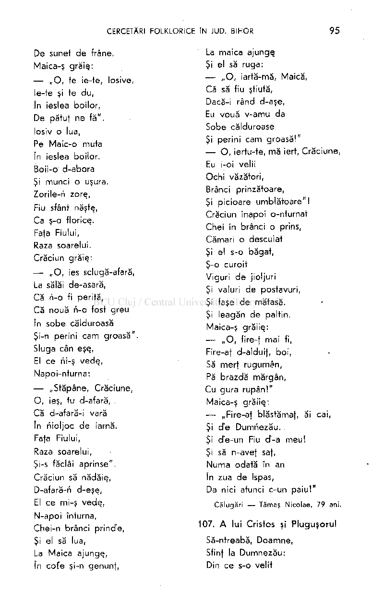

La maica ajunge. Şi el să ruga:

De sunet de frâne. Maica-ş grăic:

— „O , iartă-mă, Maică, Că să fiu ştiută, Dacă-i rând d-aşe, Eu vouă v-amu da Sobe călduroase Şi perini cam groasă!"

— „O , te ie-te, losive, le-te şi te du, în ieslea boilor, De pătuf ne fă", losiv o lua, Pe Maic-o muta în ieslea boilor. Boii-o d-abora Şi munci o uşura. Zorile-h zorş, Fiu sfânt naşte, Ca ş-o florice. Fafa Fiului, Raza soarelui. Crăciun grăiş: — „O , ies sclugă-afară, La sălăi de-asară, Că h-o fi perită, Că nouă h-o fost greu în sobe călduroasă

— O, iertu-te, mă iert, Crăciune, Eu i-oi velii Ochi văzători, Brânci prinzătoare, Şi picioare umblătoare"! Crăciun înapoi o-nturnat Chei în brânci o prins, Cămări o descuiat Şi el s-o băgat, Ş-o curoit Viguri de jioljuri Şi valuri de postavuri, Şi faşe de mătasă. Şi leagăn de paltin. Maica-ş grăiic:

- Şi-n perini cam groasă" Sluga cân eşq, El ce hi-ş vedş, Napoi-nturna:

— „O , fire-} mai fi, Fire-af d-alduif, boi, Să merţ rugumân,

Pă brazdă mărgân, Cu gura rupân!" Maica-ş grăiie/

— „Stăpâne, Crăciune, O, ieş, tu d-afară, Că d-afară-i vară în hioljoc de iarnă. Fafa Fiului, Raza soarelui, Şi-s făclâi aprinse". Crăciun să nădăiş, D-afară-h d-eşe., El ce mi-ş vedş, N-apoi înturna, Chei-n brânci prind'e, Şi el să lua, La Maica ajunge., în cofe şi-n genunf,

— „Fire-aţ blăstămaf, ăi cai, Şi cTe Dumnezău. Şi de-un Fiu d'-a meu! Şi să n-avef saf, Numa odată în an în zua de Ispas, Da nici atunci c-un paiu!"

Călugări — Tămaş Nicolae, 79 ani.

107. A lui Cristos şi Pluguşorul

Să-ntreabă, Doamne, Sfinj la Dumnezău: Din ce s-o velit

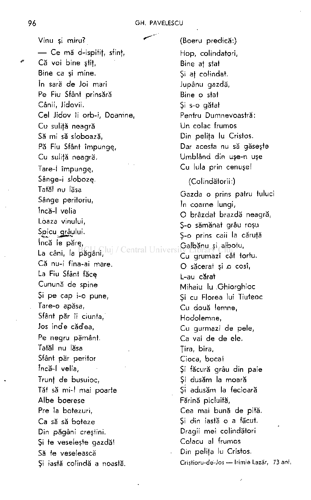

Vinu şi miru?

(Boeru predică:) Hop, colindători. Bine aţ stat Şi aţ colindat. Jupânu gazdă, Bine o stat Şi s-o gătat Pentru Dumnevoastră: Un colac frumos Din peliţa Iu Cristos. Dar acesta nu să găseşte Umblând din uşe-n uşe Cu lula prin cenuşe!

— Ce mă d-ispitiţ, sfinf, Că voi bine ştiţ, Bine ca şi mine. în sară de Joi mari Pe Fiu Sfânt prinsără Cânii, Jidovii. Cel Jidov îi orb-i, Doamne, Cu suliţă neagră

- Să mi să sloboază, Pă Fiu Sfânt împungş, Cu suliţă neagră. Tare-I împunge, Sânge-i slobozş. Tatăl nu lăsa Sânge peritoriu, încă-l velia Loaza vinului, Spicujçjrâului. încă le părş, La câni, la păgâni, Că nu-i fina-ai mare. La Fiu Sfânt făcş Cunună de spine Şi pe cap i-o pune, Tare-o apăsa, Sfânt păr îi ciuntă, Jos incfe căcfea, Pe negru pământ. Tatăl nu lăsa Sfânt păr peritor încă-l velia, Trunţ de busuioc,
- Tăt să mi-l mai poarte Albe boerese Pre la botezuri, Ca să să boteze Din păgâni creştini. Şi te veseleşte gazdă! Să te veselească Şi iastă colindă a noastă.

(Colindătorii:) Gazda o prins patru tuluci în coarne lungi, O brâzdat brazdă neagră, Ş-o sămănat grâu roşu Ş-o prins caii la căruţă Galbănu şi albotu, Cu grumazî cât tortu. O săcerat şi a cosî, L-au cărat Mihaiu Iu Ghiorghioc Şi cu Florea lui Tiuteoc Cu două lemne, Hodolemne, Cu gurmazi de pele, Ca vai de de ele. Ţîra, bîra, Ci oca, boca! Şi făcură grâu din paie Şi dusăm la moară Şi adusăm la fecioară Fărină picluită, Cea mai bună de pită. Şi din iastă o a făcut. Dragii mei colindători Colacu al frumos Din peliţa Iu Cristos.

Criştioru-de-Jos — Irimie Lazăr, 73 ani.

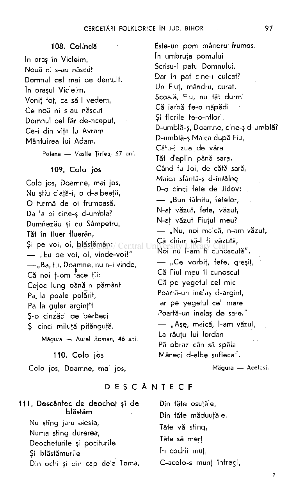

Este-un pom mândru frumos. In umbruţa pomului Scrisu-i patu Domnului. Dar în pat cine-i culcat? Un Fiuţ, mândru, curat. Scoală, Fiu, nu tăt durmi Că iarbă fe-o năpădi Şi florile te-o-nflori. D-umblă-ş, Doamne, cine-ş d-umblă? D-umblă-ş Maica după Fiu, Câtu-i zua de văra Tăt d'eplin până sara. Când fu Joi, de cătă sară, Maica sfântă-ş d-întâlnş D-o cinci fete de Jidov:

108. Colindă In oraş în Vicleim, Nouă ni s-au născut Domnul cel mai de demult, în oraşul Vicleim, Venit tof, ca să-l vedem, Ce noă ni s-au născut Domnul cel făr de-nceput, Ce-i din viţa Iu Avram Mântuirea lui Adam.

i 57 ani.

Poiana — Vasîle Ţj

l

r

ea

109. Colo jos Colo jos, Doamne, mai jos, Nu ştiu ciaţă-i, o d-albeaţă, O turmă de oi frumoasă. Da la oi cine-ş d-umbla? Dumnezău şi cu Sâmpetru, Tăt în fluer fluerân, Şi pe voi, oi, blăstămân:

— „Bun tâlnitu, fetelor, N-aţ văzut, fete, văzut, N-aţ văzut Fiuţul meu?

— „Nu, noi maică, n-am văzut, Că chiar să-l fi văzută, Noi nu l-am fi cunoscută".

— „Eu pe voi, oi, vinde-voi!"

— „Ce vorbit, fete, greşit, Că Fiul meu îi cunoscut Că pe yegetul cel mic Poartă-un inelaş d-argint, Iar pe yegetul cel mare Poartă-un inelaş de sare."

— „Ba, tu, Doamne, nu n-i vinde, Că noi ţ-om face ţii: Cojoc lung pănă-n pământ, Pa. la poale polărit, Pa la guler arginţît Ş-o cinzăci de berbeci Şi cinci miluţă pitănguţă.

— „Aşş, maică, l-am văzut, La râuţu lui Iordan Pă obraz cân să spăla Mâneci d-albe sufleca".

Măgura — Aurel Roman, 46 ani.

110. Colo jos Colo jos, Doamne, mai jos,

Măgura — Acelaşi.

D E S C Â

N T E C E

111. Descântec de deochef şi de blăstăm Nu stîng jaru aiesfa, Numa stîng durerea, Deocheturile şi pociturile Şi blăstămurile Din ochi şi din cap dela Torna,

Din täte osuţăle, Din täte măduuţăle. Täte vă stîng, Täte să merţ în codrii muţ, C-acolo-s munţ întregi,

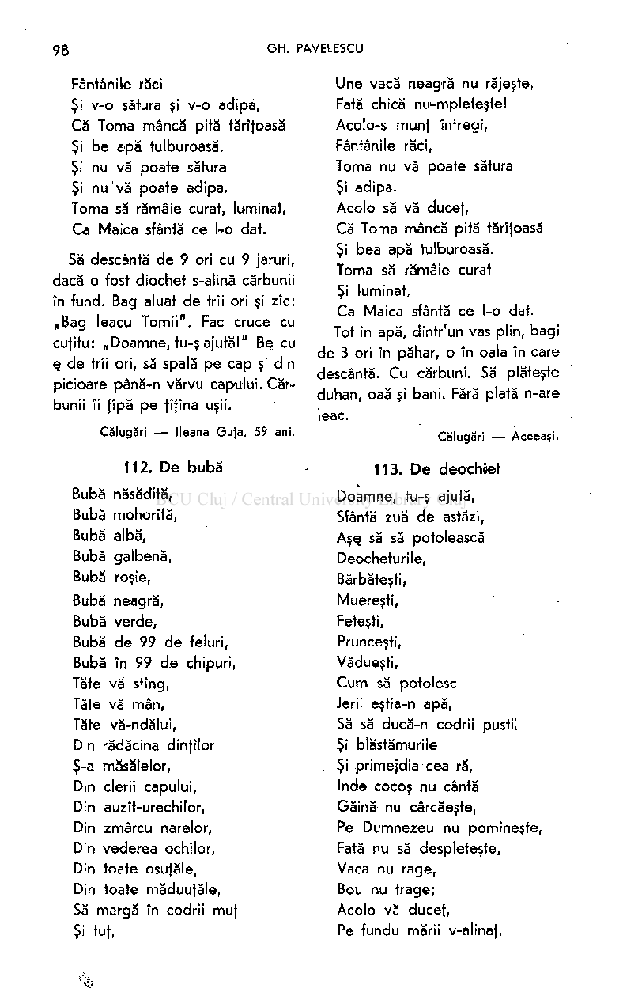

Une vacă neagră nu răjeşte, Fată chică nu-mpleteşte! Acolo-s munt întregi, Fântânile răci, Torna nu vă poate sătura Şi adipa.

Fântânile răci Şi v-o sătura şi v-o adipa, Că Torna mânca pită tărîfoasă Şi be apă tulburoasă. Şi nu va poate sătura Şi nu vă poate adipa. Torna să rămâie curat, luminat, Ca Maica sfântă ce l-o dat.

Acolo să vă ducet, Că Torna mancă pită tărîtoasă Şi bea apă tulburoasă. Torna să rămâie curat Şi luminat, Ca Maica sfântă ce l-o dat.

Să descântă de 9 ori cu 9 jaruri, dacă o fost diochet s-alină cărbunii în fund. Bag aluat de trîi ori şi zîc: „Bag leacu Tomii". Fac cruce cu cufîtu: „Doamne, tu-ş ajută!" Be cu e de trîi ori, să spală pe cap şi din picioare până-n vărvu capului. Cărbunii îi fîpă pe fîfîna uşii.

Tot în apă, dintr'un vas plin, bagi de 3 ori în pahar, o în oala în care descântă. Cu cărbuni. Să plăteşte duhan, oaă şi bani. Fără plată n-are leac.

Călugări — Ileana Gufa, 59 ani.

Călugări — Aceeaşi.

112. De bubă Bubă năsădită, Bubă mohorîtă, Bubă albă, Bubă galbenă, Bubă roşie, Bubă neagră, Bubă verde, Bubă de 99 de feluri, Bubă în 99 de chipuri, Täte vă stîng, Täte vă mân, Täte vă-ndălui, Din rădăcina dinfîlor Ş-a măsălelor, Din clerii capului, Din auzît-urechilor, Din zmârcu narelor, Din vederea ochilor, Din toate osufăle, Din toate măduufăle, Să margă în codrii mut Şi tuf,

113. De deochieit Doamne, tu-ş ajută, Sfântă zuă de astăzi, Aşş să să potolească Deocheturile, Bărbăteşti, Muereşti, Feteşti, Prunceşti, Vădueşti, Cum să potolesc Jerii eştia-n apă, Să să ducă-n codrii pustii Şi blăstămurile Şi primejdia cea ră, Inde cocoş nu cântă Găină nu cârcăeşte, Pe Dumnezeu nu pomineşte, Fată nu să despleteşte, Vaca nu rage, Bou nu trage; Acolo vă ducef, Pe fundu mării v-alina},

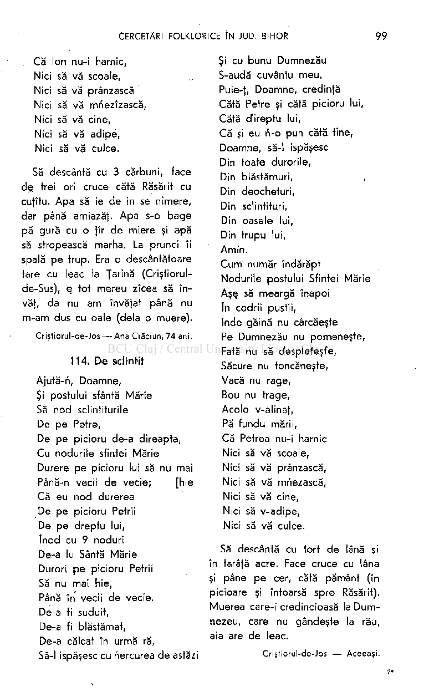

Şi cu bunu Dumnezău S-audă cuvântu meu. Puie-t, Doamne, credinţă Cătă Petre şi cătă picioru lui, Cătă direptu lui, Că şi eu n-o pun cătă tine, Doamne, să-l ispăşesc Din toate durorile, Din blăstămuri, , Din deocheturi, Din sclintituri, Din oasele lui, Din trupu lui, Amin. Cum număr îndărăpt Nodurile postului Sfintei Mărie Aşş să meargă înapoi în codrii pustii, Inde găină nu cârcăeşte Pe Dumnezău nu pomeneşte, Fată nu să despleteşte, Săcure nu toncăneşte, Vacă nu rage, Bou nu trage, Acolo v-alinat, Pă fundu mării, Că Petrea nu-i harnic Nie Nie Nici Nie Nici Nie

Că Ion nu-i harnic, Nici să vă scoale, Nici să vă prânzască Nici să vă mnezîzască, Nici să vă cine, Nici să vă adipe, Nici să vă culce.

Să descântă cu 3 cărbuni, face dg trei ori cruce cătă Răsărit cu cufîtu. Apa să ie de in se nimere, dar până amiază}. Apa s-o bage pă gură cu o jîr de miere şi apă

- să stropească marha. La prunci îi spală pe trup. Era o descântătoare tare cu leac la Ţarină (Criştiorulde-Sus), e, tot mereu zîcea să învăţ, da nu am învăţat până nu m-am dus cu oale (delà o muere).

Criştiorul-de-Jos — Ana Crăciun, 74 ani.

114. De sclintit

Ajută-h, Doamne, Şi postului sfântă Mărie Să nod sclintiturile De pe Petre, De pe picioru de-a direapta, Cu nodurile sfintei Mărie Durere pe picioru lui să nu mai Până-n vecii de vecie; [hie Că eu nod durerea De pe picioru Petrii De pe dreptu lui, Inod cu 9 noduri De-a Iu Sântă Mărie Durori pe picioru Petrii Să nu mai hie, Până în vecii de vecie. De-a fi suduit, De-a fi blăstămat, De-a călcat în urmă ră, Să-I ispăşesc cu nercurea de astăzi

să vă scoale, să vă prânzască, să vă mnezască, să vă cine, să v-adipe, să vă culce.

Să descântă cu tort de lână si în tarâfă acre. Face cruce cu lâna şi pâne pe cer, cătă pământ (în picioare şi întoarsă spre Răsărit). Muerea care-i credincioasă la Dumnezeu, care nu gândeşte la rău, aia are de leac.

Criştiorul-de-Jos — Aceeaşi.

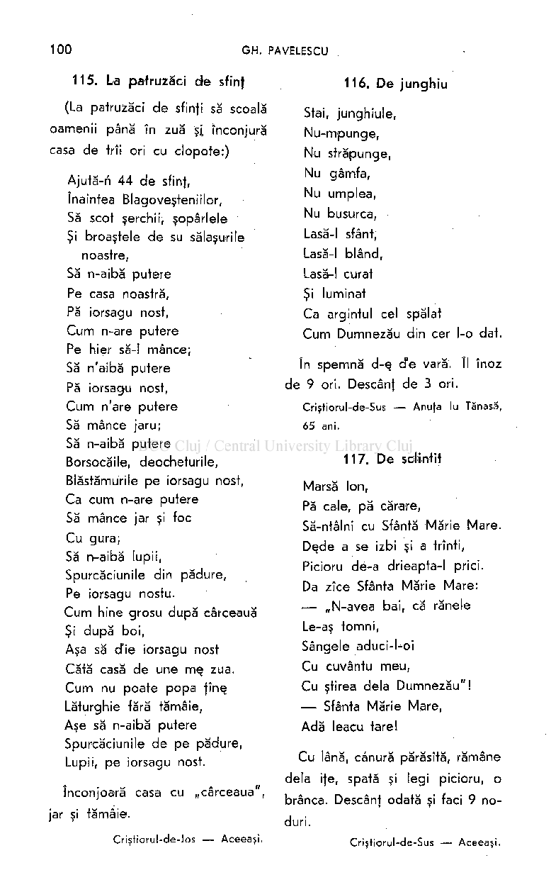

115. La patruzăci de sfinj

116. De junghiu Stai, junghiule, Nu-mpunge, Nu străpunge, Nu gâmfa, Nu umplea, Nu busurca, Lasă-I sfânt, Lasă-I blând, Lasă-l curat Şi luminat Ca argintul cel spălat Cum Dumnezau din cer l-o dat.

(La patruzăci de sfinfi să scoală oamenii până în zuă şi înconjură casa de trîi ori cu clopote:)

Ajută-iî 44 de sfinf, înaintea Blagoveşteniilor, Să scot şerchii, şopârlele Şi broaştele de su sălaşurile

noastre, Să n-aibă putere Pe casa noastră, Pă iorsagu nost, Cum n-are putere Pe hier să-l mance; Să n'aibă putere Pă iorsagu nost, Cum n'are putere Să mance jaru; Să n-aibă putere Borsocăile, deocheturile, Blăstămurile pe iorsagu nost, Ca cum n-are putere Să mance jar şi foc Cu gura; Să n-aibă lupii, Spurcăciunile din pădure, Pe iorsagu nostu. Cum hine grosu după cârceauă Şi după boi, Aşa să d'ie iorsagu nost Cătă casă de une mq zua. Cum nu poate popa fînş Lăturghie fără tămâie, Aşe să n-aibă putere Spurcăciunile de pe pădure, Lupii, pe iorsagu nost.

în spemnă d-e, d'e vară. îl înoz de 9 ori. Descânt, de 3 ori.

Criştiorul-de-Sus — Anufa Iu Tănasă, 65 ani.

117. De sclintit

Marsă Ion, Pă cale, pă cărare, Să-ntâlni cu Sfântă Mărie Mare. Dşde a se izbi şi a trînti, Picioru de-a drieapta-l prici. Da zîce Sfânta Mărie Mare:

— „N-avea bai, că rănele Le-aş tomni, Sângele aduci-l-oi Cu cuvântu meu, Cu ştirea delà Dumnezău"!

— Sfânta Mărie Mare, Adă leacu tare!

Cu lână, cânură părăsîtă, rămâne delà iţe, spată şi legi picioru, o brânca. Descânt odată şi faci 9 noduri.

înconjoară casa cu „cârceaua", jar şi tămâie.

Criştiorul-de-Jos — Aceeaşi.

Criştiorul-de-Sus — Aceeaşi.

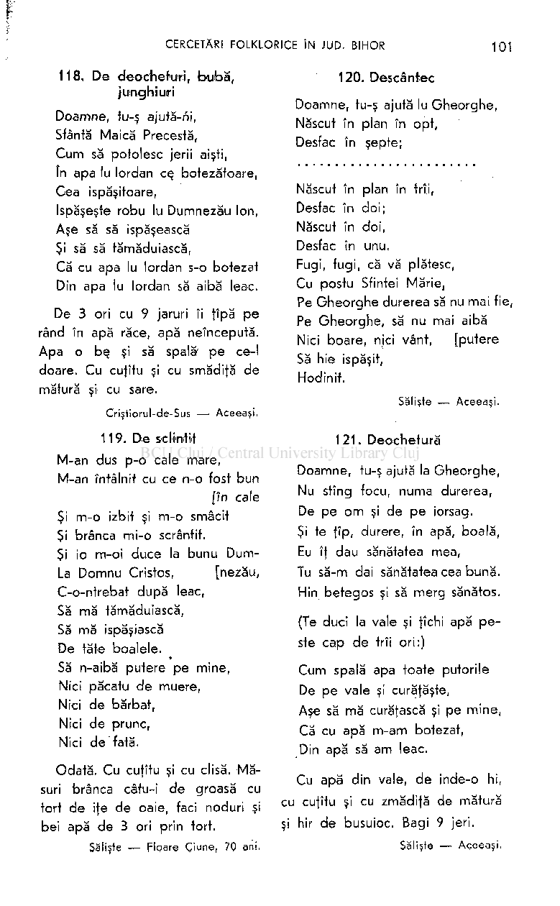

118. De deocheturi, bubă, junghiuri Doamne, tu-ş ajută-hi, Sfântă Maică Precestă, Cum să potolesc jerii aişti, în apa Iu Iordan cq botezătoare, Cea ispăşitoare, Ispăşeşte robu Iu Dumnezău Ion, Aşe să să ispăşească Şi să să tămăduiască, Că cu apa Iu Iordan s-o botezat Din apa Iu Iordan să aibă leac.

120. Descântec

Doamne, tu-ş ajută Iu Gheorghe, Născut în plan în opt, Desfac în şepte;

Născut în plan în trîi, Desfac în doi; Născut în doi, Desfac în unu. Fugi, fugi, că vă plătesc, Cu postu Sfintei Mărie, Pe Gheorghe durerea să nu mai fie, Pe Gheorghe, să nu mai aibă Nici boare, nici vânt, [putere Să hie ispăşit, Hodinit.

De 3 ori cu 9 jaruri îi fîpă pe rând în apă race, apă neîncepută. Apa o bq şi să spală' pe ce-l doare. Cu cuţîtu şi cu smădiţă de mătură şi cu sare.

Sălişte — Aceeaşi.

Criştiorul-de-Sus — Aceeaşi.

119. De sclintit M-an dus p-o cale mare, M-an întâlnit cu ce n-o fost bun

121. Deochetură

Doamne, tu-ş ajută la Gheorghe, Nu stîng focu, numa durerea, De pe om şi de pe iorsag. Şi te ţîp, durere, în apă, boală, Eu îţ dau sănătatea mea, Tu să-m dai sănătatea cea bună. Hin betegos şi să merg sănătos.

fîn cale Şi m-o izbit şi m-o smâcit Şi brânca mi-o scrântit. Şi io m-oi duce la bunu DumLa Domnu Cristos, [nezău, C-o-ntrebat după leac, Să mă tămăduiască, Să mă ispăşiască De täte boalele. Să n-aibă putere pe mine, Nici păcatu de muere, Nici de bărbat, Nici de prunc, Nici de fată.

(Te duci la vale şi ţîchi apă peste cap de trîi ori;)

Cum spală apa toate putorile De pe vale şi curăţăşfe, Aşe să mă curăţască şi pe mine, Că cu apă m-am botezat, Din apă să am leac.

Odată. Cu cufîtu şi cu clisă. Măsuri brânca câtu-i de groasă cu tort de iţe de oaie, faci noduri şi bei apă de 3 ori prin tort.

Cu apă din vale, de inde-o hi, cu cuţîtu şi cu zmădiţă de mătură şi hir de busuioc. Bagi 9 jeri.

Sălişte — Aceeaşi,

Sălişte — Floare Ciune, 70 ani.

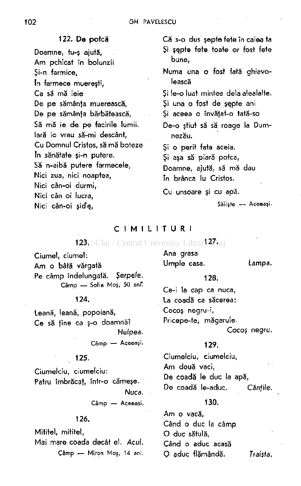

122. De polcă Doamne, tu-ş ajută, Am pchicat în bolunzîi Şi-n farmice, In farmece muereşti, Ca să mă ieie De pe samanfa muerească, De pe sămân|a bărbătească, Să mă ie de pe facirile lumii. Iară io vrau să-mi descânt, Cu Domnul Cristos, să mă boteze în sănătate şi-n putere. Să n-aibă putere farmecele, Nici zua, nici noaptea, Nici cân-oi durmi, Nici cân oi lucra, Nici cân-oi şicfş,

Că s-o dus şepte fete în calea ta Şi şepte fete toate or fost fete

bune, Numa una o fost fată ghiavo-

lească Şi le-o luat mintea delà alealalte. Şi una o fost de şşpte ani Şi aceea o învăfat-o tată-so De-o ştiut să să roage la Dum-

nezău. Şi o perit fata aceia. Şi aşa să piară potca, Doamne, ajută, să mă dau în brânca Iu Cristos. Cu unsoare şi cu apă.

Sălişfe — Aceeaşi.

I T U R I

C I M I L 123.

- 127.

Ana grasa Umple casa. Lampa.

- 128.

Ciumei, ciumei: Am o bâtă vărgată Pe câmp îndelungată. Serpe/e.

Câm p — Sofie Moş, 50 an *

Ce-i la cap ca nuca, La coadă ca săcerea: Cocoş negru-i, Pricepe-te, măgarule.

124. Leană, leană, popoiană, Ce să \\r\e ca ş-o doamnă?

Cocoş negru.

Hulpea.

Câm p — Aceeaşi.

- 129. Ciumelciu, ciumelciu, Am două vaci, De coadă le duc la apă, De coadă le-aduc. Cănfî/e.
- 130.

125. Ciumelciu, ciumelciu: Patru îmbrăcat, într-o cămeşe.

Nuca.

Câm p — Aceeaşi.

Am o vacă, Când o duc la câmp O duc sătulă, Când o aduc acasă O aduc flămândă. Traista,

### 126. Mititel, mititel, Mai mare coada decât el. Acul.

Çâm p — Miron Moş, 14 ani.

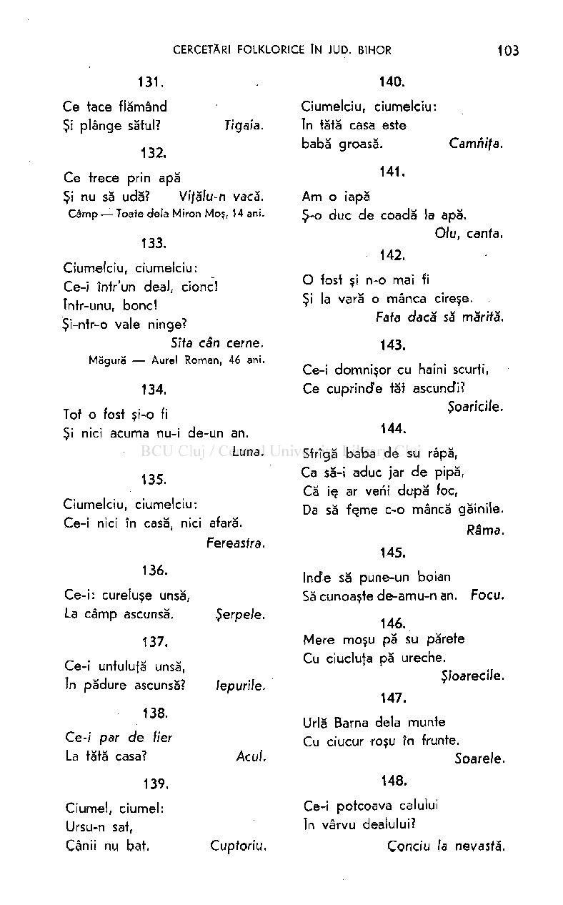

##### 140.

- 131.

Ce tace flămând Şi plânge sătul?

- 132.

Ciumelciu, ciumelciu: în tătă casa este babă groasă.

Tigaia.

Camniţa.

141.

Ce trece prin apă Şi nu să udă? Vităfu-n vacă.

Am o iapă Ş-o duc de coadă la apă.

Câm p — Toate delà Miron Moş, 14 ani.

Ölu, cânta.

133. Ciumelciu, ciumelciu: Ce-i într'un deal, cionc! Într-Unu, bone! Şi-ntr-o vale ninge?

142. O fost şi n-o mai fi Şi la vară o mânca cireşe.

Fata dacă să mărită,

Sîfa câ n cerne.

##### 143.

Măgură — Aurel Roman, 46 ani.

Ce-i domnişor cu haini scurţi, Ce cuprinde tăt ascunefi?

##### 134.

Şoaricile.

Tot o fost şi-o fi Şi nici acuma nu-i de-un an.

##### 144.

Luna.

Strîgă baba de su râpă, Ca să-i aduc jar de pipă, Că ie, ar verii după foc, Da să ferne c-o mancă găinile.

##### 135.

Ciumelciu, ciumelciu: Ce-i nici în casă, nici afară.

Râma. 145.

Fereasira.

##### 136.

IncTe să pune-un boian Să cunoaşte de-amu-n an. Focu.

Ce-i: cureluşe unsă, La câmp ascunsă. Şerpele.

146. Mere moşu pă su părete Cu ciucluta pă ureche.

##### 137.

Ce-i untulufă unsă, în pădure ascunsă? lepurile.

Şioareci/e.

##### 147.

- 138. Ce-i par de fier La tătă casa? Acul.
- 139. Ciumei, ciumei: Ursu-n sat, Cânii nu bat, Cupforiu,

Urlă Bârna delà munte Cu ciucur roşu în frunte.

Soarele.

##### 148.

Ce-i potcoava calului în vârvu dealului?

Çonciu la nevastă.

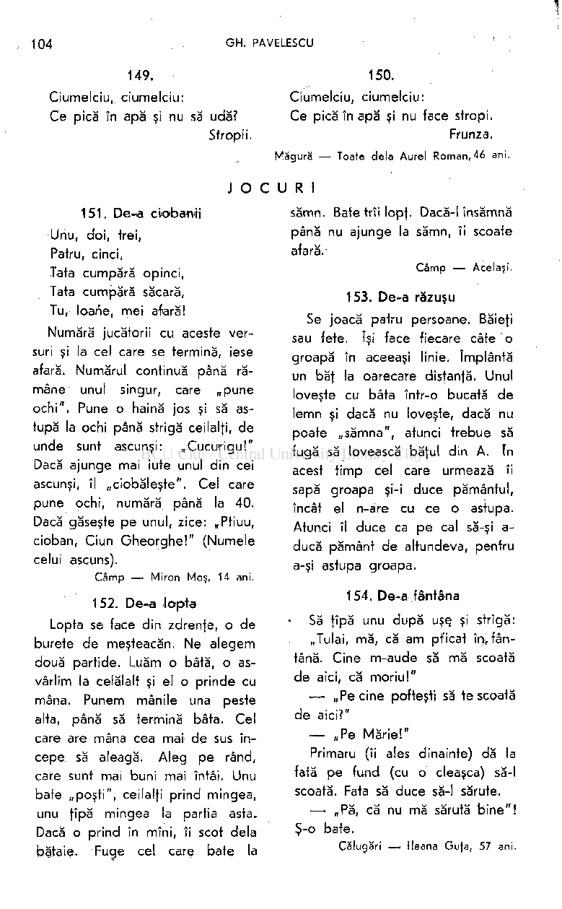

149. Ciumelciu, ciumelciu: Ce pică în apă şi nu să udă?

Ciumelciu, ciumelciu: Ce pică în apă şi nu face stropi.

Frunza.

Stropii,

Măgură — Toate dela Aurel Roman, 46 ani,

C U R I

J O

sămn. Bate trîi lopţ. Dacă-I însămnă până nu ajunge la sămn, îi scoate afară.

151. De-a ciobanii Unu, doi, trei, Patru, cinci, Tata cumpără opinci, Tata cumpără săcară, Tu, Ioane, mei afară!

Câm p — Acelaşi.

153. De-a răzuşu

Se joacă patru persoane. Băieţi sau fete. îşi face fiecare câte o groapă în aceeaşi linie. împlântă un băţ la oarecare distanţă. Unul loveşte cu bâta într-o bucată de lemn şi dacă nu loveşte, dacă nu poate „sămna", atunci trebue să fugă să lovească băţul din A. în acest timp cel care urmează îi sapă groapa şi-i duce pământul, încât el n-are cu ce o astupa. Atunci îl duce ca pe cal să-şi aducă pământ de altundeva, pentru a-şi astupa groapa.

Numără jucătorii cu aceste versuri şi la cel care se termină, iese afară. Numărul continuă până rămâne unul singur, care „pune ochi". Pune o haină jos şi să astupă la ochi până strigă ceilalţi, de unde sunt ascunşi: „Cucurigu!" Dacă ajunge mai iute unul din cei ascunşi, îl „ciobăleşte". Cel care pune ochi, numără până la 40. Dacă găseşte pe unul, zice: „Ptiuu, cioban, Ciun Gheorghe!" (Numele celui ascuns).

Câm p — Miron Moş, 14 ani.

154. De-a fântâna

152. De-a lopta

Să ţîpă unu după uşe. şi strigă: „Tulai, mă, că am pficat în. fân­

Lopta se face din zdrenţe, o de burete de mesteacăn. Ne alegem două partide. Luăm o bâtă, o asvârlim la celălalt şi el o prinde cu mâna. Punem manile una peste alta, până să termină bâta. Cel care are mâna cea mai de sus începe să aleagă. Aleg pe rând, care sunt mai buni mai întâi. Unu bate „posti", ceilalţi prind mingea, unu ţîpă mingea la pârtia asta. Dacă o prind în mîni, îi scot dela

tână. Cine m-aude să mă scoată de aici, că moriu!"

— „Pe cine pofteşti să te scoată de aici?"

— „Pe Mărie!" Primaru (îi ales dinainte) dă la

fată pe fund (cu o cleaşca) să-l scoată. Fata să duce să-l sărute.

— „Pă, că nu mă sărută bine"! Ş-o bate.

Călugări — Ileana Gufa, 57 ani.

- bătaie. Fuge cel care bate la

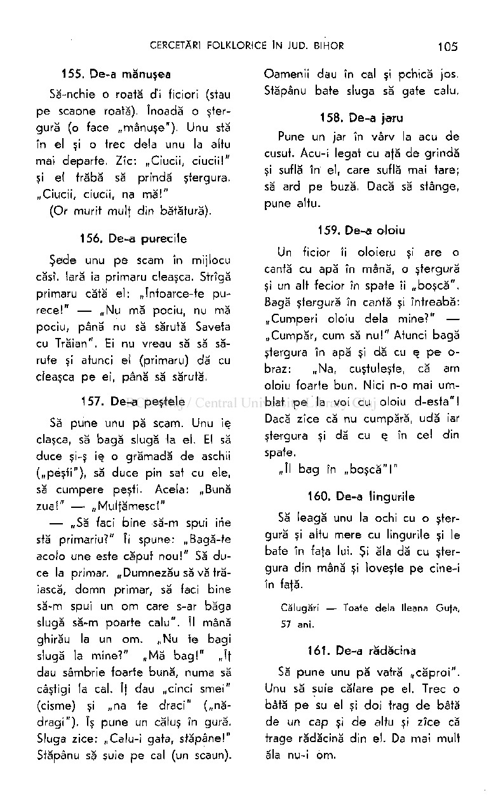

155. De-a mă nu şea

Oamenii dau în cal şi pchică jos. Stăpânu bate sluga să gate calu.

Să-nchie o roată d'i ficiori (stau pe scaone roată). înoadă o ştergură (o face „mânuse"). Unu stă în el şi o trec delà unu la altu mai departe. Zîc: „Ciucii, ciucii!" şi el trăbă să prindă şfergura. „Ciucii, ciucii, na mă!"

158. De-a jaru

Pune un jar în vârv la acu de cusut. Acu-i legat cu aţă de grindă şi suflă în el, care suflă mai tare; să ard pe buză. Dacă să stânge, pune altu.

(Or murit mulţ din bătătură).

159. De-a oîoiu

- 156. De-a purecile Şede unu pe scam în mijlocu

- căsî. Iară ia primam cleaşca. Strîgă primaru cătă el: „Tntoarce-te purece!" — „Nu mă pociu, nu mă pociu, până nu să sărută Saveta cu Trăian". Ei nu vreau să să sărute şi atunci el (primaru) dă cu cleaşca pe ei, până să sărută.

- 157. De-a peştele

Un ficior îi oloieru şi are o cântă cu apă în mână, o ştergură şi un alt fecior în spate îi „boşcă". Bagă ştergură în cântă şi întreabă: „Cumperi oloiu delà mine?" „Cumpăr, cum să nu!" Atunci bagă ştergură în apă şi dă cu ş pe obraz: „Na, cuştuleşte, că am oloiu foarte bun. Nici n-o mai umblat pe la voi cu oloiu d-esta"! Dacă zîce că nu cumpără, udă iar ştergură şi dă cu ş în cel din spate.

Să pune unu pă scam. Unu iş claşca, să bagă slugă la el. El să duce şi-ş \q o grămadă de aşchii („peşti"), să duce pin sat cu ele, să cumpere peşti. Acela: „Bună zua!" — „Multămesc!"

„îl bag în „boşcă"!"

160. De-a lingurile

Să leagă unu la ochi cu o ştergură şi altu mere cu lingurile şi le bate în faţa lui. Şi ăla dă cu ştergură din mână şi loveşte pe cine-i în fafă.

— „Să faci bine să-m spui ine stă primariu?" îi spune: „Bagă-te acolo une este căput nou!" Să duce la primar. „Dumnezău să vă trăiască, domn primar, să faci bine să-m spui un om care s-ar băga slugă să-m poarte calu". îl mână ghirău la un om. „Nu te bagi slugă la mine?" „Mă bag!" „îf dau sâmbrie foarte bună, numa să câştigi la cal. îf dau „cinci smei" (cisme) şi „na te draci" („nădragi"), îş pune un căluş în gură. Sluga zice: „Calu-i gata, stăpâne!" Stăpânu să suie pe cal (un scaun).

Călugări — Toate delà Ileana Guta, 57 ani.

161. De-a rădăcina

Să pune unu pă vatră „căproi". Unu să suie călare pe el. Trec o bâtă pe su el şi doi trag de bâtă de un cap şi de altu şi zîce că trage rădăcină din el. Da mai mult ăla nu-i om.

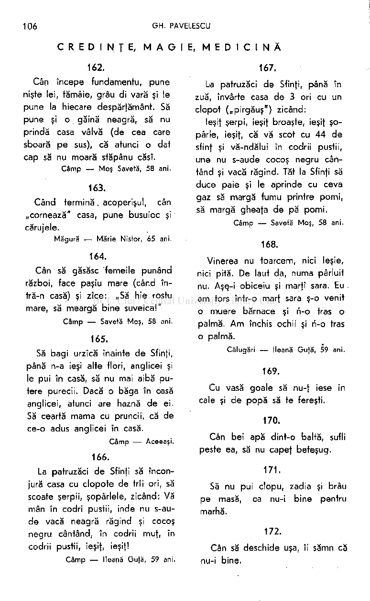

CREDINŢE , MAGIE , MEDICIN Ă

### 162.

### 167.

Cân începe fundamentu, pune nişte lei, tămâie, grâu di vară şi le pune la hiecare despărţământ. Să pune şi o găină neagră, să nu prindă casa vâlvă (de cea care sboară pe sus), că atunci o dat cap să nu moară stăpânu căsî.

La patruzăci de Sfinfi, până în zuă, învârte casa de 3 ori cu un clopot („pirgăuş") zicând:

Ieşif şerpi, ieşif broaşte, ieşif şopârle, ieşif, că vă scot cu 44 de sfinf şi vă-ndălui în codrii pustii, une nu s-aude cocoş negru cântând şi vacă răgind. Tăt la Sfinfi să duce paie şi le aprinde cu ceva gaz să margă fumu printre pomi, să margă gheafa de pă pomi.

Câm p — Moş Savetă, 58 ani.

### 163.

Când termină . acoperişul, cân „cornează" casa, pune busuioc şi cărujele.

Câm p — Savetă Moş, 58 ani.

Măgură — Mărie Nistor, 65 ani.

### 168.

### 164.

Vinerea nu toarcem, nici leşie, nici pită. De laut da, numa pârluit nu. Aşe-i obiceiu şi marfî sara. Eu am tors într-o marf sara ş-o venit

Cân să găsăsc femeile punând

- război, face paşiu mare (când întră-n casă) şi zîce: „Să hie rostu mare, să meargă bine suveica!"

- o muere bărnace şi h-o tras o palmă. Am închis ochii şi n-o tras
- o palmă. Călugări — Ileana Gufă, 59 ani.

Câm p — Savetă Moş, 58 ani.

### 165.

Să bagi urzîcă înainte de Sfinţi, până n-a ieşi alte flori, anglicei şi le pui în casă, să nu mai aibă putere purecii. Dacă o băga în casă anglicei, atunci are haznă de ei. Să ceartă mama cu pruncii, că de ce-o adus anglicei în casă.

### 169.

Cu vasă goale să nu-f iese în cale şi de popă să te fereşti.

### 170.

Cân bei apă dint-o baltă, sufli peste ea, să nu capef beteşug.

Câm p — Aceeaşi.

### 166.

### 171.

La patruzăci de Sfinfi să înconjură casa cu clopote de trîi ori, să scoate şerpii, şopârlele, zicând: Vă mân în codri pustii, inde nu s-aude vacă neagră răgind şi cocoş negru cântând, în codrii muf, în codrii pustii, ieşif, ieşit!

Să nu pui clopu, zadia şi brâu pe masă, ca nu-i bine pentru marhă.

### 172.

Cân să deschide uşa, îi sămn că nu-i bine,

Câm p — Ileana Gufa, 59 ani.

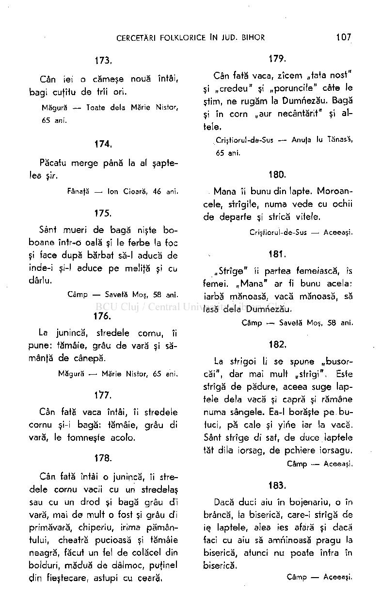

179.

Cân fată vaca, zîcem „tata nost" şi „credeu" şi „poruncile" câte le ştim, ne rugăm la Dumnezău. Bagă şi în corn „aur necântărit" şi altele.

Cân iei o cămeşe nouă întâi, bagi cuţîtu de trîi ori.

Măgură — Toate delà Mărie Nistor, 65 ani.

Criştiorul-de-Sus — Anu'a Iu TănasS, 65 ani.

174.

Păcatu merge până la al şaptelea şir.

180.

Mana îi bunu din lapte. Moroancele, strîgile, numa vede cu ochii de departe şi strică vitele.

Fânafă — Ion Cioară, 46 ani.

175.

Sânt mueri de bagă nişte boboane într-o oală şi le ferbe la foc şi face după bărbat să-l aducă de inde-i şi-l aduce pe melifă şi cu dârlu.

Criştiorul-de-Sus — Aceeaşi.

181.

„Strîge" îi partea femeiască, îs femei. „Mana" ar fi bunu acela: iarbă mănoasă, vacă mănoasă, să lasă delà Dumnezău.

Câm p — Savefă Moş, 58 ani.

176.

Câm p — Savetă Moş, 58 ani.

La junincă, stredele cornu, îi pune: tămâie, grâu de vară şi sămânfă de cânepă.

182.

La strigoi li se spune „busorcăi", dar mai mult „strîgi". Este strîgă de pădure, aceea suge laptele delà vacă şi capră şi rămâne numa sângele. Ea-I borăşte pe butuci, pă cale şi yine iar la vacă. Sânt strîge di sat, de duce laptele tăt di la iorsag, de pchiere iorsagu.

Măgură — Mărie Nistor, 65 ani.

177.

Cân fată vaca întâi, îi stredele cornu şi-i bagă: tămâie, grâu di vară, le fomneşfe acolo.

178.

Câm p — Aceeaşi,

Cân fată întâi o junincă, îi stredele cornu vacii cu un stredelaş sau cu un drod şi bagă grâu d'i vară, mai de mult o fost şi grâu cTi primăvară, chiperiu, irima pământului, cheatră pucioasă şi tămâie neagră, făcut un fel de colăcel din bolduri, măduă de dâlmoc, pufinel din fieştecare, astupi cu ceară.

183.

Dacă duci aiu în bojenariu, o în brâncă, la biserică, care-i strîgă de \q laptele, alea ies afară şi dacă faci cu aiu să amninoasă pragu la biserică, atunci nu poate întră în biserică.

Câm p — Aceeaşi,

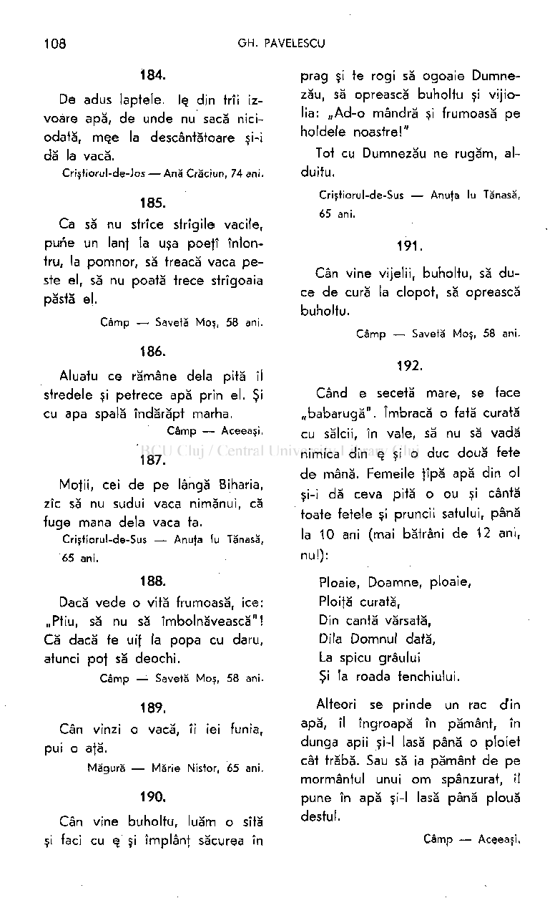

prag şi te rogi să ogoaie Dumnezău, să oprească buholtu şi vijiolia: „Ad-o mândră şi frumoasă pe holdele noastre!"

De adus lapfele. le, din trîi izvoare apă, de unde nu sacă niciodată, mşe la descântătoare şi-i dă la vacă.

Tot cu Dumnezău ne rugăm, alduitu.

Cn'şfiorul-de-Jos — Ană Crăciun, 74 ani.

Criştiorul-de-Sus — Anufa Iu Tănasă, 65 ani.

185.

Ca să nu strice strîgile vacile, pune un lanţ la uşa poefî înlontru, la pomnor, să treacă vaca peste el, să nu poată trece strîgoaia pastă el.

191.

Cân vine vijelii, buholtu, să duce de cură la clopot, să oprească buholtu.

Câm p — Savetă Moş, 58 ani.

Câm p — Savetă Moş, 58 ani.

186.

192.

Aluatu ce rămâne delà pită îl stredele şi petrece apă prin el. Şi cu apa spală îndărăpt marha.

Când e secetă mare, se face „babarugă". îmbracă o fată curată cu sălcii, în vale, să nu să vadă nimica din e. şi o duc două fete de mână. Femeile ţîpă apă din ol şi-i dă ceva pită o ou şi cântă toate fetele şi pruncii satului, până la 10 ani (mai bătrâni de 12 ani, nul):

Câm p — Aceeaşi.

187.

Mofii, cei de pe lângă Biharia, zîc să nu sudui vaca nimănui, că fuge mana delà vaca ta.

Criştiorul-de-Sus — Anufa Iu Tănasă, 65 ani.

188.

Ploaie, Doamne, ploaie, Ploifă curată, Din cântă vărsată, Dila Domnul dată, La spicu grâului Şi la roadă tenchiului.

Dacă vede o vită frumoasă, ice: „Ptiu, să nu să îmbolnăvească"! Că dacă te uif la popa cu daru, atunci pot să deochi.

Câm p — Savetă Moş, 58 ani.

Alteori se prinde un rac din apă, îl îngroapă în pământ, în dunga apii şi-l lasă până o ploiet cât trăbă. Sau să ia pământ de pe mormântul unui om spânzurat, îl pune în apă şi-l lasă până plouă destul.

189.

Cân vinzi o vacă, îi iei funia, pui o aţă.

Măgură — Mărie Nistor, 65 ani.

190.

Cân vine buholfu, luăm o sîtă şi faci cu e, şi împlânt săcurea în

Câmp — Aceeaşi,

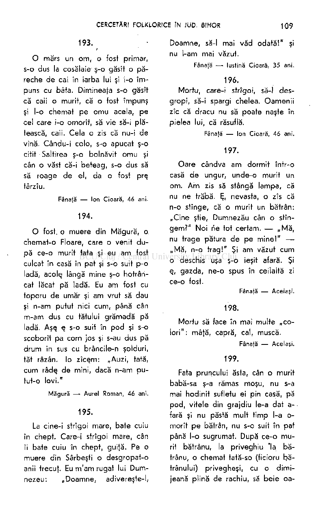

Doamne, să-l mai văd odată!" şi nu l-am mai văzut.

r

O mărs un om, o fost primar, s-o dus la cosălaie ş-o găsît o păreche de cai în iarba lui şi i-o împuns cu bâta. Dimineaţa s-o găsît că caii o murit, că o fost împuns şi l-o chemat pe omu acela, pe cel care i-o omorît, să vie să-i plătească, caii. Cela o zis că nu-i de vină. Cându-i colo, s-o apucat ş-o citit Saltirea ş-o bolnăvit omu şi cân o văst că-i beteag, s-o dus să

Fânafă — Iustină Cioară, 35 ani.

196.

Mortu, care-i strîgoi, să-l desgropi, să-i spargi chelea. Oamenii zîc că dracu nu să poate naşte în pielea lui, că răsuflă.

Fânafă — Ion Cioară, 46 ani.

197.

Oare cândva am dormit într-o casă de ungur, unde-o murit un om. Am zis să stângă lampa, că nu ne trăbă. E., nevasta, o zîs că n-o stinge, că o murit un bătrân: „Cine ştie, Dumnezău cân o stingem?" Noi ne tot certam. — „Mă, nu trage pătura de pe mine!" „Mă, n-o trag!" Şi am văzut cum o deschis uşa ş-o ieşit afară. Şi q, gazda, ne-o spus în ceilaltă zi ce-o fost.

- să roage de el, da o fost pre, târzîu,

Fânafă — Ion Cioară, 46 ani.

194.

O fost. o muere din Măgură, o chemat-o Floare, care o venit du­

- pă ce-o murit tata şi eu am fost culcat în casă în pat şi s-o suit p-o ladă, acole. lângă mine ş-o hotrâncat lăcat pă ladă. Eu am fost cu toporu de umăr şi am vrut să dau şi n-am putut nici cum, până cân m-am dus cu fătului grămadă pă ladă. Aşe. q s-o suit în pod şi s-o scoborît pa corn jos şi s-au dus pă drum în sus cu brâncile^n şolduri,

- tăt râzân. Io zîcşm: „Auzi, tată, cum râde. de mini, dacă n-am putut-o lovi."

Fânafă — Acelaşi.

198.

Mortu să face în mai multe „colori": mâfă, capră, cal, muscă.

Fânafă — Acelaşi.

199.

Fata pruncului ăsta, cân o murit babă-sa ş-a rămas moşu, nu s-a mai hodinit sufletu ei pin casă, pă pod, vitele din grajdiu le-a dat afară şi nu pastă mult timp l-a omorît pe bătrân, nu s-o suit în pat până l-o sugrumat. După ce-o murit bătrânu, la priveghiu 'la bătrânu, o chemat tată-so (ficioru bătrânului) privegheşi, cu o dimijeană plină de rachiu, să beie oa-

Măgură — Aurel Roman, 46 ani.

195.

La cine-i strîgoi mare, bate cuiu în chept. Care-i strîgoi mare, cân îi bate cuiu în chept, guifă. Pe o muere din Sârbeşti o desgropaf-o anii trecut. Eu m'am rugat lui Dumnezeu: „Doamne, adivereşte-l,

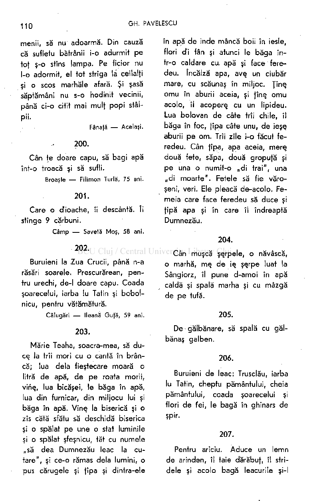

în apă de inde mancă boii în iesle, flori cTi fân şi atunci le băga într-o căldare cu apă şi face feredeu. încălză apa, ave. un ciubăr mare, cu scăunaş în miljoc. Ţîne. omu în aburii aceia, şi Jînş omu acolo, îl acopere, cu un lipideu. Lua bolovan de câte trîi chile, îl băga în foc, fîpa câte unu, de ieşe. aburii pe om. Trîi zîle i-o făcut feredeu. Cân fîpa, apa aceia, mers două fete, săpa, două gropufă şi pe una o numit-o „di trai", una „di moarte". Fetele să fie văroşeni, veri. Ele pleacă de-acolo. Femeia care face feredeu să duce şi tîpă apa şi în care îl îndreaptă Dumnezău.

menii, să nu adoarmă. Din cauză că sufletu bătrânii i-o adurmit pe toţ ş-o stîns lampa. Pe ficior nu l-o adormit, el tot strîga lâ ceilalţi şi o scos marhăle afară. Şi şasă săptămâni nu s-o hodinit vecinii, până ci-o citit mai mulf popi stâlpii.

Fâna|ă — Acelaşi.

200.

Cân te doare capu, să bagi apă înt-o troacă şi să sufli.

Broaşte — Filimon Turlă, 75 ani.

### 201.

Care o cTioache, îi descântă. îi stinge 9 cărbuni.

Câm p — Savetă Moş, 58 ani.

### 204.

### 202.

Cân muşcă şşrpele, o năvâscă, o marhă, mç de ie. şejpe luat la Sângiorz, îl pune d-amoi în apă caldă şi spală marha şi cu mâzgă de pe tufă.

Buruieni la Zua Crucii, până n-a

- răsări soarele. Prescurărean, pentru urechi, de-l doare capu. Coada şoarecelui, iarba Iu Tatin şi bobolnicu, pentru vătămătură.

### 205.

Călugări — Ileana Gută, 59 ani.

De gălbănare, să spală cu gălbănaş galben.

### 203.

Mărie Teaha, soacra-mea, să ducs la trîi mori cu o cântă în brâncă; lua delà fieştecare moară o litră de apă, de pe roata morii, vinş, lua bicăşei, le băga în apă, lua din furnicar, din miljocu lui şi

### 206.

Buruieni de leac: Trusclău, iarba Iu Tatin, cheptu pământului, cheia pământului, coada şoarecelui şi flori de fei, le bagă în ghinars de şpir.

- băga în apă. Vinş la biserică şi o zîs cătă sfătu să deschidă biserica şi o spălat pe une o stat luminile şi o spălat şfeşnicu, tăt cu numele „să dea Dumnezău leac la cutare", şi ce-o rămas delà lumini, o pus cărugele şi fîpa şi dintra-ele

### 207.

Pentru ariciu. Aduce un lemn de arinden, îl taie dărăbut, îl strictele şi acolo bagă leacurile şi-l

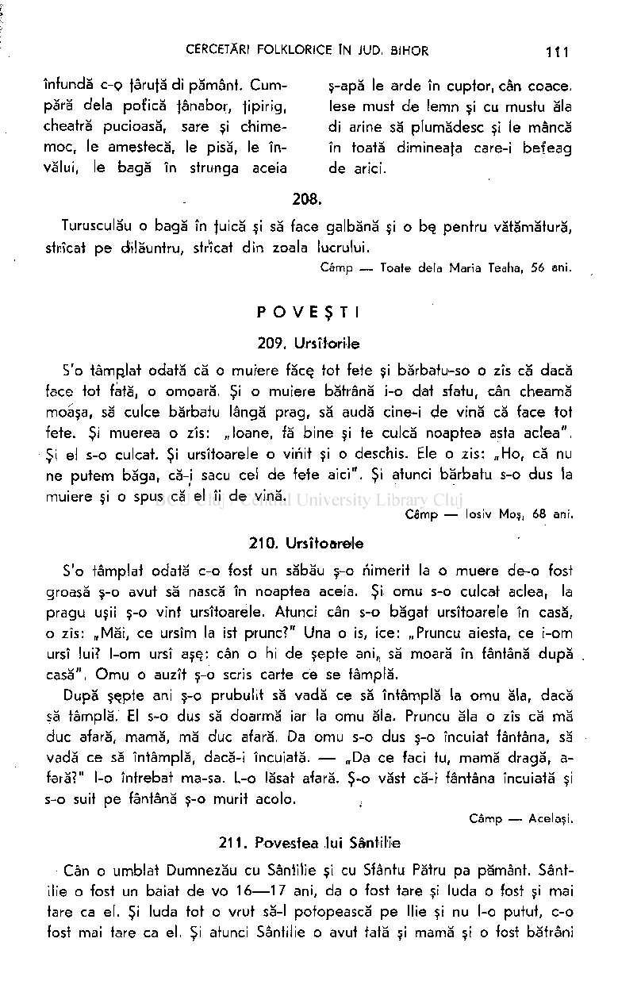

înfundă c-o Jârufă di pământ. Cumpără delà pofică ţânabor, fipirig, cheatră pucioasă, sare şi chimemoc, le amestecă, le pisă, le învălui, le bagă în strunga aceia

ş-apă le arde în cuptor, cân coace, lese must de lemn şi cu mustu ăla di arine să plumădesc şi le mancă în toată dimineafa care-i befeag de arici.

208.

Turusculău o bagă în fuică şi să face galbănă şi o bş pentru vătămătură, strîcat pe dilăuntru, stricat din zoala lucrului.

Câm p — Toate delà Maria Teaha, 56 ani.

POVEŞT

209. Ursîtorile

S'o tâmplat odată că o murere făcş tot fete şi bărbatu-so o zîs că dacă face tot fată, o omoară. Şi o muiere bătrână i-o dat sfatu, cân cheamă moaşa, să culce bărbatu lângă prag, să audă cine-i de vină că face tot fete. Şi muerea o zîs: „Ioane, fă bine şi te culcă noaptea asta aclea". Şi el s-o culcat. Şi ursîtoarele o vihit şi o deschis. Ele o zis: „Ho, că nu ne putem băga, că-i sacu cel de fete aici". Şi atunci bărbatu s-o dus la muiere şi o spus că el îi de vină.

Câm p — losiv Moş, 68 ani.

210. Ursîtoarele

S'o tâmplat odată c-o fost un săbău ş-o nimerit la o muere de-o fost groasă ş-o avut să nască în noaptea aceia. Şi omu s-o culcat aclea, la pragu uşii ş-o vint ursîtoarele. Atunci cân s-o băgat ursîtoarele în casă, o zîs: „Măi, ce ursîm la ist prunc?" Una o is, ice: „Pruncu aiesta, ce i-om ursî lui? l-om ursî aşe.: cân o hi de şepte ani,, să moară în fântână după casă". Omu o auzît ş-o scris carte ce se tâmplă.

După şepte ani ş-o prubulit să vadă ce să întâmplă la omu ăla, dacă

- să tâmplă. El s-o dus să doarmă iar la omu ăla. Pruncu ăla o zîs că mă duc afară, mamă, mă duc afară. Da omu s-o dus ş-o încuiat fântâna, să vadă ce să întâmplă, dacă-i încuiată. — „Da ce faci tu, mamă dragă, afară?" I-o întrebat ma-sa. L-o lăsat afară. Ş-o văst că-i fântâna încuiată şi s-o suit pe fântână ş-o murit acolo.

Câm p — Acelaşi.

211. Povestea lui Sântilie

Cân o umblat Dumnezău cu Sântilie şi cu Sfântu Patru pa pământ. Sântilie o fost un băiat de vo 16—17 ani, da o fost tare şi luda o fost şi mai tare ca el. Şi luda tot o vrut să-l potopească pe Nie şi nu l-o putut, c-o fost mai tare ca el. Şi atunci Sântilie o avut tată şi mamă şi o fost bătrâni

şi ei, o mărs la preumblare ţînându-să de mâni, Sântilie o mărs să să loapte afară. Sântilie o luat pe luda şi l-o băgat de-o jumătate meter în pământ, luda iar l-o prins pe Sântilie şi nu l-o putut băga pă Sântilie decât o palmă. A trăia oară, l-o băgat Sântilie pă luda până în gurmazi. „No, o zîs luda cătă Sântilie, ne prindem fartaţ, că acum noi sântem tari şi nu ne mai poate bate nime"! — „Noi, zîce mai departe luda, noi am trăi bine, dacă n-ar fi oamenii ăşti care mărg la preumblare" (oamenii erau cu spatele cătă ei). — No, lasă, ice Sântilie, că-i găt eu He pe lume". S-o luat şi s-o dus şi o dat cu sabia în ma-sa ş-o picat jos. Ş-o dat cu sabia în tată-so şi l-o omorît". Da atunci tată-so s-o întors cu capu cătă el şi l-o văzut că-i tată-so.

După ce l-o omorît, s-o dus Sântilie la nouăzăcişinouă de popi, să spuie ce păcate are el şi pe toţ i-o omorît, că niciunul nu i-o putut face canonu. Până o ajuns la un călugăr şi o zîs călugăru: „No, stai aci la masă, cu un pahar de vin şi un fîpoi de pită". Şi călugăru o închis iute uşa pe el. Da aclea l-o găsît la anu şi llie avea barbă până la piept şi albă şi el o adurmit,acolo. Şi llie o zîs că nu să poate scula. — „No, zice călugăru, te-nburdă cu scaonul jos şi te roagă de pământ să te ierte, că Dumnezău te-o iertat". Şi s-o rugat şi s-o sculat iar tânăr, cum o fost şl s-o dus la Dumnezău: „Doamne, îmi dă armele tale să mărg eu a tuna cu ele". — „Mă llie, armele mele îs foarte grele şi mă tem că te-i vătăma cu eile". „N-ai bai, grija mea de ele". Şi i-o dat armele. Sântilie s-o apucat a trâşni după luda şi l-o prins şi l-o băgat în lanţ şi o zîs că atâta robie ai, până îs Pastile în Maiu (da Pastile totdeauna-s în Prier), luda tot aşa zîce: „Paşti în Maiu, Paşti în Maiu" până să scapă de zîce: „Paşti în Prier". Şi atunci iar să îngroaşe lanţu şi nu poate scăpa.

Cân o is de-o mărs de fafă la Dumnezău, luda o făcut mare ciufală cu raiu. O furat, până o fost rob llie, ciubăru botezului, crucea, cădelniţa, hainele de lăturghie, cartia şi le-o adus în iad. Cân o cerut llie armele, o zîs: „Trâşneşte rar şi fulgeră des şi te du în iad şi prinde pe luda". El, cân SrO apropiat de luda, odată: „Bum!" de s-o legănat iadu. „Mă, o hi ieşit tâlharu acela din robie de o trâşnit spurcat aşş". Cân o trâşnit a doua oară, s-o legănat şi mai tare. A trîia oară: „Hâm!" şi s-o despicat iadu în trîi şi o tins fuga. llie o zis: „Nu fugi, leagă-le toate laolaltă şi ie-le în spate, să le punem ine o fost". O mărs apoi la Dumnezău şi o dat legea să hie rob până îs Pastile în Maiu.

Câm p — Irimie Moş, 70 ani

212.

O fost nişte oameni şi s-or dus la lucru şi ei mărgân pe drum li-o ieşit un şşrpe alb pe drum şi l-o omorît. Ei n-o ştiut de ce-i bun, până o auzît, inde-o durmit, de ce-i bun. Da acolo o fost o babă. — „Coată, babă, că

CERCETĂRI FOLKLORICE ÎN JUD. BIHOR 113

noi am găsît un şerpe în drum şi l-am omorît?" „Apă inde-i?" — „Aici". Baba s-o pus ş-o tăiat şerpele tăt dărăburi şi l-o pus pe poliţă şi atunci

- q acleâ o zis (o crezut că dorm oamenii): „Asta-i bun, că cine o mânca din el, ştie ce vorbesc marhăle". Şi ice că o vorovit cocoşu'l cătă ghini: „Cucurigu, ice, din prag, săracu gazdă meu, ce-o păfi el astară, că, ice, muerea clocoteşte o oală de apă, să-l opărească la noaptea asta". Un popă s-o suit călare pe o iapă najosu, la vale. Iapa o zis: „Bată-te Dumnezău, omule, cum nu te pof pricepe să te scobori de pe mine najosu, că greu nu-i mai mare decât aiesta, că te sui pe mine najosu.

Câmp — Todor Nica, 80 ani. 213.

Când o umblat Dumnezău cu Sânchetru pă pământ, atunce o nimerit la o muere săracă, de avş cinci copii, c-o fost băgată o baligă de vacă în foc să ogoaie pruncii, că-i pită. Pruncii tot cereau: „Scoate, maică, pogacea,

- că n-i foame". Da e-i iera ruşine de Sfântu Patru. Da Sfântu Patru ştia şi

- o întrebat: „Da ai făcut pogace, scoate-o şi le dă la copii, că l-i foamei"! Ea n-o avut ce face şi i-o spus la Sânchetru. „Da, ia coată, zîce Sf. Patru, de le dă la copii, să nu mai plângă"! Şi o scos o pită, cât o roată de plug, ca neaua. O zîs: „Doamne, Doamne, ce ne-ai dăruit? Mulfamim Iu Domnu Dumnezău, că ne-a dat". Ş-o scos pogacea şi i-o rugat şi pe ei să mance. Tot Sâmpetru a fost vorovind, Dumnezău n-o fost vorovind. După ce o plecat, Patru o zîs: „Doamne, Doamne, ce mare bine ai făcut, că ai făcut pomană cu femeia aceia"! Şi s-o luat şi s-o dus de acolo. Cân
- o fost pă sară, o nimerit la un bghirău. Şi o fost muerea bghirău. Şi muerea o zîs cătă bărbat: „Eu mă duc în piafă, tu ai să faci aluatu şi coace, fîpă vifei la vaci şi le mulge şi ciupăeşte pruncu şi-l aluă şi mai pof lucra". El o pus apă la foc şi o băgat apa clocotind în ciupă şi copilu
- o fîpat odată ş-o murit. El o crezut că acum s-o alinat şi doarme. S-o dus să coacă. O băgat pita în cuptoriu. O avut nişte gâşte să le dea de mâncare. Gâştele o căfăit cătă el. El o dat cu bâta şi le^o omorît. Muerea o zîs să aleagă şi unt. El, cernând făină, o legat ghiobu deasupra fundului, că s-alege şi untu. Smântână toată s-o vărsat pe fund. O ţipat vifau la vacă. Tăt o supt vacile. O vint un om să-i dee vinars ş-o lăsat vifăii la vaci, o luat cepu la bute. El ş-o dus aminte că-s vifăii la vaci şi o fugit cu cepu în brâncă la vaci. Vinarsul o curs pă jos din hărdău.

Sara o venit Sânchetru cu Dumnezău şi o cerut sălaş. — „V^aş da, oamenii lui Dumnezău, da am o muere yiravă şi îi ghirău şi om avea bai cu ea"! — „Nu-i bai, că ne-om împăca noi cumva cu ea". . . S-o suit'în pat. Dumnezău o fost de cătă părete, Sfântu Patru de cătă răstalnijă. Şi atunci zop, muerea!

— „Bună sara, bărbate:'

1

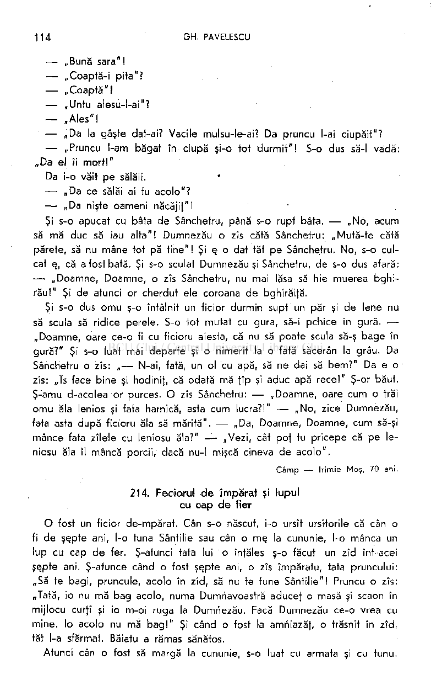

— „Bună sara"!

— „Coaptă-i pita"?

— „Coaptă"!

— „Untu alesu-l-ai"?

— „Ales"!

— „Da la gâşte dat-ai? Vacile mulsu-le-ai? Da pruncu l-ai ciupăit"?

— „Pruncu l-am băgat în ciupă şi-o tot durmit"! S-o dus să-l vadă: „Da el îi mort!"

Da i-o vait pe sălăii.

— „Da ce sălăi ai tu acolo"?

— „Da nişte oameni năcăjit"I

Şi s-o apucat cu bâta de Sânchetru, până s-o rupt bâta. — „No, acum să mă duc să iau alta"! Dumnezău o zîs cătă Sânchetru: „Mută-te cătă părete, să nu mâne tot pă tine"! Şi q o dat tăt pe Sânchetru. No, s-o culcat ş, că a fost bată. Şi s-o sculat Dumnezău şi Sânchetru, de s-o dus afară: — „Doamne, Doamne, o zîs Sânchetru, nu mai lăsa să hie muerea bgh;-

- rău!" Şi de atunci or cherdut ele coroana de bghirăijă. Şi s-o dus omu ş-o întâlnit un ficior durmin supt un păr şi de lene nu
- să scula să ridice perele. S-o tot mutat cu gura, să-i pchice în gură. „Doamne, oare ce-o fi cu ficioru aiesta, că nu să poate scula să-ş bage în gură?" Şi s-o luat mai departe şi o nimerit la o fată săcerân la grâu. Da Sânchetru o zîs: „ — N-ai, fată, un ol cu apă, să ne dai să bem?" Da e o zîs: „îs face bine şi hodinit, că odată mă Jîp şi aduc apă rece!" Ş-or băut. Ş-amu d-acolea or purces. O zîs Sânchetru: — „Doamne, oare cum o trăi omu ăla lenios şi fata harnică, asta cum lucra?!" — „No, zice Dumnezău, fata asta după ficioru ăla să mărită". — „Da, Doamne, Doamne, cum să-şi mance fata zîlele cu leniosu ăla?" — „Vezi, cât pot tu pricepe că pe Isniosu ăla îl mancă porcii, dacă nu-l mişcă cineva de acolo".

Câm p — Irimie Moş, 70 ani.

214. Feciorul de împărat şi lupul ou cap d e fier

O fost un ficior de-mpărat. Cân s-o născut, i-o ursît ursîtorile că cân o fi de şşpte ani, l-o tuna Sântilie sau cân o me. la cununie, l-o mânca un lup cu cap de fer. Ş-atunci tata lui o înfăles ş-o făcut un zîd înt-acei şşpte ani. Ş-atunce când o fost şşpte ani, o zîs împăratu, tata pruncului: „Să te bagi, pruncule, acolo în zîd, să nu te tune Sântilie"! Pruncu o zîs: „Tată, io nu mă bag acolo, numa Dumrîavoastră aducej o masă şi scaon în mijlocu curtî şi io m-oi ruga la Dumnezău. Facă Dumnezău ce-o vrea cu mine. Io acolo nu mă bag!" Şi când o fost la amniază}, o trăsnit în zîd,

- tăt l-a sfărmat. Băiatu a rămas sănătos. Atunci cân o fost să margă la cununie, s-o luat cu armata şi cu tunu.

Şi înt-o vreme vede napoi vinind un lup cu oap cTi fier şi dădeau cu funu, el tăt vinş. Atunci plruncu să ie. şi fuge şi lasă armata şi să duce până

- pă sară la Sfânta Joie. Şi atunci spune ce s-o tâmplat cu ejl. Sfânta Joie îi răspunde: „Băiet'e, te hodineşte, că eu am o căţaua şi-l sîmte de trii mile de pământ ş-atuncia când a bafe, îi pleca şi-i fugi". Şi s-alinat băiatu. Noapfş, într'o vreme, aude căţaua bătând. Ş-atunci tătă zua tăt fuge, până sara. Şi atunci sosăşte la Sfânta Vineri şî-ri spune baiu. Sfânta Vineri îi răspunde: „Te poţ hodini, că am o căţaua şi-l sîmte de şasă mîle de pământ şi când o bate căţaua, îi pleca şi îi fugi mai d'epad'e". Aşe. s-o alinat. Noapte., înt-o vreme, bate căţaua, iar capătă un colac (căpătase şi delà Sfânta Joie!) şi pleacă la drum toată zua. Sara sosăşte la Sfânta Sâm­

- bătă şi-i spune baiu. Sfânta Sâmbătă îi răspunde: „Ti—I hodjpi, că am o
- căţaua şi-l sîmfe de nouă mile de pământ". Şi s-o pus la hodină. Noaptş, într-o vreme, s-aude bătând căţaua ş-atunci îi dă un colac şi pleacă la drum toată zua. Sara sosăşte la Sfânta Duminecă şi-i spune baiu. Sfânta Duminecă zîce: „Ti-i hod'ini, că am o căţaua şi-l sîmte la douăsprăzece mile de pământ şi cân a bafe q, îi pleca la drum". Aşe. să alină. Noaptea, într-o vreme, aude căţaua bătând. Atunci capătă o ştergură şi pleacă la drum. Sfânta Duminecă i-o spus: „Să treci apa asta şi-i pune ştergura peste apă şi s-a face pod şi-i trece acolo. Acolo nu poate să te mancei că nu poate trece apa". Atunci o mărs până la apă ş-o ţipat ştergura pă apă şi i s-o făcut pod. O trecut de ceea parte. Atunci o prins de pod puţjn, i s-o făcut ştergură-napoi.

Atunci o mărs pen pustiu, o umblat multă vreme. A dat pe la o muere ce avş o fată şi avş vo câteva capre. Zîce fata: „Mamă, văd un om, ar fi bun păstoriu la caprele noastre". Mama zîce: „Cheamă-I în casă". Fata merge şi-l cheamă. Mama zîce: „Băiete, nu t'i-i băga slugă la capre?" El zîce: „Ba, da, m-oi băga". Ş-o stat la capre câtva timp. (Din cei trei colaci s-o făcut trei câni. Pă unu Io- chemat „Aud'e-bine", pe unu „Ved'ebirie", pe unu „Greu-ca-pământu").

Şi sta câtva timp şi mama fetii zîce: „Să-l întrebi că ce fel de băiet, d-ind'e vine?" Fata l-o-ntrebat. El i-o răspuns: „Eu sunt fecior de-mpărat ş-am fugit, că o curs un lup cu cap de fqr după mine, să mă mance şi pentru aceia am fugit". Fata merge la mama iei şi-i spune. Mama fetii ice să-l întrebe cum o trecut el apa. El o spus: „Am o ştergură ş-am pus-o pă apă şi s-o făcut pod ş-aşe. am trecut apa. Atunci puţin am tras de pod şi ni s-o făcut ştergura-napoi". Fata merge la ma-sa şi-i spune, că cum o trecut el apa. Mama fetii zîce să-l întrebe, că ind'e ţine el ştergura. Fata l-o-ntrebat că incfe-i ştergura. „La mine", ice. Fata zîce: „Las-o acasă, să n-o perzi pe-acolo, pela capre". Şi o lăsat-o. Ş-atunci fata o mărs cu ştergura la apă şi o ţîpat ştergura pe apă şi o trecut lupu. Şi lupu ăla o fost frate d'e-al fetii. L-o fost blăstămat ma-sa, să-l facă Dumnezău lup cu cap

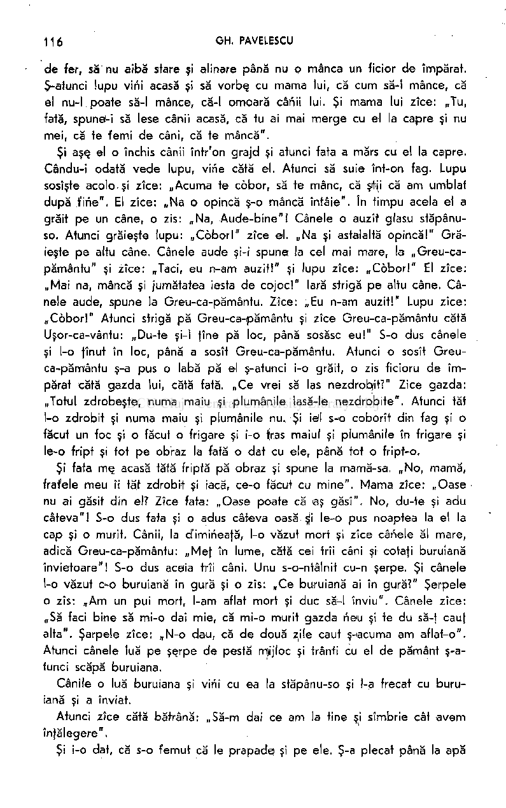

de fer, să nu aibă stare şi alinare până nu p mânca un ficior de împărat. Ş-atunci lupu vini acasă şi să vorbş cu mama lui, că cum să-l mance, că el nu-l poate să-l mance, că-l omoară cânii lui. Şi mama lui zîce: „Tu, fată, spunö-i să lese cânii acasă, că tu ai mai merge cu el la capre şi nu mei, că te femi de câni, că te mancă".

Şi aşş el o închis cânii într'on grajd şi atunci fata a mărs cu el la capre. Cându-i odată vede lupu, vine cătă el. Atunci să suie înt-on fag. Lupu sosîşte acolo-şi zîce: „Acuma te cobor, să te mâne, că ştii că am umblat după fine". El zîce: „Na o opincă ş-o mancă întâie". în timpu acela el a grăit pe un câne, o zis: „Na, Aude-bine"! Cânele o auzît glasu stăpânuso. Atunci grăieşte lupu: „Cobori" zîce el. „Na şi astalaltă opincă!" Grăieşte pe altu câne. Cânele aude şi-i spune la cel mai mare, la „Greu-capământu" şi zîce: „Taci, eu n-am auzit!" şi lupu zîce: „Cobor!" El zîce: „Mai na, mancă şi jumătatea iesta de cojoc!" Iară strigă pe altu câne. Cânele aude, spune la Greu-ca-pământu. Zîce: „Eu n-am auzit!" Lupu zîce: „Cobor!" Atunci strigă pă Greu-ca-pământu şi zîce Greu-ca-pământu cătă Uşor-ca-vântu: „Du-te şi-l ţîne pă loc, până sosăsc eu!" S-o dus cânele şi l-o ţînut în loc, până a sosît Greu-ca-pământu. Atunci o sosît Greuca-pământu ş-a pus o labă pă el ş-atunci i-o grăit, o zis ficioru de împărat cătă gazda lui, cătă fată. „Ce vrei să las nezdrobjit?" Zice gazda: „Totul zdrobeşte, numa maiu şi plumânile lasă-le nezdrobite". Atunci tăt l-o zdrobit şi numa maiu şi plumânile nu. Şi iei s-o coborît din fag şi o făcut un foc şi o făcut o frigare şi i-o tras maiul şi plumânile în frigare şi le-o fript şi tot pe obraz la fată o dat cu ele, până fot o fript-o.

Şi fata mş acasă tătă friptă pă obraz şi spune la mamă-sa. „No, mamă, frafele meu îi tăt zdrobit şi iacă, ce-o făcut cu mine". Mama zîce: „Oase nu ai găsit din el? Zîce fata: „Oase poate că aş găsî". No, du-te şi adu câteva"! S-o dus fata şi o adus câteva oasă ş;i le-o pus noaptea la el la cap şi o murit. Cânii, la efimineaţă, l-o văzut mort şi zîce cânele ăl mare, adică Greu-ca-pământu: „Meţ în lume, cătă cei trîi câni şi cotaţi buruiană învietoare"! S-o dus acaia trîi câni. Unu s-o-ntâlnit cu-n şerpe. Şi cânele l-o văzut c-o buruiană în gură şi o zîs: „Ce buruiană ai în gură?" Şerpele o zîs: „Am un pui mort, l-am aflat mort şi duc să-l înviu". Cânele zîce: „Să faci bine să mi-o dai mie, că mi-o murit gazda rieu şi te du să-f cau[ alta". Şarpele zîce: „N-o dau, că de două zile caut ş-^acuma am aflat-o". Atunci cânele luă pe şşrpe de pestă m)ijloc şi trânti cu el de pământ ş-atunci scăpă buruiana.

Cânile o luă buruiana şi vini cu ea la stăpânu-so şi l-a frecat cu buruiană şi a înviat.

Atunci zîce cătă bătrână: „Să-m dai ce am la tine şi sîmbrie cât avem înţelegere".

Şi i-o dat, că s-o femut că le prapade şi pe ele. Ş-a plecat până la apă

şi o trecut apa cu cânii şi atunci iară s-o făcut trîi colaci din câni, cum o fost dintâie. Ş-a mărs pe la fieştecare zuă şi i-o dat colacii înapoi şi i-a mulţumit. Şi a mărs până la părinf şi aşe. a făcut o nuntă mare, din Paşti până-n Ruştele, de scăuna cânii di jşle. Şi dacă n-o fi murită, ş-amu tăt trăieşte.

Sohodol — Tănasă Ţîgan, 61 ani.

### 215. Petrea Păcurariu

O fost ce-o fost, o fost un ficior, îl chema Petrea ş-o avut o soră. Şi el o fost păcurariu la oi, în pădure. Aşe el ş-o gătat mâncarea ş-o venit acasă ş-o zîs cătă soru-sa: „Soră, dacă maica coace, vin la mine cu mâncare şi cu pită. Că eu-f trag o brazdă dinentea coîibii, delà mine până-n nentea căşii la noi". Aşe el o tras o brazdă. Soru-sa, cân ma-sa o copt, o viriit cu mâncare şi cu pită la el. Da ün câne de zmău o viriit ş-o-nfundat brazda ş-o tras alta dinenteia uşii, delà ii până-nentea uşii la zmău. Fata cân s-o gătat cu mâncarea şi cu pită, s-o luat pă brazdă şi s-o dus pân la zmău acasă.

Aşş, Petrea tăt o aşteptat şi soru-sa n-o mai viriit. Aşş, o virţit înapoi acasă ş-o lăsat oile pe câni. Ş-o zîs: „Maică, dice n-ai andălit pe soru-mea la mirii cu mâncare şi cu pită la mirii?" E: o zis: „Piiiu meu, am andălit!" Aşş, Petrea s-o dus să vadă ind'e-a mers ş-o aflat altă brazdă trasă ş-a iui înfundată, cătă casa zmăului. Aşe, el s-o luat pă brazda aceia, până la zmău. Soru-sa l-o vait de colo, d e supra di a douălea rânduri ş-o zîs: „Fratele mrieu, da cum ai venit aici, că vine zmău şi te potoape şi nu ştiu incTe să te-ascund"! Aşş, ş o zîs: „Fratele meu, suie-te aice sus!" Şi l-o

- băgat sut-o albie. De loc o topotif zmău. O mriirosît pă nas. — „îmi pare
- că am ceva om cfipă lumea albă?" — „Nu ştiu, că n-am ştiinfă!", o spus sora. „Spune, soafa me_ şi draga mş, că nu-i fac nirrfică"! Aşş o spus sora lui, că iacătă-l aici, îi frafe-meu. Atunci o ajutat albia de pe el. Atunci o zîs zmău: „Şogore, ai venit la mirie, pa soru-ta n-o duci, numa haida pîn pădure şi ce-'i vid'ş, să-m spui mriie şi ce-oi vicTe eu, să-f spui fîie"! Aşş, el o aflat o pană frumoasă ş-o gândit Petrea: „Vai, să-ri capăt o nevastă aşe/'! Aşş, cân or eşit din pădure, s-or întâlnit laolaltă, Petrea cu şogoruso. Ş-o întrebat şogoru-so de el: „Ce-ai găsît?" Petrea: — „Nimriică!" „Nu-i cTirept, Petrea, c-ai găsit ceva!" „Am găsît, şogore, o pană ş-am gândit aşş că cfi-aş căpăta o nevastă de-ace, mri-ar păre. bine tare". Aşş zîsă zmău: „îi găsî, şogore, numa dacă-i asculta cuvântu mrieu".

Şi aşa s-o dus la un tău cu lapfi, incfe să scăldau zâriNe: „Şi fe-oi faci, Petre, on rug şi zâna care purie zgarda ii pă fine, tu fe scoală de-acole. şi vină şi oricât a strîga să cof, nu mai cota!" Aşş, o ieşit zîna din lapfi ş-o strigat pă Petre: „Petre Păcurariu, coată-n napoi, cum îf flueră fluerile, cum îf latră cânii, cum îţ sună clopotile!" Petrea o cotat înapoi, că i-o fost

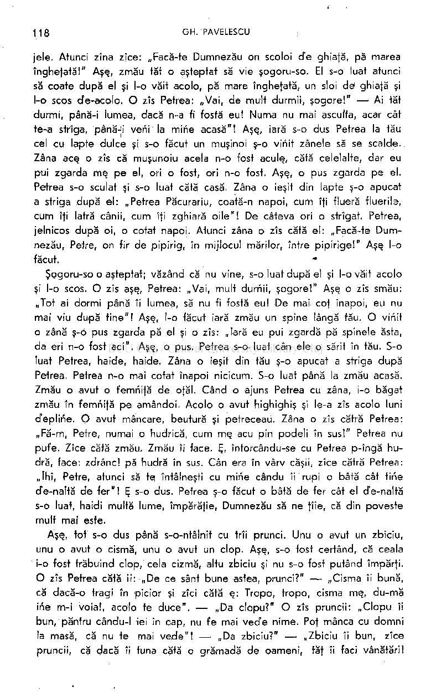

jele. Atunci zîna zîce: „Facă-te Dumnezeu on scoloi d e ghiaţă, pă marea îngheţată!" Aşş, zmău tăt o aşteptat să vie şogoru-so. El s^o luat atunci să coate după el şi l-o văit acolo, pă mare îngheţată, un sloi dö ghiaţă şi l-o scos cTe-acolo. O zîs Petrea: „Vai, de mult durmii, şogore!" — Ai tăt durmi, până-i lumea, dacă n-a fi fostă eu! Numa nu mai asculta, acar cât te-a striga, până-'i veni la mine acasă"! Aşş, iară s-o dus Petrea la tău cel cu lapte dulce şi s-o făcut un muşinoi ş-o vinit zânele să se scalde. Zâna acş o zîs că muşunoiu acela n-o fost aculş, cătă celelalte, dar eu pui zgarda mş pe el, ori o fost, ori n-o fost. Aşş, o pus zgarda pe el. Petrea s-o sculat şi s-o luat cătă casă. Zâna o ieşit din lapte ş-o apucat a striga după el: „Petrea Păcurariu, coată-n napoi, cum îţi flueră fluerile, cum îţi latră cânii, cum îţi zghiară oile"! De câteva ori o strigat. Petrea, jelnicos după oi, o cotat napoi. Atunci zâna o zîs cătă el: „Facă-te Dumnezău, Petre, on fir de pipirig, în mijlocul mărilor, între pipirige!" Aşş l-o

- făcut. * Şogoru-so o aşteptat; văzând că nu vine, s-o luat după el şi l-o văit acolo

şi l-o scos. O zîs aşş, Petrea: „Vai, mult durnii, şogore!" Aşş o zîs smău: „Tot ai dormi până îi lumea, să nu fi fostă eu! De mai coţ înapoi, eu nu mai viu după tine"! Aşş, l-o făcut iară zmău un spine lângă tău. O vinit o zână ş-b pus zgarda pă el şi o zîs: „Iară eu pui zgardă pă spinele ăsta, da eri n-o fost aci". Aşş, o pus. Petrea s-o- luat cân ele o sărit în tău. S-o luat Petrea, haide, haide. Zâna o ieşit din tău ş-o apucat a striga după Petrea. Petrea n-o mai cotat înapoi nicicum. S-o luat până la zmău acasă. Zmău o avut o temniţă de oţăl. Când o ajuns Petrea cu zâna, i-o băgat zmău în t'emniţă pe amândoi. Acolo o avut highighiş şi le-a zîs acolo luni depline. O avut mâncare, beutură şi petreceau. Zâna o zîs cătră Petrea: „Fă-m, Petre, numai o hudrică, cum mş acu pin podeli în sus!" Petrea nu pute. Zîce cătă zmău. Zmău îi face. Er întorcându-se cu Petrea p-îngă hudră, face: zdrânc! pă hudră în sus. Cân era în vârv căşii, zîce cătră Petrea: „îhî, Petre, atunci să te întâlneşti cu mine cându îi rupi o bâtă cât tine cTe-naltă de fer"! E s-o dus. Petrea ş-o făcut o bâtă de fer cât el de-naltă s-o luat, haidi multă lume, împărăţie, Dumnezău să ne ţîie, că din poveste mult mai este.

Aşş, tot s-o dus până s-o-ntâlnit cu trîi prunci. Unu o avut un zbiciu, unu o avut o cismă, unu o avut un clop. Aşş, s-o fost certând, că ceala i-o fost trăbuind clop, cela cizmă, alfu zbiciu şi nu s-o fost putând împărţi. O zîs Petrea cătă ii: „De ce sânt bune astea, prunci?" — „Cisma îi bună, că dacă-o tragi în picior şi zîci cătă ş: Tropo, tropo, cisma mş, du-mă ine m-i voia!, acolo te duce". — „Da clopu?" O zîs pruncii: „Clopu îi bun, păntru cându-l iei în cap, nu fe mai vecTe nime. Poţ mânca cu domni la masă, că nu te mai vede"! — „Da zbiciu?" — „Zbiciu îi bun, zîce pruncii, că dacă îi tuna cătă o grămadă de oameni, tăţ îi faci vânătări!

„Aşş! zîce Petrea, meţ unu în dealu cela, unu în ceala, în trîi delurele ş-apoi io v-oi chema pe fieştecare la a lui". Aşş, pruncii să duceau. După ce s-o dus, Petrea luă zbiciu şi tună fieste cată care şi să făceau pchetri. Aşş, trăje cisma în picior şi zîce Petrea: „Tropa, tropa, cisma mş, du-mă ind'e m-i voia, în casă la zâna mş! " Acole-I duce. Zâna lui ave. un prunc cu el făcut, de cân o fost cu el. Petrea ajută clopu, băiatu-l vidş şi zîce. cătă ma-sa: „la, maică, taicu!" Atunci ma-sa-l lovş: „Cum poţ vorbi d-estea, că nu să poate!" Mâni pă la prânz, zîce ma-sa cătă pruncu: „Dragu mamii, să facem acuma de prânz, doară vine tată-to, oare cumva să mance şi el" ! Cân era la prânz, iară vini Petrea şi mânca acolea la masă cu pruncu şi cu ma-sa. Şi ajută clopu de pe ochi, iară-l văi pruncu şi zîsă: „Maico, iacă, taicu!" Aşş, iară să răspi ma-sa şi-l bătş şi zîsă: „Petre, soţu meu, ieş cT-incfe eşti, că de astăzi înente mni-i fi soţ!" Aşş, Petrea rădică clopu şi-l văzu şi să ţîpau şi-l sărută şi astăzi ş-or petrece laolaltă, di n-o fi murit. Aşş, s-o luat la zmău acasă, la şogoru-so ş-o petrecut ş-o băut laolaltă şo soru-sa o rămas după el, după zmău şi zâna după Petrea şi astăzi o fi împreună, dacă n-o fi murit.

Măgură — Roman Aurel, 4 6 ani,

216. Marcu Vit ea zu

O fost, Doamne, ce-o fost, că de n-o fi, nu s-o povesti. Că eu nu port minciunile cu sacu, nici cu straifa ca gaiţa, le port cu desagu, acele mi-s iorsagu. Ind'e să luăsc, acolo după uşe le proptăsc. De mâncat nu mâne mult, numa mhezu de nouă mălaie. Cân îi pă urmă, să fac cojile jemble în gură. Luai şi eu una de coadă ş-o fîpai la noi în ogradă. O fîpai pă iarbă verde, mai mincinos o hi cine n-o crede. D-apă cine-o asculta, bine o umbla, c-o învăţa. Cel ce-o adurmi, bine-o dobândi, că s-o hodini!

Brădef — Elisîi (Lisa Neamţului), 6 0 ani.

# GLOSAR

1

Abpară, 10, doboară abora (a), 102, a sufla abur acar, p. 62, măcar, ori adipă, p. 66, adapă adeveri (a), 195, a arăta albofu, 107, alb alduit, 190, binecuvântat Aleu, 95, vale alina (a se), p. 66, a se aşeza amirosu, 101 , miros andăli (a), 215, a frimife anglicei, 165, grâuşor (plantă) Apăbotează, p. 56, Bobotează apiţura (cu), p. 54, un colindat special

cânură, 117, lână căpătător, p. 60, sfrângător căput, p. 41 , poarta curţii cârcăi (a), 113, a cârăi cârceag, 3, ulcior cârceauă, 115, ic de fier cărujele, 163, flori câşleagă, 40, câşlegi cerca (a), p. 43, a căuta chiparcă, p. 42, ardei cimpoieş, p. 55, cimpoier ciripă, p. 40, ţiglă cioroind, 58, curgând ciorosclanu, p. 59, fierul plugului ciuclufă, 146, căciulă (?) ciumeli (a), 98, a ghici ciupă, 7, albie pentru copii ciupăi (a), 7, a scălda ciutură, 92, coada pipi i cleangă, p. 69, creangă cleanţ, p. 37, stâncă cleaşcă, 156, obiect de joc, în formă de

al copiilor ariciu, 250, cancer Babarugă, 192, paparudă

băbură, p. 40, partea de deasupra a vetrei bănat

29, necaz Bârna, 147, nume de bo u bărnaci, 168, brunet, oacheş bat, 45, beaf bătuci (a), p. 58, a bate (merele) birişu, 49, cel care mână boii boboane , 175, boscoane boşcă, 159, vas pentru ulei bosorcaie, p. 57, vrăjitoare brâncă, p. 56, mână buholt, p. 58, vi/e/ie, furtună buneţă, 106, bineţe

L

cleşte clerii, 112, creierii clisă, p. 42, slănină clop, p. 41 , pălărie coasă, p. 55, casă de bani copârşeu, p. 68, sicriu cormi, p. 41 , coarne, coafură femeiască corindă, p. 49, colindă corintei, p. 66, rudele miresei cotătoare, p. 67, oglindă cotonie, p. 48, armafă Cou, p, 61 , Vaşcău crâng, p. 37, grup de case, crâng credinfă, p. 62, logodn ă

Căhăli, p. 40, plăci de ceramică pentru cuptor camnifă, p. 40, partea de sobă de deasupra vetrei câmp, p. 37, loc fără pădure, poiană

Cifrele indică numărul textului în care se găseşte cuvântul glosat. Când cuvântul se

1

- găseşte în Introducere, cifra este precedată de un p. indicând pagina respectivă,

crumpene, p. 42, cartofi culduşi, 101, sărac/' cumetri, p. 62, nănaşi curcubătă, p. 42, dovleac curui (a), 97, a croi cuşfiuli (a), 159, a gusta

Jeşcău, 92, pungă de piele pentru tutun jerii, 113, jaruri

La (a), 94, a spăla lădoaie, p. 40, laviţă loază, 100, vi|ă loptă, 152, minge luăsc (se), p. 52, se potrivesc ludaie, p. 58, dovleci lula, 107, lulea

Dâlmă, p. 37, răzor dâmb , p. 37, răzor, deal descântece, p. 47, strigături dilui (a), 52, a chefui doscă, 198, scoarfa cărfifor drod , 178, sârmă dubă, p. 53, tobă din doag e durori, 114, dureri

- Măduufă, 111, măduvi/ă mârhă, p. 41 , vifă mare masdifă, 40, nuia mere, p. 59, mire (delà a se mira) milufă, 109, miele (miei) mirel, p. 65, mire miref, p. 66, mire mriezîzî (a), 114, a mânca de amiazi monopol , p. 42, alcool
- Nădăi (a), 102, a bănui najosu, 212, în jos nesălmată, 103, (piatră) nestimată Neazipăreasa, p. 56, mijlocul postului

Fârtat, p. 61 , frate de cruce feredeu, p, 50, scaldă ferici, p. 40, ferigă fiecare, p. 70, cineva fies, 97, fiuf foitoit, 6, plin fufie, p. 41 , cusătură la cămaşe

Galante, p, 41 , şnururi gance, p. 57, bub ă gardină, p. 41 , bor la pălărie gazdă, p. 68, boga t ghină, p. 64, găină ghiocei, p. 55, dopofei goz, p. 69, gunoi grindă, p. 40, raştiu, meşter-grindă grinzele, p. 40, grinzi

mare tiilcoşie, p. 55, mândrie

Obloc, p. 41 , fereastră obrăza (a se), 99, a se supăra ocol, p. 41 , curtea ogoi (a), 190, a astâmpăra olcufă, p. 70, oală mică oluri, p. 71 , vase d e lut

Hârbui (a se), 7, a se face hârburi hârtop, p. 37, dolină herminoasă, 70, (buză) cărnoasă hicTccTe, p. 57, cetera, vioară hore, p. 47, doine hotrânca (a), 194, a scutura hudră, 215, gaură hurduca (a se), 52, a sări

Padină, p. 37, foc şes pagrin, 38, salcâm păhueş, p. 58, arbore tânăr pălmăli (a), 100, a păfmui pârgălit, p. 42, prăjit pârlui, 168, a opări (hainele) pascarei, 97, păstori păsulă, p. 42, lasote păşuş, p. 64, bilet pemnifă, p. 41 , pivnijă pene, p. 58, flori picluită, 107, cernută pirgae, p. 70, clopot e pităngufă, 109, mici pitoace, p. 54, burefi de iască

lagă, 56, sticlă iubagiu, 214, gazdă, gospodar iorsagu, 57, vitele îmburda (a), p. 69, a răsturna împrorătoare, p. 57, stropire îndăli (a), 112, a trimite învală, p. 66, înveleşte învisă (să), p. 56, se visează

plan, 120, ? podişor, p. .40, blidar pogăcere, p. 61 , furfari pogan, p. 68, mare polărit, 109, (cojoc) cu bordură de blană porîeavă, p. 56, covor de lână porodică, p. 58, pătlăgea roşie portarăi, p. 64, portari pricazuri, p. 58, necazuri prime, p. 41 , panglicu/e profopi (a se), p. 70, a se sprijini pupită, p. 66, gătită, împodobit ă

târnaf, p. 40, pridvor tău, p. 37, baltă femefeu , p. 70, cimitir tenchiu, p. 56, porum b filediu, p. 54, ciledul, căsenii t'ingea, 100, chinul finzui (a), 100, a chinui trus, 100, struf, buchet truscălău, 198, potentil'a verna tuluci, 107, junei tuf, 112, fără glas, făcu/i farină, p. 38, arătură fîpa (a), p. 67, a arunca făpoaie, p. 71 , pâini mici rotunde fov, p. 79, băţ fuica, 68, cucuvaia

Răspi (a se), 215, a se răsti

- răstalnifă, 213, stavila patului roşcovan, p. 67, roşu la faţă rug, p. 57, măcieş ruguş, 100, rug, măcieş

Scâlfăvefe, p. 58, castravete

- sălău, 1, oaspe scăfătură, p. 41 , cusătură la mânecile că­

Uiagă, p. 63, sticlă ulfoană, p. 67, altoi uşura, p. 67, uşurează

măşii şer (şir), p. 63, rând de case şerbălui (a), 11 , a fi şerb şihdilă, p. 40, draniţă smădită, 118, mlădiţă sobe, p. 54, camere, odăi soluri, 105, soli spătoi, p. 41 , ie spemnă, 116, lână sporiş, p. 58, o plantă sfredeli (a), 176, a sfredeli strige, p. 57, vrăjitoare strîgeauă, p. 70, bucăţică strungufă, p. 41 , dantelă la cămaşe sufluş, p. 67, suffu, abur sunet, 106, zumzet, zgomo t surată, p. 61 , soră d e cruce

Vaiet, p. 68, bocet vânătări, 215, stânci văroşeni, 293, rude din veri veli, 100, ' a face vig , 102, val de pânză voarve, 53, vorb e vônotu, 95, vagonefe

Zăletş, 100, curgea zănatu, p. 53, obiceiul zângăli (a), 56, a suna un clopot zăvun, 94, laibăr zdroabă (o), p. 70, un pic, puţin zgardă, p. 41 , lătifar de mărgele zâne, 102, sunet (?)

Tălet'iu, p. 38, locul p e care e aşezată gospodăria

Yegetul, 110, degetul yiravă, 213, nervoasă

#### GH. PAVELESCU

