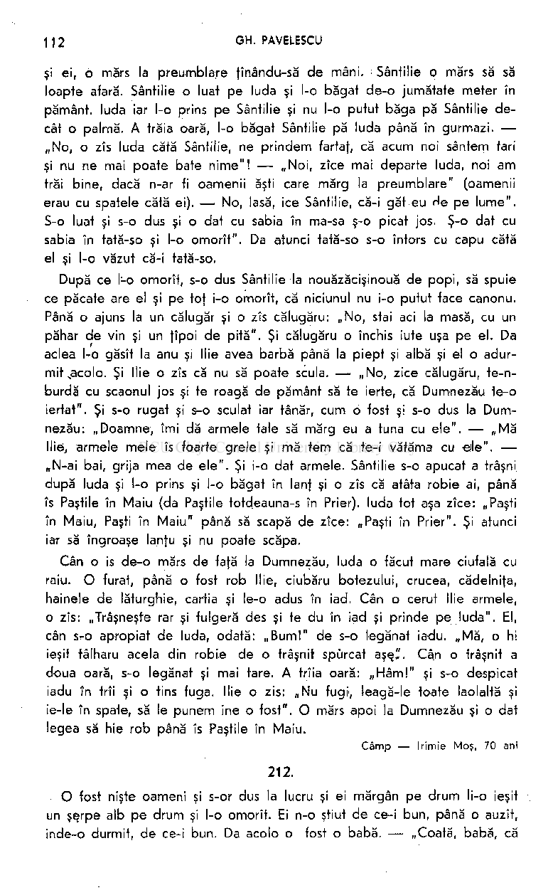
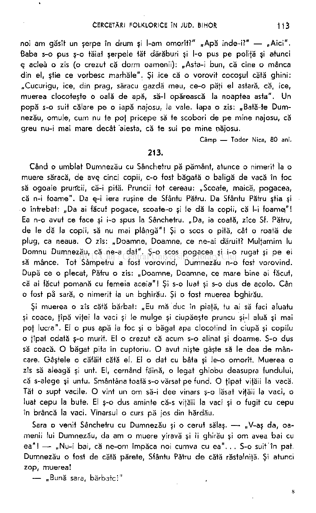
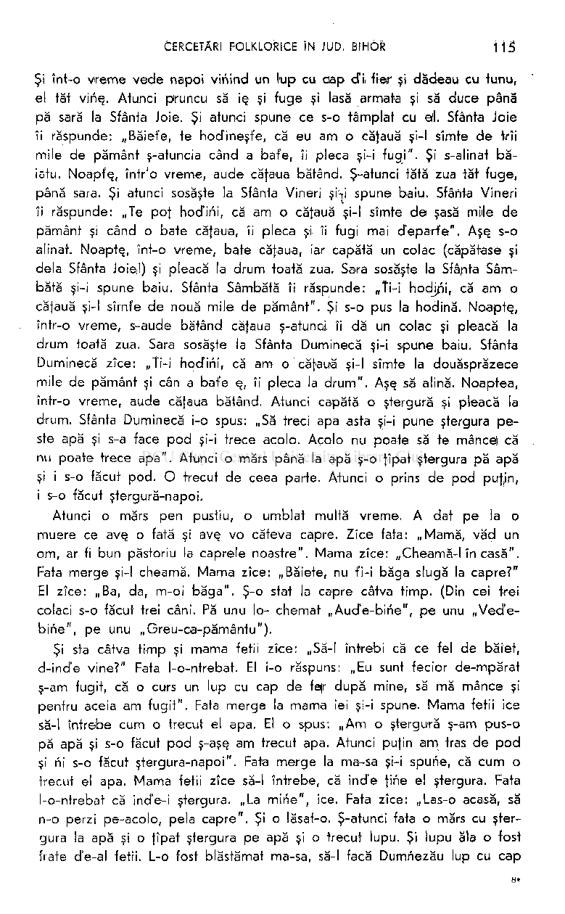

şi ei, o mărs la preumblare ţînându-să de mâni, Sântilie o mărs să să loapte afară. Sântilie o luat pe luda şi l-o băgat de-o jumătate meter în pământ, luda iar l-o prins pe Sântilie şi nu l-o putut băga pă Sântilie decât o palmă. A trăia oară, l-o băgat Sântilie pă luda până în gurmazi. „No, o zîs luda cătă Sântilie, ne prindem fartaţ, că acum noi sântem tari şi nu ne mai poate bate nime"! — „Noi, zîce mai departe luda, noi am trăi bine, dacă n-ar fi oamenii ăşti care mărg la preumblare" (oamenii erau cu spatele cătă ei). — No, lasă, ice Sântilie, că-i găt eu He pe lume". S-o luat şi s-o dus şi o dat cu sabia în ma-sa ş-o picat jos. Ş-o dat cu sabia în tată-so şi l-o omorît". Da atunci tată-so s-o întors cu capu cătă el şi l-o văzut că-i tată-so.

După ce l-o omorît, s-o dus Sântilie la nouăzăcişinouă de popi, să spuie ce păcate are el şi pe toţ i-o omorît, că niciunul nu i-o putut face canonu. Până o ajuns la un călugăr şi o zîs călugăru: „No, stai aci la masă, cu un pahar de vin şi un fîpoi de pită". Şi călugăru o închis iute uşa pe el. Da aclea l-o găsît la anu şi llie avea barbă până la piept şi albă şi el o adurmit,acolo. Şi llie o zîs că nu să poate scula. — „No, zice călugăru, te-nburdă cu scaonul jos şi te roagă de pământ să te ierte, că Dumnezău te-o iertat". Şi s-o rugat şi s-o sculat iar tânăr, cum o fost şl s-o dus la Dumnezău: „Doamne, îmi dă armele tale să mărg eu a tuna cu ele". — „Mă llie, armele mele îs foarte grele şi mă tem că te-i vătăma cu eile". „N-ai bai, grija mea de ele". Şi i-o dat armele. Sântilie s-o apucat a trâşni după luda şi l-o prins şi l-o băgat în lanţ şi o zîs că atâta robie ai, până îs Pastile în Maiu (da Pastile totdeauna-s în Prier), luda tot aşa zîce: „Paşti în Maiu, Paşti în Maiu" până să scapă de zîce: „Paşti în Prier". Şi atunci iar să îngroaşe lanţu şi nu poate scăpa.

Cân o is de-o mărs de fafă la Dumnezău, luda o făcut mare ciufală cu raiu. O furat, până o fost rob llie, ciubăru botezului, crucea, cădelniţa, hainele de lăturghie, cartia şi le-o adus în iad. Cân o cerut llie armele, o zîs: „Trâşneşte rar şi fulgeră des şi te du în iad şi prinde pe luda". El, cân SrO apropiat de luda, odată: „Bum!" de s-o legănat iadu. „Mă, o hi ieşit tâlharu acela din robie de o trâşnit spurcat aşş". Cân o trâşnit a doua oară, s-o legănat şi mai tare. A trîia oară: „Hâm!" şi s-o despicat iadu în trîi şi o tins fuga. llie o zis: „Nu fugi, leagă-le toate laolaltă şi ie-le în spate, să le punem ine o fost". O mărs apoi la Dumnezău şi o dat legea să hie rob până îs Pastile în Maiu.

Câm p — Irimie Moş, 70 ani

212.

O fost nişte oameni şi s-or dus la lucru şi ei mărgân pe drum li-o ieşit un şşrpe alb pe drum şi l-o omorît. Ei n-o ştiut de ce-i bun, până o auzît, inde-o durmit, de ce-i bun. Da acolo o fost o babă. — „Coată, babă, că

CERCETĂRI FOLKLORICE ÎN JUD. BIHOR 113

noi am găsît un şerpe în drum şi l-am omorît?" „Apă inde-i?" — „Aici". Baba s-o pus ş-o tăiat şerpele tăt dărăburi şi l-o pus pe poliţă şi atunci q acleâ o zis (o crezut că dorm oamenii): „Asta-i bun, că cine o mânca din el, ştie ce vorbesc marhăle". Şi ice că o vorovit cocoşu'l cătă ghini: „Cucurigu, ice, din prag, săracu gazdă meu, ce-o păfi el astară, că, ice, muerea clocoteşte o oală de apă, să-l opărească la noaptea asta". Un popă s-o suit călare pe o iapă najosu, la vale. Iapa o zis: „Bată-te Dumnezău, omule, cum nu te pof pricepe să te scobori de pe mine najosu, că greu nu-i mai mare decât aiesta, că te sui pe mine najosu.

Câmp — Todor Nica, 80 ani. 213.

Când o umblat Dumnezău cu Sânchetru pă pământ, atunce o nimerit la o muere săracă, de avş cinci copii, c-o fost băgată o baligă de vacă în foc să ogoaie pruncii, că-i pită. Pruncii tot cereau: „Scoate, maică, pogacea, că n-i foame". Da e-i iera ruşine de Sfântu Patru. Da Sfântu Patru ştia şi

- o întrebat: „Da ai făcut pogace, scoate-o şi le dă la copii, că l-i foamei"! Ea n-o avut ce face şi i-o spus la Sânchetru. „Da, ia coată, zîce Sf. Patru, de le dă la copii, să nu mai plângă"! Şi o scos o pită, cât o roată de plug, ca neaua. O zîs: „Doamne, Doamne, ce ne-ai dăruit? Mulfamim Iu Domnu Dumnezău, că ne-a dat". Ş-o scos pogacea şi i-o rugat şi pe ei să mance. Tot Sâmpetru a fost vorovind, Dumnezău n-o fost vorovind. După ce o plecat, Patru o zîs: „Doamne, Doamne, ce mare bine ai făcut, că ai făcut pomană cu femeia aceia"! Şi s-o luat şi s-o dus de acolo. Cân
- o fost pă sară, o nimerit la un bghirău. Şi o fost muerea bghirău. Şi muerea o zîs cătă bărbat: „Eu mă duc în piafă, tu ai să faci aluatu şi coace, fîpă vifei la vaci şi le mulge şi ciupăeşte pruncu şi-l aluă şi mai pof lucra". El o pus apă la foc şi o băgat apa clocotind în ciupă şi copilu
- o fîpat odată ş-o murit. El o crezut că acum s-o alinat şi doarme. S-o dus să coacă. O băgat pita în cuptoriu. O avut nişte gâşte să le dea de mâncare. Gâştele o căfăit cătă el. El o dat cu bâta şi le^o omorît. Muerea o zîs să aleagă şi unt. El, cernând făină, o legat ghiobu deasupra fundului, că s-alege şi untu. Smântână toată s-o vărsat pe fund. O ţipat vifau la vacă. Tăt o supt vacile. O vint un om să-i dee vinars ş-o lăsat vifăii la vaci, o luat cepu la bute. El ş-o dus aminte că-s vifăii la vaci şi o fugit cu cepu în brâncă la vaci. Vinarsul o curs pă jos din hărdău.

Sara o venit Sânchetru cu Dumnezău şi o cerut sălaş. — „V^aş da, oamenii lui Dumnezău, da am o muere yiravă şi îi ghirău şi om avea bai cu ea"! — „Nu-i bai, că ne-om împăca noi cumva cu ea". . . S-o suit'în pat. Dumnezău o fost de cătă părete, Sfântu Patru de cătă răstalnijă. Şi atunci zop, muerea!

— „Bună sara, bărbate:'

1

— „Bună sara"!

— „Coaptă-i pita"?

— „Coaptă"!

— „Untu alesu-l-ai"?

— „Ales"!

— „Da la gâşte dat-ai? Vacile mulsu-le-ai? Da pruncu l-ai ciupăit"?

— „Pruncu l-am băgat în ciupă şi-o tot durmit"! S-o dus să-l vadă: „Da el îi mort!"

Da i-o vait pe sălăii.

— „Da ce sălăi ai tu acolo"?

— „Da nişte oameni năcăjit"I

Şi s-o apucat cu bâta de Sânchetru, până s-o rupt bâta. — „No, acum să mă duc să iau alta"! Dumnezău o zîs cătă Sânchetru: „Mută-te cătă părete, să nu mâne tot pă tine"! Şi q o dat tăt pe Sânchetru. No, s-o culcat ş, că a fost bată. Şi s-o sculat Dumnezău şi Sânchetru, de s-o dus afară: — „Doamne, Doamne, o zîs Sânchetru, nu mai lăsa să hie muerea bgh;-

- rău!" Şi de atunci or cherdut ele coroana de bghirăijă. Şi s-o dus omu ş-o întâlnit un ficior durmin supt un păr şi de lene nu
- să scula să ridice perele. S-o tot mutat cu gura, să-i pchice în gură. „Doamne, oare ce-o fi cu ficioru aiesta, că nu să poate scula să-ş bage în gură?" Şi s-o luat mai departe şi o nimerit la o fată săcerân la grâu. Da Sânchetru o zîs: „ — N-ai, fată, un ol cu apă, să ne dai să bem?" Da e o zîs: „îs face bine şi hodinit, că odată mă Jîp şi aduc apă rece!" Ş-or băut. Ş-amu d-acolea or purces. O zîs Sânchetru: — „Doamne, oare cum o trăi omu ăla lenios şi fata harnică, asta cum lucra?!" — „No, zice Dumnezău, fata asta după ficioru ăla să mărită". — „Da, Doamne, Doamne, cum să-şi mance fata zîlele cu leniosu ăla?" — „Vezi, cât pot tu pricepe că pe Isniosu ăla îl mancă porcii, dacă nu-l mişcă cineva de acolo".

Câm p — Irimie Moş, 70 ani.

214. Feciorul de împărat şi lupul ou cap d e fier

O fost un ficior de-mpărat. Cân s-o născut, i-o ursît ursîtorile că cân o fi de şşpte ani, l-o tuna Sântilie sau cân o me. la cununie, l-o mânca un lup cu cap de fer. Ş-atunci tata lui o înfăles ş-o făcut un zîd înt-acei şşpte ani. Ş-atunce când o fost şşpte ani, o zîs împăratu, tata pruncului: „Să te bagi, pruncule, acolo în zîd, să nu te tune Sântilie"! Pruncu o zîs: „Tată, io nu mă bag acolo, numa Dumrîavoastră aducej o masă şi scaon în mijlocu curtî şi io m-oi ruga la Dumnezău. Facă Dumnezău ce-o vrea cu mine. Io acolo nu mă bag!" Şi când o fost la amniază}, o trăsnit în zîd,

- tăt l-a sfărmat. Băiatu a rămas sănătos. Atunci cân o fost să margă la cununie, s-o luat cu armata şi cu tunu.

Şi înt-o vreme vede napoi vinind un lup cu oap cTi fier şi dădeau cu funu, el tăt vinş. Atunci plruncu să ie. şi fuge şi lasă armata şi să duce până

- pă sară la Sfânta Joie. Şi atunci spune ce s-o tâmplat cu ejl. Sfânta Joie îi răspunde: „Băiet'e, te hodineşte, că eu am o căţaua şi-l sîmte de trii mile de pământ ş-atuncia când a bafe, îi pleca şi-i fugi". Şi s-alinat băiatu. Noapfş, într'o vreme, aude căţaua bătând. Ş-atunci tătă zua tăt fuge, până sara. Şi atunci sosăşte la Sfânta Vineri şî-ri spune baiu. Sfânta Vineri îi răspunde: „Te poţ hodini, că am o căţaua şi-l sîmte de şasă mîle de pământ şi când o bate căţaua, îi pleca şi îi fugi mai d'epad'e". Aşe. s-o alinat. Noapte., înt-o vreme, bate căţaua, iar capătă un colac (căpătase şi delà Sfânta Joie!) şi pleacă la drum toată zua. Sara sosăşte la Sfânta Sâm­

- bătă şi-i spune baiu. Sfânta Sâmbătă îi răspunde: „Ti—I hodjpi, că am o
- căţaua şi-l sîmfe de nouă mile de pământ". Şi s-o pus la hodină. Noaptş, într-o vreme, s-aude bătând căţaua ş-atunci îi dă un colac şi pleacă la drum toată zua. Sara sosăşte la Sfânta Duminecă şi-i spune baiu. Sfânta Duminecă zîce: „Ti-i hod'ini, că am o căţaua şi-l sîmte la douăsprăzece mile de pământ şi cân a bafe q, îi pleca la drum". Aşe. să alină. Noaptea, într-o vreme, aude căţaua bătând. Atunci capătă o ştergură şi pleacă la drum. Sfânta Duminecă i-o spus: „Să treci apa asta şi-i pune ştergura peste apă şi s-a face pod şi-i trece acolo. Acolo nu poate să te mancei că nu poate trece apa". Atunci o mărs până la apă ş-o ţipat ştergura pă apă şi i s-o făcut pod. O trecut de ceea parte. Atunci o prins de pod puţjn, i s-o făcut ştergură-napoi.

Atunci o mărs pen pustiu, o umblat multă vreme. A dat pe la o muere ce avş o fată şi avş vo câteva capre. Zîce fata: „Mamă, văd un om, ar fi bun păstoriu la caprele noastre". Mama zîce: „Cheamă-I în casă". Fata merge şi-l cheamă. Mama zîce: „Băiete, nu t'i-i băga slugă la capre?" El zîce: „Ba, da, m-oi băga". Ş-o stat la capre câtva timp. (Din cei trei colaci s-o făcut trei câni. Pă unu Io- chemat „Aud'e-bine", pe unu „Ved'ebirie", pe unu „Greu-ca-pământu").

Şi sta câtva timp şi mama fetii zîce: „Să-l întrebi că ce fel de băiet, d-ind'e vine?" Fata l-o-ntrebat. El i-o răspuns: „Eu sunt fecior de-mpărat ş-am fugit, că o curs un lup cu cap de fqr după mine, să mă mance şi pentru aceia am fugit". Fata merge la mama iei şi-i spune. Mama fetii ice să-l întrebe cum o trecut el apa. El o spus: „Am o ştergură ş-am pus-o pă apă şi s-o făcut pod ş-aşe. am trecut apa. Atunci puţin am tras de pod şi ni s-o făcut ştergura-napoi". Fata merge la ma-sa şi-i spune, că cum o trecut el apa. Mama fetii zîce să-l întrebe, că ind'e ţine el ştergura. Fata l-o-ntrebat că incfe-i ştergura. „La mine", ice. Fata zîce: „Las-o acasă, să n-o perzi pe-acolo, pela capre". Şi o lăsat-o. Ş-atunci fata o mărs cu ştergura la apă şi o ţîpat ştergura pe apă şi o trecut lupu. Şi lupu ăla o fost frate d'e-al fetii. L-o fost blăstămat ma-sa, să-l facă Dumnezău lup cu cap

de fer, să nu aibă stare şi alinare până nu p mânca un ficior de împărat. Ş-atunci lupu vini acasă şi să vorbş cu mama lui, că cum să-l mance, că el nu-l poate să-l mance, că-l omoară cânii lui. Şi mama lui zîce: „Tu, fată, spunö-i să lese cânii acasă, că tu ai mai merge cu el la capre şi nu mei, că te femi de câni, că te mancă".

Şi aşş el o închis cânii într'on grajd şi atunci fata a mărs cu el la capre. Cându-i odată vede lupu, vine cătă el. Atunci să suie înt-on fag. Lupu sosîşte acolo-şi zîce: „Acuma te cobor, să te mâne, că ştii că am umblat după fine". El zîce: „Na o opincă ş-o mancă întâie". în timpu acela el a grăit pe un câne, o zis: „Na, Aude-bine"! Cânele o auzît glasu stăpânuso. Atunci grăieşte lupu: „Cobori" zîce el. „Na şi astalaltă opincă!" Grăieşte pe altu câne. Cânele aude şi-i spune la cel mai mare, la „Greu-capământu" şi zîce: „Taci, eu n-am auzit!" şi lupu zîce: „Cobor!" El zîce: „Mai na, mancă şi jumătatea iesta de cojoc!" Iară strigă pe altu câne. Cânele aude, spune la Greu-ca-pământu. Zîce: „Eu n-am auzit!" Lupu zîce: „Cobor!" Atunci strigă pă Greu-ca-pământu şi zîce Greu-ca-pământu cătă Uşor-ca-vântu: „Du-te şi-l ţîne pă loc, până sosăsc eu!" S-o dus cânele şi l-o ţînut în loc, până a sosît Greu-ca-pământu. Atunci o sosît Greuca-pământu ş-a pus o labă pă el ş-atunci i-o grăit, o zis ficioru de împărat cătă gazda lui, cătă fată. „Ce vrei să las nezdrobjit?" Zice gazda: „Totul zdrobeşte, numa maiu şi plumânile lasă-le nezdrobite". Atunci tăt l-o zdrobit şi numa maiu şi plumânile nu. Şi iei s-o coborît din fag şi o făcut un foc şi o făcut o frigare şi i-o tras maiul şi plumânile în frigare şi le-o fript şi tot pe obraz la fată o dat cu ele, până fot o fript-o.

Şi fata mş acasă tătă friptă pă obraz şi spune la mamă-sa. „No, mamă, frafele meu îi tăt zdrobit şi iacă, ce-o făcut cu mine". Mama zîce: „Oase nu ai găsit din el? Zîce fata: „Oase poate că aş găsî". No, du-te şi adu câteva"! S-o dus fata şi o adus câteva oasă ş;i le-o pus noaptea la el la cap şi o murit. Cânii, la efimineaţă, l-o văzut mort şi zîce cânele ăl mare, adică Greu-ca-pământu: „Meţ în lume, cătă cei trîi câni şi cotaţi buruiană învietoare"! S-o dus acaia trîi câni. Unu s-o-ntâlnit cu-n şerpe. Şi cânele l-o văzut c-o buruiană în gură şi o zîs: „Ce buruiană ai în gură?" Şerpele o zîs: „Am un pui mort, l-am aflat mort şi duc să-l înviu". Cânele zîce: „Să faci bine să mi-o dai mie, că mi-o murit gazda rieu şi te du să-f cau[ alta". Şarpele zîce: „N-o dau, că de două zile caut ş-^acuma am aflat-o". Atunci cânele luă pe şşrpe de pestă m)ijloc şi trânti cu el de pământ ş-atunci scăpă buruiana.

Cânile o luă buruiana şi vini cu ea la stăpânu-so şi l-a frecat cu buruiană şi a înviat.

Atunci zîce cătă bătrână: „Să-m dai ce am la tine şi sîmbrie cât avem înţelegere".

Şi i-o dat, că s-o femut că le prapade şi pe ele. Ş-a plecat până la apă

