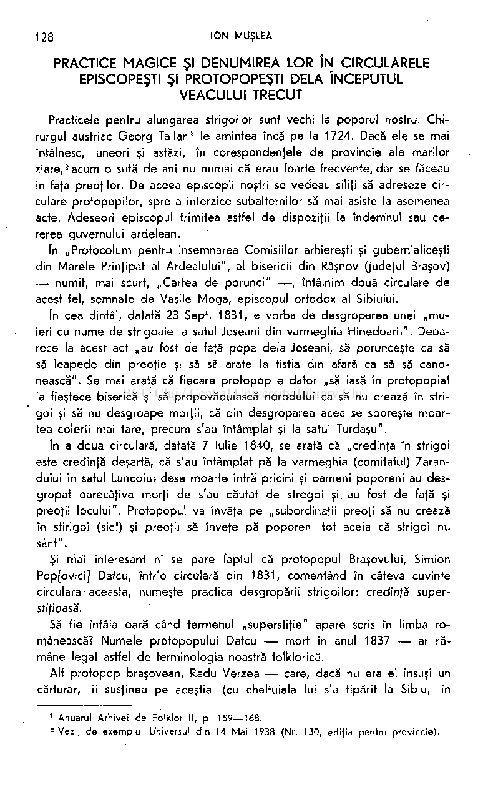
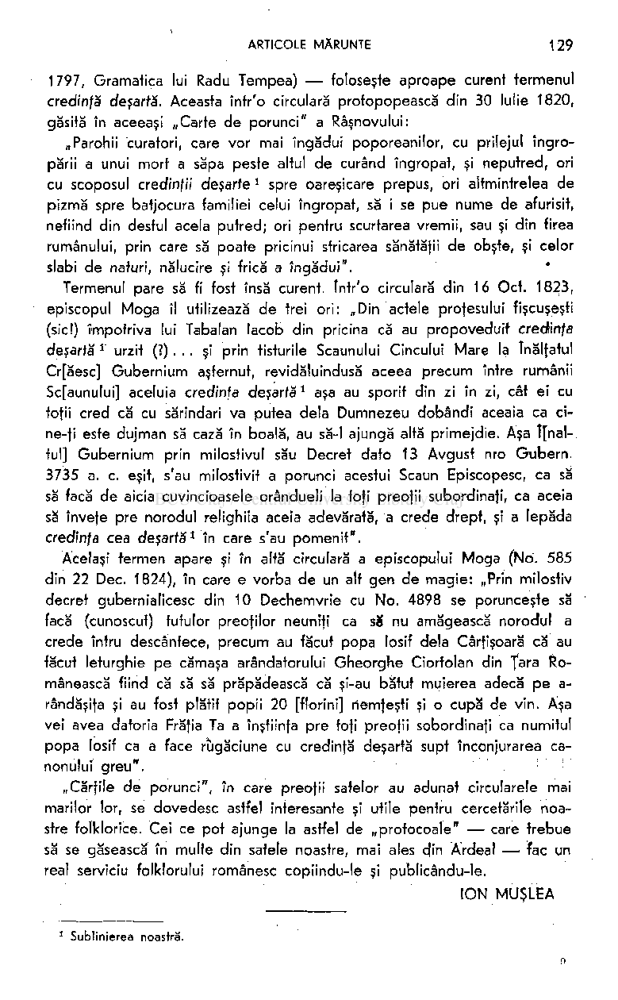

128 ION MUŞLEA

PRACTICE MAGICE Şl DENUMIREA LOR ÎN CIRCULARELE EPISCOPEŞTI Şl PROTOPOPEŞTI DELA ÎNCEPUTUL VEACULUI TRECUT

Practicele pentru alungarea strigoilor sunt vechi la poporul nostru. Chirurgul austriac Georg Tallar

le amintea încă pe la 1724. Dacă ele se mai întâlnesc, uneori şi astăzi, în corespondentele de provincie ale marilor ziare,

1

acum o sută de ani nu numai că erau foarte frecvente, dar se făceau în faţa preoţilor. De aceea episcopii noştri se vedeau siliţi să adreseze circulare protopopilor, spre a interzice subalternilor să mai asiste la asemenea acte. Adeseori episcopul trimitea astfel de dispoziţii la îndemnul sau cererea guvernului ardelean.

2

în „Protocolum pentru însemnarea Comisiilor arhiereşti şi gubernialiceşti din Marele Prinţipat al Ardealului", al bisericii din Râşnov (judeţul Braşov) — numit, mai scurt, „Cartea de porunci" — , întâlnim două circulare de acest fel, semnate de Vasile Moga, episcopul ortodox al Sibiului.

In cea dintâi, datată 23 Sept. 1831, e vorba de desgroparea unei „muieri cu nume de strigoaie la satul Joseani din varmeghia Hinedoarii". Deoarece la acest act „au fost de faţă popa delà Joseani, să porunceşte ca să să leapede din preoţie şi să să arate la tistia din afară ca să să canonească^. Se mai arată că fiecare protopop e dator „să iasă în protopopiat la fieştece biserică şi să propovăduiască norodului ca să nu crează în strigoi şi să nu desgroape morţii, că din desgroparea acea se sporeşte moartea colerii mai tare, precum s'au întâmplat şi la satul Turdaşu".

în a doua circulară, datată 7 Iulie 1840, se arată că „credinţa în strigoi este credinţă deşartă, că s'au întâmplat pă la varmeghia (comitatul) Zarandului în satul Luncoiul dese moarte întră pricini şi oameni poporeni au desgropaf oarecâţiva morţi de s'au căutat de stregoi şi au fost de faţă şi preoţii locului". Protopopul va învăţa pe „subordinaţii preoţi să nu crează în stirigoi (sici) şi preoţii să înveţe pă poporeni tot aceia că strigoi nu sânt".

Şi mai interesant ni se pare faptul că protopopul Braşovului, Simion Pop[ovici] Datcu, într'o circulară din 1831, comentând în câteva cuvinte circulara aceasta, numeşte practica desgropării strigoilor: credinţă superstiţioasă.

Să fie întâia oară când termenul „superstiţie" apare scris în limba românească? Numele protopopului Datcu — mort în anul 1837 — ar rămâne legat astfel de terminologia noastră folklorică.

Alt protopop braşovean, Radu Verzea — care, dacă nu era el însuşi un cărturar, îi susţinea pe aceştia (cu cheltuiala lui s'a tipărit la Sibiu, în

Anuarul Arhivei d e Folklor II, p. 159—168.

1

Vezi, d e exemplu , Universul din 14 Mai 1938 (Nr. 130, édifia pentru provincie).

5

1797, Gramatica lui Radu Tempea) — foloseşte aproape curent termenul credinţă deşartă. Aceasta într'o circulară profopopească din 30 Iulie 1820, găsită în aceeaşi „Carte de porunci" a Râşnovului:

„Parohii curatori, care vor mai îngădui poporeanilor, cu prilejul îngropării a unui mort a săpa peste altul de curând îngropat, şi neputred, ori cu scoposul credinţii deşarte

spre oareşicare prepus, ori altminfrelea de pizmă spre batjocura familiei celui îngropat, să i se pue nume de afurisit, nefiind din destul acela putred; ori pentru scurtarea vremii, sau şi din firea rumânului, prin care să poate pricinui stricarea sănătăţii de obşte, şi celor slabi de naturi, nălucire şi frică a îngădui".

1

Termenul pare să fi fost însă curent. într'o circulară din 16 Oct. 1823, episcopul Moga îl utilizează de trei ori: „Din actele profesului fişcuşeşti (sic!) împotriva lui Tabalan lacob din pricina că au propoveduit credinţa deşartă

urzif (?).. . şi prin tisturile Scaunului Cincului Mare la înălţatul Cr[ăesc] Gubernium aşternut, revidăluindusă aceea precum între rumânii Sc[aunului] aceluia credinţa deşartă

1

aşa au sporit din zi în zi, cât ei cu toţii cred că cu sărindari va putea dela Dumnezeu dobândi aceaia ca cine-ţi este dujman să cază în boală, au să-l ajungă altă primejdie. Aşa î[naltul] Gubernium prin milostivul său Decret dato 13 Avgust nro Gubern. 3735 a. c. eşit, s'au milostivit a porunci acestui Scaun Episcopesc, ca să să facă de aicia cuvincioasele orândueli la toţi preoţii subordinaţi, ca aceia să înveţe pre norodul relighiia aceia adevărată, a crede drept, şi a lepăda credinţa cea deşartă

1

în care s'au pomenit".

1

Acelaşi termen apare şi în altă circulară a episcopului Moga (No. 585 din 22 Dec. 1824), în care e vorba de un alt gen de magie: „Prin milostiv decret gubernialicesc din 10 Dechemvrie cu No. 4898 se porunceşte să facă (cunoscut) fufulor preoţilor neunîfi ca s8 nu amăgească norodul a crede întru descântece, precum au făcut popa losif dela Cârţişoară că au făcut leturghie pe cămaşa arendatorului Gheorghe Ciortolan din fara Românească fiind că să să prăpădească că şi-au bătut muierea adecă pe arândăşiţa şi au fost plătit popii 20 [florini] nemţeşti şi o cupă de vin. Aşa vei avea datoria Frăţia Ta a înştiinţa pre toţi preoţii sobordinaţi ca numitul popa losif ca a face rugăciune cu credinţă deşartă supt înconjurarea canonului greu".

!

„Cărţile de porunci", în care preoţii satelor au adunat circularele mai marilor lor, se dovedesc astfel interesante şi utile pentru cercetările noastre folklorice. Cei ce pot ajunge la astfel de „protocoale" — care frebue să se găsească în multe din satele noastre, mai ales cjin Ardeal — fac un rea! serviciu folklorului românesc copiindu-le şi publicându-le.

ION MUŞLEA

Sublinierea noastră.

o

