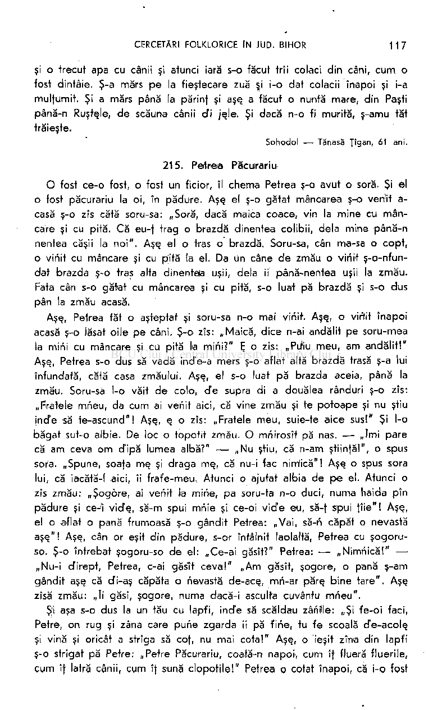

şi o trecut apa cu cânii şi atunci iară s-o făcut trîi colaci din câni, cum o fost dintâie. Ş-a mărs pe la fieştecare zuă şi i-o dat colacii înapoi şi i-a mulţumit. Şi a mărs până la părinf şi aşe. a făcut o nuntă mare, din Paşti până-n Ruştele, de scăuna cânii di jşle. Şi dacă n-o fi murită, ş-amu tăt trăieşte.

Sohodol — Tănasă Ţîgan, 61 ani.

# 215. Petrea Păcurariu

O fost ce-o fost, o fost un ficior, îl chema Petrea ş-o avut o soră. Şi el

- o fost păcurariu la oi, în pădure. Aşe el ş-o gătat mâncarea ş-o venit acasă ş-o zîs cătă soru-sa: „Soră, dacă maica coace, vin la mine cu mâncare şi cu pită. Că eu-f trag o brazdă dinentea coîibii, delà mine până-n nentea căşii la noi". Aşe el o tras o brazdă. Soru-sa, cân ma-sa o copt,
- o viriit cu mâncare şi cu pită la el. Da ün câne de zmău o viriit ş-o-nfundat brazda ş-o tras alta dinenteia uşii, delà ii până-nentea uşii la zmău. Fata cân s-o gătat cu mâncarea şi cu pită, s-o luat pă brazdă şi s-o dus pân la zmău acasă.

Aşş, Petrea tăt o aşteptat şi soru-sa n-o mai viriit. Aşş, o virţit înapoi acasă ş-o lăsat oile pe câni. Ş-o zîs: „Maică, dice n-ai andălit pe soru-mea la mirii cu mâncare şi cu pită la mirii?" E: o zis: „Piiiu meu, am andălit!" Aşş, Petrea s-o dus să vadă ind'e-a mers ş-o aflat altă brazdă trasă ş-a iui înfundată, cătă casa zmăului. Aşe, el s-o luat pă brazda aceia, până la zmău. Soru-sa l-o vait de colo, d e supra di a douălea rânduri ş-o zîs: „Fratele mrieu, da cum ai venit aici, că vine zmău şi te potoape şi nu ştiu incTe să te-ascund"! Aşş, ş o zîs: „Fratele meu, suie-te aice sus!" Şi l-o

- băgat sut-o albie. De loc o topotif zmău. O mriirosît pă nas. — „îmi pare
- că am ceva om cfipă lumea albă?" — „Nu ştiu, că n-am ştiinfă!", o spus sora. „Spune, soafa me_ şi draga mş, că nu-i fac nirrfică"! Aşş o spus sora lui, că iacătă-l aici, îi frafe-meu. Atunci o ajutat albia de pe el. Atunci o zîs zmău: „Şogore, ai venit la mirie, pa soru-ta n-o duci, numa haida pîn pădure şi ce-'i vid'ş, să-m spui mriie şi ce-oi vicTe eu, să-f spui fîie"! Aşş, el o aflat o pană frumoasă ş-o gândit Petrea: „Vai, să-ri capăt o nevastă aşe/'! Aşş, cân or eşit din pădure, s-or întâlnit laolaltă, Petrea cu şogoruso. Ş-o întrebat şogoru-so de el: „Ce-ai găsît?" Petrea: — „Nimriică!" „Nu-i cTirept, Petrea, c-ai găsit ceva!" „Am găsît, şogore, o pană ş-am gândit aşş că cfi-aş căpăta o nevastă de-ace, mri-ar păre. bine tare". Aşş zîsă zmău: „îi găsî, şogore, numa dacă-i asculta cuvântu mrieu".

Şi aşa s-o dus la un tău cu lapfi, incfe să scăldau zâriNe: „Şi fe-oi faci, Petre, on rug şi zâna care purie zgarda ii pă fine, tu fe scoală de-acole. şi vină şi oricât a strîga să cof, nu mai cota!" Aşş, o ieşit zîna din lapfi ş-o strigat pă Petre: „Petre Păcurariu, coată-n napoi, cum îf flueră fluerile, cum îf latră cânii, cum îţ sună clopotile!" Petrea o cotat înapoi, că i-o fost

jele. Atunci zîna zîce: „Facă-te Dumnezeu on scoloi d e ghiaţă, pă marea îngheţată!" Aşş, zmău tăt o aşteptat să vie şogoru-so. El s^o luat atunci să coate după el şi l-o văit acolo, pă mare îngheţată, un sloi dö ghiaţă şi l-o scos cTe-acolo. O zîs Petrea: „Vai, de mult durmii, şogore!" — Ai tăt durmi, până-i lumea, dacă n-a fi fostă eu! Numa nu mai asculta, acar cât te-a striga, până-'i veni la mine acasă"! Aşş, iară s-o dus Petrea la tău cel cu lapte dulce şi s-o făcut un muşinoi ş-o vinit zânele să se scalde. Zâna acş o zîs că muşunoiu acela n-o fost aculş, cătă celelalte, dar eu pui zgarda mş pe el, ori o fost, ori n-o fost. Aşş, o pus zgarda pe el. Petrea s-o sculat şi s-o luat cătă casă. Zâna o ieşit din lapte ş-o apucat a striga după el: „Petrea Păcurariu, coată-n napoi, cum îţi flueră fluerile, cum îţi latră cânii, cum îţi zghiară oile"! De câteva ori o strigat. Petrea, jelnicos după oi, o cotat napoi. Atunci zâna o zîs cătă el: „Facă-te Dumnezău, Petre, on fir de pipirig, în mijlocul mărilor, între pipirige!" Aşş l-o făcut. *

Şogoru-so o aşteptat; văzând că nu vine, s-o luat după el şi l-o văit acolo şi l-o scos. O zîs aşş, Petrea: „Vai, mult durnii, şogore!" Aşş o zîs smău: „Tot ai dormi până îi lumea, să nu fi fostă eu! De mai coţ înapoi, eu nu mai viu după tine"! Aşş, l-o făcut iară zmău un spine lângă tău. O vinit o zână ş-b pus zgarda pă el şi o zîs: „Iară eu pui zgardă pă spinele ăsta, da eri n-o fost aci". Aşş, o pus. Petrea s-o- luat cân ele o sărit în tău. S-o luat Petrea, haide, haide. Zâna o ieşit din tău ş-o apucat a striga după Petrea. Petrea n-o mai cotat înapoi nicicum. S-o luat până la zmău acasă. Zmău o avut o temniţă de oţăl. Când o ajuns Petrea cu zâna, i-o băgat zmău în t'emniţă pe amândoi. Acolo o avut highighiş şi le-a zîs acolo luni depline. O avut mâncare, beutură şi petreceau. Zâna o zîs cătră Petrea: „Fă-m, Petre, numai o hudrică, cum mş acu pin podeli în sus!" Petrea nu pute. Zîce cătă zmău. Zmău îi face. Er întorcându-se cu Petrea p-îngă hudră, face: zdrânc! pă hudră în sus. Cân era în vârv căşii, zîce cătră Petrea: „îhî, Petre, atunci să te întâlneşti cu mine cându îi rupi o bâtă cât tine cTe-naltă de fer"! E s-o dus. Petrea ş-o făcut o bâtă de fer cât el de-naltă s-o luat, haidi multă lume, împărăţie, Dumnezău să ne ţîie, că din poveste mult mai este.

Aşş, tot s-o dus până s-o-ntâlnit cu trîi prunci. Unu o avut un zbiciu, unu o avut o cismă, unu o avut un clop. Aşş, s-o fost certând, că ceala i-o fost trăbuind clop, cela cizmă, alfu zbiciu şi nu s-o fost putând împărţi. O zîs Petrea cătă ii: „De ce sânt bune astea, prunci?" — „Cisma îi bună, că dacă-o tragi în picior şi zîci cătă ş: Tropo, tropo, cisma mş, du-mă ine m-i voia!, acolo te duce". — „Da clopu?" O zîs pruncii: „Clopu îi bun, păntru cându-l iei în cap, nu fe mai vecTe nime. Poţ mânca cu domni la masă, că nu te mai vede"! — „Da zbiciu?" — „Zbiciu îi bun, zîce pruncii, că dacă îi tuna cătă o grămadă de oameni, tăţ îi faci vânătări!

