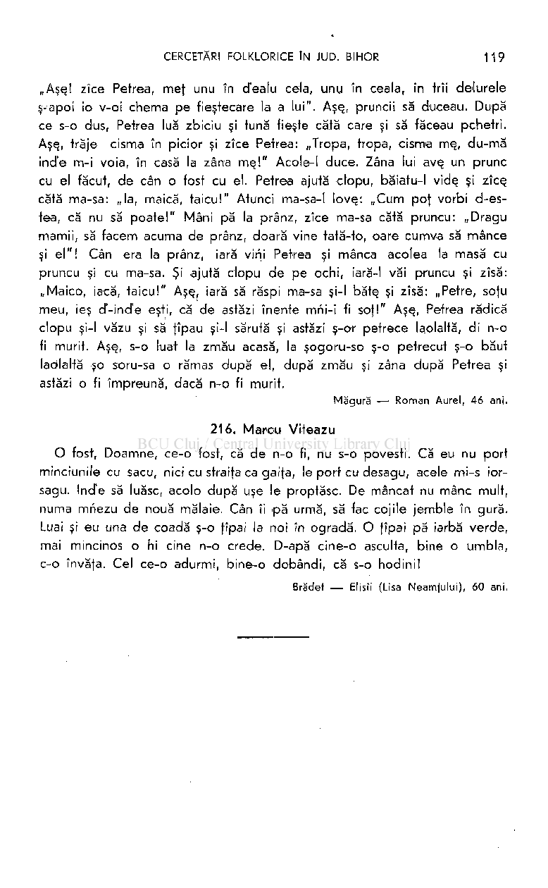

„Aşş! zîce Petrea, meţ unu în dealu cela, unu în ceala, în trîi delurele ş-apoi io v-oi chema pe fieştecare la a lui". Aşş, pruncii să duceau. După ce s-o dus, Petrea luă zbiciu şi tună fieste cată care şi să făceau pchetri. Aşş, trăje cisma în picior şi zîce Petrea: „Tropa, tropa, cisma mş, du-mă ind'e m-i voia, în casă la zâna mş! " Acole-I duce. Zâna lui ave. un prunc cu el făcut, de cân o fost cu el. Petrea ajută clopu, băiatu-l vidş şi zîce. cătă ma-sa: „la, maică, taicu!" Atunci ma-sa-l lovş: „Cum poţ vorbi d-estea, că nu să poate!" Mâni pă la prânz, zîce ma-sa cătă pruncu: „Dragu mamii, să facem acuma de prânz, doară vine tată-to, oare cumva să mance şi el" ! Cân era la prânz, iară vini Petrea şi mânca acolea la masă cu pruncu şi cu ma-sa. Şi ajută clopu de pe ochi, iară-l văi pruncu şi zîsă: „Maico, iacă, taicu!" Aşş, iară să răspi ma-sa şi-l bătş şi zîsă: „Petre, soţu meu, ieş cT-incfe eşti, că de astăzi înente mni-i fi soţ!" Aşş, Petrea rădică clopu şi-l văzu şi să ţîpau şi-l sărută şi astăzi ş-or petrece laolaltă, di n-o fi murit. Aşş, s-o luat la zmău acasă, la şogoru-so ş-o petrecut ş-o băut laolaltă şo soru-sa o rămas după el, după zmău şi zâna după Petrea şi astăzi o fi împreună, dacă n-o fi murit.

Măgură — Roman Aurel, 4 6 ani,

216. Marcu Vit ea zu

O fost, Doamne, ce-o fost, că de n-o fi, nu s-o povesti. Că eu nu port minciunile cu sacu, nici cu straifa ca gaiţa, le port cu desagu, acele mi-s iorsagu. Ind'e să luăsc, acolo după uşe le proptăsc. De mâncat nu mâne mult, numa mhezu de nouă mălaie. Cân îi pă urmă, să fac cojile jemble în gură. Luai şi eu una de coadă ş-o fîpai la noi în ogradă. O fîpai pă iarbă verde, mai mincinos o hi cine n-o crede. D-apă cine-o asculta, bine o umbla, c-o învăţa. Cel ce-o adurmi, bine-o dobândi, că s-o hodini!

Brădef — Elisîi (Lisa Neamţului), 6 0 ani.

