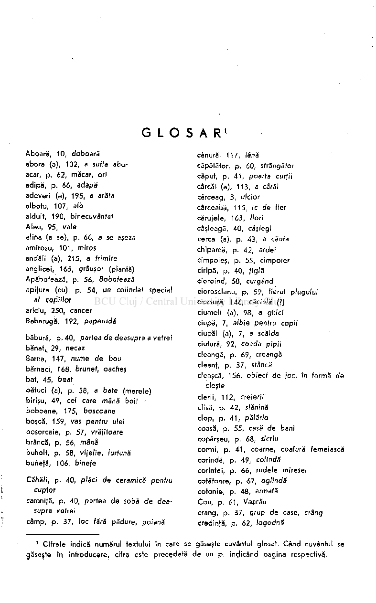
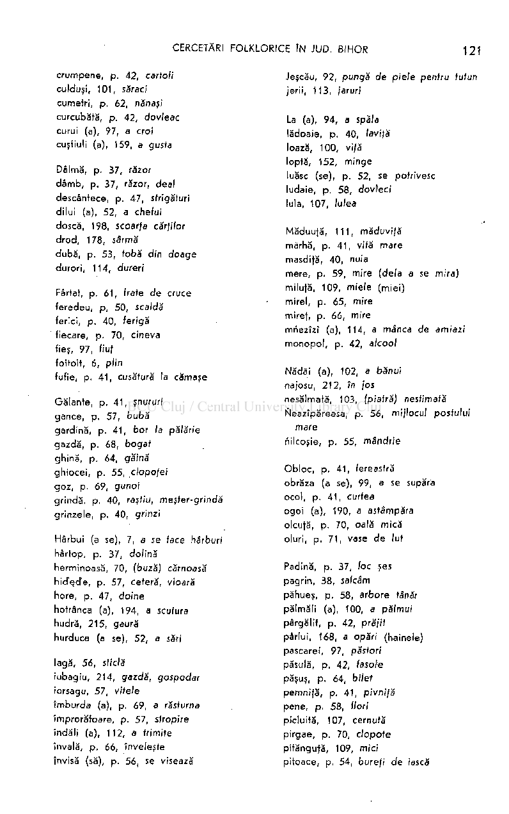
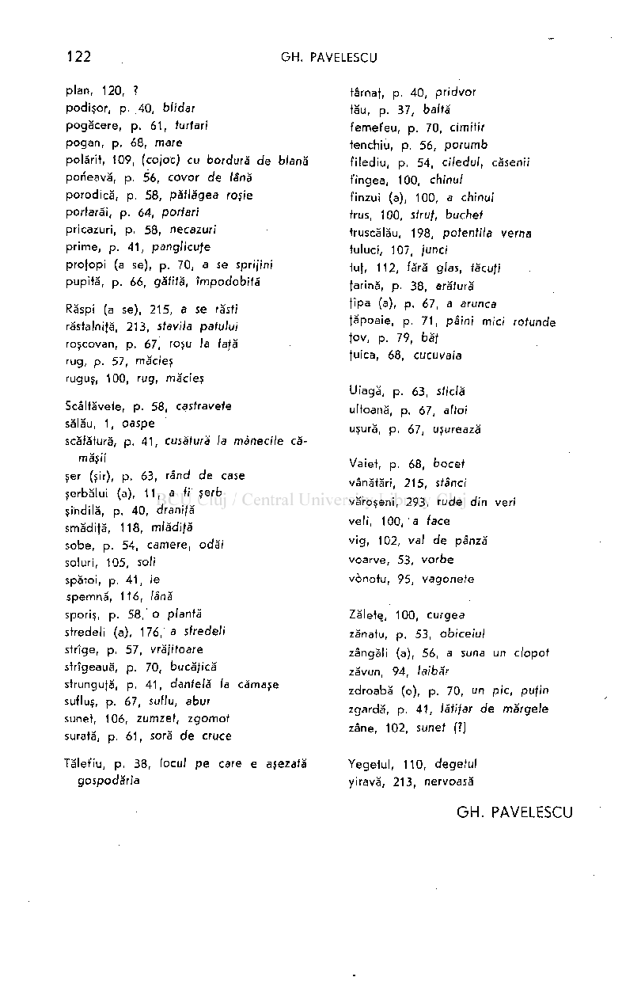
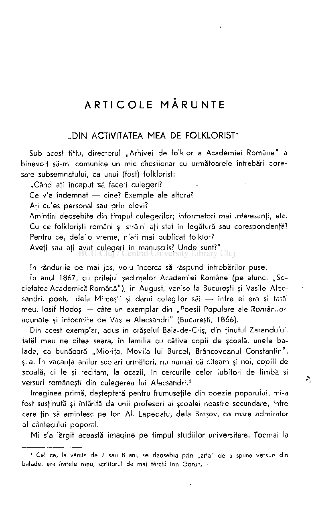
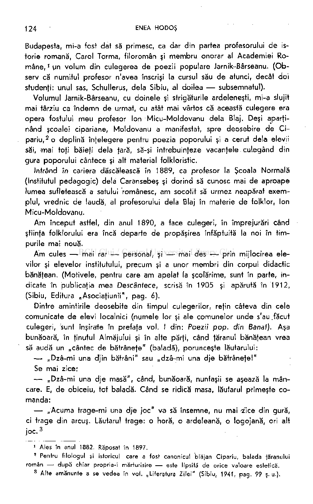
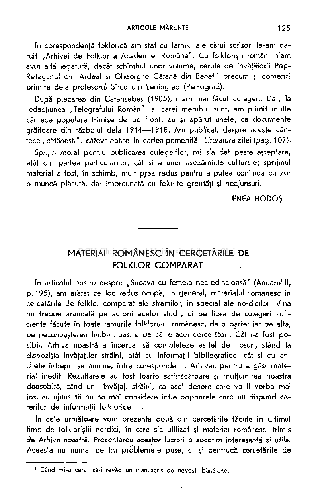
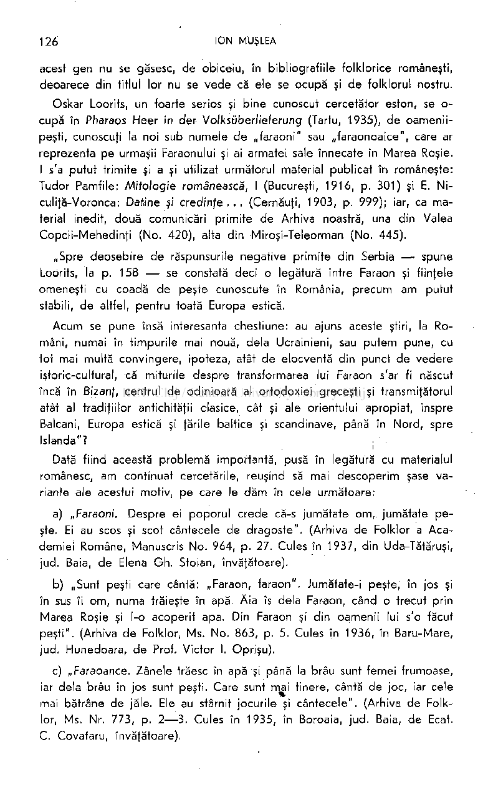
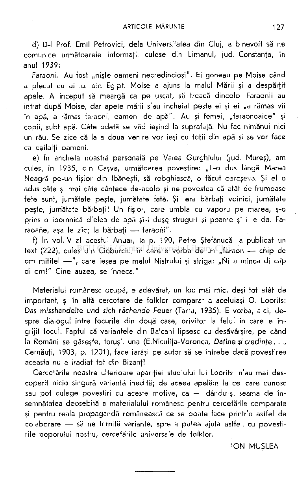

# GLOSAR

1

Abpară, 10, doboară abora (a), 102, a sufla abur acar, p. 62, măcar, ori adipă, p. 66, adapă adeveri (a), 195, a arăta albofu, 107, alb alduit, 190, binecuvântat Aleu, 95, vale alina (a se), p. 66, a se aşeza amirosu, 101 , miros andăli (a), 215, a frimife anglicei, 165, grâuşor (plantă) Apăbotează, p. 56, Bobotează apiţura (cu), p. 54, un colindat special

cânură, 117, lână căpătător, p. 60, sfrângător căput, p. 41 , poarta curţii cârcăi (a), 113, a cârăi cârceag, 3, ulcior cârceauă, 115, ic de fier cărujele, 163, flori câşleagă, 40, câşlegi cerca (a), p. 43, a căuta chiparcă, p. 42, ardei cimpoieş, p. 55, cimpoier ciripă, p. 40, ţiglă cioroind, 58, curgând ciorosclanu, p. 59, fierul plugului ciuclufă, 146, căciulă (?) ciumeli (a), 98, a ghici ciupă, 7, albie pentru copii ciupăi (a), 7, a scălda ciutură, 92, coada pipi i cleangă, p. 69, creangă cleanţ, p. 37, stâncă cleaşcă, 156, obiect de joc, în formă de

al copiilor ariciu, 250, cancer Babarugă, 192, paparudă

băbură, p. 40, partea de deasupra a vetrei bănat

29, necaz Bârna, 147, nume de bo u bărnaci, 168, brunet, oacheş bat, 45, beaf bătuci (a), p. 58, a bate (merele) birişu, 49, cel care mână boii boboane , 175, boscoane boşcă, 159, vas pentru ulei bosorcaie, p. 57, vrăjitoare brâncă, p. 56, mână buholt, p. 58, vi/e/ie, furtună buneţă, 106, bineţe

L

cleşte clerii, 112, creierii clisă, p. 42, slănină clop, p. 41 , pălărie coasă, p. 55, casă de bani copârşeu, p. 68, sicriu cormi, p. 41 , coarne, coafură femeiască corindă, p. 49, colindă corintei, p. 66, rudele miresei cotătoare, p. 67, oglindă cotonie, p. 48, armafă Cou, p, 61 , Vaşcău crâng, p. 37, grup de case, crâng credinfă, p. 62, logodn ă

Căhăli, p. 40, plăci de ceramică pentru cuptor camnifă, p. 40, partea de sobă de deasupra vetrei câmp, p. 37, loc fără pădure, poiană

Cifrele indică numărul textului în care se găseşte cuvântul glosat. Când cuvântul se găseşte în Introducere, cifra este precedată de un p. indicând pagina respectivă,

1

crumpene, p. 42, cartofi culduşi, 101, sărac/' cumetri, p. 62, nănaşi curcubătă, p. 42, dovleac curui (a), 97, a croi cuşfiuli (a), 159, a gusta

Jeşcău, 92, pungă de piele pentru tutun jerii, 113, jaruri

La (a), 94, a spăla lădoaie, p. 40, laviţă loază, 100, vi|ă loptă, 152, minge luăsc (se), p. 52, se potrivesc ludaie, p. 58, dovleci lula, 107, lulea

Dâlmă, p. 37, răzor dâmb , p. 37, răzor, deal descântece, p. 47, strigături dilui (a), 52, a chefui doscă, 198, scoarfa cărfifor drod , 178, sârmă dubă, p. 53, tobă din doag e durori, 114, dureri

- Măduufă, 111, măduvi/ă mârhă, p. 41 , vifă mare masdifă, 40, nuia mere, p. 59, mire (delà a se mira) milufă, 109, miele (miei) mirel, p. 65, mire miref, p. 66, mire mriezîzî (a), 114, a mânca de amiazi monopol , p. 42, alcool
- Nădăi (a), 102, a bănui najosu, 212, în jos nesălmată, 103, (piatră) nestimată Neazipăreasa, p. 56, mijlocul postului

Fârtat, p. 61 , frate de cruce feredeu, p, 50, scaldă ferici, p. 40, ferigă fiecare, p. 70, cineva fies, 97, fiuf foitoit, 6, plin fufie, p. 41 , cusătură la cămaşe

Galante, p, 41 , şnururi gance, p. 57, bub ă gardină, p. 41 , bor la pălărie gazdă, p. 68, boga t ghină, p. 64, găină ghiocei, p. 55, dopofei goz, p. 69, gunoi grindă, p. 40, raştiu, meşter-grindă grinzele, p. 40, grinzi

mare tiilcoşie, p. 55, mândrie

Obloc, p. 41 , fereastră obrăza (a se), 99, a se supăra ocol, p. 41 , curtea ogoi (a), 190, a astâmpăra olcufă, p. 70, oală mică oluri, p. 71 , vase d e lut

Hârbui (a se), 7, a se face hârburi hârtop, p. 37, dolină herminoasă, 70, (buză) cărnoasă hicTccTe, p. 57, cetera, vioară hore, p. 47, doine hotrânca (a), 194, a scutura hudră, 215, gaură hurduca (a se), 52, a sări

Padină, p. 37, foc şes pagrin, 38, salcâm păhueş, p. 58, arbore tânăr pălmăli (a), 100, a păfmui pârgălit, p. 42, prăjit pârlui, 168, a opări (hainele) pascarei, 97, păstori păsulă, p. 42, lasote păşuş, p. 64, bilet pemnifă, p. 41 , pivnijă pene, p. 58, flori picluită, 107, cernută pirgae, p. 70, clopot e pităngufă, 109, mici pitoace, p. 54, burefi de iască

lagă, 56, sticlă iubagiu, 214, gazdă, gospodar iorsagu, 57, vitele îmburda (a), p. 69, a răsturna împrorătoare, p. 57, stropire îndăli (a), 112, a trimite învală, p. 66, înveleşte învisă (să), p. 56, se visează

plan, 120, ? podişor, p. .40, blidar pogăcere, p. 61 , furfari pogan, p. 68, mare polărit, 109, (cojoc) cu bordură de blană porîeavă, p. 56, covor de lână porodică, p. 58, pătlăgea roşie portarăi, p. 64, portari pricazuri, p. 58, necazuri prime, p. 41 , panglicu/e profopi (a se), p. 70, a se sprijini pupită, p. 66, gătită, împodobit ă

târnaf, p. 40, pridvor tău, p. 37, baltă femefeu , p. 70, cimitir tenchiu, p. 56, porum b filediu, p. 54, ciledul, căsenii t'ingea, 100, chinul finzui (a), 100, a chinui trus, 100, struf, buchet truscălău, 198, potentil'a verna tuluci, 107, junei tuf, 112, fără glas, făcu/i farină, p. 38, arătură fîpa (a), p. 67, a arunca făpoaie, p. 71 , pâini mici rotunde fov, p. 79, băţ fuica, 68, cucuvaia

Răspi (a se), 215, a se răsti

- răstalnifă, 213, stavila patului roşcovan, p. 67, roşu la faţă rug, p. 57, măcieş ruguş, 100, rug, măcieş

Scâlfăvefe, p. 58, castravete

- sălău, 1, oaspe scăfătură, p. 41 , cusătură la mânecile că­

Uiagă, p. 63, sticlă ulfoană, p. 67, altoi uşura, p. 67, uşurează

măşii şer (şir), p. 63, rând de case şerbălui (a), 11 , a fi şerb şihdilă, p. 40, draniţă smădită, 118, mlădiţă sobe, p. 54, camere, odăi soluri, 105, soli spătoi, p. 41 , ie spemnă, 116, lână sporiş, p. 58, o plantă sfredeli (a), 176, a sfredeli strige, p. 57, vrăjitoare strîgeauă, p. 70, bucăţică strungufă, p. 41 , dantelă la cămaşe sufluş, p. 67, suffu, abur sunet, 106, zumzet, zgomo t surată, p. 61 , soră d e cruce

Vaiet, p. 68, bocet vânătări, 215, stânci văroşeni, 293, rude din veri veli, 100, ' a face vig , 102, val de pânză voarve, 53, vorb e vônotu, 95, vagonefe

Zăletş, 100, curgea zănatu, p. 53, obiceiul zângăli (a), 56, a suna un clopot zăvun, 94, laibăr zdroabă (o), p. 70, un pic, puţin zgardă, p. 41 , lătifar de mărgele zâne, 102, sunet (?)

Tălet'iu, p. 38, locul p e care e aşezată gospodăria

Yegetul, 110, degetul yiravă, 213, nervoasă

## GH. PAVELESCU

ARTICOL E MĂRUNT E

„DIN ACTIVITATEA MEA DE FOLKLORIST"

Sub acest titlu, directorul „Arhivei de folklor a Academiei Române" a binevoit să-mi comunice un mic chestionar cu următoarele întrebări adresate subsemnatului, ca unui (fost) folklorist:

„Când aţi început să faceţi culegeri? Ce v'a îndemnat — cine? Exemple ale altora? Afi cules personal sau prin elevi? Amintiri deosebite din timpul culegerilor; informatori mai interesanţi, etc. Cu ce folklorişti români şi străini afi stat în legătură sau corespondenţă? Pentru ce, delà o vreme, n'aţi mai publicat folklor? Aveţi sau aţi avut culegeri în manuscris? Unde sunt?"

In rândurile de mai jos, voiu încerca să răspund întrebărilor puse. In anul 1867, cu prilejul şedinţelor Academiei Române (pe atunci „Societatea Academică Română"), în August, venise la Bucureşti şi Vasile Alecsandri, poetul delà Mirceşti şi dărui colegilor săi — între ei era şi tatăl meu, losif Hodoş — câte un exemplar din „Poesii Populare ale Românilor, adunate şi întocmite de Vasile Alecsandri" (Bucureşti, 1866).

Din acest exemplar, adus în orăşelul Baia-de-Criş, din ţinutul Zarandului, tatăl meu ne citea seara, în familia cu câţiva copii de şcoală, unele balade, ca bunăoară „Mioriţa, Movila lui Burcel, Brâncoveanul Constantin", ş. a. în vacanţa anilor şcolari următori, nu numai că citeam şi noi, copiii de şcoală, ci le şi recitam, la ocazii, în cercurile celor iubitori de limbă şi versuri româneşti din culegerea lui Alecsandri.

1

Imaginea primă, deşteptată pentru frumuseţile din poezia poporului, mi-a fost susţinută şi întărită de unii profesori ai şcoalei noastre secundare, între care ţin să amintesc pe Ion Al. Lapedatu, delà Braşov, ca mare admirator al cântecului poporal.

Mi s'a lărgit această imagine pe timpul studiilor universitare. Tocmai la

Cel ce, la vârsta d e 7 sau 8 ani, se deosebia prin „arta" d e a spune versuri din balade, era fratele meu , scriitorul de mai târziu Ion Gorun .

1

Budapesta, mi-a fost dat să primesc, ca dar din partea profesorului de istorie romană, Carol Torma, filoromân şi membru onorar al Academiei Ro­

- mâne, gn volum din culegerea de poezii populare Jarnik-Bârseanu. (Observ că numitul profesor n'avea înscrişi la cursul său de atunci, decât doi studenţj: unul sas, Schullerus, delà Sibiu, al doilea — subsemnatul).

Volumul Jarnik-Bârseanu, cu doinele şi strigăturile ardeleneşti, mi-a slujit mai târziu ca îndemn de urmat, cu atât mai vârtos că această culegere era opera fostului meu profesor Ion Micu-Moldovanu delà Blaj. Deşi aparţi-

- nând şcoalei cipariane, Moldovanu a manifestat, spre deosebire de Ci-

o deplină înţelegere pentru poezia poporului şi a cerut delà elevii săi, 'mai tofi băieţi delà fără, să-şi întrebuinţeze vacantele culegând din gura poporului cântece şi alt material folkloristic.

pariu,

2

Intrând în cariera dăscălească în 1889, ca profesor la Şcoala Normală (Institutul pedagogic) delà Caransebeş şi dorind să cunosc mai de aproape lumea sufletească a satului românesc, am socotit să urmez neapărat exemplul, vrednic de laudă, al profesorului delà Blaj în materie de folklor, Ion Micu-Moldovanu.

Am început astfel, din anul 1890, a face culegeri, în împrejurări când ştiinţa folklorului era încă departe de propăşirea înfăptuită la noi în timpurile mai nouă.

Am cules — mai rar — personal, şi — mai des — prin mijlocirea elevilor şi elevelor institutului, precum şi a unor membri din corpul didactic banäfean. (Motivele, pentru care am apelat la şcolărime, sunt în parte, indicate în publicaţia mea Descântece, scrisă în 1905 şi apărută în 1912, (Sibiu, Editura „Asociaţiumi", pag. 6),

Dintre amintirile deosebite din timpul culegerilor, reţin câteva din cele comunicate de elevi localnici (numele lor şi ale comunelor unde s'au .făcut culegeri, sunt înşirate în prefaţa vol. I din: Poezii pop. din Banat). Aşa bunăoară, în ţinutul Almăjului şi în alte părţi, când ţăranul bănăţean vrea să audă un „cântec de bătrâneţe" (baladă), porunceşte lăutarului:

— „Dzâ-mi una djin bătrâni" sau „dzâ-mi una dje bătrâneţe!" Se mai zice:

— „Dzâ-mi una dje masă", când, bunăoară, nuntaşii se aşează la mâncare. E, de obiceiu, tot baladă. Când se ridică masa, lăutarul primeşte comanda:

— „Acuma trage-mi una dje joc" va să însemne, nu mai ^'ice din gură, ci trage din arcuş. Lăutarul trage: o horă, o ardeleană, o logojană, ori alt joc.

3

Ales în anul 1882. Răposat în 1897.

1

Pentru filologul şi istoricul care a fost canonicul blăjan Cipariu, balada ţăranului român — după chiar propria-i mărturisire — este lipsită de orice valoare estetică.

5

Alte amănunte a se vedea în voi . „Literatura Zilei " (Sibiu, 1941, pag. 99 s.u.),

3

în corespondentă foklorică am stat cu Jarnik, ale cărui scrisori le-am dăruit „Arhivei de Folklor a Academiei Române". Cu folklorişti români n'am avut altă legătură, decât schimbul unor volume, cerute de învăţătorii PopReteganul din Ardeal şi Gheorghe Cătană din Banat,

precum şi comenzi primite delà profesorul Sîrcu din Leningrad (Petrograd).

1

După plecarea din Caransebeş (1905), n'am mai făcut culegeri. Dar, la redacfiunea „Telegrafului Român", al cărei membru sunt, am primit multe cântece populare trimise de pe front; au şi apărut unele, ca documente grăitoare din războiul delà 1914—1918. Am publicat, despre aceste cântece „cătăneşti", câteva notije în cartea pomenită: Liieraiura zilei (pag. 107).

Sprijin moral pentru publicarea culegerilor, mi s'a dat peste aşteptare, atât din partea particularilor, cât şi a unor aşezăminte culturale; sprijinul material a fost, în schimb, mult prea redus pentru a putea continua cu zor

- o muncă plăcută, dar împreunată cu felurite greutăţi şi neajunsuri. ENEA HODOŞ

MATERIAL ROMÂNESC ÎN CERCETĂRILE DE FOLKLOR COMPARAT

In articolul nostru despre „Snoava cu femeia necredincioasă" (Anuarul II,

- p. 195), am arătat ce loc redus ocupă, în general, materialul românesc în cercetările de folklor comparat ale străinilor, în special ale nordicilor. Vina nu trebue aruncată pe autorii acelor studii, ci pe lipsa de culegeri suficiente făcute în toate ramurile folklorului românesc, de o parte; iar de alta, pe necunoaşterea limbii noastre de către acei cercetători. Cât i-a fost posibil, Arhiva noastră a încercat să completeze astfel de lipsuri, stând la dispoziţia învajatilor străini, atât cu informaţii bibliografice, cât şi cu anchete întreprinse anume, între corespondenţii Arhivei, pentru a găsi material inedit. Rezultatele au fost foarte satisfăcătoare şi mulţumirea noastră deosebită, când unii învăjati străini, ca acel despre care va fi vorba mai jos, au ajuns să nu ne mai considere între popoarele care nu răspund cererilor de informaţii folklorice . . .

în cele următoare vom prezenta două din cercetările făcute în ultimul timp de folkloriştii nordici, în care s'a utilizat şi material românesc, trimis de Arhiva noastră. Prezentarea acestor lucrări o socotim interesantă şi utilă. Aceasta nu numai pentru problemele puse, ci şi pentrucă cercetările de

Când mi-a cerut să-i revăd un manuscris de poveşti bănăţene.

1

126 ION MUŞLEA

acest gen nu se găsesc, de obiceiu, în bibliografiile folklorice româneşti, deoarece din titlul lor nu se vede că ele se ocupă şi de folklorul nostru.

Oskar Loorits, un foarte serios şi bine cunoscut cercetător eston, se ocupă în Pharaos Heer in der Voiksüber/ieferung (Tartu, 1935), de oameni ipeşti, cunoscuţi la noi sub numele de „faraoni" sau „faraonoaice", care ar reprezenta pe urmaşii Faraonului şi ai armatei sale înnecate în Marea Roşie. I s'a putut trimite şi a şi utilizat următorul material publicat în româneşte: Tudor Pamfile: Mitologie românească, I (Bucureşti, 1916, p. 301) şi E. Niculiţă-Voronca: Datine şi credinţe... (Cernăuţi, 1903, p. 999); iar, ca material inedit, două comunicări primite de Arhiva noastră, una din Valea Copcii-Mehedinţi (No. 420), alta din Miroşi-Teleorman (No. 445).

„Spre deosebire de răspunsurile negative primite din Serbia — spune Loorits, la p. 158 — se constată deci o legătură între Faraon şi fiinţele omeneşti cu coadă de peşte cunoscute în România, precum am putut stabili, de altfel, pentru toată Europa estică.

Acum se pune însă interesanta chestiune: au ajuns aceste ştiri, la Români, numai în timpurile mai nouă, delà Ucrainieni, sau putem pune, cu toi mai multă convingere, ipoteza, atât de elocventă din punct de vedere istoric-cultural, că miturile despre transformarea lui Faraon s'ar fi născut încă în Bizanţ, centrul de odinioară al ortodoxiei greceşti şi transmiţătorul atât al tradiţiilor antichităţii clasice, cât şi ale orientului apropiat, înspre Balcani, Europa estică şi ţările baltice şi scandinave, până în Nord, spre Islanda"?

i

Dată fiind această problemă importantă, pusă în legătură cu materialul românesc, am continuat cercetările, reuşind să mai descoperim şase variante ale acestui motiv, pe care le dăm în cele următoare:

- a) „Faraoni. Despre ei poporul crede că-s jumătate om, jumătate peşte. Ei au scos şi scot cântecele de dragoste". (Arhiva de Folklor a Academiei Române, Manuscris No. 964, p. 27. Cules în 1937, din Uda-Tătăruşi, jud. Baia, de Elena Gh. Stoian, învăţătoare).
- b) „Sunt peşti care cântă: „Faraon, faraon". Jumătate-i peşte, în jos şi în sus îi om, numa trăieşte în apă. Ăia îs delà Faraon, când o trecut prin Marea Roşie şi l-o acoperit apa. Din Faraon şi din oamenii lui s'o făcut peşti". (Arhiva de Folklor, Ms. No. 863, p. 5. Cules în 1936, în Baru-Mare, jud. Hunedoara, de Prof. Victor I. Oprişu).
- c) „Faraoance. Zânele trăesc în apă şi până la brâu sunt femei frumoase, iar delà brâu în jos sunt peşti. Care sunt mai tinere, cântă de joc, iar cele mai bătrâne de jăle. Ele au stârnit jocurile şi cântecele". (Arhiva de Folklor, Ms. Nr. 773, p. 2—3. Cules în 1935, în Boroaia, jud. Baia, de Ecat. C. Covataru, învăţătoare).

d) D-l Prof. Emil Pefrovici, delà Universitatea din Cluj, a binevoit să ne comunice următoarele informaţii culese din Limanul, jud. Constanţa, în anul 1939:

Faraonii. Au fost „nişte oameni necredincioşi". Ei goneau pe Moise când a plecat cu ai lui din Egipt. Moise a ajuns la malul Mării şi a despărţit apele. A început să meargă ca pe uscat, să treacă dincolo. Faraonii au intrat după Moise, dar apele mării s'au încheiat peste ei şi ei „a rămas vii în apă, a rămas faraoni, oameni de apă". Au şi femei, „faraonoaice" şi copii, subt apă. Câte odată se văd ieşind la suprafaţă. Nu fac nimănui nici un rău. Se zice că la a doua venire vor ieşi cu toţii din apă şi se vor face ca ceilalţi oameni.

- e) în ancheta noastră personală pe Valea Gurghiului (jud. Mureş), am cules, în 1935, din Caşva, următoarea povestire: „L-o dus lângă Marea Neagră pe-un fişior din Ibăneşti, să robghiască, o făcut oareşeva. Şi el o adus câte şi mai câte cântece de-acolo şi ne povestea că atât de frumoase fete sunt, jumătate peşte, jumătate fată. Şi iera bărbaţi voinici, jumătate peşte, jumătate bărbalţi! Un fişior, care umbla cu vaporu pe marea, ş-o prins o ibomnică d'elea de apă şî-i duşe. struguri şi poame şî i le da. Faraoane, aşa le zîc; la bărbaţi — faraoni".
- f) în vol. V al acestui Anuar, la p. 190, Petre Ştefănucă a publicat un text (222), cules din Cioburciu, în care e vorba de un „faraon — chip de om mititel —" , care ieşea pe malul Nistrului şi striga: „Ni a mînca di cap di om! " Cine auzea, se 'nneca."

Materialul românesc ocupă, e adevărat, un loc mai mic, deşi tot atât de important, şi în altă cercetare de folklor comparat a aceluiaşi O. Loorits: Das misshandelte und sich rächende Feuer (Tartu, 1935). E vorba, aici, despre dialogul între focurile din dou.ă case, privitor la felul în care e îngrijit focul. Faptul că variantele din Balcani lipsesc cu desăvârşire, pe când la Români se găseşte, totuşi, una (E.Niculiţa-Voronca, Datine şi credinfe. . ., Cernăuţi, 1903, p. 1201), face iarăşi pe autor să se întrebe dacă povestirea aceasta nu a iradiat tot din Bizanţ?

Cercetările noastre ulterioare apariţiei studiului lui Loorits n'au mai descoperit nicio singură variantă inedită; de aceea apelăm la cei care cunosc sau pot culege povestiri cu aceste motive, ca — dându-şi seama de însemnătatea deosebită a materialului românesc pentru cercetările comparate şi pentru reala propagandă românească ce se poate face printr'o astfel de colaborare — să ne trimită variante, spre a putea ajuta astfel, cu povestirile poporului nostru, cercetările universale de folklor.

ION MUŞLEA

128 ION MUŞLEA

PRACTICE MAGICE Şl DENUMIREA LOR ÎN CIRCULARELE EPISCOPEŞTI Şl PROTOPOPEŞTI DELA ÎNCEPUTUL VEACULUI TRECUT

Practicele pentru alungarea strigoilor sunt vechi la poporul nostru. Chirurgul austriac Georg Tallar

le amintea încă pe la 1724. Dacă ele se mai întâlnesc, uneori şi astăzi, în corespondentele de provincie ale marilor ziare,

1

acum o sută de ani nu numai că erau foarte frecvente, dar se făceau în faţa preoţilor. De aceea episcopii noştri se vedeau siliţi să adreseze circulare protopopilor, spre a interzice subalternilor să mai asiste la asemenea acte. Adeseori episcopul trimitea astfel de dispoziţii la îndemnul sau cererea guvernului ardelean.

2

în „Protocolum pentru însemnarea Comisiilor arhiereşti şi gubernialiceşti din Marele Prinţipat al Ardealului", al bisericii din Râşnov (judeţul Braşov) — numit, mai scurt, „Cartea de porunci" — , întâlnim două circulare de acest fel, semnate de Vasile Moga, episcopul ortodox al Sibiului.

In cea dintâi, datată 23 Sept. 1831, e vorba de desgroparea unei „muieri cu nume de strigoaie la satul Joseani din varmeghia Hinedoarii". Deoarece la acest act „au fost de faţă popa delà Joseani, să porunceşte ca să să leapede din preoţie şi să să arate la tistia din afară ca să să canonească^. Se mai arată că fiecare protopop e dator „să iasă în protopopiat la fieştece biserică şi să propovăduiască norodului ca să nu crează în strigoi şi să nu desgroape morţii, că din desgroparea acea se sporeşte moartea colerii mai tare, precum s'au întâmplat şi la satul Turdaşu".

în a doua circulară, datată 7 Iulie 1840, se arată că „credinţa în strigoi este credinţă deşartă, că s'au întâmplat pă la varmeghia (comitatul) Zarandului în satul Luncoiul dese moarte întră pricini şi oameni poporeni au desgropaf oarecâţiva morţi de s'au căutat de stregoi şi au fost de faţă şi preoţii locului". Protopopul va învăţa pe „subordinaţii preoţi să nu crează în stirigoi (sici) şi preoţii să înveţe pă poporeni tot aceia că strigoi nu sânt".

Şi mai interesant ni se pare faptul că protopopul Braşovului, Simion Pop[ovici] Datcu, într'o circulară din 1831, comentând în câteva cuvinte circulara aceasta, numeşte practica desgropării strigoilor: credinţă superstiţioasă.

Să fie întâia oară când termenul „superstiţie" apare scris în limba românească? Numele protopopului Datcu — mort în anul 1837 — ar rămâne legat astfel de terminologia noastră folklorică.

Alt protopop braşovean, Radu Verzea — care, dacă nu era el însuşi un cărturar, îi susţinea pe aceştia (cu cheltuiala lui s'a tipărit la Sibiu, în

Anuarul Arhivei d e Folklor II, p. 159—168.

1

Vezi, d e exemplu , Universul din 14 Mai 1938 (Nr. 130, édifia pentru provincie).

5

