1797, Gramatica lui Radu Tempea) — foloseşte aproape curent termenul credinţă deşartă. Aceasta într'o circulară profopopească din 30 Iulie 1820, găsită în aceeaşi „Carte de porunci" a Râşnovului:

„Parohii curatori, care vor mai îngădui poporeanilor, cu prilejul îngropării a unui mort a săpa peste altul de curând îngropat, şi neputred, ori cu scoposul credinţii deşarte

spre oareşicare prepus, ori altminfrelea de pizmă spre batjocura familiei celui îngropat, să i se pue nume de afurisit, nefiind din destul acela putred; ori pentru scurtarea vremii, sau şi din firea rumânului, prin care să poate pricinui stricarea sănătăţii de obşte, şi celor slabi de naturi, nălucire şi frică a îngădui".

1

Termenul pare să fi fost însă curent. într'o circulară din 16 Oct. 1823, episcopul Moga îl utilizează de trei ori: „Din actele profesului fişcuşeşti (sic!) împotriva lui Tabalan lacob din pricina că au propoveduit credinţa deşartă

urzif (?).. . şi prin tisturile Scaunului Cincului Mare la înălţatul Cr[ăesc] Gubernium aşternut, revidăluindusă aceea precum între rumânii Sc[aunului] aceluia credinţa deşartă

1

aşa au sporit din zi în zi, cât ei cu toţii cred că cu sărindari va putea dela Dumnezeu dobândi aceaia ca cine-ţi este dujman să cază în boală, au să-l ajungă altă primejdie. Aşa î[naltul] Gubernium prin milostivul său Decret dato 13 Avgust nro Gubern. 3735 a. c. eşit, s'au milostivit a porunci acestui Scaun Episcopesc, ca să să facă de aicia cuvincioasele orândueli la toţi preoţii subordinaţi, ca aceia să înveţe pre norodul relighiia aceia adevărată, a crede drept, şi a lepăda credinţa cea deşartă

1

în care s'au pomenit".

1

Acelaşi termen apare şi în altă circulară a episcopului Moga (No. 585 din 22 Dec. 1824), în care e vorba de un alt gen de magie: „Prin milostiv decret gubernialicesc din 10 Dechemvrie cu No. 4898 se porunceşte să facă (cunoscut) fufulor preoţilor neunîfi ca s8 nu amăgească norodul a crede întru descântece, precum au făcut popa losif dela Cârţişoară că au făcut leturghie pe cămaşa arendatorului Gheorghe Ciortolan din fara Românească fiind că să să prăpădească că şi-au bătut muierea adecă pe arândăşiţa şi au fost plătit popii 20 [florini] nemţeşti şi o cupă de vin. Aşa vei avea datoria Frăţia Ta a înştiinţa pre toţi preoţii sobordinaţi ca numitul popa losif ca a face rugăciune cu credinţă deşartă supt înconjurarea canonului greu".

!

„Cărţile de porunci", în care preoţii satelor au adunat circularele mai marilor lor, se dovedesc astfel interesante şi utile pentru cercetările noastre folklorice. Cei ce pot ajunge la astfel de „protocoale" — care frebue să se găsească în multe din satele noastre, mai ales cjin Ardeal — fac un rea! serviciu folklorului românesc copiindu-le şi publicându-le.

ION MUŞLEA

Sublinierea noastră.

o

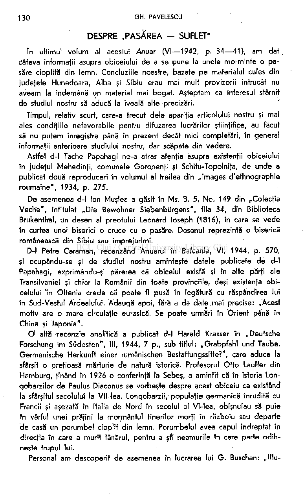

### DESPRE .PASAREA - SUFLET"

în ultimul volum al acestui Anuar (VI—1942, p. 34—41), am dat Câteva informafii asupra obiceiului de a se pune la unele morminte o pasăre cioplită din lemn. Concluziile noastre, bazate pe materialul cules din judefele Hunedoara, Alba şi Sibiu erau mai mult provizorii întrucât nu aveam la îndemână un material mai bogat. Aşteptam ca interesul stârnit de studiul nostru să aducă la iveală alte precizări.

Timpul, relativ scurt, care-a trecut delà apariţia articolului nostru şi mai ales condiţiile nefavorabile pentru difuzarea lucrărilor ştiinţifice, au făcut să nu putem înregistra până în prezent decât mici completări, în general informaţii anterioare studiului nostru, dar scăpate din vedere.

Astfel d-l Tache Papahagi ne-a atras atenţia asupra existenţii obiceiului în judeţul Mehedinţi, comunele Goro.nenţi şi Schitu-Topolniţa, de unde a publicat două reproduceri în volumul al treilea din „Images d'ethnographie roumaine", 1934, p. 275.

De asemenea d-l Ion Muşlea a găsit în Ms. B. 5, No. 149 din „Colecţia Veche", întitulat „Die Bewohner Siebenbürgens", fila 34, din Biblioteca Brukenthal, un desen al preotului Leonard loseph (1816), în care se vede în curtea unei biserici o cruce cu o pasăre. Desenul reprezintă o biserică românească din Sibiu sau împrejurimi.

D-l Petre Caraman, recenzând Anuarul în Bakania, VI, 1944, p. 570, şi ocupându-se şi de studiul nostru aminteşte datele publicate de d-l Popahagi, exprimându-şi părerea că obiceiul există şi în alte părţi ale Transilvaniei şi chiar la Românii din toate provinciile, deşi existenţa obiceiului 'în Oltenia crede că poate fi pusă în legătură cu răspândirea lui în Sud-Vestul Ardealului. Adaugă apoi, fără a da date mai precise: „Acest motiv are o mare circulaţie eurasică. Se poate urmări în orient până în China şi Japonia".

Ö altă 'recenzie analitică a publicat d-l Harald Krasser în „Deutsche Forschung im Südosten", III, 1944, 7 p., sub titlul: „Grabpfahl und Taube. Germanische Herkunft einer rumänischen Bestattungssitte?", care aduce la sfârşit o preţioasă mărturie de natură istorică. Profesorul Otto Lauffer din Hamburg, ţinând în 1926 o conferinţă la Sebeş, a amintit că în istoria Longobarzilor de Paulus Diaconus se vorbeşte despre acest obiceiu ca existând la sfârşitul secolului la Vll-lea. Longobarzii, populaţie germanică înrudită cu Francii şi aşezată în Italia de Nord în secolul al Vl-lea, obişnuiau să puie în vârful unei prăjini la mormântul tinerilor morţi în războiu sau departe de casă un porumbel cioplit din lemn. Porumbelul avea capul îndreptat în direcţia în care a murit tânărul, pentru a şfi neamurile în care parte odihneşte trupul lui.

Personal am descoperit de asemenea în lucrarea lui G. Buschan: „lllu-

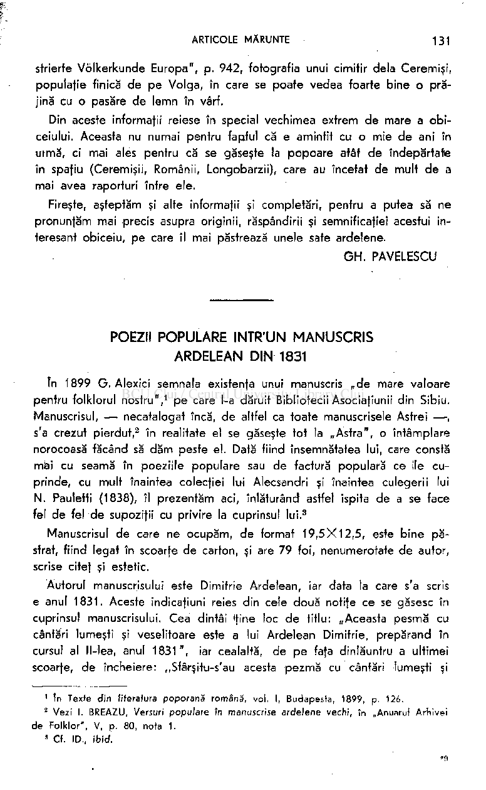

strierte Völkerkunde Europa", p. 942, fotografia unui cimitir delà Ceremişi, populafie finică de pe Volga, în care se poate vedea foarte bine o prăjină cu o pasăre de lemn în vârf.

Din aceste informaţii reiese în special vechimea extrem de mare a obiceiului. Aceasta nu numai pentru faptul că e amintit cu o mie de ani în utmă, ci mai ales pentru că se găseşte la popoare atât de îndepărtate în spafiu (Ceremişii, Românii, Longobarzii), care au încetat de mult de a mai avea raporturi între ele.

Fireşte, aşteptăm şi alte informafii şi completări, pentru a putea să ne pronunfam mai precis asupra originii, răspândirii şi semnificaţiei acestui interesant obiceiu, pe care îl mai păstrează unele sate ardelene.

GH . PAVELËSCU

### POEZII POPULARE INTR'UN MANUSCRIS ARDELEAN DIN 1831

Tn 1899 G. Alexici semnala existenta unui manuscris „de mare valoare pentru folklorul nostru",

pe care l-a dăruit Bibliotecii Asociafiunii din Sibiu. Manuscrisul, — necatalogat încă, de altfel ca toate manuscrisele Astrei — , s'a crezut pierdut,

1

în realitate el se găseşte tot la „Astra", o întâmplare norocoasă făcând să dăm peste el. Dată fiind însemnătatea lui, care constă mai cu seamă în poeziile populare sau de factură populară ce (le cuprinde, cu mult înaintea colecţiei lui Alecsandri şi înaintea culegerii lui N. Pauletti (1838), îl prezentăm aci, înlăturând astfel ispita de a se face fel de fel de supoziţii cu privire la cuprinsul lui.

2

3

Manuscrisul de care ne ocupăm, de format 19,5X12,5, este bine păstrat, fiind legat în scoarfe de carton, şi are 79 foi, nenumerotafe de autor, scrise cite} şi estetic.

Autorul manuscrisului este Dimitrie Ardelean, iar data la care s'a scris e anul 1831. Aceste indica}iuni reies din cele două noti}e ce se găsesc în cuprinsul manuscrisului. Cea dintâi i}ine loc de titlu: „Aceasta pesmă cu cântări lumeşti şi veselitoare esfe a lui Ardelean Dimitrie, preparând în cursul al ll-lea, anul 1831", iar cealaltă, de pe fafa dinlăuntru a ultimei scoabe, de încheiere: ,,Sfârşitu-s'au acesta pezmă cu cântări lumeşti şi

- 1 In Texfe din literatura poporană română, vol. I, Budapesta, 1899, p. 126.
- 2 Vezi I. BREAZU, Versuri populare în manuscrise ardelene vechi, în „Anuarul Arhivei

de Folklor", V, p. 80, nota 1.

Cf. ID., ibid .

ä

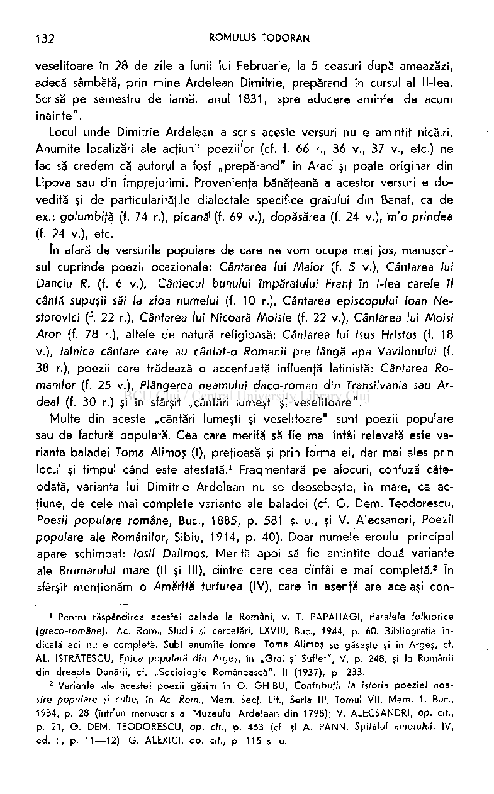

veselitoare în 28 de zile a lunii lui Februarie, la 5 ceasuri după ameazăzi, adecă sâmbătă, prin mine Ardelean Dimitrie, preparând în cursul al ll-lea. Scrisă pe semestru de iarnă, anul 1831, spre aducere aminte de acum înainte".

Locul unde Dimitrie Ardelean a scris aceste versuri nu e amintit nicăiri. Anumite localizări ale acţiunii poeziilor (cf. f. 66 r., 36 v., 37 v., etc.) ne fac să credem că autorul a fost „preparând" în Arad şi poate originar din Lipova sau din împrejurimi. Provenienţa bănăţeană a acestor versuri e dovedită şi de particularităţile dialectale specifice graiului din Banat, ca de ex.: golumbifă (f. 74 r.), pioanä (f. 69 v.), dopăsărea (f. 24 v.), m'o prindea (f. 24 v.), etc.

în afară de versurile populare de care ne vom ocupa mai jos, manuscrisul cuprinde poezii ocazionale: Cântarea lui Maior (f. 5 v.), Cântarea lui Danciu R. (f. 6 v.), Cântecul bunului "împăratului Franţ în l-lea carele ?l cântă supuşii săi la zioa numelui (f. 10 r.), Cântarea episcopului foan Nestorovici (f. 22 r.), Cântarea lui Nicoarë Moisie (f. 22 v.), Cântarea lui Moisi Aron (f. 78 r.), altele de natură religioasă: Cântarea lui (sus Hristos (f. 18 v.), Jalnica cântare care au cântat-o Romanii pre lângă apa Vavilonului (f. 38 r.), poezii care trădează o accentuată influenţă latinistă: Cântarea Romanilor (f. 25 v.), Plângerea neamului daco-roman din Transilvania sau Ardeal (f. 30 r.) şi în sfârşit „cântări lumeşti şi veselitoare".

Multe din aceste „cântări lumeşti şi veselitoare" sunt poezii populare sau de factură populară. Cêa care merită să fie mai întâi relevată este varianta baladei Torna Al/moş (I), preţioasă şi prin forma ei, dar mai ales prin locul şi timpul când este atestată.

Fragmentară pe alocuri, confuză câteodată, varianta lui Dimitrie Ardelean nu se deosebeşte, în mare, ca acţiune, de cele mai complete variante ale baladei (cf. G. Dem. Teodorescu, Poesii populare române, Buc, 1885, p. 581 ş. u., şi V. Alecsandri, Poezii populare ale Români/or, Sibiu, 1914, p. 40). Doar numele eroului principal apare schimbat: /os/f Dalimos. Merită apoi să fie amintite două variante ale Brumarului mare (II şi III), dintre care cea dintâi e mai completă.

1

în sfârşit menţionăm o Amantă turturea (IV), care în esenţă are acelaşi con-

2

Pentru răspândirea acestei balade la Români, v. T. PAPAHAGI , Parafe/e folklorice (greco-române). Ac. Rom., Studii şi cercetări, LXVIII, Buc , 1944, p. 60. Bibliografia in dicată aci nu e completă. Subt anumite forme, Torna Alimoş se găseşte şi în Argeş, cf. AL. ISTRĂTESCU, Epica populară din Argeş, în „Grai şi Suflet", V, p. 248, şi la Românii din dreapta Dunării, cf. „Sociologie Românească", II (1937), p. 233.

1

Variante ale acestei poezii găsim în O . GHIBU , Contribuţii la istoria poeziei noasfre populare şi cu/te, în Ac. Rom., Mem . Sec}. Lit., Seria III, Tomul VII, Mem . 1, Buc , 1934, p. 28 (într'un manuscris al Muzeului Ardelean din 1798); V. ALECSANDRI, op . cit., p. 21 , G . DEM. TEODORESCU, op . cit., p. 453 (cf. şi A. PANN , Spitalul amorufui, IV, ed. Il, p. 11—12), G. ALEXICI, op . cit., p. 115 ş. u.

2

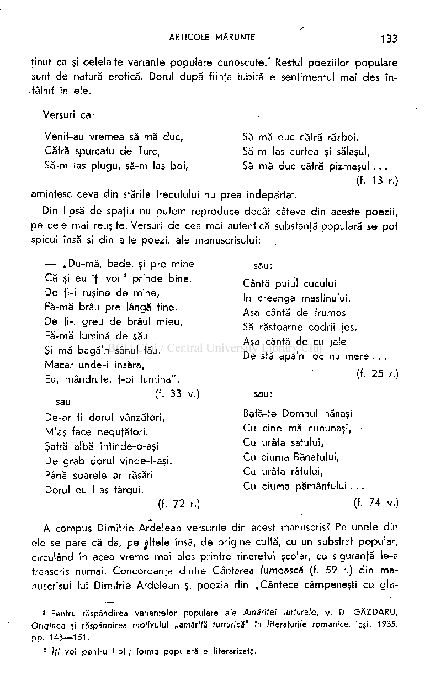

ţinut ca şi celelalte variante populare cunoscute.

Restul poeziilor populare sunt de natură erotică. Dorul după fiinţa iubită e sentimentul mai des întâlnit în ele.

1

Versuri ca:

Venit-au vremea să mă duc, Cătră spurcatu de Turc, Să-m las plugu, să-m las boi,

Să mă duc cătră război. Să-m las curtea şi sălaşul, Să mă duc cătră pizmaşul . . .

(f. 13 r.) amintesc ceva din stările trecutului nu prea îndepărtat.

Din lipsă de spaţiu nu putem reproduce decât câteva din aceste poezii, pe cele mai reuşite. Versuri de cea mai autentică substanţă populară se pot spicui însă şi din alte poezii ale manuscrisului:

— „Du-mă, bade, şi pre mine Că şi eu îţi voi

sau: Cântă puiul cucului In creanga măslinului. Aşa cântă de frumos Să răstoarne codrii jos. Aşa cântă de cu jale De stă apa'n loc nu mere . . .

prinde bine. De ţi-i ruşine de mine, Fă-mă brâu pre lângă tine. De ţi-i greu de brâul mieu, Fă-mă lumină de său Şi mă bagă'n sânul tău. Măcar unde-i însăra, Eu, mândrule, ţ-oi lumina".

2

- (f. 25 r.)

(f. 33 v.)

sau: Bată-te Domnul nănaşi Cu cine mă cununaşi, Cu urâta satului, Cu ciuma Bănatului, Cu urâta râtului, Cu ciuma pământului . . .

sau: De-ar fi dorul vânzători, M'aş face neguţători. Şatră albă întinde-o-aşi De grab dorul vinde-l-aşi. Până soarele ar răsări Dorul eu l-aş târgui.

(f. 74 v.)

(f. 72 r.)

A compus Dimitrie Ardelean versurile din acest manuscris? Pe unele din ele se pare că da, pe altele însă, de origine cultă, cu un substrat popula*-, circulând în acea vreme mai ales printre tineretul şcolar, cu siguranţă le-a transcris numai. Concordanţa dintre Cântarea lumească (f. 59 r.) din manuscrisul lui Dimitrie Ardelean şi poezia din „Cântece câmpeneşti cu gla-

» Pentru răspândirea variantelor populare ale Amărîfei turturele, v. D. GĂZDARU , Originea şi răspândirea motivului „amărîfă turturică" in literaturile romanice, laşi, 1935, pp . 143—151 .

î/i voi pentru f-oi ; forma populară e literarizată.

2

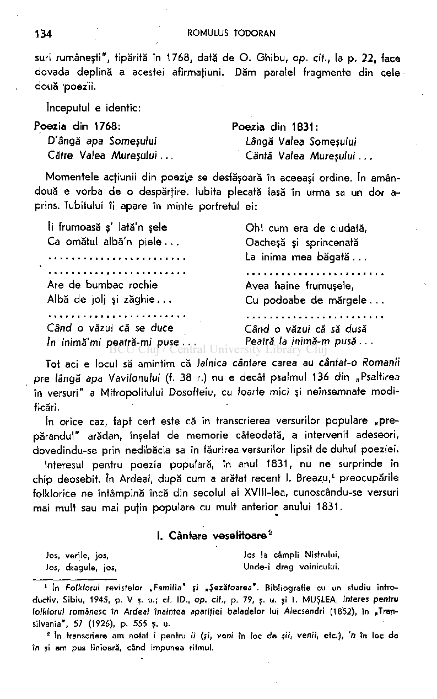

suri rumeneşti", tipărită în 1768, dată de O. Ghibu, op. cit., la p. 22, face dovada deplină a acestei afirmafiuni. Dăm paralel fragmente din cele două poezii.

Începutul e identic:

Poezia din 1768: Poezia din 1831: D'ângă apa Someşului Lângă Valea Someşului Către Valea Mureşului... Cântă Valea Mureşului.. .

Momentele acfiunii din poezie se desfăşoară în aceeaşi ordine. In amândouă e vorba de o despărfire. Iubita plecată lasă în urma sa un dor aprins. Iubitului îi apare în minte portretul ei:

fi frumoasă ş' lată'n şele Oh! cum era de ciudată, Ca omătul albă'n piele . .. Oacheşă şi sprincenată

La inima mea băgată . . .

Are de bumbac rochie Avea haine frumuşele, Albă de joij şi zăghie.. . Cu podoabe de mărgele . . .

Când o văzui că se duce Când o văzui că să dusă In inimă'mi peafră-mi puse . . . Peatră la inimă-m pusă. . .

Tot aci e locul să amintim că Jalnica cântare carea au cântat-o Romanii pre lângă apa VaviJonului (f. 38 r.) nu e decât psalmul 136 din „Psaltirea în versuri" a Mitropolitului Dosofteiu, cu foarte mici şi neînsemnate modificări.

In orice caz, fapt cert este că în transcrierea versurilor populare „prepărandul" arădan, înşelat de memorie câteodată, a intervenit adeseori, dovedindu-se prin nedibăcia sa în făurirea versurilor lipsit de duhul poeziei.

Interesul pentru poezia populară, în anul 1831, nu ne surprinde în chip deosebit. în Ardeal, după cum a arătat recent I. Breazu,

preocupările folklorice ne întâmpină încă din secolul al XVIII-lea, cunoscându-se versuri mai mult sau mai puţin populare cu mult anterior anului 1831.

1

#### I. Cântare vesel itoare2

###### Jos, verile, jos, Jos la câmpii Nistrului, Jos, dragule, jos, Unde-i drag voinicului,

###### In Folk/orul revistelor „Familia" şi „Şezătoarea". Bibliografie cu un studiu introductiv, Sibiu, 1945, p. V ş. u.; cf. ID., op. cit., p. 79, ş. u. şi I. MUŞLEA, Interes pentru folklorul românesc în Ardeal înaintea aparifiei baladelor lui Alecsandri (1852), în „Transilvania", 57 (1926), p. 555 ş. u.

1

###### In transcriere am notat / pentru ii (şi, veni în loc de f/i, venii, etc.), 'n în loc de în şi am pus linioară, când impunea ritmul.

2

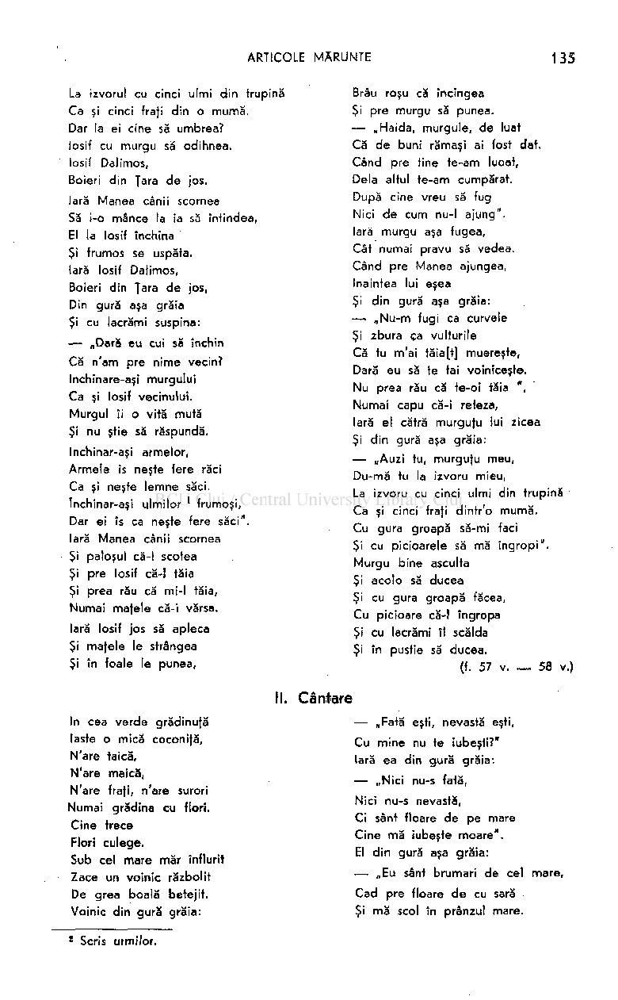

Brâu roşu că încingea Şi pre murgu să punea.

La izvorul cu cinci ulmi din trupină Ca şi cinci fraţi din o mumă. Dar la ei cine să umbrea? losif cu murgu să odihnea. losif Dalimos, Boieri din Ţara de jos. Iară Manea cânii scornea Să i-o mance la ia să întindea, El la losif închina Şi frumos se uspăta. Iară losif Dalimos, Boieri din Ţara de jos, Din gură aşa grăia Şi cu lacrămi suspina:

— „Haida, murgule, de luat Că de buni rămaşi ai fost dat. Când pre tine te-am luoat, Delà altul te-am cumpărat. După cine vreu să fug Nici de cum nu-l ajung". Iară murgu aşa fugea, Cât numai pravu să vedea. Când pre Manea ajungea, înaintea lui eşea Şi din gură aşa grăia:

— „Nu-m fugi ca curvele Şi zbura ca vuiturile Că tu m'ai tăia [t] muereşte, Dară eu să te tai voiniceşte. Nu prea rău că te-oi tăia Numai capu că-i reteza, Iară el cătră murgufu lui zicea Şi din gură aşa grăia:

— „Dară eu cui să închin Că n'am pre nime vecin? Inchinare-aşi murgului Ca şi losif vecinului. Murgul îi o vită mută Şi nu ştie să răspundă. Inchinar-aşi armelor, Armele îs neşte fere răci Ca şi neşte lemne săci. Inchinar-aşi qlmilor

— „Auzi tu, murgufu meu, Du-mă tu la izvoru mieu, La izvoru cu cinci ulmi din trupină Ca şi cinci fraji dintr'o mumă. Cu gura groapă să-mi faci Şi cu picioarele să mă îngropi". Murgu bine asculta Şi acolo să ducea Şi cu gura groapă făcea, Cu picioare că-l îngropa Şi cu lacrămi îl scălda Şi în pustie să ducea.

frumoşi, Dar ei îs ca neşte fere săci". Iară Manea cânii scornea Şi paloşul că-l scotea Şi pre losif că-l tăia Şi prea rău că mi-l tăia, Numai majele că-i vărsa. Iară losif jos să apleca Şi matele le strângea Şi în foaie le punea,

1

(f. 57 v. — 58 v.)

##### Cântare

##### II.

In cea verde grădinufă laste o mică coconită, N'are taică, N'are maică, N'are fraji, n'are surori

— „Fată eşti, nevastă eşti, Cu mine nu te iubeşti?" Iară ea din gură grăia:

— „Nici nu-s fată, Nici nu-s nevastă, Ci sânt floare de pe mare Cine mă iubeşte moare". El din gură aşa grăia:

Numai grădina cu flori. Cine trece Flori culege. Sub cel mare măr înflurit Zace un voinic războlit De grea boală betejit. Voinic din gură grăia:

— „Eu sânt brumari de cel mare. Cad pre floare de cu sară Şi mă scol în prânzul mare.

Scris urmi/or.

!

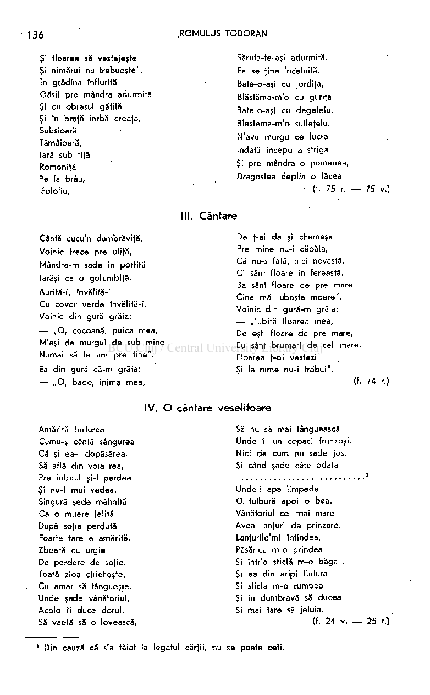

Săruta-te-aşi adurmită. Ea se fine 'nceluită. Bate-o-aşi cu jordifa, Blăstăma-m'o cu gurifa. Bate-o-aşi cu degetelu , Blestema-m'o suflefelu. N'avu murgu ce lucra îndată începu a striga Şi pre mândra o pomenea , Dragostea depli n o făcea.

Şi floarea să vestejeşte Şi nimărui nu trebueşte". tn grădina înflurită Găsii pre mândra adurmită Şi cu obrasul gătită Şi în brafă iarbă creafă, Subsioara Tămâioară, Iară sub fifă Romonifă Pe la brâu,

(f. 75 r. — 75

Folofiu,

Cântare

##### III.

De f-ai da şi chemeşa Pre mine nu-i căpăta, Că nu-s fată, nici nevastă, Ci sânt floare în fereastă. Ba sânt floare d e pre mare Cine mă iubeşte moare" . Voinic din gură- m grăia:

Cântă cucu'n dumbrăvifă, Voinic trece pre ulifă, Mândra- m şade în portifă Iarăşi ca o golumbifă . Aurită-i, învălită-i Cu covor verde învălită-i. Voinic din gură grăia:

— „Iubită floarea mea, De eşti floare d e pre mare, Eu sânt brumari de cel mare, Floarea f-oi veştezi Şi la nime nu-i frăbui" .

— „O , cocoană, puica mea, M'aşi da murgul d e sub mine Numai să te am pre tine" . Ea din gură că-m grăia:

(f. 74

— „O , bade, inima mea,

##### IV. O cântare veselifoare

Amărîtă turturea Să nu să mai tânguească. Cumu-ş cântă sângurea Unde îi un copaci frunzoşi, Că şi ea-i dopăsărea, Nici d e cu m nu şade jos. Să află din voia rea, Şi când şade câte odată Pre iubitul şi-l perdea Şi nu-l mai vedea. Unde-i apa limped e Singură şede mâhnită O tulbură apoi o bea. Ca o muere jelită. Vânătoriul cel mai mare După sofia perdută Avea lanfuri d e prinzare. Foarte tare e amărîtăi. Lanfurile'mi întindea, Zboară cu urgie Păsărică m-o prindea De perdere de sofie. Şi într'o sticlă m-o băga Toată zioa ciricheşte, Şi ea din aripi flutura Cu amar să tângueşte. Şi sticla m- o rumpea Und e şade vânătoriul, Şi în dumbrav ă să ducea Acolo îi duce dorul . Şi mai tare să jeluia. Să vaetă să o lovească, (f. 24 v.

Din cauză că s'a tăiat la legatul cărţii, nu se poate ceti.

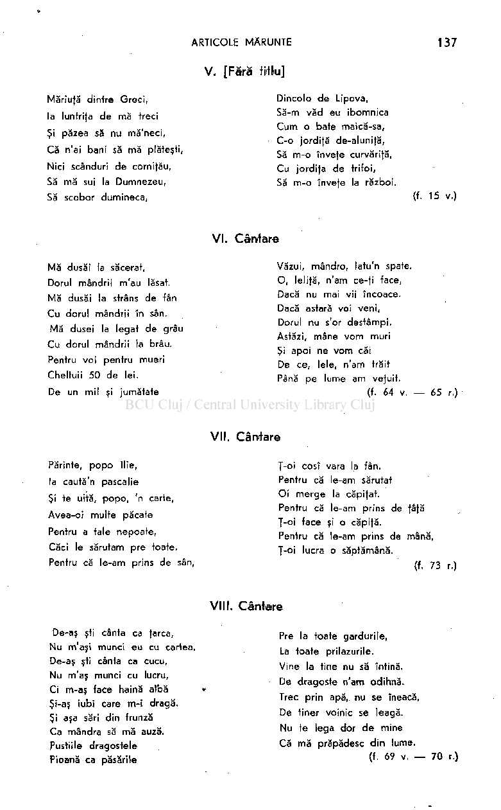

##### V. [Fără titlu]

Dincolo de Lipova, Să-m văd eu ibomnica Cum o bate maică-sa, C-o jordifă de-alunifă, Să m-o învefe curvărită, Cu jordifa de trifoi, Să m-o învefe la război.

Măriufă dintre Greci, la luntrifa de mă treci Şi păzea să nu mă'neci, Că n'ai bani să mă plăteşti, Nici scânduri de cornifău, Să mă sui la Dumnezeu, Să scobor dumineca,

(f. 15

##### VI. Cântare

Văzui, mândro, latu'n spate. O, lelifă, n'am ce-fi face, Dacă nu mai vii încoace. Dacă astară voi veni, Dorul nu s'or destâmpi. Astăzi, mâne vom muri Şi apoi ne vom căi De ce, lele, n'am trăit Până pe lume am vefuit.

Mă dusăi la săcerat, Dorul mândrii m'au lăsat. Mă dusăi la strâns de fân Cu dorul mândrii în sân.

Mă dusei la legat de grâu Cu dorul mândrii la brâu. Pentru voi pentru mueri Cheltuii 50 de lei. De un mii şi jumătate

(f. 64V — 65

##### VII.

##### Cântare

Părinte, popo llie, la caută'n pascalie Şi te uită, popo, 'n carte, Avea-oi multe păcate Pentru a tale nepoate, Căci le sărutam pre toate. Pentru că le-am prins de sân,

Ţ-oi cosî vara la fân. Pentru că le-am sărutat Oi merge la căpifat. Pentru că le-am prins de fâfă Ţ-oi face şi o căpiţă. Pentru că le-am prins de mână, Ţ-oi lucra o săptămână.

(f. 73

##### VIII. Cântare

De-aş şti cânta ca farca, Nu m'aşi munci eu cu cartea. De-aş şti cânta ca cucu, Nu m'aş munci cu lucru, Ci m-aş face haină albă Şi-aş iubi care m-i dragă. Şi aşa sări din frunză Ca mândra să mă auză. Pustiile dragostele Pioană ca păsările

Pre la toate gardurile, La toate prilazurile. Vine la tine nu să întina. De dragoste n'am odihnă. Trec prin apă, nu se îneacă, De tiner voinic se leagă. Nu te lega dor de mine Că mă prăpădesc din lume.

(f. 69 v. — 70

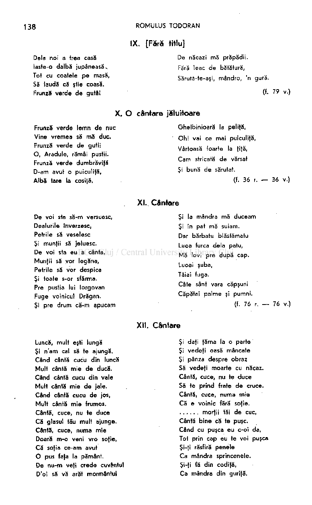

##### IX. [Fără titlu]

De nâcazi mă prăpădii. Fără leac de bătătură, Sărută-te-aşi, mândro, 'n gură.

Delà noi a frea casă laste-o dalbă jupâneasă. Tot cu coatele pe masă, Să laudă că ştie coasă. Frunză verde de gutei

(f. 79

# X. o

##### cântare jăluiioare

Ghelbinioară la peliţă, Ohl vai ce mai puiculiţă, Vârtoasă toarte la t't^< Cam stricată de vărsat Şi bună de sărutat.

Frunză verde lemn de nuc Vine vremea să mă duc. Frunză verde de gutii O, Aradule, rămâi pustii. Frunză verde dumbrăvifă D-am avut o puiculijă, Albă tare la cosiţă,

(f. 36 r. — 36

##### XI.. Cântare

Şi la mândra mă duceam Şi în pat mă suiam. Dar bărbatu blăstămatu Luoa furca delà patu, Mă lovi pre după cap. Luoai şuba, Tăiai fuga. Câte sânt vara căpşuni Căpătai palme şi pumni.

De voi sta să-m versuesc, Dealurile înverzesc, Petrile să veselesc Şi munţii să jeluesc. De voi sta eu a cânta, Munţii să vor legăna, Petrile să vor despica Şi toate s-or sfărma. Pre pustia lui Iorgovan Fuge voinicul Drăgan. Şi pre drum că-m apucam

(f. 76 r. 76

##### XII. Cântare

Şi daţi ţărna la o parte Şi vedeţi oasă mâncate Şi pânza despre obraz Să vedeţi moarte cu năcaz. Cântă, cuce, nu te duce Să te prind frate de cruce. Cântă, cuce, numa mie Că e voinic fără soţie.

Luncă, mult eşti lungă Şi n'am cal să te ajungă. Când cântă cucu din luncă Mult cântă mie de ducă. Când cântă cucu din vale Mult cântă mie de jale. Când cântă cucu de jos, Mult cântă mie frumos. Cântă, cuce, nu te duce Că glasul tău mult ajunge. Cântă, cuce, numa mie Doară m-o veni vro soţie, Că soţia ce-am avut O pus faţa la pământ. De nu-m veţi crede cuvântul D'oi să vă arăt mormântul

morţii tăi de cuc, Cântă bine că te puşc. Când cu puşca eu c-oi da, Tot prin cap eu te voi puşca Şi-ţi răsfiră penele Ca mândra sprincenele. Şi-ji fă din codiţă, Ca mândra din guriţă.

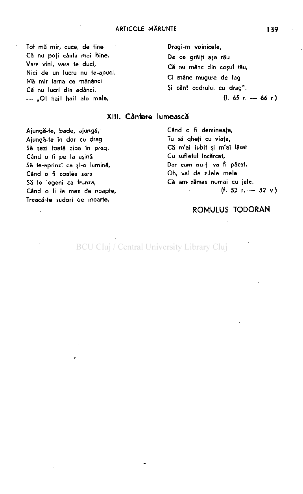

Dragi-m voinicele, De ce grăifi aşa rău Că nu mâne din coşul tău, Ci mâne mugure d e fag Şi cânt codrului cu drag".

Tot mă mir, cuce, de tine Că nu poţi cânta mai bine. Vara vini, vara te duci, Nici de un lucru nu te-apuci. Mă mir iarna ce mănânci Că nu lucri din adânci.

— „O ! hai! hai! ale mele,

(f. 65 r. — 66 r.)

##### XIII. Cântare

##### lumească

Când o fi demineafa, Tu să ghefi cu viata, Că m'ai iubit şi m'ai lăsat Cu sufletul încărcat, Dar cum nu-fi va fi păcat. Oh, vai d e zilele mele Că a m rămas numai cu jale.

Ajungă-te, bade, ajungă,' Ajungă-te în dor cu drag Să şezi toată zioa în prag. Când o fi pe la uşină Să te-aprinzi ca şi-o lumină, Când o fi coalea sara Să te legeni ca frunza, Când o fi la mez d e noapte, Treacă-te sudori de moarte,

(f. 32 r. — 32 v.)

ROMULUS TODORAN

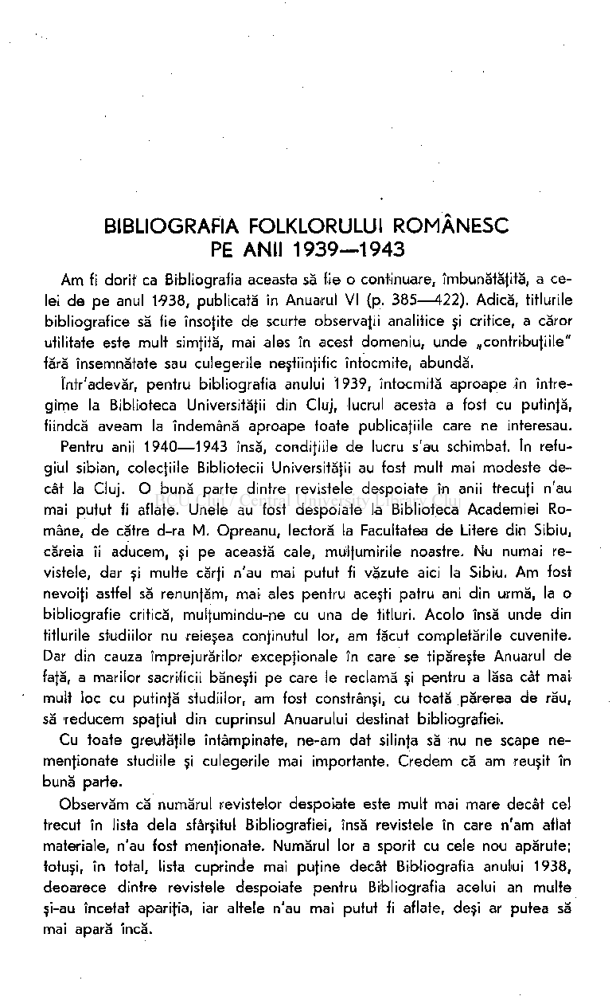

## BIBLIOGRAFIA FOLKLORULUI ROMÂNESC PE ANII 1939—1943

Am fi dorit ca Bibliografia aceasta să fie o continuare, îmbunătăţită, a celei de pe anul 1-938, publicată în Anuarul VI (p. 385—422). Adică, titlurile bibliografice să fie însoţite de scurte observaţii analitice şi critice, a căror utilitate este mult simţită, mai ales în acest domeniu, unde „contribuţiile" fără însemnătate sau culegerile neştiinţific întocmite, abundă.

într'adevăr, pentru bibliografia anului 1939, întocmită aproape In întregime la Biblioteca Universităţii din Cluj, lucrul acesta a fost cu putinţă, fiindcă aveam la îndemână aproape toate publicaţiile care ne interesau.

Pentru anii 1940—1943 însă, condiţiile de lucru s'au schimbat. în refugiul sibian, colecţiile Bibliotecii Universităţii au fost mult mai modeste decât la Cluj. O bună parte dintre revistele despoiate în anii trecuţi n'au mai putut fi aflate. Unele au fost despoiate la Biblioteca Academiei Române, de către d-ra M. Opreanu, lectoră la Facultatea de Litere din Sibiu, căreia îi aducem, şi pe această cale, mulţumirile noastre. Nu numai revistele, dar şi multe cărţi n'au mai putut fi văzute aici la Sibiu. Am fost nevoiţi astfel să renunţăm, mai ales pentru aceşti patru ani din urmă, la o bibliografie critică, mulţumindu-ne cu una de titluri. Acolo însă unde din titlurile studiilor nu reieşea conţinutul lor, am făcut completările cuvenite. Dar din cauza împrejurărilor excepţionale în care se tipăreşte Anuarul de faţă, a marilor sacrificii băneşti pe care le reclamă şi pentru a lăsa cât mai mult loc cu putinţă studiilor, am fost constrânşi, cu toată părerea de rău, să reducem spaţiul din cuprinsul Anuarului destinat bibliografiei.

Cu toafe greutăţile întâmpinate, ne-am dat silinţa să nu ne scape nemenţionate studiile şi culegerile mai importante. Credem că am reuşit în bună parte.

Observăm că numărul revistelor despoiate este mult mai mare decât cel trecut în lista dela sfârşitul Bibliografiei, însă revistele în care n'am aflat materiale, n'au fost menţionate. Numărul lor a sporit cu cele nou apărute; totuşi, în total, lista cuprinde mai puţine decât Bibliografia anului 1938, deoarece dintre revistele despoiate pentru Bibliografia acelui an multe şi-au încetat apariţia, iar altele n'au mai putut fi aflate, deşi ar putea să mai apară încă.

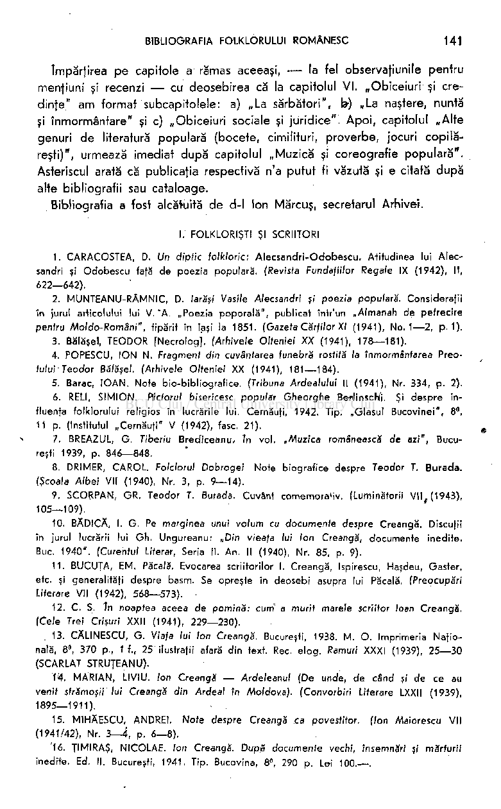

Tmpărfirea pe capitole a rămas aceeaşi, — la fel observaţiunile pentru menţiuni şi recenzi — cu deosebirea că la capitolul VI. „Obiceiuri şi credinţe" am format subcapitolele: a) „La sărbători", b) „La naştere, nuntă şi înmormântare" şi c) „Obiceiuri sociale şi juridice". Apoi, capitolul „Alte genuri de literatură populară (bocete, cimilituri, proverbe, jocuri copilăreşti)", urmează imediat după capitolul „Muzică şi coreografie populară". Asteriscul arată că publicaţia respectivă n'a putut fi văzută şi e citată după alte bibliografii sau cataloage.

Bibliografia a fost alcătuită de d-l Ion Mărcuş, secretarul Arhivei.

I. FOLKLORIŞTI Şl SCRIITORI

1. CARACOSTEA, D. Un diptic folkloric: Alecsandri-Odobescu . Atitudinea lui Alecsandri şi Odobesc u faţă de poezia populară. (Revista Fundaţiilor Regale IX (1942), II, 622—642) .

- 2. MUNTEANU-RÂMNIC , D. Iarăşi Vas/le Alecsandri şi poezia populară. Consideraţii

în jurul articolului Iui V. "A. „Poezia poporală" , publicat într'un „Almana h de petrecire pentru Moldo-Români" , tipărit în laşi la 1851. (Gazeta Cărţilor XI (1941), No. 1—2, p. 1).

- 3. Bălăşel, TEODOR [Necrolog] , (Arhivele O/teniei XX (1941), 178—181).
- 4. POPESCU, IO N N. Fragment din cuvântarea funebră rostită la înmormântarea Preo­

tului Teodor Bălăşel. (Arhivele Olteniei XX (1941), 181—184).

- 5. Barac, IOAN . Note bio-bibliografice. (Tribuna Ardealului || (1941), Nr. 334, p. 2).
- 6. RELI, SIMION . Pictorul bisericesc popular Gheorgh e Beflinschfi. Şi despre in­

fluenţa folklorului religios în lucrările lui. Cernăuţi, 1942. Tip. „Glasul Bucovinei" , 8°, 11 p. (Institutul „Cernăufi " V (1942), fasc. 21).

- 7. BREAZUL, G . Tiberiu Brediceanu . In voi. „Muzic a românească de azi" , Bucu­

reşti 1939, p. 846—848 .

- 8. DRIMER, CAROL. Folclorul Dobrogei . Note biografice despre Teodor T. Burada .

(Şcoala Albei VII (1940), Nr. 3, p. 9—14).

- 9. SCORPAN, GR. Teodor T. Burada. Cuvânt comemorativ. (Luminătorii Vll

<1943), 105—109)

#

- 10. BĂDICA, I. G. Pe marginea unui vofu m cu document e despre Creangă . Discuţii în jurul lucrării lui Gh . Ungureanu : „Din viea/a lui Ion Creangă, documente inedite. Buc. 1940". (Curentul Literar, Seria II. An . II (1940), Nr. 85, p. 9).
- 11. BUCUŢA, EM. Păcală. Evocarea scriitorilor I. Creangă, Ispirescu, Haşdeu, Gaster, etc. şi generalităţi despre basm. Se opreşte în deosebi asupra lui Păcală. (Preocupări Liferare VII (1942), 568—573).
- 12. C. S. In noaptea aceea de pomină : curri a murit marele scriitor loan Creangă.

(Cele Trei Crişuri XXII (1941), 229—230) .

- 13. CÄLINESCU, G . Viaţa fui Ion Creangă. Bucureşti, 1938. M. O . Imprimeria Naţio nală, 8°, 370 p., 1 f., 25 ilustraţii afară din text. Rec. elog . Ramuri XXXI (1939), 25—3 0 (SCARLAT STRUJEANU).
- 14. MARIAN , LIVIU. Ion Creangă — Ardeleanul (De unde, de când şi de ce au venit strămoşii lui Creangă din Ardeal in Moldova). (Convorbiri Literare LXXII (1939), 1895—1911).
- 15. MIHĂESCU, ANDREI. Not e despre Creangă ca povestitor. (Ion Maiorescu VII (1941/42), Nr. 3—4 , p. 6—8).

'16. ŢIMIRAŞ, NICOLAE. Ion Creangă. Dup ă documente vechi, însemnări şi mărturii inedite. Ed. II. Bucureşti, 1941. Tip. Bucovina, 8°, 290 p. Lei 100.—.

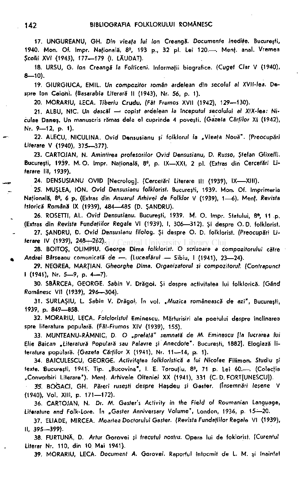

17. UNGUREANU, GH. Din vieafa lui Ion Creangă. Documente inedite. Bucureşti,

- 1940. Mon. Of. Impr. Naţională, 8°, 193 p., 32 pl. Lei 120.—. Menţ. anal. Vremea Jcoft'i XVI (1943), 177—179 (I. LĂUDAT).

- 18. URSU, G. Ion Creangă la Folticeni. Informaţii biografice. (Cuget Clar V (1940),

8—10).

- 19. GIURGIUCA, EMIL. Un compozitor român ardelean din secolul al XVII-lea. De­

spre Ion Caioni. (Basarabia Literară II (1943), Nr. 56, p. 1).

- 20. MORARIU, LECA. Tiberju Crudu. (Făt Frumos XVII (1942), 129—130).
- 21. ALBU, NIC. Un dascăl — copist ardelean la "începutul secolului al XlX-lea: Ni-

culae Daneş. Un manuscris rămas delà el cuprinde 4 poveşti. (Gazeta Cărţilor XI (1942), Nr. 9—12, p. 1).

- 22. ALECU, NICULINA. Ovid Densusianu şi fotklorul la .Vieafa Nouă". (Preocupări

Literare V (1940), 375—377).

- 23. CARTQJAN, N. Amintirea profesorilor Ovid Densusianu, D. Russo, Ştefan Glixelli.

Bucureşti, 1939. M. O. Impr. Naţională, 8», p. IX—XXI, 2 pl. (Extras din Cercetări Li­

- terare III, 1939).

- 24. DENSUSIANU OVID [Necrolog]. (Cercetări Literare III (1939), IX—XIII).
- 25. MUŞLEA, ION. Ovid Densusianu fo/k/orisf. Bucureşti, 1939. Mon. Of. Imprimeria

Naţională, 8», 6 p. (Extras din AnuaruJ Arhivei de Folklor V (1939), 1—6). Menf. Revista Istorice Română IX (1939), 484—485 (D. ŞANDRU).

- 26. ROSETTI, AL. Ovid Densusianu. Bucureşti, 1939. M\ O. Impr. Sfatului, 8«, 11 p.

(Extras din Revista Fundaţiilor Regale VI (1939), I, 306—312). Şi despre O. D. folklorist.

- 27. ŞANDRU, D. Ovid Densusianu filolog. Şi despre O. D. folklorist. (Preocupări Li­

terare IV (1939), 248—262).

- 28. BOITOŞ, OLIMPIU. George Dima fo/k/orisf. O scrisoare a compozitorului către

Andrei Bârseanu comunicată de —. (Luceafărul — Sibiu, I (1941), 23—24).

- 29. NEGREA, MARJIAN. Gheorghe Dima. Organizatorul fi compozitorul (Contrapunct

- I (1941), Nr. 5—9, p. 4—7).

- 30. SBÂRCEA, GEORGE. Sabin V. Drăgoi. Şi despre activitatea lui folklorică. (Gând Românesc VII (1939), 296—304).
- 31. SURLAŞIU, L. Sabin V. Dragor. In voi. „Muzica românească de azi", Bucureşti, 1939, p. 849—858.
- 32. MORARIU, LECA. Folcloristul Eminescu. Mărturisiri ale poetului despre înclinarea spre literatura populară. (Făf-Frumos XIV (1939), 155).
- 33. MUNTEANU-RÂMNIC, D. O „prefaţă" semnate de M. Eminescu [la lucrarea fui E/ie Baican .Literatură Populara' sau Palavre şi Anecdote". Bucureşti, 1882]. Elogiază literatura populară. (Gazeta Cărfi/or X (1941), Nr. 11—14, p. 1).
- 34. BAICULESCU, GEORGE. Activitatea iotkloristică a lui Nicolae Filimon. Studiu şi texte. Bucureşti, 1941'. Tip. „Bucovina", I. E. Toroutiu, 8°, 71 p. Lei 60.—. (Colecţia „Convorbiri Literare"). Menf. Arhivele O/teniei XX (1941), 331 (C. D. FORT[UNESCU]).

313. BOGACI, GH. Păreri ruseşti despre Haşdeu şi Gaster. (însemnări Ieşene V

(1940), Voi. XIII, p. 171—172).

- 36. CARTOJAN, N. Dr. M. Gaster's Acf/vify in fhe Field of Roumanian Language,

Lifarafure and Folk-Lore. In „Gaster Anniversary Volume", London, 1936, p. 15^20.

- 37. ELIADE, MIRCEA. Moartea Doctorului Gaster. (Revista Fundaţiilor Regale VI (1939),

II, 395—399).

- 38. FURTUNĂ, D. Arfur Gorovei şi trecutul nostru. Opera lui de foklorist. (Curentul

Literar Nr. 110, din 10 Mai 1941).

- 39. MORARIU, LECA. Document A. Gorovei. Raportul întocmit de L. M. şi înaintat

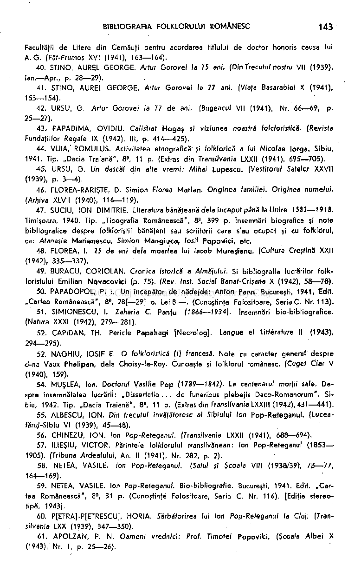

Facultăfii de Litere din Cernaufi pentru acordarea titlului de doctor honoris causa lui A. G. (Făt-Frumos XVI (1941), 163—164).

- 40. STINO, AUREL GEORGE. Ariur Gorovei la 75 ani. (Din Trecutuf nostru VII (1939),

lan.—Apr., p. 28—29).

- 41. STINO, AUREL GEORGE. Artur Gorovei la 77 ani. (Via/a Basarabiei X (1941),

153—154).

- 42. URSU, G. Artur Gorovei la 77 de ani. (Bugeacu/ VII (1941), Nr. 66—69, p.

25—27).

- 43. PAPADIMA, OVIDIU. Calistrat Hogaş şi viziunea noastră folcloristici. (Revista

Fundaţiilor Regale IX (1942), III, p. 414—425).

- 44. VUIA,' ROMULUS. Activitatea etnografică si folk/orică a lui Nicolae lorga. Sibiu,

1941. Tip. „Dacia Traiană", 8°, 11 p. (Extras din Transilvania LXXII (1941), 695—705).

- 45. URSU, G. Un dascăl din alte vremi: Mihai Lupescu. (Vestitorul Safefor XXVII

- (1939), p. 3—4).

- 46. FLOREA-RARIŞTE, D. Simion Florea Marian. Originea familiei. Originea numelui. (Arhiva XLVII (1940), 116—119).
- 47. SUCIU, ION DIMITRIE. Literatura bănă/eană delà început până h Unire 1582—1918. Timişoara, 1940. Tip. „Tipografia Românească", 8°, 399 p. însemnări biografice şi note bibliografice despre folkloriştii bănăfeni sau scriitorii care s'au ocupat şi cu folklorul, ca: Atanasie Marienescu, Simion Mangiuica, losil Popov/ici, etc.
- 48. FLOREA, I. 25 de ani delà moartea lui lacob Mureşlianu. (Cu/fura Creştină XXII

- (1942), 335—337).

- 49. BURACU, CORIOLAN. Cronica istorică a Almăjului. Şi bibliografia lucrărilor folkloristului Emilian Novacovici (p. 75). (Rev. Inst. Social Banat-Crişana X (1942), 58—78).
- 50. PAPADOPOL, P. I. Un începător de nădejde: Anton Pann. Bucureşti, 1941, Edil. „Cartea Românească", 8°, 28[—29] p. Lei 8.—. (Cunoştinţe Folositoare, Seria C, Nr. 113).
- 51. SIMIONESCU, I. Zaharia C. Panfu {1866—1934). însemnări bio-bibliografice. (Natura XXXI (1942), 279—281).
- 52. CAPIDAN, TH. Pericle Papahagi [Necrolog], Langue et Littérature 11 (1943), 294—295).

52. NAGHIU, lOSIF E. O fo/k/orisfică (f) francesă. Note cu caracter general despre d-na Vaux Phalipan, delà Choisy-le-Roy. Cunoaşte şi folklorul românesc. (Cuget C/ar V

(1940), 159).

54. MUŞLEA, Ion. Doctorul Vasi/ie p

o p

(1789—1842). La centenaruf morfii sale. Despre însemnătatea lucrării: „Dissertatio .. . de funeribus plebejis Daco-Romanorum". Sibiu, 1942. Tip. „Dacia Traiană", 8°, 11 p. (Extras din Transilvania LXXII! (1942), 431—441).

- 55. ALBESCU, ION. Din trecutul învăfătoresc al Sibiu/ui Ion Pop-Releganul. (Lucea-

făruJ-Sibiu VI (1939), 45—48).

- 56. CHINEZU, ION. Ion Pop-Reteganul. (Transilvania LXXII (1941), 688—694).
- 57. ILIEŞ1U, VICTOR. Părintele folkloru/ui transilvănean: Ion Pop-Reteganul (1853—

1905). (Tribuna Ardealului, An. II (1941), Nr. 282, p. 2).

- 58. NETEA, VASILE. Ion Pop-Reteganul. (Satul yi Şcoafa VIII (1938/39), 713—77,

164—169).

- 59. NETEA, VASILE. Ion Pop-Reteganul. Bio-bibliografie. Bucureşti, 1941. Edit. „Car­

tea Românească", 8°, 31 p. (Cunoştinţe Folositoare, Seria C. Nr. 116). [Edifie stereotipă, 1943].

- 60. P[ETRA]-P[ETRESCU], HORIA. Sărbătorirea lui Ion Pop-Refeganul la Cluj. (Tran­

silvania LXX (1939), 347—350).

- 61. APOLZAN, P. N. Oameni vrednici: Prof. Timoiei Popovifci. (Scoală Afbei X

- (1943), Nr. 1, p. 25—26).

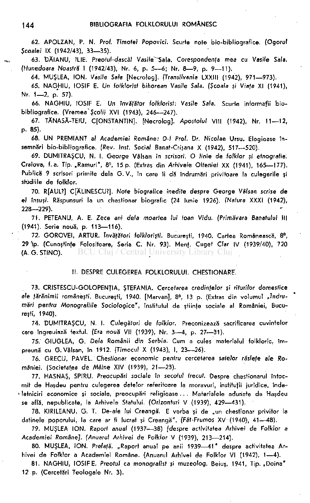

- 62. APOLZAN, P. N. Prof. Tïmofei Popovici. Scurte note bio-bibliografice. (Ogorul

Scoalei IX (1942/43), 33—35).

- 63. ÎDĂIANU, 1 LIE. Preoful-dascăl Vas//e~~Sala. Corespondenfa mea cu Vasi/e Sala.

(Hunedoara Noastră I (1942/43), Nr. 6, p. 5—6; Nr. 8—9, p. 9—11).

- 64. MUŞLEA, ION. Vasi/e Sala [Necrolog]. (Transi/vania LXXIII (1942), 971—973).
- 65. NAGHIU, IOSIF E. Un folklorisf bihorean Vasi/e Sala. [Şcoala şi Viafa XI (1941),

Nr. 1—2, p' 57).

- 66. NAGHIU, IOSIF E. Un invăfător folkhrist: Vasi/e Sala. Scurte informaţii bio­

bibliografice. (Vremea Şcolii XVI (1943), 246—247).

- 67. TÄNASÄ-TEIU, C[ONSTANTIN]. [Necrolog]. Apostolul VIII (1942), Nr. 11—12,

p. 85).

- 68. UN PREMIANT al Academiei Române: D-l Prof. Dr. Nicolae Ursu. Elogioase în­

semnări bio-bibliografice. (Rev. Inst. Social Banat-Crisana X (1942), 517—520).

- 69. DUMITRAŞCU, N. I. George Vâlsan în scrisori. O Unie de folklor si etnografie.

Craiova, f. a. Tip. „Ramuri", 8°, 15 p. (Extras din Arhive/e Olteniei XX (1941), 165—177). Publică 9 scrisori primite delà G. V., în care îi dă îndrumări privitoare la culegerile şi studiile de folklor.

70. R[AUL?] C[ĂLINESCU?]. Note biografice inedite despre George Vâlsan scrise de el însuşi. Răspunsuri la un chestionar biografic (24 Iunie 1926). (Natura XXXI (1942), 228—229).

- 71. PETEANU, A. E. Zece ani delà moartea lui loan V/du. (Primăvara Banatului III

(1941). Serie nouă, p. 113—116).

- 72. GOROVEI, ARTUR. Învăţători tolklorişti. Bucureşti, 1940. Cartea Românească, 8°,

29 \p. (Cunoştinţe Folositoare, Seria C. Nr. 93). Menţ. Cuget C/ar IV (1939/40), 720 (A. G. STINO).

II. DESPRE CULEGEREA FOLKLORULUI. CHESTIONARE.

73. CRISTESCU-GOLOPENTIA, ŞTEFANIA. Cercetarea credinfelor şi rifurifor domestice ale fărăn/mii româneşti. Bucureşti, 1940. [Marvan], 8°, 13 p. (Extras din volumul „îndrumări pentru Monograf/i/e Soc/o/ogice", Institutul de ştiinţe sociale al României, Bucureşti, 1940).

- 74. DUMITRAŞCU, N. I. Culegători de Mklor. Preconizează sacrificarea cuvintelor

care îngreuiază textul. (Era nouă VII (1939), Nr. 3—4, p. 27—31).

- 75. GIUGLEA, G. De/a Românii din Serbia. Cum a cules materialul folkloric, îm­

preună cu G. Vâlsan, în 1912. (T/mocul X (1943), I, 23—26).

- 76. GRECU, PAVEL. Chestionar economic pentru cercetarea satehr răslefe ale Ro­

mâniei. (Societatea de Mâine XIV (1939), 21—23).

- 77. HASNAŞ, SP1RU. Preocupări sociale în secolul trecut. Despre chestionarul întoc­

mit de Haşdeu pentru culegerea datelor referitoare la moravuri, instituţii juridice, îndeletniciri economice şi sociale, preocupări religioase.. . Materialele adunate de Haşdeu

se află, nepublicate, la Arhivele Statului. (Orizonturi V (1939), 429—431).

- 78. KIRILEANU, G. T. De-ale lui Creangă. E vorba şi de „un chestionar privitor la

datinele poporului, la care ar fi lucrat şi Creangă". (Făf-Frumos XV (1940), 41—48).

- 79. MUŞLEA ION. Raport anual (1937—38) [despre activitatea Arhivei de Folklor a

Academiei Române]. (Anuarul Arhivei de Fofklor V (1939), 213—214).

- 80. MUŞLEA, ION. Pretată. „Raport anual pe anii 1939—41" despre activitatea Ar­

hivei de Folklor a Academiei Române. (Anuarul Arhivei de Folklor VI (1942), 1—4).

- 81. NAGHIU, IOSIF E. Preotul ca monogratist şi muzeolog. Beiuş, 1941, Tip. „Doina"

12 p. (Cercetări Teologale Nr. 3).

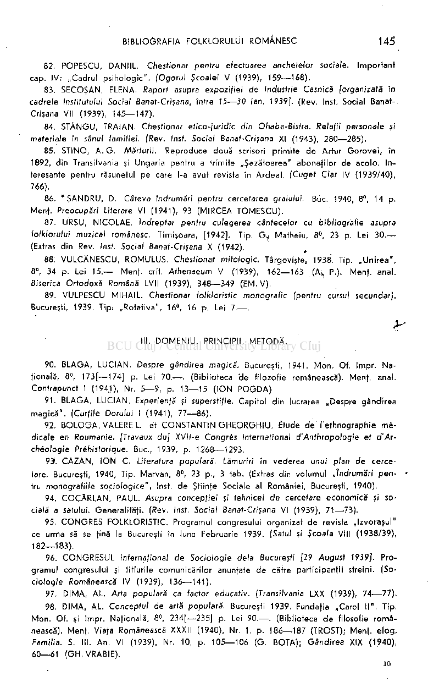

- 82. POPESCU, DANUL. Chestionar penfru efectuarea anchetelor sociale. Important

cap. IV: „Cadrul psihologic". (Ogoru l Şcoalei V (1939), 159—168).

- 83. SECOŞAN, ELENA. Raport asupra expoziţiei de Industrie Casnică [organizată în

cadrele Institutului Social Banat-Crişana, între 15—30 lan. 1939]. (Rev. Inst. Social BanatCrişana VII (1939), 145—147).

- 84. STÂNGU, TRAIAN. Chestionar etico-juridic din Ohaba-Bistra. Re/a/ii personale şi

materiale in sânul familiei. (Rev. Inst. Social Banat-Crisana XI (1943), 280—285).

- 85. STINO, A. G . Mărturii. Reproduce două scrisori primite d e Artur Gorovei , în

1892, din Transilvania şi Ungaria pentru a trimite „Şezătoarea" abonaţilor de acolo. Interesante pentru răsunetul pe care l-a avut revista în Ardeal . (Cuget Clar IV (1939/40), 766).

- 86. * ŞANDRU, D. Câteva îndrumări penfru cercetarea graiului. Buc. 1940, 8", 14 p. Menf. Preocupări Literare VI (1941), 93 (MIRCEA TOMESCU).
- 87. URSU, NICOLAE. îndreptar penfru culegerea cântecelor cu bibliografie asupra tolklorului muzical românesc. Timişoara, [1942], Tip. G

Matheiu, 8°, 23 p. Lei 30. (Extras din Rev. Inst. Social Banat-Crişana X (1942).

y

88: VULCÄNESCU, ROMULUS Chestionar mitologic. Târgovişte, 1938. Tip. „Unirea" ,

8 Biserica Ortodoxă Română LVII (1939), 348—34 9 (EM. V).

- U , 34 p. Lei 15. — Menf. orit. Athenaeum V (1939), 162—163 (Ai, P.). Menf. anal.

- 89. VULPESCU MIHAIL. Chestionar folkloristic monografic {pentru cursul secundar).

Bucureşti, 1939. Tip, „Rotativa", 16°, 16 p. Lei 7.—.

III. DOMENIU . PRINCIPII. METODĂ.

- 90. BLAGA, LUCIAN. Despre gând/rea magică. Bucureşti, 1941. Mon . Of. Impr. Na ­

ţională, 8", 173[—174] p. Lei 70.— . (Biblioteca d e filozofie românească). Menf. anal. Contrapunct I (194.1), Nr. 5—9 , p. 13—15 (IO N POGDA )

- 91 . BLAGA, LUCIAN. Experienţă şi superstiţie. Capitol din lucrarea „Despre gândirea

magică" . (Curţile Dorului I (1941), 77—86).

- 92. BOLOGA , VALERF. L. ei CONSTANTIN GHEORGHIU . Étude de l'ethnographie mé dicale en Roumanie. [Travaux du] XVII-e Congrès International d'Anthropologie et d'Archéologie Préhistorique. Bue , 1939, p. 1268—1293.
- 93. CAZAN , IO N C. Literatura populară. Lămuriri in vederea unui plan de cercetare. Bucureşti, 1940, Tip. Marvan, 8°, 23 p., 3 tab. (Extras din volumul „Îndrumări pen - • tru monografiile sociologice" , Inst. de Ştiinfe Sociale al României, Bucureşti, 1940).
- 94. COCÂRLAN , PAUL. Asupra concepţiei si tehnicei de cercetare economică si socială a salului. Generalităţi. (Rev. Inst. Social Banat-Crişana VI (1939), 71—73).
- 95. CONGRES FOLKLORISTIC. Programul congresului organizat d e revista „Izvoraşul" ce urma să se fină la Bucureşti în luna Februarie 1939. (Satul şi Şcoala VIII (1938/39), 182—183).
- 96. CONGRESUL internaţional de Sociologie delà Bucureşti [29 August 1939]. Programul congresului şi titlurile comunicărilor anunfate de către participanţii streini. (Sociologie Românească IV (1939), 136—141).
- 97. DIMA, AL. Arta populară ca factor educativ. (Transilvania LXX (1939), 74—77) .
- 98. DIMA, AL. Conceptul de arfă populară. Bucureşti 1939. Fundafia „Carol II" . Tip.

Mon . Of. şi Impr. Nafională, 8°, 234[—235 ] p. Lei 90.— . (Biblioteca d e filosofie româ nească). Menf. Viaţa Românească XXXII (1940), Nr. 1, p. 186—187 (TROST); Menf. elog . Familia. S. III. An . VI (1939), Nr. 10, p. 105—106 (G . BOTA); Gând/rea XIX (1940), 60—61 (GH . VRABIE).

io

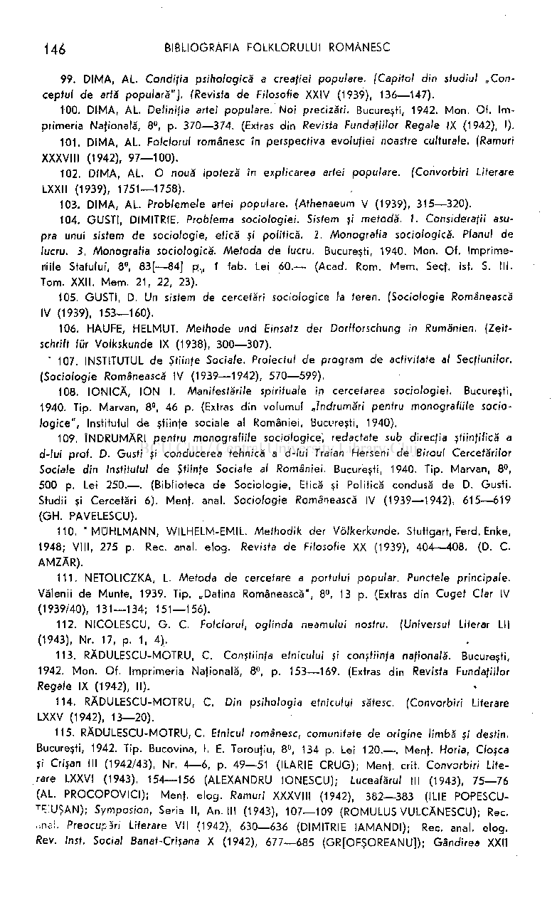

- 99. DIMA , AL. Condiţia psihologică a creafiei populare. [Capitol 6in studiul „Con­

ceptul de artă populară"]. (Revista de Filosofie XXIV (1939), 136—147).

- 100. DIMA, AL. Defini/ia artei populare. Noi precizări. Bucureşti, 1942. Mon . Ot. Im ­

primeria Nafionalä, 8°, p. 370—374 . (Extras din Revista Fundaţiilor Regale IX (1942), I).

- 101. DIMA, AL. Fo/clorul românesc în perspectiva evoluţiei noastre culturale. (Ramuri

XXXVIII (1942), 97—100) .

- 102. DIMA, AL. O nouă ipoteză in explicarea artei populare. (Convorbiri Literare

LXXII (1939), 1751—1758).

- 103. DIMA , AL. Problemele artei populare. (Athenaeum V (1939), 315—320).
- 104. GUŞTI, DIMITRIE. Problema sociologiei. Sistem şi metodă. I. Consideraţii asu­

pra unui sistem de sociologie, etică şi politică. 2. Monografia sociologică. Planul de lucru. 3. Monografia sociologică. Metoda de lucru. Bucureşti, 1940. Mon . Of. Imprime riile Statului, 8«, 83[—84 ] p., 1 tab. Lei 60. — (Acad. Rom. Mem . Secf. Ist. S. III. Tom. XXII. Mem . 21 , 22, 23).

- 105. GUŞTI, D. Un sistem de cercetări sociologice la teren. (Sociologie Romanească

IV (1939), 153—160).

- 106. HAUFE, HELMUT. Method e und Einsatz der Dortforschung in Rumänien. (Zeit­

schrift für Volkskunde IX (1938), 300—307) .

" 107. INSTITUTUL de Ştiinţe Sociale. Proiectul de program de activitate al Secţiunilor. (Sociologie Românească IV (1939—1942), 570—599) .

108. IONICĂ , IO N I. Manifestările spirituale in cercetarea sociologiei. Bucureşti,

1940. Tip. Marvan, 8°, 46 p. (Extras din volumu l „îndrumări pentru monografiile sociologice", Institutul d e ştiinfe sociale al României, Bucureşti, 1940).

- 109. ÎNDRUMĂR I pentru monografiile sociologice, redactate sub direcţia ştiinţifică a d-lui prof. D. Guşti şi conducerea tehnică a d-fui Traian Herseni de Biroul Cercetărilor Sociale din Institutul de Ştiinţe Sociale al României. Bucureşti, 1940. Tip. Marvan, 8°, 500 p. Lei 250.— . (Biblioteca de Sociologie, Etică şi Politică condusă de D. Guşti. Studii şi Cercetări 6). Menţ. anal. Sociologie Românească IV (1939—1942), 615—61 9 (GH . PAVELESCU).
- 110. ' MÜHLMANN , WILHELM-EMIL. Methodi k der Völkerkunde. Stuttgart, Ferd. Enke, 1948; VIII, 275 p. Rec. anal. elog . Revista de Fifosofie XX (1939), 404—408 . (D. C. AMZÄR) .
- 111. NETOLICZKA, L. Metod a de cercetare a portului popular. Punctele principale.

- Vălenii de Munte, 1939. Tip. „Datina Românească", 8°, 13 p. (Extras din Cuget Clar IV (1939/40), 131—134 ; 151—156).

- 112. NICOLESCU, G. C. Folclorul, oglinda neamului nostru. (Universul Literar LII

(1943), Nr. 17, p. 1, 4).

- 113. RĂDULESCU-MOTRU, C. Conştiinţa etnicului şi conştiinţa naţională. Bucureşti,

1942. Mon . Of. Imprimeria Nafionalä, 8°, p. 153—169. (Extras din Revista Fundaţiilor Regale IX (1942), II).

- 114. RĂDULESCU-MOTRU, C. Din psihologia etnicului sătesc. (Convorbiri Literare

LXXV (1942), 13—20).

- 115. RĂDULESCU-MOTRU, C. Etnicul românesc, comunitate de origine limbă şi destin.

Bucureşti, 1942. Tip. Bucovina, I. E. Toroutiu, 8°, 134 p. Lei 120.— . Menf- Horia, Cloşca şi Crişan III (1942/43), Nr. 4—6, p. 49—5 1 (ILARIE CRUG); Menf. crit. Convorbiri Literare LXXVI (1943), 154—156 (ALEXANDRU IONESCU); Luceafărul III (1943), 75—7 6 (AL. PROCOPOVICI) ; Menf. elog . Ramuri XXXVIII (1942), 382—38 3 (ILIE POPESCU-

E:UŞAN) ; Symposion, Seria II, An . III (1943), 107—109 (ROMULUS VULCĂNESCU); Rec. onsi . Preocupări Liferare VII (1942), 630—63 6 (DIMITRIE IAMANDI) ; Rec. anal. elog . Rev. Inst. Social Banat-Crişana X (1942), 677—68 5 (GR[OFŞOREANU]); Gândirea XXI1

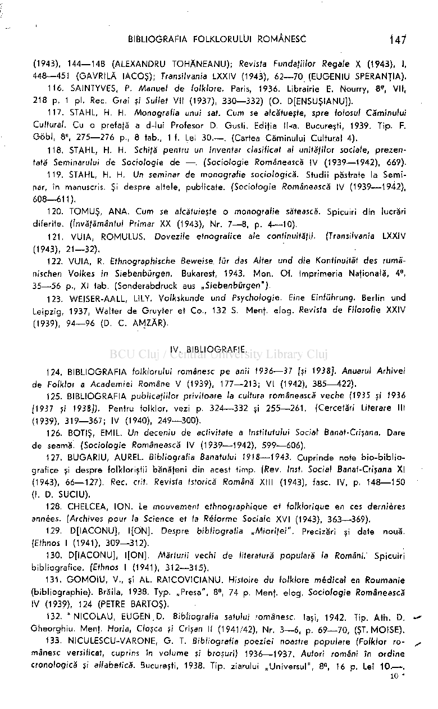

(1943), 144—148 (ALEXANDRU TOHĂNEANU) Revista Fundafiilor Regale X (1943), I, 448—451 (GAVRILĂ IACOŞ); Transilvania LXXIV (1943), 62—7 0 (EUGENIU SPERANTIA).

- 116. SAINTYVES, P. Manuel de folklore. Paris, 1936. Librairie E. Nourry, B«, VII,

218 p. 1 pl. Rec. Grai si Suflet VII (1937), 330—332) (O . D[ENSUŞIANU]).

- 117. STAHL, H. H. Monografi a unui sat. Cum se alcătueşte, spre folosul Căminului

Cultural. Cu o prefaţă a d-lui Profesor D. Guşti. Edifia IUa. Bucureşti, 1939. Tip. F. Göbl , 8«, 275—27 6 p., 8 tab., 1 f. Lei 30.— . (Cartea Căminului Cultural 4).

- 118. STAHL, H. H. Schiţă pentru un inventar clasificat al unităjilor sociale, prezen­

tată Seminarului de Sociologie de — . (Sociologie Românească IV (1939—1942), 669).

- 119. STAHL, H. H. Un seminar de monografie sociologică. Studii păstrate la Semi ­

nar, în manuscris. Şi despre altele, publicate. (Sociologie Românească IV (1939—1942), 608—611).

- 120. TOMUŞ , ANA . Cum se alcătuieşte o monografie sătească. Spicuiri din lucrări

diferite. {învăţământul Primar XX (1943), Nr. 7—8, p. 4—10) .

- 121. VUIA, ROMULUS. Dovezile etnografice a/e continuităţii. (Transilvania LXXIV

(1943), 21—32) .

- 122. VUIA, R. Ethnographische Beweise für das Alter und die Kontinuität des rumä­

nischen Volkes in Siebenbürgen. Bukarest, 1943. Mon . Of. Imprimeria Naţională, 4°, 35—5 6 p., XI tab. (Sonderabdruck aus „Siebenbürgen") .

123. WEISER-AALL, LILY. Volkskunde un d Psychologie. Eine Einführung. Berlin und Leipzig, 1937, Walter de Gruyter et Co., 132 S. Menf. elog Revista de Fi/osofie XXIV

(1939), 94—9 6 (D. C. AMZÄR) .

IV. BIBLIOGRAFIE.

- 124. BIBLIOGRAFIA folklorului românesc p e anii 1936—37 fşi 1938J. Anuarul Arhive i

de Fo/klor a Academie i Române V (1939), 177—213; VI (1942), 385—422) .

- 125. BIBLIOGRAFIA publicaţiilor privitoare la cultura românească veche (1935 şi 1936

[1937 şi 1938]). Pentru folklor, vezi p. 324—33 2 şi 255—261 . (Cercetări Literare III

(1939), 319—367 ; IV (1940), 249—300).

- 126. BOTIŞ, EMIL. Un deceniu de activitate a Insfifufu/ui Social Banat-Crişana. Dare

de seamă. (Sociologie Românească IV (1939—1942), 599—606) .

- 127. BUGARIU, AUREL. Bibliografia Banatului (9)8—1943 . Cuprinde note bio-biblio -

grafice şi despre folkloriştii bănăţeni din acest timp. (Rev. Insf. Social Banat-Crişana XI (1943), 66—127). Rec. crif. Revista Istorică Română XIII (1943), fasc. IV, p. 148—15 0 (I. D. SUCIU).

- 128. CHELCEA, ION . Le mouvemen t ethnographique et folklorique en ces dernières

années. (Archives pour la Science et la Réforme Sociale XVI (1943), 363—369).

- 129. D[IACONU] , l[ON] . Despre bibliografia „Mioriţei" . Precizări şi date nouă.

(Ethnos I (1941), 309—312) .

- 130. D[IACONU] , l[ON] . Mărturii vechi de literatură populară la Români: Spicuiri

bibliografice. (Ethnos I (1941), 312—315).

- 131. GOMOIU , V., şi AL. RAICOVICIANU . Histoire d u folklore médica l en Roumanie

(bibliographie). Brăila, 1938. Typ. „Presa", 8°, 74 p. Menf. elog Sociologie Românească IV (1939), 124 (PETRE BARTOŞ).

- 132. * NICOLAU , EUGEN , D. Bibliografia satului românesc, laşi, 1942. Tip. Ath . D.

Gheorghiu. Menţ. Horia, Cloşca şi Crişan II (1941/42), Nr. 3—6 , p. 69—70 , (ŞT. MOISE).

- 133. NICULESCU-VARONE, G . T. Bibliografia poeziei noastre populare (Folklor ro­

mânesc versificat, cuprins în volum e şi broşuri) 1936—1937. Autori români în ordin e cronologică şi alfabetică. Bucureşti, 1938. Tip. ziarului „Universul" , 8°, 16 p. Lei 10.— .

10 •

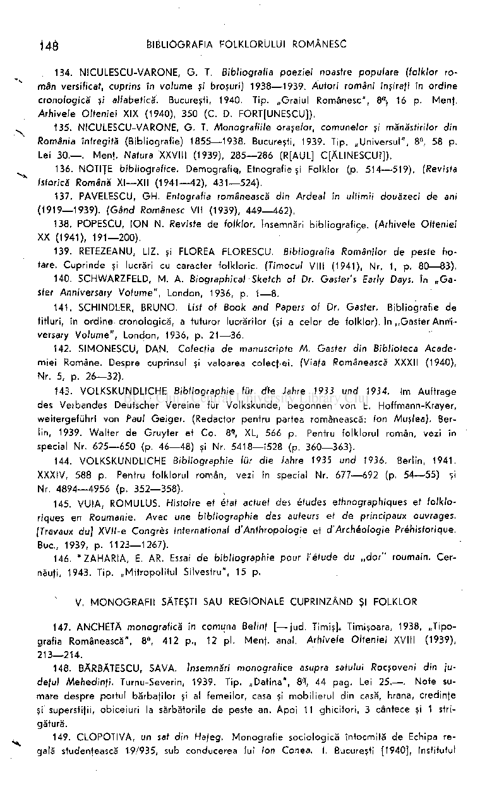

- 134. NICULESCU-VARONE, G. T. Bibliografia poeziei noastre populare (folklor român versificat, cuprins în volum e si broşuri) 1938—1939. Autori români înşira/i în ordine cronologică si alfabetică. Bucureşti, 1940. Tip. „Graiul Românesc", 8 ^ 16 p. Menf. Arhivele Olteniei XIX (1940), 350 (C. D. FORT[UNESCU]).
- 135. NICULESCU-VARONE, G. T. Monografii/e oraşe/or, comune/or şi mănăs/iri/or din România întregită (Bibliografie) 1855—1938. Bucureşti, 1939. Tip. „Universul" , 8°, 58 p. Lei 30.— . Menf. Natura XXVIII (1939), 285—28 6 (R[AUL] C[ĂLINESCU?]).
- 136. NOTIj E bibliografice. Demografiei, Etnografie şi Folklor (p. 514—519) . (Revista

istorică Română XI—XII (1941—42), 431—524) .

- 137. PAVELESCU, GH . Entografia românească din Ardeal în ultimii douăzeci de ani

(1919—1939). (Gân d Românesc VII (1939), 449—462) .

- 138. POPESCU, IO N N. Reviste de folklor. însemnări bibliografice. (Arhivele Olteniei

XX (1941), 191—200).

- 139. RETEZEANU, UZ. şi FLOREA FLORESCU. Bibliografia Români/or de peste ho­

tare. Cuprind e şi lucrări cu caracter folkloric. (Timocu/ VIII (1941), Nr. 1, p. 80—83) .

- 140. SCHWARZFELD, M. A. ßiographica/ Sketch of Dr. Gasfer's Early Days. In „Ga ­

ster Anniversary Volume", London, 1936, p. 1—8.

- 141. SCHINDLER, BRUNO. List of Book and Papers ol Dr. Gaster. Bibliografie de

titluri, în ordine cronologică, a tuturor lucrărilor (şi a celor de folklor). In „Gaster Anni versary Volume" , London, 1936, p. 21—36 .

- 142. SIMONESCU, DAN . Colecţia de manuscripte M. Gaster din Biblioteca Acade ­

miei Române. Despre cuprinsul şi valoarea colecfiei. (Viata Românească XXXII (1940), Nr. 5, p. 26—32).

- 143. VOLKSKUNDLICHE Bibliographie für die Jahre 1933 und 1934. Im Auftrage des Verbandes Deutscher Vereine für Volkskunde, begonne n von E. Hoffmann-Krayer, weitergeführt von Paul Geiger. (Redactor pentru partea românească: Ion Muşlea). Berlin, 1939. Walter de Gruyter et Co. 8$, XL, 566 p. Pentru folklorul român, vezi în special Nr. 625—65 0 (p. 46—48 ) şi Nr. 5418—Î528 (p. 360—363) .
- 144. VOLKSKUNDLICHE Bibliographie für die Jahre 1935 und 1936. Berlin, 1941. XXXIV, 588 p. Pentru folklorul român, vezi în special Nr. 677—69 2 (p. 54—55 ) şi Nr. 4894—495 6 (p. 352—358) .
- 145. VUIA, ROMULUS. Histoire et état actuel des études ethnographiques et folkloriques en Roumanie. Avec une bibliographie des auteurs et de principaux ouvrages. [Travaux du] XV//-e Congrès International d'Anthropologi e et d'Archéologi e Préhistorique. Bue , 1939, p. 1123—1267).
- 146. * ZAHARIA, E. AR. Essai d e bibliographi e pour l'étude du „dor " roumain. Cer-

năufi, 1943. Tip. „Mitropolitu l Silvestru", 15 p.

' V. MONOGRAFI I SĂTEŞTI SAU REGIONALE CUPRINZÂND Şl FOLKLOR

- 147. ANCHETĂ monografică in comuna Belinf [—jud . Timiş], Timişoara, 1938, „Tipo ­

grafia Românească", 8°, 412 p., 12 pl . Menf. anal. Arhivele Olteniei XVIII (1939), 213—214 .

- 148. BĂRBĂTESCU, SA VA. Însemnări monografice asupra satului Rocşoveni d/n ju­

deţul Mehedinţi. Turnu-Severin, 1939. Tip. „Datina" , 81, 44 pag. Lei 25.— . Note sumare despre portul bărbafilor şi al femeilor, casa şi mobilierul din casă, hrana, credinfe şi superstifii, obiceiuri la sărbătorile de peste an. Apo i 11 ghicitori, 3 cântece şi 1 strigătură.

149. CLOPOTIVA, un sat din Haţeg. Monografie sociologică întocmită d e Echipa regală studenţească 19/935, sub conducerea lui /on Conea. I. Bucureşti [1940], Institutul

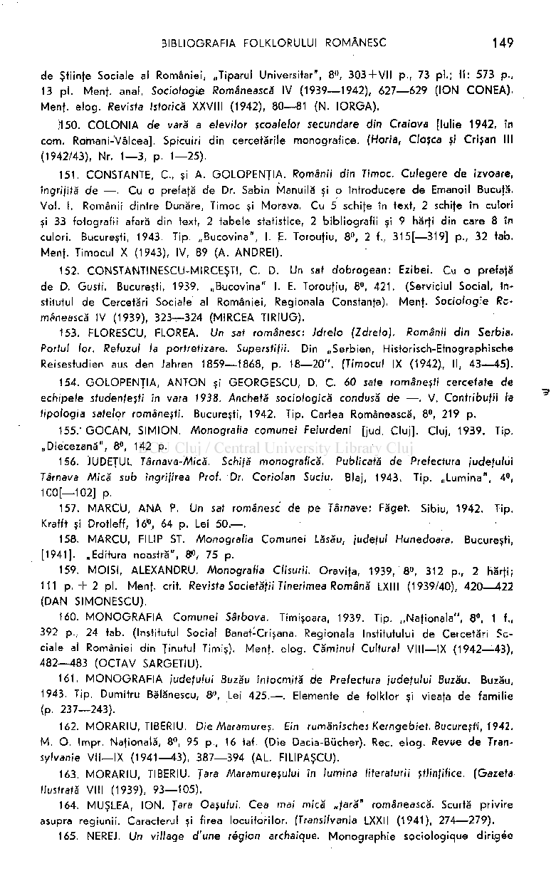

de Ştiinţe Sociale al României, „Tiparul Universitar", 8°, 303 +VI I p., 73 pl.; II : 573 p., 13 pl . Menf. anal. Sociologie Românească IV (1939—1942), 627—62 9 (ION CONEA) . Menf. elog . Revista Istorică XXVIII (1942), 80—81 (N . lORGA) .

]150'. COLONI A de vară a elevilor şcoalelor secundare din Craiova [Iulie 1942, în corn. Romani-Vâlcea], Spicuiri din cercetările monografice. (Horia, Cloşca si Cr/şan III (1942/43), Nr. 1—3, p. 1—25).

- 151. CONSTANTE, C , şi A. GOLOPENŢIA. Românii din Timoc. Culegere de izvoare, îngrijită de — . Cu o prefafă d e Dr. Sabin Manuilă şi o introducere d e Emanoil Bucufă. Vol. I. Românii dintre Dunăre, Timoc şi Morava. Cu 5 schite în text, 2 schite în culori şi 33 fotografii afară din text, 2 tabele statistice, 2 bibliografii şi 9 hărfi din care 8 în culori. Bucureşti, 1943. Tip. „Bucovina" , I. E. Toroufiu, 8°, 2 f., 315[—319 ] p., 32 tab. Men(. Timocul X (1943), IV, 89 (A. ANDREI).
- 152. CONSTANTINESCU-MIRCEŞTI, C. D. Un sat dobrogean : Ezibei. Cu o prefaţă de D. Guşti. Bucureşti, 1939. „Bucovina" I. E. Toroutiu, 8°, 421 . (Serviciul Social, Institutul de Cercetări Sociale al României, Regionala Constanta). Ment- Sociologie Românească IV (1939), 323—32 4 (MIRCEA TIRIUG).
- 153. FLORESCU, FLOREA. Un sat românesc: Jdrelo (Zdrelo). Românii din Serbia.

Portul (or. Refuzul la portretizare. Superstiţii. Din „Serbien, Historisch-Etnographische Reisestudien aus den Jahren 1859—1868, p. 18—20" . (Timocul IX (1942), II, 43—45) .

- 154. GOLOPENŢIA, ANTO N şi GEORGESCU, D. C. 60 safe româneşti cercetate de

echipele studenţeşti în vara 1938. Anchetă sociologică condusă de — . V. Contribuţii la tipologia satelor româneşti. Bucureşti, 1942. Tip. Cartea Românească, 8°, 219 p.

- 155/ GOCAN , SIMION . Monografia comunei Feiurdeni [jud. Cluj] , Cluj, 1939. Tip. „Diecezană" , 8°, 142 p.
- 156. JUDEŢUL Târnava-Mică. Schiţă monografică. Publicată de Prefectura judeţului Târnava Mică sub Îngrijirea Prof. Dr. Coriolan Suciu. Blaj, 1943. Tip. „Lumina" , 4°, 100[—102] p.
- 157. MARCU , AN A P. Un sat românesc de pe Târnave: Făget. Sibiu, 1942. Tip.

Krafft şi Drotleff, 161°, 64 p. Lei 50.— .

- 158. MARCU , FI LIP ST. Monografia Comune i Lăsau, judeţul Hunedoara. Bucureşti,

[1941]. „Editura noastră", 8°, 75 p.

- 159. MOISI , ALEXANDRU. Monografia Clisurii. Oravifa, 1939, 8°, 312 p., 2 hărfi;

111 p. + 2 pl. Menf. crit. Revista Societăţii Tinerimea Română LXIII (1939/40), 420—42 2 (DAN SIMONESCU).

- 160. MONOGRAFI A Comune i Sârbova. Timişoara, 1939. Tip. „Nafionala" , 8°, 1 f.,

392 p., 24 tab. (Institutul Social Banat-Crişana. Regionala Institutului de Ceicetări Sociale al României din Ţinutul Timiş). Menţ. elog. Căminu l Cultural VIII—IX (1942—43) , 482—48 3 (OCTAV SARGETIU).

161. MONOGRAFI A judeţului Buzău întocmită de Prefectura judeţului Buzău. Buzău,

1943. Tip. Dumitru Bălănescu, 8°, Lei 425.— . Elemente d e folklor şi vieafa d e familie (p. 237—243).

162. MORARIU , TIBERIU. Die Maramureş. Ein rumänisches Kerngebiet. Bucureşti, 1942. M. O . Impr. Nafională, 8°, 95 p., 16 taf. (Die Dacia-Bücher). Rec. elog . Revue d e Transylvanie VII—IX (1941—43), 387—39 4 (AL. FILIPAŞCU).

- 163. MORARIU , TIBERIU. Ţara Maramureşului în lumina literaturii ştiinţifice. (Gazeta

Ilustrată VIII (1939), 93—105) .

- 164. MUŞLEA, ION . Ţara Oaşului. Cea mai mică „ţară " românească. Scurtă privire

asupra regiunii. Caracterul şi firea locuitorilor. (Transilvania LXXII (1941), 274—279) .

- 165. NEREJ. Un village d'une région archaique. Monographi e sociologique dirigé e

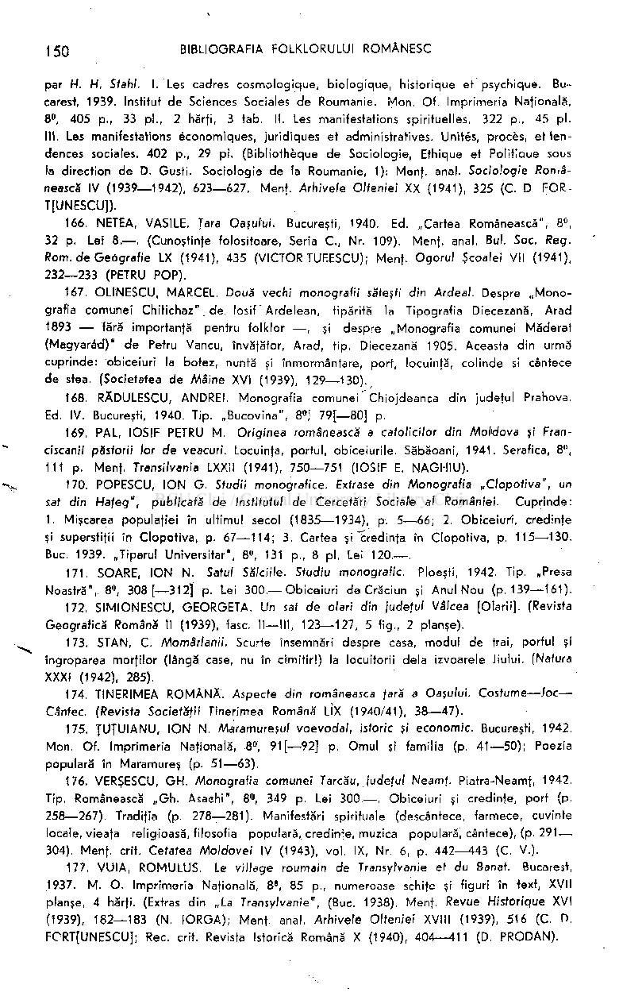

par H. H. Stahl. I. Les cadres cosmologique , biologique , historique et psychique. Bucarest, 1939. Institut d e Sciences Sociales d e Roumanie. Mon . Of. Imprimeria Naţională, 8°, 405 p., 33 pl., 2 hărţi, 3 tab. II. Les manifestations spirituelles. 322 p., 45 pl . III. Les manifestations économiques, juridiques et administratives. Unités, procès, etien dences sociales. 402 p., 29 pl . (Bibliothèque de Sociologie, Ethique et Polifiaue sous la direction de D. Gusti. Sociologie de la Roumanie, 1)^ Menf. anal. Sociologie Românească IV (1939—1942), 623—627 . Menţ. Arhivele Olteniei XX (1941), 325 (C. D FORT[UNESCU]).

- 166. NETEA, VASILE. Jara Oaşului. Bucureşti, 1940. Ed. „Cartea Românească", 8°, 32 p. Lei 8.— . (Cunoştinţe folositoare, Seria C , Nr. 109). Menţ. anal. Bul. Soc. Reg. Rom. de Geografie LX (1941), 435 (VICTOR TUF.ESCU); Menţ. Ogoru l Şcoalei VII (1941), 232—233 (PETRU POP).
- 167. OLINESCU, MARCEL. Două vechi monografii săteşti din Ardeal. Despre „Mono grafia comunei Chitichaz" , de losif ' Ardelean, tipărită la Tipografia Diecezană, Arad 1893 — fără importanţă pentru folklor — , şi despre „Monografia comunei Măderat (Magyarâd) " d e Petru Vancu, învăţător, Arad, tip. Diecezană 1905. Aceasta din urmă cuprinde: obiceiuri la botez, nuntă şi înmormântare, port, locuinţă, colinde şi cântece de stea. (Societatea de Mâin e XVI (1939), 129—130)
- 168. RĂDULESCU, ANDREI. Monografia comunei Chiojdeanca din judeţul Prahova.

Ed. IV. Bucureşti, 1940. Tip. „Bucovina" , 8»,' 79[—80 ] p.

- 169. PAL, IOSIF PETRU M. Originea românească a catolici/or din Moldov a şi Fran­

ciscanii păstorii lor de veacuri. Locuinţa, portul, obiceiurile. Săbăoani, 1941. Serafica, 8°, 111 p. Menţ. Transilvania LXXII (1941), 750—751 (IOSIF E. NAGHIU) .

170. POPESCU, IO N G. Studii monografice. Extrase din Monografia „Clopotiva", un sat din Haţeg", publicată de Institutul de Cercetări Sociale al României. Cuprinde : 1. Mişcarea populaţiei în ultimul secol (1835—1934), p. 5—66 ; 2. Obiceiuri , credinţe şi superstifii în Clopotiva , p. 67—114 ; 3. Cartea şi Credinţa în Clopotiva, p. 115—130. Buc. 1939. „Tiparul Universitar", 8°, 131 p., 8 pl. Lei 120.—.

- 171. SOARE, IO N N. Satul Sălcii/e. Studiu monografic. Ploeşti, 1942. Tip. „Presa

Noastră", 8°, 308 [—312] p. Lei 300.—Obiceiur i deCrăciu n şi Anul No u (p. 139—161).

- 172. SIMIONESCU, GEORGETA. Un sat de olari din judeţul Vâlcea [Olarii]. (Revista

Geografică Română II (1939), fasc. II—III, 123—127, 5 fig., 2 planşe).

- 173. STAN, C. Momârlanii. Scurte însemnări despre casa, modu l de trai, portul şi

îngroparea morţilor (lângă case, nu în cimitir!) la locuitorii delà izvoarele Jiului. (Natura XXXI (1942), 285).

- 174. TINERIMEA ROMÂNĂ . Aspecte din româneasca tară a Oaşului. Costume—Joc —

Cântec. (Revista Societăţii Tinerimea Română LIX (1940/41), 38—47) .

- 175. ŢUŢUIANU, IO N N. Maramureşuf voevodal , istoric şi economic. Bucureşti, 1942. Mon. Of. Imprimeria Naţională, 8°, 91 [—92] p. Omu l şi familia (p. 41—50) ; Poezia populară în Maramureş (p. 51—63).
- 176. VERŞESCU, GH . Monografia comunei Tarcău, judeţul Neamţ. Piatra-Neamţ, 1942. Tip. Românească „Gh . Asachi", 8°, 349 p. Lei 300.— . Obiceiuri şi credinţe, port (p. 258—267). Tradifia (p. 278—281). Manifestări spirituale (descântece, farmece, cuvinte locale, vieaţa religioasă, filosofia populară, credinţe, muzica populară, cântece), (p. 291 304). Menţ. crif. Cetatea Moldovei IV (1943), vol . IX, Nr, 6, p. 442—44 3 (C. V.).
- 177. VUIA , ROMULUS. Le village roumain de Transylvanie et du Banat. Bucarest, 1937. M. O . Imprimeria Nafională, 8°, 85 p., numeroase schije şi figuri în text, XVII planşe, 4 hărţi. (Extras din „La Transylvanie", (Buc. 1938). Menf. Revue Historique XVI (1939), 182—183 (N. IORGA) ; Menf. anal. Arhivefe Olteniei XVIII (1939), 516 (C. D. FCRTfUNESCU]; Rec. crit. Revista Istorică Română X (1940), 404—41 1 (D. PRODAN).

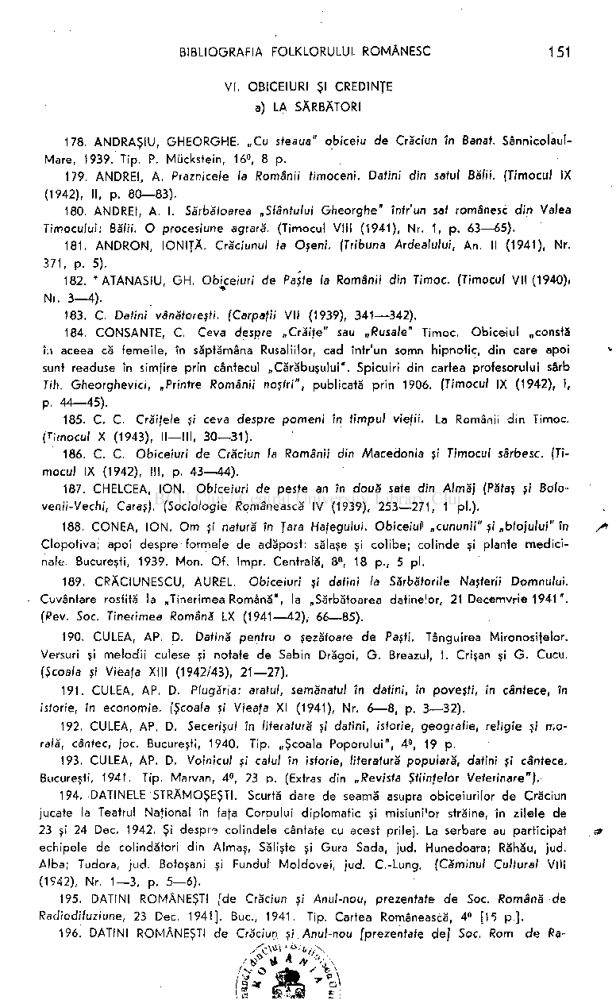

- VI. OBICEIURI Şl CREDINŢE a) LA SĂRBĂTORI
- 178. ANDRAŞIU, GHEORGHE . „C u s/eaua" obiceiu de Crăciun în Banat. Sânnicolaul-

Mare, 1939. Tip. P. Mückstein, 16°, 8 p.

- 179. ANDREI, A. Praznicele la Românii fimoceni. Dafini din saful Bălii. (Timocul IX

(1942), II, p. 80—83) .

- 180. ANDREI, A. I. Sărbătoarea „Sfântului Gheorghe " înfr'un sat românesc din Valea

Timocu/ui: Bălii. O procesiune agrară. (Timocul VIII (1941), Nr. 1, p. 63—65).

- 181. ANDRON , IONIŢĂ. Crăciunul la Oşeni. (Tribuna Ardealului, An. II (1941), Nr.

371, p. 5).

- 182. 'ATANASIU , GH . Obiceiuri de Paşte la Românii din Timoc. (Timocul VII (1940).

Ni . 3—4).

- 183. C. Datini vânătoreşti. (Carpafii VII (1939), 341—342) .
- 184. CONSANTE, C. Ceva despre „Crăiţe " sau „Rusale" Timoc. Obiceiul „constă

în aceea că femeile, în săptămâna Rusaliilor, cad într'un somn hipnotic, din care apoi sunt readuse în simţire prin cântecul „Cărăbuşului". Spicuiri din cartea profesorului sârb Tili. Gheorghevici, „Printre Românii noştri", publicată prin 1906. (Timocul IX (1942), I, p. 44—45) .

- 185. C. C. Crăiţele şi ceva despre pomen i în timpu l vieţii. La Românii di n Timoc.

(Timocul X (1943), II—III, 30—31) .

- 186. C. C. Obiceiuri d e Crăciun la Românii din Macedonia si Timocul sârbesc. (Ti­

mocul IX (1942), III, p. 43—44) .

- 187. CHELCEA, ION . Obiceiuri de peste an în dou ă safe din Almă / (Păfaş şi Bolo-

venii-Vechi, Caras). (Sociologie Românească IV (1939), 253—271 , 1 pl.).

- 188. CONEA , ION . O m şi natură în Tara Haţegului. Obiceiuf „cununii " şi „blo/'u/ui" în Clopotiva; apoi despre formele de adăpost: sălaşe şi colibe ; colinde şi plante medici nale. Bucureşti, 1939. Mon . Of. Impr. Centrală, 8», 18 p., 5 pl .
- 189. CRÄCIUNESCU, AUREL. Obiceiuri şi dafini la Sărbătorile Naşterii Domnului. Cuvântare rosfită la „Tinerimea Română", la „Sărbătoarea datinelor, 21 Decemvrie 1941 ". (Pev. Soc. Tinerimea Română LX (1941—42), 66—85).
- 190. CULEA, AP. D. Datină pentru o şezătoare de Paşti, Tânguirea Mironosiţelor. Versuri şi melodi i culese şi notate de Sabin Drăgoi, G . Breazul, I. Crişan şi G . Cucu. (Şcoala şi Vieaţa XIII (1942/43), 21—27) .
- 191. CULEA, AP. D. Plugăria: aratul, semănatul în datini, în poveşti, în cântece, în

istorie, în economie. (Şcoala şi Vieaţa XI (1941), Nr. 6—8 , p. 3—32) .

- 192. CULEA, AP. D. Secerişul în literatură şi datini, istorie, geografie, religie şi mo ­

rală, cântec, joc. Bucureşti, 1940. Tip. „Şcoala Poporului" , 4°, 19 p.

- 193. CULEA, AP. D. Voinicul şi calul în istorie, literatură populară, datini şi cântece.

Bucureşti, 1941. Tip. Marvan, 4°, 23 p. (Extras din „Revista Ştiinţelor Veterinare").

- 194. DATINELE STRĂMOŞEŞTI. Scurtă dare de seamă asupra obiceiurilor d e Crăciun

jucate la Teatrul Naţional în faţa Corpului diplomatic şi misiunilor străine, în zilele de 23 şi 24 Dec. 1942. Şi despr? colindele cântate cu acest prilej. La serbare au participat echipele d e colindători din Almaş, Sălişte şi Gura Sada, jud. Hunedoara; Răhău, jud. Alba ; Tudora, jud . Botoşani şi Fundul Moldovei , jud . C.-Lung. (Căminul Cu/fura/ Vil ! (1942), Nr. 1—3, p. 5—6).

- 195. DATINI ROMÂNEŞTI fd e Crăciun şi Anul-nou, prezentate de Soc. Română de

Radiodifuziune, 23 Dec. 1941]. Buc , 1941. Tip. Cartea Românească, 4» [15 p.],

- 196. DATINI ROMÂNEŞTI de Crăciun şi Anul-nou [prezentate de ] Soc. Rom d e Ra-

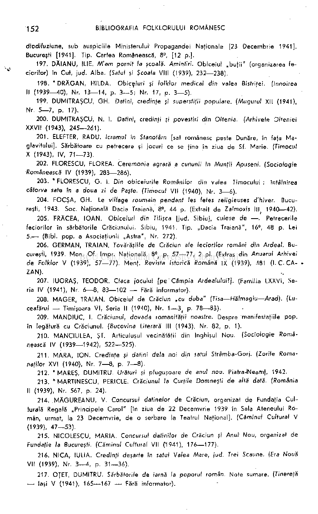

d/odi/uziune, sub auspiciile Ministerului' Propagandei Nafionale [23 Decembrie 1941]. Bucureşti [1941], Tip. Cartea Românească, 8°, [12 p.].

- 197. DĂIANU , ILIE. M'am pornit la şcoală. Amintiri. Obiceiu l „bufii " (organizarea fe ­

ciorilor) în Cut, jud . Alba . (Satul şi Şcoala VIII (1939), 232—238).

- 198. * DRÄGAN , HILDA. Obiceiuri şi folWor medical din valea Bistriţei. (înnoirea

|| (1939—40) Nr. 13—14, p. 3—5 Nr. 17, p. 3—5) .

- 199. DUMITRAŞCU, GH . Datini, credinţe şi superstiţii populare. (Mugurul XII (1941),

Nr. 5—7 p. 17).

- 200. DUMITRAŞCU, N. I. Dafini, credinţi şi povestiri din Oltenia. (Arhivele Olteniei

XXVII (1943), 245—261) .

- 201 ELEFTER, RADU. Icramul în Stanotârn [sat românesc peste Dunăre, în fafa Ma -

glavitului]. Sărbătoare cu petrecere şi jocuri ce se fine în ziua de Sf. Marie. (Timocul X (1943), IV, 71—73) .

- 202. FLORESCU, FLOREA. Ceremonia agrară a cununii in Munţii Apuseni. (Sociologie

Românească IV (1939), 283—286).

- 203. * FLORESCU, G . I. Din obiceiurile Românilor din valea Timocului : întâlnirea

câtorva sate în a doua zi de Paşte. (Timocul VII (1940), Nr. 3 6).

- 204. FOCŞA, GH . Le village roumain pendant les têtes religieuses d'hiver. Bucu­

reşti, 1943. Soc. Nafionalä Dacia Traiană, 8°, 44 p. (Extrait de Zalmoxis III, 1940—42).

- 205. FRĂCEA, IOAN . Obiceiuri din Tilişca [jud. Sibiu], culese de — . Petrecerile

feciorilor în sărbătorile Crăciunului. Sibiu, 1941. Tip. „Dacia Traiană", 16°, 48 p. Lei

5. — (Bibi. pop . a Asociafiunii „Astra", Nr. 272).

206. GERMAN , TRAIAN. Tovărăşiile de Crăciun a/e feciori/or români din Ardeal. Bucureşti, 1939. Mon . Of. Impr. Nafionalä, 8°

p. 57—77 , 2 pl. (Extras din Anuarul Arhivei de Folklor V (1939), 57—77) Menf. Revista Istorică Română IX (1939), -181 (I.C.CA - . ZAN).

i

- 207. IUORAŞ, TEODOR. Claca jocului [pe Câmpia Ardealului?]. (Familia LXXVl, Se­

ria IV (1941), Nr. 6—8 , 83—10 2 — Fără informator).

- 208. MAGER, TRAIAN. Obiceiu l de Crăciun „c u duba " (Tisa—Hălmagiu—Arad). (Lu­

ceafărul — Timişoara VI , Seria II (1940), Nr. 1—3, p. 78—83) .

- 209. MANDIUC , I. Crăciunul, dovada romanităţii noastre. Despre manifestaţiile pop.

în legătură cu Crăciunul. (Bucovina Literară III (1943), Nr. 82, p. 1).

- 210. MANCIULEA, ŞT. Articuluşul vecinătăfii din Inghişul Nou. (Sociologie Româ­

nească IV (1939—1942), 522—525).

- 211 MARA, ION . Credinţe şi dafini delà noi din satul Sfrâmba-Gorj. (Zorile Roma-

naţilor XVI (1940), Nr. 7—8 , p. 7—8) .

- 212. * MAREŞ, DUMITRU Uraturi şi pluguşoare de anul nou. Piatra-iNeamf, 1942.
- 213. * MARTINESCU, PERICLE. Crăciunul la Curţile Domneşti de altă dată. (România

- II (1939), Nr. 567, p. 24).

- 214. MĂGUREANU , V. Concursul dafinelor de Crăciun, organizat de Fundafia Cul ­

turală Regală „Principele Carol " [în ziua de 22 Decemvrie 1939 în Sala Ateneulu Român, urmat, la 23 Decemvrie, de o serbare la Teatrul Nafional], (Căminul Cultural V

###### (1939), 47—53) .

- 215. NICOLESCU, MARIA. Concursul dafinilor de Crăciun şi Anul Nou, organizat de

Fundaţie la Bucureşti. (Căminul Cultural VII (1941), 176—177).

- 216. NICA, IULIA. Credinţi deşarte în satul Valea Mare, jud, Trei Scaune, (Era Nouă

VII (1939), Nr. 3—4, p. 31—36) .

- 217. OŢET, DUMITRU. Sărbătorile de iarnă la poporu l român. Note sumare. (Tinerefă

— laşi V (1941), 165—167 — Fără informator).

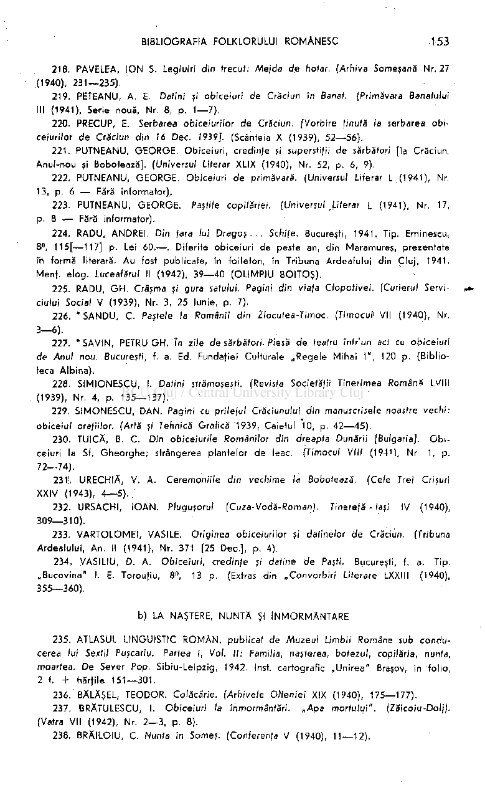

- 218. PAVELEA, IO N S. Legiuiri din trecut: Me/da d e hotar. (Arhiva Someşană Nr. 27

(1940), 231—235).

- 219. PETEANU, A. E. Datini si obiceiuri de Crăciun in Banat. (Primăvara Banatului

III (1941), Serie nouă, Nr. 8, p. 1—7).

- 220. PRECUP, E. Serbarea obiceiurilor de Crăciun. [Vorbire ţinută la serbarea obi­

ceiurilor de Crăciun din 16 Dec. 1939]. (Scânteia X (1939), 52—56) .

- 221. PUTNEANU, GEORGE. Obiceiuri, credinţe si superstiţii de sărbători [la Crăciun,

Anul-nou şi Bobotează]. (Universul Liferar XLIX (1940), Nr. 52, p. 6, 9).

- 222. PUTNEANU, GEORGE. Obiceiuri de primăvară. {Universul Literar l (1941), Nr.

13, p. 6 — Fără informator),

- 223. PUTNEANU, GEORGE. Pastile copilăriei. [Universul Literar L (1941), Nr. 17,

p. 8 — Fără informator).

- 224. RADU, ANDREI. Din ţara (ui Drago?.. . Schiţe. Bucureşti, 1941. Tip. Eminescu,

8°, 115[—117] p. Lei 60.— . Diferite obiceiuri de peste an, din Maramureş, prezentate îh formă literară. Au fost publicate, în foileton, in Tribuna Ardealului din Cluj, 1941. Menf. elog. Luceafărul II (1942), 39—4 0 (OLIMPIU BOITOŞ).

- 225. RADU, GH . Crâşma şi gura satului. Pagini din viaţa Cîopotivei. (Curierul Servi- pi­

ciului Social V (1939), Nr. 3, 25 Iunie, p. 7).

- 226. "SANDU , C. Pastele la Românii din Zlocutea-Timoc. (Timocut VII (1940), Nr.

3-6) .

- 227. * SAVIN, PETRU GH . In zile de sărbători. Piesă de teatru intr'un act cu obiceiuri

de Anul nou. Bucureşti, f. a. Ed. Fundaţiei Culturale „Regel e Mihai I", 120 p. (Biblioteca Albina).

228. SIMIONESCU, I. Dafini strămoşeşti. (Revista Societăţii Tinerimea Român? LVIII

(1939), Nr. 4, p. 135—137).

- 229. SIMONESCU, DAN . Pagini cu prilejul Crăciunului din manuscrisele noastre vechi : obiceiul ora/iilor. (Artă şi Tehnică Grafică '1939, Caietul 10, p. 42—45) .
- 230. ŢUICĂ, B. C. Din obiceiurile Românilor din dreapta Dunării [Bulgaria], Obi ceiuri la Sf. Gheorghe ; strângerea plantelor de leac. (Timocul VIII (1941), |\|

. 72--74)

]

r

t p

- 231'. URECHIĂ, V. A. Ceremoniile din vechime la Bobotează. (Cele Trei Crişuri XXIV (1943), 4—5) .
- 232. URSACHI, IOAN . Pluguşorul (Cuza-Vodă-Roman). Tinerefă - laşi IV (1940), 309—310) .
- 233. VARTOLOMEI , VASILE. Originea obiceiurilor şi datinelor de Crăciun. (Tribuna Ardealului, An. II (1941), Nr. 371 [25 Dec] , p. 4).
- 234. VASILIU, D. A. Obiceiuri , credinţe şi datine de Paşti. Bucureşti, f. a. Tip. „Bucovina" I. E. Torouţiu, 8°, 13 p. (Extras din „Convorbir i Liferare LXXIII (1940), 355—360)

b) LA NAŞTERE, NUNTĂ Şl ÎNMORMÂNTAR E

235. ATLASUL LINGUISTIC ROMÂN , publicat de Muzeul Limbii Române sub condu cerea lui Sextil Puşcariu. Partea I, Vol. II: Familia, naşterea, botezul, copilăria, nunta, moartea. De Sever Pop. Sibiu-Leipzig, 1942. Inst. cartografic „Unirea " Braşov, in folio, 2 f. + hărţile 151—301 .

- 236. BĂLĂŞEL, TEODOR. Colăcărie. (Arhivele Olteniei XIX (1940), 175—177).
- 237. BRĂTULESCU, I. Obiceiuri la Înmormântări. „Apa mortului". (Zăicoiu-Dolj).

(Vatra VII (1942), Nr. 2—3 , p. 8).

- 238. BRÄILOIU, C. Nunta in Someş. (Conterenţa V (1940), 11—12).

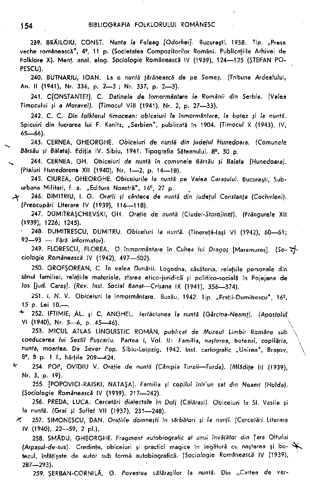

- 239. BRĂILOIU, CONST. Nunta la Fe/eag [Odor/iei]. Bucureşti, 1938. Tip. „Presa

veche românească", 4°, 11 p. (Societatea Compozitorilor Români. Publicaţiile Arhivei d e Folklore X). Menf. anal. elog. Sociologie Românească IV (1939), 124—125 (ŞTEFAN PO PESCU).

###### 240. BUTNARIU, IOAN . La o nuntă ţărănească d e p e Someş. (Tribuna Ardealului,

An . II (1941), Nr. 336, p. 2— 3 ; Nr. 337,, p. 2—3) .

###### 241. C[ONSTANTE?], C. Dafinele de înmormântate la Românii di n Serbia. (Valea

Timocului şi a Moravei). (Timocul VIII (1941), Nr. 2, p. 27—33) .

###### 242. C. C. Din fo/klorul fimocean ; obiceiuri la înmormântare, la botez si la nuntă.

Spicuiri di n lucrarea lui F. Kanitz, „Serbien" , publicată în 1904. (Timocul X (1943), IV, 65—66).

- 243. CERNEA, GHEORGHE . Obiceiur i d e nuntă di n judeţul Hunedoara. (Comunele

Bârsău şi Bălata). Edifia IV. Sibiu, 1941. Tipografia Săteanului, 8° , 30 p.

- 244. CERNEA, GH . Obiceiuri d e nuntă în comunele Bârsău şi Balata (Hunedoara}.

(Plaiuri Hunedorene XII (1940), Nr. 1—2, p. 14—18).

- 245. CIUREA, GHEORGHE . Obiceiurile la nuntă p e Valea Carasului. Bucureşti, Sub­

urbana Militari, f. a. „Edifura Noastră", 16°, 27 p.

- 246. DIMITRIU, I. G . Oraţii şi cântece de nuntă din judeţul Constanţa (Cochirleni).

(Preocupări Literare IV (1939), 116—118).

- 247. DUMITRAŞCHIEVSKI, GH Oraţie de nuntă (Ciudei-Storojineţ). (Frângurele XII

(1939), 1226; 1245).

- 248. DUMITRESCU, DUMITRU. Obiceiuri la nuntă. (Tinerefă-laşi VI (1942), 60—61 ; 92—9 3 — Fără informator).

- 249. FLORESCU, FLOREA. O înmormântare în Cuhea lui Dragoş [Maramureş]. (So-

ciofogie Românească IV (1942), 497—502) .

- 250. GROFŞOREAN, C. în valea Dunării. Logodna, căsătoria, relafiile personale di n

sânul familiei, relafiile materiale, starea etico-juridică şi politico-sooială în Pojejena d e Jos [jud . Caras]. (Rev. Inst. Social Banat—Crişana IX (1941), 356—374).

- 251. I. N. V. Obiceiuri la înmormântare. Buzău, 1942. Tip. „Frafii-Dumitrescu", 16°,

15 p. Lei 10.—

- 252. IFTIMIE, .AL. şi C. ANGHEL . Iertăciunea la nuntă (Oârcina-Neamţ). (Apostolùi

VI (1940), Nr. 5—6 , p. 45—46) . \

- 253. MICU L ATLAS LINGUISTIC ROMÂN , publicat de Muzeul Limbii Române sub \

conducerea lui Sextil Puşcariu. Partea I, Vol. II: Familia, naşterea, botezul, copilăria, \ nunta, moartea. De Sever Pop. Sibiu-Leipzig, 1942. Inst. cartografic „Unirea" , Braşov, \ 8», 8 p. 1 f., hărţile 209—424 .

V 254. POP, OVfDI U V. Oraţie de nuntă (Câmpia Turzii—Turda). (Mlădiţe III (1939), Nr. 3, p. 19).

###### 255. [POPOVICI-RAISKI, NATAŞA]. Familia şi copilul într'un sat din Neamţ (Holda).

(Sociologie Românească IV (1939), 217—242) .

###### 256. PREDA, LUCA Cercetări dialectale în Dolj (Călăraşi). Obiceiuri la Sf. Vasile şi

la nuntă. (Grai şi Suflet VII (1937), 231—248) .

•K 257. SIMONESCU, DAN . Orafiile domneşti în sărbători şi la nunfi. (Cercetări Literare IV (1940), 22—59 , 2 pl.) .

- 258. SMÄDU , GHEORGHE . Fragment autobiografic al unui învăţător di n Tara Oltului (Arpaşul-de-sus). Credinfe, obiceiuri şi practici magice în legătură cu naşterea şi tezul, tnfăfişate d e autor sub formă autobiografică. (Sociologie Românească IV (1939), 287—293)
- 259. ŞERBAN-CORNILĂ, G. Povestea călăraşilor la nuntă. Din „Cartea d e ver-

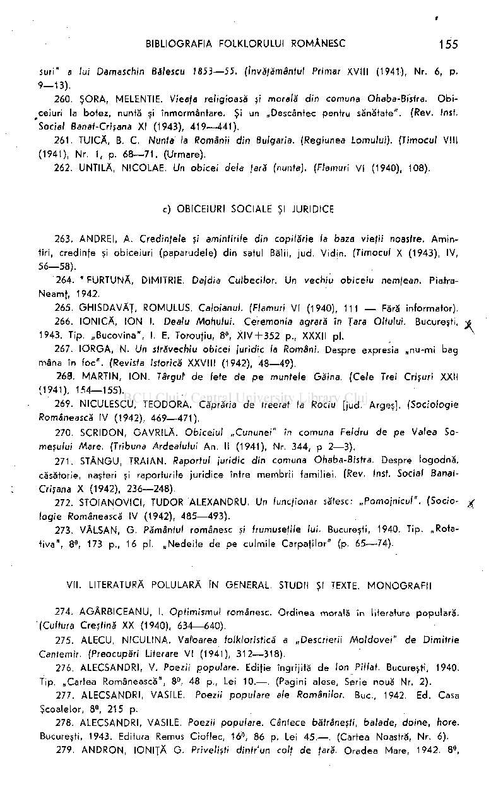

suri" a lui Damaschin Bălescu 1853—55. (Învăţământul Primar XVIII (1941), Nr. 6, p. 9—13) .

- 260. ŞORA, MELENTIE. Vieaţa religioasă şi morală din comuna Ohaba-Bïstra. Obi ­

ceiur i la botez, nuntă şi înmormântare. Şi un „Descântec pentru sănătate". (Rev. (nsf. 'Social Banat-Crişana XI (1943), 419—441) .

- 261. ŢUICĂ, B. C. Nunta la Românii din Bulgaria. (Regiunea Lomului). (Timocu) VIII

(1941), Nr. 1, p. 68—71 . (Urmare).

- 262. UNTILÄ, NICOLAE. Un obicei delà ţară (nunta). (Flamuri VI (1940), 108).

c) OBICEIURI SOCIALE Şl JURIDICE

- 263. ANDREI, A. Credinţele şi amintirile din copilărie la baza vieţii noastre. Amin ­

tiri, credinfe şi obiceiuri (paparudele) din satul Bălii, jud . Vidin. (Timocul X (1943), IV, 56—58).

- 264. * FURTUNĂ, DIMITRIE. Da/dia Culbeci/or. Un vech/u obiceiu nemfean. Pia.tra-

Neamf, 1942.

- 265. GHISDAVÄT, ROMULUS. Caloianul. (Flamuri VI (1940), 111 — Fără informator).
- 266. IONICĂ , IO N I. Dea/u Mohului. Ceremonia agrară in Jara Oltului. Bucureşti,

1943. Tip. „Bucovina" , I. E. Toroufiu, 8°, XIV + 352 p., XXXII pl.

- 267. IORGA, N. Un sfrăvecfliu obicei juridic la Români. Despre expresia „nu-m i bag

mâna în foc" . (Revista Istorică XXVIII (1942), 48—49).

- 268. MARTIN, ION . Târguf d e fete de pe muntele Găina. (Cele Trei Crişuri XXII

(1941), 154—155).

- 269. NICULESCU, TEODORA. Căprăria de freeraf la Rociu [jud. Argeşl. (Sociologie

Românească IV (1942), 469—471).

- 270. SCRIDON, GAVRILĂ Obiceiul „Cununei" in comuna Feldru de pe Valea So­

meşului Mare. (Tribuna Ardealului An . II (1941), Nr. 344, p 2—3).

- 271. STÂNGU, TRAIAN. Raportul juridic din comuna Ohaba-Bistra. Despre logodnă ,

căsătorie, naşteri şi raporturile juridice între membrii familiei. (Rev. Insf. Social ßanafCrişana X (1942), 236—248).

- 272. STOIANOVICI , TUDOR ALEXANDRU. Un funcţionar sătesc: „Pomojnicul". (Socio­

logie Românească IV (1942), 485—493) .

- 273. VÂLSAN, G Pământul românesc şi frumuseţile lui. Bucureşti, 1940. Tip. „Rota­

tiva", 8°, 173 p., 16 pl. „Nedeil e de pe culmile Carpafilor" (p. 65—74) .

VII. LITERATURĂ POLULARĂ ÎN GENERAL. STUDII Şl TEXTE. MONOGRAFI I

- 274. AGÂRBICEANU , I. Optimismu l românesc. Ordi n ea morală în literatura populară.

(Cultura Creştină XX (1940), 634—640).

- 275. ALECU, NICULINA. Valoarea folk/orisfică a „Descrierii Moldovei" de Dimitrie

Canfemir. (Preocupări Literare VI (1941), 312—318).

- 276. ALECSANDRI, V. Poezii populare. Edifie îngrijită de Ion Pillaf. Bucureşti, 1940.

Tip. „Cartea Românească", 8°, 48 p., Lei 10.— . (Pagini alese, Serie nouă Nr. 2).

- 277. ALECSANDRI, VASILE. Poezii populare ale Românilor. Buc , 1942. Ed. Casa

Şcoalelor, 8°, 215 p.

- 278. ALECSANDRI, VASILE. Poezii populare. Cântece bătrâneşti, balade, doine, hore.

Bucureşti, 1943. Editura Remus Cioflec, 16°, 86 p. Lei 45.— . (Cartea Noastră, Nr. 6).

- 279. ANDRON , IONIŢĂ G. Privelişti dinfr'un colţ de ţară. Oradea Mare, 1942. 8°,

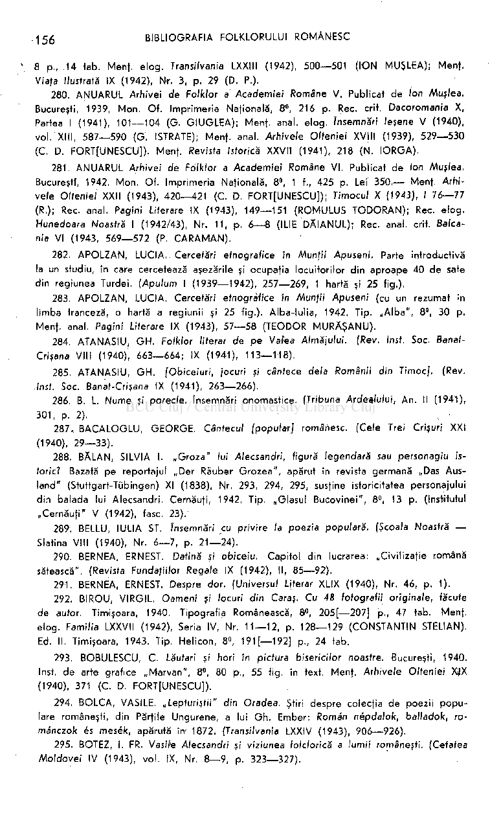

8 p., 14 tab. Menf. elog . Transilvan/a LXXIII (1942), 500—501 (IO N MUŞLEA); Menf. Via/a Ilustrată IX (1942), Nr. 3, p. 29 (D. P.).

- 280. ANUARU L Arhivei de Folklor a Academiei Române V. Publicat de Ion Muşlea.

Bucureşti, 1939, Mon . Of. Imprimeria Nafională, 8°, 216 p. Rec. crit. Dacoromania X, Partea I (1941), 101—10 4 (G . GIUGLEA) ; Menf. anal. elog. însemnări Ieşene V (1940), voi. XIII, 587—59 0 (G , ISTRATE); Menf. anal. Arhivele Olteniei XVIII (1939), 529—53 0 (C. D. FORTfUNESCU]). Menf. Revista Istorica XXVI1 (1941), 218 (N. IORGA) .

- 281. ANUARU L Arhivei de Folklor a Academie i Române VI. Publicat de Ion Muşlea.

Bucureşti, 1942. Mon . Of. Imprimeria Nafională, 8°, 1 f., 425 p. Lei 350. — Menf. Arhivele Olteniei XXII (1943), 420—421 (C. D. FORTfUNESCU]); Timocul X (1943), I 76—7 7 (R.); Rec. anal. Pagini Literare IX (1943), 149—151 (ROMULUS TODORAN) ; Rec. elog . Hunedoara Noastră I (1942/43), Nr. 11, p. 6— 8 (ILIE DÄIANUL) ; Rec. anal. crit. Balcania VI (1943, 569—57 2 (P. CARAMAN) .

- 282. APOLZAN , LUCIA. Cercetări etnografice in Munfii Apuseni. Parte introductivă la un studiu, în care cercetează aşezările şi ocupafia locuitorilor din aproape 40 de sate din regiunea Turdei. (Apulum I (1939—1942), 257—269 , 1 hartă şi 25 fig.).
- 283. APOLZAN , LUCIA. Cercetări etnografice în Munfii Apuseni (cu un rezumat în limba franceză, o hartă a regiunii şi 25 fig.). Alba-lulia, 1942. Tip. „Alba" , 8°, 30 p. Menf. anal. Pagini Liferare IX (1943), 57—5 8 (TEODOR MURĂŞANU) .
- 284. ATANASIU, GH . Folklor literar de pe Valea Almăjului. (Rev. Insf. Soc. Banaf-

Crişana VIII (1940), 663—664 ; IX (1941), 113—118).

- 285. ATANASIU, GH . [Obiceiuri, jocuri şi cântece delà Românii din TimocJ. (Rev.

Inst. Soc. Banaf-Crişana IX (1941), 263—266).

- 286. B. L. Num e şi porecle. însemnări onomastice. [Tribuna Ardealului, An . II (1941),

301, p. 2).

- 287 . BACALOGLU , GEORGE. Cântecul [popular] românesc. (Cele Trei Crişuri XXI

(1940), 29—33) .

- 288. BĂLAN, SILVIA I. „Groza " lui Alecsandri, figură legendară sau personagiu is­

toric? Bazată pe reportajul „Der Räuber Grozea" , apărut în revista germană „Das Ausland" (Stuttgart-Tübingen) XI (1838), Nr. 293, 294, 295, susfine istoricitatea personajului din balada lui Alecsandri. Cernăufi, 1942. Tip. „Glasul Bucovinei" , 8°, 13 p. (Institutul „Cernaufi" V (1942), fasc. 23).

- 289. BELLU, IULIA ST. însemnări cu privire la poezia populară. (Şcoala Noastră —

Slatina VIII (1940), Nr. 6—7 , p. 21—24) .

- 290. BERNEA, ERNEST. Datină şi obiceiu. Capitol din lucrarea: „Civilizafie română

sătească". (Revista Fundaţiilor Regale IX (1942), II, 85—92) .

- 291. BERNEA, ERNEST. Despre dor. (Universul Literar XLIX (1940), Nr. 46, p. 1).
- 292. BIROU, VIRGIL. Oamen i şi locuri din Caras. Cu 48 fotografii originale, făcute

de autor. Timişoara, 1940. Tipografia Românească, 8°, 205[—207 ] p., 47 tab. Menf. elog . Familia LXXVII (1942), Seria IV, Nr. 11—12 , p. 128—129 (CONSTANTIN STELIAN). Ed. II. Timişoara, 1943. Tip. Helicon, 8°, 191 [—192] p., 24 tab.

293. BOBULESCU, C. Lăutari si hori în pictura bisericilor noastre. Bucureşti, 1940. Inst. de arte grafice „Marvan" , 8°, 80 p., 55 fig. în text. Menf. Arhivele Olteniei XjX

(1940), 371 (C. D. FORTfUNESCU]).

294. BOLCA, VASILE. „Lepfuriştii" din Oradea. Ştiri despre colecfia de poezii popu lare româneşti, din Părfile Ungurene, a lui Gh . Ember: Român népdalok, balladok, romănczok és mesék, apărută în< 1872. (Transilvania LXXIV (1943), 906—926) .

- 295. BOTEZ, I. FR. Vasile Alecsandri şi viziunea folclorică a lumii româneşti. (Cetatea

Moldovei IV (1943), vol . IX, Nr. 8—9 , p. 323—327).

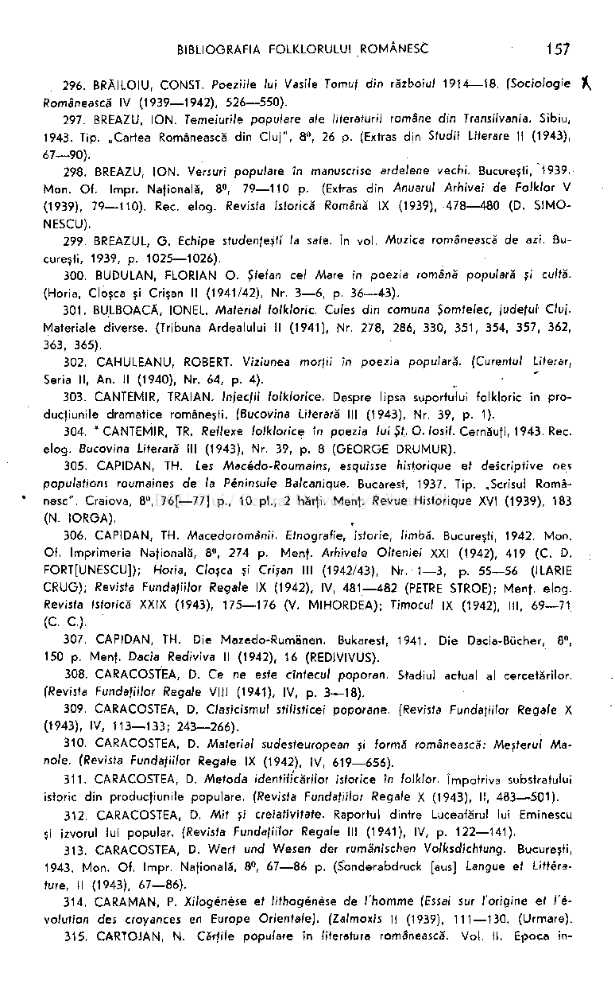

- 296. BRĂILOIU, CONST. Poezii/e lui Vasile Tomuf din războiul 1914—18. (Sociologie

Românească IV (1939—1942), 526—550) .

- 297. BREAZU, ION . Temeiurile populare ale literaturii române din Transilvania. Sibiu,

1943. Tip. „Cartea Românească din Cluj" , 8°, 26 p. (Extras din Studii Literare II (1943), 67—90) .

- 298. BREAZU, ION . Versuri populare în manuscrise ardelene vechi. Bucureşti, 1939.

Mon . Of. Impr. Naţională, 8°, 79—11 0 p. (Extras din Anuarul Arhivei de Folklor V (1939), 79—110). Rec. elog . Revista Istorică Română IX (1939), 478—48 0 (D. SIMO NESCU).

- 299. BREAZUL, G . Echipe studenţeşti la sate. în voi . Muzica românească de azi. Bu­

cureşti, 1939, p. 1025—1026).

- 300. BUDULAN , FLORIAN O. Ştefan cel Mare în poezia română populară si cultă.

(Horia, Cloşca şi Crişan II (1941/42), Nr. 3—6 , p. 36—43) .

- 301 . BULBOACÄ, IONEL. Material folkloric. Cules din comuna Şomtelec, judeţul Cluj.

Materiale diverse. (Tribuna Ardealului II (1941), Nr. 278, 286, 330, 351 , 354, 357, 362, 363, 365).

- 302. CAHULEANU , ROBERT. Viziunea morţii în poezia populară. (Curentul Literar,

Seria II, An . II (1940), Nr. 64, p. 4).

- 303. CANTEMIR, TRAIAN. Injecţii folklorice. Despre lipsa suportului folkloric în pro -

ducţiunile dramatice româneşti. (Bucovina Literară III (1943), Nr. 39, p. 1).

- 304. "CANTEMIR , TR. Reflexe folklorice în poezia lui Şt,. O. losif. Cernăuţi, 1943. Rec.

elog. Bucovina Literară III (1943), Nr. 39, p. 8 (GEORGE DRUMUR).

- 305. CAPIDAN , TH. Les Macédo-Roumains, esquisse historique et descriptive nes

populations roumaines de la Péninsule Balcanique. Bucarest, 1937. Tip. „Scrisul Românesc". Craiova, 8°, 76[—77 ] p., 10 pl. , 2 hărţi. Menţ. Revue Historique XVI (1939), 183 (N. IORGA).

306. CAPIDAN , TH. Macedoromânii . Etnografie, istorie, limbă. Bucureşti, 1942. Mon . Of. Imprimeria Naţională, 8°, 274 p. Menf. Arh/vele Olteniei XXI (1942), 419 (C. D. FORT[UNESCU]); Horia, Cloşca şi Crişan III (1942/43), Nr. 1—3, p. 55—5 6 (ILARIE CRUG) ; Revista Fundaţiilor Regale IX (1942), IV, 481—48 2 (PETRE STROE); Menţ. elog . Revista Istorică XXIX (1943), 175—176 (V. MIHORDEA) Timocul IX (1942), III, 69—7 1 (C. C) .

- 307. CAPIDAN , TH. Die Mazedo-Rumänen. Bukarest, 1941. Die Dacia-Bücher, 8",

150 p. Menf. Dacia Rediviva II (1942), 16 (REDIVIVUS).

- 308. CARACOSTEA, D. Ce ne este clntecul poporan. Stadiul actual al cercetărilor.

(Revista Fundaţiilor Regale VIII (1941), IV, p. 3—18).

- 309. CARACOSTEA, D. Clasicismul stilisticei poporane. (Revista Fundaţiilor Regale X

(1943), IV, 113—133 ; 243—266) .

- 310. CARACOSTEA, D. Material sudesteuropean şi formă românească: Meşterul Ma-

nole. (Revista Fundaţiilor Regale IX (1942), IV, 619—656) .

- 311. CARACOSTEA, D. Metod a identificărilor istorice în folklor. împotriva substratului

istoric din productiunile populare. (Revista Fundaţiilor Regale X (1943), II, 483—501) .

- 312. CARACOSTEA, D. Mi t şi creiativitate. Raportul dintre Luceafărul lui Eminescu

şi izvorul lui popular. (Revista Fundaţiilor Regale III (1941), IV, p. 122—141).

- 313. CARACOSTEA, D. Wer f und Wese n der rumänischen Volksdichtung. Bucureşti,

1943. Mon . Of. Impr. Naţională, 8*, 67—8 6 p. (Sonderabdruck [aus] Langue et Littérature, II (1943), 67—86) .

- 314. CARAMAN , P. Xilogénèse et lithogénèse de l'homm e (Essai sur l'origine et l'é­

volution des croyances en Europe Orientale). (Zalmoxis II (1939), 11 1—130. (Urmare).

- 315. CARTOJAN, N. Cărţile populare în literatura românească. Vol . II. Epoca in-

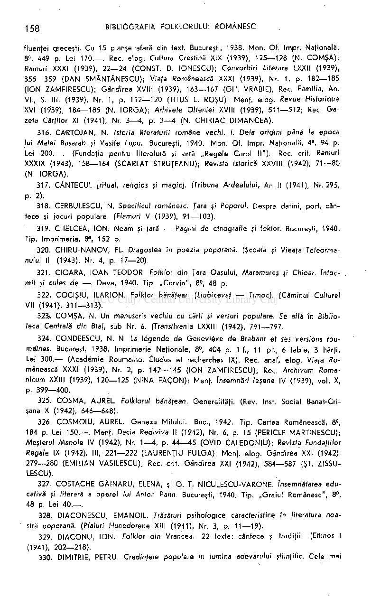

fluentei greceşti. Cu 15 planşe afară di n text. Bucureşti, 1938. Mon . Of. Impr. Nafionalä, 8°, 449 p. Lei 170.—. Rec. elog . Cultura Creştină XIX (1939), 125—128 (N . COMŞA) ; Ramuri XXXI (1939), 22—2 4 (CONST. D. IONESCU); Convorbiri Literare LXXII (1939), 355—35 9 (DA N SMÂNTÂNESCU); Via/a Românească XXXI (1939), Nr. 1, p. 182—185 (IO N ZAMFIRESCU); Gândirea XVIII (1939), 163—167 (GH . VRABIE), Rec. Familia, An . VI., S. III. (1939), Nr. 1, p. 112—120 (TITUS L. ROŞU); Menf. elog . Revue Historique XVI (1939), 184—185 (N . IORGA) ; Arhivele Olteniei XVIII (1939), 511—512 ; Rec. Gazeta Cărţilor XI (1941), Nr. 3—4 , p. 3— 4 (N . CHIRIAC DIMANCEA) .

316. CA'RTOJAN, N. Istoria literaturii române vechi. I. Delà origini până la epoca lui Matei Basarab şi Vasile Lupu. Bucureşti, 1940. Mon . Of. Impr. Nafionalä, 4°, 9 4 p. Lei 200.— . (Fundafia pentru literatură şi artă „Regele Carol II") . Rec. crit. Ramuri XXXIX (1943), 158—164 (SCARLAT STRUŢEANU); Revista Istorică XXVIII (1942), 71—8 0 (N. IORGA) .

- 317. CÂNTECUL [ritual, religios şi magicj. (Tribuna Ardealului, An . II (1941), Nr. 295

p. 2).

- 318. CERBULESCU, N. Specificul românesc. Jara şi Poporul. Despre datini, port, cân­

tece şi jocuri populare. (Flamuri V (1939), 91—103) .

- 319. CHELCEA, ION . Nea m şi fară — Pagini d e etnografie şi folclor. Bucureşti, 1940.

Tip. Imprimeria, 8°, 152 p.

- 320. CHIRU-NANOV , FL. Dragostea în poezia poporană. (Şcoala şi Vieaţa Teleorma­

nului III (1943), Nr. 4, p. 17—20).

- 321. CIOARA, IOA N TEODOR. Folklor din Jara Oaşului, Maramureş şi Chioar. întoc­

mit şi cules de — . Deva, 1940. Tip. „Corvin" , 8«, 48 p.

- 322. COCIŞIU, ILARION. Folklor bănăţean (Liubicevaţ — Timoc). (Căminul Cultural

VII (1941), 311—313) .

- 323/. COMŞA , N. Un manuscris vechiu cu cărţi şi versuri populare. Se află în Biblio­

teca Centrală din Blaj, sub Nr. 6. (Transilvania LXXIII (1942), 791—797 .

- 324. CONDEESCU, N. N. La légend e de Genevièv e de ßrabant et ses versions rou­

maines. Bucarest, 1938. Imprimerie Nationale, 8°, 40 4 p. 1 f., 11 pif., 6 table, 3 hărfi. Lei 300. — (Académie Roumaine. Études et recherches IX). Rec. anaL elog . Viaţa Românească XXXI (1939), Nr. 2, p. 142—145 (IO N ZAMFIRESCU); Rec. Archivum Romanicum XXIII (1939), 120—125 (NINA FAÇON) ; Menf. însemnări Ieşene IV (1939), vol . X, p. 399—400 .

- 325. COSMA , AUREL. Folklorul bănăţean. Generalităfi. (Rev. Inst. Social Banat-Cri-

şana X (1942), 646—648).

- 326. COSMOIU , AUREL. Geneza Mitului. Buc , 1942. Tip. Cartea Românească, 8°,

184 p. Lei 150.—. Menf. Dacia Rediviva II (1942), Nr. 6, p. 15 (PERICLE MARTINESCU); Meşterul Manole IV (1942), Nr. 1—4, p. 44—4 5 (OVID CALEDONIU) ; Revista Fundaţiilor Regale IX (1942), III, 221—22 2 (LAURENŢIU FULGA); Menf. elog . Gândirea XXI (1942), 279—28 0 (EMILIAN VASILESCU); Rec. crit. Gândirea XXI (1942), 584—587 (ŞT. ZISSULESCU).

- 327. COSTACHE GÄINARU , ELENA, şi G . T. NICULESCU-VARONE. Însemnătatea educativă şi literară a operei lui Anton Pann. Bucureşti, 1940. Tip. „Graiul Românesc", 8°, 48 p. Lei 40.—
- 328. DIACONESCU , EMANOIL . Trăsături psihologice caracteristice în literatura noastră poporană. (Plaiuri Hunedorene XIII (1941), Nr. 3, p. 11—19).
- 329. DIACONU , ION . Folklor di n Vrancea. 22 texte: cântece şi tradifii. (Ethnos I

- (1941), 202—218) .

- 330. DIMITRIE, PETRU. Credinţele populare în lumina adevărului ştiinţific. Cele ma i

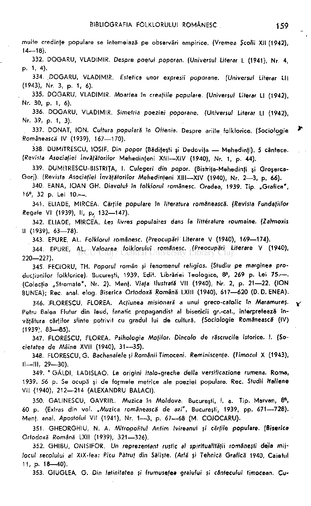

multe credinfe populare se întemeiază pe observări empirice. (Vremea SeoKi XII (1942), 14—18).

332. DOGARU , VLADIMIR. Despre poetul poporan. (Universul Literar L (1941), Nr. 4, p. 1, 4).

- 334. DOGARU , VLADIMIR Estetica unor expresii poporane. (Universul Literar LII

(1943), Nr. 3, p. 1 , 6).

- 335. DOGARU , VLADIMIR. Moartea în crea/iile populare. (Universul Literar LI (1942),

Nr. 30, p. 1, 6).

- 336. DOGARU , VLADIMIR. Simetria poeziei poporane. (Universul Literar LI (1942),

Nr. 39, p. 1, 3).

- 337. DONAT, ION Cultura populară in Oltenia. Despre ariile folklorice. (Sociologie

Românească IV (1939), 167—170).

- 338. DUMITRESCU, IOSIF. Din popo r (Bădiţeşti si Dedoviţa — Mehedinţi). 5 cântece.

(Revista Asociaţiei Învăţătorilor Mehedinţeni XIII—XIV (1940), Nr. 1, p. 44).

- 339. DUMITRESCU-BISTRITA, I. Culegeri din popor. (Bistriţa-Mehedinţi ţ i Groşerca-

Gorj). (Revista Asocia/iei Jnvăfătorilor Mehedinţeni XIII—XIV (1940), Nr. 2—3 , p. 66) .

- 340. EANA, IOA N GH . Diavolul în lolklorul românesc. Oradea, 1939. Tip. „Grafica" ,

16°, 32 p. Lei 10.— .

- 341. ELIADE, MIRCEA. Cărfile populare In literatura românească. (Revista Fundaţiilor

Regale VI (1939), II, p,

f

132—147).

- 342. ELIADE, MIRCEA. Les livres populaires dans la littérature roumaine. (Zafmoxis

Il (1939), 63—78) .

- 343. EPURE, AL. Folklorul românesc. (Preocupări Liferare V (1940), 169—174).
- 344. EPURE, AL. Valoarea fofkloru/ui românesc. (Preocupări Literare V (1940),

220—227).

- 345. FECIORU, TH. Poporul român si fenomenul religios. (Studiu p e marginea pro -

ducfiunilor folklorice). Bucureşti, 1939. Edit. Librăriei Teologice, 8°, 269 p. Lei 75.— . (Colecţia „Stromate", Nr. 2). Menţ. Viaţa Ilustrată VII (1940), Nr. 2, p. 21—22 . (ION BUNEA); Rec. anal. elog . Biserica Ortodoxă Română LXIII (1940), 617—62 0 (D. D. ENEA).

346. iFLORESÇU, FLOREA. Acţiunea misionară a unui greco-cafoJic în Maramureş. Petru Balea Flutur di n leud, fanatic propagandist al biserjicii gr.-cat., interpretează în văţătura cărţilor sfinte potrivit cu gradul lui d e cultură, (Sociologie Românească (IV)

- (1939), 83—85) .

- 347. FLORESCU, FLOREA. Psihologia Moţilor. Dincolo d e răscrucile istorice. I. (So­

cietatea d e Mâine XVII (1940), 31—35) .

- 348. FLORESCU, G . Bachanalele şi Românii Timoceni. Reminiscenţe. (Timocul X (1943),

II—III, 29—30) .

- 349. * GÂLDI, LADISLAO. Le origini italo-greche defla versificazione rumena. Roma,

- 1939. 56 p. Se ocupă şi d e formele metrice ale poeziei populare. Rec. Studii Italiene VII (1940), 212—21 4 (ALEXANDRU BALACI).

- 350. GALINESCU, GAVRIIL. Muzica în Moldova . Bucureşti, f. a. Tip . Marvan, 8«,

60 p. (Extras di n voi „Muzica românească de azi", Bucureşti, 1939, pp . 671—728) . Menţ. anal. Apostolul VII (1941), Nr. 1—3, p. 67—6 8 (M . COJOCARU) .

- 351. GHEORGHIU , N. A. Mitropolitul Antim Ivireanul şi cărţile populare. (Biserica

Ortodoxă Română LXII (1939), 321—326).

- 352. GHIBU , ONISIFOR. Un reprezentant rustic al spirituafîtăfii româneşti deja mij ­

locul secolului al XlX-lea: Picu Pătruţ din Sălişfe. (Arfă şi Tehnică Grafică 1940, Caietul 11, p. 18—40).

###### 353. GIUGLEA, G . Din latinitatea fi frumuseţe» graiului şi cântecului timocean. Cu -

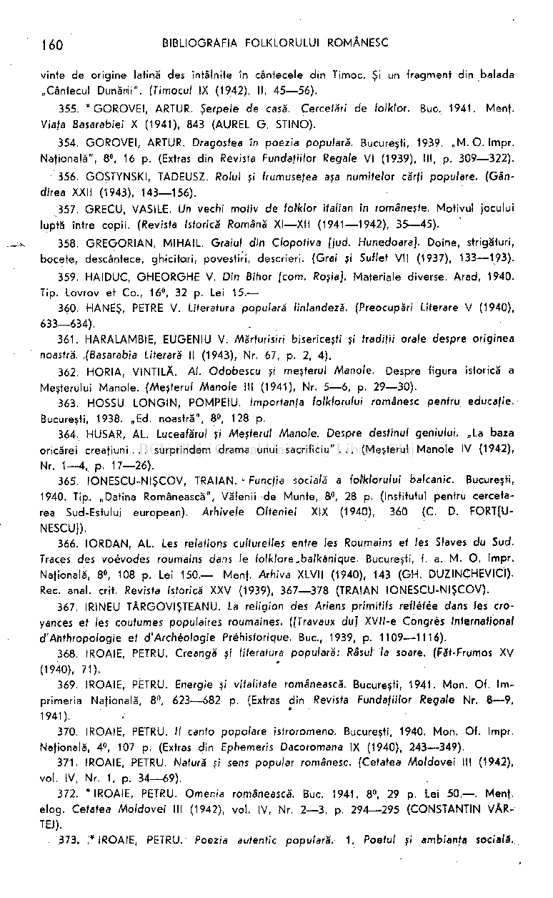

vinte de origine latină des întâlnite în cântecele din Timoc. Şi un fragment din balada „Cântecul Dunării". (Timocuf IX (1942), II, 45—56) .

355. *GOROVEI , ARTUR. Şerpele de casă. Cercetări de folklor. Buc, 1941. Menf. Viata Basarabiei X (1941), 843 (AUREL G. STINO).

354. GOROVEI , ARTUR. Dragostea in poezia populară. Bucureşti, 1939. „M . O . Impr. Nafională", 8°, 16 p. (Extras din Revista Funda/iilor Regale VI (1939), III, p. 309—322) .

- 356. GOSTYNSKI, TADEUSZ. Rolul şi frumuseţea aşa numitelor cărţi populare. (Gân ­

direa XXII (1943), 143—156).

- 357. GRECU, VASILE. Un vechi motiv de folklor italian in româneşte. Motivul jocului

luptă între copii. (Revista Istorică Română XI—XII (1941—1942), 35—45).

- 358. GREGORIAN , MIHAIL. Graiul din Clopofiva f/ud. Hunedoara]. Doine, strigături,

bocete, descântece, ghicitori, povestiri, descrieri. (Grai şi Suflet VII (1937), 133—193).

- 359. HAIDUC, GHEORGH E V. Din Bihor [corn. Roşia]. Materiale diverse. Arad, 1940.

Tip. Lovrov et Co., 16°, 32 p. Lei 15. —

- 360. HANEŞ, PETRE V. Literatura populară finlandeză. (Preocupări Liferare V (1940),

633—634)

- 361. HARALAMBIE, EUGENIU V. Mărturisiri bisericeşti şi tradiţii orale despre originea

noastră. (Basarabia Literară II (1943), Nr. 67, p. 2, 4).

- 362. HORIA, VINTILĂ. Al. Odobesc u şi meşterul Manole. Despre figura istorică a

Meşterului Manole. (Meşterul Manole III (1941), Nr. 5—6 , p. 29—30) .

- 363. HOSSU LONGIN , POMPEIU. Importanţa folklorului românesc pentru educaţie.

Bucureşti, 1938. „Ed. noastră", 8°, 128 p.

- 364. HUSAR, AL. Luceafărul şi Meşterul Manole. Despre destinul geniului. „La baza oricărei creafiuni . . . surprindem drama unui sacrificiu" . . . (Meşterul Manole IV (1942), Nr, 1—4, p. 17—26).
- 365. IONESCU-NIŞCOV, TRAIAN. • Funcţia socială a folklorului balcanic. Bucureşti,

- 1940. Tip. „Datina Românească", Vălenii de Munte, 8°, 28 p. (Institutul pentru cercetarea Sud-Estului european). Arhivele Olteniei XIX (1940), 360 (C. D. FORT[UNESCU]).

- 366. IORDAN , AL. Les relations culturelles entre les Roumains et les Slaves du Sud. Traces des voévodes roumains dans le folklore ^balkanique. Bucureşti, f. a. M. O. Impr. Nafională, 8°, 108 p. Lei 150.— Menf. Arhiva XLVII (1940), 143 (GH . DUZINCHEVICI). Rec. anal. crit. Revista Istorică XXV (1939), 367—37 8 (TRAIAN IONESCU-NIŞCOV).
- 367. IRINEU TÂRGOVIŞTEANU. La religion des Ariens primitifs reflétée dans les cro­

yances et les coutumes populaires roumaines. ([Travaux du] XVII-e Congrès International d'Anthropologie et d'Archéologie Préhistorique. Bue , 1939, p. 1109—1116).

- 368. IROAIE, PETRU. Creangă şi literatura populară: Râsul la soare. (Făt-Frumos XV

(1940), 71).

- 369. IROAIE, PETRU. Energie şi vitalitate românească. Bucureşti, 1941. Mon . Of. Im ­

primeria Naţională, 8°, 623—68 2 p. (Extras din Revista Fundaţiilor Regale Nr. 8—9,

- 1941).

- 370. IROAIE, PETRU. II canto popolare isfroromeno. Bucureşti, 1940. Mon . Of. Impr.

Nafională, 4°, 107 p. (Extras din Ephemeris Dacoromâna IX (1940), 243—349) .

- 371. IROAIE, PETRU. Natură şi sens popular românesc. (Cetatea Moldovei UI (1942),

vol. IV, Nr. 1, p. 34—69) .

- 372. "IROAIE , PETRU. Omenia românească. Buc. 1941. 8°, 29 p. Lei 50.— . Menf.

elog. Cetatea Moldovei III (1942), vol . IV, Nr. 2—3 , p. 294—29 5 (CONSTANTIN VÂRTEJ).

- 373. ,'* IROAIE, PETRU. Poezia autentic populară. 1. Poetul şi ambianţa socială.

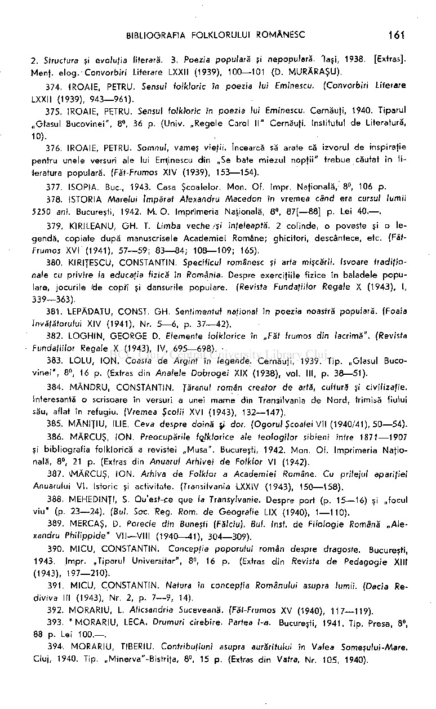

2. Structura şi evoluţia literară. 3. Poezia populară si nepopulară, 'laşi, 1938. [Extras]. Ment. elog . Convorbiri Liferare LXXII (1939), 100—101 (D. MURÂRAŞU).

- 374. IROAIE, PETRU. Sensul folk/oric în poezia (ui Eminescu. (Convorbiri Liferare

LXXII (1939), 943—961) .

- 375. IROAIE, PETRU. Sensul folk/oric în poezia lui Eminescu. Cernăuţi, 1940. Tiparul

„Glasul Bucovinei", 8°, 36 p. (Univ. „Regel e Carol II " Cernăuţi. Institutul d e Literatură, 10).

- 376. IROAIE, PETRU. Somnul, vameş vieţii. Încearcă să arate că izvorul d e inspiraţie

pentru unele versuri ale lui Errţinescu di n „Se bate miezul nopţii " trebue căutat în li teratura populară. (Făt-Frumos XIV (1939), 153—154).

- 377. ISOPIA. Buc , 1943. Casa Şcoalelor. Mon . Of. Impr. Naţională, 8°, 106 p.
- 378. ISTORIA Marelui împărat Alexandru Macedon în vremea când era cursul (urnii

5250 ani. Bucureşti, 1942. M . O . Imprimeria Naţională, 8° , 87[—88 ] p. Lei 40.— .

- 379. K'IRILEANU, GH . T. Limba veche/şi înţeleaptă. 2 colinde, o poveste şi o le ­

gendă , copiate dup ă manuscrisele Academie i Române; ghicitori, descântece, etc. (FătFrumos XVI (1941), 57—59 ; 83—84 ; 108—109 ; 165).

###### 380. KIRIŢESCU, CONSTANTIN Specificul românesc şi arta mişcării. Isvoare tradiţio­

nale cu privire la educaţia fizică în România. Despre exerciţiile fizice în baladele popu lare, jocurile 'de copii şi dansurile populare. (Revista Fundaţiilor Regale X (1943), I, 339—363)

- 381. LEPĂDATU, CONST. GH . Sentimentuf naţional în poezia noastră populară. (Foaia

învăţătorului XIV (1941), Nr. 5—6 , p. 37—42) .

- 382. LOGHIN , GEORGE D. Elemente folklorice în „Făt frumos din lacrimă". (Revista

Fundaţiilor Regale X (1943), IV, 695—698) . •

- 383. LOLU , ION . Coasta d e Argint în legende. Cernăuţi, 1939. Tip . „Glasul Buco­

vinei" , 8°, 16 p. (Extras di n Analele Dobroge i XIX (1938), vol . III, p. 38—51).

- 384. MÂNDRU , CONSTANTIN. Jăranul român creator d e arfă, cultură şi civilizaţie.

Interesantă o scrisoare în versuri a unei mam e din Transilvania d e Nord , trimisă fiului său, aflat în refugiu. (Vremea Scolii XVI (1943), 132—147).

- 385. MĂNIŢIU , ILIE. Ceva despre doină ş> dor. (Ogoru l Şcoalei VII (1940/41), 50—54) .
- 386. MARCUS, ION Preocupările iqlklorice ale teologilor sibieni între 1871—1907

şi bibliografia folklorică a revistei „Musa" . Bucureşti, 1942. Mon . Of. Imprimeria Naţio nală, 8°, 21 p. (Extras din Anuarul Arhivei de Folklor V I (1942).

- 387. \MĂRCUŞ, ION Arhiva de Folklor a Academiei Române. Cu prilejul apariţiei Anuarului VI . Istoric şi activitate. (Transilvania LXXIV (1943), 150—158).
- 388. MEHEDINŢI, S. Qu'esf-ce qu e la Transylvanie. Despre port (p . 15—16) şi „focul viu " (p. 23—24) . (Bu/. Soc. Reg . Rom. d e Geografie LIX (1940), 1—110).
- 389. MERCAŞ, D. Porecle di n Buneşfi (Fălciu). Buf. (nsf. de Filologie Română „Ale xandru Phi/ippide " VII—VIII (1940—41), 304—309) .
- 390. MICU , CONSTANTIN . Concepţia poporului român despre dragoste. Bucureşti, 1943. ţmpr . „Tiparul Universitar", 8°, 16 p. (Extras di n Revista de Pedagogie XIII

(1943), 197—210).

- 391. MICU , CONSTANTIN . Natura în concepţia Românului asupra lumii. {Dacia Re-

diviva III (1943), Nr. 2, p. 7—9 , 14).

- 392. MORARIU , L. Alicsandria Suceveana. {Făt-Frumos XV (1940), 117—119).
- 393. 'MORARIU , LECA. Drumuri cirebire. Partea /-ia. Bucureşti, 1941 . Tip. Presa, 8°,

88 p. Lei 100.—.

- 394. MORARIU , TIBERIU. Contribuţiuni asupra aurăriMui în Valea Someşului-Mare.

Cluj, 1940. Tip. „Minerva"-Bistriţa, 8°, 15 p. (Extras di n Vatra, Nr. 105, 1940).

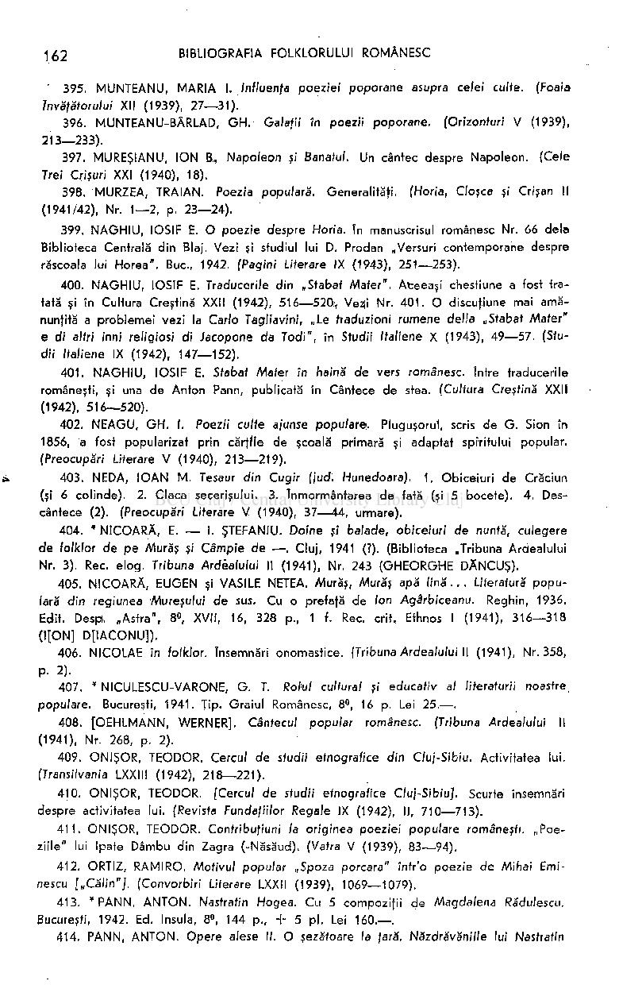

' 395. MUNTEANU , MARIA I. Influenţa poeziei poporane asupra celei culte. (Foaia Învăţătorului XII (1939), 27—31) .

- 396. MUNTEANU-BÂRLAD, GH . Galaţii in poezii poporane . (Orizonturi V (1939),

213—233) .

- 397. MUREŞIANU, IO N B, Napoleo n şi Banatul. Un cântec despre Napoleon . (Cele

Trei Crişuri XXI (1940), 18).

- 398. MURZEA, TRAIAN. Poezia populară. Generalităţi. (Horia, Cloşca şi Crişan II

(1941/42), Nr. 1—2, p. 23—24) .

- 399. NAGHIU , IOSIF E. O poezie despre Horia. în manuscrisul românesc Nr. 66 delà

Biblioteca Centrală di n Blaj. Vezi şi studiul lui D. Prodan „Versuri contemporane despre răscoala lui Horea" . Buc , 1942 (Pagini Literare IX (1943), 251—253) .

- 400. NAGHIU , IOSIF E. Traducerile di n „Stabaf Mater" . Ateeaş i chestiune a fost tra­

tată şi în Cultura Creştină XXII (1942), 516—520!, Vezji Nr. 401 . O discufiune ma i amă nunţită a probleme i vezi ia Carlo Tag/iavini, „L e fraduzioni rumene della „Stabat Mater" e d i a/fri inni religioşi d i Jacopone da Todi" , în Studii Italiene X (1943), 49—57 . (Studii Italiene IX (1942), 147—152).

- 401 . NAGHIU , IOSIF E. Stabaf Mater in haină d e vers românesc. între traducerile româneşti, şi una d e Anton Pann, publicată în Cântece d e stea. (Cultura Creştină XXII

- (1942), 516—520) .

- 402. NEAGU , GH . I. Poezii culte ajunse populare, Pluguşorul, scris d e G . Sion în 1856, a fost popularizat prin carffle d e şcoală primară şi adaptat spiritului popular. (Preocupări Literare V (1940), 213—219) .

w 403 . NEDA, IOA N M . Tesaur di n Cugir (jud . Hunedoara). 1, Obiceiuri d e Crăciun (şi 6 colinde). 2. Claca secerişului. 3. Înmormântarea d e fată (şi 5 bocete). 4 . Descântece (2) (Preocupări Liferare V (1940), 37—44 , urmare).

- 404. * NICOARĂ , E. — I. ŞTEFANIU. Doine şi balade, obiceiuri de nuntă, culegere de folklor d e p e Murăş şi Câmpi e d e — . Cluj, 1941 (?). (Biblioteca „Tribuna Ardealului Nr. 3). Rec. elog . Tribuna Ardealului II (1941), Nr. 243 (GHEORGH E DĂNCUŞ).
- 405. NICOARĂ , EUGEN şi VASILE NETEA. Murăş, Murăş ap ă fină.. . Literatură popu lară di n regiunea Mureşului d e sus. C u o prefaţă d e Ion Agârbiceanu. Reghin, 1936. Edit. Despi. „Astra" , 8°, XVII, 16, 328 p., 1 f. Rec. crit, Ethnos I (1941),, 316—31 8 (l[ON ] D[IACONU]) .
- 406. NICOLAE în folklor. însemnări onomastice. (Tribuna Ardealului II (1941), Nr. 358

p. 2).

- 407. "NICULESCU-VARONE , G . T. Rolul cultural şi educativ al literaturii noastre

populare. Bucureşti, 1941. Ţip. Graiul Românesc, 8°, 16 p. Lei 25.— .

- 408. [OEHLMANN , WERNER]. Cântecul popular românesc. (Tribuna Ardealului II

(1941), Nr. 268, p. 2).

- 409. ONIŞOR , TEODOR. Cercul de studii etnografice din C/uj-Sibiu. Activitatea lui .

(Transilvania LXXIII (1942), 218—221) .

- 410. ONIŞOR, TEODOR. [Cercul d e studii etnografice Cluj-SibiuJ. Scurte însemnări

despre activitatea lui. (Revista Funda/iilor Regale IX (1942), II , 710—713) .

- 411 . ONIŞOR, TEODOR. Contribu/iuni la originea poeziei populare româneşti. „Poe ­

ziile" lui Ipate Dâmbu di n Zagra (-Năsăud). (Vatra V (1939), 83—94) .

- 412. ORTIZ, RAMIRO Motivul popular „Spoza porcara" într'o poezie d e Miha i Emi -

nescu [„Călin"' . (Convorbiri Literare LXXII (1939), 1069—1079).

- 413. * PANN , ANTON Nastratin Hogea. C u 5 compoziţ i d e Magdalena Rădulescu.

Bucureşti, 1942. Ed. Insula, 8°, 144 p., + 5 pl . Lei 160.—.

- 414. PANN , ANTON . Oper e alese II. O şezătoare la ţara. Năzdrăvăniile lui Nastratin

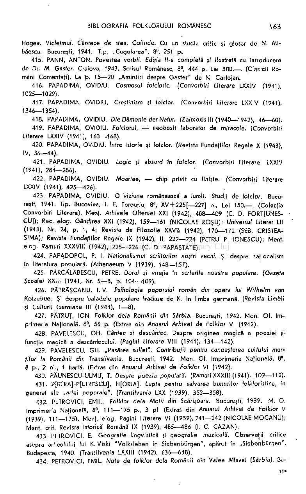

Hogea. Vicleimul. Cântece de stea. Colinde . Cu un studiu critic şi glosar d e N. Mi hăescu. Bucureşti, 1941. Tip. „Cugetarea" , 8°, 251 p.

- 415. PANN , ANTON . Povestea vorbii . Edifia ll-a complet ă şi ilustrată cu introducere

de Dr. M. Gaster. Craiova, 1943. Scrisul Românesc, 8°, 444 p. Lei 300.— . (Clasicii Români Comentat) . La p. 15—2 0 „Amintiri despre Gaster" d e N. Cartojan.

- 416. PAPADIMA, OVIDIU . Cosmosul folcloric. (Convorbiri Literare LXXIV (1941),

1025—1029).

- 417. PAPADIMA, OVJDIU. Creştinism şi folclor. (Convorbiri Literare LXXIV (1941),

1346—1354).

- 418. PAPADIMA, OVIDIU . Die Dämonie der Natur. (Za)moxis III (1940—1942), 46—60) .
- 419. PAPADIMA , OVIDIU . Folclorul, — neobosit laborator d e miracole. (Convorbiri

Literare LXXIV (1941), 163—168).

- 420. PAPADIMA, OVIDIU . Intre istorie şi folclor. (Revista Fundafiilor Regale X (1943),

IV, 36—44) .

- 421 . PAPADIMA, OVIDIU . Logic şi absurd în folclor. (Convorbiri Literare LXXIV

- (1941), 284—286) .

- 422. PAPADIMA , OVIDIU . Moartea , — chip privit cu linişte. (Convorbiri Literare

LXXIV (1941), 425—426) .

- 423. PAPADIMA , OVIDIU . O viziune românească a lumii. Studii de folclor. Bucu­

reşti, 1941. Tip. Bucovina, I. E. Toroutiu, 8°, XV+225[—227 ] p., Lei 150.—. (Colecfia Convorbiri Literare). Menf. Arhivele Oltenie i XXI (1942), 408—40 9 (C. D. FORTfUNESCÜ]) ; Rec. elog . Gândirea XXI (1942), 159—161 (NICOLA E ROŞU); Universul Literar LII (1943), Nr. 24, p. 1, 4 ; Revista d e Filosofie XXVII (1942), 170—17 2 (SEB. CRISTEASIMA) ; Revista Fundafiilor Regale IX (1942), II, 222—22 4 (PETRU P. IONESCU); Menf. elog . Ramuri XXXVIII (1942), 225—22 6 (C. D. PAPASTATE).

- 424. PAPADOPOL, P. I. Naţionalismul scriitorilor noştri vechi. Şi despre nationalism

in literatura populară. (Athenaeum V (1939), 148—157).

- 425. PÂRCĂLĂBESCU, PETRE. Dorul şi vitejia in scrierile noastre populare. (Gazeta

Şcoalei XXIII (1941, Nr. 5—8 , p. 104—109) .

- 426. PĂTRAŞCANU, I. V. Psihologia poporului român din opera lui Wilhelm von

Kotzebue. Şi despre baladele populare traduse d e K. în limba germană. (Revista Limbii şi Culturii German e III (1943), 1—8).

- 427. PĂTRUJ, ION . Folklor delà Românii din Sârbia. Bucureşti, 1942. Mon . Of. Im­

primeria Nafională, 8°, 56 p. (Extras di n Anuarul Arhivei de Folklor VI (1942).

- 428. PAVELESCU, GH . Cântec şi descântec. Despre originea magică a poezie i şi

funcfia magică a descântecului. (Pagini Liferare VIII (1941), 134—142).

- 429. 'PAVELESCU, GH . „Pasărea suflet". Contribuţii pentru cunoaşterea cultului mor-

JiJor la Românii din Transilvania. Bucureşti, 1942. Mon . Of. Imprimeria Nafională, 8°, 8 p., 2 pl., 1 hartă. (Extras din Anuarul Arhivei d e Folkfor VI (1942).

- 430. PÄUNESCU-ULMU, T. Despre poezi a populară. (Ramuri XXXIII (1941), 109—112).
- 431 . P[ETRA]-P[ETRESCU], H[ORIA] . Lupta pentru salvarea bunurilor folkloristice, în

general ale „artei poporale". (Transilvania LXX (1939), 352—358) .

- 432. PETROVICI, EMIL. Folklor delà Moţii din Scărişoara. Bucureşti, 1939. M. O.

Imprimeria Nafională, 8°, 111—17 5 p., 3 pl . (Extras din Anuarul Arhivei de Folklor V

- (1939), 111—175). Menf. elog . Pagini Liferare VI (1939), 241—24 2 (NICOLAE MOCANU) ; Menf. crit. Revista Istorică Română IX (1939), 485—48 6 (I. C. CAZAN) .

- 433. PETROVICI, E. Geografie lingvistică şi geografie muzicală. Observaţii critice asupra articolului lui K. Viski "Volksleben in Siebenbürgen" , apărut în „Siebenbürgen" . Budapesta, 1940. (Transilvania LXXIII (1942), 636—638) .
- 434. PETROVICI, EMIL. Not e de folkfor delà Românii din Valea Mlavei (Sârbia). Bull *

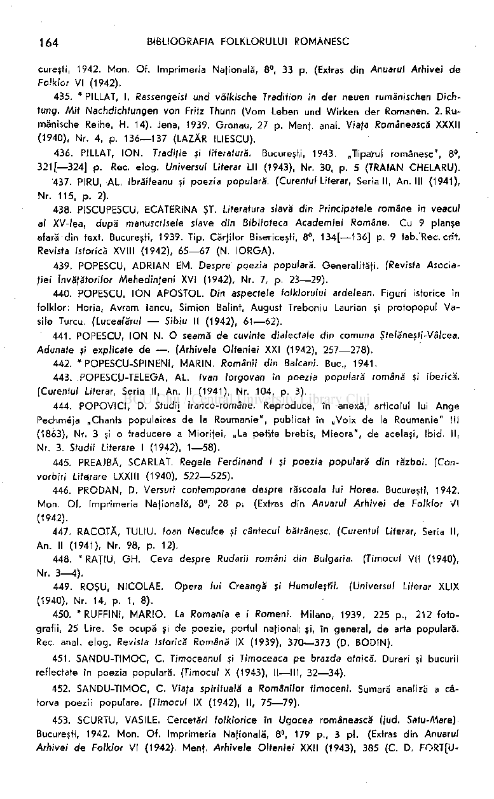

cureşti, 1942. Mon . Of. Imprimeria Nafională, 8°, 33 p. (Extras di n Anuarul Arhivei d e Folklor VI (1942).

435. * PILLAT, I. Rassengeisf un d völkische Tradition in der neuen rumänischen Dichtung. Mit Nachdichtungen von Fritz Thunn (Vo m Leben un d Wirke n de r Romanen. 2. Ru mänische Reihe, H. 14). Jena, 1939. Gronau , 27 p. Menf. anal. Viafa Românească XXXII

- (1940), Nr. 4 , p. 136—137 (LAZÄR ILIESCU).

- 436. PILLAT, ION Tradijie şi literatură. Bucureşti, 1943. „Tlipärul românesc", 8°,

321 [—324] p. Rec. elog . Universul Literar LII (1943), Nr. 30 , p. 5 (TRAIAN CHELARU).

- 437. PIRU, AL . Ibrăileanu şi poezia populară. (Curentul

Literar, Seriali , An . III (1941), Nr. 115, p. 2).

1

438. PISCUPESCU, ECATERINA ŞT. Literatura slavă din Principatele române in veacul al XV-lea, după manuscrisele slave din Biblioteca Academiei Române. C u 9 planşe afară di n text. Bucureşti, 1939. Tip. Cărjilor Bisericeşti, 8°, 134[—136 ] p. 9 tab. Rec. crût. Revista Istorică XVIII (1942), 65—6 7 (N . IORGA) .

- 439. POPESCU, ADRIA N EM. Despre pqezia populară. Generalităţi. (Revista Asocia­

ţiei învă/ători/or Mehedin/en i XVI (1942), Nr. 7, p. 23—29) .

- 440. POPESCU, IO N APOSTOL. Di n aspectele tolklorului ardelean. Figuri istorice în

folklor: Horia, Avra m lancu, Simion Balint, August Treboniu Laurian şi protopopu l Va sile Turcu. (Luceafărul — Sibiu II (1942), 61—62) .

- 441 . POPESCU, IO N N. O seamă d e cuvinte dialectale din comuna Şfefăneşti-Vâlcea.

Adunate si explicate de — . (Arhivele Olteniei XXI (1942), 257—278) .

- 442. * POPESCU-SPINENI, MARIN . Românii di n Balcani. Buc , 1941
- 443. POPESCU-TELEGA, AL Ivan Iorgovan in poezia populară română şi iberică.

(Curentul Literar, Seria II, An . II (1941), Nr. 104, p. 3).

- 444. POPOVICI , D. Studi'i iranco-române. Reproduce, în anexă, articolul lui Ang e

Pechméja „Chants populaires d e la Roumanie" , publicat în „Voi x d e la Roumanie" III (1863), Nr. 3 şi o traducere a Miorifei , „La petite brebis, Mieora" , d e acelaşi, Ibid. II , Nr. 3. Studii Liferare I (1942), 1—58).

- 445. PREAJBĂ, SCARLAT. Regele Ferdinand I şi poezia populară din război. (Con­

vorbiri Litsjrare LXXIII (1940), 522—525) .

- 446. PRODAN , D. Versuri contemporane despre răscoala lui Horea. Bucureştf, 1942.

Mon . Of. Imprimeria Nafională, 8°, 28 p. (Extras di n Anuarul Arhivei d e Folklor VI

- (1942).

- 447. RACOTÄ, TULIU. loan Neculce şi cântecul bătrânesc. (Curentul Literar, Seria II,

An . II (1941), Nr. 98 , p. 12).

- 448. 'RAŢIU , GH . Ceva despre Rudari'i români di n Bulgaria. (Timocul VII (1940),

Nr. 3—4) .

- 449. ROŞU, NICOLAE . Oper a lui Creanga şi Humuleştii. (Universul Literar XLIX

(1940), Nr. 14, p. 1, 8) .

- 450. * RUFFINI, MARIO . La România e i Romeni. Milano, 1939, 225 p., 212 foto grafii, 25 Lire. Se ocupă şi d e poezie , portul nafional) şi, în general, d e arta populară. Rec. anal. elog . Revista Istorică Română IX (1939), 370—37 3 (D. BODIN).
- 451. SANDU-TIMOC , C. Timoceanuî şi Timoceaca p e brazda etnică. Dureri şi bucurii reflectate în poezia populară (Timocul X (1943), II—III, 32—34) .
- 452. SANDU-TIMOC , C. Viaja spirituală a Românilor timoceni. Sumară analiză a câ torva poezii populare. (Timocul IX (1942), II , 75—79) .
- 453. SCURTU, VASILE. Cercetări tolklorice în Ugocea românească (jud. Safu-AAare). Bucureşti, 1942. Mon . Of. Imprimeria Nafională, 8°, 179 p., 3 pl . (Extras di n Anuarul Arhivei de Folklor VI (1942). Menf. Arhivele Olteniei XXII (1943), 385 (C. D. FORTfU-

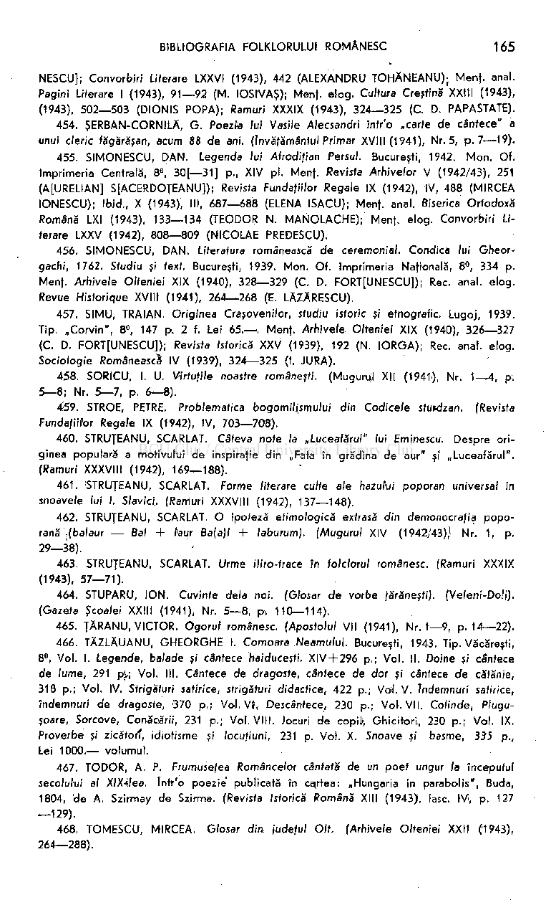

NESCU]; Convorbiri Liferare LXXVI (1943), 442 (ALEXANDRU TOHÄNEANU) ; Menf. anal. Pagini Liferare I (1943), 91—9 2 (M . IOSIVAŞ); Menf. elog . Culfura Creştină XXIII (1943),

- (1943), 502—50 3 (DIONIS POPA); Ramuri XXXIX (1943), 324—32 5 (C. D. PAPASTATE).

- 454. ŞERBAN-CORNILĂ, G . Poezia lui Vasife Alecsandri într'o „carte d e cântece" a

unui cleric făgărăşan, acum 88 d e ani. (învăţământul Primar XVIII (1941), Nr. 5, p. 7—19).

- 455. SIMONESCU, DAN . Legenda lui Afrodiţian Persul. Bucureşti, 1942. Mon . Of. Imprimeria Centrală, 8°, 30[—31 ] p., XIV pl . Menf. Revista Arhivelor V (1942/43), 251 (A[URELIAN] SÎACERDOŢEANU]); Revista Funda/iilor Regale IX (1942), IV, 488 (MIRCEA IONESCU); Ibid., X (1943), III, 687—68 8 (ELENA ISACU); Menf. anal. Biserica Ortodox ă Română LXI (1943), 133—134 (TEODOR N . MANOLACHE) ; Menf. elog . Convorbir i Literare LXXV (1942), 808—80 9 (NICOLAE PREDESCU).
- 456. SIMONESCU , DAN Literatura românească de ceremonial. Condica lui Gheorgachi, 1762. Studiu şi text. Bucureşti, 1939. Mon . Of . Imprimeria Nafională, 8°, 334 p. Menf. Arhivele Olteniei XIX (1940), 328—32 9 (C. D. FORT[UNESCU]); Rec. anal. elog. Revue Historique XVIII (1941), 264—26 8 (E. LĂZĂRESCU).
- 457. SIMU , TRAIAN. Originea Craşovenilor, studiu istoric şi etnografic. Lugoj , 1939. Tip. „Corvin" , 8°, 147 p. 2 f. Lei 65.— . Menf. Arhivele Olteniei XIX (1940), 326—32 7 (C. D. FORT[UNESCU]); Revista Istorică XX V (1939), 192 (N . IORGA) ; Rec. anal. elog. Sociologie Româneasca IV (1939), 324—32 5 (I. JURA).
- 458. SORICU, I. U. Virtufile noastre româneşti. (Mugurul XII (1941), Nr. 1-^4 , p.

5—8 ; Nr. 5—7 , p. 6—8) .

- 459. STROE, PETRE. Problematica bogomiljsmului din Codicele sturdzan. (Revista

Fundaţiilor Regale IX (1942), IV, 703—708) .

- 460. STRUŢEANU, SCARLAT. Câteva note la „Luceafărul" lui Eminescu. Despre ori­

ginea populară a motivului d e inspirafie di n „Fata în grădina d e aur " şî „Luceafărul" . (Ramuri XXXVIII (1942), 169—188).

###### 461 . 'STRUŢEANU, SCARLAT. Forme literare culte ale hazului poporan universal în

snoavele lui I. Slavici. (Ramuri XXXVIII (1942), 137—148).

###### 462. STRUŢEANU, SCARLAT. O ipoteză etimologică extrasă din demonocraţia popo­

rană ,(balaur — Bal + faur Ba(a)l + laburum). (Mugurul XIV (1942/43),' Nr> 1 , p. 29—38) .

- 463. STRUŢEANU, SCARLAT. Urme iliro-trace In folclorul românesc. (Ramuri XXXIX

(1943), 57—71) .

- 464. STUPARU, ION . Cuvinte delà noi. (Glosar d e vorbe ţărăneşti). (Vefeni-Do.'j).

(Gazeta Şcoalei XXIII (1941), Nr. 5—8 , p> 110—114).

- 465. ŢĂRANU , VICTOR Ogorul românesc. (Apostolul VII (1941), Nr. 1—9, p. 14—22).
- 466. TĂZLĂUANU , GHEORGH E I. Comoara Neamului. Bucureşti, 1943. Tip. Văcăreşti,

8°, Vol . I. Legende, balade şi cântece haiduceşti. XIV + 296 p.; Vol . II . Doine şi cântece de lume, 291 py, Vol . III. Cântece d e dragoste, cântece de dor şi cântece de cătănie, 318 p.; Vol . IV. Strigături satirice, strigături didactice, 42 2 p.; Vot. V . îndemnuri satirice, îndemnuri d e dragoste, 37 0 p.; Vol. Vt , Descântece, 23 0 p.; Vol . VII. Colinde, Ptuguşoare, Sorcove, Conăcării, 231 p.; Vol . VIII. Jocuri d e copii*, Ghicitori , 230 p.; Vol . IX. Proverbe şi zicătorl, idiotisme şi locuţiuni, 231 p. Vol . X. Snoave şi basme, 335 p., Lei 1000. — volumul .

467. TODOR, A . P. Frumuseţea Româncelor cântată d e un poe t ungur fa începutul secolului al XlXilea. într'o poezie' publicată în cartea: „Hungaria in parabolis", Buda, 1804, d e A. Szirmay d e Szirma. (Revista Istorică Română XIII (1943), fasc. IV, p. 127 —129)

- 468. TOMESCU, MIRCEA. Glosar di n judeţul OH. (Arhivele Olteniei XXII (1943),

264—288) .

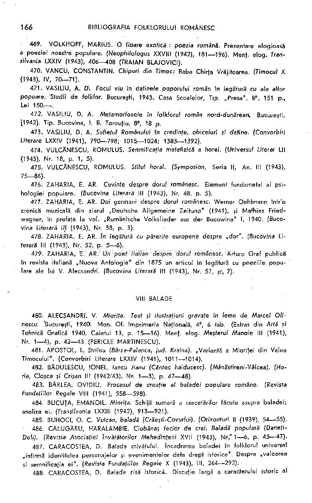

- 469. VOLKHOFF , MARIUS. O floare exofică : poezia română. Prezentare elogioasă

a poeziei noastre populare. (Neophi/o/ogus XXVIII (1942), 181—196). Menf. elog . Transilvania LXXIV (1943), 406—40 8 (TRAIAN BLAJOVICI).

- 470. VANCU , CONSTANTIN. Chipuri din Timoc: Baba Chirfa Vrăjitoarea. (Timocul X

(1943), IV, 70—71) .

- 471 . VASILIU, A. D'i Focul viu în datinele poporului român in legătură cu ale altor

popoare . Studii d e folklor. Bucureşti, 1943. Casa Şcoalelor, Tip. „Presa", 8°,. 151 p., Lei 150.—.

- 472. VASILIU, D. A. Metamorfozele in folklorul român nord-dunăreart Bucureşti, [1942]. Tip. Bucovina, I. E. Toroutiu, 8°, 18 p.
- 473j VAS/ILIU, D. A. Sufletul' Românului în credinţe, obiceiuri şi dafme. (Convorbiri Literare LXXIV (1941), 790—798 ; 1015—1024 ; 1383—1392).
- 474. VULCĂNESCU, ROMULUS. Semnificaţia metafizică a horei. (Universul Literar LII

(1943), Nr. 18, p. 1, 5).

- 475. VULCĂNESCU, ROMULUS. Stilul horal. (Symposion, Seria II, An . III (1943),

75—86) .

- 476. ZAHARIA, E. AR. Cuvinte despre dorul românesc. Element fundametal al psi­

hologiei populare. (Bucovina Literară III (1943), Nr. 48, p. 5).

- 477. ZAHARIA, E. AR. Doi germani despre dorul românesc. Werner Oehlman n într'o

cronică muzicală din ziarul „Deutsche Allgemein e Zeituno " (1941), şi Mathias Friedwagner, în prefafa la vol . „Rumänische Volkslieder aus der Bucowina" I, 1940. (Bucovina Literară UI (1943), Nr. 58, p. 3).

- 478. ZAHARIA, E. AR. In legătură cu părerile europene despre „dor". (Bucovina Li­

terară III (1943), Nr. 52, p. 5—6) .

- 479. ZAHARIA, E. AR. Un poe t italian despre dorul românesc. Arturo Graf publică

în revista italiană „Nuov a Antologia " din 1875 un articol în legătură cu poeziile popu lare ale lui V. Alecsandri. (Bucovina Literară III (1943), Nr. 57, p', 7).

VIII BALADE

480. ALECSANDRI, V. Mioriţa. Text şi ilustraţiuni gravate în lemn de Marcel Olinescu. "Bucureşti, 1940. Mon . Of. Imprimeria Nafionalä, 4°, 6 tab. (Extras din Arfă şi Tehnică Grafică 1940, Caietul 13, p. 15—16). Menf. elog. Meşterul Manole III (1941), Nr. 1—4), p. 42—4 3 (PERICLE MARTINESCU).

- 481 . APOSTOL, I, Sfriinu (Bârza-Palanca, jud. Kraina). „Variantă a Miorifei din Valea

Timocului" . (Convorbiri Liferare LXXIV (1941), 1011—1014).

- 482. BÄDULESCU, IONEL, lancu Jianu (Cântec haiducesc). (Mânăstireni-Vâlcea). (Ho-

ria, Cloşca şi Crişan III (1942/43), Nr*. 1—3), p. 47—48) .

- 483. BÂRLEA, OVIDIU . Procesul de creaţie al baladei populare române. (Revista

Funda/iilor Regale VIII (1941), 558—598) .

- 484. BUCUJA, EMANOIL . /Miori/a. Schifă sumară a cercetărilor făcute asupra baladei;

analiza ei. (Transilvania LXXIII (1942), 913—921) .

- 485. BUHOCI , O. C. Vulcan, baladă (Crăeşti-Covurluij. (Orizonturi II (1939), 54—55) .
- 486. CĂLUGĂRU , HARALAMBIE. Ciobănaş fecior de crai. Baladă populară (Danefn

Dolj). (Revisfa Asociaţiei Învăţătorilor Mehedinţeni XVII (1943), Nn,'1—6 , p. 45—47) .

- 487. CARACOSTEA, D. Balada crivăţului. încadrarea baladei în folklorul universal

„infirmă identitatea personajelor şi evenimentelor date drept istorice". Despre „valoarea şi semnificaţia ei". (Revista Fundaţiilor Regale X (1943), III, 264—292) .

- 488. CARACOSTEA, D. Balada zisă istorică,. Discuţie largă a caracterului istoric al

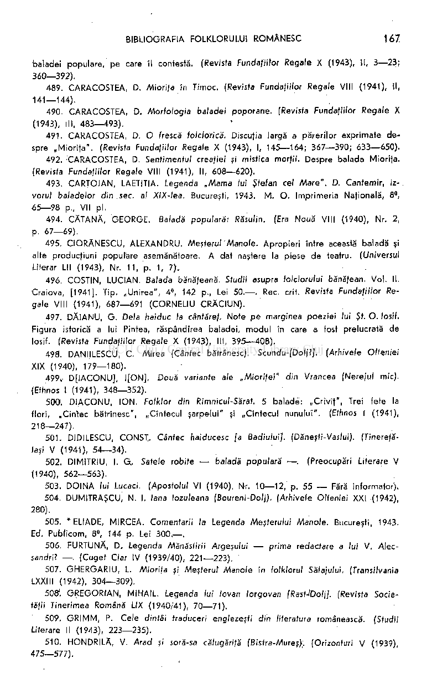

baladei populare, p e care îl contestă. (Revista Fundaţii/or Regale X (1943), II , 3—23 ; 360—392) .

- 489. CARACOSTEA, D. Mioriţa în Timoc. (Revista Fundaţiilor Regale VIII (1941), II ,

141—144)

- 490. CARACOSTEA, D. Morfologi a baladei poporane . [Revista Fundaţiilor Regale X

(1943), III, 483—493) .

- 491 . CARACOSTEA, D. O /reşcă folclorică. Discufia largă a părerilor exprimate de ­

spre „Miorita" . (Revista Fundaţiilor Regale X (1943), I, 145—164 ; 367—390 ; 633—650) .

- 492. CARACOSTEA, D. Sentimentul creaţiei si mistica mor/ii. Despre balada Mioriţa.

(Revista Fundaţi/lor Regale VIII (1941), II , 608—620) .

- 493. CARTOJAN, LAETITIA. Legenda „Mama lui Ştefan cel Mare". D. Canfemir, iz­

voru l baladelor di n sec. al XlX-lea, Bucureşti, 1943. M . O . Imprimeria Naţională, 8°, 65—9 8 p., VII pl .

- 494. CĂTANĂ , GEORGE. Baladă populară : Răsulin. (Era Nou ă VIII (1940), Nr. 2,

p. 67—69) .

- 495. CIORĂNESCU, ALEXANDRU. MeşferulManole . Apropieri între această baladă şi alte producţiuni populare asemănătoare. A dat naştere la piese d e teatru. (Universul Literar LII (1943), Nr. 11 , p. 1 , 7) ,
- 496. COSTIN, LUCIAN . Balada bănăţeană. Studii asupra folclorului bănăţean. Vol . II. Craiova, [1941]. Tip. „Unirea" , 4°, 142 p., Lei 50.— . Rec. crit. Revista Fundaţiilor Regale VIII (1941), 687—691 (CORNELIU CRĂCIUN).
- 497. DĂIANU , G . De/a haiduc fa cântăreţ. Note p e marginea poezie i lui Şt. O. losil. Figura istorică a lui Pintea, răspândirea baladei, modu l în care a fost prelucrată d e losif. (Revista Funda/iilor Regale X (1943), III, 395—408) .

493,. DANIILESCÜ, C. Mire a (Cântec bătrânescj. Scundu-[Dof(?]. {Arhivele Olteniei XIX (1940), 179—180).

- 499» D[IACONU] , l[ON] , Două variante a/e „/Miori/ei" di n Vrancea (Nere/ul mic) . (Efhnos I (1941), 348—352) .
- 500. DIACONU , ION . Folk/or din Rlmnicul-Sărat. 5 baladé: „Crivlf" , Trei fete la flori, „Cîntec bătrînesc", „Cîntecul şarpelui" şi „Cîntecul nunului" . (Efhnos [ (1941), 218—247)
- 501 . DIDILESCU, CONST,. Cântec haiducesc [a Badiu/uiJ. (Dăneşfi-Vas/ui). (Tinereţă-

laşi V (1941), 54—34) .

- 502. DIMITRIU, I. G . Safe/e robite — baladă popular ă — . (Preocupări Liferare V

- (1940), 562—563) .

- 503. DOIN A lui Lucaci. (Apostolul VI (1940), Nr. 10—12 , p. 55 — Fără informator).
- 504. DUMITRAŞCU, N. I. lana lozuleana (Boureni-Dolj). (Arhivele Olteniei XXI (1942),

280).

- 505. * ELIADE, MIRCEA. Comentarii la Legenda Meşterului Manole. Bucureşti, 1943.

Ed. Publicom, 8°, 144 p. Lei 300.— .

- 506. FURTUNĂ, D. Legenda Mănăstirii Argeşului — prima redactare a lui V. Alec-

sandri? — . (Cuget Clar IV (1939/40), 221—223) .

- 507. GHERGARIU, L. Mioriţa şi Meşterul Manole in tolklorul Sălajului. [Transilvania

LXXIII (1942), 304—309) .

- 508

. GREGORIAN , MIHAIL. Legenda lui lovan Iorgovan [Rast-lDoljJ. (Revista Societăţii Tinerimea Română LIX (1940/41), 70—71) .

1

###### 509. GRIMM , P. Ce/e dintâi traduceri englezeşti din literatura românească. (Studii

Liferare II (1943), 223—235) .

###### 510. HONDRILĂ, V. Ara d şi soră-sa călugăriţă (B/'stra-Mureş);. (Orizonturi V (1939),

475—577) .

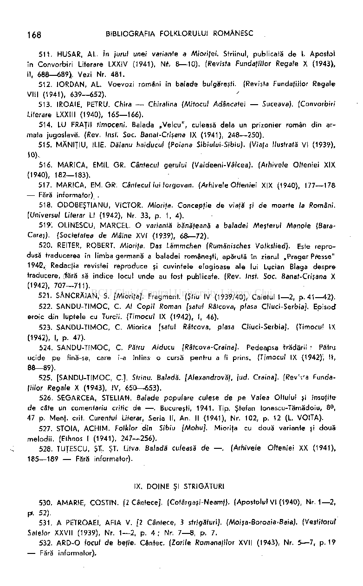

- 511 . HUSAR, AL In jurul unei variante a Mioriţei. Striinul, publicată d e ţ. Aposto l

în Convorbiri Literare LXXIV (1941), Nif, 8—10) (Revista Fundaţiilor Regale X (1943), II, 688—689) . Vezi Nr. 481

- 512. IORDAN , AL . Voevozi români in balade bulgăreşti. (Revista Funda/iilor Regale

VIII (1941), 639—652) .

x

- 513. IROAIE, PETRU. Cfiira — Chiralina (Mitocul Adâncatei — Suceava). (Convorbir i

Literare LXXI11 (1940), 165—166).

- 514. LU FRAŢII timoceni. Balada „Velcu" , culeasă delà un prizonier român di n ar­

mata jugoslavă. (Rev. Inst. Soc. Banat-Crişana IX (1941), 248—250) .

- 515. MĂNIŢIU, ILIE. Dăianu haiducul (Poiana Sibiului-Sibiu) (Viaţa Ilustrată VI (1939),

10).

- 516. MARICA, EMIL GR Cântecul gerului (Vaideeni-Vâlcea). (Arhivele Olteniei XI X

- (1940), 182—183).

- 517. MARICA, EM. GR . Cântecul lui Iorgovan. (Arhivele Olteniei XIX (1940), 177—17 8

— Fără informator) .

- 518. ODOBEŞTIANU, VICTOR. Mioriţa. Concepţie de viaţă şi d e moarte la Români.

(Universul Literar LI (1942), Nr. 33 , p. 1, 4).

- 519'. OLINESCU, MARCEL. O variantă bănăţeană a baladei Meşterul Manole (Bara-

Caraş). (Societatea de Mâine XVI (1939), 68—72) .

- 520. REITER, ROBERT. Mioriţa. Das Lämmchen (Rumänisches Volkslied). Este repro ­

dusă traducerea în limba germană a baladei româneşti, apărută în ziarul „Prager Presse" 1942, Redacfia revistei reproduce şi cuvintele elogioase ale lui Lucian Blaga despr e traducere, ;fără să indice locul unde au fost publicate. (Rev. Inst. Soc. Banaf-Crişana X (1942), 707—711) .

- 521 . SÂNCRĂIAN , S. 'Mioriţa]. Fragment. (Ştiu IV (1939/40), Caietul 1—2, p. 41—42) .
- 522. SANDU-TIMOC , C. A l Copi l Roman fsafuf Râtcova, plasa Cliuci-Serbia]. Episod

eroic di n luptele cu Turcii. (Timocul IX (1942), I, 46).

- 523. SANDU-TIMOC , C. Miorica [satul Râtcova, plasa Cliuci-SerbiaJ. (Timocul IX

- (1942), I, p. 47).

- 524. SANDU-TIMOC , C. Patru Aiducu [Râtcova-Craina]. Pedeapsa (trădării • Patru

ucide p e fină-sa, care i-a întins o cursă pentru a fi prins. (Timocul IX (1942)^ ll

r

88—89) .

###### 525. [SANDU-TIMOC , C.] Strinu. Baladă. [Alexandrovăţ, jud. Craina]. (RavV a Funda­

ţiilor Regale X (1943), IV, 650—653) .

###### 526. SEGARCEA, STELIAN. Balade popular e culese de p e Valea Oltului şi însoţite

d e câte un comentariu critic d e — . Bucureşti, 1941 . Tip. Ştefan lonescu-Tămădoiu, 8», 47 p. Menf. crit. Curentul Literar, Seria II, An . II (1941), Nr. 102, p. 12 (L. VOITA).

- 527. STOIA, ACHIM . Folk/or di n Sibiu [MohuJ. Miorifa cu două variante şi dou ă

melodii . (Ethnos I (1941), 247—256).

- 528. TUŢESCU, Şt . ŞT. Litva. Baladă culeasă d e — . (Arhivele OWeniei XX (1941),

185—189 — Fără informator).

IX. DOINE Şl STRIGATURI

530. AMARIE, COSTIN. [2 Cântece]. (Cotârgaşi-Neamf). (Apostoluf V I (1940), Nr. 1—2

t

p. 52).

- 531. A PETROAEI, AFIA V. [2 Cântece, 3 strigături]. (Moişa-Boroaia-Baia). (Vesfiforuf

Satelor XXVII (1939), Nr. 1—2, p. 4 ; Nr. 7—8 , p. 7.

- 532. ARD- O focul d e beţie. Cântec. (Zorile Romanaţilor XVII (1943), Nr. 5—7 , p. 19

— Fără informator).

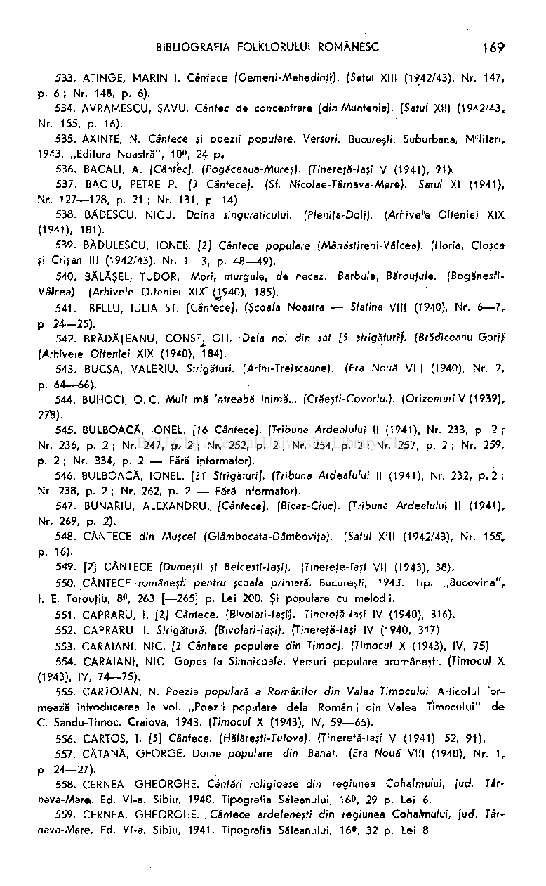

- 533. ATINGE, MARI N I. Cântece (Gemeni-Mehedinţ*) (Satul XIII (1942/43), Nr. 147,

p. 6 ; Nr. 148, p. 6).

- 534. AVRAMESCU , SAVU. Cântec de concentrare (din Muntenia) (Satul XIII (1942/43,

Nr. 155, p. 16).

- 535. AXINTE, N. Cântece si poezi i populare. Versuri. Bucureşti, Suburbana, Militari ,

1943. „Editura Noastră", 10«, 24 p .

- 536. BACALI, A. [Cântec], (Pogăceaua-Murej). (Tinerefă-/aşi V (1941), 91}.
- 537. BACIU, PETRE P. [3 CânfeceJ. (SI. NicoIae-lâmava-Mpre). Satul XI (1941),

Nr. 127—128, p. 21 ; Nr. 131, p. 14).

- 538. BĂDESCU, NICU . Doina singuraticului. (Pleniţa-Dolj). (Arhivele Olteniei XIX

(1941), 181).

- 539. BĂDULESCU, IONEÜ. [2] Cântece populare (Mânăstireni-Vâlcea). (Horia, Cloşca-

şi Crişan III (1942/43), Nr. 1—3, p. 48—49) .

- 540. BĂLĂŞEL, TUDOR. Mori , murgule, de necaz. Barbule, Bărbuţule. (Bogăneşfi-

Vâfcea). (Arhivele Olteniei XIX" (J.940), 185).

- 541 . BELLU, IULIA ST. [CânfeceJ. (Şcoala Noastră — Slatina VIII (1940), Nr. 6—7 ,

p. 24—25) .

- 542. BRĂDĂŢEANU, CONST. GH . Delà noi din sat [5 strigăfunlj. (Brădiceanu-Gorf)

(Arhivele Olteniei XIX (1940), "l84).

- 543. BUCŞA, VALERIU. Strigături. (Arfni-Treiscaune). (Era Nouă VIII (1940), Nr. 2,

p. 64—66) .

- 544. BUHOCI , O.C . Mult m ă 'ntreabă inimă... (Crăeşti-Covorlui). (Orizonturi V (1939),

2/8) .

- 545. BULBOACĂ , IONEL. [16 Cântece], (Tfibuna Ardealului II (1941), Nr. 233, p 2;

Nr. 236, p. 2 ; Nr. 247, p. 2 ; Nn. 252, p. 2 ; Nr. 254, p. 2 ; Nr. 257, p. 2 ; Nr. 259 , p. 2 ; Nr. 334, p. 2 — Fără informator).

- 546. BULBOACĂ, IONEL. [2 f SfrigăfuriJ. (Tribuna Ardealului || (1941), Nr. 232, p. 2 ;

Nr. 238, p. 2 ; Nr. 262, p. 2 — Fără informator).

- 547. BUNARIU, ALEXANDRU;., [Cântece], (Bicaz-Ciuc). (Tribuna Ardealului II (1941),

Nr. 269, p. 2).

- 548. CÂNTECE din Muscel (Glâmbocafa-Dâmbovifa). (Satul XIII (1942/43), Nr. 155L

p. 16).

- 549. [2] CÂNTECE (Dumeşfi şi Belcesti-laşi). (Tinereţe-Caşi VII (1943), 38),
- 550. CÂNTECE româneşti pentru şcoala primară. Bucureşti, 1943. Tip. .,Bucovina" ,

I. E. Toroufiii, 8°, 263 [—265] p. Lei 200. Şi populare cu melodii .

- 551. CAPRARU, I. [2J Cântece. (Bivolari-laşii). Tinerefă-Jaşi IV (1940), 316).
- 552. CAPRARU, I, Sfrigătură. (Bivolari-laşi). (Tinerefă-/aşi IV (1940, 317).
- 553. CARAIANI , NIC. [2 Cântece populare din TimocJ. (Timocul X (1943), IV, 75).
- 554. CARAIANI , NIC. Gopes la Simnicoala. Versuri populare aromâneşti. (Timocul X

(1943), IV, 74—75) .

- 555. CARTOJAN, N. Poezia populară a Românilor din Valea Jimocului. Articolul for­

mează introducerea la voi . „Poezi i populare delà Românii din Valea Timocului " d e C. Sandu-'Timoc. Craiova, 1943. (Timocul X (1943), IV, 59—65) .

- 556. CARTOS, 1. [5] Cântece. (Hălăreşfi-Tufovaj. (Tinerefă-laji V (1941), 52, 91).,
- 557. CÄTANÄ , GEORGE. Doine populare din Banat. (Era Nou ă VIII (1940), Nr. 1 ,

p 24—27) .

- 558. CERNEA, GHEORGHE . Cântări religioase din regiunea Cohalmului, jud. Târ-

nava-Mare. Ed. Vl-a. Sibiu, 1940. Tipografia Săteanului, 16°, 29 p. Lei 6.

- 559. CERNEA, GHEORGHE . Cântece ardeleneşti din regiunea Cohahnului, \ud. Târ-

nava-Mare. Ed. Vl-a. Sibiu, 1941. Tipografia Săteanului, 16», 32 p. Lei 8.

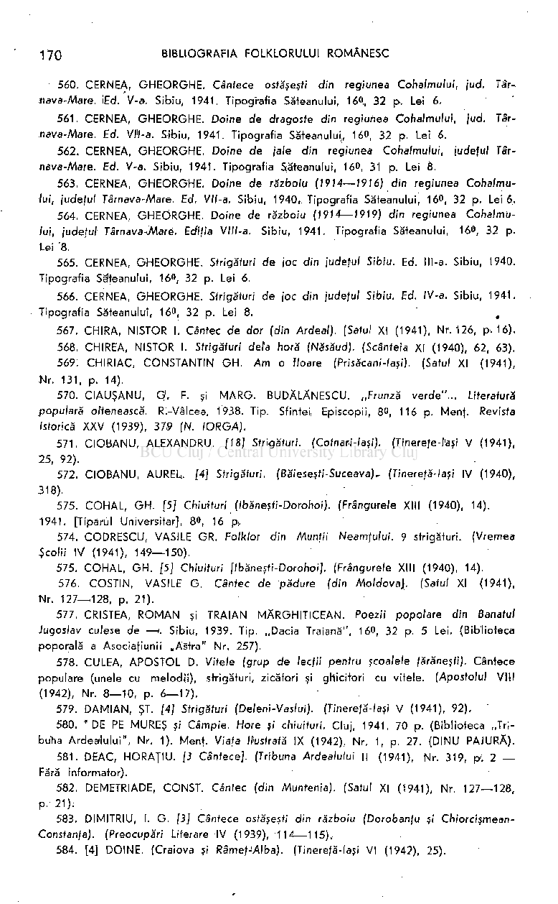

- 560. CERNEA, GHEORGHE . Cântece ostăşeşti din regiunea Cohalmului, jud. iâr-

nava-Mare. iEd. V-a . Sibiu, 1941 . Tipografia Săfeanului, 16», 32 p. Lei 6.

- 561 . CERNEA, GHEORGHE . Doine d e dragoste di n regiunea Cohalmului, jud. Târ-

nava-Mare. Ed Vl'l-a. Sibiu, 1941 . Tipografia Săteanului, 160, 32 p. Lei 6.

- 562 . CERNEA, GHEORGHE . Doine d e jale din regiunea Cohalmului, judeţul Târ-

nava-Mare. Ed. V-a. Sibiu, 1941 . Tipografia Săteanului, 16", 31 p. Lei 8.

- 563. CERNEA, GHEORGHE . Doine d e războiu ( 1914— (9)6 ) di n regiunea Cohalmu­

lui, judeţul Târnava-Mare. Ed. Vll-a. Sibiu, 1940 , Tipografia Săteanului, 160, 32 p. Lei 6.

- 564. CERNEA, GHEORGHE . Doine de războiu (1914—1919) din regiunea Cohalmu­

lui, judeţul ^ârnava^Mare. Ediţia Vlll-a. Sibiu, 1941 . Tipografia Săteanului, 16°, 32 p. Lei '8.

- 565. CERNEA, GHEORGHE . Strigături d e joc din judeţul Sibiu. Ed. Ill-a. Sibiu, 1940.

Tipografia Săteanului, 16°, 32 p. Lei 6.

- 566. CERNEA, GHEORGHE . Strigături d e joc di n judeţul Sibiu. Ed IV-a. Sibiu, 1941 .

Tipografia Săteanului, 16°, 32 p. Lei 8. ,

- 567. CHIRA, NISTOR I. Cântec d e do r (di n Ardeal). (Satul XI (1941), Nr. 126, p. 16).
- 568. CHIREA, NISTOR I. Strigături deta horă (Năsăud). (Scânteia XI (1940), 62, 63).
- 569. CHIRIAC, CONSTANTIN GH Am o lloare (Prisăcani-laşi). (Satul XI (1941),

Nr. 131, p. 14).

- 570. CIAUŞANU , G . F. şi MARG . BUDÄLÄNESCU. „Frunză verde".. . Literatură

populară oltenească. R.-Vâlcea, 1938. Tip. Sfintei Episcopii, 8», 116 p. Menf. Revista Istorică XX V (1939), 37 9 (N . /ORGA) .

- 571. CIOBANU , ALEXANDRU. [18 ] Strigături. (Cotnari-laşi). (Tinerefe-I'aş/ V (1941),

25, 92).

- 572. CIOBANU , AUREL. [4] Strigături. (Băieseşti-Suceava)^ (Tinereţă-laşi IV (1940),

318).

575. COHAL , GH . [5 ] Chiuituri (/băneşfi-Dorohoi). (Frângure/e XIII (1940), 14).

1941. [Tiparul Universitar], 80, 16 p.

- 574. CODRESCU, VASILE GR. Fo/k/or di n Munţii Neamţului. 9 strigături. (Vremea

Şcolii 1V (1941), 149—150).

- 575. COHAL , GH . [5 ] Chiuituri [/băneşfi-DorohoiJ. (Frângurele XIII (1940), 14).
- 576. COSTIN, VASILE G . Cântec d e pădure (din Moldova). (Satul XI (1941),

Nr. 127—128 , p. 2t) .

- 577. CRISTEA, ROMA N şi TRAIAN MÄRGHITICEAN . Poezii popolare din Banatul

Iugoslav culese de — 1 . Sibiu, 1939. Tip. „Dacia Traiană", 160, 32 p. 5 Lei. (Biblioteca poporală a Asociafiunii „Astra" Nr. 257).

578. CULEA, APOSTOL D. Vitele (grup de lecţii pentru şcoalele ţărăneşti). Cântece populare (unele cu melodii) , strigături, zicători şi ghicitori cu vitele. (Apostolul VIII

- (1942), Nr. 8—10 , p. 6—17).

- 579. DAMIAN , ŞT. [4] Strigături (De/eni-Vaslui). (Tinere?ă-/aşi V (1941), 92).
- 580. * DE PE MUREŞ şi Câmpie. Hore şi chiuituri. Cluj, 1941 . 70 p. (Biblioteca „Tri ­

buna Ardealului" , Nr. 1). Menf. Viaţa Ilustrată IX (1942), Nr. 1, p. 27. (DINU PAJURĂ).

- 581. DEAC, HORAŢIU. [3 Cântece]. (Tr/buna Ardealului || (1941), Nr. 319 2 —

Fără informator).

- 582. DEMETRIADE, CONST. Cântec (din Muntenia). (Satul XI (1941), Nr. 127—128,

p. 21).

- 583. DIMITRIU, I. G . [3J Cântece ostăşeşti din războiu (Dorobanţu şi Chiorc/şmean-

Consfanfa). (Preocupări Literare IV (1939), 114—115).

- 584. [4] DOINE. (Craiova şi Râmef-TUba). (Tinerefă-laşi VI (1942), 25).

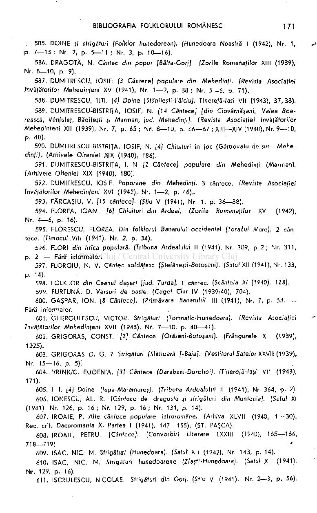

- 585. DOINE si strigături (Folklor hunedorean). (Hunedoara Noastră I (1942), Nr. 1 ,

p. 7—13 ; Nr. 2, p. 5—11 ; Nr. 3, p, 10—16).

- 586. DRAGOTĂ , N. Cântec di n popo r [Bâlta-GoriJ. (Zorile Romanafilor XIII (1939),

Nr. 8—10 , p. 9).

- 587. DUMITRESCU, IOSIF. [3 Cântece] populare di n Mehedinţi . (Revista Asociaţiei

învăţătorilor Mehedinţen i XV (1941), Nr. 1—2, p. 38 ; Nr. 5—6 , p. 71).

- 588. DUMITRESCU, TITI. [4] Doine [Sfănileşfi-Fălciu]. Tinerefă-lasi VII (1943), 37,38) .
- 589. DUMITRESCU-BISTRIŢA, IOSIF, N. [14 Cântece] [di n Ciovârnaşani, Valea Boe -

rească, Vân/ulef, Bădifeşfi şi Marman , jud . Mehedinţi] . (Revista Asociaţiei învăţătorilor Mehedinţen i XII (1939), Nr. 7, p. 65 ; Nr<. 8—10 , p. 66—6 7 ; XIII—XIV (1940), Nr. 9—10 , p. 40).

- 590. DUMITRESCU-BISTRIŢA, IOSIF, N. [4 ] Chiuituri în jo c (Gârbovafu-de-sus—Mehe ­

dinţi)., (Arhive/e Olteniei XIX (1940), 186).

- 591 . DUMITRESCU-BISTRIŢA, I. N. [2 Cântece] populare din Mehedinţ i (Marman).

(Arhivele Olteniei XIX (1940), 180).

- 592. DUMITRESCU, IOSIF. Poporane di n Mehedinţi . 3 cântece. (Revista Asociaţiei

- Învăţătorilor Mehedinţeni XVI (1942), Nr. 1—2, p. 46)..

- 593. FĂRCAŞIU, V. [15 cântece]. (Ştiu V (1941), Nr. 1, p. 36—38) .
- 594. FLOREA, IOAN . [6] Chiuituri di n Ardeal. (Zorile Romanaţitor XVI (1942), Nr. 4—6 , p. 16).
- 595. FLORESCU, FLOREA. Din folklorul Banatului occidental (Toracul Mare). 2 cântece. (Timocul VIII (1941), Nr. 2 , p. 34).
- 596. FLORI di n lirica populară. (Tribuna Ardealului II (1941), Nr. 309, p. 2 ; Nr. 311 , p. 2. — Fără informator.
- 597. FLOROIU, N. V. Cântec soldăţesc (Şfefănesti-Botosani). (Satul XII (1941), Nr. 133 p. 14).-
- 598. FOLKLOR di n Ceanul deşert [/ud. Turda]. 1 cântec. (Scânteia XI (1940), 128).
- 599. FURTUNĂ, D. Versuri d e oaste. (Cuget Clar IV (1939/40), 704) .
- 600. GAŞPAR, ION . [8 Cântece]. (Primăvara Banatului III (1941), Nr. 7, p. 33 . Fără informator.
- 601. GHERGULESCU, VICTOR. Strigături (Tomnatic-Hunedoara). (Revista Asociaţiei

- Învăţătorilor Mehedinţeni XVII (1943), Nr*. 7—10 , p. 40—41) .

- 602. GRIGORAŞ , CONST. [2 ] Cântece (Orăşeni-Bofosani). (Frângurele XII (1939),

1225).

- 603. GRIGORA Ş D. G . 7 Strigături (Slătioară [-Baia]. (Vestitorul Satelor XXVII (1939),

Nr. 15—16 , p. 5).

- 604. HRINIUC, EUGENIA. [3 ] Cântece (Darabani-Dorohoi) (Tinereţă-laşi VII (1943),

171).

- 605. I. I. [4 ] Doine (fapa-Maramures). (Tribuna Ardealului II (1941), Nr. 364, p. 2).
- 606. IONESCU, AL . R. [Cântece de dragoste şi strigături din Muntenia]. (Satul XI

- (1941), Nr. 126, p. 16 ; Nr. 129, p. 16 ; Nr. 131 , p.'14) .

- 607. IROAIE, P. Alte cântece populare istroromâne. (Arhiva XLVII (1940, 1—30).

Rec. crit. Dacoromania X, Partea I (1941), 147—155). (ŞT. PASCA).

- 608. IROAIE, PETRU. [Cântece]. (Convorbiri Liferare LXXIII (1940), 165—166 ,

718—719) . '

- 609. ISAC, NIC . M . Strigături (Hunedoara). (Satul XII (1942), Nr. 143, p. 14). 610; ISAC, NIC . M . Strigături hunedoarene (Zlasfi-Hunedoara). (Satul XI (1941),

Nr. 129, p. 16).

- 611. ISCRULESCU, NICOLAE. Strigături di n Gorj. (Ştiu V (1941), Nr. 2—3 , p. 56).

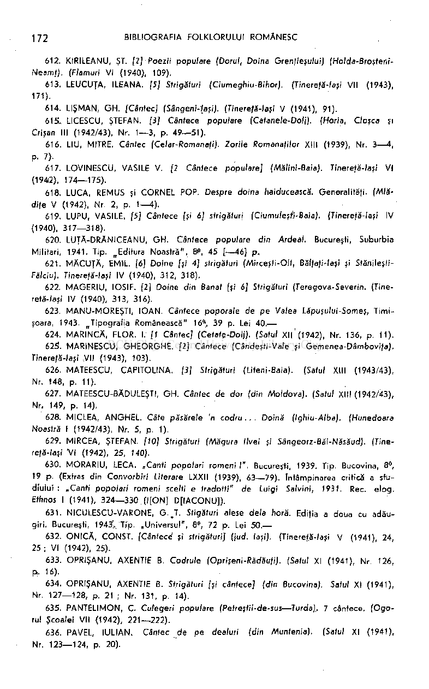

- 612. KIRILEANU, ŞT. [2] Poezii populare (Dorul, Doina Gren/ieşu/ui) (Holda-Broşteni-

Neamţ). (Flamuri VI (1940), 109).

- 613. LEUCUŢA, ILEANA. [5] Strigături (Ciumeghiu-Bihor). (Tinerefă-faşi VII (1943),

171).

- 614. LIŞMAN, GH [Cântec] (Sângeni-'lasi). (Tinerejă-laşi V (1941), 91).
- 615. LICESCU, ŞTEFAN. [3 ] Cânfece populare (Catanele-Dolj). (Horia, Cloşca şi

Crişan III (1942/43), Nr. 1—3, p. 49—51) .

- 616. LIU, MITRE. Cântec (Celar-Romanafi). Zorile Romanajilor XIII (1939), Nr. 3—4 ,

p. 7).

- 617. LOVINESCU, VASILE V. [2 Cântece populare] (Mălini-Baia). Tinereţă-laşi V I

(1942), 174—175).

- 618. LUCA, REMUS şi CORNEL POP. Despre doina haiducească. Generalităţi. (Mă-

dife V (1942), Nr. 2, p. 1—4).

- 619. LUPU, VASILE. [5 ] Cântece [şi 6] strigături (Ciumuleşt'i-Baia). (Tmereiă-laşi IV

- (1940), 317—318).

- 620. LUŢĂ-DRĂNICEANU, GH . Cânfece popu/are din Ardeal. Bucureşti, Suburbia

Militari, 1941 . Tip. „Editura Noastră", 8*, 45 [—46 ] p.

- 621. MÂCUŢÂ , EMIL. [6] Doine fşi 4] strigături (Mirceşfi-Olf, Băltafi-faşi şi Sfănileşti-

Fălciu). Tinere/ă-laşi IV (1940), 312, 318)

- 622. MAGERIU, IOSIF. [2] Doine din Banat [şi 6] Strigături (Teregova-Severin. (Tine-

retă-/aşi IV (1940), 313, 316)

- 623. MANU-MOREŞTI, IOAN . Cântece poporale de pe Valea Lăpuşului-Someş, Timi ­

şoara, 1943. „Tipografia Românească" 16Q, 39 p. Lei 40. —

- 624. MARINCÄ, FLOR. I. [1 Cântec] (Cefate-Dolj). (Safuf XII'(1942), Nr. 136, p. 11).
- 625. MARINESCU, GHEORGHE. [2] Cântece (Cândeşti-Vafe şi Gemenea-Dâmbovi/a) .

Tinere/ă-laşi VII (1943), 103).

- 626. MATEESCU, CAPITOUNA . [3] Strigături (Lifeni-Baia). (Satul XIII (1943/43),

- Nr. 148, p. 11).

627. MATEESCU-BÂDULEŞTI, GH . Cântec d e dor (din Moldova) . (Safuf XIII (1942/43),

- Nr. 149, p. 14).

- 628. MICLEA, ANGHEL. Câte păsărele 'n codru .. . Doină (Ighiu-Alba). (Hunedoara

Noastră I (1942/43), Nr. 5, p. 1).

- 629. MIRCEA, ŞTEFAN. [10] Strigături (Măgura llvei şi Sângeorz-Băi-Năsăud). (Tine-

reţă-/aşi V I (1942), 25, 140).

- 630. MORARIU, LECA. „Canfi popolari romeni I". Bucureşti, 1939. Tip. Bucovina, 8° ,

19 p. (Extras di n Convorbiri Literare LXXII (1939), 63—79) . întâmpinarea critică a studiului : „Canfj popolari romeni scelti e tradotti" de Luigi Salvini, 1931. Rec. elog . Efhnos I (1941), 324—33 0 (I[ON ] D[IACONU]) .

- 631 . NICULESCU-VARONE, G . J . Stigături alese delà horă. Ediţia a doua cu adău ­

giri. Bucureşti, 1943!., Tip. „Universul", 8°, 72 p. Lei 50. —

- 632. ONICĂ , CONST. [Cântece' şi strigături] (jud. laşi). (Tinerefă-laşi V (1941), 24 ,

25 ; VI (1942), 25).

- 633. OPRIŞANU, AXENTIE B. Codrule (Oprişeni-Rădăufi). (Satul XI (1941), Nr. 126,

p. 16).

- 634. OPRIŞANU, AXENTIE B. Strigături [şi cântece] (din Bucovina). Satul XI (1941),

Nr. 127—128, p. 21 ; Nr. 131 , p. 14).

- 635. PANTELIMON, C. Culegeri populare (Petreştii-de-sus—Turda), 7 cântece. (Ogo ­

rul Scoalei VII (1942), 221—222).

- 636. PAVEL, IULIAN . Cântec d e p e dealuri (din Muntenia). (Satul XI (1941),

Nr. 123—124, p. 20).

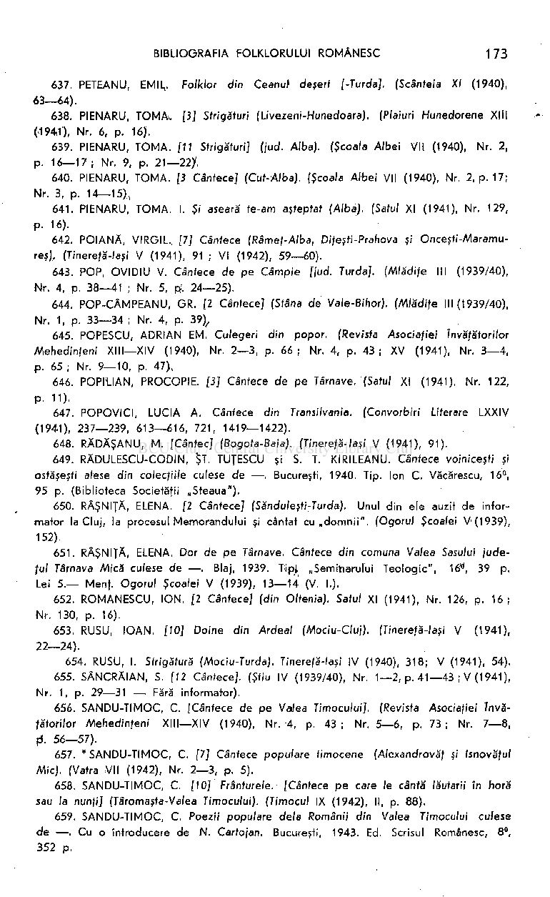

- 637. PETEANU, EMIL,. FoJklor di n Ceanut deşert [-Turda]. (Scânteia XI (1940),

63—64)

- 638. PIENARU, TOMA*. f3J Strigături (Livezeni-Hunedoara). (Plaiuri Hunedorene XIII

(1941), Nr. 6, p. 16).

- 639. PIENARU, TOMA . f11 Strigături] (jud . Alba). (Şcoala Albei VII (1940), Nr. 2,

p. 16—1 7 ; Nr. 9, p. 21—22)*.

- 640. PIENARU, TOMA . [3 Cântece] (Cut-Alba). (Şcoala Albe i VII (1940), Nr. 2, p. 17;

- Nr. 3, p. 14—15) ,

- 641. PIENARU, TOMA . I. Şi aseară te-am aşteptat (Alba). (Satul XI (1941), Nr. 129, p. 16).
- 642. POIANĂ , VIRGIL. [7] Cântece (Râmeţ-Alba, Diţeşti-Prahova şi Onceşti-Maramureş). (Tinereţă-laşi V (1941), 91 ; VI (1942), 59—60) .
- 643. POP, OVIDI U V. Cântece d e p e Câmpi e f/ud Turda]. (Mlădiţe III (1939/40),

- Nr. 4, p. 38—4 1 ; Nr. 5, pi. 24—25) .

- 644. POP-CÂMPEANU , GR. [2 Cântece] (Stâna de Vale-B/hor). (Mfădife III (1939/40),

Nr. 1, p. 33—3 4 ; Nr. 4, p. 39),,

- 645. POPESCU, ADRIAN EM Culegeri din popor. (Revista Asociaţiei Învăţătorilor

Mehedinfen i XIII—XIV (1940), Nr. 2—3 , p. 66 ; Nr. 4 , p. 43 ; XV (1941), Nr. 3—4 , p. 65 ; Nr. 9—10 , p. 47) .

- 646. POPILIAN, PROCOPIE. [3 ] Cântece d e p e Târnave. (Satul XI (1941), Nr. 122,

P 11)-

- 647. POPOVICI , LUCIA A . Cântece din Transilvania. (Convorbiri Literare LXXIV

(1941), 237—239 , 613—616 , 721 , 1419—1422).

- 648. RĂDĂŞANU , M . [Cântec] (Bogota-Baia). (Tinereţă-laşi V (1941), 91).
- 649. RĂDULESCU-CODIN, ŞT. TUŢESCU şi S. T. KIRILEANU. Cântece voiniceşti şi ostăşeşti alese din colecţiile culese de — . Bucureşti, 1940. Tip. Ion C. Văcărescu, 16°, 95 p. (Biblioteca Societăfii „Steaua").
- 650. RÂŞNIŢĂ, ELENA. [2 Cântece] (Sănduleşti-Turda). Unul din el e auzit d e informator la Cluj, la procesul Memorandulu i şi cântat cu „domnii" . (Ogorul Şcoalei V (1939), 152).
- 651 . RÂŞNIŢĂ, ELENA. Dor d e p e Târnave. Cântece din comuna Valea Sasului jude ţul Târnava Mică culese d e — . Blaj, 1939. TipJ „Seminarului Teologic" , 16' *, 39 p. Lei 5. — Menf. Ogoru l Şcoalei V (1939), 13—1 4 (V. I.).
- 652. ROMANESCU , ION . [2 Cântece] (din Oltenia). Satul XI (1941), Nr. 126, p. 16 ; Nr. 130, p. 16).
- 653. RUSU, IOAN . [10 ] Doine din Ardeal (Mociu-Cluj). (Tinereţă-laşi V (1941), 22—24) .

654. RUSU, I. Strigătură (Mociu-Turda). Tinereţă-laşi IV (1940), 318 ; V (1941), 54).

- 655. SÂNCRĂIAN , S. f12 Cântece]. (Ştiu IV (1939/40), Nr. 1—2, p. 41—4 3 ; V (1941), Nr. 1, p. 29—3 1 — Fără informator).
- 656. SANDU-TIMOC , C. [Cântece de p e Valea Timocului]. (Revista Asociaţiei Învăţătorilor Mehedinfeni XIII—XIV (1940), Nr. 4, p. 43 ; Nr. 5—6 , p. 73 ; Nr. 7—8 , c>. 56—57) .
- 657. * SANDU-TIMOC , C. [7 ] Cântece populare fimocen e (Alexandrovăţ şi Isnovăţul

Mic) . (Vatra VII (1942), Nr. 2—3 , p. 5).

- 658. SANDU-TIMOC , C. [10] Frânturele. [Cântece pe care le cântă lăutarii în horă

sau la nunţi] (Târomaşta-Valea Timocului). (Timocul IX (1942), II, p. 88) .

- 659. SANDU-TIMOC , C. Poezii populare delà Românii din Valea Timocului culese

de — . C u o înfroducere d e N . Carto/an. Bucureşti, 1943. Ed. Scrisul Românesc, 8°, 352 p.

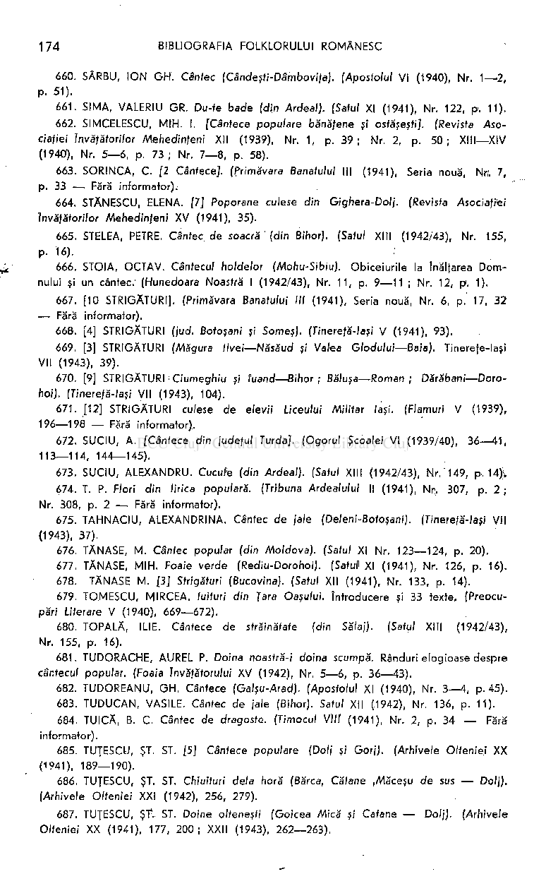

- 660. SÂRBU, IO N GH . Cânfec (Cândeşfi-Dâmbovifa). (Apostolul VI (1940), Nr. 1—2,

p. 51).

- 661. SIMA, VALERIU GR. Du-te bad e (din Ardeal). (Satul XI (1941), Nr. 122, p , 11).
- 662. SIMCELESCU, MIH . I. [Cântece populare bănăţene şi ostăşeşti], (Revista Aso­

ciaţiei Învăţătorilor Mehedinţeni XII (1939), Nr. 1, p. 39 ; Nr. 2, p. 50 ; XIII—XIV

- (1940), Nr. 5—6 , p. 73 ; Nr. 7—8 , p. 58).

- 663. SORINCA, C. [2 Cântece]. (Primăvara Banatului III (1941), Seria nouă, Nri 7,

p. 33 — Fără informator) i

- 664. STĂNESCU, ELENA. [7J Poporane culese din Gighera-Dolj. (Revista Asociaţiei

Învăţătorilor Mehedinţeni XV (1941), 35).

- 665. STELEA, PETRE. Cântec de soacră (din Bihor). (Satul XIII (1942/43), Nr. 155,

p. 16).

- 666. STOIA, OCTAV . Cântecul holdelor (Mohu-Sibiu). Obiceiurile la Inălfarea Dom ­

nului şi un cântec. (Hunedoara Noastră I (1942/43), Nr. 11 , p. 9—11 ; Nr. 12, p. 1).

- 667. [10 STRIGĂTURI]. (Primăvara Banatului III (1941), Seria nouă, Nr. 6, p. 17, 32

— Fără informator).

- 668. [4] STRIGĂTURI (jud. Botoşani şi Someş). (Tinerefă-laşi V (1941), 93).
- 669. [3] STRIGĂTURI (/Măgura llvei— Năsău d şi Valea Glodului—Baia). Tinere}e-laşi

VII (1943), 39).

- 670. [9] STRIGĂTURI • Ciumeghi u şi luând—Bihor ; Băluşa—Roman ; Darabani—Doro -

hoi). (Tinerefă-laşi VII (1943), 104).

- 671. [12] STRIGĂTURI culese de elevii Liceului Militar laşi. (Flamuri V (1939),

196—198 — Fără informator),

- 672. SUCIU, A. fCânfece din judeful Turda]. (Ogorul Şcoalei VI (1939/40), 36—41 ,

113—114, 144—145).

- 673. SUCIU, ALEXANDRU. Cucuie (din Ardeal). (Satul XIII (1942/43), Nr.'149 , p, 14)>
- 674. T. P. Flori din lirica populară. (Tribuna Ardealului II (1941), Nr. 307, p. 2 ;

Nr. 308, p. 2 — Fără informator).

- 675. TAHNACIU , ALEXANDRINA. Cânfec d e jale (Deleni-Botoşani). (Tinereţă-laşi VII

(1943), 37).

- 676. TĂNASE, M. Cânfec popular (din Moldova). (Satul XI Nr. 123—124, p. 20).
- 677. TĂNASE, MIH . Foaie verd e (Rediu-Dorohoi) (Satul XI (1941), Nr. 126, p. 16).
- 678. TĂNASE M. (3J Strigături (Bucovina). (Satul XII (1941), Nr. 133, p. 14).
- 679. TOMESCU , MIRCEA luiluri din Jara Oaşului. Introducere şi 33 texte, (Preocu­

pări Liferare V (1940), 669—672).

- 680. TO PALĂ, ILIE, Cântece de străinătate (din Sălaj). (Satul XIII (1942/43),

Nr. 155, p. 16).

- 681. TUDORACHE, AUREL P. Doina noasfră-i doina scumpă. Rânduri elogioase despre

cântecul popular. (Foaia Invăfăforului XV (1942), Nr. 5—6 , p. 36—43) .

- 682. TUDOREANU , GH . Cântece (Galşu-Arad). (Apostolul XI (1940), Nr. 3—4 , p. 45).
- 683. TUDUCAN , VASILE. Cântec de jale (Bihor). Satul XII (1942), Nr. 136, p. 11).
- 684. ŢUICĂ, B. C. Cânfec de dragoste. (Timocul Vllf (1941), Nr. 2, p, 34 — Fără

informator)

- 685. TUŢESCU, ŞT. ST. [5] Cântece popular e (Doi/ şi Gorj). (Arhivele Oltenie i XX

(1941), 189—190).

- 686. TUŢESCU, ŞT. ST. Chiuituri delà horă (Barca, Căfane ,Măceşu de sus — Dolj).

(Arhivele Olteniei XXI (1942), 256, 279).

- 687. TUŢESCU, ŞT>. ST. Doine olteneşti (Goicea Mic ă şi Catane — Dolj). (Arhivele

Olteniei XX (1941), 177, 200 ; XXII (1943), 262—263) .

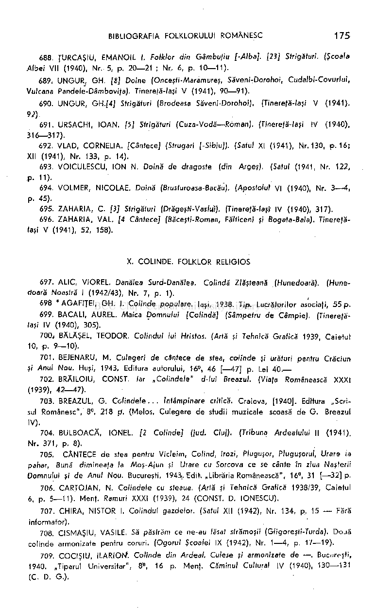

- 688. ŢURCAŞIU, EMANOI L I. Folklor din Gâmbufiu [-Alba], [23] Strigături. [Şcoala

Albei VII (1940), Nr. 5, p. 20—2 1 ; Nr, 6, p. 10—11) .

689; UNGUR , GH . [8] Doine (Onceşfi-Maramureş, Săveni-Dorohoi, Cudalbi-Covurlui , Vulcana Pandele-Dâmbovifa). Tinerefă-laşi V (1941), 90—91) .

- 690. UNGUR , GH.[4J Strigături (Brodeasa Săveni-Dorohoi). (Tinere/ă-laşi V (1941).

92).

- 691 . URSACHI, IOAN . [5] Strigături (Cuza-V odă—Roman). (Tinere/ă-laşi tV (1940),

316—317) .

- 692. VLAD , CORNELIA. [Cântece] (Strugari [-Sibiu]). (Satul XI (1941), Nr. 130, p. 16 ;

XII (1941), Nr. 133, p. 14).

- 693. VOICULESCU, ION N. Doină de dragoste (din Argeş) (Satul (1941, Nr. 122,

p. 11).

- 694. VOLMER, NICOLAE , Doină (Brusfuroasa-Bacău). (Apostoluf VI (1940), Nr. 3—4 ,

p. 45).

- 695. ZAHARIA, C. [3] Strigături (Drăgeşti-VaslUi). (Tinere/ă-laştf IV (1940), 317).
- 696. ZAHARIA, VAL . [4 Cântece] (Băceşti-Roman, Fălticeni şi Bogata-Baia) Tmerejă-

laşi V (1941), 52, 158).

X. COLINDE. FOLKLOR RELIGIOS

- 697. ALIC, VIOREL. Danălea Surd-Danălea. Colindă Ziăşteană (Hunedoara). (Hune­

doara Noastră I (1942/43), Nr. 7, p. 1).

- 698 * AGAFIJEI, GH . I. Colinde populare, laşi, 1938. Tip, Lucrătorilor as'ocia)i, 5 5 p.
- 699. BACALI, AUREL. Maica Domnului [Colindă] (Sâmpetru de Câmpie). (Tinerefă-

laşi IV (1940), 305).

- 700. BĂLĂŞEL, TEODOR. Colindul lui Hristos. (Artă şi Tehnică Grafică 1939, Caietu l

10, ,p. 9—10).

- 701. BEJENARU, M. Culegeri de cântece d e stea, colinde şi uraturi pentru Crăciun

şi Anul Nou. Huşi, 1943, Editura autorului, 161°, 46 [—47] p. Lei 40. —

- 702. BRĂILOIU, CONST. Iar „Colindele " d-fui Breazul. (Viaţa Românească XXXI

- (1939), 42—47) .

- 703. BREAZUL, G . Colindele.. . 'nfâmpinare critică. Craiova, [1940]. Editura „Scri ­

sul Românesc", 8°, 218 p. (Melos, Culegere d e studii muzicale scoasă d e G. Breazul IV).

- 704. BULBOACÄ , IONEL. [2 Colinde ] (jud. Cluj). (Tribuna Ardealului II (1941).

Nr . 371 , p. 8).

- 705. CÂNTECE de stea pentru Vicleim, Colind, Irozi, Pluguşor, Pluguşorul, Urare la

pahar, Bună dimineaţa la Moş-Aju n şi Urare cu Sorcova ce se cânte în ziua Naşterii Domnului şi de Anu l Nou . Bucureşti, 1943ţ. Edit. „Librăria Românească", 16°, 31 [—32 ] p.

- 706. CARTOJAN, N. Colindele cu steaua. (Artă şi Tehnică Grafică 1938/39, Caietul

6, . 5—11) . Menf. Ramuri XXXI (1939), 24 (CONST. D. IONESCU).

- 707. CHIRA, NISTOR I. Colindul gazdelor. (Satul XII (1942), Nr. 134, p. 15 — Fără

informator).

- 708. CISMAŞIU, VASILE. Să păstrăm ce ne-au lăsat strămoşii (Gligoreşfi-Turda). Dou ă

colinde armonizate pentru coruri. (Ogoru l Şcoalei IX (1942), Nr. 1—4, p. 17—19).

- 709. COCIŞIU , ILARION

. Colinde din Ardeal. Culese şi armonizate de — . Bucureşti,

1

1940. „Tiparul Universitar", 8°, 16 p. Menf. Căminul Cultural IV (1940), 130—13 1 (C. D. G.).

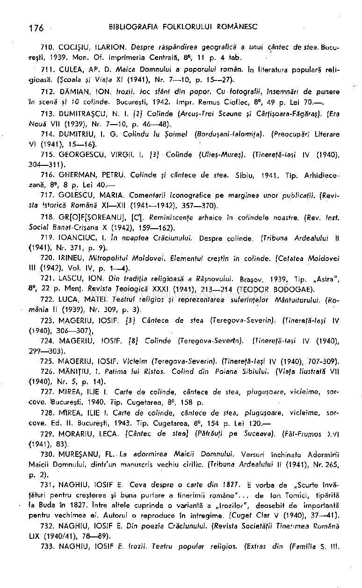

- 710. COCIŞIU, ILARION. Despre răspândirea geografică a unui cântec de stea. Bucu­

reşti, 1939. Mon . Of. Imprimeria Centrală, 8», 11 p. 4 tab.

- 711 . CULEA, AP. D. Maica Domnului a poporului român, tn literatura populară reli ­

gioasă. (Şcoala şi Viaţa XI (1941), Nr. 7—10 , p. 15—27).

- 712. DAMIAN , ION . /rozii. Joc sfânt din popor . Cu fotografii, însemnări de punere

î n scenă şi 10 colinde. Bucureşti, 1942. Impr. Remus Cioflec, 8°, 49 p. Lei 70.— .

- 713. DUMITRAŞCU, N. I. [2] Colinde (Arcuş-Jrei Scaune şi Cârf/şoara-Făgăraş). (Era

Nou ă VII (1939), Nr. 7—10 , p. 46—48) .

- 714. DUMITRIU, I. G. Co/indu Iu Şoimel (Borduşani-lalomiţa). (Preocupări Literare

- VI (1941), 15—16).

- 715. GEORGESCU , VIRGIL I. 13] Colinde (Ulieş-Mureş), (T/nerefă-/aşi IV (1940).

304—311)

- 716. GHERMAN , PETRU. Colinde şi cântece de stea. Sibiu, 1941,. Tip. Arhidiece -

zână, 8°, 8 p. Lei 40. —

- 717. GOLESCU , MARIA. Comentarii iconografice p e marginea unor pubficafii. (Revi­

sta 'storică Română Xf—XII (1941—1942), 357—370) .

- 718. GR[0]F[ŞOREANU] [C], Reminiscenţe arhaice in colindele noastre. (Rev. Inst.

Social Banaf-Crişana X (1942), 159—162).

- 719. IOANCIUC , I. în noaptea Crăciunului. Despre colinde (Tribuna Ardealului II

(1941), Nr. 371 , p. 9).

- 720. IRINEU, Mitropo/ifu / Moldovei. Elementul creştin in colinde. (Cetatea Moldovei

III (1942), Vol . IV, p. 1—4).

- 721 . LASCU, ION . D/n tradiţia religioasă a Râşnovului. Braşov, 1939, Tip. „Astra" ,

3°, 22 p. Menf. Revista Teologică XXXI (1941), 213—21 4 (TEODOR BODOGAE) .

- 722. LUCA, MATEI. Teatrul religios şi reprezentarea suferinţelor Mântuitorului. (Ro­

mânia II (1939), Nr. 309, p. 3).

- 723. MAGERIU , IOSIF. [3] Cântece de stea (Teregova-Sever/n). (Tineretă-faşi IV

<1940), 306—307) ,

- 724. MAGERIU , IOSIF. [8J Colinde (Teregova-Severtn). (Tinereţă-laşi IV (1940),

299-^303)

- 725. MAGERIU , IOSIF. Vicleim (Teregova-Severin). (T/nere/ă-/aşi IV (1940), 707-309).
- 726. MĂNITIU , l. Patima lui Ristos. Colind din Poiana Sibiului. (Viaţa Ilustrată VII

- <1940), Nr. 5, p. 14).

- 727. MIREA, ILIE I. Carte de colinde, cântece de stea, p/uguşoare, v/c/eime, sorcove. 'Bucureşti, 1940. Tip. Cugetarea, 8°, 158 p.
- 728. M'IREA, ILIE I. Carte de colinde, cântece de stea, p/uguşoare, vicleime, sorcove. Ed. II. Bucureşti, 1943. Tip. Cugetarea, 8°, 154 p. Lei 120. —
- 729. MORARIU , LECA. [Cântec de stea] (Pătrăufi pe Suceava). (Făf-Frumos >.vï

- <1941), 83).

- 730. MUREŞANU, FL. La adormirea Maicii Domnului. Versuri închinate Adormiri i

Maicii Domnului, dintr'un manuscris vechiu cirilic. (Tribuna Ardealului II (1941), Nr. 265, p. 2).

- 731 . NAGHIU , IOSIF E. Ceva despre o carte din 1827. E vorba d e „Scurte învă­

ţături pentru creşterea şi buna purtare a tinerimii române" . . . de Ion Tomici, tipărită la Buda în 1827. între altele cuprinde o variantă a „Irozilor" , deosebit de importantă pentru vechimea ei . Autorul o reproduce în întregime. (Cuget C/ar V (1940), 37—41) .

- 732. NAGHIU , IOSIF E. D/n poezia Crăciunului. (Revista Societăţii Tinerimea Română

LIX (1940/41), 78—89) .

- 733. NAGHIU , IOSIF E. Irozii. Teatru popular religios. (Extras din (Familia S. III.

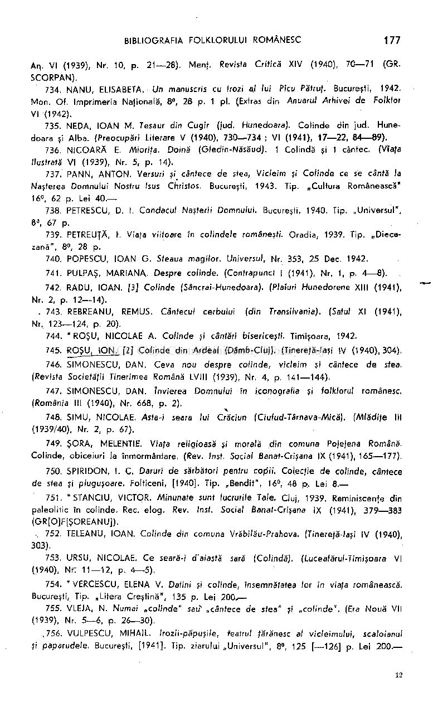

Ar). VI (1939), Nr. 10, p. 21—28) . Menţ. Revista Critică XIV (1940), 70—7 1 (GR. SCORPAN)

- 734. NANU , ELISABETA. Un manuscris cu (rozi a.1 lui P/cu Păfruţ. Bucureşti, 1942.

Mon . Of. Imprimeria Naţională, 8°, 28 p. 1 pl . (Extras din Anuarul Arhivei de Folklor

- VI (1942).

- 735. NEDA, IOA N M. Tesaur din Cugir (jud. Hunedoara). Colind e din jud . Hune­

doara şi Alba . (Preocupări Liferare V (1940), 730—734 ; VI (1941), 17—22 , 84—89) .

- 736. NICOAR Ă E. Mioriţa. Doină (G/edin-Năsăud). 1 Colindă şi 1 cântec. (Vïafa

Ilustrată VI (1939), Nr. 5, p. 14).

- 737. PANN , ANTON . Versuri şi cântece de stea, Vicleim şi Colinde ce se cântă la

Naşterea Domnului Nostru Isus Christos. Bucureşti, 1943. Tip. „Culfura Românească" 16», 62 p. Lei 40. —

- 738. PETRESCU, D. I. Condacul Naşterii Domnului. Bucureşti, 1940. Tip. „Universul" ,

8«, 67 p.

- 739. PETREUŢĂ, t. Viaţa viitoare în colindele româneşti. Oradia, 1939. Tip. „Diece ­

zană", 8°, 28 p.

- 740. POPESCU, IOA N G Steaua magilor. Universul, Nr. 353, 25 Dec. 1942.
- 741. PULPAŞ, MARIANA . Despre colinde. (Contrapunct I (1941), Nr. 1, p. 4—8) .
- 742. RADU, IOAN . [3] Colinde (Sâncrai-Hunedoara). (Plaiuri Hunedorene XIII (1941),

Nr. 2, p. 12—14).

. 743. REBREANU, REMUS. Cântecul cerbului (din Transilvania). (Satul XI (1941), N r 123—124, p. 20).

- 744. * ROŞU, NICOLAE A. Colinde şi cântări bisericeşti. Timişoara, 1942.
- 745. ROŞU, ION. . [2] Colind e din Ardea l (Dâmb-Cluj). (Tinerefă-laşi IV (1940), 304).
- 746. SIMONESCU , DAN . Ceva nou despre colinde , vicleim şi cântece d e stea.

(Revista Societăţii Tinerimea Română LVI11 (1939), Nr. 4, p. 141—144).

- 747. SIMONESCU , DAN . învierea Domnulu i în iconografia şi fo/klorul românesc.

(România III (1940), Nr. 668, p. 2).

- 748. SIMU , NICOLAE. Asfa-i seara lui Crăciun (Ciulud-Ternava-Mică). (Mlădiţe III

(1939/40), Nr. 2, p. 67).

- 749. ŞORA, MELENTIE. Viaţa religioasă şi morală din comuna Pojejena Română.

Colinde, obiceiuri la înmormântare (Rev. Inst. Social Banat-Crişana IX (1941), 165—177).

- 750. SPIRIDON, I. C. Daruri de sărbători pentru copii. Colecţie de colinde, cântece

de stea şi pluguşoare. Folticeni, [1940]. Tip. „Bendit" , 16°, 48 p. Lei 8. —

- 751. *STANCIU , VICTOR. Minunate sunt lucrurile Ta/e. Cluj, 1939. Reminiscenţe din paleolitic în colinde . Rec. elog . Rev. Inst. Social Banat-Crişana IX (1941), 379—38 3 (GR[0]F[ŞOREANU]) .
- 752. TELEANU, IOAN . Colinde din comuna Vrăbi/ăir-Prahova, (Tinerefă-laşi IV (1940), 303)
- 753. URSU, NICOLAE. Ce seară-i d'aiasfă sară (Colindă). (Luceaiărul-Timişoara VI

- (1940), Nr: 11—12 , p. 4—5) .

- 754. * VERCESCU, ELENA V. Dafini şi colinde, însemnătatea lor în viaţa românească. Bucureşti, Tip. „Litera Creştină", 135 p. Lei 200. —
- 755. VLEJA, N. Numai „colinde" sau" „cântece de stea" şi „colinde". (Era Nou ă VII

- (1939), Nr. 5—6 , p. 26—30) .

.756. VULPESCU, MIHAIL. /rozii-păpuşi/e teatrul ţărănesc al vicleimului, scaloianul şi paparudele. Bucureşti, [1941], Tip. ziarului „Universul" , 8°, 125 [—126] p. Lei 200. —

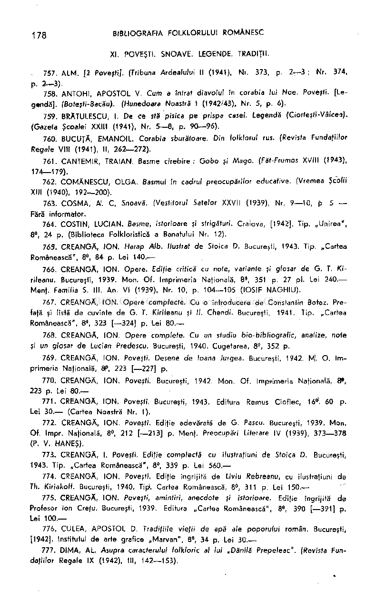

XI. POVEŞTI. SNOAVE. LEGENDE. TRADIŢII.

- 757. ALM . [2 Povesti,]. (Tribuna Ardealului II (1941), Nr. 373, p. 2— 3 ; Nr. 374,

p. 2-3) .

- 758. ANTOHI , APOSTOL V. Cum a intrat diavolul in corabia lui Noe . Povesti. [Le­

gendă] . (Bofeşfi-Bacău). (Hunedoara Noastră I (1942/43), Nr. 5, p. 6).

- 759. BRÄTULESCU, I. De ce stă pisica pe prispa casei. Legendă (Ciorfeşti-Vâlcea).

(Gazeta Şcoalei XXIII (1941), Nr. 5—8 , p. 90—96) .

- 760. BUCUŢÂ, EMANOIL . Corabia sburătoare. Din folklorul rus. (Revista Fundaţiilor

Regale VIII (t941), II, 262—272) .

- 761. CANTEMIR, TRAIAN. Basme cirebire : Gob o si Mago. (Făt-Frumos XVIII (1943),

174—179).

- 762. COMÄNESCU , OLGA . Basmul în cadrul preocupărilor educative. (Vremea Şcolii

- XIII (1940), 192—200).

- 763. COSMA , A'. C, Snoavă. (Vestitorul Satelor XXVII (1939), Nr. 9—10 , p 5 —

Fără informator.

- 764. COSTIN, LUCIAN . Basme, istorioare şi strigături. Craiova, [1942]. Tip. „Unirea" ,

8°, 24 p. (Biblioteca Folkloristică a Banatului Nr. 12).

- 765. CREANGĂ , ION . Harap Alb. Ilustrat de Stoica D. Bucureşti, 1943. Tip. „Cartea

Românească", 8°, 84 p. Lei 140. —

- 766. CREANGĂ , ION . Opere . Ediţie critică cu note, variante şi g/osar de G. T. Ki -

rileanu. Bucureşti, 1939. Mon . Of. Imprimeria Nafionalä, 8

, 351 p. 27 pl. Lei 240. Menf. Familia S. III. An . VI (1939), Nr. 10, p. 104—105 (IOSIF NAGHIU) .

9

- 767. CREANGĂ , ION . Oper e complecte. Cu o Introducere d e Constantin Botez. Pre-

faţă şi listă d e cuvinte de G. T. Kirileanu şi II. Chendi. Bucureşti, 1941. Tip. „Cartea Românească", 8°, 323 [—324] p. Lei 80. —

- 768. CREANGĂ, ION . Oper e complete. Cu un studiu bio-bibliografic, analize, note

şi un glosar de Lucian Predescu. Bucureşti, 1940. Cugetarea, 8°, 352 p.

- 769. CREANGĂ , ION . Poveşti. Desene de Ioana Jurgea. Bucureşti, 1942. Mi. O . Im ­

primeria Nafionalä, 81°, 223 [—227] p.

- 770. CREANGĂ, ION . Poveşti. Bucureşti, 1942. Mon . Of. Imprimeria Nafionalä, 8»,

223 p. Lei 80. —

- 771 . CREANGĂ, ION . Poveşti. Bucureşti, 1943. Editura Remus Cioflec, 16*. 60 p.

Lei 30. — (Cartea Noastră Nr. 1).

- 772. CREANGĂ , ION . Poveştii. Edifie adevărată d e G. Pascu. Bucureşti, 1939. Mon .

Of. Impr. Nafionalä, 8°, 212 [—213] p. Menf. Preocupări Liferare IV (1939), 373—37 8 (P. V. HANEŞ).

- 773. CREANGĂ , I. Poveşti. Ediţie complectă cu ilustraţiuni de Stoica D. Bucureşti,

1943. Tip. „Cartea Românească", 8°, 339 p. Lei 560. —

- 774. CREANGĂ, ION . Poveşti. Edifie îngrijită de Liviu Rebreanu, cu ilustrafiuni d e

Th. Kiriakoff. Bucureşti, 1940. Tipi, Cartea Românească, 8°, 311 p. Lei 150. —

- 775. CREANGĂ , ION . Povesti, amintiri, anecdote şi istorioare. Edifie îngrijită d e

Profesor Ion Creţu. Bucureşti, 1939. Editura „Cartea Românească", 8°, 390 [—391] p. Lei 100. —

- 776. CULEA, APOSTOL D. Tradiţiile vieţii de apă ale poporului român. Bucureşti,

[1942]. Institutul de arte grafice „Marvan" , 8°, 34 p. Lei 30. —

- 777. DIMA , AL. Asupra caracterului tolkloric al lui „Dănilă Prepeleac". (Revista Fun­

- daţiilor Regale IX (1942), III, 142—153).

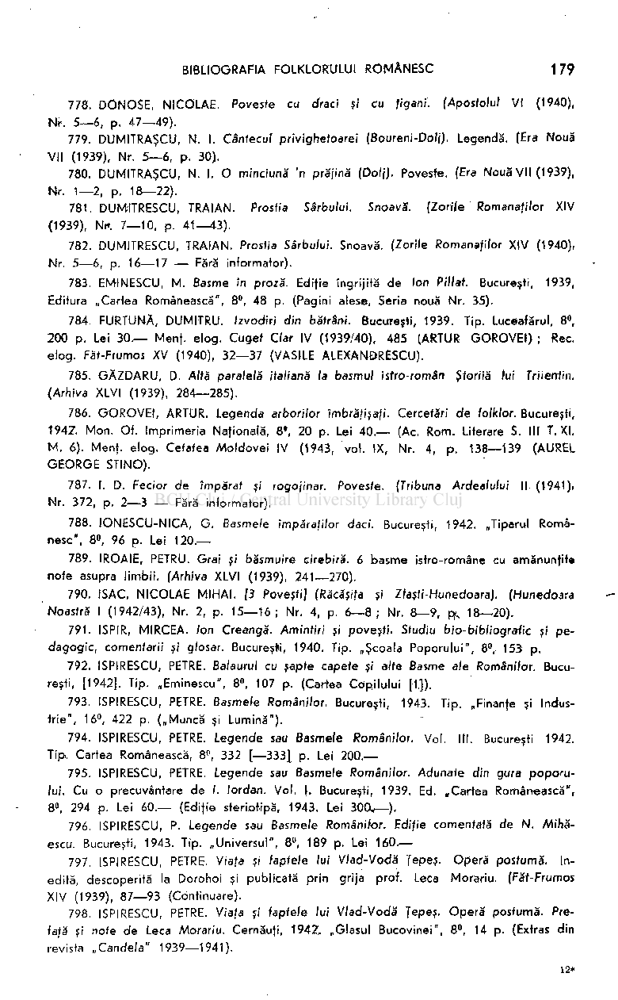

- 778. DONOSE , NICOLAE Poveste cu draci si cu ţigani. (Apostolul VI (1940),

Nr. 5—6 , p. 47—49) .

- 779. DUMITRAŞCU, N. I. Cântecul privighetoarei (Boureni-Dolj). Legendă. (Era Nouă

VII (1939), Nr. 5—6 , p. 30).

- 780. DUMITRAŞCU, N. I. O minciună n prăjină (Dolj). Poveste. (Era Nouă VII (1939),

Nr. 1—2, p. 18—22).

- 781. DUMITRESCU, TRAIAN. Prostia Sârbului. Snoavă. (Zori/e Romanafilor XIV

- (1939), Nn. 7—10, p. 41—43) .

- 782. DUMITRESCU, TRAIAN. Prostia Sârbului. Snoavă. (Zorile Romanafilor XIV (1940),

Nr. 5—6 , p. 16—17 — Fără informator).

- 783. EMINESCU, M. Basme în proză. Edifie îngrijită de Ion Pillât. Bucureşti, 1939,

Editura „Cartea Românească", 8°, 48 p. (Pagini alese, Seria nouă Nr. 35).

- 784. FURTUNĂ, DUMITRU. Izvodiri din bătrânii. Bucureşti, 1939. Tip. Luceafărul, 8°,

200 p. Lei 30. — Menf. elog. Cuget Clar IV (1939/40), 485 (ARTUR GOROVEI ) ; Rec. elog . Făf-Frumos XV (1940), 32—3 7 (VASILE ALEXANDRESCU).

- 785. GĂZDARU , D. Altă paralelă italiană la basmul istro-român Şforiiă fui Triierrfin.

(Arhiva XLVI (1939), 284—285) .

- 786. GOROVEI , ARTUR. Legenda arborilor Îmbrăţişaţi. Cercetări de folklor. Bucureşti,

1947. Mon . Of. Imprimeria Nafională, 8°, 20 p. Lei 40. — (Ac. Rom. Literare S. III T. XI. M . 6). Menf. elog . Cetatea Moldove i IV (1943, vol . IX, Nr. 4, p. 138—139 (AUREL GEORG E STINO).

- 787. f. D. Fecior de Împărat şi rogojinar. Poveste. (Tribuna Ardealului II (1941),

Nr. 372, p. 2— 3 — Fără informator).

- 788. IONESCU-NICA, G. Basmele Împăraţilor daci. Bucureşti, 1942. „Tiparul Româ­

nesc", 8», 96 p. Lei 120. —

- 789. IROAIE, PETRU. Grai şi băsmuire cirebiră. 6 basme istro-române cu amănunţita

note asupra limbii. (Arhiva XLVI (1939), 241—270).

- 790. ISAC, NICOLAE MIHAI . [1 Poveşti] (Răcăşiţa şi Zfaşti-HunedoaraJ. (Hunedoara

Noastră I (1942/43), Nr. 2, p. 15—16 ; Nr. 4, p. 6—8 ; Nr. 8—9 , p/, 18—20).

- 791. ISPIR, MIRCEA. Ion Creangă. Amintiri şi poveşti. Studiu bio-bibliografic şi pe ­

dagogic , comentarii şi glosar. Bucureşti, 1940. Tip. „Şcoala Poporului" , 8°, 153 p.

- 792. ISPIRESCU, PETRE. Balaurul cu şapte capete şi alte Basme ale Români/or. Bucu­

reşti, [1942]. Tip. „Eminescu", 8°, 107 p. (Cartea Copilulu i [1,]).

- 793. ISPIRESCU, PETRE. Basmele Românilor. Bucureşti, 1943. Tip. „Finanţe şi Indus­

trie" , 16°, 422 p. („Munc ă şi Lumină").

- 794. ISPIRESCU, PETRE. Legende sau Basmele Românilor. Vol. III. Bucureşti 1942.

Tip. Cartea Românească, 8°, 332 [—333 ] p. Lei 200. —

- 795. ISPIRESCU, PETRE. Legende sau Basmele Românilor. Adunate din gura poporu­

lui. Cu o precuvântare de I. Iordan. Voi . \. Bucureşti, 1939. Ed. „Cartea Românească", 8°, 294 p. Lei 60. — (Edifie steriotipă, 1943. Lei 300y—).

- 796. ISPIRESCU, P. Legende sau Basmele Românilor. Ediţie comentată de N. Mihă-

escu. Bucureşti, 1943. Tîp. „Universul" , 8», 189 p. Lei 160. —

- 797. ISPIRESCU, PETRE. Viaţa şi laptele lui Vlad-Vodă Jepeş. Operă postumă. In­

edită, descoperită la Dorohoi şi publicată prin grija prof. Leca Morariu. (Făt-Frumos XIV (1939), 87—9 3 (Continuare).

- 798. ISPIRESCU, PETRE. Viaţa şi faptele lui Vlad-Vod ă Tepeş. Oper ă postumă. Pre­

faţă şi note de Leca Morariu. Cernăuţi, 1942, „Glasul Bucovinei", 8°, 14 p. (Extras din revista „Candela " 1939—1941).

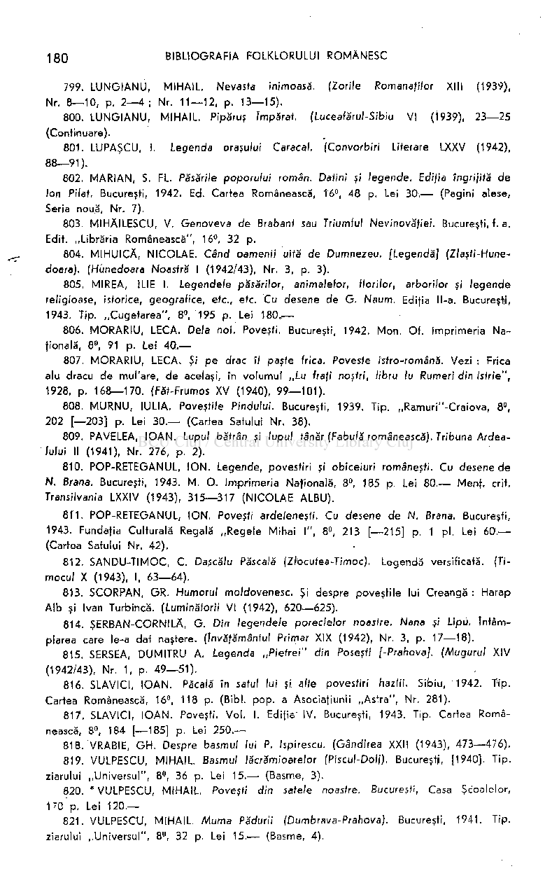

- 799. LUNGIANU , MIHAIL. Nevasta inimoasă. (Zorile Romanafilor XIII (1939),

Nr. 8—10 , p. 2—4 ; Nr. 11—12, p. 13—15).

- 800. LUNGIANU , MIHAIL. Pipăruş împărat. (Luceafărul-Sibiu VI (1939), 23—2 5

(Continuare).

- 801. LUPAŞCU, I. Legenda oraşului Caracal. (Convorbiri Literare LXXV (1942),

88—91) .

- 802. MARIAN , S. FL. Păsările poporului român. Datini şi legende. Edifia Îngrijită de

Ion Pilat. Bucureşti, 1942. Ed. Cartea Românească, 16°, 48 p. Lei 30. — (Pagini alese, Seria nouă, Nr. 7).

- 803. MIHĂILESCU, V. Genoveva de Brabanf sau Triumful Nevinovăţiei. Bucureşti, f. a.

Edit. „Librăria Românească", 16°, 32 p.

- 804. MIHUICĂ , NICOLAE. Când oamenii uită de Dumnezeu. [Legendă] (Zlaşfi-Hune-

doara). (Hunedoara Noastră I (1942/43), Nr. 3, p. 3).

- 805. MIREA, 1 LI E I. Legende/e păsărilor animalelor, florilor, arborilor şi legend e

religioase, istorice, geografice, etc., etc. Cu desene de G. Naum . Ediţia ll-a. Bucureştii,

1943. Tip. „Cugetarea" , 8°, 195 p. Lei 180^ -

- 806. MORARIU , LECA. Delà noi. Poveşti. Bucureşti, 1942. Mon . Of. Imprimeria Na fională, 8°, 91 p. Lei 40. —
- 807. MORARIU , LECA. Şi p e drac 11 paşte irica. Poveste isfro-română. Vezi : Frica aiu dracu d e mul'are, d e acelaşi, in volumu l „L u fraţi noştri, libru Iu Rumeri din Istrie", 1928, p. 168—170. (Făf-Frumos XV (1940), 99—101) .
- 808. MURNU , IULIA. Poveştile Pindului. Bucureşti, 1939. Tip. „Ramuri"-Craiova , 8°,

202 [—203] p. Lei 30. — (Cartea Satului Nr. 38).

- 809. PAVELEA, IOAN . Lupul bătrân şi lupul tânăr (Fabulă românească). Tribuna Ardea ­

lului II (1941), Nr. 276, p. 2).

- 810. POP-RETEGANUL, ION . Legende, povestiri şi obiceiuri româneşti. Cu desene de

N. Brana. Bucureşti, 1943. M. O. Imprimeria Nafională, 8°, 185 p. Lei 80. — Menf. crit. Transilvania LXXIV (1943), 315—31 7 (NICOLAE ALBU).

- 811 . POP-RETEGANUL, ION . Poveşti ardeleneşti. Cu desene de N. Brana. Bucureşti,

1943. Fundaţia Culturală Regală „Regel e Mihai I", 8°, 213 [—215] p. 1 pl . Lei 60. (Cartea Satului Nr. 42).

- 812. SANDU-TIMOC , C. Daşcălu Pascală (Zfocufea-Timoc). Legendă versificată. (Ti­

mocul X (1943), I, 63—64) .

- 813. SCORPAN, GR. Humorul moldovenesc. Şi despre poveştile lui Creangă : Harap

Al b şi Ivan Turbincă. (Luminătorii VI (1942), 620—625).

- 814. ŞERBAN-CORNILĂ, G. Din legendele poreclelor noastre. Nana şi Lipu. întâm ­

plarea care le-a dat naştere. (învăţământul Primar XIX (1942), Nr. 3, p. 17—18).

- 815. SERSEA, DUMITRU A. Legenda „Pietrei" din Poseşti [-Prahova]. (Mugurul XIV

(1942/43), Nr. 1, p. 49—51) .

- 816. SLAVICI, IOAN . Păcală in satul lui şi alte povestiri hazlii. Sibiu, 1942. Tip.

Cartea Românească, 16°, 118 p. (Bibi. pop . a Asociaţiunii „Astra" , Nr. 281).

- 817. SLAVICI, IOAN . Poveşti. Vol . I. Edifia IV. Bucureşti, 1943. Tip. Cartea Româ­

nească, 8°, 184 [—185] p. Lei 250. —

- 818. VRABIE, GH . Despre basmul lui P. Ispirescu. (Gândirea XXII (1943), 473—476) .
- 819. VULPESCU, MIHAIL. Basmul lăcrămioarelor (Piscul-Dolj). Bucureşti, [1940], Tip.

ziarului „Universul" , 8°, 36 p. Lei 15. — (Basme, 3).

- 820. 'VULPESCU , MIHAIL. Poveşti din satele noastre. Bucureşti, Casa Şc'oalelor,

17C p. Lei 120. —

- 821 . VULPESCU, MIHAIL. Muma Pădurii (Dumbrava-Prahova). Bucureşti, 1941. Tip.

ziarului „Universul" , 8°, 32 p. Lei 15..— (Basme, 4).

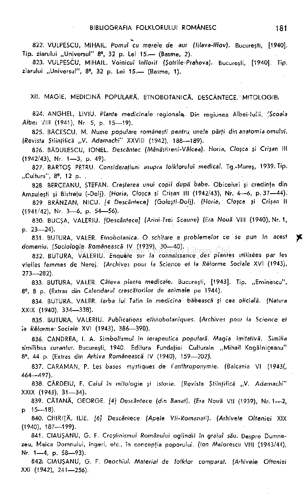

- 822. VULPESCU, MIHAIL. Pomul cu merele de aur (lilava-llfov). Bucureşti, [1940].

Tip. ziarului „Universul " 8°, 32 p. Lei 15. — (Basme, 2).

- 823. VULPESCU, MIHAIL. Voinicul înflorit (Şofrile-Prahova). Bucureşti, [1940]. Tip.

ziarului „Universul" , 8°, 32 p. Lei 15. — (Basme, 1).

XII. MAGIE . MEDICINĂ POPULARĂ. ETNOBOTANICĂ. DESCÂNTECE. MITOLOGIE .

- 824. ANGHEL , LIVIU. Plante medicinale regionale^. Din regiunea Albei-luÜi. (Şcoala

Albe/ VIII (1941), Nr. 5, p. 15—19).

- 825. BĂCESCU, M. Num e populare româneşti pentru unele părţi din anatomia omului.

(Revista Ştiinţifică „V . Adamachi " XXVIII (1942), 188—189).

- 826. BĂDULESCU, IONEL. Descântec (/Wânăsfireni-Vâlcea). Horia, Cloşca şi Crişan III

(1942/43), Nr. 1—3, p. 49).

- 827. BARTOŞ PETRU. Considerafiuni asupra folklorului medical. Tg.-Mureş, 1939. Tip.

„Cultura" , 8°, 12 p. ,

- 828. BERCEANU, ŞTEFAN. Creşterea unui copil dup ă babe. Obiceiur i şi credinţe din

Amzuleşti şi Bistrelu (-Dolj). (Horia, Cloşca şi Crişan III (1942/43), Nr. 4—6 , p. 37—44) .

- 829. BRÂNZAN , NICU . [4 Descântece] (Gofeşfi-DoljJ. (Horia, Cloşca şi Crişan II

- (1941/42), Nr. 3—6 , p. 54—56) .

- 830. BUCŞA, VALERIU. [Descântece] (Arini-Trei Scaune) (Era Nou ă VIII (1940), Nr. 1,

p. 23—24) .

- 831 . BUTURA, VALER. Efnobofanica. O schiţare a problemelo r ce se pun în acest

domeniu. (Sociologie Românească IV (1939), 30—40) .

- 832. BUTURA, VALERIU. Enquête sur la connaissance des plantes utilisées par les

vielles femmes de Nerej. (Archives pour la Science et la Réforme Sociale XVI (1943), 273—282)

- 833. BUTURA, VALER. Câteva plante medicale. Bucureşti, [1943]. Tip. „Eminescu" ,

8°, 8 p. (Extras din Calendarul crescătorilor de animale pe 1944).

- 834. BUTURA, VALER. Iarba lui Jatin în medicina băbească şi cea oficială. {Natura

XXIX (1940), 334—338) .

- 835 . BUTURA, VALERIU. Publications ethnobotaniques. (Archives pour la Science et

\a Réforme-Sociale XVI (1943), 386—390) .

- 836. CANDREA, I. A. Simbolismul în terapeutica populară. Magia imitativă. Similia

simifibus curanfur. Bucureşti, 1940. Editura Fundaţiei Culturale „Mihai l Kogălniceanu " 8°, 44 p. (Extras din Arhiva Românească IV (1940), 159—202).

- 837. CARAMAN , P. Les bases mystiques de l'anthroponymie. (ßalcania VI (1943(,

464—497)

- 838. CÂRDEIU, F. Calul în mitologie şi istorie. (Revista Ştiinţifică „V. Adamachi"

XXIX (1943), 31—34) .

- 839. CĂTANĂ , GEORGE. [4] Descântece (din Banat). (Era Nouă VII (1939), Nr. 1—2,

p 15—18).

- 840. CHIRIŢĂ, ILIE. [6J Descântece (Apele Vii-Romanati). (Arhivele Oltenie i XIX

(1940), 187—199).

- 841 . CIAUŞANU , G. F. Creştinismul Românului oglindi t în graiul său. Despre Dumne­

zeu, Maica Domnului, îngeri, etc., în concepţia poporului . (Ion Maiorescu VIII (1943/44), Nr. 1—4, p. 58—93) .

- 842). CIAUŞANU , G. F. Deochiul. Material de folklor comparat. (Arhivele Olteniei

XXI (1942), 241—256).

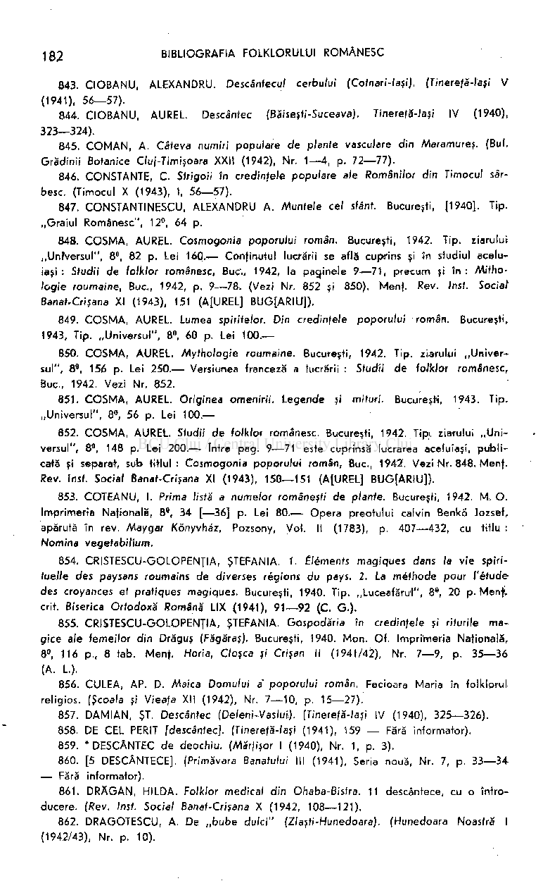

- 843. CIOBANU , ALEXANDRU. Descântecul cerbului (Cotnari-laşi). (Tinereţă-laşi V

(1941), 56—57) .

- 844. CIOBANU , AUREL. Descântec (Băiseşti-Suceava). Tinereţă-lasi IV (1940),

323—324) .

- 845. COMAN , A. Câteva numiri populare de plante vasculare din Maramureş. (Bul.

Grădinii Botanice Cluj-Timişoara XXII (1942), Nr. 1—4, p. 72—77) .

- 846. CONSTANTE, C. Strigoii în credinţele populare ale Românilor din Timocul sâr­

besc. (Timocul X (1943), I, 56—57) .

- 847. CONSTANTINESCU, ALEXANDRU A. Muntel e cel sfânt. Bucureşti, {1940]. Tip.

„Graiu l Românesc", 12°, 64 p.

- 848. COSMA , AUREL. Cosmogonia poporuiu i român. Bucureşti, 1942. Tip. ziarului

„Unfversul" , 8°, 82 p. Lei 160. — Conţinutul lucrării se affă cuprins şi în studiul acelu iaşi : Studii de folklor românesc, Buc'., 1942, la paginele 9—71 , precum şi în : Mifho fogie roumaine, Buc , 1942, p. 9—78 . (Vezi Nr. 852 şi 850). Menf. Rev. Jnsf. Sociaf BanaUCrişana XI (1943), 151 (A[UREL] BUGfARIU]).

- 849. COSMA , AUREL. Lumea spiritelor. Din credinţele poporulu i român. Bucureşti,

1943, Tip. „Universul" , 8°, 60 p. Lei 100. —

- 850. COSMA , AUREL. Mythologi e roumaine. Bucureşti, 1942. Tip. ziarului „Univer ­

sul", 8°, 156 p. Lei 250. — Versiunea franceză a lucrării : Studii de foJkfor românesc. Buc , 1942. Vezi Nr. 852.

- 851 . COSMA , AUREL. Originea omenirii . Legende şi mituri. Bucureşti, 1943. Tip.

„Universul" , 8°, 56 p. Lei 100. —

- 852. COSMA , AUREL. Studii de folklor românesc. Bucureşti, 1942. Tip. ziarului „Uni ­

versul", 8°, 148 p. Lei 200. — fntre pag. 9—71 este cuprinsă lucrarea aceluiaşi, publi cată şi separat, sub titlul : Cosmogonia poporulu i român, Buc , 1942. Vezi Nr. 848. Menf. Rev. Inst. Social Banat-Crişana XI (1943), 150—151 (AfUREL] BUGfARIU]).

- 853. COTEANU , I. Prima listă a numelor româneşti de plante. Bucureşti, 1942. M. O .

Imprimeria Nafională, 8", 34 [—36] p. Lei 80. — Oper a preotului calvin Benkö Jozsef, apărută în rev. Maygar Könyvhäz, Pozsony, Vol . II (1783), p. 407—432 , cu titlu : Nomina vegefabilium .

- 854. CRISTESCU-GOLOPENŢIA, ŞTEFANIA. 1. Éléments magiques dans la vie spiri­

tuelle des paysans roumains de diverses régions du pays. 2. La méthod e pour l'étude des croyances et pratiques magiques. Bucureşti, 1940. Tip. „Luceafărul" , 8

, 20 p. Ment i crit. Biserica Ortodoxă Română LIX (1941), 91—9 2 (C. G.).

8

855. CRISTESCU-GOLOPENŢIA, ŞTEFANIA. Gospodăria în credinţele şi riturile magice ale femeilor din Drăguş (Făgăraş). Bucureşti, 1940. Mon . Of. Imprimeria Nafională, 8°, 116 p., 8 fab. Menf. Horia, Cloşca şi Crişan II (1941/42), Nr. 7—9 , p. 35—3 6 (A. L) .

- 856. CULEA, AP. D. Maica Domului a' poporului român. Fecioara Maria în folklorul

religios. (Şcoala şi Vieaţa XII (1942), Nr. 7—10 , p. 15—27).

- 857. DAMIAN , ŞT. Descântec (Deleni-Vaslui). (Tinerefă-laşi IV (1940), 325—326) .
- 858. DE CEL PERIT [descântec]. (Tinerefă-laşi (1941), 159 — Fără informator).
- 859. "DESCÂNTE C de deochiu. (Mărfişor I (1940), Nr. 1, p. 3).
- 860. [5 DESCÂNTECE]. (Primăvara Banatului III (1941), Seria nouă, Nr. 7, p. 33—3 4

— Fără informator).

- 861. DRÄGAN , HILDA. Folklor medical din Ohaba-Bisfra. 11 descântece, cu o Intro­

ducere. (Rev. Inst. Social Banat-Crişana X (1942, 108—121).

- 862. DRAGOTESCU, A. De „bub e dulci " (Zlaşfi-Hunedoara). (Hunedoara Noastră I

(1942/43), Nr. p. 10).

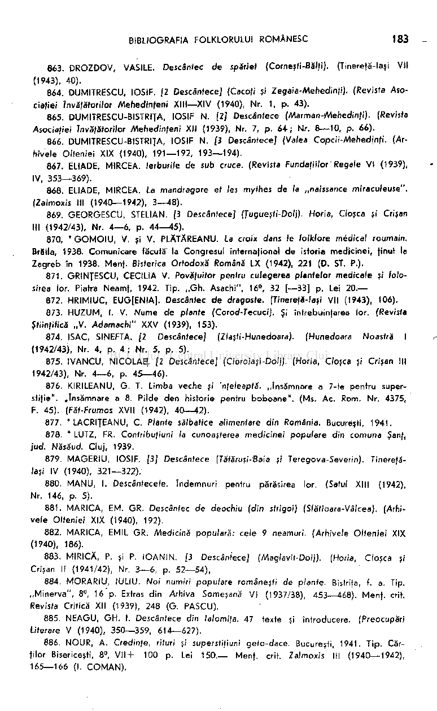

663. DROZDOV , VASILE. Descântec de spartet (Corneşfi-Bălţi). (Tinereţă-laşi VII

(1943), 40).

- 864. DUMITRESCU, IOSIF. [2 Descântece] (Cacoti şi Zegaia-Mehedinfi). (Revista Asociaţiei învăţătorilor Mehedfnfen i XIII—XI V (1940), Nr. 1, p. 43).
- 865. DUMITRESCU-BISTRIŢA, IOSIF N. [2J Descântece (Marman-jMehedinfi) (Revista Asociaţiei Învăţătorilor Mehedinţeni XII (1939), Nr. 7, p. 64 ; Nr. 8—10 , p. 66).

- 666. DUMITRESCU-BISTRITA, IOSIF N. [3 Descântece] (Valea Copcii-Mehedinfi . (Arhivele Olteniei XIX (1940), 191—192, 193—194).
- 667. ELIADE, MIRCEA. Ierburi/e de sub cruce. (Revista Fundaţiilor Regale V I (1939), IV, 353—369) .

- 868. ELIADE, MIRCEA. La mandragore et Ies myihes de la „naissance miraculeuse".

(Zalmoxis III (1940—1942), 3—48) .

- 869. GEORGESCU, STELIAN. [3 Descântece] (fugueşfi-Dolj). Horia, Cloşca şi Crişan

III (1942/43), Nr. 4—6 , p. 44—45) .

- 870. *GOMOIU , V. şi V. PLĂTÂREANU. La croix dans le folklore médical roumain.

Brăila, 1938. Comunicare făcută la Congresul international d e istoria medicinei , ţinut la Zagreb în 1938. Menf. Bis/erica Ortodox ă Română LX (1942), 221 (D. ST. P.).

- 871 . GRINŢESCU, CECILIA V. Povă/uifor pentru culegerea plantelor medicale şi folo­

sirea lor. Piatra Neamf, 1942. Tip. „Gh . Asachi", 16», 32 [—33] p. Lei 20. —

- 872. HR1MIUC, EUGfENIA]. Descântec d e dragoste. (Tinerefă-lasi VII (1943), 106).
- 873. HUZUM , I. V. Nume de plante (Corod-Tecuc/). Şi întrebuinţarea lor. (Revista

Ş/iinfi/ică „V . Adamachi " XXV (1939), 153).

- 874. ISAC, SINEFTA. [2 Descântece] (Zlaşti-Hunedoara). (Hunedoara Noastră I

(1942/43), Nr. 4, p. 4 ; Nr. 5, p. 5).

- 875. IVANCU , NICOLAE(. [2 Descântece] (Cioroiaşi-Dolj). (Horia, Cloşca şi Crişan III

1942/43), Nr. 4—6 , p. 45—46) .

- 876. KIRILEANU, G. T. Limba veche si 'nţeleaptă. „însemnare a 7-te pentru super­

stiţie", „însemnare a 8. Pilde de n historié pentru boboane" . (Ms. Ac. Rom. Nr. 4375, F. 45). (Făf-Frumos XVII (1942), 40—42) .

- 877. * LACRIŢEANU, C. Plante sălbatice alimentare din România. Bucureşti, 1941.
- 878. * LUTZ, FR. Confribu/iuni la cunoaşterea medicinei populare din comuna Şanţ,

jud. Năsăud. Cluj, 1939.

- 879. MAGERIU , IOSIF. [JJ Descântece (Tăfăruşi-Baia şi Teregova-Severin). Tinerefă-

laşi IV (1940), 321—322) .

- 880. MANU , I. Descântecele. îndemnuri pentru părăsirea lor. (Satul XIII (1942),

Nr. 146, p. 5).

- 881 . MARICA, EM. GR. Descântec de deochiu (din strigoi) (Slătioara-Vâlcea). (Arhi­

vele Olteniei XIX (1940), 192).

- 882. MARICA, EMIL GR. Medicin ă populară: cele 9 neamuri. (Arhivele Oltenie i XIX

(1940), 186).

- 883. MIRICÄ, P. şi P. IOANIN . [3 Descântece] (Maglavif-Dolj). (Horia, Cloşca şi

Crişan II (1941/42), Nr. 3—6 , p. 52—54) ,

- 884. MORARIU , IULIU. No i numiri populare româneşti de plante. Bistriţa, f. a. Tip.

„Minerva" , 8°, 16 p. Extras din Arhiva Someşană VI (1937/38), 453—468). Menţ . crit. Revista Critică XII (1939), 248 (G . PASCU).

885. NEAGU , GH . I. Descântece din Ialomiţa. 47 texte şi Introducere. (Preocupări Literare V (1940), 350—359 , 614—627).

686. NOUR, A. Credinţe, rituri şi superstiţiuni geto-dace . Bucureşti, 1941. Tip. Cărţilor Bisericeşti, 8°, VII + 100 p. Lei 150. — Menţ. crit. Zalmoxis III (1940—1942), 165—166 (I. COMAN) .

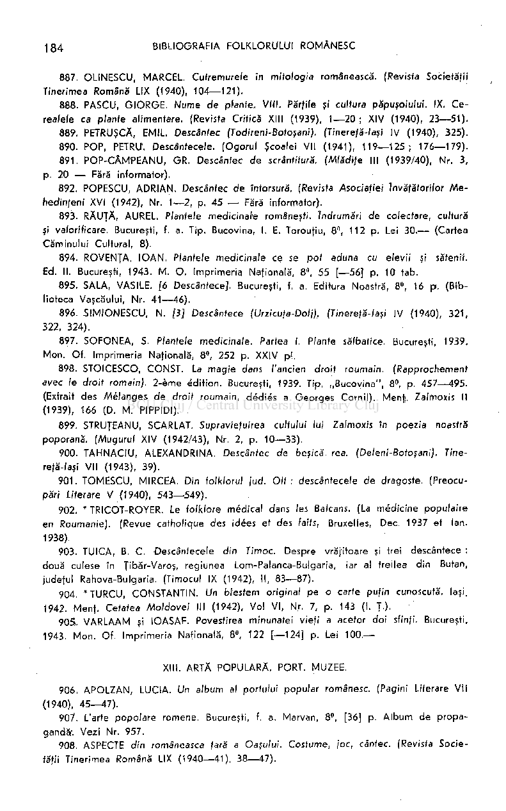

- 887. OLINESCU, MARCEL. Cutremurele în mitologia românească. (Revista Societăţii

Tinerimea Română LIX (1940), 104—121).

- 888. PASCU, GIORGE . Num e d e pfante. VIII. Părţile şi cultura păpuşoiului. IX. Ce ­

rea/ele ca plante alimentare. (Revista Critică XIII (1939), 1—20 ; XIV (1940), 23—51) .

- 889. PETRUŞCĂ, EMIL. Descântec (Todireni-Botoşani). (Tinereţă-laşi IV (1940), 325).
- 890. POP, PETRU. Descântecele. (Ogoru l Şcoalei VII (1941), 119—125 ; 176—179).
- 891. POP-CÂMPEANU , GR. Descântec d e scrântitură. {Mlădiţe III (1939/40), Nr. 3,

p. 20 — Fără informator).

- 892. POPESCU, ADRIAN . Descântec de întorsură. (Revista Asociaţiei învăţătorilor Me -

fiedinţeni XVI (1942), Nr. 1—2, p. 45 — Fără informator).

- 893. RĂUŢÂ, AUREL. Plantele medicinale româneşti. îndrumări de colectare, cultură

şi valorificare. Bucureşti, f. a. Tip. Bucovina, I. E. Toroufiu, 8°, 112 p. Lei 30. — (Cartea Căminului Cultural, 8).

- 894. ROVENŢA, IOAN Plantele medicinale ce se pot aduna cu elevii şi sătenii.

Ed. II. Bucureşti, 1943. M. O . Imprimeria Nafionalä, 8°, 55 [—56] p. 10 tab.

- 895. SALA, VASILE. [6 Descântece]. Bucureşti, f. a. Editura Noastră, 8°, 16 p. (Bib­

lioteca Vaşcăului, Nr. 41—46) .

- 896. 5IMIONESCU , N. [3] Descântece (Urzicuţa-Dolj), (Tinereţă-laşi IV (1940), 321 ,

322, 324).

- 897. SOFONEA, S. Plantele medicinale. Partea I. Plante sălbatice. Bucureşti, 1939.

Mon . Of. Imprimeria Nafionalä, 8°, 252 p. XXIV pl .

- 898. STOICESCO, CONST. La magi e dans l'ancien droit roumain. (Rapprochement

avec le droit romain). 2-ème édition. Bucureşti, 1939. Tip. „Bucovina" , 8°, p. 457—495 . (Extrait des Mélange s de droit roumain, dédiés a George s Cornii). Menti. Zalmoxis II

- (1939), 166 (D. M. PIPPIDI).

- 899. STRUJEANU, SCARLAT. Supravieţuirea cultului lui Zalmoxis în poezia noastră

poporană. (Mugurul XIV (1942/43), Nr. 2, p. 10—33).

- 900. TAHNACIU , ALEXANDRINA. Descântec de beşică rea. (Deleni-Botoşani). Tine­

reţă-laşi VII (1943), 39).

- 901 . TOMESCU , MIRCEA. Din folklorul jud. Olt: descântecele de dragoste. (Preocu­

pări Literare V (1940), 543—549) .

- 902. * TRICOT-ROYER. Le folklore médical dans les Balcans. (La médicine populaire

en Roumanie). (Revue catholique des idées et des faits, Bruxelles, Dec. 1937 et lan. 1938).

- 903. TUICA, B. C. Descântecele din Timoc. Despre vrăjitoare şi trei descântece :

două culese în Ţibăr-Varoş, regiunea Lom-Palanca-Bulgaria, iar al treilea din Butan, judeful Rahova-Bulgaria. (Timocul IX (1942), II, 83—87) .

- 904. *TURCU , CONSTANTIN . Un blestem original pe o carte puţin cunoscută, laşi.

1942. Menf. Cetatea Moldovei III (1942), Vol VI, Nr. 7, p. 143 (I. T.).

903. VARLAA M şi IOASAF. Povestirea minunatei vieţi a acefor doi sfinţi. Bucureşti,

1943. Mon . Of. Imprimeria Naţională, 8°, 122 [—124] p. Lei 100. —

XIII. ARTĂ POPULARĂ. PORT. MUZEE.

- 906. APOLZAN , LUCIA. Un album al portului popular românesc. (Pagini Liferare VII

(1940), 45—47) .

- 907. L'arfe popolar e romene. Bucureşti, f. a. Marvan, 8°, [36] p. Albu m d e propa ­

gandă". Vezi Nr. 957.

- 908. ASPECTE din româneasca ţară a Oaşului. Costume, joc, cântec. (Revista Socie­

tăţii Tinerimea Română LIX (1940—41), 38—47) .

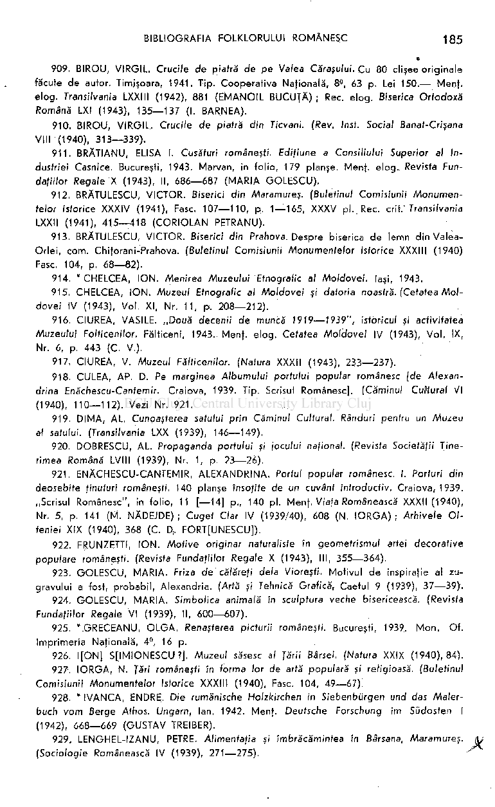

- 909. BIROU, VIRGIL. Crucile de piatră d e pe Valea Carasului. Cu 80 clişee originale

făcute de autor. Timişoara, 1941. Tip. Cooperativa Nafionalä, 8°, 63 p. Lei 150. — Menf. elog . Transilvania LXXIII (1942), 881 (EMANOI L BUCUŢĂ) ; Rec. elog . Biserica Ortodox ă Română LXI (1943), 135—137 (I. BARNEA).

- 910. BIROU, VIRGIL. Crucile de piatră din Ticvani. (Rev. Insf. Social Banat-Crişana

VIII (1940), 313—339) .

- 911 . BRĂTIANU, ELISA I. Cusături româneşti. Ediţiune a Consiliului Superior al In­

dustriei Casnice. Bucureşti, 1943. Marvan, in folio, 179 planşe. Menf. elog . Revista Fun­

- daţiilor Regale X (1943), II, 686—68 7 (MARIA GOLESCU).

- 912. BRĂTULESCU, VICTOR. Biserici din Maramureş. (Buletinul Comisiunii Monumen ­

telor Istorice XXXIV (1941), Fasc. 107—110, p. 1—165, XXXV pl. . Rec. crit.' Transilvania LXXII (1941), 415—41 8 (CORIOLA N PETRANU).

- 913. BRĂTULESCU, VICTOR. Biserici din Prahova. Despre biserica d e lemn din Valea-

Orlei , corn. Chiforani-Prahova. (Buletinul Comisiunii Monumentelor Istorice XXXIII (1940) Fasc. 104, p. 68—82) .

- 914. * CHELCEA, ION . Menirea Muzeului Etnografic al Moldovei, laşi, 1943.
- 915. CHELCEA, ION . Muzeul Etnografic al Moldovei şi datoria noastră. (Cetatea Mol­

dovei IV (1943), Vol. XI, Nr. 11 , p. 208—212) .

- 916. CIUREA, VASILE. „Dou ă decenii de muncă 1919—1939" , istoricul şi activitatea

Muzeului Folticenilor. Fălticeni, 1943. Menf. elog Cetatea Moldove i IV (1943), Vol . IX, Nr. 6, p. 443 (C. V.).

- 917. CIUREA, V. Muzeul Fălticenilor. (Natura XXXII (1943), 233—237) .
- 918. CULEA, AP. D. Pe marginea Albumulu i portului popular românesc [de Alexan­

drina Enăchescu-Cantemir. Craiova, 1939. Tip. Scrisul Românesc]. (Căminul CuHural \/l

(1940), 110—112). Vezi Nr. 921 .

- 919. DIMA, AL. Cunoaşterea satului prin Căminul Cultural. Rânduri pentru un Muzeu

al satului. (Transilvania LXX (1939), 146—149).

- 920. DOBRESCU, AL. Propaganda portului şi jocului naţional. (Revista Societăţii Tine­

rimea Română LVIII (1939), Nr. 1, p. 23—26) .

- 921. ENĂCHESCU-CANTEMIR, ALEXANDRINA. Portul popular românesc. I. Porturi din

deosebite ţinuturi româneşti. 140 planşe însoţite de un cuvânt introductiv. Craiova, 1939. „Scrisul Românesc", in folio, 11 [—14] p., 140 pl . Menf. Viaţa Românească XXXII (1940), Nr. 5, p. 141 (M . NĂDEJDE); Cuget Clar IV (1939/40), 608 (N. IORGA) ; Arhivele Olteniei XIX (1940), 368 (C. D

. FORT[UNESCU]).

;

- 922. FRUNZETTI, ION . Motive originar naturaliste în geometrismul artei decorative

populare româneşti. (Revista Fundaţiilor Regale X (1943), III, 355—364) .

- 923. GOLESCU , MARIA. Friza de călăreţi delà Vioreşfi. Motivul d e inspirafie al zu ­

gravului a fost, probabil , Alexandria. (Arfă şi Tehnică Grafică, Caetul 9 (1939), 37—39) .

- 924. GOLESCU, MARIA. Simbolica animală în sculptura veche bisericească. (Revista

Fundaţiilor Regale VI (1939), II, 600—607) .

- 925. "GRECEANU , OLGA . Renaşterea picturii româneşti. Bucureşti, 1939. Mon . Of.

Imprimeria Nafionalä, 4°, 16 p.

- 926. l[ON ] S[IMIONESCU?j Muzeul săsesc al Tării Bârsei. (Natura XXIX (1940), 84).
- 927. IORGA, N. Jări româneşti în forma lor de arfă populară şi religioasă. (Buletinul

Comisiunii Monumentelo r Istorice XXXIII (1940), Fasc. 104, 49—67)^

- 928. * IVANCA , ENDRE. Die rumänische Holzkirchen in Siebenbürgen und das Maler­

buch vo m Berge Afhos. Ungarn, lan. 1942. Menf. Deutsche Forschung im Südosten I

(1942), 668—66 9 (GUSTAV TREIBER).

- 929. LENGHEL-IZANU, PETRE. Alimentaţia şi îmbrăcămintea în Bârsana, Maramureş.

(Sociologie Românească IV (1939), 271—275) .

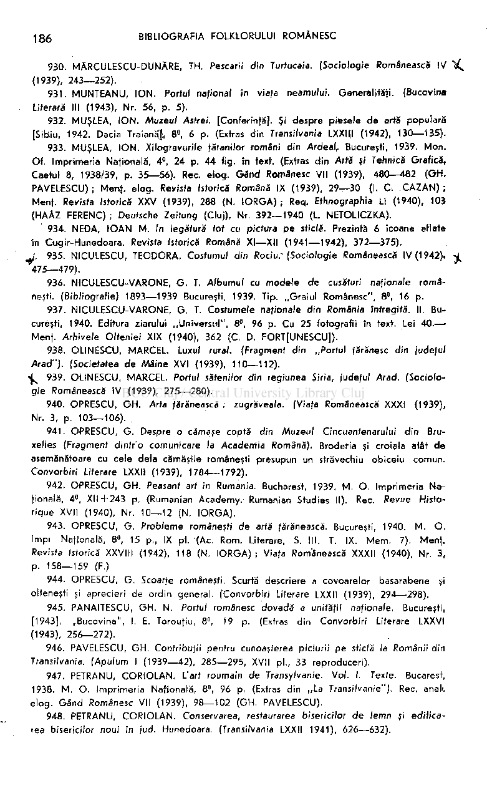

- 930. MÂRCULESCU-DUNĂRE, TH. Pescarii din Turtucaia. (Sociologie Românească IV

(1939), 243—252) .

- 931 . MUNTEANU , ION . Porfuf naţional în viaţa neamului. Generalităţi. (Bucovina

Literară III (1943), Nr. 56, p. 5).

- 932. MUŞLEA, ION . Muzeu l Astrei. [Conferinţă]. Şi despre piesele d e artă populară

[Sibiu, 1942. Dacia Traiană], 8°, 6 p. (Extras din Transilvania LXXIfl (1942), 130—135) .

- 933. MUŞLEA, ION . Xilogravurile ţărani/or români din Ardeal,. Bucureşti, 1939. Mon .

Of. Imprimeria Nafionalä, 4°, 24 p. 44 fig . în text. (Extras din Artă şi Tehnică Grafică, Caetul 8, 1938/39, p. 35—56) . Rec. elog . Gân d Românesc VII (1939), 480—48 2 (GH . PAVELESCU) ; Meri}, elog . Revista Istorică Română IX (1939), 29—3 0 (I. C. CAZAN ) ; Ment. Revista Istorică XXV (1939), 288 (N. IORGA ) ; Req. Efhnographia LI (1940), 103 (HAÂZ FERENC) ; Deutsche Zeitung (Cluj), Nr. 392—194 0 (L. NETOLICZKA).

- 934. NEDA, IOA N M. fn legătură fot cu pictura p e sticlă. Prezintă 6 icoane aflate

în Cugir-Hunedoara. Revista Istorică Română XI—XII (1941—1942), 372—375) .

- 935. NICULESCU, TEODORA. Costumul din Rociu.- (Sociologie Românească IV (1942).

'475—479) .

- 936. NICULESCU-VARONE, G . T. Albumu l cu model e de cusături naţionale româ ­

neşti. (Bibliografie) 1893—1939 Bucureşti, 1939. Tip. „Graiu l Românesc", 8°, 16 p.

- 937. NICULESCU-VARONE, G . T. Costumele naţionale din România întregită. II. Bu­

cureşti, 1940. Editura ziarului „Universul" , 8°, 96 p. Cu 25 fotografii în text. Lei 40. Ment. Arhivele Olteniei XIX (1940), 362 (C. D. FORT[UNESCU]).

- 938. OLINESCU, MARCEL. Luxul rural. (Fragment din „Portul ţărănesc din judeţu l

Arad") . (Societatea de Mâin e XVI (1939), 110—112).

- 939. OLINESCU, MARCEL. Portul sătenilor din regiunea Siria, judeţul Arad. (Sociolo­

gie Românească IV (1939), 275—280) .

- 940. OPRESCU, GH . Arfa ţărănească : zugrăveala. (Viaţa Românească XXXI (1939),

Nr. 3, p. 103—106).

- 941 . OPRESCU, G . Despre o cămaşe coptă din Muzeul Cincuantenarului din Bru­

xelles (Fragment dintr'o comunicare la Academi a Română). Broderia şi croiala atât d e asemănătoare cu cele delà cămăşile româneşti presupun un străvechiu obiceiu comun . Convorbiri Literare LXXII (1939), 1784—1792).

942. OPRESCU, GH . Peasanf art in Rumania. Bucharest, 1939. M. O. Imprimeria Na ţională, 4°, XII + 243 p. (Rumanian Academy . Rumanian Studies II). Rec. Revue Historique XVII (1940), Nr. 10—12 (N . IORGA).

- 943. OPRESCU, G . Probleme româneşti de artă ţărănească. Bucureşti, 1940. M. O .

Impi Naţională, 8°, 15 p., IX pl . (Ac. Rom. Literare, S. III. T. IX. Mem . 7). Menf. Revista Istorică XXVIII (1942), 118 (N. IORGA) ; Viaţa Românească XXXII (1940), Nr. 3, p. 158—159 (F.)

- 944. OPRESCU, G . Scoarţe româneşti. Scurtă descriere a covoarelor basarabene şi

olteneşti şi aprecieri de ordin general. (Convorbiri Literare LXXII (1939), 294—298) .

- 945. PANAITESCU, GH . N. Portul românesc dovadă a unităţii naţionale. Bucureşti,

[1943]. „Bucovina" , I. E. Toroutiu, 8°, 19 p. (Extras din Convorbiri Literare LXXVI

(1943), 256—272) .

- 946. PAVELESCU, GH . Contribuţii pentru cunoaşterea picturii pe sticlă la Românii din Transilvania. (Apulum I (1939—42), 285—295 , XVII pl., 33 reproduceri).
- 947. PETRANU, CORIOLAN . L'art roumain de Transylvanie. Vol. I. Texte. Bucarest,

1938. M. O. Imprimeria Nafionalä, 8°, 96 p. (Extras din „L a Transilvanie"). Rec. anali, elog . Gân d Românesc VII (1939), 98—10 2 (GH . PAVELESCU).

- 948. PETRANU, CORIOLAN . Conservarea, restaurarea bisericilor de lemn şi edifica­

rea biserici/or noui în jud. Hunedoara. (Transilvania LXXII 1941), 626—632) .

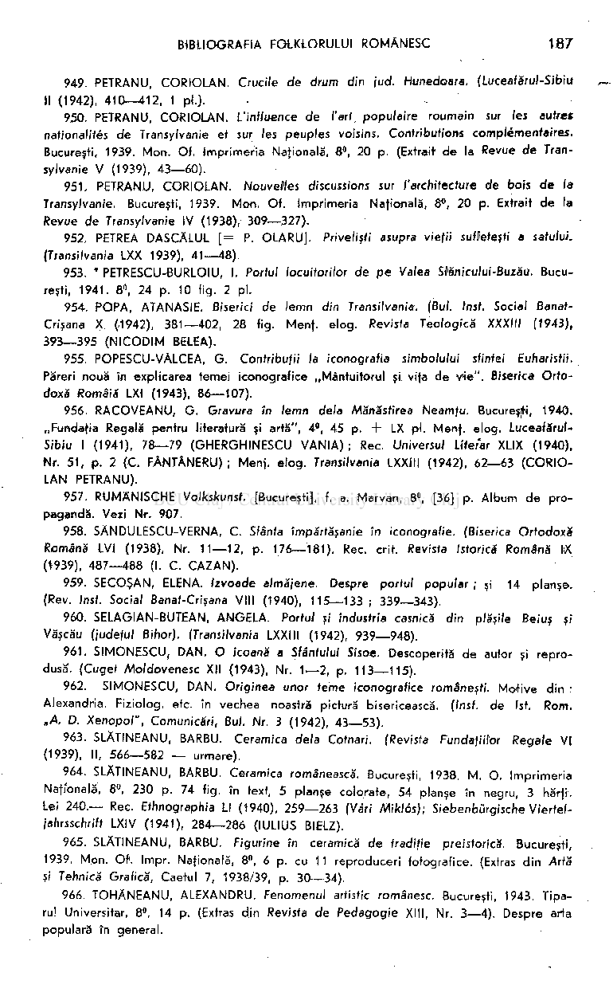

- 949. PETRANU, CORIOLAN . Cruci/e de drum din jud . Hunedoara. (Luceafărul-Sibiu

II (1942), 410—412 , 1 pl.). -

- 950. PETRANU, CORIOLAN . L'influence de l'art, populair e roumain sur les autres

nationalités de Transylvanie et sur les peuples voisins. Contributions comp/émenfaires. Bucureşti, 1939. Mon . Of. Imprimeria Nafională, 8°, 20 p. (Extrait d e la Revue d e Transylvanie V (1939), 43—60) .

- 951 . PETRANU, CORIOLAN . Nouvelles discussions sur l'architecture de bois de la

Transylvanie. Bucureşti, 1939. Mon . Of. Imprimeria Nafională, 8°, 20 p. Extrait d e la Revue de Transylvanie IV (1938), 309—327) .

- 952. PETREA DASCĂLUL [ = P. OLARU] . Privelişti asupra vieţii sufleteşti a satului.

(Transilvania LXX 1939), 41—48) .

- 953. * PETRESCU-BURLOIU, I. Porfuf locuitori/or de pe Valea Sfănicului-Buzău. Bucu­

reşti, 1941. 8°, 24 p. 10 fig. 2 pl .

- 954. POPA, ATANASIE. Biserici de lemn din Transilvania. (Bul. Inst. Social BanatCrişana X. (1942), 381—402 , 28 fig. Menf. elog. Revista Teologică XXXIII (1943), 393—39 5 (NICODI M BELEA).
- 955. POPESCU-VÂLCEA, G. Contribuţii la iconografia simbolului sfintei Euharistii. Păreri nouă în explicarea teme i iconografice „Mântuitorul şi vifa de vie" . Biserica Orto doxă Româiă LXI (1943), 86—107) .
- 956. RACOVEANU , G. Gravura in lemn dela Mănăstirea Neamţu. Bucureşjti, 1940. „Fundafia Regală pentru literatură şi artă" , 4°, 45 p. + LX pi . MenJ. elog. LuceafărulSibiu I (1941), 78—7 9 (GHERGHINESCU VANIA ) ; Rec. Universul Literar XUX (1940), Nr. 51 , p. 2 (C. FÂNTÂNERU) ; Menj . elog . Transilvania LXXIII (1942), 62—6 3 (CORIO LAN PETRANU).
- 957. RUMÄNISCHE Volkskunst. [Bucureşti], f. a. Marvan, 8°, [36] p. Albu m d e pro ­

pagandă. Vezi Nr. 907.

- 958. SÄNDULESCU-VERNA, C. Sfânta împărtăşanie în iconografie. (Biserica Ortodox ă

Română LVI (1938), Nr. 11—12 , p. 176—181). Rec. crit. Revista Istorică Română IX

(1939), 487—48 8 (I. C. CAZAN) .

- 959. SECOŞAN, ELENA. Izvoade almăjene. Despre portul popular ; şi 14 planşe.

(Rev. Inst. Social Banat-Crişana VIII (1940), 115—133 ; 339—343).

- 960. SELAGIAN-BUTEAN, ANGELA . Portuf şi industria casnică din plăşi/e Beiuş şi

Vaşcău [judeţul Bihor). (Transilvania LXXIII (1942), 939—948) .

- 961. SIMONESCU , DAN . O icoană a Sfântului Sisoe. Descoperită de autor şi repro ­

dusă. (Cuget Moldovenes c XII (1943), Nr. 1—2, p. 113—115).

- 962. SIMONESCU, DAN . Originea unor teme iconografice româneşti. Motiv e din •

Alexandria, Fiziolog, etc. în vechea noastră pictură bisericească. (Insf. de Ist. Rom. „A . D. Xenopol" , Comunicări, But. Nr. 3 (1942), 43—53) .

963. SLÄTINEANU, BARBU. Ceramica dela Cotnari. (Revista Fundaţiilor Regale VI

(1939), II, 566—58 2 — urmare).

- 964. SLÄTINEANU, BARBU. Ceramica românească. Bucureşti, 1938. M. O. Imprimeri a Nafională, 8°, 230 p. 74 fig. în text, 5 planşe colorate, 54 planşe în negru, 3 hărţf. Lei 240. — Rec. Ethnographia LI (1940), 259—26 3 (Vâri Miklôs); Siebenbürgische Vierteljahrsschrift LXIV (1941), 284—28 6 (IULIUS BIELZ).
- 965. SLÄTINEANU, BARBU. Figurine in ceramică d e tradiţie preistorică. Bucureşti,

1939. Mon . Of. Impr. Naţională, 8°, 6 p. cu 11 reproduceri fotografice. (Extras di n Arfă şi Tehnică Grafică, Caetul 7, 1938/39, p. 30—34) .

966. TOHÄNEANU , ALEXANDRU. Fenomenul artistic românesc. Bucureşti, 1943. Tiparul Universitar, 8°, 14 p. (Extras di n Revista de Pedagogi e XIII, Nr. 3—4). Despre arta populară în general.

