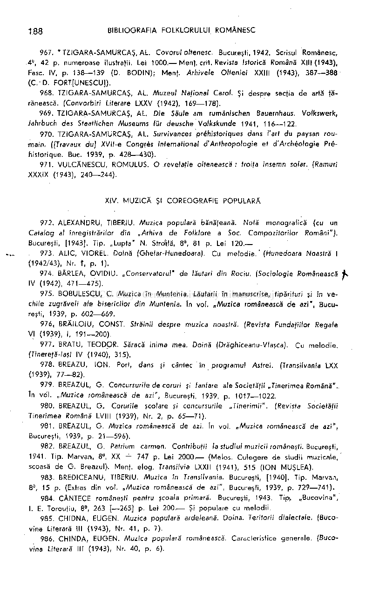

967. * TZIGARA-SAMURCAŞ, AL. Covorul oltenesc. Bucureşti, 1942. Scrisul Românesc, 4°, 42 p. numeroase ilustraţii. Lei 1000. — Menţ. crit. Revista Istorică Română XIII (1943), Fase. IV, p. 138—139 (D. BODIN) ; Menf. Arhivele Olteniei XXIII (1943), 387—38 8 (CD . FORTŢUNESCU]).

- 968. TZIGARA-SAMURCAŞ, AL. Muzeul National Carol, Şi despre secţia d e artă ţă­

rănească. (Convorbiri Literare LXXV (1942), 169—178).

- 969. TZIGARA-SAMURCAŞ, AL. Die Säule am rumänischen Bauernhaus. Volkswerk,

Jahrbuch des Staatlichen Museums lür deusche Volkskunde 1941, 116—122.

- 970. TZIGARA-SAMURCAŞ, AL. Survivances préhistoriques dans l'art du paysan rou­

main. ([Travaux du] XVII-e Congrès International d'Anthropologie et d'Archéologie Préhistorique. Bue. 1939, p. 428—430) .

- 971 . VULCĂNESCU, ROMULUS. O revelaţie oltenească: troiţa insemn solar. (Ramuri

XXXIX (1943), 240—244).

XIV. MUZIC Ă Şl COREOGRAFIE POPULARĂ

- 972. ALEXANDRU, TIBERIU. Muzica populară bănăţeană. Notă monografică (cu un

Catalog al înregistrărilor din „Arhiva de Folklore a Soc. Compozitorilor Români"). Bucureşti, [1943]. Tip. „Lupta " N. SWilă , 8°, 81 p. Lei 120. —

- 973. ALIC, VIOREL. Doină (Ohelar-Hunedoara). Cu melodie . ' (Hunedoara Noastră I

(1942/43), Nr. f, p. 1).

- 974. BÂRLEA, OVIDIU . „Conservatorul" de lăutari din Rociu. (Sociologie Românească

IV (1942), 471—475) .

- 975. BOBULESCU, C. Muzica în Muntenia. Lăutarii în manuscrise, tipărituri şi în ve ­

chile zugrăveli ale bisericilor din Muntenia. In voi. „Muzica românească de azi" , Bucureşti, 1939, p. 602—669 .

- 976. BRĂILOIU, CONST. Străinii despre muzica noastră. (Revista Fundaţiilor Regale

VI (1939), I, 191—200).

- 977. BRATU, TEODOR. Săracă inima mea. Doină (Drăghiceanu-VIasca). Cu melodie .

(Tinereţă-laşi IV (1940), 315).

- 978. BREAZU, ION . Port, dans şi cântec în programu l Astrei. (Transilvania LXX

- (1939), 77—82).

- 979. BREAZUL, G. Concursuri/e de coruri şi fanfare ale Societăţii „Tinerimea Română" .

Tn voi. „Muzica românească de azi", Bucureşti, 1939, p. 1017—1022.

- 980. BREAZUL, G . Corurile şcolare şi concursurile „Tinerimii". (Revista Societăţii

Tinerimea Română LVIII (1939), Nr. 2, p. 65—71) .

- 981 . BREAZUL, G Muzica românească de azi. In voi. „Muzica românească de azi",

Bucureşti, 1939, p. 21—596) .

- 982. BREAZUL, G Patrium carmen. Contribuţii la studiul muzicii româneşti. Bucureşti,

1941. Tip. Ma rvan, 8°, XX -f- 747 p. Lei 2000.'— (Melos. Culegere de studii muzicale, scoasă de G. Breazul). Menţ. elog . Transifvia LXXII (1941), 515 (IO N MUŞLEA).

- 983. BREDICEANU, TIBERIU. Muzica in Transilvania. Bucureşti, [1940]. Tip. Marvan,

8°, 15 p. (Extras din voi. „Muzic a românească de azi" , Bucureşti, 1939, p. 729—741) .

- 984. CÂNTECE româneşti pentru şcoala primară. Bucureşti, 1943. Tip. „Bucovina" ,

I. E. Torouţiu, 8°, 263 [—265] p. Lei 200. — Şi populare cu melodii .

- 985. CHIDNA, EUGEN. Muzica populară ardeleană. Doina. Teritorii dialectale. (Buco­

vina Literară III (1943), Nr. 41 , p. 7).

- 986. CHINDA, EUGEN. Muzica populară românească. Caracteristice generale. (Buco­

vina Literară III (1943), Nr. 40, p. 6).

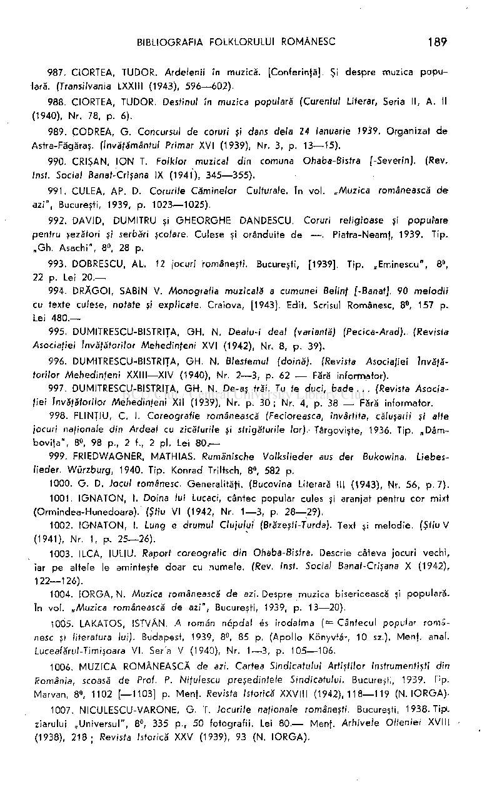

- 987. CIORTEA, TUDOR. Ardelenii în muzică. [Conferinţă]. Şi despre muzica popu ­

lară. (Transilvania LXXIII (1943), 596—602) .

- 988. CIORTEA, TUDOR. Destinul în muzica populară (Curentul Literar, Seria II, A. I|

(1940), Nr. 78, p. 6).

- 989. ÇODREA, G . Concursul de coruri ţi dans delà 24 ianuarie 1939. Organizat d e

Astra-Făgăraş. (învăţământul Primar XVI (1939), Nr. 3, p. 13—15).

- 990. CRIŞAN, IO N T. Folklor muzical din comuna Ohaba-Bistra [-Severin]. (Rev.

(nst. Social Banat-Crişana IX (1941), 345—355) .

- 991 . CULEA, AP. D. Corurile Cămine/or Culturale. In voi. „Muzica românească de

azi", Bucureşti, 1939, p. 1023—1025).

- 992. DAVID, DUMITRU şi GHEORGH E DANDESCU. Coruri religioase şi populare

pentru şezători şi serbări şcolare. Culese şi orânduite d e — . Piatra-Neamf, 1939. Tip. „Gh . Asachi", 8°, 28 p.

- 993. DOBRESCU, AL. 12 jocuri româneşti. Bucureşti, [1939]. Tip. „Eminescu" , 8°,

22 p. Lei 20. —

- 994. DRĂGOI , SABIN V. Monografia muzicală a cumunei Belinţ [-Banat], 90 melodi i

cu texte culese, notate şi explicate. Craiova, [1943], Edit. Scrisul Românesc, 8°, 157 p. Lei 480. —

- 995. DUMITRESCU-BISTRITA, GH . N. Dealu-i deal (variantă) (Pecica-Arad). (Revista

Asociaţiei Învăţătorilor Mehedinţeni XVI (1942), Nr. 8, p. 39).

- 996. DUMITRESCU-BISTRITA, GH . N. Blestemul (doină). (Revista Asociaţiei Învăţă­

torilor Mehedinţeni XXIII—XIV (1940), Nr. 2—3 , p. 62 — Fără informator).

- 997. DUMITRESCU-BISTRITA, GH . N. De-aş trăi. Tu te duci, bade . . . (Revista Asocia­

ţiei învăţătorilor Mehedinţen i XII (1939), Nr. p. 30 ; Nr. 4, p. 38 — Fără informator.

- 998. FLINŢIU, C. I. Coreogralie românească (Fecioreasca, învârtită, căluşarii şi alte

jocuri naţionale din Ardeal cu zicăturile şi strigăturile lor).- Târgovişte, 1936. Tip. „Dâm bovifa" , 8°, 98 p., 2 f., 2 pl . Lei 80. —

- 999. FRIEDWAGNER, MATHIAS. Rumänische Volkslieder aus der Bukowina. Liebes­

lieder. Würzburg, 1940. Tip. Konrad Triltsch, 8°, 582 p.

- 1000. G. D. locul românesc. Generalităfi. (Bucovina Literară III (1943), Nr. 56, p. 7).
- 1001. IGNATON , I. Doina lui Lucaci, cântec popular cules şi aranjat pentru cor mixt

(Ormindea-Hunedoara). (Ştiu VI (1942, Nr. 1—3, p. 28—29) .

- 1002. IGNATON , I. Lung e drumul Clujului (Brăzeşti-Turda). Text şi melodie. (Ştiu V

- (1941), Nr. 1, p. 25—26) .

- 1003. ILCA, IULIU. Raport coreografic din Ohaba-Bistra. Descrie câteva jocuri vechi ,

iar pe altele le aminteşte doar cu numele. (Rev. Inst. Social Banat-Crişana X (1942), 122—126)

- 1004. IORGA, N. Muzica românească de azi. Despre muzica bisericească şi populară.

In voi. „Muzica românească de azi", Bucureşti, 1939, p. 13—20).

- 1005. LAKATOS, ISTVÂN. A român népdal és irodalma ( = Cântecul popular româ­

nesc şi literatura lui). Budapest, 1939, 8°, 85 p. (Apoll o Konyvtâr, 10 sz.). Menf. anal. Luceafărul-Timişoara VI. Seria V (1940), Nr. 1—3, p. 105—106 .

1006. MUZIC A ROMÂNEASC Ă de azi. Cartea Sindicatului Artiştilor Instrumentişti din România, scoasă de Prof. P. Niţulescu preşedintele Sindicatului. Bucureşti, 1939. Tip. Marvan, 8°, 1102 [—1103] p. Menf. Revista Istorică XXVIII (1942), 118—119 (N. IORGA) .

- 1007. NICULESCU-VARONE, G. T. Jocurile naţionale româneşti. Bucureşti, 1938. Tip),

ziarului „Universul" , 8°, 335 p., 50 fotografii. Lei 80. — Menf. Arhivele Olteniei XVIII

(1938), 218 ; Revista Istorică XXV (1939), 93 (N. IORGA) .

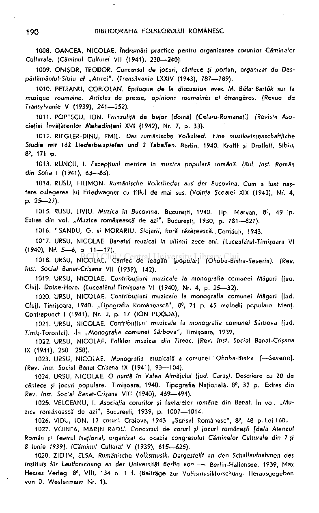

- 1008. OANCEA , NICOLAE. Îndrumări practice pentru organizarea coruri/or Căminelor

Culturale. (Căminul Cultural VII (1941), 238—240) .

- 1009. ONIŞOR, TEODOR. Concursul de jocuri, cânfece si porturi, organizat de Des-

părfămânful-Sibiu al „Asfrei" . (Transilvania LXXIV (1943), 787—789) .

- 1010. PfTRANU , CORIOLAN . Épilogue de la discussion avec M. Bêla-Bartok sur la

musique roumaine Articles de presse, opinions roumaines et étrangères. (Revue de Transylvanie V (1939), 241—252) .

- 1011. POPESCU, ION . Frunzulifă de bujor (doină) (Celaru-Romanaţ.) (Revista Aso­

ciaţiei Învăţătorilor Mehedinţeni XVI (1942), Nr. 7, p. 33).

- 1012. RIEGLER-DINU, EMIL. Das rumänische Volkslied. Eine musikwissenschaftliche

Studie mit 162 Liederbeispielen und 2 Tabellen. Berlin, 1940. Krafft şi Drotleff, Sibiu, 8», 171 p.

- 1013. RUNCU, I. Excepfiuni metrice in muzica populară română. (Bul. Inst. Român

din Soţia I (1941), 63—83) .

- 1014. RUSU, FILIMON . Rumänische Volkslieder aus' der Bucovina. Cu m a luat naş­

tere culegerea lui Friedwagner cu titlul d e mai sus. (Voinţa Şcoalei XIX (1942), Nr. 4, p. 25-27) .

- 1015. RUSU, LIVIU. Muzica în Bucovina. Bucureşti, 1940. Tip. Marvan, 8°, 49 p.

Extras din voi. „Muzica românească de azi", Bucureşti, 1930, p. 781—827).

- 1016. * SANDU, G . şi MORARIU . Sfejarii, horă răzăşească. Xernăufi , 1943.
- 1017. URSU, NICOLAE Banatul muzical in ultimii zece ani. (Lucealărul-Timişoara VI

(1940), Nr

1

. 5—6 , p. 11—17).

- 1018. URSU, NICOLAE. Cântec d e leagăn (popu/ar) (Ohoba-Bisfra-Severin). (Rev.

Inst. Social Banat-Crişana VII (1939), 142).

- 1019. URSU, NICOLAE . Confribufiuni muzicale la monografia comunei Măgur i (jud.

Cluj). Doine-Hore. (Luceafărul-Timişoara VI (1940), Nr. 4, p. 25—32) .

- 1020. URSU, NICOLAE. Confribufiuni muzicale la monografia comunei Măgur i (jud.

Cluj). Timişoara, 1940. „Tipografia Românească", 8°, 71 p. 45 melodi i populare. Menj . Contrapunct I (1941), Nr. 2, p. 17 (IO N POGDA) .

- 1021. URSU, NICOLAE. Confribufiuni muzicale la monografia comunei Sârbova (jud.

Timiş-Toronfal). în „Monografi a comunei Sârbova", Timişoara, 1939.

- 1022. URSU, NICOLAE. Folklor muzical din Timoc. (Rev. Inst. Social Banat-Crişana

IX (1941), 250—258) .

- 1023. URSU, NICOLAE. Monografia muzicală a comunei Ohoba-Bisfra [—Severin).

(Rev. Insf. Social Banat-Crişana IX (1941), 93—104) .

- 1024. URSU, NICOLAE. O nuntă in Valea Almăjului (jud. Caras). Descriere cu 20 d e

cântece şi jocuri populare . Timişoara, 1940. Tipografia Nafională, 8°, 32 p. Extras din Rev. Inst. Social Banat-Crişana VIII (1940), 469—494) .

- 1025. VELCEANU, I. Asociaţia corurilor şi fanfarelor române din Banat. In voi. „Mu­

zica românească de azi", Bucureşti, 1939, p. 1007—1014.

- 1026. VIDU , ION . 12 coruri. Craiova, 1943. „Scrisul Românesc", 8», 48 p. Lei 160. —
- 1027. VOINEA, MARI N RADU. Concursul de coruri şi jocuri româneşti fdela Ateneul

Român şi Teatrul Naţional, organizat cu ocazia congresului Căminelor Culturale din 7 şi 8 Iunie 1939]. (Căminul Culfurat V (1939), 615—625) .

- 1028. ZIEHM, ELSA. Rumänische Volksmusik. Dargestellt an den Schallaufnahmen des

Instituts für Laufforschung an der Universität Berfin von — . Berlin-Hallensee, 1939, Max Hesses Verlag. 8°, VIII, 134 p. 1 f. (Beiträge zur Volksmusikforschung. Herausgegeben vo n D. Wesfermann Nr. 1).

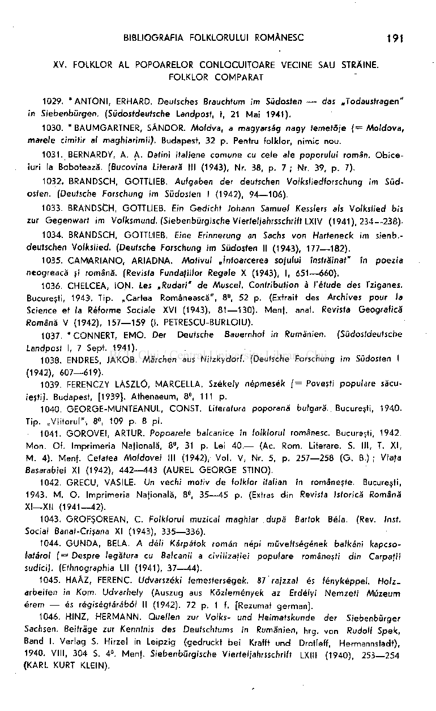

XV. FOLKLOR AL POPOARELOR CONLOCUITOAR E VECINE SAU STRĂINE. FOLKLOR COMPARA T

- 1029. * ANTONI , ERHARD. Deutsches Brauchtum im Südosten — das .Jodaustragen"

in Siebenbürgen. (Südosfdeutsche Landposf, I, 2 t Mai 1941).

- 1030. "BAUMGARTNER , SÂNDOR. Moldva, a magyarsäg nagy femefô/e ( = Moldova ,

marele cimitir al maghiarimii). Budapest, 32 p. Pentru folklor, nimic nou .

- 1031. BERNARDY, A. A. Dafini italiene comun e cu cele ale poporulu i român. Obice ­

iuri la Bobotează. (Bucovina Literară III (1943), Nr. 38, p. 7 ; Nr. 39, p. 7).

- 1032. BRANDSCH, GOTTLIEB. Aufgabe n der deutschen Volksliedforschung im Süd­

osten. (Deutsche Forschung im Südosten I (1942), 94—106) .

- 1033. BRANDSCH, GOTTLIEB. Ein Gedicht Johann Samuel Kesslers als Volkslied bis

zur Gegenwart im Volksmund. (Siebenbürgische Vierfel/ahrsschrift LXIV (1941), 234—238)-

- 1034. BRANDSCH, GOTTLIEB. Eine Erinnerung an Sachs von Harfeneck im sienb.-

deufschen Volkslied. (Deutsche Forschung im Südosten II (1943), 177—182).

- 1035. CAMIARIANO, ARIADNA. Motivul „Întoarcerea soţului înstrăinat" în poezi a

neogreacă si română. (Revista Funda/iilor Regale X (1943), I, 651—660).

- 1036. CHELCEA, ION . Les „Rudari" de Muscel. Contribution à l'étude des Tziganes.

Bucureşti, 1943. Tip. „Cartea Românească", 8°, 52 p. (Extrait des Archives pour la Science et la Réforme Sociale XVI (1943), 81—130) . Menf. anal. Revista Geografică Română V (1942), 157—15 9 (I. PETRESCU-BURLOIU).

- 1037. * CONNERT, EMO . Der Deutsche Bauernhof in Rumänien. (Südostdeutsche

Landpost I, 7 Sept. 1941).

- 1038. ENDRES, JAKOB. Märchen aus Nitzkydorf. (Deutsche Forschung i m Südosten I

(1942), 607—619) .

- 1039. FERENCZY LÄSZLÖ, MARCELLA Székely népmesék [ = Poveşti populare secu­

ieşti]. Budapest, [1939}. Athenaeum, 8°, 111 p.

- 1040. GEORGE-MUNTEANUL , CONST. Literatura poporană bulgară. Bucureşti, 1940.

Tip. „Viitorul" , 8°, 109 p. 8 pl .

- 1041. GOROVEI , ARTUR. Popoa/ele balcanice în folkloruf românesc. Bucureşti, 1942.

Mon . Of. Imprimeria Nafională, 8°, 31 p. Lei 40. — (Ac. Rom . Literare. S. III, T. XI , M . 4). Menf. Cetatea Moldovei III (1942), Vol . V, Nr. 5, p. 257—258 (G . B.) ; Viata Basarabiei XI (1942), 442—44 3 (AUREL GEORG E STINO).

1042. GRECU, VASILE. Un vechi motiv d e folklor italian în româneşte. Bucureşti,

1943. M. O . Imprimeria Nafională, 8°, 35—4 5 p. (Extras di n Revista Istorică Română XI—XII (1941—42).

- 1043. GROFŞOREAN, C. Folklorul muzical maghiar după Bartok Béla. (Rev. Inst.

Social Banat-Crişana XI (1943), 335—336) .

- 1044. GUNDA , BELA. A déli Kärpäfok român népi mûvelfségének balkâni kapcso-

htârol (= Despre legătura cu Balcanii a civilizaţiei populare româneşti din Carpaţii sudici). (Ethnographia LII (1941), 37—44) .

- 1045. HAÂZ , FERENC. Udvarszéki femesterségek. 87 rajzzal és lényképpel. Holz.

arbeiten in Korn. Udvarhely (Auszug aus Kôzlemények az Erdélyi Nemzef i Müzeum érem — és régiségtârâbol II (1942). 72 p. 1 f. [Rezumat german] .

- 1046. HINZ, HERMANN . Quellen zur Volks- un d Heimafskunde der Siebenbürger

Sachsen. Beiträge zur Kenntnis des Deutschtums in Rumänien, hrg. von Rudolf Spek, Band I. Verlag S. Hirzel in Leipzig (gedruckt be i Krafft un d Drotleff, Hermannstadt), 1940. VIII, 304 S. 4°. Menf. Siebenbürgische Vierfel/ahrsschrift LXIII (1940), 253—25 4 (KARL KURT KLEIN).

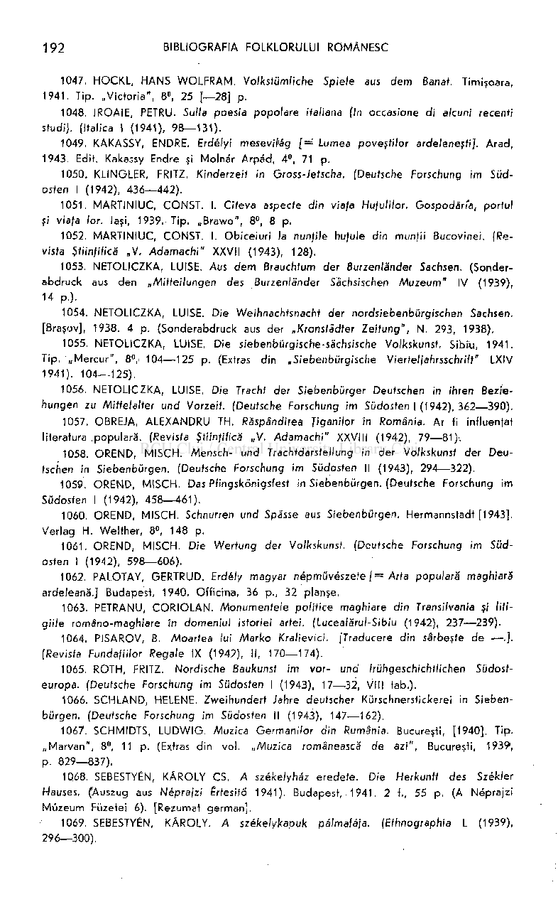

- 1047. HOCKL, HANS WOLFRAM Volkstümliche Spiele aus dem Banat. Timişoara,

1941. Tip. „Victoria" , 8°, 25 [—28] p.

- 1048. IROAIE, PETRU. Sulla poesia popolare italiana (In occasione di alcuni recenţi

sfudi). (Italica I (1941), 98—131) .

- 1049. KAKASSY, ENDRE. Erdélyi mesevilâg [= Lumea poveştilor ardeleneşti]. Arad ,

1943. Edit. Kakassy Endre şi Molnăr Arpâd , 4°, 71 p.

- 1050. KLINGLER, FRITZ. Kinderzelf in Gross-Jetscha. (Deutsche Forschung im Süd­

osten I (1942), 436—442) .

- 1051. MARTINIUC, CONST. I. Cîfeva aspecte din viaţa Huţulilor. Gospodăria, portul

şi viaţa lor. laşi, 1939. Tip. „Brawo" , 8°, 8 p.

- 1052. MARTINIUC, CONST. I. Obiceiuri la nunţile hufule din munţii Bucovinei. (Re­

vista Ştiinţifică „V . Adamachi" XXVII (1943), 128).

- 1053. NETOLICZKA, LUISE. Aus de m Brauchtum der Burzenländer Sachsen. (Sonder­

abdruck aus de n „Mitteilunge n des Burzenländer Sächsischen Muzeum" IV (1939), 14 p.).

- 1054. NETOLICZKA, LUISE. Die Weihnachtsnacht der nordsiebenbürgischen Sachsen.

[Braşov], 1938. 4 p. (Sonderabdruck aus der „Kronstädter Zeitung", N. 293, 1938).

- 1055. NETOLICZKA, LUISE. Die siebenbürgische-sächsische Volkskunst. Sibiu, 1941.

Tip. „Mercur" , 8°, 104—12 5 p. (Extras din „Siebenbürgische Viertel/'ahrsschriff" LXIV 1941). 104—125).

- 1056. NETOLICZKA, LUISE. Die Tracht der Siebenbürger Deutschen in ihren Bezie­

hungen zu Mittelalter und Vorzeit. (Deutsche Forschung im Südosten I (1942), 362—390) .

- 1057. OBREJA, ALEXANDRU TH. Răspândirea Ţiganilor în România. Ar fi influenţat

literatura .populară. (Revista Ştiinţifică „V. Adamachi" XXVIII (1942), 79—81)-.

- 1058. OREND, MISCH. Mensch- und Trachtdarsfellung in der Volkskunst der Deu­

tschen in Siebenbürgen. (Deutsche Forschung im Südosten II (1943), 294—322).

- 1059. OREND, MISCH. Das Pfingskönigsfest in Siebenbürgen. (Deutsche Forschung im

Südosten I (1942), 458—461) .

- 1060. OREND, MISCH. Schnurren und Spässe aus Siebenbürgen. Hermannstadt [1943].

Verlag H. Welther, 8°, 148 p.

- 1061. OREND, MISCH. Die Wertung der Volkskunst. (Deutsche Forschung im Süd­

osten I (1942), 598—606) .

- 1062. PALOTAY, GERTRUD. Erdély magyar népmûvészete [= Arta populară maghiară

ardeleană.] Budapest, 1940. Officina, 36 p., 32 planşe.

- 1063. PETRANU, CORIOLAN . Monumentele politice maghiare din Transilvania şi liti­

giile româno-maghiare în domeniul istoriei artei. (Luceafărul-Sibiu (1942), 237—239) .

- 1064. PISAROV, B. Moartea lui Marko Kralievici. [Traducere din sârbeşte de —.].

(Revista Fundaţiilor Regale IX (1942), II, 170—174).

- 1065. ROTH, FRITZ. Nordische Baukunst im vor- und frühgeschichfliehen Südosf-

europa. (Deutsche Forschung im Südosten I (1943), 17—32 , VIII tab.).

- 1066. SCHLAND, HELENE. Zweihundert Jahre deutscher Kürschnersfickerei in Sieben­

bürgen. (Deutsche Forschung im Südosten II (1943), 147—162).

- 1067. SCHMIDTS, LUDWIG . Muzica Germanilor din Rumânia. Bucureşti, [1940], Tip.

„Marvan" , 8°, 11 p. (Extras din voi. „Muzica românească de azi", Bucureşti, 1939, p. 829—837).

1Q68. SEBESTYÉN, KÂROLY CS. A székelyhâz eredete. Die Herkunft des Székler Hauses. (Auszug aus Néprajzi Ertesitö 1941). Budapest, 1941, 2 f., 55 p. (A Néprajzi Müzeu m Füzetei 6). [Rezumat german].

- 1069. SEBESTYÉN, KÂROLY. A székelykapuk pélmaléja. (Ethnographia L (1939),

296—300)

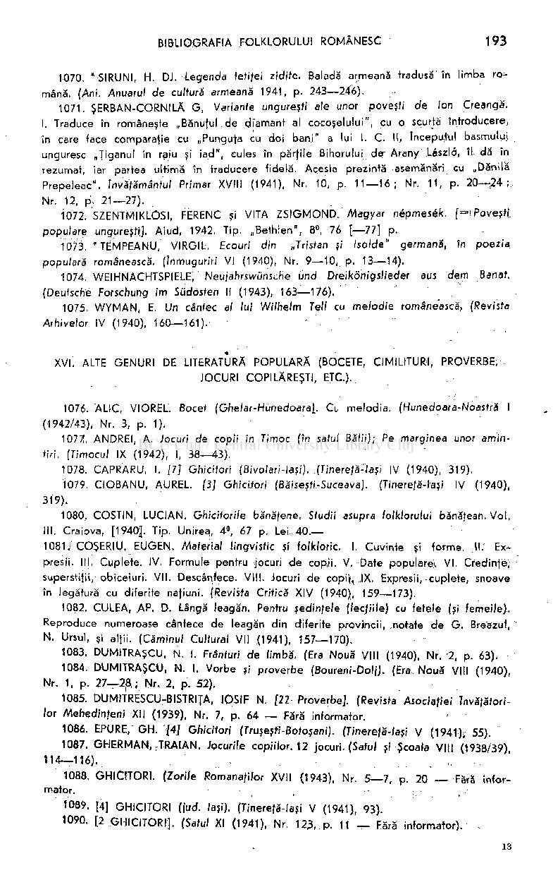

- 1070. * SIRUNI, H. DJ. Legenda feti/ei zidire. Baladă armeană tradusă' în limba ro ­

mână. (Ani. Anuarul de culturi armeană 1941, p. 243—246).

- 1071. ŞERBAN-CORNILĂ G, Variante ungureşti ale unor poveşti de Ion Creangă.

I. Traduce în româneşte „Bănuţul de diamant al cocoşelului", cu o scurtă Introducere, în care tace comparaţie cu „Punguţa cu doi bani " a lui I. C. II, începutul basmului unguresc „Ţiganul în raiu şi iad" , cules în părţile Bihorului der Arany Lâszlo, îl dă în rezumat, iar partea ultimă în traducere fidelă. Acesta prezintă asemănări cu „Dănila Prepeleac" învăţământul Primar XVIII (1941), Nr. 10, p. 11—16 ; Nr. 11 , p. 20—24 ; Nr. 12, p',, 21—27) .

- 1072. SZENTMIKLÖSI, FERENC şi VITA ZSIGMOND . /Magyar népmesék. [='Poveşr f

populare ungureşti]. Aiud , 1942. Tip. „Bethlen" , 8°, 76 [—77] p.

- 1073. * TËMPEANU, VIRGIL Ecouri din „Tristan şi Isolde" germană, In poezia

populară românească. (înmuguriri VI (1940), Nr. 9—10 , p. 13—14).

- 1074. WEIHNACHTSPIELE,' Neujahrswüns;.fie un d Dreikönigslieder aus dem Banat.

{Deutsche Forschung im Südosten II (1943), 163—176).

- 1075. WYMAN , E. Un cântec al lui Wilhelm Tell cu melodie românească, (Revista

Arhivelor IV (1940), 160—161)

XVI. ALTE GENURI DE LITERATURĂ POPULARĂ (BOCETE, CIMILITURI, PROVERBE, JOCURI COPILĂREŞTI, ETC.).

- 1076. ALIC, VIOREL. Bocet (Gfie/ar-Hunedoara]. Cu melodia . (Hunedoara-Noasträ I

(1942/43), Nr. 3, p. 1).

- 1077. ANDREI, A. Jocuri de copii în Timoc (în satul Bălii); Pe marginea unor amin­

tiri. (Timocul IX (1942), I, 38—43).

- 1078. CAPRARU, I. [7] Ghicitori (Bivolari-laşi). (Tinereţă-faşi IV (1940), 319).
- 1079. CIOBANU , AUREL. (3] Ghicitori (Băiseşfi-Suceava). (Tinereţă-îaşi IV (1940),

319).

- 1080

. COSTIN, LUCIAN . Ghicitori/e bănăţene. Studii asupra folk/orului bănăţean. Vol . III. Craiova, [1940]. Tip. Unirea, 4°, 67 p. Lei 40. 1081 , COŞERIU, EUGEN. Material lingvistic şi folkloric. I. Cuvinte şi forme . II. Expresii. III. Cuplete. IV. Formule pentru jocuri d e copii. V. Date popularei. VI . Credinţe, superstiţii, obiceiuri. VII. Descântece. VIII. Jocuri d e copi'i, IX. Expresii, cuplete, snoave în legătură cu diferite naţiuni. (Revista Critică XIV (1940), 159—173).

;

1082. CULEA, AP. D. Lângă leagăn. Pentru şedinţele (lecţiile) cu fetele (şi femeile). Reproduce numeroase cântece de leagăn din diferite provwicii, notate d e G. Breazul, N. Ursul, şi alţii. (Căminul Cultural VII (1941), 157—170).

- 1083. DUMITRAŞCU, N. I. Frânturi de limbă. {Era Nouă VIII (1940), Nr. 2, p. 63).
- 1084. DUMITRAŞCU, N. I. Vorbe şi proverb e (Boureni-Doli). (Era Nou ă VIII (1940),

Nr. 1, p. 27—2jB,i; Nr. 2, p. 52).

- 1085. DUMITRESCU-BISTRIŢA, IOSIF N. [22 Proverbe]. (Revista Asociaţiei Învăţători­

lor Mehedinfeni XII (1939), Nr. 7, p. 64 — Fără informator.

- 1086. EPURE, GH . [4] Ghicitori (Truşeşfj'-Bofoşani). (Tinereţă-/aşi V (1941), 55).
- 1087. GHERMAN , TRAIAN. Jocurile copii/or. 12 jocuri. (Satul şi Şcoala VIII (1938/39),

114—116). „ . '

- 1088. GHICITORI. (Zori/e Romanaţi/or XVII (1943), Nr. 5—7 , p. 20 — Fără infor­

mator.

- 1089. [4] GHICITORI (jud. laşi). (Tinereţă-laşi V (1941), 93).
- 1090. [2 GHICITORI] . (Satul XI (1941), Nr. 123, p. 11 — Fără informator).

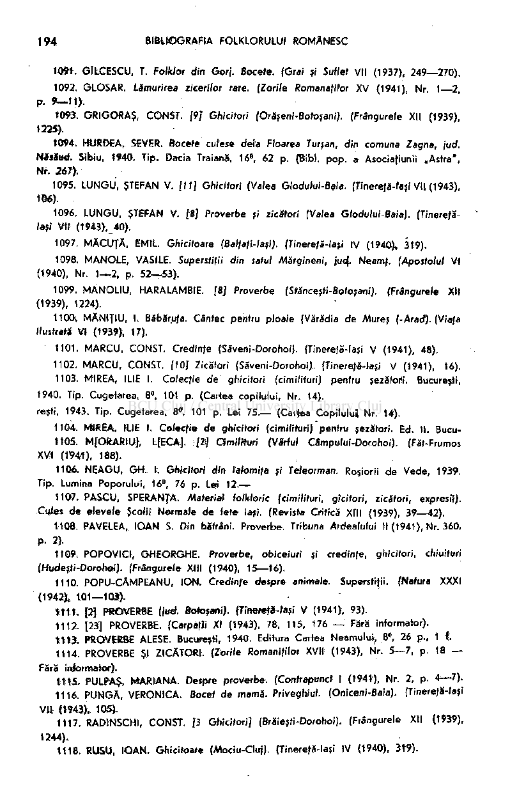

10*1. GlfcCESCU, T. Folklor din Gorj. Bocefe. fGrai si Suflet VII (1937), 249—270).

1092. GLOSAR. Lămurirea zicerilor rare. (Zorile Romanafitor XV (1941), Nr. 1—2,

p. *-tt> .

t093. GRIGORAŞ, CONST. [9/ Ghicitori (Orăşeni-Botoşani). (Frângurele XII (1939), 1225).

1094. HUROEA, SEVER. Bocete culese delà Floarea Turşan, din comuna Zagna, jud. HisSué. Sibiu, t940. Tip. Dacia Traiană, 16', 62 p. (Bibi. pop. a Asociaţiunii „Astra", Nf. 267).

- 1095. LUNGU, ŞTEFAN V. (11] Ghicitori (Valea Glodufui-Baia. (Tinereţă-laşi VII (1943),

1B6).

- 1096. LUNGU, ŞTEFAN V. [8] Proverbe şi zicători (Valea Glodului-Baia). (Tinerefă-

lasi VII (1943), 40).

- 1097. MÄCUTÄ, EMIL. Ghicitoare (Balfaţi-laşi). (Tinerefă-laţi IV (1940), 319).
- 1098. MANOLE, VASILE. Superstiţii din satul Mărgineni, jud). Neamţ. (Apostolul VI

(1940), Nr. 1-~2, p. 52—53).

- 1099. MANOLIU, HARALAMBIE. [8] Proverbe (Stănceşti-Boioşani). (Frêngurele XU

(1939), 1224).

- 1100. MÄN1TIU, I. Băbăr.ufa. Cântec pentru ploaie (Vărădia de Mures (-Arad). (Viafa

Ilustraţi VI (1939), 17).

- 1101. MARCU, CONST. Credinţe (Săveni-DorohoiJ. (Tinereţă-laşi V (1941), 48).
- 1102. MARCU, CONST. [10] Zicători (Săveni-DorohoiJ. (Tinereţă-laşi V (1941), 16).
- 1103. MIREA, ILIE I. Colecţie de ghicitori (cimilituri) pentru şezătorii. Bucureşti,

1940. Tip. Cugetarea, 8°, 101 p. (Caitea copilului, Nr. 14). reşti, 1943. Tip. Cugetarea, 8«, 101 p. Lei 75.— (Caitea Copilului Nr. 14).

1104. MIREA, HIE I. Co/ecfJe de ghicitori (cimilifuri) pentru şezători. Ed. II. BucuttOS. MfORARtU], L[ECA]. /*/ Cimilituri {VAVfuf Câmpu/ui-Dorohoi). (Făt-Frumos

XVI (t'94r1), 188).

- 1106. NEAGU, GH. I. Ghicitori din lahmifa şi Teleorman. Roşiorii de Vede, 1939.

Tip. Lumina Poporului, 16°, 76 p. Lei 12.—

- 1107. PASCU, SPERANŢA. Materia* folkJoric (cimilituri, gîc/rori, zicători, expresă).

Cujet de elevele Şcolii Normale de fete laşi. (Revista Critică Xfll (1939), 39—42).

- 1108. PAVELEA, IOAN S. Din bătrâni. Proverbe. Tribuna Ardealului II (1941), Nr. 360,

p. 2).

ti09. POPOVICI, GHEORGHE. Proverbe, obiceiuri şi credinţe, ghicitori, chiuituri (Hudeşti-Dorohoi). (Frângurefe XIII (1940), 15—16).

1110. POPU-CÂMPEANU, ION. Credinţe despre animale. Superstiţii. (Natura XXXI

(1942). 101—103).

tm . [2Ţ PROVERBE (jud. Botoşani). fTinerefâ-raji V (1941), 93).

1112. [23] PROVERBE. (CarpàfJi XI (1943), 78, 115, 176 — Fără informator). ttt3L PROVERBE ALESE. Bucureşti, 1940. Editura Cartea Neamului, 8», 26 p., 1 i

1114. PROVERBE Şl ZICĂTORI. (Zorite Romaniţifor. XVII (1943), Nr. 5—7, p. 18 Fără informator).

m & PULPAŞ, MARIANA. Despre proverbe. {Contrapunct I (1941), Nr. 2, p. 4—7).

- 1116. PUNGĂ, VERONICA. Bocet de mamă. Priveghiul. (Oniceni-Baia). (Tinereţă-laşi

VII. (1943), 105).

- 1117. RAD1NSCHI, CONST. [3 Ghicitori] (Brăieşti-Dorohoi). (Frângurele XII (1*39),

1244).

- 1118. RUSU, IOAN. Ghicitoare (Mociu-Cluj). {Tinereţă-laşi IV (1940), 3t9).

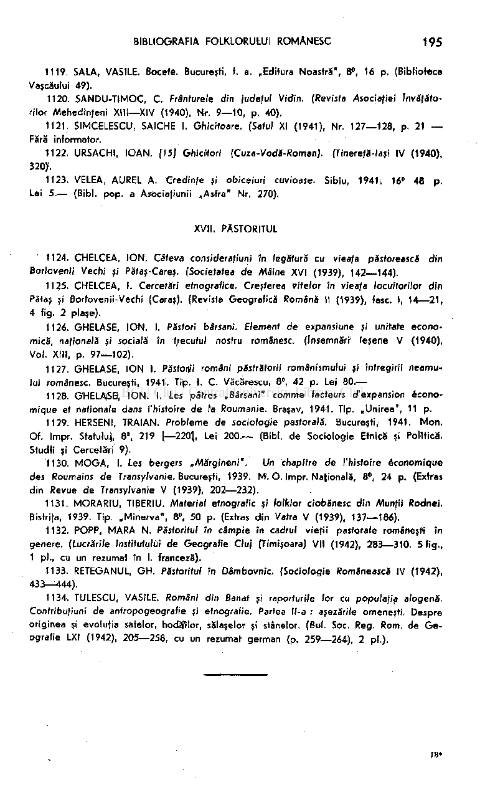

- 1119. SALA, VASILE. Bocete. Bucureşti, t. a. „Editura Noastră", 8°, 16 p. (Biblioteca

Vaşcăului 49).

- 1120. SANDU-TIMOC, C. Frânturele din judeful Vidïn. (Revista Asociaţiei Învăţăto­

rilor Mehedinfeni XIII—XIV (1940), Nr. 9—10, p. 40).

- 1121. SIMCELESCU, SAICHE I. Ghicitoare. (Setul XI (1941), Nr. 127—128, p. 21 —

Fără informator.

- 1122. URSACHI, IOAN. (15] Ghicitori (Cuza-Vodă-RomanJ. (Tineretă-lasi IV (1940),

320>.

- 1123. VELEA, AUREL A. Credinţe şi obiceiuri cuvioase. Sibiu, 1941i 16° 48 p.

Lei 5.— (Bibi. pop. a AsOciafiunii „Asfra" Nr. 270).

XVII. PĂSTORITUL

- 1124. CHELCEA, ION. Câteva considerafiuni în legătură cu vieafa păstorească din

Borlovenii Vechi şi Pătaş-Careş. (Societatea de Maine XVI (1939), 142—144).

- 1125. CHELCEA, I. Cercetări etnografice. Creşterea vitelor in vieafa locuitorilor din

Păfaş şi Borfovenii-Vechi (Caras). (Revista Geografică Română II (1939), fasc. I, 14—21, 4 fig. 2 plase).

1126. GHELASE, ION. I. Păstori bârsani. Element de expansiune şi unitate econo­

Ieşene V (1940), Voi. XIII, p. 97—102).

## mică, nafionalä şi socială în ijrecutul nostru românesc. (însemnări

1

- 1127. GHELASE, ION I. Păsfory'i români păstrătorii românismului şi întregirii neamu­

lui românesc. Bucureşti, 194t. Tip. I. C. Văcărescu, 8°, 42 p. Lej 80.—

- 1128. G'HELAiSB, ION. I. Les pâtres .Bârsani" comme facteurs d'expansion écono­

mique et nationale dans l'histoire de fa Roumanie. Braşav, 1941. Tip. „Unirea", 11 p.

- 1129. HERSENI, TRAIAN. Probleme de sociologie pastorală. Bucureşti, 1941. Mon.

Of. Impr. Statulujl, 8», 219 [—220], Lei 200.— (Bibi. de Sociologie Etnică şi Politică. Studii şi Cercetări 9).

1130. MOGA, I. Les bergers „Mărgineni". Un chapitre de l'histoire économique

des Roumains de Transylvanie. Bucureşti, 1939. M'. O. Impr. Naţională, 8", 24 p. (Extras din Revue de Transylvanie V (1939), 202—232).

- 1131. MORARIU, TIBERIU. Material etnografic şi folklor ciobănesc din Munţii Rodnei.

Bistrifa, 1939. Tip. „Minerva", 8», 50 p. (Extras din Vatra V (1939), 137—186).

- 1132. POPP, MARA N. Păstoritul in câmpie in cadrul vieţii pastorale româneşti în

genere. (Lucrările Institutului de Geografie Cluj (Timişoara) VII (1942), 283—310. 5 fig., 1 pl., cu un rezumat în I. franceză):.

- 1133. RETEGANUL, GH. Păstoritul în Dâmbovnic. (Sociologie Românească IV (1942),

433—444).

- 1134. TULESCU, VASILE. Români din Banat şi raporturile lor cu populaţia alogenă.

Contribufiuni de anfropogeografie şi etnografie. Partea ll-a : aşezările omeneşti. Despre

originea şi evolufia satelor, hodă>lor, sălaşelor şi stânelor. (Bul. Soc. Reg. Rom. de Geografie LXI (1942), 205—258, cu un rezumat german (p. 259—264), 2 pl.).

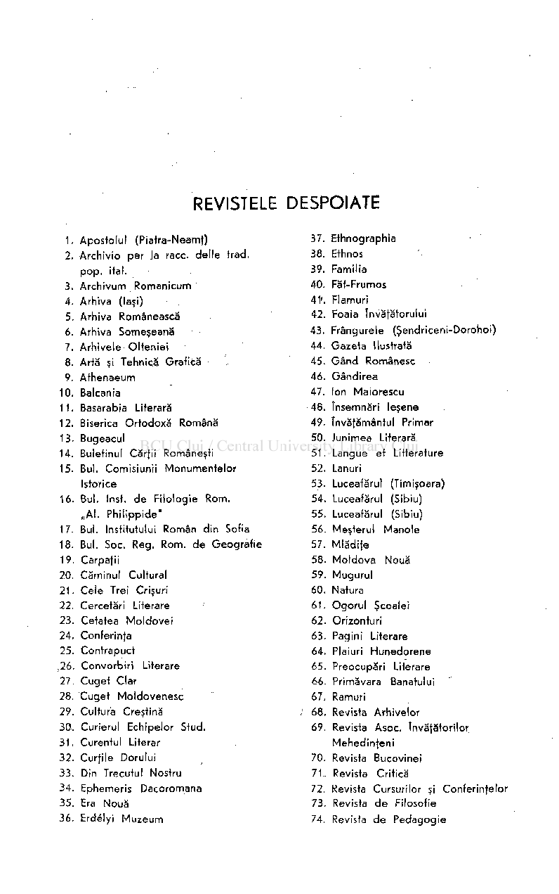

# REVISTELE DESPOIATE

- 37. Ethnographia
- 38. Ethnos
- 39. Familia
- 40. Făt-Frumos
- 41'. Flamuri
- 42. Foaia Învăţătorului
- 43. Frângurele (Şendriceni-Dorohoi)
- 44. Gazeta Ilustrată
- 45. Gân d Românesc
- 46. Gândirea
- 47. Ion Maiorescu
- 48. însemnări Ieşene
- 49. învăţământul Primar
- 50. Junimea Literară
- 51 . Langue et Littérature
- 52. Lanuri
- 53. Luceafărul (Timişoara)
- 54. Luceafărul (Sibiu)
- 55. Luceafărul (Sibiu)
- 56. Meşterul Manole
- 57. Mlădife
- 58. Moldov a Nouă
- 59. Mugurul
- 60. Natura
- 61 . Ogoru l Şcoalei
- 62. Orizonturi
- 63. Pagini Literare
- 64. Plaiuri Hunedorene
- 65. Preocupări Literare
- 66. Primăvara Banatului
- 67. Ramuri
- 68. Revista Arhivelor
- 69. Revista Asoc. învăţătorilor Mehedinfen
- 70. Revista Bucovinei
- 71 . Revista Critică
- 72. Revista Cursurilor şi Conferinţelor
- 73. Revista d e Filosofie
- 74. Revista d e Pedagogie

- 1. Apostolul (Piatra-NeamJ)
- 2. Archivio per la race. delle trad. pop . ital.
- 3. Archivum Romanicum
- 4. Arhiva (laşi)
- 5. Arhiva Românească
- 6. Arhiva Someşeană
- 7. Arhivele Olteniei
- 8. Artă şi Tehnică Grafică
- 9. Athenaeum
- 10. Balcania
- 11. Basarabia Literară
- 12. Biserica Ortodoxă Română
- 13. Bugeacul
- 14. Buletinul Cărfii Româneşti
- 15. Bul. Comisiunii Monumentelo r Istorice
- 16. Bul. Inst, d e Filologie Rom. „Al . Philippide "
- 17. Bul. Institutului Român din Sofia
- 18. Bul. Soc. Reg. Rom. d e Geografie
- 19. Carpafii
- 20. Căminul Cultural
- 21 . Cele Trei Crişuri
- 22. Cercetări Literare
- 23. Cetatea Moldove i
- 24. Conferinfa
- 25. Contrapuct ,26. Convorbiri Literare

- 27. Cuget Clar
- 28. Cuget Moldovenesc
- 29. Cultura Creştină
- 30. Curierul Echipelor Stud.
- 31 . Curentul Literar
- 32. Curfile Dorului
- 33. Din Trecutul Nostru
- 34. Ephemeris Dacoromâna
- 35. Era Nouă
- 36. Erdélyi Muzeu m

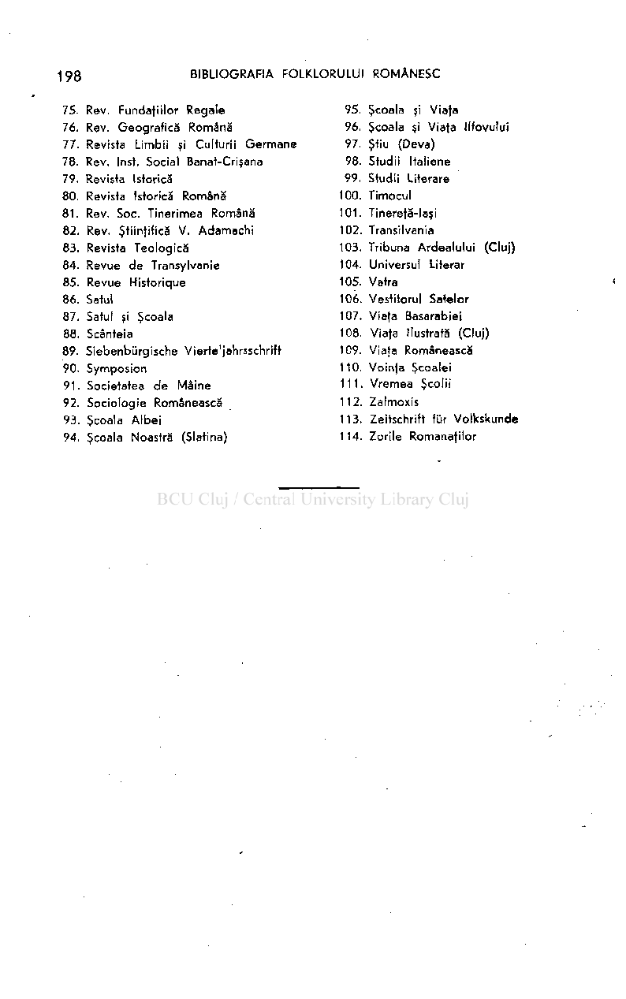

- 75. Rev. Fundaţiilor Regale
- 76. Rev. Geografică Română
- 77. Revista Limbii şi Culturii German e
- 78. Rev. Inst. Social Banat-Crişana
- 79. Revista Istorică
- 80. Revista Istorică Română
- 81 . Rev. Soc. Tinerimea Română
- 82. Rev. Ştiinţifică V. Adamachi
- 83. Revista Teologică
- 84. Revue d e Transylvanie
- 85. Revue Historique
- 86. Satul
- 87. Satul şi Şcoala
- 88. Scânteia
- 89. Siebenbürgische Vierte'jahrsschrift
- 90. Symposion
- 91 . Societatea d e Mâine
- 92. Sociologie Românească
- 93. Şcoala Albe i
- 94. Şcoala Noastră (Slatina)

- 95. Şcoala şi Viaţa
- 96. Şcoala şi Viaţa Ilfovului
- 97. Ştiu (Deva)
- 98. Studii Italiene
- 99. Studii Literare

1C0. Timocul

- 101. Tinereţă-laşi
- 102. Transilvania
- 103. Tribuna Ardealului (Cluj)
- 104. Universul Literar
- 105. Vatra
- 106. Vestitorul Satelor
- 107. Viaţa Basarabiei
- 108. Viaţa Ilustrată (Cluj)
- 109. Viaţa Românească
- 110. Voinţa Şcoalei
- 111. Vremea Şcolii
- 112. Zalmoxis
- 113. Zeitschrift für Volkskunde
- 114. Zorile Romanaţilor

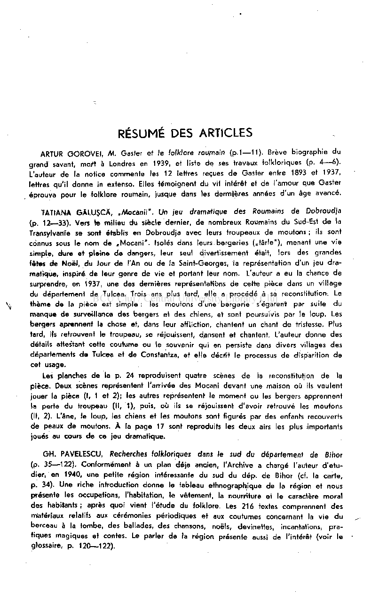

# RÉSUMÉ DES ARTICLES

ARTUR GOROVEI, M. Gaster et le folklore roumain (p.1—11). Brève biographie du grand savant, mort à Londres en 1939, e\ liste de ses travaux folkloriques (p. 4—6) L'auteur de la notice commente les 12 lettres reçues de Gaster entre 1893 et 1937, lettres qu'il donne in extenso. Elles témoignent du vif intérêt et de l'amour que Gaster éprouva pour le folklore roumain, jusque dans les dermlères années d'un âge avancé.

TATIANA GÄLUSCÄ, ./Mocanii". Un jeu dramatique des Roumains de Dobroudja (p. 12—33). Vers te milieu du siècle dernier, de nombreux Roumains du Sud-Est de la Transylvanie se sont établis en Dobroudja avec leurs troupeaux de moutons ; ils sont connus sous le nom de „Mocani". Isolés dans leurs bergeries („târle"), menant une vie simple, dure et pleine de dangers, leur seul divertissement était, lors des grandes fêtes de Noël, du Jour de l'An ou de la Saint-Georges, la représentation d'un jeu dramatique, inspiré de leur genre de vie et portant leur nom. L'auteur a eu la chance de surprendre, en 1937, une des dernières représentations de cette pièce dans un village du département de Tulcea. Trois ans plus tard, elle a procédé à sa reconstitution. Le thème de la pièce est simple : les moutons d'une bergerie s'égarent par suite du manque de surveillance des bergers et des chiens, et sont poursuivis par le loup. Les bergers aprerment la chose et, dans leur affliction, chantent un chant de tristesse. Plus tard, ils retrouvent le troupeau, se réjouissent, dansent eit chantent. L'auteur donne des détails attestant cette coutume ou le souvenir qui en persiste dans divers villages des départements de Tulcea et de Constantza, et elle décifit le processus de disparition de cet usage.

Les planches de la p. 24 reproduisent quatre scènes de la reconstitution de la pièce. Deux scènes représentent l'arrivée des Mocani devant une maison où ils veulent jouer la pièce (I, 1 et 2); les autres représentent le moment ou les bergers apprennent la perte du troupeau (II, 1), puis, où ils se réjouissent d'avoir retrouvé les moutons (II, 2). L'âne, le loup, les chiens et les moutons sont figurés par des enfants recouverts de peaux de moutons. À la page 17 sont reproduits les deux airs les plus importants joués au cours de ce jeu dramatique.

GH. PAVELESCU, Recherches folkloriques dans le sud du département de Bihor

(p. 35—122). Conformément à un plan déjà ancien, l'Archive a chargé l'auteur d'étudier, en 1940, une petite région intéressante du sud du dép. de Bihor (cf. la carte, p. 34). Une riche introduction donne le tableau ethnographique de la région et nous présente les occupations, l'habitation, le vêtement, la nourriture et le caractère moral des habitants; après quoi vient l'étude du folklore. Les 216 textes comprennent des matériaux relatifs aux cérémonies périodiques et aux coutumes concernant la vie du berceau à la tombe, des ballades, des chansons, noëls, devinettes, incantations, pratiques magiques et contes. Le parler de la région présente aussi de l'intérêt (voir le glossaire, p. 120—122).

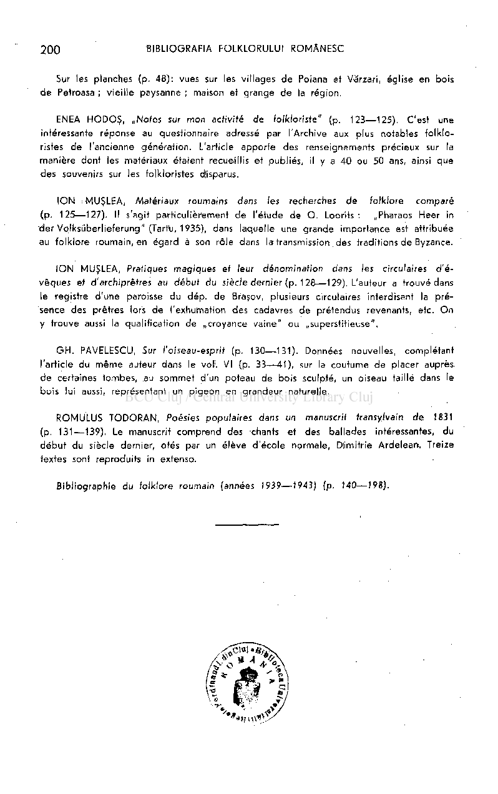

Sur les planches (p. 48): vues sur les villages d e Poiana et Vărzari, église en bois d e Petroasa ; vieille paysanne ; maison et grange d e la région.

ENEA HODOŞ , „Notes sur mon activité de folkloriste" (p. 123—125). C'est une intéressante réponse au questionnaire adressé par l'Archive aux plus notables folklo ristes de l'ancienne génération. L'article apporte des renseignements précieux sur la manière dont les matériaux étaient recueillis et publiés, il y a 40 ou 50 ans, ainsi que des souvenirs sur les folkloristes disparus.

IO N > MUŞLEA, Matériaux roumains dans les recherches de folklore comparé

(p. 125—127). Il s'agit particulièrement d e l'étude d e O . Loorits : „Pharaos Heer in der Volksüberlieferung" (Tartu, 1935), dans laquelle une grande importance est attribuée au folklore roumain, en égard à son rôle dans la transmission des traditions de Byzance.

IO N MUŞLEA, Pratiques magiques et leur dénomination dans les circulaires d'évêques et d'archiprêtres au début du siècle dernier (p. 128—129). L'auteur a trouvé dans le registre d'une paroisse du dép. de Braşov, plusieurs circulaires interdisant la présence des prêtres lors d e l'exhumation des cadavres de prétendus revenants, etc. O n y trouve aussi la qualification de „croyance vaine " o u ..superstitieuse",

GH . PAVELESCU, Sur l'oiseau-esprit (p. 130—131). Données nouvelles, complétant l'article du mêm e auteur dans le vot. VI (p. 33—41) , sur la coutume de placer auprès, de certaines tombes, au somme t d'un poteau de bois sculpté, un oiseau taillé dans le bois lui aussi, représentant un pigeon en grandeur naturelle.

ROMULUS TODORAN , Poésies populaires dans un manuscrit transylvain de 1831 (p. 131—139). Le manuscrit compren d des chants et des ballades intéressantes, du débu t du siècle dernier, otés par un élève d'école normale, Dlimitrie Ardelean . Treize fextes sont reproduits in extenso.

Bibliographie du folklore roumain {années 1939—1943) (p. 140—198).

